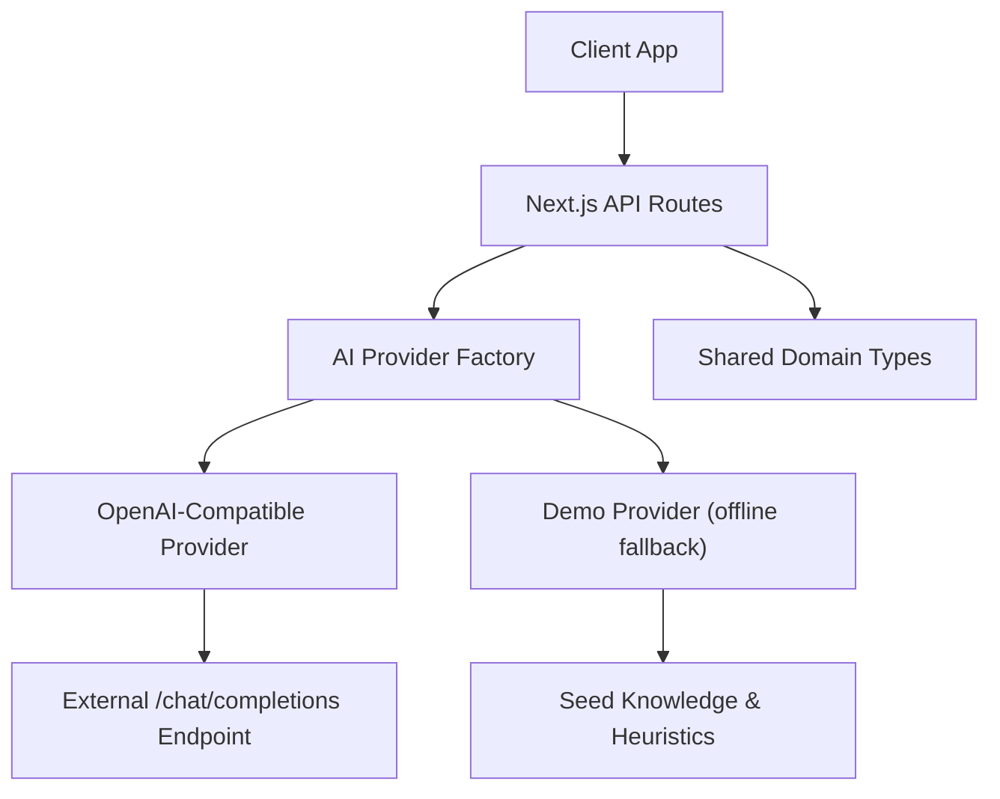
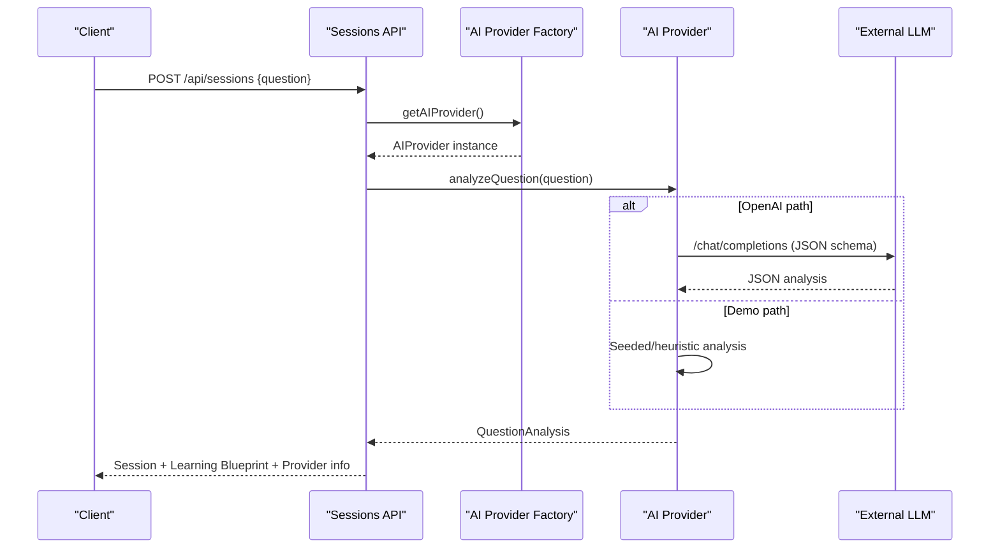
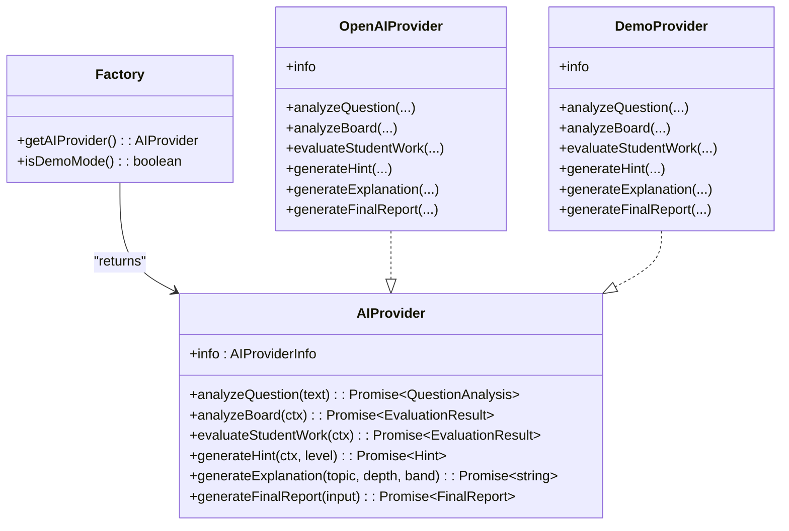
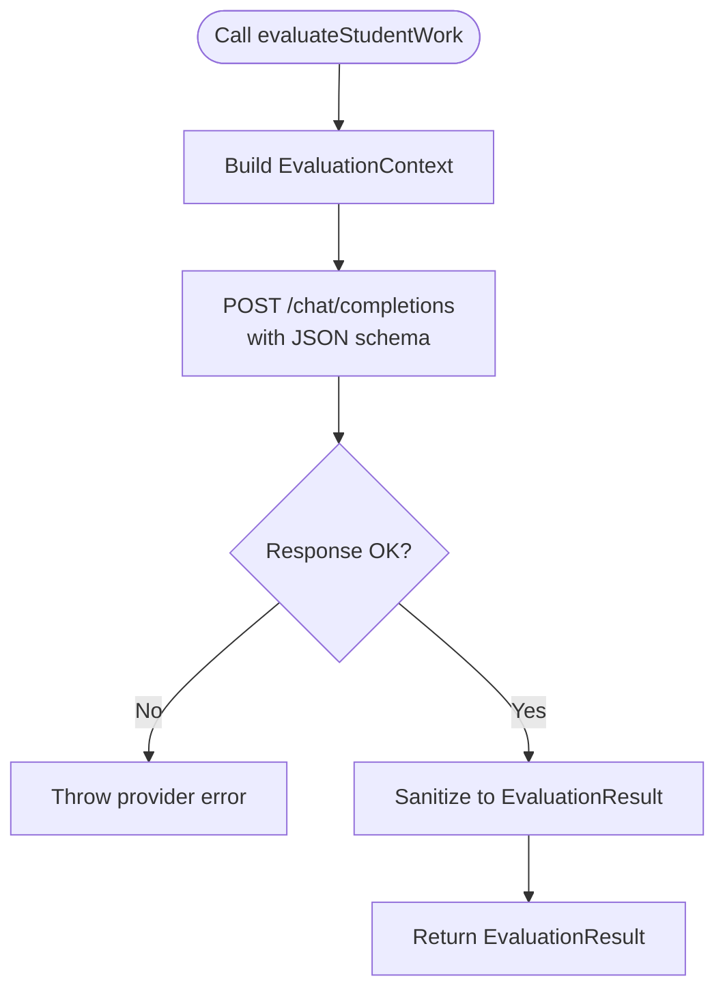
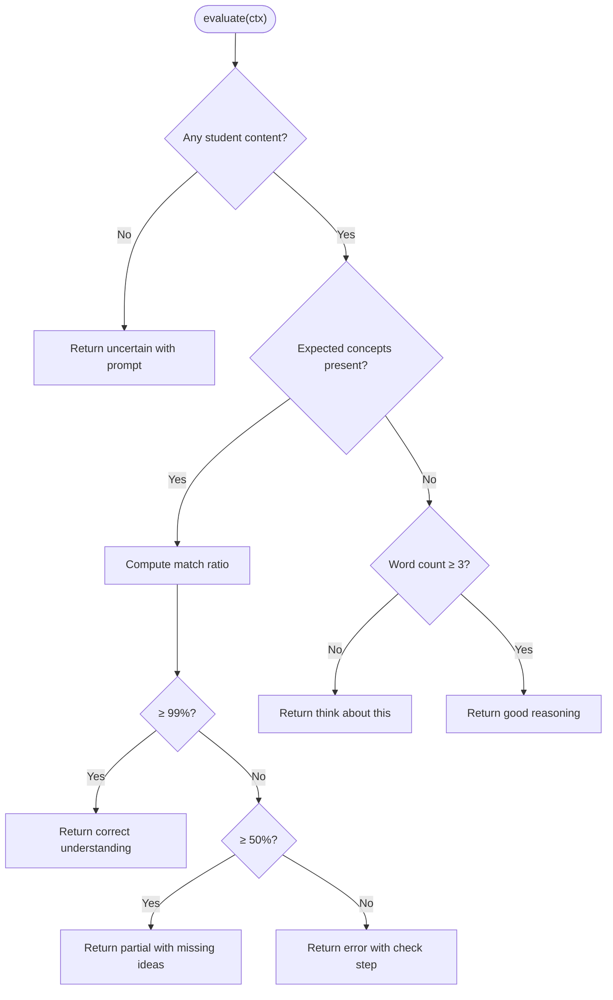
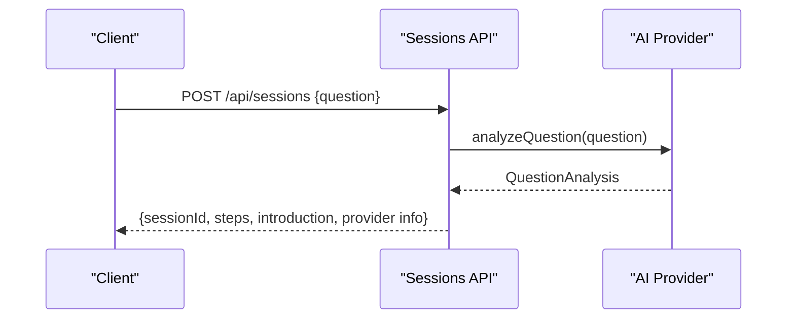
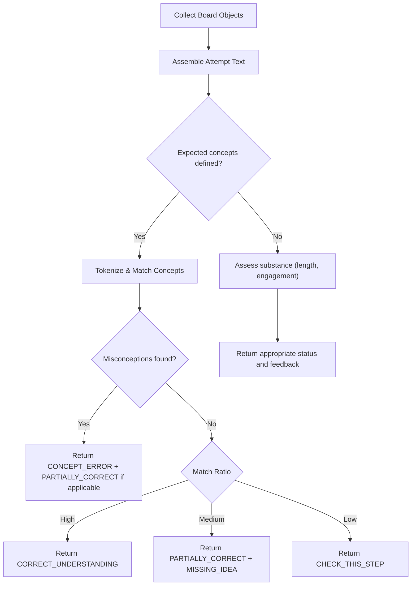
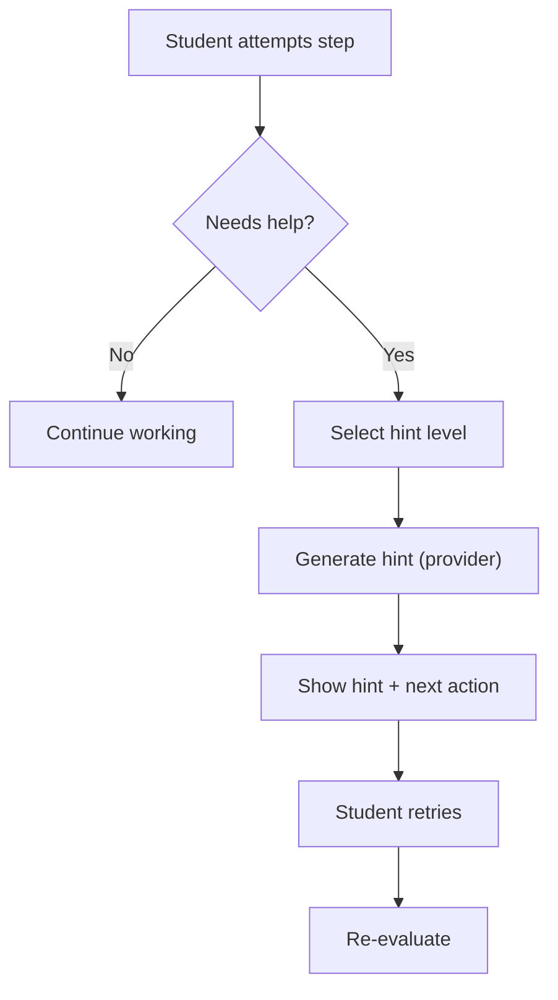
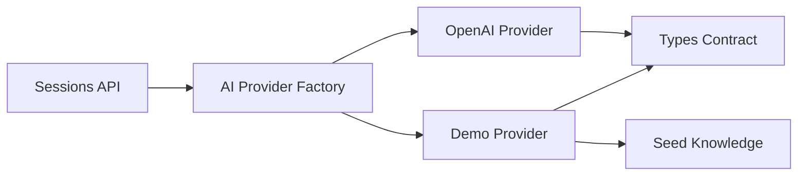

# AI Integration Layer

<cite>
**Referenced Files in This Document**
- [index.ts](file://app/lib/ai/index.ts)
- [openaiProvider.ts](file://app/lib/ai/openaiProvider.ts)
- [demoProvider.ts](file://app/lib/ai/demoProvider.ts)
- [knowledge.ts](file://app/lib/ai/knowledge.ts)
- [types.ts](file://app/lib/types.ts)
- [sessions route.ts](file://app/app/api/sessions/route.ts)
- [04-ai-brain.md.txt](file://specs/04-ai-brain.md.txt)
- [05-teaching-engine.md.txt](file://specs/05-teaching-engine.md.txt)
</cite>

## Table of Contents
1. [Introduction](#introduction)
2. [Project Structure](#project-structure)
3. [Core Components](#core-components)
4. [Architecture Overview](#architecture-overview)
5. [Detailed Component Analysis](#detailed-component-analysis)
6. [Dependency Analysis](#dependency-analysis)
7. [Performance Considerations](#performance-considerations)
8. [Troubleshooting Guide](#troubleshooting-guide)
9. [Conclusion](#conclusion)
10. [Appendices](#appendices)

## Introduction
This document explains StepWise AI’s AI integration layer that powers the intelligent teaching system. It covers:
- An abstracted AI provider architecture enabling easy switching between models and services.
- A question analysis system that decomposes complex problems into teachable steps and identifies prerequisites.
- A board evaluation engine that assesses student work on the interactive canvas, detecting errors, misconceptions, and understanding levels.
- An adaptive hint system with escalating guidance based on student needs.
- A response generation system for contextual explanations, feedback, and pedagogical guidance.
- Examples for implementing custom providers, configuring teaching strategies, and integrating new capabilities.
- Performance considerations, rate limiting, error handling, and fallback strategies for service failures.

The design aligns with the educational philosophy and decision model described in the specifications for the AI Brain and Teaching Engine.

**Section sources**
- [04-ai-brain.md.txt:1-52](file://specs/04-ai-brain.md.txt#L1-L52)
- [05-teaching-engine.md.txt:1-60](file://specs/05-teaching-engine.md.txt#L1-L60)

## Project Structure
The AI integration layer is implemented under app/lib/ai and consumed by API routes and other modules via a shared types contract.

**Diagram sources**
- [index.ts:10-21](file://app/lib/ai/index.ts#L10-L21)
- [openaiProvider.ts:18-32](file://app/lib/ai/openaiProvider.ts#L18-L32)
- [demoProvider.ts:23-27](file://app/lib/ai/demoProvider.ts#L23-L27)
- [knowledge.ts:14-149](file://app/lib/ai/knowledge.ts#L14-L149)
- [types.ts:252-296](file://app/lib/types.ts#L252-L296)
- [sessions route.ts:11-43](file://app/app/api/sessions/route.ts#L11-L43)

**Section sources**
- [index.ts:1-27](file://app/lib/ai/index.ts#L1-L27)
- [openaiProvider.ts:1-345](file://app/lib/ai/openaiProvider.ts#L1-L345)
- [demoProvider.ts:1-451](file://app/lib/ai/demoProvider.ts#L1-L451)
- [knowledge.ts:1-204](file://app/lib/ai/knowledge.ts#L1-L204)
- [types.ts:1-302](file://app/lib/types.ts#L1-L302)
- [sessions route.ts:1-56](file://app/app/api/sessions/route.ts#L1-L56)

## Core Components
- AI Provider Factory: Selects the active provider at runtime based on environment configuration and caches it.
- OpenAI-Compatible Provider: Calls an external chat endpoint with strict JSON schemas and sanitizes all outputs.
- Demo Provider: Offline heuristic tutor with seeded topics and a structured hint ladder; flagged as demo to avoid misleading users.
- Shared Types: Defines the AIProvider interface, domain models, and evaluation structures used across the system.
- API Sessions Route: Orchestrates session creation after question analysis and returns learning blueprint data to the client.

Key responsibilities:
- Question analysis: Decompose intent, subject, topic, difficulty, required concepts, prerequisites, introduction, and step plan.
- Board evaluation: Assess meaning over wording, detect misconceptions, label feedback, and recommend next actions.
- Hint generation: Provide progressive hints from gentle nudges to near-solution scaffolding.
- Explanation and reporting: Generate age- and depth-appropriate explanations and final reports grounded in session stats.

**Section sources**
- [types.ts:61-147](file://app/lib/types.ts#L61-L147)
- [types.ts:252-296](file://app/lib/types.ts#L252-L296)
- [openaiProvider.ts:72-147](file://app/lib/ai/openaiProvider.ts#L72-L147)
- [demoProvider.ts:69-201](file://app/lib/ai/demoProvider.ts#L69-L201)
- [sessions route.ts:11-43](file://app/app/api/sessions/route.ts#L11-L43)

## Architecture Overview
The system uses a provider abstraction so the rest of the application never depends on a specific vendor SDK. The factory chooses between a production-ready OpenAI-compatible provider and a development demo provider. All provider outputs are validated and sanitized before being used by the teaching flow.

**Diagram sources**
- [sessions route.ts:11-43](file://app/app/api/sessions/route.ts#L11-L43)
- [index.ts:10-21](file://app/lib/ai/index.ts#L10-L21)
- [openaiProvider.ts:40-65](file://app/lib/ai/openaiProvider.ts#L40-L65)
- [demoProvider.ts:72-80](file://app/lib/ai/demoProvider.ts#L72-L80)

## Detailed Component Analysis

### AI Provider Abstraction and Factory
- Purpose: Centralize provider selection and caching; expose a stable AIProvider interface.
- Behavior: Chooses OpenAI-compatible provider when configured; otherwise falls back to demo provider. Provides a helper to detect demo mode.
- Extensibility: Implementing a new provider requires conforming to the AIProvider interface and wiring selection logic in the factory.

**Diagram sources**
- [types.ts:252-296](file://app/lib/types.ts#L252-L296)
- [openaiProvider.ts:72-147](file://app/lib/ai/openaiProvider.ts#L72-L147)
- [demoProvider.ts:69-201](file://app/lib/ai/demoProvider.ts#L69-L201)
- [index.ts:10-21](file://app/lib/ai/index.ts#L10-L21)

**Section sources**
- [index.ts:1-27](file://app/lib/ai/index.ts#L1-L27)
- [types.ts:252-296](file://app/lib/types.ts#L252-L296)

### OpenAI-Compatible Provider
- Purpose: Call any /chat/completions-compatible endpoint with strict JSON schemas and sanitize results.
- Key behaviors:
  - Reads keys server-side only.
  - Uses temperature and response_format to enforce structured output.
  - Sanitizes all fields to trusted shapes and lengths.
  - Evaluates student work using semantic meaning, not exact wording.
  - Generates hints and final reports with constraints aligned to the teaching philosophy.

**Diagram sources**
- [openaiProvider.ts:40-65](file://app/lib/ai/openaiProvider.ts#L40-L65)
- [openaiProvider.ts:149-170](file://app/lib/ai/openaiProvider.ts#L149-L170)
- [openaiProvider.ts:234-279](file://app/lib/ai/openaiProvider.ts#L234-L279)

**Section sources**
- [openaiProvider.ts:1-345](file://app/lib/ai/openaiProvider.ts#L1-L345)

### Demo Provider (Offline Fallback)
- Purpose: Provide a fully functional offline tutoring experience without network calls.
- Features:
  - Seeded topics with predefined analyses for common subjects.
  - Misconception detection patterns for known pitfalls.
  - Deterministic evaluation heuristics based on expected concepts and text length.
  - Structured 7-level hint ladder tailored to step context.
  - Final report built from session statistics and question metadata.

**Diagram sources**
- [demoProvider.ts:205-402](file://app/lib/ai/demoProvider.ts#L205-L402)

**Section sources**
- [demoProvider.ts:1-451](file://app/lib/ai/demoProvider.ts#L1-L451)
- [knowledge.ts:14-149](file://app/lib/ai/knowledge.ts#L14-L149)

### Question Analysis System
- Purpose: Convert a student’s question into a structured learning blueprint with steps, prerequisites, and reference answers.
- Implementation:
  - OpenAI provider requests a JSON structure describing intent, subject, topic, difficulty, required concepts, prerequisites, introduction, and up to several steps.
  - Output is sanitized to ensure safe lengths and valid enums.
  - Demo provider matches seeded topics or falls back to a generic decomposition.

**Diagram sources**
- [sessions route.ts:11-43](file://app/app/api/sessions/route.ts#L11-L43)
- [openaiProvider.ts:75-90](file://app/lib/ai/openaiProvider.ts#L75-L90)
- [openaiProvider.ts:173-213](file://app/lib/ai/openaiProvider.ts#L173-L213)
- [demoProvider.ts:72-80](file://app/lib/ai/demoProvider.ts#L72-L80)
- [knowledge.ts:152-203](file://app/lib/ai/knowledge.ts#L152-L203)

**Section sources**
- [openaiProvider.ts:75-90](file://app/lib/ai/openaiProvider.ts#L75-L90)
- [openaiProvider.ts:173-213](file://app/lib/ai/openaiProvider.ts#L173-L213)
- [demoProvider.ts:72-80](file://app/lib/ai/demoProvider.ts#L72-L80)
- [knowledge.ts:152-203](file://app/lib/ai/knowledge.ts#L152-L203)
- [sessions route.ts:11-43](file://app/app/api/sessions/route.ts#L11-L43)

### Board Evaluation Engine
- Purpose: Assess student work on the interactive canvas by evaluating meaning, not exact wording; detect misconceptions; classify severity; and recommend interventions.
- Implementation:
  - OpenAI provider constructs an EvaluationContext including question, current step, attempt text, board snapshot, previous hints, and student level.
  - Returns structured feedback labels, strengths, missing elements, and intervention level.
  - Demo provider applies concept matching and misconception pattern checks to produce deterministic evaluations.

**Diagram sources**
- [openaiProvider.ts:149-170](file://app/lib/ai/openaiProvider.ts#L149-L170)
- [openaiProvider.ts:234-279](file://app/lib/ai/openaiProvider.ts#L234-L279)
- [demoProvider.ts:205-402](file://app/lib/ai/demoProvider.ts#L205-L402)

**Section sources**
- [openaiProvider.ts:149-170](file://app/lib/ai/openaiProvider.ts#L149-L170)
- [openaiProvider.ts:234-279](file://app/lib/ai/openaiProvider.ts#L234-L279)
- [demoProvider.ts:205-402](file://app/lib/ai/demoProvider.ts#L205-L402)

### Adaptive Hint System (Escalation Levels)
- Purpose: Provide increasingly specific guidance based on student needs while preserving autonomy.
- Levels:
  - Level 1: Gentle nudge to restate the step.
  - Level 2: Direction toward relevant prior knowledge.
  - Level 3: Specific hint connecting to key idea.
  - Level 4: Example pattern to follow.
  - Level 5: Partial structure or sentence frame.
  - Level 6: Near-solution guidance.
  - Level 7: Worked explanation with a call to finish independently.
- Implementation:
  - OpenAI provider generates level-specific hints constrained by schema and safety rules.
  - Demo provider returns a prebuilt ladder keyed by step context.

**Diagram sources**
- [openaiProvider.ts:100-112](file://app/lib/ai/openaiProvider.ts#L100-L112)
- [openaiProvider.ts:215-222](file://app/lib/ai/openaiProvider.ts#L215-L222)
- [demoProvider.ts:90-95](file://app/lib/ai/demoProvider.ts#L90-L95)
- [demoProvider.ts:404-450](file://app/lib/ai/demoProvider.ts#L404-L450)

**Section sources**
- [openaiProvider.ts:100-112](file://app/lib/ai/openaiProvider.ts#L100-L112)
- [openaiProvider.ts:215-222](file://app/lib/ai/openaiProvider.ts#L215-L222)
- [demoProvider.ts:90-95](file://app/lib/ai/demoProvider.ts#L90-L95)
- [demoProvider.ts:404-450](file://app/lib/ai/demoProvider.ts#L404-L450)

### Response Generation System
- Purpose: Create contextual explanations, feedback, and pedagogical guidance adapted to learner age band and desired depth.
- Capabilities:
  - generateExplanation: Produces concise or deep explanations tailored to audience and depth.
  - generateFinalReport: Synthesizes session stats, question analysis, and evidence into a comprehensive learning report.
- Safety: All outputs are clamped and validated to trusted shapes; numeric stats remain authoritative from server-side session data.

**Section sources**
- [openaiProvider.ts:114-146](file://app/lib/ai/openaiProvider.ts#L114-L146)
- [openaiProvider.ts:281-344](file://app/lib/ai/openaiProvider.ts#L281-L344)
- [demoProvider.ts:97-109](file://app/lib/ai/demoProvider.ts#L97-L109)
- [demoProvider.ts:111-201](file://app/lib/ai/demoProvider.ts#L111-L201)

## Dependency Analysis
- The API sessions route depends on the AI provider factory to obtain a provider and then calls analyzeQuestion to build the learning blueprint.
- Providers depend on shared types for contracts and on either external endpoints (OpenAI) or local knowledge (Demo).
- The demo provider depends on seed knowledge for predefined analyses and heuristics.

**Diagram sources**
- [sessions route.ts:11-43](file://app/app/api/sessions/route.ts#L11-L43)
- [index.ts:10-21](file://app/lib/ai/index.ts#L10-L21)
- [openaiProvider.ts:7-16](file://app/lib/ai/openaiProvider.ts#L7-L16)
- [demoProvider.ts:6-21](file://app/lib/ai/demoProvider.ts#L6-L21)
- [knowledge.ts:14-149](file://app/lib/ai/knowledge.ts#L14-L149)
- [types.ts:252-296](file://app/lib/types.ts#L252-L296)

**Section sources**
- [sessions route.ts:11-43](file://app/app/api/sessions/route.ts#L11-L43)
- [index.ts:10-21](file://app/lib/ai/index.ts#L10-L21)
- [openaiProvider.ts:7-16](file://app/lib/ai/openaiProvider.ts#L7-L16)
- [demoProvider.ts:6-21](file://app/lib/ai/demoProvider.ts#L6-L21)
- [knowledge.ts:14-149](file://app/lib/ai/knowledge.ts#L14-L149)
- [types.ts:252-296](file://app/lib/types.ts#L252-L296)

## Performance Considerations
- Network latency: The OpenAI provider makes HTTP calls to an external endpoint; consider request batching and caching where appropriate at higher layers.
- Rate limiting: External providers may impose rate limits; implement retry with exponential backoff and circuit-breaking at the provider boundary.
- Input size: All provider inputs are bounded; strings are clamped to safe maximums to prevent oversized payloads.
- Determinism: The demo provider avoids network calls and provides predictable behavior suitable for development and testing.
- Validation overhead: Strict JSON parsing and sanitization add minimal CPU cost but greatly improve reliability and security.

[No sources needed since this section provides general guidance]

## Troubleshooting Guide
Common issues and resolutions:
- Missing API key: If OPENAI_API_KEY is not set, the OpenAI provider will throw during configuration; fall back to demo mode automatically via the factory.
- Invalid provider response: The OpenAI provider throws on non-OK responses or missing content; wrap calls with user-friendly error handling upstream.
- Unexpected AI output: All provider outputs are sanitized; invalid enums or out-of-range values are coerced to safe defaults.
- No student content: Evaluation returns “uncertain” with a clear next action to prompt the student to contribute.
- Misconception false positives: The demo provider uses targeted regex patterns; tune patterns or rely on the OpenAI provider for semantic evaluation when needed.

**Section sources**
- [openaiProvider.ts:24-32](file://app/lib/ai/openaiProvider.ts#L24-L32)
- [openaiProvider.ts:58-65](file://app/lib/ai/openaiProvider.ts#L58-L65)
- [openaiProvider.ts:234-279](file://app/lib/ai/openaiProvider.ts#L234-L279)
- [demoProvider.ts:205-230](file://app/lib/ai/demoProvider.ts#L205-L230)

## Conclusion
StepWise AI’s integration layer provides a robust, extensible foundation for intelligent teaching. The provider abstraction enables seamless switching between AI services, while strong validation and sanitization ensure safe, reliable operation. The question analysis, board evaluation, adaptive hints, and response generation components collectively implement the educational principles outlined in the AI Brain and Teaching Engine specifications. With clear extension points and well-defined contracts, teams can integrate new AI capabilities, customize teaching strategies, and maintain high performance and resilience.

[No sources needed since this section summarizes without analyzing specific files]

## Appendices

### Implementing a Custom AI Provider
Steps:
- Define a module exporting an object conforming to the AIProvider interface.
- Implement analyzeQuestion to return a structured QuestionAnalysis.
- Implement analyzeBoard and evaluateStudentWork to return EvaluationResult with meaningful feedback and intervention levels.
- Implement generateHint to return a Hint with escalating support.
- Implement generateExplanation to tailor language and depth to the learner.
- Implement generateFinalReport to synthesize session stats and question metadata into a FinalReport.
- Wire the provider into the factory selection logic.

**Section sources**
- [types.ts:252-296](file://app/lib/types.ts#L252-L296)
- [index.ts:10-21](file://app/lib/ai/index.ts#L10-L21)

### Configuring Teaching Strategies
- Use AgeBand and ExplanationDepth to adapt tone and detail.
- Adjust AutonomyLevel and LearningMode at the profile layer to influence intervention thresholds.
- Leverage the interventionLevel field in EvaluationResult to control how much guidance the UI shows.

**Section sources**
- [types.ts:232-250](file://app/lib/types.ts#L232-L250)
- [openaiProvider.ts:114-122](file://app/lib/ai/openaiProvider.ts#L114-L122)

### Integrating New AI Capabilities
- Add new methods to AIProvider if needed and update consumers accordingly.
- Extend EvaluationContext with additional signals (e.g., time-on-task, prior attempts) to inform decisions.
- Update sanitizers to handle new fields safely.

**Section sources**
- [types.ts:265-296](file://app/lib/types.ts#L265-L296)
- [openaiProvider.ts:149-170](file://app/lib/ai/openaiProvider.ts#L149-L170)