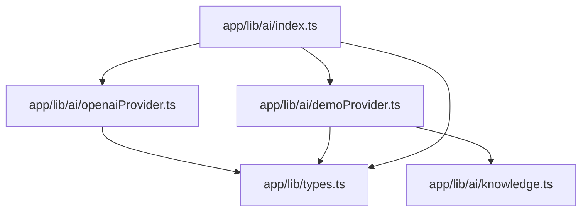
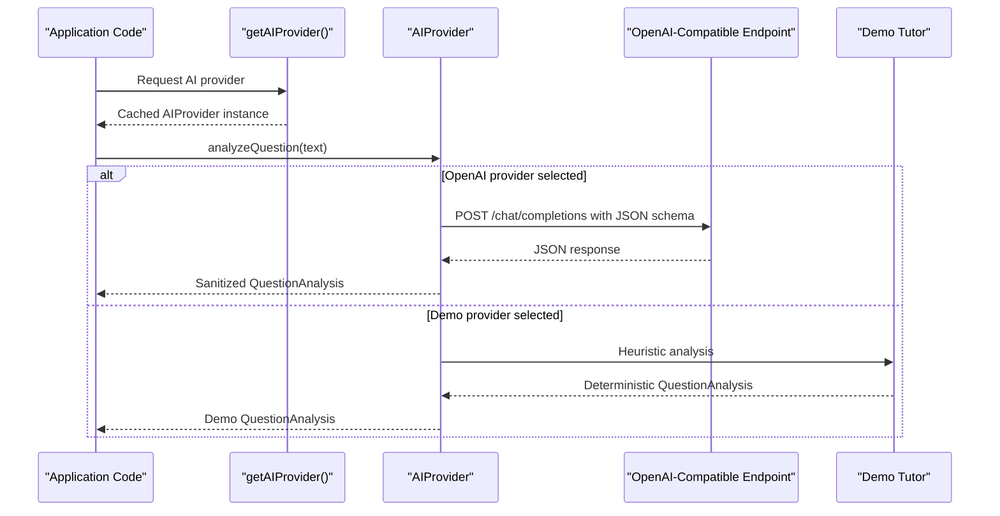
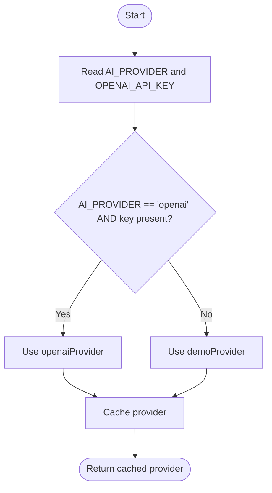
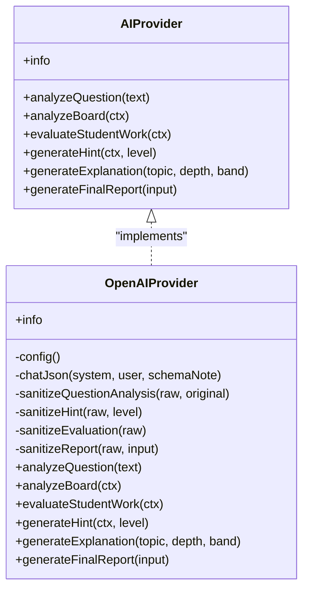
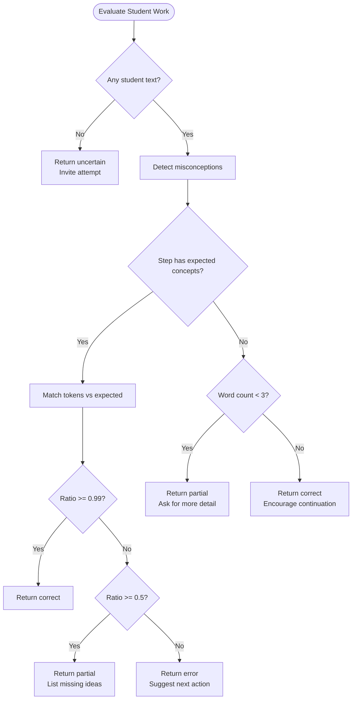
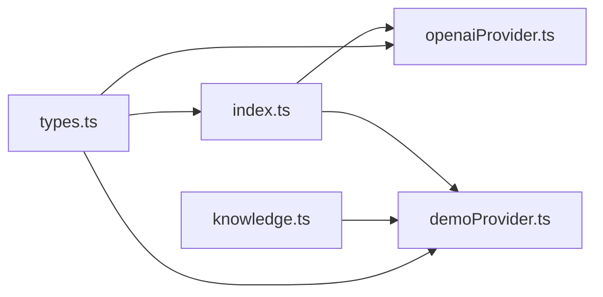

# AI Provider Architecture

<cite>
**Referenced Files in This Document**
- [index.ts](file://stepwise ai/app/lib/ai/index.ts)
- [openaiProvider.ts](file://stepwise ai/app/lib/ai/openaiProvider.ts)
- [demoProvider.ts](file://stepwise ai/app/lib/ai/demoProvider.ts)
- [knowledge.ts](file://stepwise ai/app/lib/ai/knowledge.ts)
- [types.ts](file://stepwise ai/app/lib/types.ts)
</cite>

## Table of Contents
1. Introduction
2. Project Structure
3. Core Components
4. Architecture Overview
5. Detailed Component Analysis
6. Dependency Analysis
7. Performance Considerations
8. Troubleshooting Guide
9. Conclusion
10. Appendices

## Introduction
This document explains StepWise AI’s abstracted AI provider architecture that enables seamless switching between different AI models and services while preserving a consistent interface for the rest of the application. The design centers on a single provider interface, a configuration-driven selection mechanism, and robust validation layers to ensure safe, predictable behavior regardless of the underlying model or service. It also covers fallback strategies, error handling, and guidance for integrating new providers with minimal risk.

## Project Structure
The AI subsystem is organized around a small set of focused modules:
- Provider abstraction and factory: selects and caches the active provider based on environment configuration.
- Concrete providers: an OpenAI-compatible implementation and an offline demo provider.
- Shared types: strongly typed contracts for questions, evaluations, hints, reports, and provider metadata.
- Seed knowledge: deterministic content used by the demo provider when no live AI is configured.

**Diagram sources**
- [index.ts:1-27](file://stepwise ai/app/lib/ai/index.ts#L1-L27)
- [openaiProvider.ts:1-345](file://stepwise ai/app/lib/ai/openaiProvider.ts#L1-L345)
- [demoProvider.ts:1-451](file://stepwise ai/app/lib/ai/demoProvider.ts#L1-L451)
- [knowledge.ts:1-204](file://stepwise ai/app/lib/ai/knowledge.ts#L1-L204)
- [types.ts:1-302](file://stepwise ai/app/lib/types.ts#L1-L302)

**Section sources**
- [index.ts:1-27](file://stepwise ai/app/lib/ai/index.ts#L1-L27)
- [types.ts:252-296](file://stepwise ai/app/lib/types.ts#L252-L296)

## Core Components
- Provider interface: defines a uniform contract for question analysis, board evaluation, student work evaluation, hint generation, explanation generation, and final report generation.
- Provider factory: resolves the active provider at runtime using environment variables and caches it for subsequent calls.
- OpenAI-compatible provider: implements the interface by calling a /chat/completions endpoint with structured JSON prompts and validates all outputs through sanitization functions.
- Demo provider: provides deterministic, heuristic-based responses for development and testing without requiring API keys; clearly flagged as demo mode.
- Types: enforce strict shapes for inputs and outputs across the system, including session state, board objects, evaluation results, hints, and final reports.

Key responsibilities:
- Centralized provider resolution ensures callers never depend on vendor-specific SDKs.
- Strict output validation prevents untrusted AI text from corrupting application state.
- Clear separation between production (OpenAI-compatible) and development (demo) behaviors.

**Section sources**
- [types.ts:252-296](file://stepwise ai/app/lib/types.ts#L252-L296)
- [index.ts:10-21](file://stepwise ai/app/lib/ai/index.ts#L10-L21)
- [openaiProvider.ts:18-32](file://stepwise ai/app/lib/ai/openaiProvider.ts#L18-L32)
- [demoProvider.ts:23-27](file://stepwise ai/app/lib/ai/demoProvider.ts#L23-L27)

## Architecture Overview
The architecture uses a provider abstraction layer to decouple business logic from specific AI vendors. The factory chooses the provider once per process lifetime, enabling efficient reuse and consistent behavior. All external calls are made server-side, and outputs are validated before being consumed by the rest of the application.

**Diagram sources**
- [index.ts:12-21](file://stepwise ai/app/lib/ai/index.ts#L12-L21)
- [openaiProvider.ts:40-65](file://stepwise ai/app/lib/ai/openaiProvider.ts#L40-L65)
- [demoProvider.ts:72-80](file://stepwise ai/app/lib/ai/demoProvider.ts#L72-L80)

## Detailed Component Analysis

### Provider Interface and Contracts
The shared interface standardizes how the application interacts with any AI capability:
- Metadata: id, displayName, isDemo flag to ensure UI transparency in development.
- Capabilities: analyzeQuestion, analyzeBoard, evaluateStudentWork, generateHint, generateExplanation, generateFinalReport.
- Contextual data: EvaluationContext includes question, step, attemptText, board snapshot, previous hints, student level, and depth.

Benefits:
- Swappable implementations without changing callers.
- Strong typing reduces integration errors.
- Explicit context fields guide providers to produce relevant feedback.

**Section sources**
- [types.ts:252-296](file://stepwise ai/app/lib/types.ts#L252-L296)

### Provider Selection Logic and Fallback Strategy
Selection rules:
- If environment variable AI_PROVIDER equals "openai" and OPENAI_API_KEY is present, use the OpenAI-compatible provider.
- Otherwise, fall back to the demo provider.
- The chosen provider is cached to avoid repeated configuration checks.

Fallback rationale:
- Ensures the application remains usable during development or when credentials are missing.
- Clearly marks demo mode so users understand simulated behavior.

**Diagram sources**
- [index.ts:12-21](file://stepwise ai/app/lib/ai/index.ts#L12-L21)

**Section sources**
- [index.ts:12-21](file://stepwise ai/app/lib/ai/index.ts#L12-L21)

### OpenAI-Compatible Provider Implementation
Responsibilities:
- Reads configuration from environment variables (API key, base URL, model).
- Sends structured JSON requests to a /chat/completions-compatible endpoint.
- Enforces JSON-only responses via system prompts and response_format.
- Validates and sanitizes all outputs into trusted domain shapes.

Error handling:
- Throws descriptive errors when configuration is missing or when the remote call fails.
- Guards against empty or malformed responses.

Output validation:
- Sanitizers clamp strings, limit arrays, and normalize enums to prevent invalid states.
- Authoritative server-side metrics override AI-provided numbers in final reports.

**Diagram sources**
- [types.ts:252-296](file://stepwise ai/app/lib/types.ts#L252-L296)
- [openaiProvider.ts:18-345](file://stepwise ai/app/lib/ai/openaiProvider.ts#L18-L345)

**Section sources**
- [openaiProvider.ts:24-65](file://stepwise ai/app/lib/ai/openaiProvider.ts#L24-L65)
- [openaiProvider.ts:172-345](file://stepwise ai/app/lib/ai/openaiProvider.ts#L172-L345)

### Demo Provider Implementation
Responsibilities:
- Provides deterministic, rule-based analysis and evaluation without network calls.
- Uses seed knowledge for known topics and generic decomposition otherwise.
- Generates escalating hints and explanations tailored to learner bands and depth.

Misconception detection:
- Pattern matching identifies common conceptual errors and returns targeted feedback.

Transparency:
- Marked as demo mode so the UI can display appropriate banners and disclaimers.

**Diagram sources**
- [demoProvider.ts:205-402](file://stepwise ai/app/lib/ai/demoProvider.ts#L205-L402)

**Section sources**
- [demoProvider.ts:72-109](file://stepwise ai/app/lib/ai/demoProvider.ts#L72-L109)
- [demoProvider.ts:205-402](file://stepwise ai/app/lib/ai/demoProvider.ts#L205-L402)

### Seed Knowledge and Generic Analysis
- Seed topics provide curated analyses for known subjects (e.g., photosynthesis, water cycle, fractions), ensuring consistent learning paths during development.
- Generic analysis supplies a default structure when no seed matches, keeping the flow intact.

Usage:
- The demo provider matches incoming questions against seed patterns and returns prebuilt analyses.
- Falls back to generic analysis for unknown inputs.

**Section sources**
- [knowledge.ts:14-149](file://stepwise ai/app/lib/ai/knowledge.ts#L14-L149)
- [knowledge.ts:151-204](file://stepwise ai/app/lib/ai/knowledge.ts#L151-L204)

## Dependency Analysis
The provider layer depends on shared types for contracts and uses environment configuration for runtime behavior. The OpenAI provider depends on a compatible HTTP endpoint, while the demo provider depends only on local heuristics and seed data.

**Diagram sources**
- [types.ts:252-296](file://stepwise ai/app/lib/types.ts#L252-L296)
- [index.ts:1-27](file://stepwise ai/app/lib/ai/index.ts#L1-L27)
- [openaiProvider.ts:1-345](file://stepwise ai/app/lib/ai/openaiProvider.ts#L1-L345)
- [demoProvider.ts:1-451](file://stepwise ai/app/lib/ai/demoProvider.ts#L1-L451)
- [knowledge.ts:1-204](file://stepwise ai/app/lib/ai/knowledge.ts#L1-L204)

**Section sources**
- [index.ts:1-27](file://stepwise ai/app/lib/ai/index.ts#L1-L27)
- [openaiProvider.ts:1-345](file://stepwise ai/app/lib/ai/openaiProvider.ts#L1-L345)
- [demoProvider.ts:1-451](file://stepwise ai/app/lib/ai/demoProvider.ts#L1-L451)
- [knowledge.ts:1-204](file://stepwise ai/app/lib/ai/knowledge.ts#L1-L204)
- [types.ts:252-296](file://stepwise ai/app/lib/types.ts#L252-L296)

## Performance Considerations
- Provider caching: The factory caches the resolved provider to avoid repeated configuration checks and conditional logic.
- Minimal payloads: The OpenAI provider uses structured JSON prompts and sets low temperature to reduce variability and token usage.
- Output clamping: Sanitizers limit string lengths and array sizes to control downstream processing costs and memory usage.
- Deterministic fallback: The demo provider avoids network latency entirely, making it ideal for rapid iteration and testing.
- Server-side calls: All external requests occur on the server, reducing client-side overhead and protecting secrets.

[No sources needed since this section provides general guidance]

## Troubleshooting Guide
Common issues and resolutions:
- Missing API key: The OpenAI provider throws a clear error if OPENAI_API_KEY is not configured. Ensure the environment variable is set before selecting the OpenAI provider.
- Network failures: Non-OK responses from the AI endpoint raise errors with status codes. Inspect logs and retry with adjusted timeouts or rate limits.
- Malformed responses: If the provider returns no content or invalid JSON, errors are raised. Validate your prompt schema and model capabilities.
- Demo mode visibility: When using the demo provider, the UI should indicate simulated behavior to avoid confusing users.

Operational tips:
- Keep provider selection explicit via AI_PROVIDER to avoid accidental fallbacks in production.
- Log sanitized diagnostics rather than raw AI outputs to protect sensitive information.
- Monitor error rates and adjust model parameters or prompts to improve reliability.

**Section sources**
- [openaiProvider.ts:24-32](file://stepwise ai/app/lib/ai/openaiProvider.ts#L24-L32)
- [openaiProvider.ts:58-65](file://stepwise ai/app/lib/ai/openaiProvider.ts#L58-L65)
- [index.ts:14-19](file://stepwise ai/app/lib/ai/index.ts#L14-L19)

## Conclusion
StepWise AI’s provider abstraction cleanly separates application logic from vendor-specific details, enabling easy switching between models and services while maintaining safety and consistency. The factory-based selection, strict type contracts, and comprehensive output validation ensure reliable operation in both production and development environments. Extending the system with new providers requires implementing the shared interface and adhering to the established validation and error-handling patterns.

[No sources needed since this section summarizes without analyzing specific files]

## Appendices

### Implementing a Custom AI Provider
Steps:
- Create a module exporting an object conforming to the AIProvider interface.
- Implement each method to return values matching the shared types.
- Add provider selection logic in the factory if you want environment-driven activation.
- Include robust sanitization to coerce and validate any external outputs.

Guidance:
- Treat all external AI outputs as untrusted; always sanitize before use.
- Provide meaningful info metadata, especially isDemo, to support UI transparency.
- Keep configuration reads server-side and never expose secrets to clients.

**Section sources**
- [types.ts:252-296](file://stepwise ai/app/lib/types.ts#L252-L296)
- [index.ts:12-21](file://stepwise ai/app/lib/ai/index.ts#L12-L21)
- [openaiProvider.ts:172-345](file://stepwise ai/app/lib/ai/openaiProvider.ts#L172-L345)

### Configuring Provider-Specific Settings
Environment variables:
- AI_PROVIDER: Selects the active provider ("openai" or other values to trigger fallback).
- OPENAI_API_KEY: Required for the OpenAI-compatible provider.
- OPENAI_BASE_URL: Optional base URL for compatible endpoints.
- OPENAI_MODEL: Optional model name; defaults to a cost-effective option.

Best practices:
- Pin models and versions in production for stability.
- Use separate environments for development and production.
- Rotate keys regularly and restrict access scopes.

**Section sources**
- [index.ts:14-19](file://stepwise ai/app/lib/ai/index.ts#L14-L19)
- [openaiProvider.ts:24-32](file://stepwise ai/app/lib/ai/openaiProvider.ts#L24-L32)

### Managing Authentication and Secrets
- Store API keys in secure environment variables managed by your deployment platform.
- Never log or transmit secrets to clients.
- Restrict network access to authorized endpoints and monitor usage.

**Section sources**
- [openaiProvider.ts:24-32](file://stepwise ai/app/lib/ai/openaiProvider.ts#L24-L32)

### Rate Limiting, Caching, and Cost Optimization
Recommendations:
- Implement request-level retries with exponential backoff for transient errors.
- Cache provider instances and, where appropriate, cache expensive computations (e.g., question analysis) keyed by stable identifiers.
- Tune model parameters (temperature, max tokens) to balance quality and cost.
- Prefer smaller models for routine tasks and escalate to larger models only when necessary.
- Aggregate prompts to minimize round trips when feasible.

[No sources needed since this section provides general guidance]