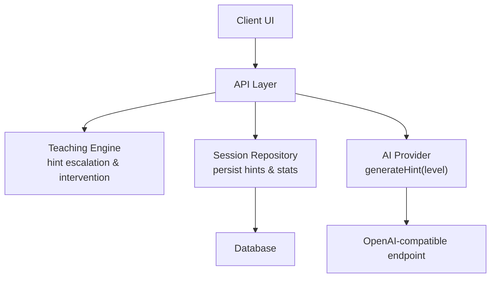
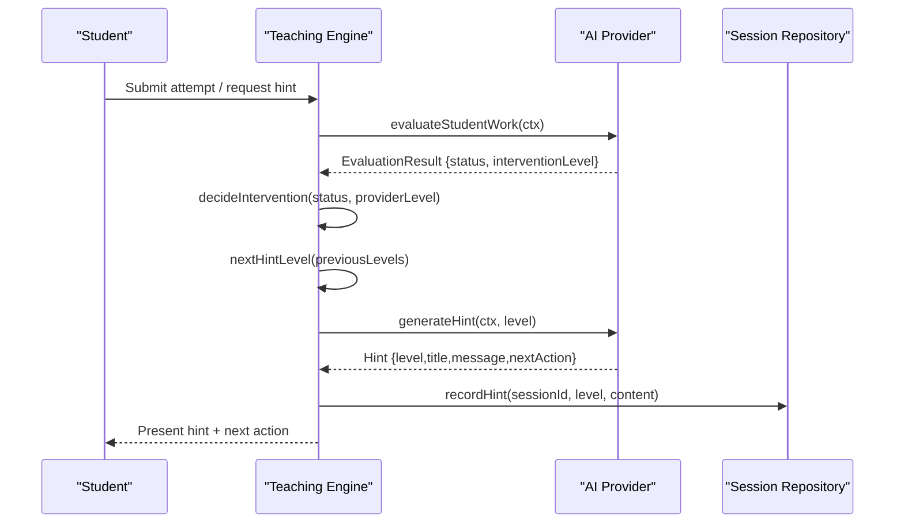
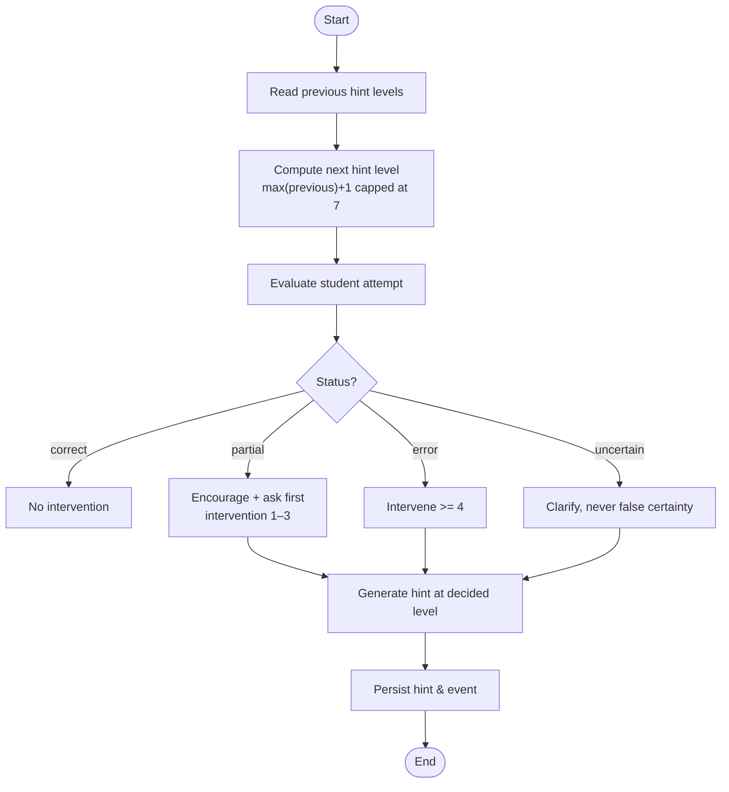
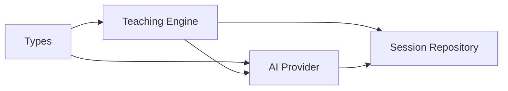

# Adaptive Hint System

<cite>
**Referenced Files in This Document**
- [teaching.ts](file://stepwise ai/app/lib/teaching.ts)
- [types.ts](file://stepwise ai/app/lib/types.ts)
- [openaiProvider.ts](file://stepwise ai/app/lib/ai/openaiProvider.ts)
- [sessionsRepo.ts](file://stepwise ai/app/lib/sessionsRepo.ts)
- [05-teaching-engine.md.txt](file://stepwise ai/specs/05-teaching-engine.md.txt)
- [04-ai-brain.md.txt](file://stepwise ai/specs/04-ai-brain.md.txt)
</cite>

## Table of Contents
1. [Introduction](#introduction)
2. [Project Structure](#project-structure)
3. [Core Components](#core-components)
4. [Architecture Overview](#architecture-overview)
5. [Detailed Component Analysis](#detailed-component-analysis)
6. [Dependency Analysis](#dependency-analysis)
7. [Performance Considerations](#performance-considerations)
8. [Troubleshooting Guide](#troubleshooting-guide)
9. [Conclusion](#conclusion)
10. [Appendices](#appendices)

## Introduction
This document explains the adaptive hint system with seven escalation levels that provides increasingly specific guidance based on student needs. It covers the hint generation algorithm, how it considers student performance history, current problem state, and learning mode, and how it escalates after failed attempts while preserving pedagogical effectiveness. It also documents customization options, integration with the teaching engine, and the role of AI in generating contextual hints.

## Project Structure
The adaptive hint system is implemented across a small set of focused modules:
- Types define the domain model for sessions, evaluations, hints, and learning modes.
- The teaching engine defines feedback labels, hint level titles, thresholds per learning mode, escalation logic, and intervention policy.
- The AI provider generates contextual hints at a specified level using an OpenAI-compatible endpoint and sanitizes outputs.
- The session repository persists hints, errors, and session statistics used by analytics and final reports.
- Specifications define the pedagogical principles guiding hint behavior and escalation.

**Diagram sources**
- [teaching.ts:18-45](file://stepwise ai/app/lib/teaching.ts#L18-L45)
- [openaiProvider.ts:100-112](file://stepwise ai/app/lib/ai/openaiProvider.ts#L100-L112)
- [sessionsRepo.ts:314-330](file://stepwise ai/app/lib/sessionsRepo.ts#L314-L330)

**Section sources**
- [types.ts:61-124](file://stepwise ai/app/lib/types.ts#L61-L124)
- [teaching.ts:18-77](file://stepwise ai/app/lib/teaching.ts#L18-L77)
- [openaiProvider.ts:100-112](file://stepwise ai/app/lib/ai/openaiProvider.ts#L100-L112)
- [sessionsRepo.ts:314-330](file://stepwise ai/app/lib/sessionsRepo.ts#L314-L330)

## Core Components
- Hint levels (1–7): “Gentle nudge” to “Worked explanation,” each with a title and intended specificity.
- Learning modes: GUIDED, BALANCED, CHALLENGE, EXPLAIN, REVIEW — tune escalation thresholds and auto-intervention levels.
- Evaluation status mapping: correct/partial/error/uncertain mapped to session states.
- Intervention policy: determines whether and how strongly to intervene based on evaluation status and provider-level signals.
- AI hint generation: constructs a context-aware hint at a given level, adapted to student age band and depth preferences.
- Persistence: records hint usage and session statistics for analytics and reporting.

**Section sources**
- [teaching.ts:18-77](file://stepwise ai/app/lib/teaching.ts#L18-L77)
- [types.ts:116-124](file://stepwise ai/app/lib/types.ts#L116-L124)
- [openaiProvider.ts:100-112](file://stepwise ai/app/lib/ai/openaiProvider.ts#L100-L112)
- [sessionsRepo.ts:314-330](file://stepwise ai/app/lib/sessionsRepo.ts#L314-L330)

## Architecture Overview
The hint system follows a clear flow:
1. Student submits an attempt or requests help.
2. The teaching engine evaluates the attempt via the AI provider and receives an evaluation result including status and suggested intervention level.
3. Based on evaluation status and learning mode thresholds, the system decides the next hint level and whether to intervene automatically.
4. The AI provider generates a contextual hint at the chosen level, constrained by pedagogical rules (no full answers until level 7).
5. The hint is persisted and presented to the student; subsequent attempts may escalate further.

**Diagram sources**
- [teaching.ts:41-77](file://stepwise ai/app/lib/teaching.ts#L41-L77)
- [openaiProvider.ts:96-112](file://stepwise ai/app/lib/ai/openaiProvider.ts#L96-L112)
- [sessionsRepo.ts:314-330](file://stepwise ai/app/lib/sessionsRepo.ts#L314-L330)

## Detailed Component Analysis

### Seven Escalation Levels
The system defines seven progressive hint levels with increasing specificity:
- Level 1: Gentle nudge — broad conceptual clue or question.
- Level 2: Direction — point toward relevant concept or step.
- Level 3: Specific hint — narrow reasoning path or key idea.
- Level 4: Example — simple related example to illustrate the concept.
- Level 5: Partial structure — provide part of the reasoning or scaffold.
- Level 6: Nearly there — near-solution guidance enabling completion.
- Level 7: Worked explanation — full explanation when necessary; still encourages student to finish the last part.

These levels are enforced by the AI provider’s schema and system rules to avoid giving away complete answers before level 7.

**Section sources**
- [teaching.ts:18-26](file://stepwise ai/app/lib/teaching.ts#L18-L26)
- [openaiProvider.ts:100-112](file://stepwise ai/app/lib/ai/openaiProvider.ts#L100-L112)

### Hint Generation Algorithm
The algorithm combines three inputs:
- Student performance history: previous hint levels used during the session.
- Current problem state: question analysis, current step, expected concepts, and board objects.
- Learning mode: thresholds controlling escalation speed and auto-intervention.

Key steps:
- Compute next hint level from previous levels, escalating one step at a time and capping at 7.
- Map evaluation status to session state transitions.
- Decide intervention level based on evaluation status and provider suggestion.
- Generate a contextual hint at the decided level through the AI provider.

**Diagram sources**
- [teaching.ts:41-77](file://stepwise ai/app/lib/teaching.ts#L41-L77)

**Section sources**
- [teaching.ts:41-77](file://stepwise ai/app/lib/teaching.ts#L41-L77)
- [openaiProvider.ts:96-112](file://stepwise ai/app/lib/ai/openaiProvider.ts#L96-L112)

### Escalation Logic and Pedagogical Effectiveness
Escalation respects both failure signals and pedagogy:
- Failed checks trigger escalation according to learning mode thresholds.
- Partial correctness triggers encouragement and lower-level hints (1–3).
- Clear errors trigger stronger intervention (>=4).
- Uncertainty avoids false certainty and prompts clarification.
- Auto-intervention levels vary by mode to balance independence and support.

Learning mode thresholds:
- GUIDED: escalate quickly, earlier auto-intervention.
- BALANCED: moderate pacing.
- CHALLENGE: more tolerance for independent attempts.
- EXPLAIN: early auto-intervention for direct teaching.
- REVIEW: moderate auto-intervention for testing understanding.

**Section sources**
- [teaching.ts:28-39](file://stepwise ai/app/lib/teaching.ts#L28-L39)
- [teaching.ts:65-77](file://stepwise ai/app/lib/teaching.ts#L65-L77)

### Examples of Hint Sequences
Below are conceptual sequences illustrating progression across different scenarios. These reflect the defined levels and escalation logic without exposing internal code.

- Conceptual science question:
  - Level 1: Ask a broad question about the main idea.
  - Level 2: Point to the relevant concept (e.g., inputs vs. process).
  - Level 3: Narrow to a key relationship (e.g., sunlight’s role).
  - Level 4: Provide a simple example linking inputs to output.
  - Level 5: Offer partial structure (e.g., “First identify X, then explain Y”).
  - Level 6: Near-solution guidance to finish the explanation.
  - Level 7: Full worked explanation if needed, still prompting the student to complete the final step.

- Procedural math problem:
  - Level 1: Prompt restating the step.
  - Level 2: Direct attention to the operation being tested.
  - Level 3: Identify the specific transformation error.
  - Level 4: Show a similar example with correct transformation.
  - Level 5: Provide partial reasoning scaffolding.
  - Level 6: Guide to the final calculation step.
  - Level 7: Explain the full solution path while leaving the last computation to the student.

- Programming debugging task:
  - Level 1: Ask what the code intends to do.
  - Level 2: Point to the likely location of the bug.
  - Level 3: Highlight the incorrect assumption or logic.
  - Level 4: Provide a minimal working example of the pattern.
  - Level 5: Suggest a partial fix or refactoring step.
  - Level 6: Guide to completing the corrected implementation.
  - Level 7: Walk through the corrected approach while asking the student to implement the final piece.

[No sources needed since this section provides conceptual examples aligned with documented levels]

### Customization Options
Customization is primarily driven by learning mode and profile settings:
- Learning mode adjusts escalation thresholds and auto-intervention timing.
- Explanation depth influences the AI’s language complexity and detail.
- Age band adapts tone and vocabulary.
- Autonomy level affects how much guidance is provided versus encouraging independence.

These options influence the AI provider’s prompt context and the teaching engine’s thresholds.

**Section sources**
- [teaching.ts:28-39](file://stepwise ai/app/lib/teaching.ts#L28-L39)
- [types.ts:232-250](file://stepwise ai/app/lib/types.ts#L232-L250)
- [openaiProvider.ts:114-122](file://stepwise ai/app/lib/ai/openaiProvider.ts#L114-L122)

### Integration with the Teaching Engine
The teaching engine orchestrates:
- Feedback labels with icons and text for consistent UI presentation.
- State transitions based on evaluation results.
- Intervention decisions grounded in pedagogical principles.
- Hint escalation tied to learning mode and previous attempts.

It ensures that hints are always contextual and never generic, aligning with the teaching philosophy of smallest useful assistance.

**Section sources**
- [teaching.ts:8-16](file://stepwise ai/app/lib/teaching.ts#L8-L16)
- [teaching.ts:47-63](file://stepwise ai/app/lib/teaching.ts#L47-L63)
- [05-teaching-engine.md.txt:9-11](file://stepwise ai/specs/05-teaching-engine.md.txt#L9-L11)

### Role of AI in Generating Contextual Hints
The AI provider:
- Receives structured context including question intent, current step, expected concepts, board objects, and student attempt.
- Generates hints tailored to the specified level and learner band.
- Enforces constraints: no full answers below level 7; even at level 7, prompt the student to finish the last part.
- Sanitizes outputs to ensure safety and consistency.

This ensures hints are meaningful, accurate, and pedagogically appropriate.

**Section sources**
- [openaiProvider.ts:100-112](file://stepwise ai/app/lib/ai/openaiProvider.ts#L100-L112)
- [openaiProvider.ts:149-170](file://stepwise ai/app/lib/ai/openaiProvider.ts#L149-L170)
- [openaiProvider.ts:215-222](file://stepwise ai/app/lib/ai/openaiProvider.ts#L215-L222)

## Dependency Analysis
The hint system depends on:
- Types for shared domain models (hints, evaluation, learning modes).
- Teaching engine for escalation and intervention logic.
- AI provider for contextual hint generation and evaluation.
- Session repository for persistence and analytics.

**Diagram sources**
- [types.ts:61-124](file://stepwise ai/app/lib/types.ts#L61-L124)
- [teaching.ts:18-77](file://stepwise ai/app/lib/teaching.ts#L18-L77)
- [openaiProvider.ts:100-112](file://stepwise ai/app/lib/ai/openaiProvider.ts#L100-L112)
- [sessionsRepo.ts:314-330](file://stepwise ai/app/lib/sessionsRepo.ts#L314-L330)

**Section sources**
- [types.ts:61-124](file://stepwise ai/app/lib/types.ts#L61-L124)
- [teaching.ts:18-77](file://stepwise ai/app/lib/teaching.ts#L18-L77)
- [openaiProvider.ts:100-112](file://stepwise ai/app/lib/ai/openaiProvider.ts#L100-L112)
- [sessionsRepo.ts:314-330](file://stepwise ai/app/lib/sessionsRepo.ts#L314-L330)

## Performance Considerations
- Hint generation calls an external AI service; consider caching repeated contexts where appropriate.
- Limit AI payload size by focusing on current step and relevant board objects.
- Use learning mode thresholds to reduce unnecessary interventions and API calls.
- Persist hints efficiently and batch events where possible to minimize database writes.

[No sources needed since this section provides general guidance]

## Troubleshooting Guide
Common issues and resolutions:
- AI provider errors: Ensure API keys and endpoints are configured; handle non-OK responses gracefully.
- Invalid hint content: Sanitization clamps strings and validates fields; fallback messages are used when needed.
- Over-intervention: Adjust learning mode thresholds to reduce frequency of hints; prefer questions and encouragement first.
- Under-intervention: For major misconceptions, rely on intervention policy to pause progression and provide targeted hints.

**Section sources**
- [openaiProvider.ts:24-32](file://stepwise ai/app/lib/ai/openaiProvider.ts#L24-L32)
- [openaiProvider.ts:215-222](file://stepwise ai/app/lib/ai/openaiProvider.ts#L215-L222)
- [teaching.ts:65-77](file://stepwise ai/app/lib/teaching.ts#L65-L77)

## Conclusion
The adaptive hint system provides a structured, pedagogically sound approach to supporting learners through seven escalating levels of guidance. It integrates tightly with the teaching engine and AI provider to deliver contextual, personalized hints while respecting autonomy and avoiding over-intervention. Learning mode customization allows tailoring pacing and support intensity, and persistent analytics enable continuous improvement and reporting.

[No sources needed since this section summarizes without analyzing specific files]

## Appendices

### Pedagogical Principles Reference
- Smallest useful assistance sequence: observe → ask → hint → clarify → visualize → demonstrate partially → explain fully.
- Never give full answers prematurely; even at highest level, prompt the student to complete the final step.
- Distinguish language errors from conceptual errors; focus on meaning rather than exact wording.
- Detect stuckness and adjust cognitive load; simplify tasks when repeated failure occurs.

**Section sources**
- [05-teaching-engine.md.txt:9-11](file://stepwise ai/specs/05-teaching-engine.md.txt#L9-L11)
- [04-ai-brain.md.txt:1-10](file://stepwise ai/specs/04-ai-brain.md.txt#L1-L10)