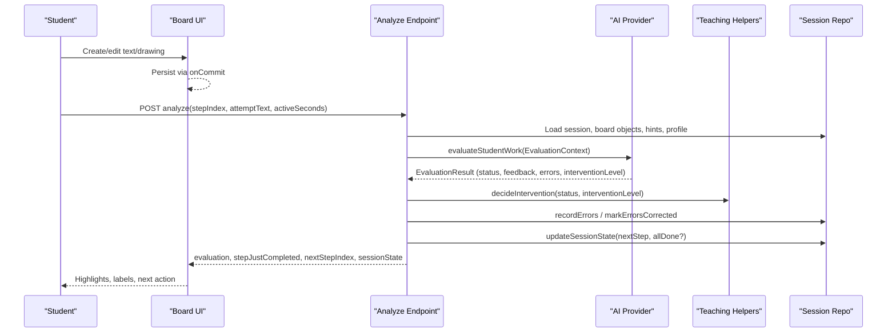
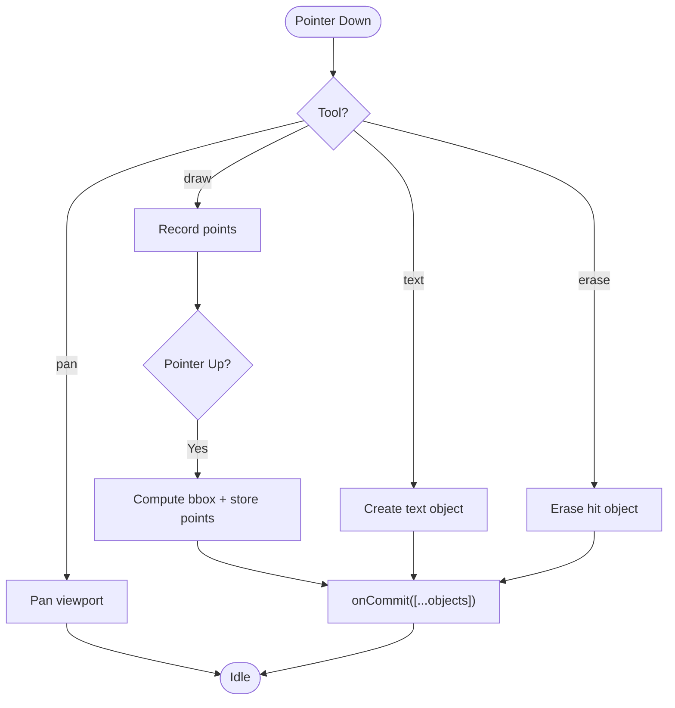
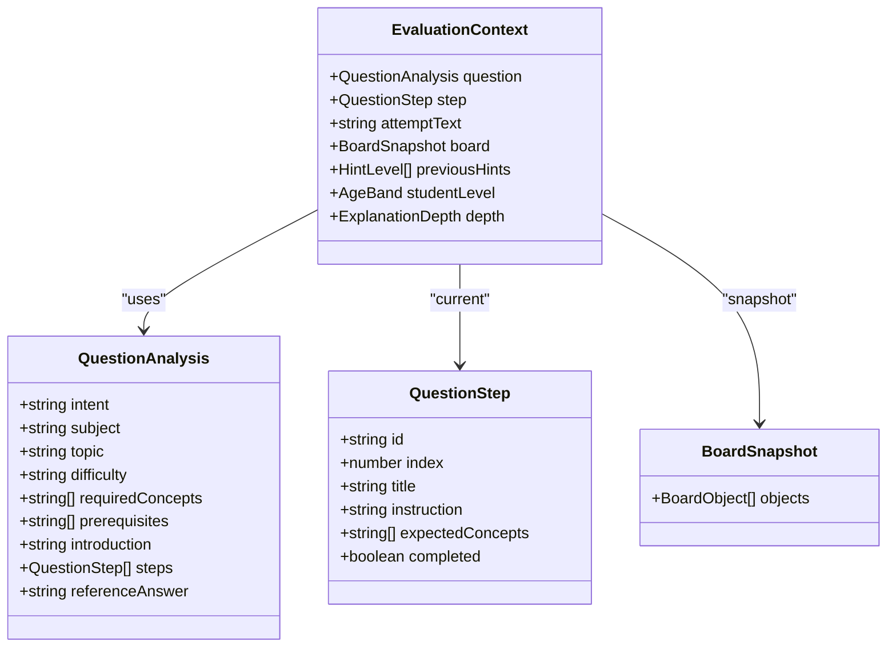
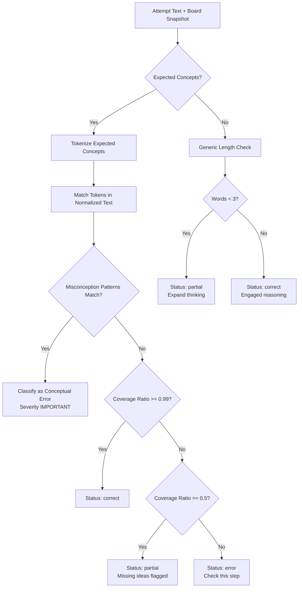
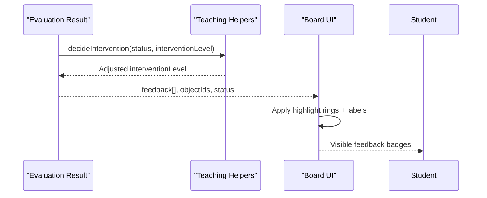
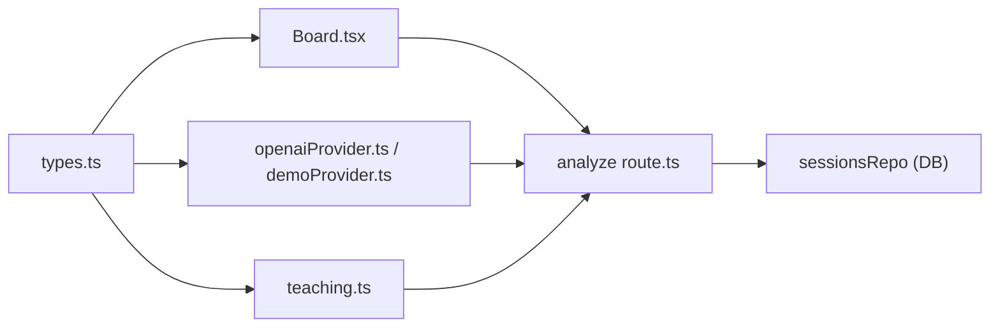

# Board Evaluation Engine

<cite>
**Referenced Files in This Document**
- [Board.tsx](file://stepwise ai/app/components/board/Board.tsx)
- [types.ts](file://stepwise ai/app/lib/types.ts)
- [teaching.ts](file://stepwise ai/app/lib/teaching.ts)
- [openaiProvider.ts](file://stepwise ai/app/lib/ai/openaiProvider.ts)
- [demoProvider.ts](file://stepwise ai/app/lib/ai/demoProvider.ts)
- [analyze route.ts](file://stepwise ai/app/app/api/sessions/[id]/analyze/route.ts)
- [04-ai-brain.md.txt](file://stepwise ai/specs/04-ai-brain.md.txt)
- [05-teaching-engine.md.txt](file://stepwise ai/specs/05-teaching-engine.md.txt)
- [06-visual-learning-engine.md.txt](file://stepwise ai/specs/06-visual-learning-engine.md.txt)
</cite>

## Table of Contents
1. Introduction
2. Project Structure
3. Core Components
4. Architecture Overview
5. Detailed Component Analysis
6. Dependency Analysis
7. Performance Considerations
8. Troubleshooting Guide
9. Conclusion
10. Appendices

## Introduction
This document explains the Board Evaluation Engine that assesses student work on the interactive canvas, detects errors and misconceptions, and classifies understanding levels to drive adaptive guidance. It covers how textual and visual content are analyzed, the error detection algorithms, misconception classification, feedback generation, integration with the teaching engine, and the role of AI in interpreting partial solutions and creative approaches.

## Project Structure
The evaluation pipeline spans the interactive board UI, server-side session handling, AI provider abstraction, and teaching helpers:
- Interactive Board renders student and AI objects, captures drawings and text, and exposes highlights for feedback.
- The analyze API endpoint builds an evaluation context from the current step, board snapshot, hints used, and learner profile, then calls the AI provider to evaluate.
- Providers implement evaluation strategies: a heuristic demo provider and an OpenAI-compatible provider that returns structured results validated by sanitizers.
- Teaching helpers define feedback labels, hint escalation, intervention decisions, and state transitions.

```mermaid
graph TB
UI["Board UI<br/>Canvas + Objects"] --> API["Analyze Endpoint<br/>POST /api/sessions/:id/analyze"]
API --> Provider["AI Provider Abstraction"]
Provider --> Demo["Demo Provider<br/>Heuristics"]
Provider --> OpenAI["OpenAI Provider<br/>LLM-based"]
API --> Teach["Teaching Helpers<br/>Intervention & State"]
API --> DB["Session Repo<br/>Persist Evidence"]
UI <-- Feedback["Highlights & Labels"]
```

**Diagram sources**
- [Board.tsx:1-540](file://stepwise ai/app/components/board/Board.tsx#L1-L540)
- [analyze route.ts:1-180](file://stepwise ai/app/app/api/sessions/[id]/analyze/route.ts#L1-L180)
- [openaiProvider.ts:1-345](file://stepwise ai/app/lib/ai/openaiProvider.ts#L1-L345)
- [demoProvider.ts:1-451](file://stepwise ai/app/lib/ai/demoProvider.ts#L1-L451)
- [teaching.ts:1-77](file://stepwise ai/app/lib/teaching.ts#L1-L77)

**Section sources**
- [Board.tsx:1-540](file://stepwise ai/app/components/board/Board.tsx#L1-L540)
- [analyze route.ts:1-180](file://stepwise ai/app/app/api/sessions/[id]/analyze/route.ts#L1-L180)
- [types.ts:1-302](file://stepwise ai/app/lib/types.ts#L1-L302)
- [teaching.ts:1-77](file://stepwise ai/app/lib/teaching.ts#L1-L77)

## Core Components
- Board component: Renders draggable, resizable text and drawing objects; supports pan/zoom; applies feedback highlights per object.
- Types: Define board objects, ownership, evaluation status, feedback labels, error categories/severity, detected errors, evaluation result, hints, question analysis, learning journey states, and AI provider interface.
- Teaching helpers: Provide feedback label metadata, hint level titles, learning mode thresholds, next hint level calculation, state mapping after evaluation, and intervention policy.
- AI providers: Implement evaluateStudentWork and related methods; sanitize outputs into trusted shapes; support both heuristic and LLM-based evaluation.
- Analyze endpoint: Builds EvaluationContext, invokes provider, records evidence, updates session state, and returns evaluation plus navigation cues.

**Section sources**
- [types.ts:26-114](file://stepwise ai/app/lib/types.ts#L26-L114)
- [teaching.ts:8-77](file://stepwise ai/app/lib/teaching.ts#L8-L77)
- [openaiProvider.ts:72-170](file://stepwise ai/app/lib/ai/openaiProvider.ts#L72-L170)
- [demoProvider.ts:29-451](file://stepwise ai/app/lib/ai/demoProvider.ts#L29-L451)
- [analyze route.ts:19-180](file://stepwise ai/app/app/api/sessions/[id]/analyze/route.ts#L19-L180)

## Architecture Overview
The evaluation flow integrates user actions on the board with AI-driven assessment and adaptive teaching:



**Diagram sources**
- [analyze route.ts:62-175](file://stepwise ai/app/app/api/sessions/[id]/analyze/route.ts#L62-L175)
- [openaiProvider.ts:149-170](file://stepwise ai/app/lib/ai/openaiProvider.ts#L149-L170)
- [demoProvider.ts:205-402](file://stepwise ai/app/lib/ai/demoProvider.ts#L205-L402)
- [teaching.ts:47-77](file://stepwise ai/app/lib/teaching.ts#L47-L77)

## Detailed Component Analysis

### Board Interaction and Visual Content Capture
- Object model: Supports text, handwriting, drawing, shape, connector, image, note, formula, annotation, visual. Ownership distinguishes student vs AI/system content.
- Drawing capture: Converts pointer points into a polyline stored as JSON content; bounding box computed from min/max coordinates.
- Text editing: Inline textarea edits commit changes through onCommit.
- Feedback highlights: Each object can be highlighted using a FeedbackLabel; UI shows icon + label near the object.



**Diagram sources**
- [Board.tsx:145-283](file://stepwise ai/app/components/board/Board.tsx#L145-L283)
- [Board.tsx:408-540](file://stepwise ai/app/components/board/Board.tsx#L408-L540)

**Section sources**
- [Board.tsx:1-540](file://stepwise ai/app/components/board/Board.tsx#L1-L540)
- [types.ts:26-57](file://stepwise ai/app/lib/types.ts#L26-L57)

### Evaluation Context and Data Flow
- Context composition: Includes question analysis, current step, attempt text, board snapshot (ids, types, positions, sizes, content, owner), previous hints, student age band, and explanation depth.
- Snapshot scope: Only necessary fields are sent to reduce payload size while preserving evaluation inputs.
- Persistence: Errors recorded; self-corrections tracked when no hints were consumed between error and fix; state transitions updated based on evaluation status.



**Diagram sources**
- [types.ts:126-273](file://stepwise ai/app/lib/types.ts#L126-L273)
- [analyze route.ts:62-81](file://stepwise ai/app/app/api/sessions/[id]/analyze/route.ts#L62-L81)

**Section sources**
- [types.ts:126-273](file://stepwise ai/app/lib/types.ts#L126-L273)
- [analyze route.ts:62-81](file://stepwise ai/app/app/api/sessions/[id]/analyze/route.ts#L62-L81)

### Error Detection Algorithms
Two complementary strategies detect mistakes and misconceptions:

- Heuristic demo provider:
  - Normalizes input text and compares against known misconception patterns using regular expressions.
  - Matches expected concepts for steps with explicit concept lists; computes coverage ratio to classify correct/partial/error.
  - Produces DetectedError entries with category, severity, description, and associated board object IDs.

- LLM-based provider:
  - Sends structured prompts including question intent, step instructions, expected concepts, board objects, and student attempt.
  - Returns a validated EvaluationResult with status, feedback items, errors, strengths, missing elements, intervention level, and next action.
  - Sanitization enforces allowed labels, clamps lengths, and bounds intervention levels.



**Diagram sources**
- [demoProvider.ts:205-402](file://stepwise ai/app/lib/ai/demoProvider.ts#L205-L402)
- [openaiProvider.ts:149-170](file://stepwise ai/app/lib/ai/openaiProvider.ts#L149-L170)

**Section sources**
- [demoProvider.ts:29-451](file://stepwise ai/app/lib/ai/demoProvider.ts#L29-L451)
- [openaiProvider.ts:149-170](file://stepwise ai/app/lib/ai/openaiProvider.ts#L149-L170)

### Misconception Classification System
- Categories include conceptual, procedural, calculation, misreading, missing step, incomplete answer, vocabulary, reasoning, application, graph/diagram, unit/notation, language-only.
- Severity levels: minor, moderate, important, foundational.
- Tracking: Errors persisted with corrected/self-corrected flags; recurring misconceptions escalate to recurring status over time.
- Intervention: Major conceptual errors trigger higher intervention levels; partial correctness yields targeted hints; uncertain cases avoid false certainty.

**Section sources**
- [types.ts:80-114](file://stepwise ai/app/lib/types.ts#L80-L114)
- [journey.ts:75-111](file://stepwise ai/app/lib/journey.ts#L75-L111)
- [teaching.ts:47-77](file://stepwise ai/app/lib/teaching.ts#L47-L77)

### Feedback Generation Process
- Feedback labels: Correct understanding, partially correct, missing idea, concept error, think about this, check this step, AI uncertain.
- Label metadata: Icon + text for accessibility; never color alone.
- Rendering: Board highlights each object with a ring and displays a label badge near the object.
- Policy: Intervention level adjusted by teaching helpers; state transitions map evaluation status to session state machine.



**Diagram sources**
- [teaching.ts:8-77](file://stepwise ai/app/lib/teaching.ts#L8-L77)
- [Board.tsx:28-36](file://stepwise ai/app/components/board/Board.tsx#L28-L36)
- [Board.tsx:524-528](file://stepwise ai/app/components/board/Board.tsx#L524-L528)

**Section sources**
- [teaching.ts:8-77](file://stepwise ai/app/lib/teaching.ts#L8-L77)
- [Board.tsx:28-36](file://stepwise ai/app/components/board/Board.tsx#L28-L36)
- [Board.tsx:524-528](file://stepwise ai/app/components/board/Board.tsx#L524-L528)

### Integration with Teaching Engine
- State transitions: Mapping from evaluation status to session state ensures coherent progression (correct -> move forward; error/partial -> guidance/retry).
- Hint ladder: Escalates one level at a time up to level 7; titles guide tone and specificity.
- Learning modes: Thresholds tune escalation behavior (guided, balanced, challenge, explain, review).
- Evidence tracking: Errors recorded; self-corrections marked when students fix issues without hints; final report aggregates insights.

**Section sources**
- [teaching.ts:18-77](file://stepwise ai/app/lib/teaching.ts#L18-L77)
- [analyze route.ts:90-175](file://stepwise ai/app/app/api/sessions/[id]/analyze/route.ts#L90-L175)

### Role of AI in Understanding Partial Solutions and Creative Approaches
- Meaning-first evaluation: Providers are instructed to evaluate meaning, not exact wording; accept valid solution paths; separate language issues from concept errors.
- Uncertainty handling: If unsure, return uncertain status rather than false certainty; ask for clarification or provide clarifying hints.
- Adaptive explanations: Generate explanations tailored to age band and explanation depth; produce hints appropriate to the learner’s current state.
- Final reports: Synthesize session stats and question analysis into a comprehensive report highlighting progress, gaps, and recommendations.

**Section sources**
- [openaiProvider.ts:34-65](file://stepwise ai/app/lib/ai/openaiProvider.ts#L34-L65)
- [openaiProvider.ts:149-170](file://stepwise ai/app/lib/ai/openaiProvider.ts#L149-L170)
- [openaiProvider.ts:234-279](file://stepwise ai/app/lib/ai/openaiProvider.ts#L234-L279)
- [openaiProvider.ts:281-345](file://stepwise ai/app/lib/ai/openaiProvider.ts#L281-L345)

## Dependency Analysis
- Board depends on types for object models and feedback labels; renders highlights based on provided mappings.
- Analyze endpoint depends on sessions repo for persistence, teaching helpers for intervention logic, and AI provider for evaluation.
- Providers depend on shared types and environment configuration; sanitizers enforce schema compliance.
- Teaching helpers depend on types for enums and structures; provide deterministic policies for escalation and state transitions.



**Diagram sources**
- [types.ts:1-302](file://stepwise ai/app/lib/types.ts#L1-L302)
- [Board.tsx:1-540](file://stepwise ai/app/components/board/Board.tsx#L1-L540)
- [openaiProvider.ts:1-345](file://stepwise ai/app/lib/ai/openaiProvider.ts#L1-L345)
- [demoProvider.ts:1-451](file://stepwise ai/app/lib/ai/demoProvider.ts#L1-L451)
- [teaching.ts:1-77](file://stepwise ai/app/lib/teaching.ts#L1-L77)
- [analyze route.ts:1-180](file://stepwise ai/app/app/api/sessions/[id]/analyze/route.ts#L1-L180)

**Section sources**
- [types.ts:1-302](file://stepwise ai/app/lib/types.ts#L1-L302)
- [analyze route.ts:1-180](file://stepwise ai/app/app/api/sessions/[id]/analyze/route.ts#L1-L180)

## Performance Considerations
- Minimize payload: Board snapshots include only necessary fields to reduce network overhead during evaluation.
- Avoid per-keystroke evaluation: The analyze endpoint is designed for meaningful submissions, not every input change.
- Sanitization efficiency: Clamping and filtering prevent excessive processing of untrusted AI outputs.
- Hint escalation: Incremental escalation reduces unnecessary heavy interventions early in attempts.

[No sources needed since this section provides general guidance]

## Troubleshooting Guide
- No student content: Evaluation returns uncertain with a prompt to write/speak/draw; ensure attemptText and board objects contain student-owned content.
- Misconception false positives: Heuristic patterns are conservative; verify regex boundaries and normalize text before matching.
- LLM output validation: Sanitizers clamp strings and validate labels; if unexpected values appear, check provider response structure and schema notes.
- State stuck: Confirm stateAfterEvaluation mapping and decideIntervention adjustments; verify session state updates and step completion logic.

**Section sources**
- [demoProvider.ts:205-230](file://stepwise ai/app/lib/ai/demoProvider.ts#L205-L230)
- [openaiProvider.ts:234-279](file://stepwise ai/app/lib/ai/openaiProvider.ts#L234-L279)
- [teaching.ts:47-77](file://stepwise ai/app/lib/teaching.ts#L47-L77)
- [analyze route.ts:114-175](file://stepwise ai/app/app/api/sessions/[id]/analyze/route.ts#L114-L175)

## Conclusion
The Board Evaluation Engine combines an interactive canvas with robust evaluation pipelines to detect errors, classify misconceptions, and generate targeted feedback. It integrates seamlessly with the teaching engine to adapt guidance, manage intervention levels, and track learning progress. Both heuristic and LLM-based providers enable flexible assessment strategies, while strict sanitization and type safety ensure reliable operation. The system emphasizes understanding over rote matching, supports partial solutions, and fosters adaptive, student-centered learning.

[No sources needed since this section summarizes without analyzing specific files]

## Appendices

### Example Evaluations
- Correct understanding: When expected concepts are fully matched and no misconceptions are detected, the system returns a correct status with positive feedback and proceeds to the next step.
- Partial correctness: When some expected concepts are present but others are missing, the system returns partial status, identifies missing ideas, and suggests adding them.
- Misconception detected: Known patterns flag conceptual errors; the system returns error status with concept error feedback and higher intervention level.
- Generic open-ended: For steps without expected concepts, length and substance determine partial vs correct, encouraging elaboration when needed.

**Section sources**
- [demoProvider.ts:234-402](file://stepwise ai/app/lib/ai/demoProvider.ts#L234-L402)
- [openaiProvider.ts:149-170](file://stepwise ai/app/lib/ai/openaiProvider.ts#L149-L170)

### Specifications Alignment
- AI Brain principles emphasize understanding meaning, detecting misconceptions, adaptive decomposition, and evidence-based mastery.
- Teaching Engine defines the loop of observe-understand-evaluate-decide-respond, hint levels, and intervention policies.
- Visual Learning Engine specifies board-first design, visual object types, highlighting, and spatial intelligence.

**Section sources**
- [04-ai-brain.md.txt:1-52](file://stepwise ai/specs/04-ai-brain.md.txt#L1-L52)
- [05-teaching-engine.md.txt:1-60](file://stepwise ai/specs/05-teaching-engine.md.txt#L1-L60)
- [06-visual-learning-engine.md.txt:1-76](file://stepwise ai/specs/06-visual-learning-engine.md.txt#L1-L76)