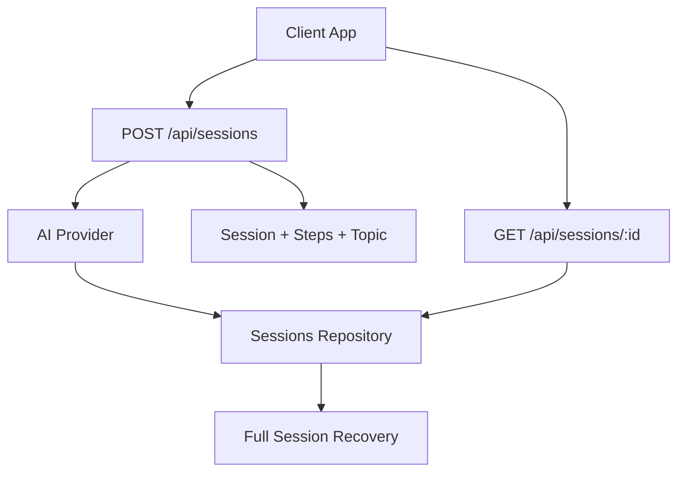
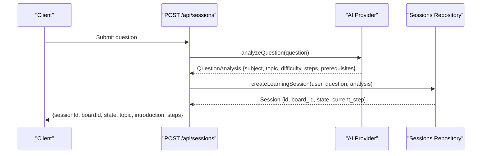
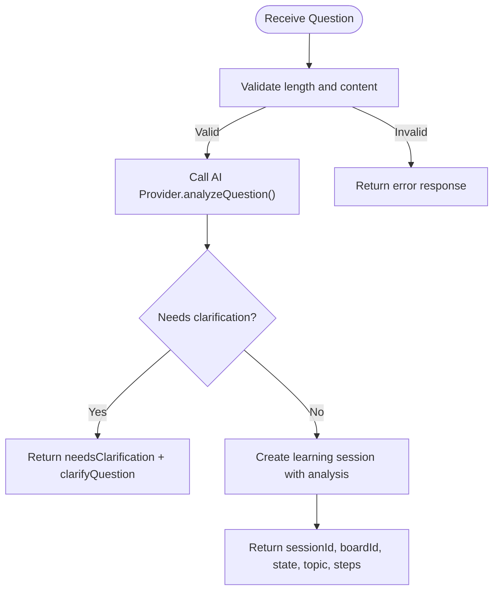
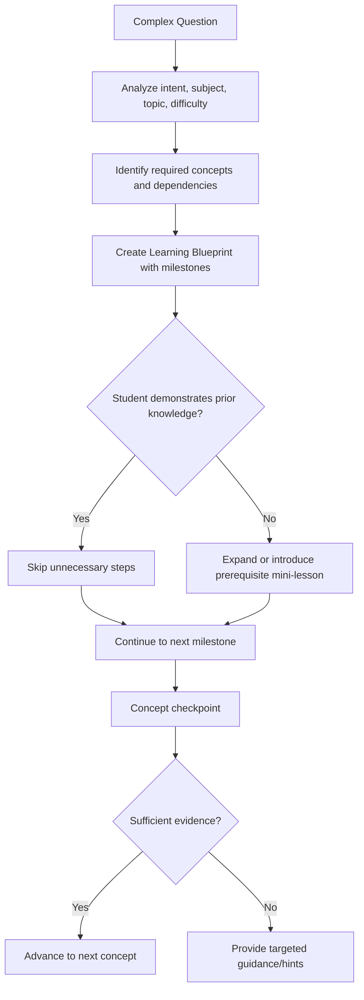
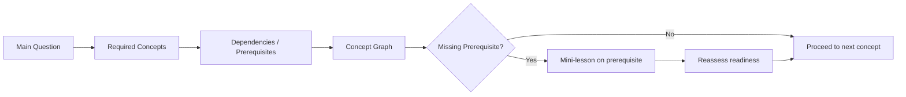
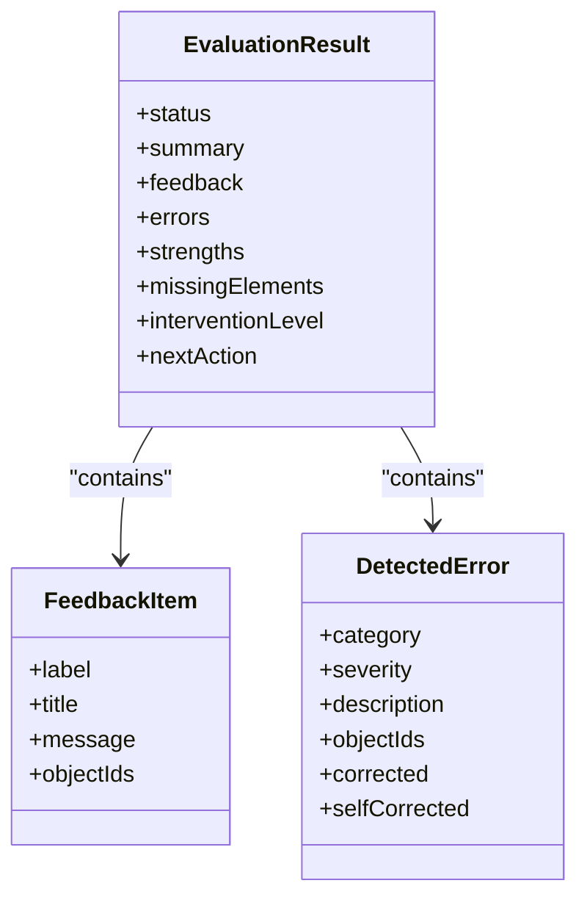
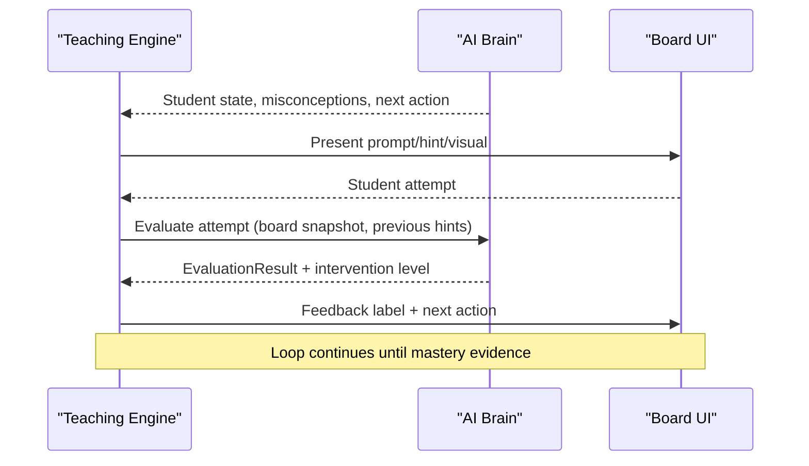
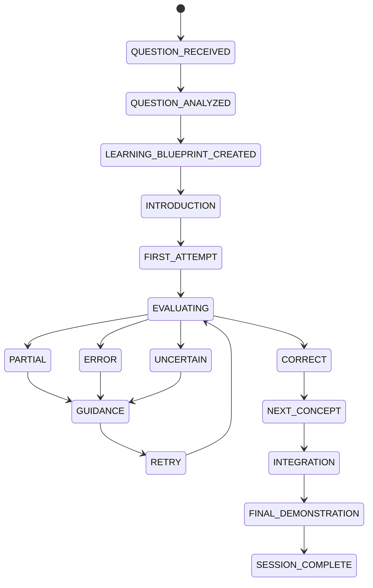
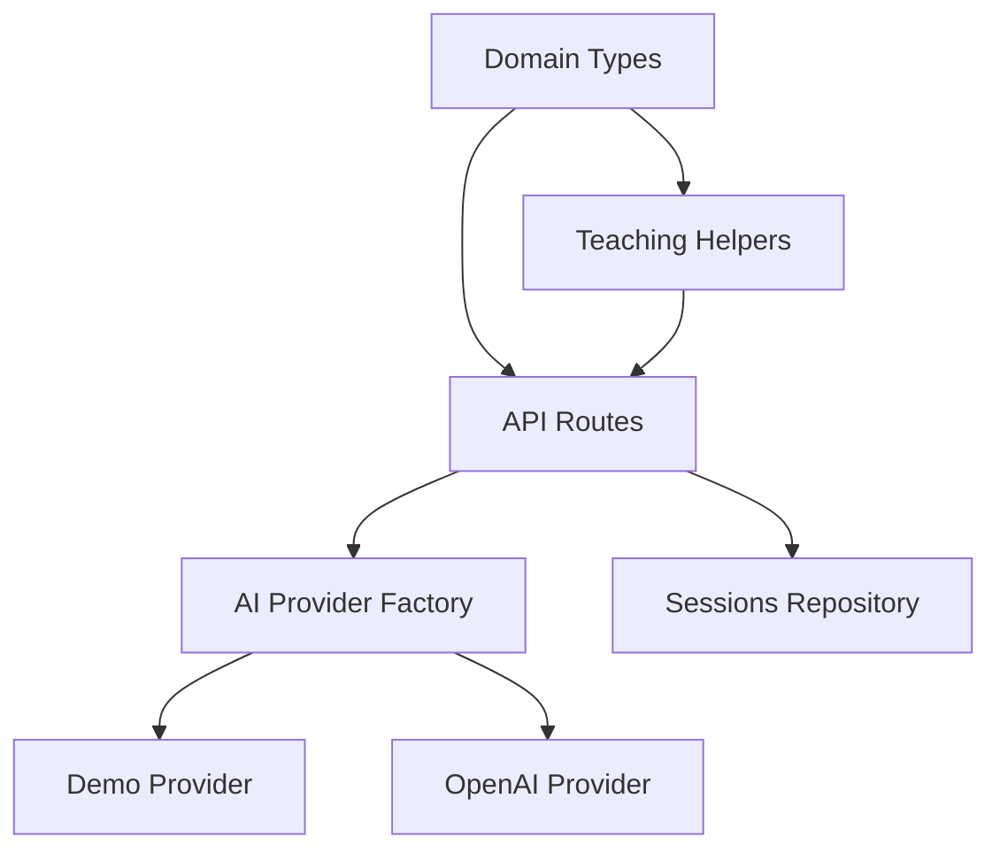

# Question Analysis System

<cite>
**Referenced Files in This Document**
- [04-ai-brain.md.txt](file://stepwise ai/specs/04-ai-brain.md.txt)
- [05-teaching-engine.md.txt](file://stepwise ai/specs/05-teaching-engine.md.txt)
- [types.ts](file://stepwise ai/app/lib/types.ts)
- [teaching.ts](file://stepwise ai/app/lib/teaching.ts)
- [index.ts](file://stepwise ai/app/lib/ai/index.ts)
- [route.ts (sessions POST)](file://stepwise ai/app/app/api/sessions/route.ts)
- [route.ts (sessions GET by id)](file://stepwise ai/app/app/api/sessions/[id]/route.ts)
</cite>

## Table of Contents
1. Introduction
2. Project Structure
3. Core Components
4. Architecture Overview
5. Detailed Component Analysis
6. Dependency Analysis
7. Performance Considerations
8. Troubleshooting Guide
9. Conclusion
10. Appendices

## Introduction
This document explains the question analysis system that decomposes complex problems into teachable steps and identifies prerequisite knowledge. It covers how natural language questions are processed to extract learning objectives, difficulty levels, and subject classification; how multi-step problems are broken down into manageable learning chunks; and how prerequisite concepts are mapped to create learning pathways. It also describes integration with the teaching engine for adaptive guidance and the role of AI in understanding student intent and context.

## Project Structure
The system is implemented as a Next.js application with:
- API routes that receive student questions, invoke the AI provider to analyze them, and persist sessions with structured analysis results.
- Shared domain types that define the session state machine, board model, evaluation feedback, hints, question analysis, and final report structures.
- Teaching helpers that standardize feedback labels, hint escalation, and intervention decisions.
- An AI provider abstraction that selects between demo and production providers based on environment configuration.

**Diagram sources**
- [route.ts (sessions POST):9-44](file://stepwise ai/app/app/api/sessions/route.ts#L9-L44)
- [route.ts (sessions GET by id):9-46](file://stepwise ai/app/app/api/sessions/[id]/route.ts#L9-L46)
- [index.ts:12-20](file://stepwise ai/app/lib/ai/index.ts#L12-L20)

**Section sources**
- [route.ts (sessions POST):9-44](file://stepwise ai/app/app/api/sessions/route.ts#L9-L44)
- [route.ts (sessions GET by id):9-46](file://stepwise ai/app/app/api/sessions/[id]/route.ts#L9-L46)
- [index.ts:12-20](file://stepwise ai/app/lib/ai/index.ts#L12-L20)

## Core Components
- AI Provider Abstraction: A single entry point to obtain an AI provider configured via environment variables. It supports switching between demo and real providers without changing application code.
- Question Analysis Model: A typed structure capturing intent, subject, topic, difficulty, required concepts, prerequisites, introduction text, step-by-step decomposition, reference answer, and optional clarification request.
- Evaluation and Feedback Model: Standardized labels and severities for feedback, error categorization, and next actions.
- Teaching Helpers: Functions to compute hint escalation, map evaluation status to session state transitions, and decide intervention levels based on evaluation outcomes and learning mode thresholds.
- API Endpoints: Create a learning session from a student’s question using the AI provider, and recover full session state including board objects and AI messages.

**Section sources**
- [types.ts:126-147](file://stepwise ai/app/lib/types.ts#L126-L147)
- [types.ts:61-114](file://stepwise ai/app/lib/types.ts#L61-L114)
- [teaching.ts:8-76](file://stepwise ai/app/lib/teaching.ts#L8-L76)
- [index.ts:12-20](file://stepwise ai/app/lib/ai/index.ts#L12-L20)
- [route.ts (sessions POST):9-44](file://stepwise ai/app/app/api/sessions/route.ts#L9-L44)
- [route.ts (sessions GET by id):9-46](file://stepwise ai/app/app/api/sessions/[id]/route.ts#L9-L46)

## Architecture Overview
The question analysis pipeline integrates three layers:
- API Layer: Validates input, calls the AI provider to analyze the question, persists the session, and returns structured results to the client.
- AI Layer: Interprets the question semantically, classifies subject/topic/difficulty, extracts required concepts and prerequisites, and produces a Learning Blueprint with steps.
- Teaching Integration: Uses standardized feedback labels, hint escalation, and intervention policies to guide the student adaptively through the steps.

**Diagram sources**
- [route.ts (sessions POST):9-44](file://stepwise ai/app/app/api/sessions/route.ts#L9-L44)
- [index.ts:12-20](file://stepwise ai/app/lib/ai/index.ts#L12-L20)

## Detailed Component Analysis

### Question Analysis Model and Processing
- Input validation ensures a non-empty question before invoking the AI provider.
- The AI provider analyzes the question to produce:
  - Intent, subject, topic, difficulty level
  - Required concepts and prerequisites
  - A structured set of steps with expected concepts per step
  - An introductory message and optional clarification request if the question is ambiguous
- On success, the server creates a learning session and returns the session identifier, board identifier, initial state, topic, introduction, and steps to the client.

**Diagram sources**
- [route.ts (sessions POST):9-44](file://stepwise ai/app/app/api/sessions/route.ts#L9-L44)

**Section sources**
- [route.ts (sessions POST):9-44](file://stepwise ai/app/app/api/sessions/route.ts#L9-L44)
- [types.ts:126-147](file://stepwise ai/app/lib/types.ts#L126-L147)

### Step Decomposition Algorithm
- The AI Brain defines principles for decomposing complex questions into meaningful learning components rather than arbitrary numbered steps.
- Decomposition is dynamic: it adapts based on student responses, skipping known concepts, expanding difficult ones, and temporarily revisiting prerequisites when gaps are detected.
- Internal checkpoints ensure each concept is validated before moving forward, and the blueprint evolves during the session.

**Diagram sources**
- [04-ai-brain.md.txt:6-11](file://stepwise ai/specs/04-ai-brain.md.txt#L6-L11)
- [04-ai-brain.md.txt:19-24](file://stepwise ai/specs/04-ai-brain.md.txt#L19-L24)
- [04-ai-brain.md.txt:37-44](file://stepwise ai/specs/04-ai-brain.md.txt#L37-L44)

**Section sources**
- [04-ai-brain.md.txt:6-11](file://stepwise ai/specs/04-ai-brain.md.txt#L6-L11)
- [04-ai-brain.md.txt:19-24](file://stepwise ai/specs/04-ai-brain.md.txt#L19-L24)
- [04-ai-brain.md.txt:37-44](file://stepwise ai/specs/04-ai-brain.md.txt#L37-L44)

### Prerequisite Identification and Learning Pathways
- The system maps concepts to their dependencies to build a concept graph, enabling detection of missing prerequisites and temporary detours to address foundational gaps.
- During a session, the AI maintains a student knowledge model tracking unknown, introduced, partially understood, misunderstood, and mastered concepts.
- When a prerequisite gap is detected, the Teaching Engine can pause progression, deliver a mini-lesson, and return to the main path once readiness is demonstrated.

**Diagram sources**
- [04-ai-brain.md.txt:10-18](file://stepwise ai/specs/04-ai-brain.md.txt#L10-L18)
- [04-ai-brain.md.txt:37-44](file://stepwise ai/specs/04-ai-brain.md.txt#L37-L44)

**Section sources**
- [04-ai-brain.md.txt:10-18](file://stepwise ai/specs/04-ai-brain.md.txt#L10-L18)
- [04-ai-brain.md.txt:37-44](file://stepwise ai/specs/04-ai-brain.md.txt#L37-L44)

### Evaluation, Feedback, and Intervention Policy
- Evaluation results include status (correct, partial, error, uncertain), summary, feedback items, errors, strengths, missing elements, intervention level, and next action.
- Feedback uses consistent icon+text labels to avoid color-only semantics.
- Hint escalation follows a seven-level ladder, with titles indicating increasing specificity and support.
- Intervention policy chooses minimal effective help: no intervention for correct/uncertain, mild prompts for partial, stronger intervention for clear errors.

**Diagram sources**
- [types.ts:61-114](file://stepwise ai/app/lib/types.ts#L61-L114)

**Section sources**
- [types.ts:61-114](file://stepwise ai/app/lib/types.ts#L61-L114)
- [teaching.ts:8-76](file://stepwise ai/app/lib/teaching.ts#L8-L76)

### Integration with the Teaching Engine
- The Teaching Engine converts AI Brain insights into adaptive interactions: deciding what the student should do next, whether to intervene, ask questions, provide hints, visualize, simplify, revisit prerequisites, or continue independently.
- It enforces a teaching loop: observe, understand, evaluate, decide intervention, respond, retry/re-evaluate until mastery evidence is sufficient.
- It supports progressive hints, explain-back activities, applications checks, and generalization tasks tailored to subject and learner profile.

**Diagram sources**
- [05-teaching-engine.md.txt:1-12](file://stepwise ai/specs/05-teaching-engine.md.txt#L1-L12)
- [types.ts:259-296](file://stepwise ai/app/lib/types.ts#L259-L296)

**Section sources**
- [05-teaching-engine.md.txt:1-12](file://stepwise ai/specs/05-teaching-engine.md.txt#L1-L12)
- [types.ts:259-296](file://stepwise ai/app/lib/types.ts#L259-L296)

### Role of AI in Understanding Intent and Context
- The AI Brain emphasizes semantic understanding over exact wording, distinguishing language errors from conceptual errors, and adapting to diverse student expressions and multilingual inputs.
- It tracks confidence about student intent and evaluation certainty separately, avoiding false certainty when recognition is unclear.
- It maintains a session state machine guiding transitions from question received to analyzed, blueprint created, introduction, attempts, evaluation, guidance, retries, concept checks, integration, final demonstration, and completion.

**Diagram sources**
- [types.ts:7-24](file://stepwise ai/app/lib/types.ts#L7-L24)

**Section sources**
- [04-ai-brain.md.txt:1-12](file://stepwise ai/specs/04-ai-brain.md.txt#L1-L12)
- [types.ts:7-24](file://stepwise ai/app/lib/types.ts#L7-L24)

### Examples of Analyzing Different Question Types
- Mathematical: Numerical problems are evaluated step-by-step; incorrect transformations are highlighted with specific labels and targeted hints.
- Conceptual: Theory questions assess relationships, mechanisms, cause/effect, and evidence; diagrams and analogies may be used to deepen understanding.
- Procedural: Programming and process-oriented questions focus on logic, algorithms, debugging, and data structures; guidance avoids replacing student work immediately and instead highlights assumptions and reasoning.

These examples align with the AI Brain’s domain-specific guidance and the Teaching Engine’s adaptive strategies.

**Section sources**
- [04-ai-brain.md.txt:23-30](file://stepwise ai/specs/04-ai-brain.md.txt#L23-L30)
- [05-teaching-engine.md.txt:20-24](file://stepwise ai/specs/05-teaching-engine.md.txt#L20-L24)

## Dependency Analysis
The system exhibits clear separation of concerns:
- API routes depend on authentication helpers, shared API helpers, the AI provider factory, and the sessions repository.
- The AI provider factory depends on environment configuration to select a concrete provider implementation.
- Domain types centralize contracts across modules, ensuring consistency in session state, board objects, evaluation results, hints, and reports.
- Teaching helpers encapsulate policy logic for feedback labels, hint escalation, and intervention decisions.

**Diagram sources**
- [types.ts:1-302](file://stepwise ai/app/lib/types.ts#L1-L302)
- [index.ts:12-20](file://stepwise ai/app/lib/ai/index.ts#L12-L20)
- [route.ts (sessions POST):9-44](file://stepwise ai/app/app/api/sessions/route.ts#L9-L44)

**Section sources**
- [types.ts:1-302](file://stepwise ai/app/lib/types.ts#L1-L302)
- [index.ts:12-20](file://stepwise ai/app/lib/ai/index.ts#L12-L20)
- [route.ts (sessions POST):9-44](file://stepwise ai/app/app/api/sessions/route.ts#L9-L44)

## Performance Considerations
- Minimize redundant AI calls by caching provider instances at runtime.
- Keep Board snapshots lightweight to reduce payload sizes during evaluation.
- Use incremental hint escalation to avoid overwhelming the student and to preserve cognitive load.
- Defer heavy computations (e.g., full-board analysis) until explicitly requested or necessary.
- Ensure network timeouts and error handling prevent long hangs during AI calls.

[No sources needed since this section provides general guidance]

## Troubleshooting Guide
- Empty or invalid question input: The API validates question length and returns a user-friendly error when insufficient.
- Ambiguous questions: The AI may request clarification; the API responds with a flag and suggested clarifying question.
- Session recovery: If the client refreshes, the GET endpoint reconstructs the full session state, board objects, and AI messages for continuity.
- Provider selection: Confirm environment variables to ensure the intended AI provider is active; demo mode is indicated in responses.

**Section sources**
- [route.ts (sessions POST):9-44](file://stepwise ai/app/app/api/sessions/route.ts#L9-L44)
- [route.ts (sessions GET by id):9-46](file://stepwise ai/app/app/api/sessions/[id]/route.ts#L9-L46)
- [index.ts:12-20](file://stepwise ai/app/lib/ai/index.ts#L12-L20)

## Conclusion
The question analysis system transforms natural language questions into structured learning blueprints with clear steps, prerequisites, and adaptive guidance. By integrating a robust AI provider abstraction, standardized evaluation and feedback models, and a teaching engine focused on minimal effective intervention, the system supports diverse subjects and learner profiles while preserving student agency and fostering genuine understanding.

[No sources needed since this section summarizes without analyzing specific files]

## Appendices

### API Definitions
- POST /api/sessions
  - Purpose: Create a learning session from a student’s question; returns session metadata, topic, introduction, and steps.
  - Request body: question string
  - Response: sessionId, boardId, state, topic, introduction, steps, provider info; may include needsClarification and clarifyQuestion
- GET /api/sessions/:id
  - Purpose: Recover full session state including board objects and AI messages for continuity after refresh.
  - Response: session details, objects, messages, provider info

**Section sources**
- [route.ts (sessions POST):9-44](file://stepwise ai/app/app/api/sessions/route.ts#L9-L44)
- [route.ts (sessions GET by id):9-46](file://stepwise ai/app/app/api/sessions/[id]/route.ts#L9-L46)