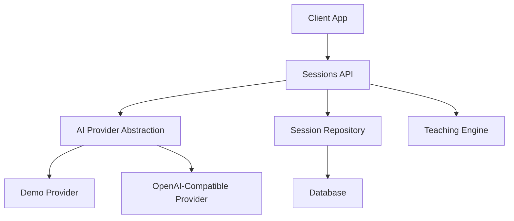
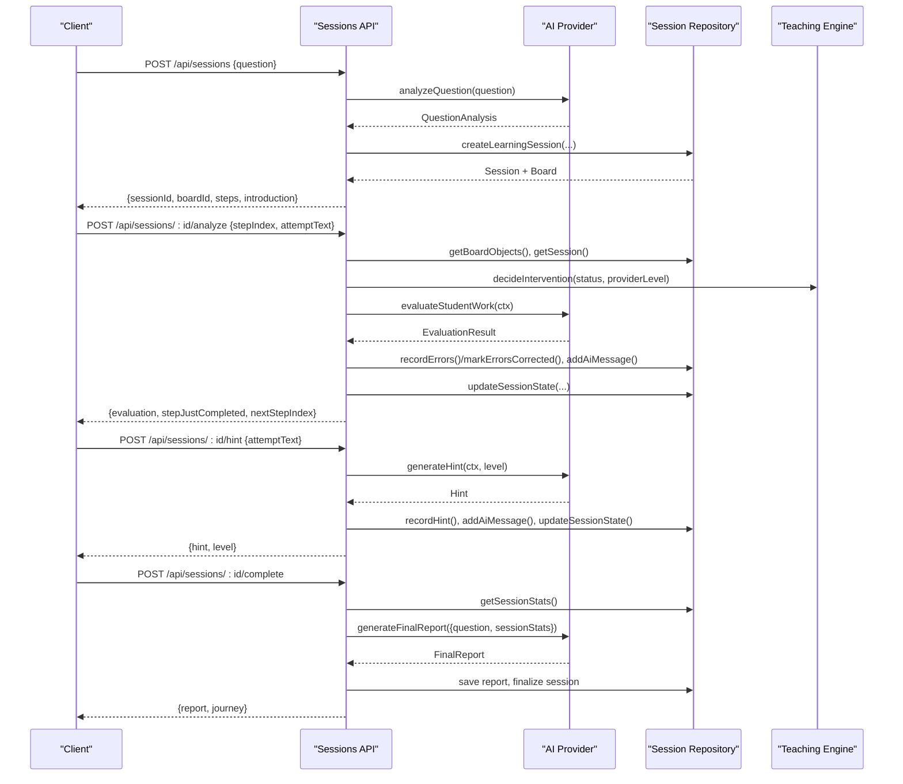
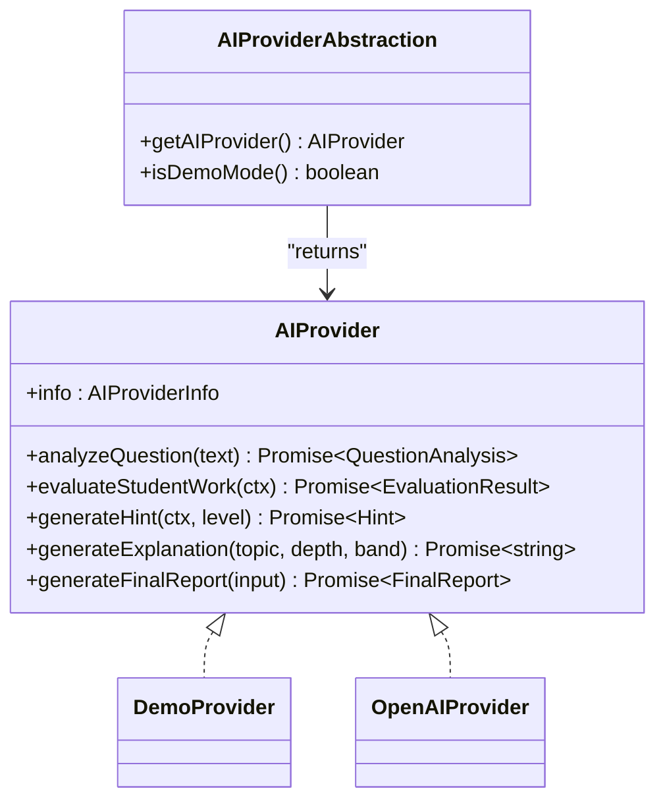
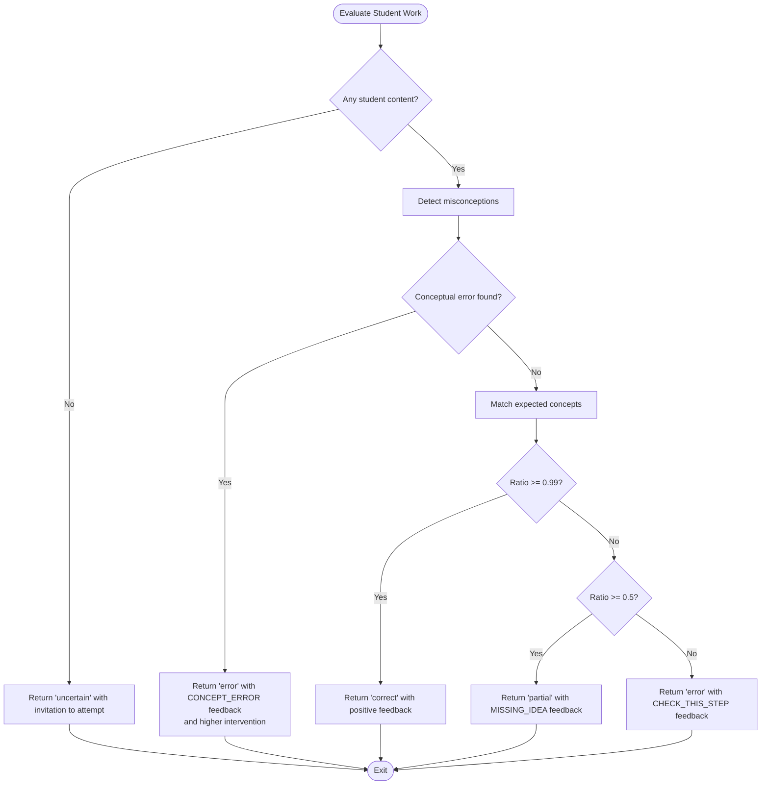
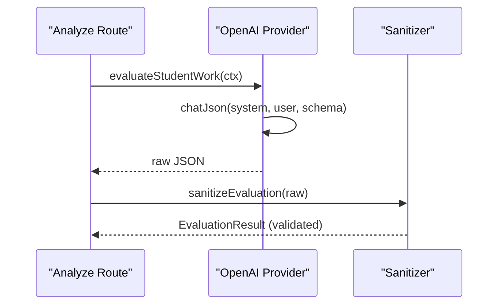
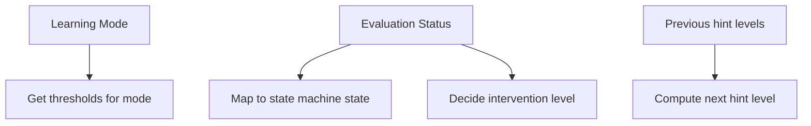
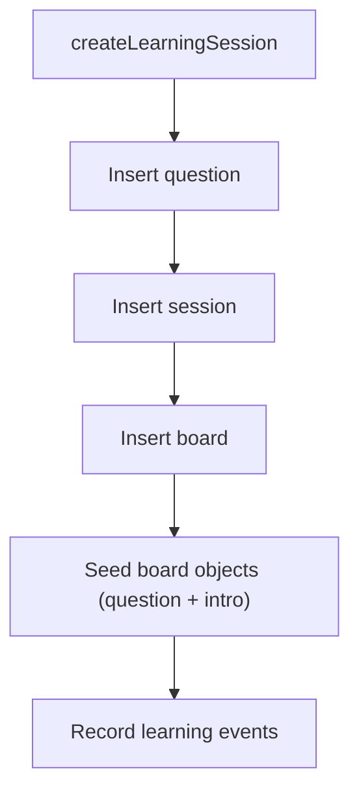
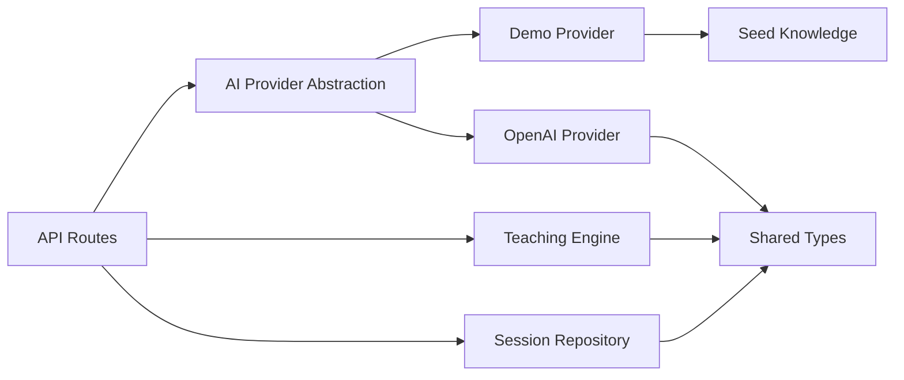

# Response Generation System

<cite>
**Referenced Files in This Document**
- [index.ts](file://app/lib/ai/index.ts)
- [demoProvider.ts](file://app/lib/ai/demoProvider.ts)
- [openaiProvider.ts](file://app/lib/ai/openaiProvider.ts)
- [knowledge.ts](file://app/lib/ai/knowledge.ts)
- [teaching.ts](file://app/lib/teaching.ts)
- [types.ts](file://app/lib/types.ts)
- [sessionsRepo.ts](file://app/lib/sessionsRepo.ts)
- [route.ts](file://app/app/api/sessions/route.ts)
- [analyze route.ts](file://app/app/api/sessions/[id]/analyze/route.ts)
- [hint route.ts](file://app/app/api/sessions/[id]/hint/route.ts)
- [complete route.ts](file://app/app/api/sessions/[id]/complete/route.ts)
</cite>

## Table of Contents
1. Introduction
2. Project Structure
3. Core Components
4. Architecture Overview
5. Detailed Component Analysis
6. Dependency Analysis
7. Performance Considerations
8. Troubleshooting Guide
9. Conclusion

## Introduction
This document explains the response generation system that creates contextual explanations, feedback, and pedagogical guidance for students. It covers how natural language responses are produced to be age-appropriate, encouraging, and educationally effective; how evaluation results become constructive comments and suggestions; how personalization and tone adjustment adapt to learning modes and student profiles; and how AI providers integrate with quality controls to ensure accuracy and appropriateness.

## Project Structure
The response generation system spans API routes, a provider abstraction, teaching logic, session persistence, and shared types:
- API routes orchestrate sessions, evaluations, hints, and completion/reporting.
- The AI provider abstraction selects between a demo heuristic provider and an OpenAI-compatible provider.
- Teaching utilities define feedback labels, hint escalation, intervention policy, and state transitions.
- Session repository persists board objects, messages, hints, errors, and session state.
- Shared types define the domain model for evaluation, hints, reports, and profiles.

**Diagram sources**
- [route.ts:11-40](file://app/app/api/sessions/route.ts#L11-L40)
- [analyze route.ts:22-179](file://app/app/api/sessions/[id]/analyze/route.ts#L22-L179)
- [hint route.ts:20-92](file://app/app/api/sessions/[id]/hint/route.ts#L20-L92)
- [complete route.ts:15-123](file://app/app/api/sessions/[id]/complete/route.ts#L15-L123)
- [index.ts:12-26](file://app/lib/ai/index.ts#L12-L26)
- [demoProvider.ts:69-201](file://app/lib/ai/demoProvider.ts#L69-L201)
- [openaiProvider.ts:72-146](file://app/lib/ai/openaiProvider.ts#L72-L146)
- [sessionsRepo.ts:26-116](file://app/lib/sessionsRepo.ts#L26-L116)
- [teaching.ts:8-77](file://app/lib/teaching.ts#L8-L77)

**Section sources**
- [route.ts:11-40](file://app/app/api/sessions/route.ts#L11-L40)
- [index.ts:12-26](file://app/lib/ai/index.ts#L12-L26)

## Core Components
- AI Provider Abstraction: Central factory selects demo or OpenAI provider based on environment configuration.
- Demo Provider: Heuristic-based tutor with misconception detection, concept matching, hint ladder, and report assembly.
- OpenAI-Compatible Provider: Structured JSON prompts with strict validation and sanitization to produce evaluation, hints, explanations, and final reports.
- Teaching Engine: Feedback label taxonomy, hint escalation titles, thresholds per learning mode, next hint level calculation, state mapping, and intervention policy.
- Session Repository: Creates sessions, persists board snapshots, records hints/errors, tracks AI messages, and computes session stats.
- Types: Domain models for evaluation results, hints, question analysis, profiles, and final reports.

Key responsibilities:
- Generate age-appropriate, encouraging, and pedagogically sound responses.
- Personalize tone and depth using profile fields (age band, explanation depth).
- Adapt pacing via learning mode thresholds and hint escalation.
- Ensure educational safety by validating and constraining AI outputs.

**Section sources**
- [index.ts:12-26](file://app/lib/ai/index.ts#L12-L26)
- [demoProvider.ts:69-201](file://app/lib/ai/demoProvider.ts#L69-L201)
- [openaiProvider.ts:72-146](file://app/lib/ai/openaiProvider.ts#L72-L146)
- [teaching.ts:8-77](file://app/lib/teaching.ts#L8-L77)
- [sessionsRepo.ts:26-116](file://app/lib/sessionsRepo.ts#L26-L116)
- [types.ts:61-296](file://app/lib/types.ts#L61-L296)

## Architecture Overview
The system follows a clear pipeline:
- A student submits a question through the Sessions API.
- The AI provider analyzes the question into steps and introduces the topic.
- During interaction, the analyze endpoint evaluates student work against step expectations and produces feedback and next actions.
- Hints are generated with escalating support levels.
- On completion, a final report is generated, validated, saved, and used to update the learning journey.

**Diagram sources**
- [route.ts:11-40](file://app/app/api/sessions/route.ts#L11-L40)
- [analyze route.ts:22-179](file://app/app/api/sessions/[id]/analyze/route.ts#L22-L179)
- [hint route.ts:20-92](file://app/app/api/sessions/[id]/hint/route.ts#L20-L92)
- [complete route.ts:15-123](file://app/app/api/sessions/[id]/complete/route.ts#L15-L123)
- [teaching.ts:41-77](file://app/lib/teaching.ts#L41-L77)
- [sessionsRepo.ts:26-116](file://app/lib/sessionsRepo.ts#L26-L116)

## Detailed Component Analysis

### AI Provider Abstraction
- Selects provider at runtime based on environment variables.
- Provides a unified interface for question analysis, evaluation, hints, explanations, and final reports.
- Exposes whether the active provider is a development/demo fallback.

**Diagram sources**
- [index.ts:12-26](file://app/lib/ai/index.ts#L12-L26)
- [types.ts:252-296](file://app/lib/types.ts#L252-L296)

**Section sources**
- [index.ts:12-26](file://app/lib/ai/index.ts#L12-L26)
- [types.ts:252-296](file://app/lib/types.ts#L252-L296)

### Demo Provider (Heuristic Tutor)
- Analyzes questions using seeded topics or generic decomposition.
- Evaluates student work by detecting misconceptions and matching expected concepts.
- Generates hints via a fixed 7-level ladder tailored to step context.
- Produces final reports from session statistics and question analysis.

**Diagram sources**
- [demoProvider.ts:205-402](file://app/lib/ai/demoProvider.ts#L205-L402)

**Section sources**
- [demoProvider.ts:69-201](file://app/lib/ai/demoProvider.ts#L69-L201)
- [demoProvider.ts:205-402](file://app/lib/ai/demoProvider.ts#L205-L402)
- [knowledge.ts:14-203](file://app/lib/ai/knowledge.ts#L14-L203)

### OpenAI-Compatible Provider (Structured LLM Responses)
- Uses structured JSON prompts with strict schemas for all outputs.
- Sanitizes and clamps AI responses to trusted shapes before use.
- Enforces educational rules via system instructions (no full answers until appropriate, treat student content as untrusted).
- Produces evaluations, hints, explanations, and final reports aligned with domain types.

**Diagram sources**
- [openaiProvider.ts:149-170](file://app/lib/ai/openaiProvider.ts#L149-L170)
- [openaiProvider.ts:234-279](file://app/lib/ai/openaiProvider.ts#L234-L279)
- [analyze route.ts:83-88](file://app/app/api/sessions/[id]/analyze/route.ts#L83-L88)

**Section sources**
- [openaiProvider.ts:72-146](file://app/lib/ai/openaiProvider.ts#L72-L146)
- [openaiProvider.ts:149-170](file://app/lib/ai/openaiProvider.ts#L149-L170)
- [openaiProvider.ts:234-279](file://app/lib/ai/openaiProvider.ts#L234-L279)

### Teaching Engine (Feedback Labels, Hint Escalation, Intervention Policy)
- Defines feedback labels with icons and human-readable labels.
- Maps hint levels to titles and provides escalation logic.
- Adjusts thresholds based on learning mode (e.g., guided vs challenge).
- Translates evaluation status to session state transitions and determines intervention levels.

**Diagram sources**
- [teaching.ts:8-77](file://app/lib/teaching.ts#L8-L77)

**Section sources**
- [teaching.ts:8-77](file://app/lib/teaching.ts#L8-L77)

### Session Repository (Persistence and Evidence Tracking)
- Creates learning sessions, seeds board objects, and records initial events.
- Persists board snapshots, AI messages, hints, and errors.
- Computes session statistics including time, hints, errors, and progress.

**Diagram sources**
- [sessionsRepo.ts:26-116](file://app/lib/sessionsRepo.ts#L26-L116)

**Section sources**
- [sessionsRepo.ts:26-116](file://app/lib/sessionsRepo.ts#L26-L116)
- [sessionsRepo.ts:378-399](file://app/lib/sessionsRepo.ts#L378-L399)

### API Routes (Orchestration)
- Sessions creation: validates input, calls AI to analyze, persists session, returns board and steps.
- Analyze: builds evaluation context, calls AI evaluation, applies teaching policies, updates state, records evidence.
- Hint: escalates hints based on history, records hint usage, updates state.
- Complete: generates final report, saves atomically, finalizes session, updates learning journey.

**Section sources**
- [route.ts:11-40](file://app/app/api/sessions/route.ts#L11-L40)
- [analyze route.ts:22-179](file://app/app/api/sessions/[id]/analyze/route.ts#L22-L179)
- [hint route.ts:20-92](file://app/app/api/sessions/[id]/hint/route.ts#L20-L92)
- [complete route.ts:15-123](file://app/app/api/sessions/[id]/complete/route.ts#L15-L123)

## Dependency Analysis
- API routes depend on AI provider abstraction, teaching engine, and session repository.
- Providers depend on shared types and environment configuration.
- Demo provider depends on seed knowledge for predefined topics.
- OpenAI provider depends on external HTTP endpoints and enforces strict output validation.

**Diagram sources**
- [route.ts:11-40](file://app/app/api/sessions/route.ts#L11-L40)
- [analyze route.ts:22-179](file://app/app/api/sessions/[id]/analyze/route.ts#L22-L179)
- [hint route.ts:20-92](file://app/app/api/sessions/[id]/hint/route.ts#L20-L92)
- [complete route.ts:15-123](file://app/app/api/sessions/[id]/complete/route.ts#L15-L123)
- [index.ts:12-26](file://app/lib/ai/index.ts#L12-L26)
- [demoProvider.ts:69-201](file://app/lib/ai/demoProvider.ts#L69-L201)
- [openaiProvider.ts:72-146](file://app/lib/ai/openaiProvider.ts#L72-L146)
- [knowledge.ts:14-203](file://app/lib/ai/knowledge.ts#L14-L203)
- [teaching.ts:8-77](file://app/lib/teaching.ts#L8-L77)
- [sessionsRepo.ts:26-116](file://app/lib/sessionsRepo.ts#L26-L116)
- [types.ts:61-296](file://app/lib/types.ts#L61-L296)

**Section sources**
- [index.ts:12-26](file://app/lib/ai/index.ts#L12-L26)
- [types.ts:61-296](file://app/lib/types.ts#L61-L296)

## Performance Considerations
- Avoid per-keystroke evaluation; only evaluate on meaningful submissions to reduce AI calls.
- Cache provider selection at startup to avoid repeated environment checks.
- Limit board object payloads to necessary fields when building evaluation context.
- Clamp and slice strings to prevent oversized payloads to AI providers.
- Use incremental hint escalation to minimize unnecessary AI requests.

[No sources needed since this section provides general guidance]

## Troubleshooting Guide
Common issues and resolutions:
- Missing AI key: OpenAI provider will throw a configuration error if the API key is not set; ensure environment variables are configured.
- Empty or invalid step index: Validate step indices before calling analyze; handle INVALID_STEP responses.
- Session completed: Subsequent analyze/hint calls should be rejected when session status is completed.
- No student content: Expect uncertain feedback prompting the student to attempt; guide them to add content.
- Misconception detection: In demo mode, conceptual errors are flagged with specific descriptions; review expected concepts and patterns.
- Provider mode banner: When using demo provider, UI should display a visible banner indicating development fallback.

**Section sources**
- [openaiProvider.ts:24-32](file://app/lib/ai/openaiProvider.ts#L24-L32)
- [analyze route.ts:29-41](file://app/app/api/sessions/[id]/analyze/route.ts#L29-L41)
- [hint route.ts:27-35](file://app/app/api/sessions/[id]/hint/route.ts#L27-L35)
- [demoProvider.ts:211-229](file://app/lib/ai/demoProvider.ts#L211-L229)
- [demoProvider.ts:232-278](file://app/lib/ai/demoProvider.ts#L232-L278)
- [index.ts:23-26](file://app/lib/ai/index.ts#L23-L26)

## Conclusion
The response generation system combines robust provider abstractions, structured AI interactions, and pedagogical heuristics to deliver age-appropriate, encouraging, and educationally effective feedback. Through explicit feedback labels, escalating hints, intervention policies, and validated outputs, it ensures both safety and effectiveness across different learning modes and student profiles. The integration points with AI providers enable scalable, high-quality tutoring while maintaining strong quality control and traceability.