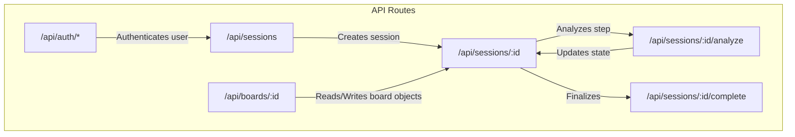
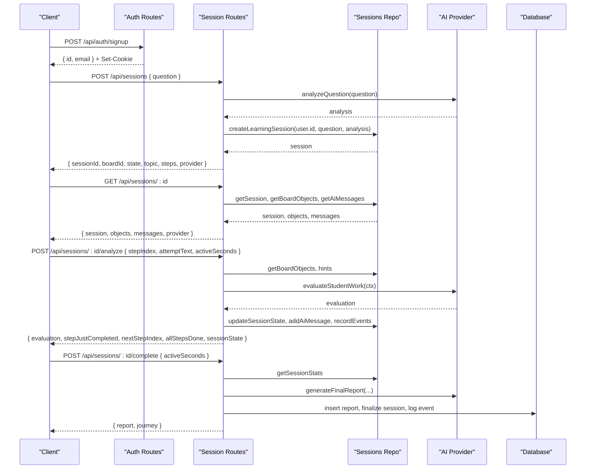
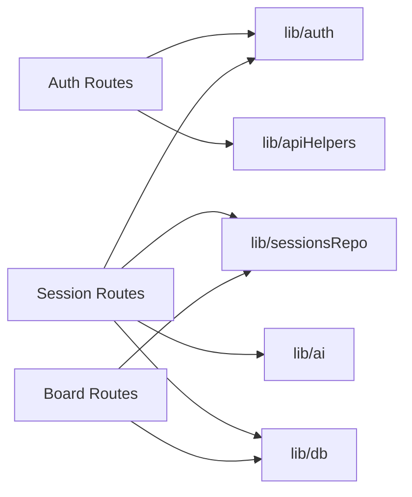

# API Reference

<cite>
**Referenced Files in This Document**
- [route.ts](file://stepwise ai/app/app/api/auth/login/route.ts)
- [route.ts](file://stepwise ai/app/app/api/auth/signup/route.ts)
- [route.ts](file://stepwise ai/app/app/api/auth/logout/route.ts)
- [route.ts](file://stepwise ai/app/app/api/sessions/route.ts)
- [route.ts](file://stepwise ai/app/app/api/sessions/[id]/route.ts)
- [route.ts](file://stepwise ai/app/app/api/sessions/[id]/analyze/route.ts)
- [route.ts](file://stepwise ai/app/app/api/sessions/[id]/complete/route.ts)
- [route.ts](file://stepwise ai/app/app/api/boards/[id]/route.ts)
</cite>

## Table of Contents
1. Introduction
2. Project Structure
3. Core Components
4. Architecture Overview
5. Detailed Component Analysis
6. Dependency Analysis
7. Performance Considerations
8. Troubleshooting Guide
9. Conclusion
10. Appendices

## Introduction
This document provides a comprehensive API reference for StepWise AI’s REST endpoints. It covers authentication, session management, board operations, and reporting. For each endpoint, you will find HTTP methods, URL patterns, request/response schemas, authentication requirements, validation rules, error codes, and example requests. The guide also includes security considerations, error handling patterns, versioning strategy, client integration guidelines, and production deployment notes.

## Project Structure
The API is implemented as Next.js Route Handlers under the app directory. Authentication routes handle login, signup, and logout. Session routes manage learning sessions, including creation, recovery, analysis, and completion. Board routes provide CRUD-like operations for board objects and event recording. Reporting is integrated into the session completion flow and accessible via dedicated report retrieval (not shown here).

**Diagram sources**
- [route.ts:7-29](file://stepwise ai/app/app/api/auth/login/route.ts#L7-L29)
- [route.ts:10-35](file://stepwise ai/app/app/api/auth/signup/route.ts#L10-L35)
- [route.ts:7-11](file://stepwise ai/app/app/api/auth/logout/route.ts#L7-L11)
- [route.ts:11-44](file://stepwise ai/app/app/api/sessions/route.ts#L11-L44)
- [route.ts:11-51](file://stepwise ai/app/app/api/sessions/[id]/route.ts#L11-L51)
- [route.ts:22-179](file://stepwise ai/app/app/api/sessions/[id]/analyze/route.ts#L22-L179)
- [route.ts:15-123](file://stepwise ai/app/app/api/sessions/[id]/complete/route.ts#L15-L123)
- [route.ts:29-105](file://stepwise ai/app/app/api/boards/[id]/route.ts#L29-L105)

**Section sources**
- [route.ts:7-29](file://stepwise ai/app/app/api/auth/login/route.ts#L7-L29)
- [route.ts:10-35](file://stepwise ai/app/app/api/auth/signup/route.ts#L10-L35)
- [route.ts:7-11](file://stepwise ai/app/app/api/auth/logout/route.ts#L7-L11)
- [route.ts:11-56](file://stepwise ai/app/app/api/sessions/route.ts#L11-L56)
- [route.ts:11-51](file://stepwise ai/app/app/api/sessions/[id]/route.ts#L11-L51)
- [route.ts:22-179](file://stepwise ai/app/app/api/sessions/[id]/analyze/route.ts#L22-L179)
- [route.ts:15-123](file://stepwise ai/app/app/api/sessions/[id]/complete/route.ts#L15-L123)
- [route.ts:29-105](file://stepwise ai/app/app/api/boards/[id]/route.ts#L29-L105)

## Core Components
- Authentication: Login, signup, and logout using session cookies.
- Sessions: Create, retrieve full session state, analyze student work, and complete sessions to generate reports.
- Boards: Read and persist board objects; record meaningful events.
- Reporting: Final report generation and journey updates are part of session completion.

Key behaviors:
- All protected endpoints require an active session cookie set by auth routes.
- Input validation uses helper utilities to sanitize strings and integers with safe defaults.
- Errors follow a consistent pattern with machine-readable codes and human-friendly messages.

**Section sources**
- [route.ts:7-29](file://stepwise ai/app/app/api/auth/login/route.ts#L7-L29)
- [route.ts:10-35](file://stepwise ai/app/app/api/auth/signup/route.ts#L10-L35)
- [route.ts:7-11](file://stepwise ai/app/app/api/auth/logout/route.ts#L7-L11)
- [route.ts:11-56](file://stepwise ai/app/app/api/sessions/route.ts#L11-L56)
- [route.ts:11-51](file://stepwise ai/app/app/api/sessions/[id]/route.ts#L11-L51)
- [route.ts:22-179](file://stepwise ai/app/app/api/sessions/[id]/analyze/route.ts#L22-L179)
- [route.ts:15-123](file://stepwise ai/app/app/api/sessions/[id]/complete/route.ts#L15-L123)
- [route.ts:29-105](file://stepwise ai/app/app/api/boards/[id]/route.ts#L29-L105)

## Architecture Overview
The API follows a layered design:
- Route handlers parse and validate requests, enforce authentication, and delegate to domain logic.
- Domain logic interacts with storage and AI providers to evaluate student work and produce reports.
- Responses are standardized with success envelopes or structured errors.

**Diagram sources**
- [route.ts:10-35](file://stepwise ai/app/app/api/auth/signup/route.ts#L10-L35)
- [route.ts:11-44](file://stepwise ai/app/app/api/sessions/route.ts#L11-L44)
- [route.ts:11-51](file://stepwise ai/app/app/api/sessions/[id]/route.ts#L11-L51)
- [route.ts:22-179](file://stepwise ai/app/app/api/sessions/[id]/analyze/route.ts#L22-L179)
- [route.ts:15-123](file://stepwise ai/app/app/api/sessions/[id]/complete/route.ts#L15-L123)

## Detailed Component Analysis

### Authentication
Endpoints:
- POST /api/auth/signup
- POST /api/auth/login
- POST /api/auth/logout

Authentication method:
- Cookie-based session established on successful signup or login. Subsequent requests must include the session cookie.

POST /api/auth/signup
- Purpose: Register a new user and start a session.
- Request body:
  - email: string, required, valid email format, max length enforced by helper
  - password: string, required, minimum length enforced by route
- Response:
  - 201 Created: { id: number, email: string }
  - Error responses use standard envelope with code and message
- Validation:
  - Email format validated with regex
  - Password length checked
  - Duplicate email check against database
- Security:
  - Passwords are handled by registration utility
  - Session cookie is set on success

POST /api/auth/login
- Purpose: Authenticate existing user and start a session.
- Request body:
  - email: string, required, trimmed and lowercased
  - password: string, required
- Response:
  - 200 OK: { id: number, email: string }
  - 401 Unauthorized: INVALID_CREDENTIALS when credentials are wrong
- Behavior:
  - Constant-time-ish messaging to avoid revealing whether email exists
  - Session cookie set on success

POST /api/auth/logout
- Purpose: End current session and clear cookie.
- Request: No body required
- Response:
  - 200 OK: { signedOut: boolean }
- Behavior:
  - Destroys server-side session and clears cookie

Example requests:
- Signup: curl -X POST https://your-domain/api/auth/signup -H "Content-Type: application/json" -d '{"email":"user@example.com","password":"securepass"}'
- Login: curl -X POST https://your-domain/api/auth/login -H "Content-Type: application/json" -d '{"email":"user@example.com","password":"securepass"}'
- Logout: curl -X POST https://your-domain/api/auth/logout

Error codes:
- INVALID_EMAIL: Provided email does not match expected format
- WEAK_PASSWORD: Password below minimum length
- EMAIL_TAKEN: Email already registered
- MISSING_CREDENTIALS: Required fields missing
- INVALID_CREDENTIALS: Email or password incorrect

**Section sources**
- [route.ts:10-35](file://stepwise ai/app/app/api/auth/signup/route.ts#L10-L35)
- [route.ts:7-29](file://stepwise ai/app/app/api/auth/login/route.ts#L7-L29)
- [route.ts:7-11](file://stepwise ai/app/app/api/auth/logout/route.ts#L7-L11)

### Sessions
Endpoints:
- POST /api/sessions
- GET /api/sessions
- GET /api/sessions/:id
- POST /api/sessions/:id/analyze
- POST /api/sessions/:id/complete

Authentication:
- Requires active session cookie from auth routes.

POST /api/sessions
- Purpose: Start a new learning session based on a question.
- Request body:
  - question: string, required, min length enforced by route
- Response:
  - 201 Created: { sessionId: number, boardId: number, state: string, topic: string, introduction: string, steps: array, provider: { displayName: string, isDemo: boolean } }
  - If clarification needed: { needsClarification: boolean, clarifyQuestion: string }
- Flow:
  - Validates question
  - Calls AI to analyze question
  - Creates session and returns initial state

GET /api/sessions
- Purpose: List recent sessions for the current user.
- Response:
  - { sessions: array }

GET /api/sessions/:id
- Purpose: Recover full session state, board objects, and AI messages.
- Path parameter:
  - id: integer, required
- Response:
  - { session: { id, status, state, currentStep, activeSeconds, startedAt, question, analysis, stateData, boardId, boardTitle }, objects: array, messages: array, provider: { displayName, isDemo } }
- Notes:
  - Ensures persistence across refreshes per specification

POST /api/sessions/:id/analyze
- Purpose: Evaluate student work for a specific step and update session state.
- Path parameter:
  - id: integer, required
- Request body:
  - stepIndex: integer, optional, defaults to current step
  - attemptText: string, optional, max length enforced
  - activeSeconds: integer, optional
- Response:
  - { evaluation: { status, summary, feedback, strengths, missingElements, nextAction }, stepJustCompleted: boolean, stepCompleted: number, nextStepIndex: number, allStepsDone: boolean, sessionState: string }
- Behavior:
  - Builds context from board objects, hints, and profile
  - Updates session state, records errors/self-corrections, logs events
  - Advances steps on correct answers

POST /api/sessions/:id/complete
- Purpose: Finalize session, generate final report, and update learning journey.
- Path parameter:
  - id: integer, required
- Request body:
  - activeSeconds: integer, optional
- Response:
  - { report: object, journey: object }
- Idempotency:
  - If a report already exists for this session/user, returns existing report with alreadyExisted flag
- Atomicity:
  - Report insertion, session finalization, and event logging occur within a transaction

Example requests:
- Create session: curl -X POST https://your-domain/api/sessions -H "Content-Type: application/json" -d '{"question":"How do I solve quadratic equations?"}'
- Analyze step: curl -X POST https://your-domain/api/sessions/123/analyze -H "Content-Type: application/json" -d '{"stepIndex":0,"attemptText":"I think x = ...","activeSeconds":120}'
- Complete session: curl -X POST https://your-domain/api/sessions/123/complete -H "Content-Type: application/json" -d '{"activeSeconds":300}'

Error codes:
- EMPTY_QUESTION: Question too short or missing
- SESSION_COMPLETED: Attempted to analyze a completed session
- INVALID_STEP: Step index out of range
- NOT_FOUND: Session not found

**Section sources**
- [route.ts:11-56](file://stepwise ai/app/app/api/sessions/route.ts#L11-L56)
- [route.ts:11-51](file://stepwise ai/app/app/api/sessions/[id]/route.ts#L11-L51)
- [route.ts:22-179](file://stepwise ai/app/app/api/sessions/[id]/analyze/route.ts#L22-L179)
- [route.ts:15-123](file://stepwise ai/app/app/api/sessions/[id]/complete/route.ts#L15-L123)

### Boards
Endpoints:
- GET /api/boards/:id
- PUT /api/boards/:id
- POST /api/boards/:id/event

Authentication:
- Requires active session cookie.

GET /api/boards/:id
- Purpose: Retrieve board objects for a board owned by the current user.
- Path parameter:
  - id: integer, required
- Response:
  - { objects: array }

PUT /api/boards/:id
- Purpose: Persist a snapshot of board objects (debounced client-side).
- Path parameter:
  - id: integer, required
- Request body:
  - objects: array of board objects (max items processed enforced)
  - Each object includes fields such as id, type, coordinates, content, style, meta, owner
- Response:
  - { saved: boolean, count: number }
- Validation:
  - Type whitelist enforced
  - Owner whitelist enforced
  - Content length capped

POST /api/boards/:id/event
- Purpose: Record meaningful board events for analytics or telemetry.
- Path parameter:
  - id: integer, required
- Request body:
  - eventType: string, optional, default value used if missing
  - payload: object, optional
- Response:
  - { recorded: boolean }

Ownership:
- Only boards belonging to the current user can be accessed or modified.

Example requests:
- Get board: curl -X GET https://your-domain/api/boards/456
- Save board: curl -X PUT https://your-domain/api/boards/456 -H "Content-Type: application/json" -d '{"objects":[...]}'
- Record event: curl -X POST https://your-domain/api/boards/456/event -H "Content-Type: application/json" -d '{"eventType":"object_moved","payload":{"objectId":"abc"}}'

Error codes:
- NOT_FOUND: Board not found or not owned by user

**Section sources**
- [route.ts:29-105](file://stepwise ai/app/app/api/boards/[id]/route.ts#L29-L105)

### Reporting
Reporting is integrated into session completion:
- POST /api/sessions/:id/complete generates a final report and updates the learning journey atomically.
- Reports are stored and can be retrieved later (implementation details may vary; this endpoint ensures availability upon completion).

Response highlights:
- report: structured final report with session statistics, errors, self-corrections, and insights
- journey: updated learning journey data reflecting progress and concepts

Idempotency:
- Repeated calls return the same report without duplication.

**Section sources**
- [route.ts:15-123](file://stepwise ai/app/app/api/sessions/[id]/complete/route.ts#L15-L123)

## Dependency Analysis
High-level dependencies between route handlers and internal modules:
- Auth routes depend on authentication utilities and database helpers.
- Session routes depend on AI provider, sessions repository, and database.
- Board routes depend on sessions repository and database.

**Diagram sources**
- [route.ts:7-29](file://stepwise ai/app/app/api/auth/login/route.ts#L7-L29)
- [route.ts:10-35](file://stepwise ai/app/app/api/auth/signup/route.ts#L10-L35)
- [route.ts:11-56](file://stepwise ai/app/app/api/sessions/route.ts#L11-L56)
- [route.ts:11-51](file://stepwise ai/app/app/api/sessions/[id]/route.ts#L11-L51)
- [route.ts:22-179](file://stepwise ai/app/app/api/sessions/[id]/analyze/route.ts#L22-L179)
- [route.ts:15-123](file://stepwise ai/app/app/api/sessions/[id]/complete/route.ts#L15-L123)
- [route.ts:29-105](file://stepwise ai/app/app/api/boards/[id]/route.ts#L29-L105)

**Section sources**
- [route.ts:7-29](file://stepwise ai/app/app/api/auth/login/route.ts#L7-L29)
- [route.ts:10-35](file://stepwise ai/app/app/api/auth/signup/route.ts#L10-L35)
- [route.ts:11-56](file://stepwise ai/app/app/api/sessions/route.ts#L11-L56)
- [route.ts:11-51](file://stepwise ai/app/app/api/sessions/[id]/route.ts#L11-L51)
- [route.ts:22-179](file://stepwise ai/app/app/api/sessions/[id]/analyze/route.ts#L22-L179)
- [route.ts:15-123](file://stepwise ai/app/app/api/sessions/[id]/complete/route.ts#L15-L123)
- [route.ts:29-105](file://stepwise ai/app/app/api/boards/[id]/route.ts#L29-L105)

## Performance Considerations
- Debounce board saves on the client side; the server accepts snapshots up to a bounded size to prevent abuse.
- Analyze endpoint should be called only on meaningful submissions, not per keystroke, to reduce AI load.
- Use GET /api/sessions/:id to recover state after refresh rather than re-analyzing.
- Batch operations where possible; avoid excessive small writes.

[No sources needed since this section provides general guidance]

## Troubleshooting Guide
Common issues and resolutions:
- Missing credentials: Ensure both email and password are provided for login/signup.
- Invalid email: Check email format before sending.
- Weak password: Increase password length to meet minimum requirements.
- Email taken: Use a different email address.
- Session not found: Verify the session ID and that it belongs to the current user.
- Session completed: Do not call analyze on completed sessions; proceed to completion or view report.
- Server errors: Inspect logs for stack traces; these endpoints wrap exceptions in a standard server error response.

Error response pattern:
- Errors are returned with a machine-readable code and a human-friendly message. Typical codes include INVALID_EMAIL, WEAK_PASSWORD, EMAIL_TAKEN, MISSING_CREDENTIALS, INVALID_CREDENTIALS, EMPTY_QUESTION, SESSION_COMPLETED, INVALID_STEP, NOT_FOUND.

Security considerations:
- All protected endpoints require a valid session cookie.
- Inputs are sanitized and validated with strict limits.
- Ownership checks ensure users can only access their own resources.

**Section sources**
- [route.ts:7-29](file://stepwise ai/app/app/api/auth/login/route.ts#L7-L29)
- [route.ts:10-35](file://stepwise ai/app/app/api/auth/signup/route.ts#L10-L35)
- [route.ts:11-56](file://stepwise ai/app/app/api/sessions/route.ts#L11-L56)
- [route.ts:11-51](file://stepwise ai/app/app/api/sessions/[id]/route.ts#L11-L51)
- [route.ts:22-179](file://stepwise ai/app/app/api/sessions/[id]/analyze/route.ts#L22-L179)
- [route.ts:15-123](file://stepwise ai/app/app/api/sessions/[id]/complete/route.ts#L15-L123)
- [route.ts:29-105](file://stepwise ai/app/app/api/boards/[id]/route.ts#L29-L105)

## Conclusion
StepWise AI’s API provides a robust, secure, and well-structured interface for authentication, session management, board operations, and reporting. Endpoints enforce strong validation, ownership checks, and consistent error handling. Clients should implement debounced saves, call analyze on meaningful actions, and rely on session recovery for resilience. Production deployments should configure CORS appropriately, enforce HTTPS, and monitor rate limiting at the gateway layer.

[No sources needed since this section summarizes without analyzing specific files]

## Appendices

### Authentication Headers and Cookies
- Authentication is cookie-based. After signup or login, a session cookie is set by the server. Include this cookie in subsequent requests to protected endpoints.
- Do not send custom Authorization headers unless explicitly supported by your environment.

### Rate Limiting
- Implement client-side throttling for board saves and analyze calls.
- Apply server-side rate limiting at the reverse proxy or platform layer to protect AI endpoints.

### Versioning Strategy
- Current API paths are stable. Introduce versioning by prefixing routes (e.g., /api/v1/...) when breaking changes are necessary.

### CORS Configuration
- Configure CORS to allow your frontend origins.
- Allow credentials (cookies) when making cross-origin requests.

### Security Headers
- Enforce HTTPS.
- Set standard security headers (e.g., HSTS, X-Content-Type-Options) at the web server or platform level.

### Client Implementation Guidelines
- Store and attach cookies automatically for cross-origin requests.
- Handle error responses by inspecting the error code and displaying friendly messages.
- Debounce board saves and avoid calling analyze on every input change.
- Use GET /api/sessions/:id to restore state after navigation or refresh.

### SDK Usage Examples
- Use a fetch wrapper that attaches cookies and normalizes responses.
- Provide typed interfaces for request bodies and responses based on the schemas documented above.

### WebSocket Endpoints
- No WebSocket endpoints are defined in the analyzed routes. Real-time collaboration can be implemented at the platform level if needed.

[No sources needed since this section provides general guidance]