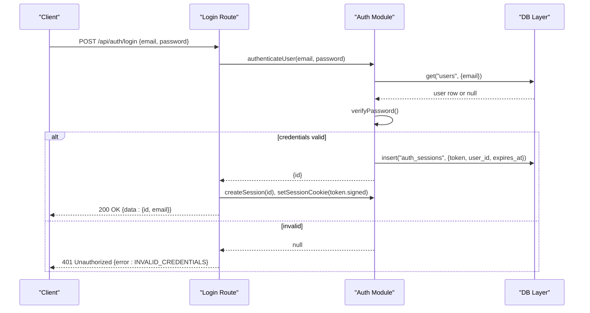
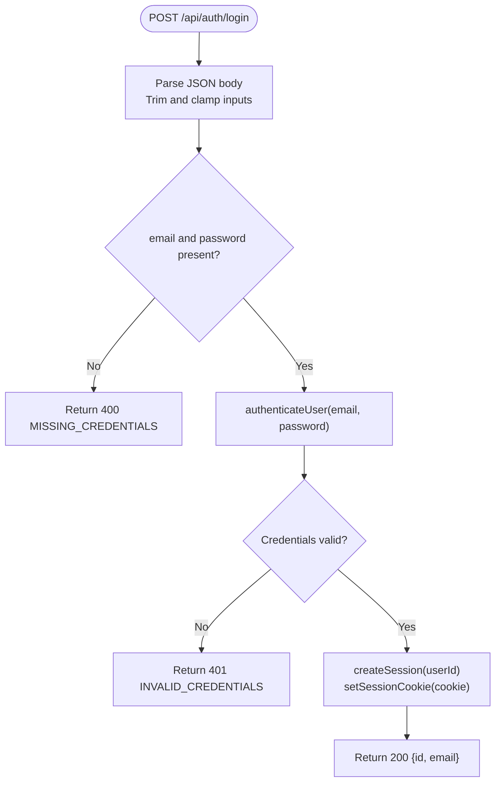
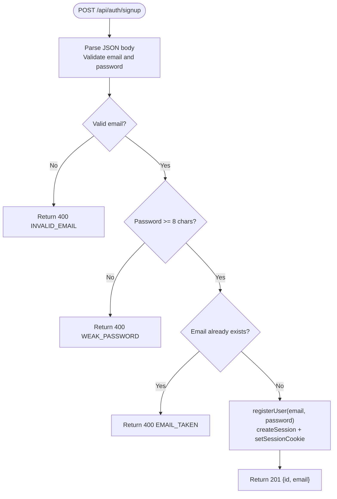
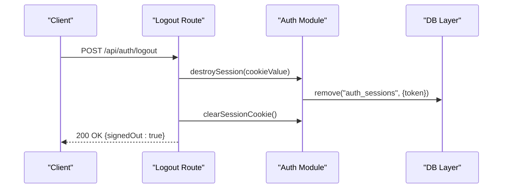
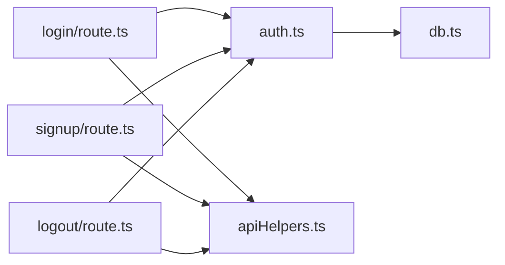

# Authentication API

<cite>
**Referenced Files in This Document**
- [login/route.ts](file://stepwise ai/app/app/api/auth/login/route.ts)
- [signup/route.ts](file://stepwise ai/app/app/api/auth/signup/route.ts)
- [logout/route.ts](file://stepwise ai/app/app/api/auth/logout/route.ts)
- [auth.ts](file://stepwise ai/app/lib/auth.ts)
- [apiHelpers.ts](file://stepwise ai/app/lib/apiHelpers.ts)
- [db.ts](file://stepwise ai/app/lib/db.ts)
</cite>

## Table of Contents
1. [Introduction](#introduction)
2. [Project Structure](#project-structure)
3. [Core Components](#core-components)
4. [Architecture Overview](#architecture-overview)
5. [Detailed Component Analysis](#detailed-component-analysis)
6. [Dependency Analysis](#dependency-analysis)
7. [Performance Considerations](#performance-considerations)
8. [Troubleshooting Guide](#troubleshooting-guide)
9. [Conclusion](#conclusion)
10. [Appendices](#appendices)

## Introduction
This document provides detailed API documentation for StepWise AI authentication endpoints: login, signup, and logout. It covers request/response schemas, HTTP status codes, session cookie behavior, security considerations (password hashing, session expiration), error handling patterns, rate limiting notes, and integration guidance with curl and JavaScript fetch examples.

## Project Structure
The authentication endpoints are implemented as Next.js App Router route handlers under the api/auth directory. Core logic is centralized in a shared auth module that handles password hashing, session creation/verification, and cookie management. A small database abstraction persists users, profiles, and sessions to a JSON file for development or lightweight deployments.

```mermaid
graph TB
Client["Client Application"] --> Login["POST /api/auth/login"]
Client --> Signup["POST /api/auth/signup"]
Client --> Logout["POST /api/auth/logout"]
subgraph "Next.js API Routes"
Login
Signup
Logout
end
subgraph "Auth Module"
AuthLib["lib/auth.ts"]
end
subgraph "Persistence"
DB["lib/db.ts (JSON store)"]
end
Login --> AuthLib
Signup --> AuthLib
Logout --> AuthLib
AuthLib --> DB
```

**Diagram sources**
- [login/route.ts:1-30](file://stepwise ai/app/app/api/auth/login/route.ts#L1-L30)
- [signup/route.ts:1-36](file://stepwise ai/app/app/api/auth/signup/route.ts#L1-L36)
- [logout/route.ts:1-12](file://stepwise ai/app/app/api/auth/logout/route.ts#L1-L12)
- [auth.ts:1-139](file://stepwise ai/app/lib/auth.ts#L1-L139)
- [db.ts:1-224](file://stepwise ai/app/lib/db.ts#L1-L224)

**Section sources**
- [login/route.ts:1-30](file://stepwise ai/app/app/api/auth/login/route.ts#L1-L30)
- [signup/route.ts:1-36](file://stepwise ai/app/app/api/auth/signup/route.ts#L1-L36)
- [logout/route.ts:1-12](file://stepwise ai/app/app/api/auth/logout/route.ts#L1-L12)
- [auth.ts:1-139](file://stepwise ai/app/lib/auth.ts#L1-L139)
- [db.ts:1-224](file://stepwise ai/app/lib/db.ts#L1-L224)

## Core Components
- Authentication routes:
  - POST /api/auth/login: authenticates user, sets signed session cookie, returns minimal user data.
  - POST /api/auth/signup: validates registration input, creates user and profile, logs in by setting session cookie, returns created user data.
  - POST /api/auth/logout: destroys server-side session record and clears session cookie.
- Shared auth utilities:
  - Password hashing and verification using scrypt with random salt and constant-time comparison.
  - Session token generation, signing, persistence, and validation.
  - Cookie helpers to set/clear an httpOnly, sameSite=lax, secure-in-production session cookie.
- Database layer:
  - In-memory-like JSON-backed relational store with atomic transactions and cascade helpers.

**Section sources**
- [auth.ts:24-40](file://stepwise ai/app/lib/auth.ts#L24-L40)
- [auth.ts:46-71](file://stepwise ai/app/lib/auth.ts#L46-L71)
- [auth.ts:78-136](file://stepwise ai/app/lib/auth.ts#L78-L136)
- [db.ts:123-199](file://stepwise ai/app/lib/db.ts#L123-L199)

## Architecture Overview
Authentication flows use a consistent pattern:
- Request parsing and input sanitization in route handlers.
- Validation and business logic in the auth module.
- Persistence via the db module.
- Consistent response envelope via apiHelpers.

**Diagram sources**
- [login/route.ts:7-29](file://stepwise ai/app/app/api/auth/login/route.ts#L7-L29)
- [auth.ts:130-136](file://stepwise ai/app/lib/auth.ts#L130-L136)
- [auth.ts:46-51](file://stepwise ai/app/lib/auth.ts#L46-L51)
- [auth.ts:59-67](file://stepwise ai/app/lib/auth.ts#L59-L67)
- [db.ts:147-159](file://stepwise ai/app/lib/db.ts#L147-L159)

## Detailed Component Analysis

### Login Endpoint
- Method and path: POST /api/auth/login
- Request body schema:
  - email: string, required, trimmed and lowercased, max length enforced by helper.
  - password: string, required, max length enforced by helper.
- Response:
  - Success (200): { data: { id: number, email: string }, error: null }
  - Missing credentials (400): { data: null, error: { code: "MISSING_CREDENTIALS", message: "..." } }
  - Invalid credentials (401): { data: null, error: { code: "INVALID_CREDENTIALS", message: "..." } }
  - Server error (500): { data: null, error: { code: "SERVER_ERROR", message: "..." } }
- Session behavior:
  - On success, a signed session cookie named stepwise_session is set with httpOnly=true, sameSite=lax, secure in production, path="/", maxAge=30 days.
  - The cookie value encodes a random token and an HMAC signature; the server verifies signature and checks session existence and expiry on subsequent requests.
- Security notes:
  - Passwords are never stored in plaintext; they are hashed with scrypt and a random salt.
  - Constant-time comparison prevents timing attacks during verification.
  - Error messages do not reveal whether the email exists.

**Diagram sources**
- [login/route.ts:7-29](file://stepwise ai/app/app/api/auth/login/route.ts#L7-L29)
- [auth.ts:130-136](file://stepwise ai/app/lib/auth.ts#L130-L136)
- [auth.ts:46-67](file://stepwise ai/app/lib/auth.ts#L46-L67)

**Section sources**
- [login/route.ts:7-29](file://stepwise ai/app/app/api/auth/login/route.ts#L7-L29)
- [auth.ts:24-40](file://stepwise ai/app/lib/auth.ts#L24-L40)
- [auth.ts:46-67](file://stepwise ai/app/lib/auth.ts#L46-L67)
- [apiHelpers.ts:8-17](file://stepwise ai/app/lib/apiHelpers.ts#L8-L17)

### Signup Endpoint
- Method and path: POST /api/auth/signup
- Request body schema:
  - email: string, required, validated against a basic email regex.
  - password: string, required, minimum length enforced (at least 8 characters).
- Validation rules:
  - Email must match a simple format check.
  - Password must be at least 8 characters.
  - Duplicate email check against existing users.
- Response:
  - Created (201): { data: { id: number, email: string }, error: null }
  - Invalid email (400): { data: null, error: { code: "INVALID_EMAIL", message: "..." } }
  - Weak password (400): { data: null, error: { code: "WEAK_PASSWORD", message: "..." } }
  - Email taken (400): { data: null, error: { code: "EMAIL_TAKEN", message: "..." } }
  - Server error (500): { data: null, error: { code: "SERVER_ERROR", message: "..." } }
- User creation process:
  - Inserts a new user with a hashed password into the users table.
  - Creates a default profile entry in the profiles table within a transaction.
  - Immediately logs the user in by creating a session and setting the session cookie.
- Security notes:
  - Passwords are hashed before storage.
  - Transaction ensures both user and profile are created atomically.

**Diagram sources**
- [signup/route.ts:10-35](file://stepwise ai/app/app/api/auth/signup/route.ts#L10-L35)
- [auth.ts:104-128](file://stepwise ai/app/lib/auth.ts#L104-L128)
- [auth.ts:46-67](file://stepwise ai/app/lib/auth.ts#L46-L67)

**Section sources**
- [signup/route.ts:10-35](file://stepwise ai/app/app/api/auth/signup/route.ts#L10-L35)
- [auth.ts:104-128](file://stepwise ai/app/lib/auth.ts#L104-L128)
- [apiHelpers.ts:8-17](file://stepwise ai/app/lib/apiHelpers.ts#L8-L17)

### Logout Endpoint
- Method and path: POST /api/auth/logout
- Behavior:
  - Reads the current session cookie, destroys the corresponding server-side session record if present, and clears the cookie.
- Response:
  - Success (200): { data: { signedOut: true }, error: null }
- Notes:
  - If no session cookie is present, the operation still succeeds and clears any residual cookie state.

**Diagram sources**
- [logout/route.ts:7-11](file://stepwise ai/app/app/api/auth/logout/route.ts#L7-L11)
- [auth.ts:53-71](file://stepwise ai/app/lib/auth.ts#L53-L71)

**Section sources**
- [logout/route.ts:7-11](file://stepwise ai/app/app/api/auth/logout/route.ts#L7-L11)
- [auth.ts:53-71](file://stepwise ai/app/lib/auth.ts#L53-L71)

## Dependency Analysis
- Route handlers depend on:
  - Next.js request/response types and cookies API.
  - Shared auth utilities for credential verification, session lifecycle, and cookie management.
  - API helpers for standardized responses and input sanitization.
- Auth module depends on:
  - Node crypto primitives for hashing and HMAC signing.
  - Database abstraction for reading/writing users, profiles, and sessions.
- Database abstraction:
  - Provides a small relational-style interface over a JSON file with atomic transactions.

**Diagram sources**
- [login/route.ts:1-30](file://stepwise ai/app/app/api/auth/login/route.ts#L1-L30)
- [signup/route.ts:1-36](file://stepwise ai/app/app/api/auth/signup/route.ts#L1-L36)
- [logout/route.ts:1-12](file://stepwise ai/app/app/api/auth/logout/route.ts#L1-L12)
- [auth.ts:1-139](file://stepwise ai/app/lib/auth.ts#L1-L139)
- [apiHelpers.ts:1-42](file://stepwise ai/app/lib/apiHelpers.ts#L1-L42)
- [db.ts:1-224](file://stepwise ai/app/lib/db.ts#L1-L224)

**Section sources**
- [login/route.ts:1-30](file://stepwise ai/app/app/api/auth/login/route.ts#L1-L30)
- [signup/route.ts:1-36](file://stepwise ai/app/app/api/auth/signup/route.ts#L1-L36)
- [logout/route.ts:1-12](file://stepwise ai/app/app/api/auth/logout/route.ts#L1-L12)
- [auth.ts:1-139](file://stepwise ai/app/lib/auth.ts#L1-L139)
- [apiHelpers.ts:1-42](file://stepwise ai/app/lib/apiHelpers.ts#L1-L42)
- [db.ts:1-224](file://stepwise ai/app/lib/db.ts#L1-L224)

## Performance Considerations
- Password hashing uses scrypt with a fixed cost parameter; consider tuning parameters for your deployment environment to balance security and latency.
- Session tokens are short-lived and verified with HMAC; ensure efficient cookie parsing and signature verification.
- Database operations are synchronous writes to a JSON file; for high-throughput environments, consider migrating to a proper database backend while preserving the same interface.
- Avoid unnecessary re-parsing of request bodies; the current implementation reads once per endpoint.

[No sources needed since this section provides general guidance]

## Troubleshooting Guide
Common issues and resolutions:
- Missing credentials on login: Ensure the request body includes both email and password fields.
- Invalid email format on signup: Use a properly formatted email address.
- Weak password on signup: Use a password with at least 8 characters.
- Email already taken: Choose a different email address.
- Session not persisting across requests: Verify that cookies are enabled and that the client sends cookies with subsequent requests. Confirm that the SameSite and Secure attributes align with your deployment domain and HTTPS usage.
- Unexpected 500 errors: Check server logs; the API returns a generic SERVER_ERROR without stack traces.

**Section sources**
- [login/route.ts:13-21](file://stepwise ai/app/app/api/auth/login/route.ts#L13-L21)
- [signup/route.ts:16-26](file://stepwise ai/app/app/api/auth/signup/route.ts#L16-L26)
- [apiHelpers.ts:27-30](file://stepwise ai/app/lib/apiHelpers.ts#L27-L30)

## Conclusion
StepWise AI’s authentication API provides secure, cookie-based session management with robust password hashing and consistent error handling. Clients should handle standard HTTP status codes, parse the unified response envelope, and manage cookies appropriately. For production, ensure environment variables like AUTH_SECRET are configured securely and that HTTPS is used to leverage the secure cookie flag.

[No sources needed since this section summarizes without analyzing specific files]

## Appendices

### HTTP Status Codes Summary
- 200 OK: Successful login or logout.
- 201 Created: Successful signup.
- 400 Bad Request: Missing or invalid input (e.g., missing credentials, invalid email, weak password).
- 401 Unauthorized: Invalid credentials.
- 404 Not Found: Not used directly by these endpoints; returned by other routes when resources are missing.
- 500 Internal Server Error: Unexpected server-side failures.

**Section sources**
- [apiHelpers.ts:8-30](file://stepwise ai/app/lib/apiHelpers.ts#L8-L30)
- [login/route.ts:13-21](file://stepwise ai/app/app/api/auth/login/route.ts#L13-L21)
- [signup/route.ts:16-26](file://stepwise ai/app/app/api/auth/signup/route.ts#L16-L26)

### Authentication Headers and Cookies
- No special Authorization headers are required for these endpoints.
- After successful login or signup, a session cookie named stepwise_session is set:
  - httpOnly: true
  - sameSite: lax
  - secure: true in production
  - path: "/"
  - maxAge: 30 days
- Subsequent authenticated requests must include this cookie automatically from the browser or HTTP client.

**Section sources**
- [auth.ts:59-67](file://stepwise ai/app/lib/auth.ts#L59-L67)

### Security Considerations
- Password hashing: scrypt with random salt and constant-time comparison.
- Session integrity: token plus HMAC signature; server verifies signature and checks session existence and expiry.
- Environment secrets: AUTH_SECRET must be set in production; otherwise, the service fails safely.
- Data privacy: Error messages avoid revealing whether an email exists.

**Section sources**
- [auth.ts:24-40](file://stepwise ai/app/lib/auth.ts#L24-L40)
- [auth.ts:42-51](file://stepwise ai/app/lib/auth.ts#L42-L51)
- [auth.ts:78-102](file://stepwise ai/app/lib/auth.ts#L78-L102)
- [auth.ts:12-22](file://stepwise ai/app/lib/auth.ts#L12-L22)

### Rate Limiting
- No explicit rate limiting is implemented in these endpoints.
- Recommendation: Add rate limiting at the reverse proxy or application level to mitigate brute-force attempts.

[No sources needed since this section provides general guidance]

### Integration Guidelines for Client Applications
- Always send Content-Type: application/json for login and signup.
- Handle cookies: ensure your HTTP client preserves cookies across requests.
- Error handling: parse the unified response envelope and display user-friendly messages based on error.code.
- Redirects: after successful login or signup, navigate to protected pages; after logout, redirect to the sign-in page.

[No sources needed since this section provides general guidance]

### Example Requests and Responses

#### Login
- curl example:
  - curl -X POST https://your-domain.com/api/auth/login -H "Content-Type: application/json" -d '{"email":"user@example.com","password":"yourpassword"}'
- Expected responses:
  - 200 OK: { "data": { "id": 1, "email": "user@example.com" }, "error": null }
  - 400 Bad Request: { "data": null, "error": { "code": "MISSING_CREDENTIALS", "message": "Please enter your email and password." } }
  - 401 Unauthorized: { "data": null, "error": { "code": "INVALID_CREDENTIALS", "message": "Email or password is incorrect." } }
  - 500 Internal Server Error: { "data": null, "error": { "code": "SERVER_ERROR", "message": "Something went wrong. Please try again." } }

**Section sources**
- [login/route.ts:7-29](file://stepwise ai/app/app/api/auth/login/route.ts#L7-L29)
- [apiHelpers.ts:8-30](file://stepwise ai/app/lib/apiHelpers.ts#L8-L30)

#### Signup
- curl example:
  - curl -X POST https://your-domain.com/api/auth/signup -H "Content-Type: application/json" -d '{"email":"newuser@example.com","password":"securepass123"}'
- Expected responses:
  - 201 Created: { "data": { "id": 1, "email": "newuser@example.com" }, "error": null }
  - 400 Bad Request (invalid email): { "data": null, "error": { "code": "INVALID_EMAIL", "message": "Please enter a valid email address." } }
  - 400 Bad Request (weak password): { "data": null, "error": { "code": "WEAK_PASSWORD", "message": "Password must be at least 8 characters." } }
  - 400 Bad Request (email taken): { "data": null, "error": { "code": "EMAIL_TAKEN", "message": "An account with this email already exists." } }
  - 500 Internal Server Error: { "data": null, "error": { "code": "SERVER_ERROR", "message": "Something went wrong. Please try again." } }

**Section sources**
- [signup/route.ts:10-35](file://stepwise ai/app/app/api/auth/signup/route.ts#L10-L35)
- [apiHelpers.ts:8-30](file://stepwise ai/app/lib/apiHelpers.ts#L8-L30)

#### Logout
- curl example:
  - curl -X POST https://your-domain.com/api/auth/logout
- Expected response:
  - 200 OK: { "data": { "signedOut": true }, "error": null }

**Section sources**
- [logout/route.ts:7-11](file://stepwise ai/app/app/api/auth/logout/route.ts#L7-L11)
- [apiHelpers.ts:8-17](file://stepwise ai/app/lib/apiHelpers.ts#L8-L17)

### JavaScript Fetch Implementations

- Login:
  - const res = await fetch("/api/auth/login", { method: "POST", headers: { "Content-Type": "application/json" }, body: JSON.stringify({ email, password }) });
  - Handle 200/400/401/500 responses and read cookies for subsequent requests.

- Signup:
  - const res = await fetch("/api/auth/signup", { method: "POST", headers: { "Content-Type": "application/json" }, body: JSON.stringify({ email, password }) });
  - Handle 201/400/500 responses and read cookies for subsequent requests.

- Logout:
  - const res = await fetch("/api/auth/logout", { method: "POST" });
  - Handle 200 response and ensure cookies are cleared.

[No sources needed since this section provides general guidance]