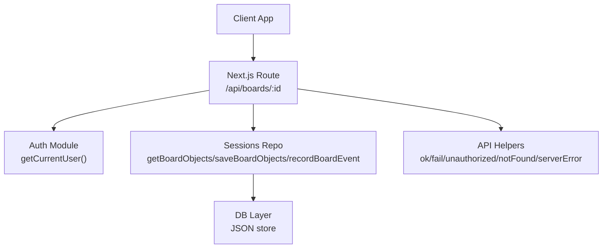
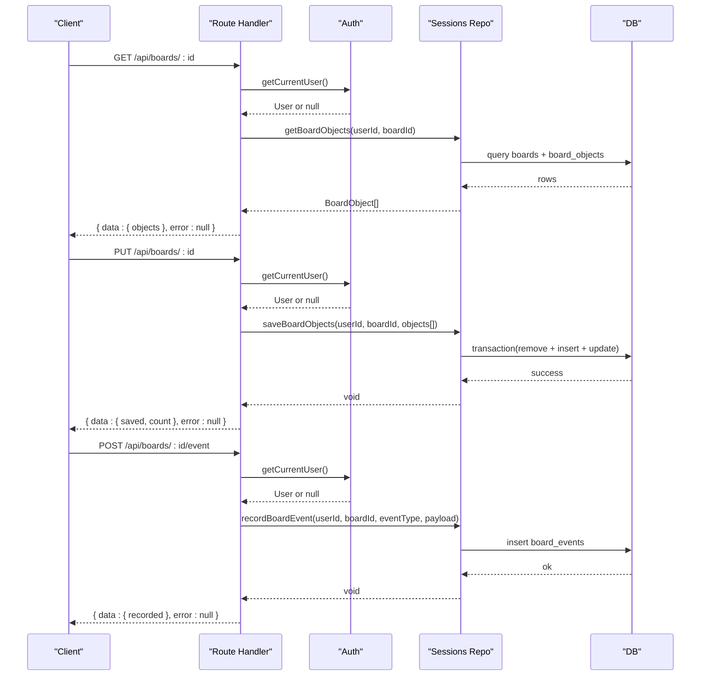
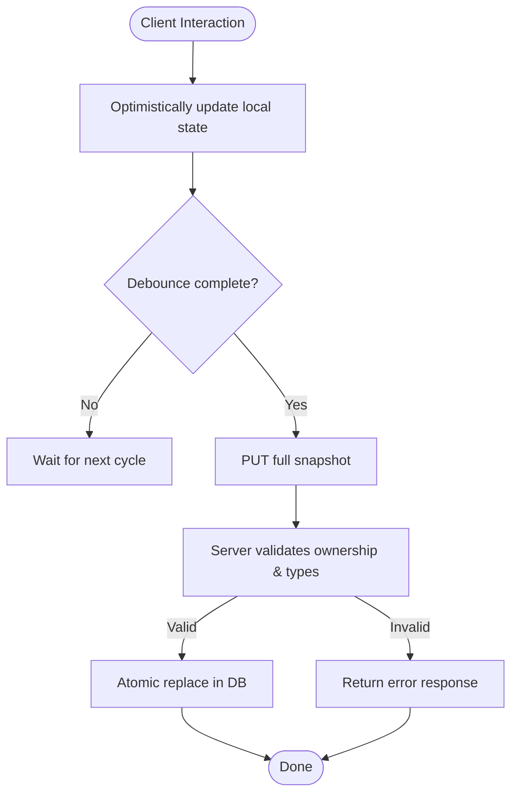
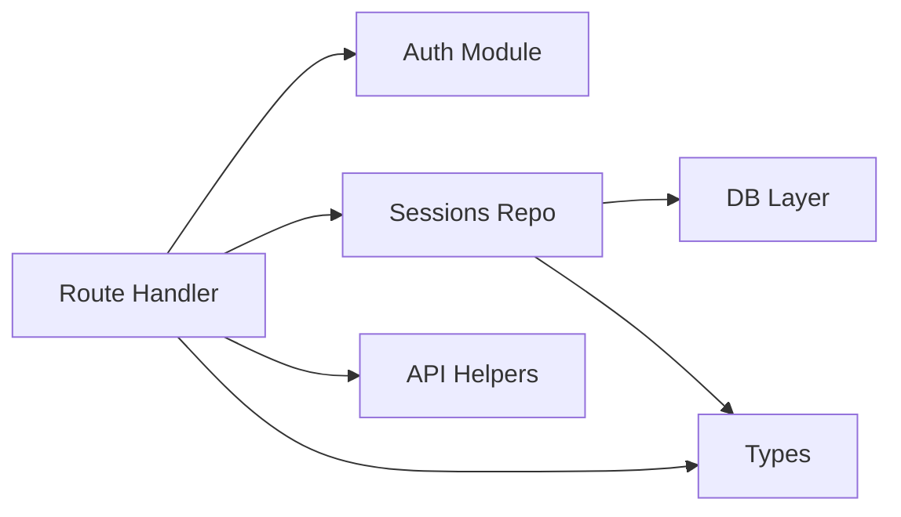

# Board API

<cite>
**Referenced Files in This Document**
- [route.ts](file://stepwise ai/app/app/api/boards/[id]/route.ts)
- [types.ts](file://stepwise ai/app/lib/types.ts)
- [sessionsRepo.ts](file://stepwise ai/app/lib/sessionsRepo.ts)
- [auth.ts](file://stepwise ai/app/lib/auth.ts)
- [db.ts](file://stepwise ai/app/lib/db.ts)
- [apiHelpers.ts](file://stepwise ai/app/lib/apiHelpers.ts)
- [Board.tsx](file://stepwise ai/app/components/board/Board.tsx)
</cite>

## Table of Contents
1. [Introduction](#introduction)
2. [Project Structure](#project-structure)
3. [Core Components](#core-components)
4. [Architecture Overview](#architecture-overview)
5. [Detailed Component Analysis](#detailed-component-analysis)
6. [Dependency Analysis](#dependency-analysis)
7. [Performance Considerations](#performance-considerations)
8. [Troubleshooting Guide](#troubleshooting-guide)
9. [Conclusion](#conclusion)
10. [Appendices](#appendices)

## Introduction
This document specifies the StepWise AI board management endpoints for managing board objects at /api/boards/[id]. It covers:
- GET to retrieve a board’s current object state
- PUT to persist an optimistic snapshot of board objects
- POST to record meaningful board events (e.g., collaboration or analytics)
- DELETE is not implemented in this route; see notes below
It also defines the BoardObject schema, authentication and authorization requirements, error handling patterns, and performance guidance for large boards. Real-time collaboration is supported via optimistic updates with periodic server snapshots persisted through PUT and event logging via POST.

## Project Structure
The board API is implemented as a Next.js Route Handler under app/api/boards/[id]/route.ts. It relies on:
- Authentication helpers to verify session cookies and extract the current user
- A repository layer to read/write board objects and events
- A small embedded JSON database abstraction for persistence
- Shared types that define the BoardObject model and API envelope

**Diagram sources**
- [route.ts:1-106](file://stepwise ai/app/app/api/boards/[id]/route.ts#L1-L106)
- [auth.ts:78-102](file://stepwise ai/app/lib/auth.ts#L78-L102)
- [sessionsRepo.ts:197-282](file://stepwise ai/app/lib/sessionsRepo.ts#L197-L282)
- [db.ts:123-199](file://stepwise ai/app/lib/db.ts#L123-L199)
- [apiHelpers.ts:8-30](file://stepwise ai/app/lib/apiHelpers.ts#L8-L30)

**Section sources**
- [route.ts:1-106](file://stepwise ai/app/app/api/boards/[id]/route.ts#L1-L106)
- [db.ts:1-224](file://stepwise ai/app/lib/db.ts#L1-L224)

## Core Components
- Route handler: Validates ownership, parses inputs, delegates to repository, returns standardized responses.
- Repository: Encapsulates board object reads/writes and event recording with ownership checks.
- Types: Defines BoardObject schema and API envelope used across client/server.
- Auth: Verifies signed session cookies and returns the authenticated user.
- DB: Provides transactional, atomic writes to a JSON file-backed store.
- UI integration: The Board component demonstrates optimistic updates and how changes are committed back to the server.

Key responsibilities:
- Authorization-first access: every operation re-verifies ownership using the authenticated user id.
- Input validation and sanitization: type whitelisting, owner whitelisting, size limits, numeric clamping.
- Atomic persistence: full snapshot replacement within a transaction.
- Event logging: capture meaningful interactions without flooding storage.

**Section sources**
- [route.ts:24-85](file://stepwise ai/app/app/api/boards/[id]/route.ts#L24-L85)
- [sessionsRepo.ts:197-282](file://stepwise ai/app/lib/sessionsRepo.ts#L197-L282)
- [types.ts:26-57](file://stepwise ai/app/lib/types.ts#L26-L57)
- [auth.ts:78-102](file://stepwise ai/app/lib/auth.ts#L78-L102)
- [db.ts:183-199](file://stepwise ai/app/lib/db.ts#L183-L199)

## Architecture Overview
The board API follows a layered architecture:
- Presentation: Next.js route handlers
- Business logic: repository functions enforcing ownership and data rules
- Data access: typed DB abstraction over a JSON file store
- Cross-cutting: auth verification and consistent response envelopes

**Diagram sources**
- [route.ts:28-105](file://stepwise ai/app/app/api/boards/[id]/route.ts#L28-L105)
- [sessionsRepo.ts:197-282](file://stepwise ai/app/lib/sessionsRepo.ts#L197-L282)
- [db.ts:183-199](file://stepwise ai/app/lib/db.ts#L183-L199)

## Detailed Component Analysis

### Endpoint: GET /api/boards/[id]
Purpose: Retrieve the current board object state for an owned board.

Behavior:
- Requires authentication; returns 401 if unauthenticated
- Validates board id and ownership; returns 404 if not found
- Returns all board objects sorted by z-index

Request:
- Method: GET
- Path: /api/boards/{id}
- Headers: Cookie containing signed session token

Response:
- Success (200): { data: { objects: BoardObject[] }, error: null }
- Unauthorized (401): { data: null, error: { code: "UNAUTHORIZED", message: "..." } }
- Not Found (404): { data: null, error: { code: "NOT_FOUND", message: "..." } }
- Server Error (500): { data: null, error: { code: "SERVER_ERROR", message: "..." } }

Notes:
- Objects are returned ordered by z_index for correct rendering stacking.

**Section sources**
- [route.ts:28-39](file://stepwise ai/app/app/api/boards/[id]/route.ts#L28-L39)
- [sessionsRepo.ts:197-204](file://stepwise ai/app/lib/sessionsRepo.ts#L197-L204)
- [apiHelpers.ts:8-30](file://stepwise ai/app/lib/apiHelpers.ts#L8-L30)

### Endpoint: PUT /api/boards/[id]
Purpose: Persist an optimistic snapshot of board objects for an owned board.

Behavior:
- Requires authentication and ownership
- Accepts a JSON body with an array of objects
- Validates each object against allowed types and owners
- Clamps dimensions and content lengths
- Replaces all board objects atomically within a transaction
- Limits input to first 500 objects per request

Request:
- Method: PUT
- Path: /api/boards/{id}
- Body: { objects: BoardObject[] }

Validation and normalization:
- Type must be one of: text, handwriting, drawing, shape, connector, image, note, formula, annotation, visual
- Owner must be one of: student, ai, system, imported
- Dimensions clamped to safe ranges; content truncated to max length
- Numeric fields coerced to numbers with defaults

Response:
- Success (200): { data: { saved: true, count: number }, error: null }
- Unauthorized (401), Not Found (404), Server Error (500) as above

Conflict resolution strategy:
- Full snapshot replace: last-write-wins semantics per board
- Optimistic updates on client side; server stores the latest snapshot
- No real-time conflict merging; clients should debounce and coalesce updates

Rate limiting considerations:
- Request size limited by accepting up to 500 objects per PUT
- Content sizes bounded to prevent abuse
- Implement application-level throttling at the edge or gateway if needed

Performance tips:
- Debounce client-side updates before sending PUT
- Batch multiple changes into a single PUT
- Avoid frequent PUTs during heavy interaction; rely on optimistic UI

**Section sources**
- [route.ts:41-85](file://stepwise ai/app/app/api/boards/[id]/route.ts#L41-L85)
- [sessionsRepo.ts:235-265](file://stepwise ai/app/lib/sessionsRepo.ts#L235-L265)
- [db.ts:183-199](file://stepwise ai/app/lib/db.ts#L183-L199)

### Endpoint: POST /api/boards/[id]/event
Purpose: Record meaningful board events for analytics or collaboration metadata.

Behavior:
- Requires authentication and ownership
- Records event_type and payload in board_events table
- Payload is sanitized and truncated

Request:
- Method: POST
- Path: /api/boards/{id}/event
- Body: { eventType: string, payload: object }

Response:
- Success (200): { data: { recorded: true }, error: null }
- Unauthorized (401), Not Found (404), Server Error (500) as above

Use cases:
- Collaboration markers (e.g., cursor presence, selection highlights)
- Analytics (e.g., tool usage, edit actions)
- Audit trails for important operations

**Section sources**
- [route.ts:87-105](file://stepwise ai/app/app/api/boards/[id]/route.ts#L87-L105)
- [sessionsRepo.ts:267-282](file://stepwise ai/app/lib/sessionsRepo.ts#L267-L282)

### Endpoint: DELETE /api/boards/[id]
Status: Not implemented in this route.
Recommendation: If required, implement similar ownership checks and remove board and related objects via repository functions. Ensure cascade deletion is handled safely.

**Section sources**
- [route.ts:1-106](file://stepwise ai/app/app/api/boards/[id]/route.ts#L1-L106)

### BoardObject Schema
Defines the structure of board elements persisted and exchanged with the API.

Fields:
- id: string — unique identifier for the object
- board_id: string — board identifier the object belongs to
- type: enum — text, handwriting, drawing, shape, connector, image, note, formula, annotation, visual
- x: number — horizontal position
- y: number — vertical position
- width: number — rendered width
- height: number — rendered height
- rotation: number — rotation angle
- z_index: number — stacking order
- content: string — serialized content (e.g., text, JSON for drawings)
- style: object — styling options (arbitrary key-value pairs)
- meta: object — metadata (arbitrary key-value pairs)
- owner: enum — student, ai, system, imported
- created_at: string — ISO timestamp
- updated_at: string — ISO timestamp

Complexity:
- Storage: O(n) per board for n objects
- Retrieval: O(n log n) due to sorting by z_index
- Update: O(n) to replace all objects per PUT

**Section sources**
- [types.ts:26-57](file://stepwise ai/app/lib/types.ts#L26-L57)
- [sessionsRepo.ts:206-224](file://stepwise ai/app/lib/sessionsRepo.ts#L206-L224)

### Real-Time Collaboration
- Optimistic updates: The UI immediately reflects changes locally and commits via PUT when appropriate.
- Conflict resolution: Last-write-wins via full snapshot replacement; no server-side merge. Clients should coalesce edits and avoid concurrent conflicting writes.
- Events: Use POST /api/boards/:id/event to log meaningful actions without persisting full state.
- Ownership enforcement: All operations re-check ownership using the authenticated user id.

[No sources needed since this diagram shows conceptual workflow, not actual code structure]

### Authentication and Authorization
- Session-based authentication via httpOnly signed cookies
- getCurrentUser verifies cookie signature and session validity
- Every endpoint re-validates ownership of the requested board using the authenticated user id
- Unauthorized requests receive 401; missing resources return 404

Security notes:
- Never trust client-supplied IDs; always re-verify ownership server-side
- Inputs are validated and sanitized before persistence
- Errors do not leak stack traces

**Section sources**
- [auth.ts:78-102](file://stepwise ai/app/lib/auth.ts#L78-L102)
- [route.ts:24-35](file://stepwise ai/app/app/api/boards/[id]/route.ts#L24-L35)

### Performance Optimization Tips for Large Boards
- Debounce and coalesce client-side updates before sending PUT
- Limit objects per PUT to 500 to control payload size
- Clamp dimensions and truncate content to prevent oversized payloads
- Sort by z_index only when necessary; consider lazy loading for very large boards
- Use POST events for lightweight telemetry instead of full snapshots
- Consider caching frequently accessed board metadata at the edge

[No sources needed since this section provides general guidance]

### Common Operations Examples
Adding a text element:
- Create a new BoardObject with type "text", set position and default dimensions, then include it in the objects array sent via PUT.
- Reference: [Board.tsx:155-179](file://stepwise ai/app/components/board/Board.tsx#L155-L179)

Drawing shapes:
- Capture pointer points during draw mode, compute bounding box, create a BoardObject with type "drawing" and content storing points and color, then commit via PUT.
- Reference: [Board.tsx:250-281](file://stepwise ai/app/components/board/Board.tsx#L250-L281)

Manipulating object positions:
- On drag move, update x/y of the selected object and call onCommit to send the updated list via PUT.
- Reference: [Board.tsx:219-226](file://stepwise ai/app/components/board/Board.tsx#L219-L226)

Erasing objects:
- Filter out the selected object from the current list and commit via PUT.
- Reference: [Board.tsx:84-90](file://stepwise ai/app/components/board/Board.tsx#L84-L90)

**Section sources**
- [Board.tsx:84-90](file://stepwise ai/app/components/board/Board.tsx#L84-L90)
- [Board.tsx:155-179](file://stepwise ai/app/components/board/Board.tsx#L155-L179)
- [Board.tsx:219-226](file://stepwise ai/app/components/board/Board.tsx#L219-L226)
- [Board.tsx:250-281](file://stepwise ai/app/components/board/Board.tsx#L250-L281)

## Dependency Analysis
The board API depends on several modules:

Coupling and cohesion:
- Route is loosely coupled to repo and helpers; cohesive around ownership and I/O
- Repo encapsulates data access and business rules; cohesive around sessions and boards
- DB abstraction isolates persistence details; cohesive CRUD operations
- Types centralize shared contracts; high cohesion, low coupling

Potential circular dependencies:
- None observed; imports flow downward from route to repo/db/helpers/types

External integrations:
- Filesystem-backed JSON store for persistence
- Next.js runtime for HTTP handling and cookies

**Diagram sources**
- [route.ts:1-106](file://stepwise ai/app/app/api/boards/[id]/route.ts#L1-L106)
- [sessionsRepo.ts:1-399](file://stepwise ai/app/lib/sessionsRepo.ts#L1-L399)
- [db.ts:1-224](file://stepwise ai/app/lib/db.ts#L1-L224)
- [apiHelpers.ts:1-42](file://stepwise ai/app/lib/apiHelpers.ts#L1-L42)
- [types.ts:1-302](file://stepwise ai/app/lib/types.ts#L1-L302)

**Section sources**
- [route.ts:1-106](file://stepwise ai/app/app/api/boards/[id]/route.ts#L1-L106)
- [sessionsRepo.ts:1-399](file://stepwise ai/app/lib/sessionsRepo.ts#L1-L399)
- [db.ts:1-224](file://stepwise ai/app/lib/db.ts#L1-L224)
- [apiHelpers.ts:1-42](file://stepwise ai/app/lib/apiHelpers.ts#L1-L42)
- [types.ts:1-302](file://stepwise ai/app/lib/types.ts#L1-L302)

## Performance Considerations
- Snapshot size: Limit to 500 objects per PUT to balance freshness and bandwidth
- Content truncation: Enforce max lengths for content and metadata to reduce payload size
- Sorting cost: Objects are sorted by z_index; minimize unnecessary re-renders on client
- Transactional writes: Atomic replaces ensure consistency but can be expensive; batch updates
- Edge caching: Cache GET responses where appropriate with proper invalidation strategies
- Rate limiting: Apply rate limits at the gateway to protect against abuse

[No sources needed since this section provides general guidance]

## Troubleshooting Guide
Common errors and causes:
- UNAUTHORIZED (401): Missing or invalid session cookie; verify login and cookie settings
- NOT_FOUND (404): Board does not exist or user lacks ownership; check board id and user context
- SERVER_ERROR (500): Unexpected server-side exception; check logs and input validation

Validation failures:
- Invalid object type or owner: Normalized to defaults or ignored; ensure client sends valid enums
- Oversized payloads: Truncated or rejected; reduce object count or content size

Debugging steps:
- Inspect request payload for objects array structure and field types
- Verify ownership by checking board.user_id matches authenticated user id
- Review event logs via POST payloads for collaboration or analytics issues

**Section sources**
- [apiHelpers.ts:12-30](file://stepwise ai/app/lib/apiHelpers.ts#L12-L30)
- [route.ts:24-39](file://stepwise ai/app/app/api/boards/[id]/route.ts#L24-L39)
- [route.ts:41-85](file://stepwise ai/app/app/api/boards/[id]/route.ts#L41-L85)
- [route.ts:87-105](file://stepwise ai/app/app/api/boards/[id]/route.ts#L87-L105)

## Conclusion
The StepWise AI board API provides secure, validated endpoints for retrieving and persisting board object states with strong ownership checks and consistent error handling. It supports optimistic updates and event logging for collaboration scenarios. For large boards, debouncing, batching, and size limits help maintain performance. While DELETE is not implemented, the existing patterns provide a clear path for future extensions.

[No sources needed since this section summarizes without analyzing specific files]

## Appendices

### API Envelope
All responses follow a standard envelope:
- Success: { data: T, error: null }
- Failure: { data: null, error: { code: string, message: string } }

**Section sources**
- [types.ts:298-302](file://stepwise ai/app/lib/types.ts#L298-L302)
- [apiHelpers.ts:8-30](file://stepwise ai/app/lib/apiHelpers.ts#L8-L30)

### Database Tables Used
- boards: Stores board metadata and ownership
- board_objects: Stores individual board elements
- board_events: Stores meaningful board events for analytics or collaboration

**Section sources**
- [db.ts:23-44](file://stepwise ai/app/lib/db.ts#L23-L44)
- [sessionsRepo.ts:235-282](file://stepwise ai/app/lib/sessionsRepo.ts#L235-L282)