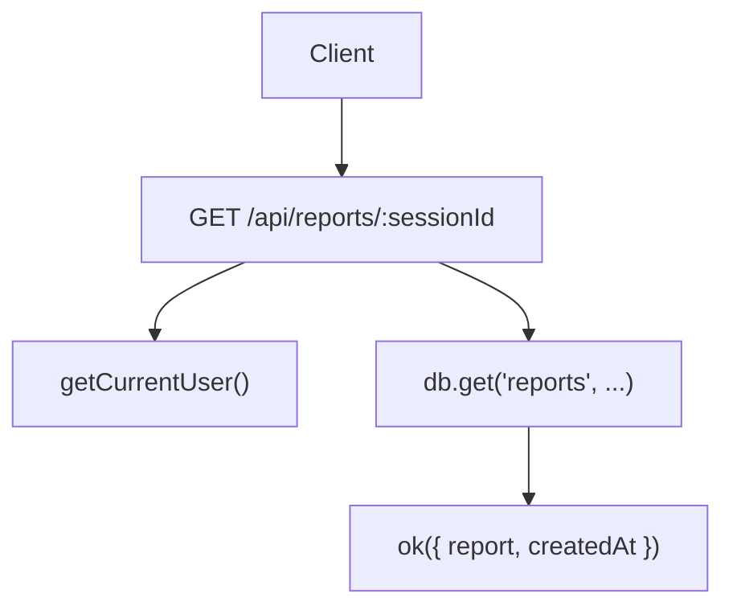
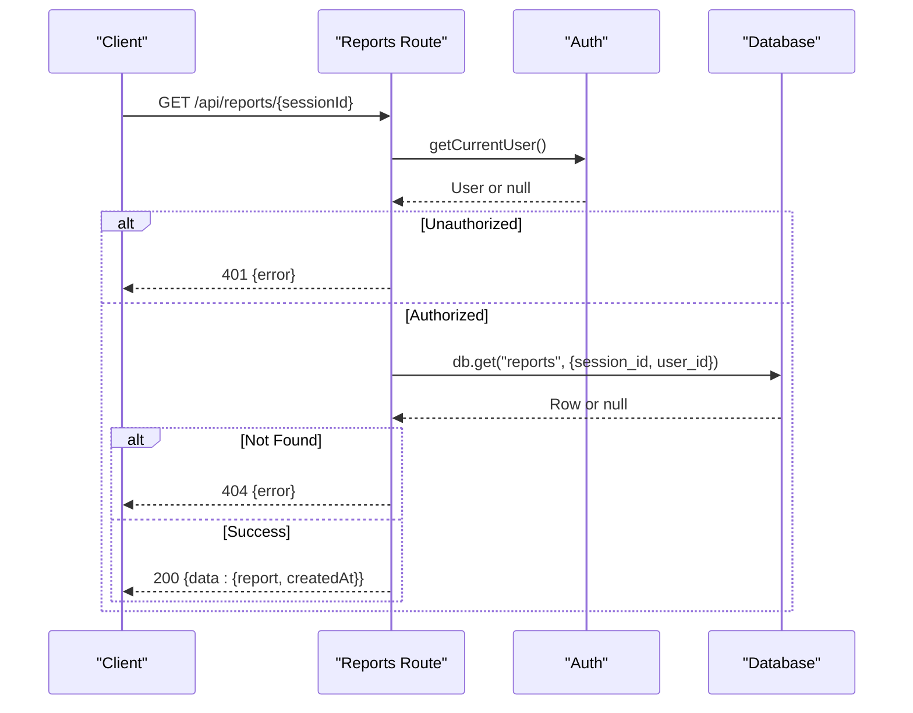
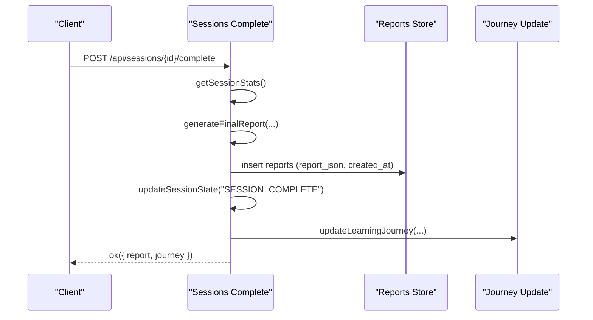
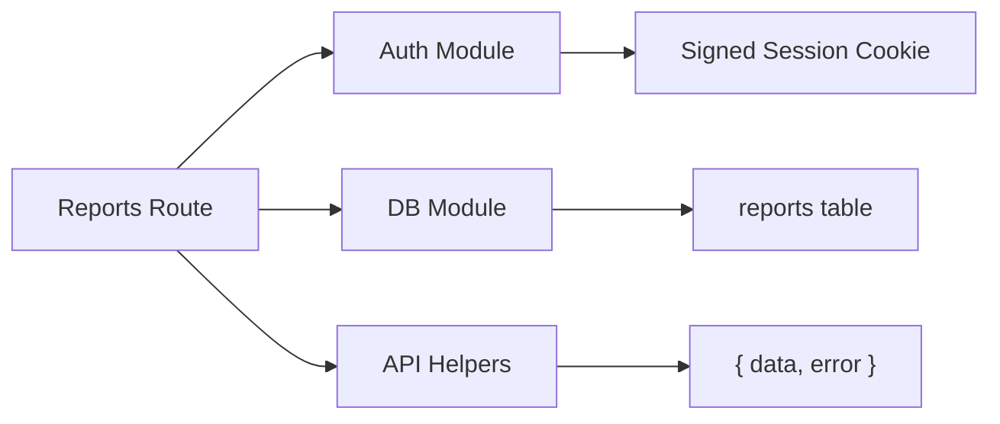

# Reports API

<cite>
**Referenced Files in This Document**
- [route.ts](file://stepwise ai/app/app/api/reports/[sessionId]/route.ts)
- [apiHelpers.ts](file://stepwise ai/app/lib/apiHelpers.ts)
- [auth.ts](file://stepwise ai/app/lib/auth.ts)
- [db.ts](file://stepwise ai/app/lib/db.ts)
- [types.ts](file://stepwise ai/app/lib/types.ts)
- [sessionsRepo.ts](file://stepwise ai/app/lib/sessionsRepo.ts)
- [complete route.ts](file://stepwise ai/app/app/api/sessions/[id]/complete/route.ts)
- [analyze route.ts](file://stepwise ai/app/app/api/sessions/[id]/analyze/route.ts)
- [final report spec](file://stepwise ai/specs/08-final-report.md.txt)
</cite>

## Table of Contents
1. [Introduction](#introduction)
2. [Project Structure](#project-structure)
3. [Core Components](#core-components)
4. [Architecture Overview](#architecture-overview)
5. [Detailed Component Analysis](#detailed-component-analysis)
6. [Dependency Analysis](#dependency-analysis)
7. [Performance Considerations](#performance-considerations)
8. [Troubleshooting Guide](#troubleshooting-guide)
9. [Conclusion](#conclusion)
10. [Appendices](#appendices)

## Introduction
This document provides comprehensive API documentation for the StepWise AI reporting endpoints, focusing on retrieving detailed learning analytics and session summaries via the report retrieval endpoint. It defines the report schema, authentication requirements, data privacy considerations, caching strategies, export formats, pagination guidance, integration points with external analytics systems, performance considerations, and best practices for client-side rendering.

## Project Structure
The reporting feature is implemented as a Next.js App Router API route that:
- Authenticates requests using signed session cookies
- Validates ownership of the requested report by user and session
- Retrieves the persisted Final Report from the database
- Returns a standardized envelope response

**Diagram sources**
- [route.ts:8-20](file://stepwise ai/app/app/api/reports/[sessionId]/route.ts#L8-L20)
- [auth.ts:78-102](file://stepwise ai/app/lib/auth.ts#L78-L102)
- [db.ts:141-145](file://stepwise ai/app/lib/db.ts#L141-L145)
- [apiHelpers.ts:8-10](file://stepwise ai/app/lib/apiHelpers.ts#L8-L10)

**Section sources**
- [route.ts:8-20](file://stepwise ai/app/app/api/reports/[sessionId]/route.ts#L8-L20)
- [apiHelpers.ts:8-30](file://stepwise ai/app/lib/apiHelpers.ts#L8-L30)

## Core Components
- Authentication: Signed session cookie verification to ensure only the owning user can access reports.
- Authorization: Ownership check ensures the report belongs to the authenticated user and session.
- Data persistence: Reports are stored as JSON in the reports table with created_at timestamps.
- Response envelope: All responses follow a consistent { data, error } structure.

Key responsibilities:
- Validate identity and session integrity
- Enforce per-user, per-session access control
- Return structured report data with metadata

**Section sources**
- [auth.ts:78-102](file://stepwise ai/app/lib/auth.ts#L78-L102)
- [route.ts:11-16](file://stepwise ai/app/app/api/reports/[sessionId]/route.ts#L11-L16)
- [db.ts:141-145](file://stepwise ai/app/lib/db.ts#L141-L145)
- [apiHelpers.ts:8-30](file://stepwise ai/app/lib/apiHelpers.ts#L8-L30)

## Architecture Overview
The report retrieval flow integrates authentication, authorization, and data access layers. The report itself is generated during session completion and persisted before being retrieved.

**Diagram sources**
- [route.ts:8-20](file://stepwise ai/app/app/api/reports/[sessionId]/route.ts#L8-L20)
- [auth.ts:78-102](file://stepwise ai/app/lib/auth.ts#L78-L102)
- [db.ts:141-145](file://stepwise ai/app/lib/db.ts#L141-L145)
- [apiHelpers.ts:19-25](file://stepwise ai/app/lib/apiHelpers.ts#L19-L25)

## Detailed Component Analysis

### Endpoint: GET /api/reports/[sessionId]
Purpose: Retrieve a finalized learning report for a specific session owned by the authenticated user.

Authentication and authorization:
- Requires a valid signed session cookie
- Verifies ownership of the report by matching user_id and session_id

Request parameters:
- Path parameter: sessionId (integer-like string; validated and clamped)

Response envelope:
- Success: { data: { report: FinalReport, createdAt: string }, error: null }
- Unauthorized: { data: null, error: { code: "UNAUTHORIZED", message: "Please sign in to continue." } }
- Not found: { data: null, error: { code: "NOT_FOUND", message: "We couldn't find that." } }
- Server error: { data: null, error: { code: "SERVER_ERROR", message: "Something went wrong. Please try again." } }

Error handling:
- Input validation uses safe integer parsing
- Exceptions are caught and returned as server errors without leaking internals

Caching strategy:
- No explicit caching layer is implemented at the route level
- For high traffic, consider adding server-side caching keyed by (user_id, session_id) with appropriate invalidation on updates

Filtering options:
- The current implementation does not support query parameters for filtering or granularity customization
- To customize scope, extend the route with query parameters and adjust the database query accordingly

Export formats:
- The endpoint returns JSON
- For CSV or PDF exports, implement additional routes or transform the JSON payload on the client side

Pagination:
- Not applicable for single-session report retrieval
- For listing multiple reports, add pagination parameters and return paginated envelopes

Integration with external analytics systems:
- Use the FinalReport fields to map metrics to your analytics schema
- Ensure PII is minimized; use session identifiers rather than personal identifiers where possible

Performance considerations:
- Single row lookup; minimal overhead
- Avoid heavy transformations on the server; prefer client-side rendering optimizations

Best practices for client-side rendering:
- Parse and validate the envelope before rendering
- Handle loading, error, and empty states
- Debounce any repeated fetches if used in interactive flows

**Section sources**
- [route.ts:8-20](file://stepwise ai/app/app/api/reports/[sessionId]/route.ts#L8-L20)
- [apiHelpers.ts:8-30](file://stepwise ai/app/lib/apiHelpers.ts#L8-L30)
- [auth.ts:78-102](file://stepwise ai/app/lib/auth.ts#L78-L102)
- [db.ts:141-145](file://stepwise ai/app/lib/db.ts#L141-L145)

### Report Schema: FinalReport
The FinalReport encapsulates learning analytics and session summaries. Fields include:

- Identification and context
  - sessionId: string
  - topic: string
  - question: string

- Time metrics
  - totalTimeSeconds: number
  - activeTimeSeconds: number

- Concept mastery levels
  - conceptsExplored: number
  - conceptsUnderstood: number
  - conceptsDeveloping: number

- Performance metrics
  - mistakes: number
  - corrections: number
  - independentCorrections: number
  - hintsUsed: number
  - statusLabel: string

- Understanding progression
  - understandingProgression.start: string
  - understandingProgression.during: string
  - understandingProgression.end: string

- Error analysis
  - errors: array of { category, severity, description, corrected, selfCorrected }

- Self-corrections and narrative
  - selfCorrections: string[]
  - hintInterpretation: string
  - finalUnderstanding: string
  - completeAnswer: string

- Recommendations and gaps
  - keyTakeaways: string[]
  - remainingGaps: string[]
  - reviewRecommendations: string[]
  - nextLearning: array of Recommendation objects

Recommendation object:
- type: one of CONTINUE, REVIEW, STRENGTHEN_PREREQUISITE, PRACTICE, GO_DEEPER, APPLY, EXPLORE, REST
- title: string
- reason: string

These fields align with the Final Report specification and provide rich analytics for learning reflection and personalized recommendations.

**Section sources**
- [types.ts:196-230](file://stepwise ai/app/lib/types.ts#L196-L230)
- [final report spec:1-67](file://stepwise ai/specs/08-final-report.md.txt#L1-L67)

### Report Generation Flow
Reports are generated when a session completes. The process:
- Authenticates and validates ownership
- Checks idempotency to avoid duplicate reports
- Computes session statistics (time, hints, errors, steps)
- Invokes the AI provider to generate the FinalReport
- Persists the report atomically with session finalization
- Updates the Learning Journey with insights

**Diagram sources**
- [complete route.ts:15-118](file://stepwise ai/app/app/api/sessions/[id]/complete/route.ts#L15-L118)
- [sessionsRepo.ts:378-398](file://stepwise ai/app/lib/sessionsRepo.ts#L378-L398)
- [types.ts:282-296](file://stepwise ai/app/lib/types.ts#L282-L296)

**Section sources**
- [complete route.ts:15-118](file://stepwise ai/app/app/api/sessions/[id]/complete/route.ts#L15-L118)
- [sessionsRepo.ts:378-398](file://stepwise ai/app/lib/sessionsRepo.ts#L378-L398)
- [types.ts:282-296](file://stepwise ai/app/lib/types.ts#L282-L296)

### Data Privacy and Security
- Authentication: Uses httpOnly, secure, sameSite cookies with HMAC-signed tokens
- Authorization: Ownership checks ensure users can only access their own reports
- Data minimization: Only necessary fields are exposed in the report envelope
- Error safety: Errors do not leak stack traces or internal details

**Section sources**
- [auth.ts:59-67](file://stepwise ai/app/lib/auth.ts#L59-L67)
- [auth.ts:78-102](file://stepwise ai/app/lib/auth.ts#L78-L102)
- [apiHelpers.ts:27-30](file://stepwise ai/app/lib/apiHelpers.ts#L27-L30)

### Caching Strategies
Current implementation:
- No built-in caching at the report retrieval route

Recommended strategies:
- Server-side cache keyed by (user_id, session_id) with TTL
- Invalidation on session completion or report regeneration
- Cache busting when new evidence (errors, hints, corrections) is recorded

Considerations:
- Respect user privacy and session boundaries
- Ensure cache consistency with atomic report generation

[No sources needed since this section provides general guidance]

### Filtering Options and Granularity
Current implementation:
- No query parameters for filtering or customizing report scope/granularity

Extension approach:
- Add query parameters (e.g., includeErrors, includeHints, timeWindow)
- Adjust database queries and response shaping based on flags
- Maintain backward compatibility by defaulting to full report

[No sources needed since this section provides general guidance]

### Export Formats and Pagination
Export formats:
- JSON is the native format
- For CSV/PDF, implement transformation routes or client-side conversion

Pagination:
- Not applicable for single report retrieval
- For multi-report lists, implement cursor or offset-based pagination with envelope responses

[No sources needed since this section provides general guidance]

### Integration with External Analytics Systems
Mapping:
- Map FinalReport fields to analytics events (e.g., concept mastery, error categories, time metrics)
- Use sessionId as an anonymous identifier to preserve privacy

Data governance:
- Minimize PII exposure
- Log only necessary telemetry
- Provide opt-out mechanisms where required

[No sources needed since this section provides general guidance]

## Dependency Analysis
The report retrieval depends on:
- Authentication module for session verification
- Database module for report lookup
- API helpers for standardized responses

**Diagram sources**
- [route.ts:8-20](file://stepwise ai/app/app/api/reports/[sessionId]/route.ts#L8-L20)
- [auth.ts:78-102](file://stepwise ai/app/lib/auth.ts#L78-L102)
- [db.ts:141-145](file://stepwise ai/app/lib/db.ts#L141-L145)
- [apiHelpers.ts:8-30](file://stepwise ai/app/lib/apiHelpers.ts#L8-L30)

**Section sources**
- [route.ts:8-20](file://stepwise ai/app/app/api/reports/[sessionId]/route.ts#L8-L20)
- [auth.ts:78-102](file://stepwise ai/app/lib/auth.ts#L78-L102)
- [db.ts:141-145](file://stepwise ai/app/lib/db.ts#L141-L145)
- [apiHelpers.ts:8-30](file://stepwise ai/app/lib/apiHelpers.ts#L8-L30)

## Performance Considerations
- Single-row database lookup is efficient; avoid unnecessary joins
- Defer heavy transformations to the client
- Consider server-side caching for high-frequency reads
- Monitor AI-generated content size; trim or paginate narrative sections if needed
- Ensure network payloads remain reasonable; compress responses if necessary

[No sources needed since this section provides general guidance]

## Troubleshooting Guide
Common issues and resolutions:
- Unauthorized: Verify the presence and validity of the session cookie
- Not found: Confirm the sessionId exists and belongs to the authenticated user
- Server error: Check for unexpected exceptions; logs should not expose sensitive details

Debugging steps:
- Validate input parameters using the provided int helper
- Inspect database records for the reports table entry
- Ensure session state transitions have completed before report retrieval

**Section sources**
- [apiHelpers.ts:19-30](file://stepwise ai/app/lib/apiHelpers.ts#L19-L30)
- [route.ts:11-18](file://stepwise ai/app/app/api/reports/[sessionId]/route.ts#L11-L18)

## Conclusion
The StepWise AI Reports API provides a secure, ownership-verified endpoint to retrieve finalized learning reports. The report schema captures comprehensive analytics including performance metrics, error analysis, concept mastery levels, time spent, and personalized recommendations. While the current implementation focuses on retrieval, extensions can add filtering, caching, export formats, and pagination to meet diverse client needs. Adhering to privacy and performance best practices ensures reliable and scalable reporting capabilities.

[No sources needed since this section summarizes without analyzing specific files]

## Appendices

### Example Request and Response Parsing
Example request:
- Method: GET
- URL: /api/reports/123
- Headers: Cookie containing the signed session token

Example success response:
- Status: 200
- Body: { data: { report: FinalReport, createdAt: "ISO timestamp" }, error: null }

Example error responses:
- 401: { data: null, error: { code: "UNAUTHORIZED", message: "Please sign in to continue." } }
- 404: { data: null, error: { code: "NOT_FOUND", message: "We couldn't find that." } }
- 500: { data: null, error: { code: "SERVER_ERROR", message: "Something went wrong. Please try again." } }

Parsing guidance:
- Always check the envelope’s error field first
- Validate numeric fields and arrays before rendering
- Handle missing or malformed data gracefully

[No sources needed since this section provides general guidance]