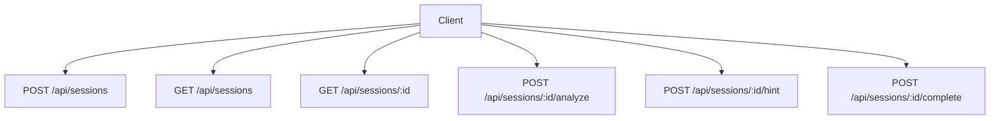
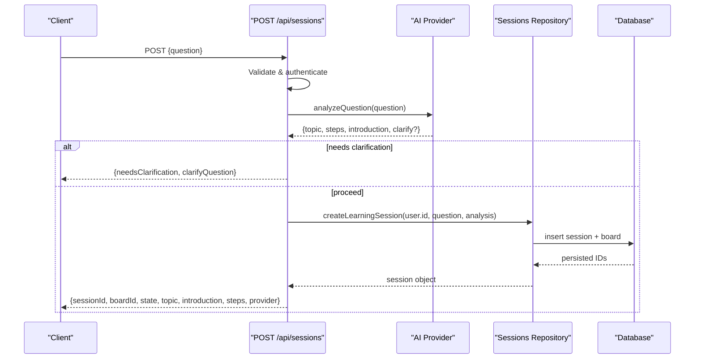
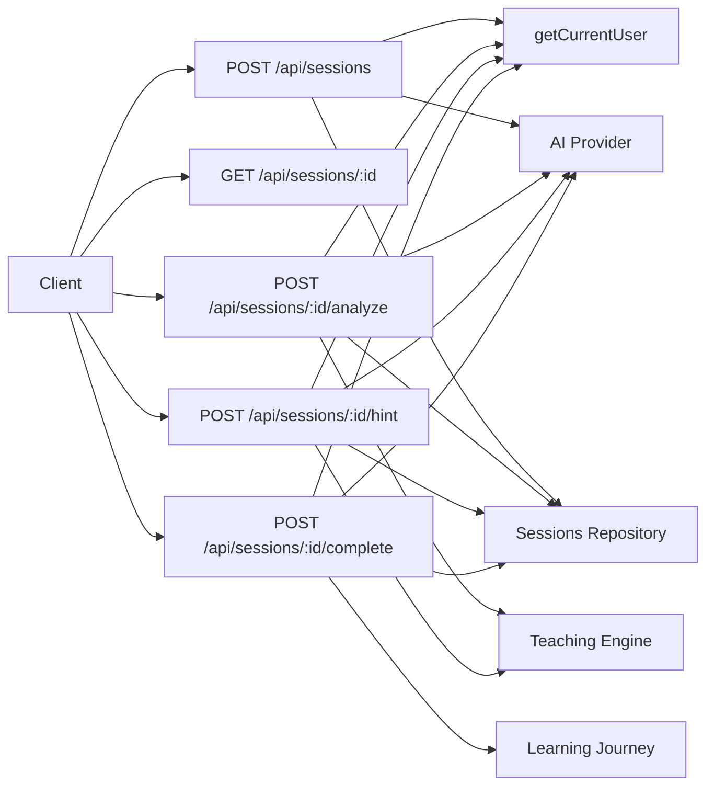

# Sessions API

<cite>
**Referenced Files in This Document**
- [route.ts](file://stepwise ai/app/app/api/sessions/route.ts)
- [route.ts](file://stepwise ai/app/app/api/sessions/[id]/route.ts)
- [route.ts](file://stepwise ai/app/app/api/sessions/[id]/analyze/route.ts)
- [route.ts](file://stepwise ai/app/app/api/sessions/[id]/complete/route.ts)
- [route.ts](file://stepwise ai/app/app/api/sessions/[id]/hint/route.ts)
</cite>

## Table of Contents
1. Introduction
2. Project Structure
3. Core Components
4. Architecture Overview
5. Detailed Component Analysis
6. Dependency Analysis
7. Performance Considerations
8. Troubleshooting Guide
9. Conclusion

## Introduction
This document provides comprehensive API documentation for StepWise AI session management endpoints. It covers creating learning sessions, retrieving and updating session state, evaluating student work with AI, generating final reports, and requesting adaptive hints. The focus is on request/response schemas, authentication requirements, session state transitions, error handling, and typical workflows from creation to completion.

## Project Structure
The Sessions API is implemented as Next.js route handlers under the app/api/sessions directory. Each endpoint corresponds to a specific route file:
- POST /api/sessions — create a new learning session
- GET /api/sessions — list recent sessions for the current user
- GET /api/sessions/[id] — retrieve full session recovery payload
- POST /api/sessions/[id]/analyze — evaluate student work
- POST /api/sessions/[id]/hint — request adaptive hint
- POST /api/sessions/[id]/complete — finalize session and generate report

**Diagram sources**
- [route.ts](file://stepwise ai/app/app/api/sessions/route.ts)
- [route.ts](file://stepwise ai/app/app/api/sessions/[id]/route.ts)
- [route.ts](file://stepwise ai/app/app/api/sessions/[id]/analyze/route.ts)
- [route.ts](file://stepwise ai/app/app/api/sessions/[id]/hint/route.ts)
- [route.ts](file://stepwise ai/app/app/api/sessions/[id]/complete/route.ts)

**Section sources**
- [route.ts](file://stepwise ai/app/app/api/sessions/route.ts)
- [route.ts](file://stepwise ai/app/app/api/sessions/[id]/route.ts)
- [route.ts](file://stepwise ai/app/app/api/sessions/[id]/analyze/route.ts)
- [route.ts](file://stepwise ai/app/app/api/sessions/[id]/hint/route.ts)
- [route.ts](file://stepwise ai/app/app/api/sessions/[id]/complete/route.ts)

## Core Components
- Authentication: All endpoints require an authenticated user via getCurrentUser. Unauthenticated requests return unauthorized responses.
- Validation helpers: Input fields are validated using helpers such as str and int; invalid inputs produce structured error responses.
- Session repository: Centralized access to session data, board objects, AI messages, hints, errors, and state updates.
- AI provider: Used for question analysis, evaluation, hint generation, and final report generation.
- Teaching engine: Determines intervention levels and next hint levels based on evaluation outcomes and hint history.
- Database: Persists sessions, reports, learning events, hints, and profile settings.

Typical response envelope:
- Success: { ...data }
- Error: { code, message }

Common HTTP status codes:
- 200 OK for successful reads or idempotent completions that already exist
- 201 Created for newly created sessions
- 400 Bad Request for validation failures (e.g., empty question, invalid step)
- 401 Unauthorized when no authenticated user is present
- 404 Not Found when a session does not exist
- 500 Server Error for unexpected server-side failures

**Section sources**
- [route.ts](file://stepwise ai/app/app/api/sessions/route.ts)
- [route.ts](file://stepwise ai/app/app/api/sessions/[id]/route.ts)
- [route.ts](file://stepwise ai/app/app/api/sessions/[id]/analyze/route.ts)
- [route.ts](file://stepwise ai/app/app/api/sessions/[id]/hint/route.ts)
- [route.ts](file://stepwise ai/app/app/api/sessions/[id]/complete/route.ts)

## Architecture Overview
The Sessions API orchestrates client requests through route handlers that validate input, enforce authentication, interact with the session repository, call the AI provider, update state, and persist events. State transitions are driven by evaluation results and hint consumption.

**Diagram sources**
- [route.ts](file://stepwise ai/app/app/api/sessions/route.ts)

**Section sources**
- [route.ts](file://stepwise ai/app/app/api/sessions/route.ts)

## Detailed Component Analysis

### Create Session: POST /api/sessions
Purpose:
- Accepts a student’s question, analyzes it with AI to determine subject/topic/steps, and creates a new learning session. If clarification is needed, returns guidance instead of creating a session.

Authentication:
- Requires an authenticated user.

Request body:
- question: string (required, max length enforced)

Response (201 Created):
- sessionId: number
- boardId: number
- state: string
- topic: string
- introduction: string
- steps: array of step definitions
- provider: { displayName: string, isDemo: boolean }

Error responses:
- 400: EMPTY_QUESTION if question is too short
- 401: Unauthorized if not authenticated
- 500: Server error

Notes:
- If AI indicates clarification is required, returns { needsClarification: true, clarifyQuestion: string }.

**Section sources**
- [route.ts](file://stepwise ai/app/app/api/sessions/route.ts)

### List Sessions: GET /api/sessions
Purpose:
- Returns a limited list of recent sessions for the authenticated user.

Authentication:
- Requires an authenticated user.

Response (200 OK):
- sessions: array of session summaries

Error responses:
- 401: Unauthorized
- 500: Server error

**Section sources**
- [route.ts](file://stepwise ai/app/app/api/sessions/route.ts)

### Retrieve Session: GET /api/sessions/[id]
Purpose:
- Provides a full recovery payload including session metadata, board objects, and AI messages. Ensures continuity across refreshes.

Authentication:
- Requires an authenticated user.

Path parameters:
- id: number (session ID)

Response (200 OK):
- session: {
    id: number,
    status: string,
    state: string,
    currentStep: number,
    activeSeconds: number,
    startedAt: string,
    question: string,
    analysis: object,
    stateData: object,
    boardId: number,
    boardTitle: string
  }
- objects: array of board objects
- messages: array of AI messages
- provider: { displayName: string, isDemo: boolean }

Error responses:
- 401: Unauthorized
- 404: Not Found if session does not belong to user
- 500: Server error

**Section sources**
- [route.ts](file://stepwise ai/app/app/api/sessions/[id]/route.ts)

### Evaluate Student Work: POST /api/sessions/[id]/analyze
Purpose:
- Evaluates the student’s attempt at the current step using AI, records errors, updates session state, advances steps when correct, and logs learning events.

Authentication:
- Requires an authenticated user.

Path parameters:
- id: number (session ID)

Request body:
- stepIndex: number (defaults to session.current_step)
- attemptText: string (max length enforced)
- activeSeconds: number (used to track engagement)

Behavior:
- Validates step index against available steps.
- Builds evaluation context from session analysis, board objects, profile, and previous hints.
- Calls AI to evaluate student work.
- Records errors or marks them corrected when appropriate.
- Updates session state and step progression.
- Persists AI messages and learning events.

Response (200 OK):
- evaluation: {
    status: string ("correct" | "partial" | "error"),
    summary: string,
    feedback: string,
    strengths: string[],
    missingElements: string[],
    nextAction: string,
    interventionLevel: number
  }
- stepJustCompleted: boolean
- stepCompleted: number
- nextStepIndex: number
- allStepsDone: boolean
- sessionState: string

Error responses:
- 400: INVALID_STEP if stepIndex is out of range
- 401: Unauthorized
- 404: Not Found if session does not exist
- 400: SESSION_COMPLETED if session is already finished
- 500: Server error

State transitions:
- On correct: may advance to next step; if all steps completed, transition to INTEGRATION.
- On partial/error: remain in current or error-related state; reset counters as needed.

**Section sources**
- [route.ts](file://stepwise ai/app/app/api/sessions/[id]/analyze/route.ts)

### Request Adaptive Hint: POST /api/sessions/[id]/hint
Purpose:
- Generates an escalating hint based on prior hints and current context without revealing the answer.

Authentication:
- Requires an authenticated user.

Path parameters:
- id: number (session ID)

Request body:
- attemptText: string (optional, used to tailor hint)

Behavior:
- Computes next hint level from previous hints.
- Builds evaluation context including board state and profile.
- Calls AI to generate a hint at the computed level.
- Records hint and adds AI message.
- Updates session state to GUIDANCE and increments hintsSinceLastError.

Response (200 OK):
- hint: { message: string }
- level: number

Error responses:
- 401: Unauthorized
- 404: Not Found if session does not exist
- 400: SESSION_COMPLETED if session is already finished
- 500: Server error

Hint escalation:
- Levels increase over time based on previous hints to provide progressively more supportive guidance.

**Section sources**
- [route.ts](file://stepwise ai/app/app/api/sessions/[id]/hint/route.ts)

### Complete Session: POST /api/sessions/[id]/complete
Purpose:
- Finalizes the session, generates a final report, persists it atomically with session finalization, and updates the learning journey. Idempotent to prevent duplicate reports.

Authentication:
- Requires an authenticated user.

Path parameters:
- id: number (session ID)

Request body:
- activeSeconds: number (used to ensure accurate duration tracking)

Behavior:
- Checks for existing report to ensure idempotency.
- Collects session stats and state data.
- Calls AI to generate a final report.
- Atomically inserts report, updates session state to SESSION_COMPLETE, and logs completion event.
- Updates learning journey with concepts, steps, errors, self-corrections, and misconceptions.

Response (200 OK):
- report: FinalReport object
- journey: updated journey result

Error responses:
- 401: Unauthorized
- 404: Not Found if session does not exist
- 500: Server error

Idempotency:
- If a report already exists for this session/user, returns the existing report with alreadyExisted flag.

**Section sources**
- [route.ts](file://stepwise ai/app/app/api/sessions/[id]/complete/route.ts)

## Dependency Analysis
The endpoints depend on shared utilities and repositories:
- Authentication via getCurrentUser
- Input validation via apiHelpers (ok, unauthorized, notFound, fail, str, int, serverError)
- Session operations via sessionsRepo (getSession, getBoardObjects, updateSessionState, addAiMessage, recordErrors, markErrorsCorrected, recordHint, getSessionStats)
- AI interactions via ai provider (analyzeQuestion, evaluateStudentWork, generateHint, generateFinalReport)
- Teaching logic via teaching module (decideIntervention, nextHintLevel, stateAfterEvaluation)
- Persistence via db (transactions, inserts, queries)

**Diagram sources**
- [route.ts](file://stepwise ai/app/app/api/sessions/route.ts)
- [route.ts](file://stepwise ai/app/app/api/sessions/[id]/route.ts)
- [route.ts](file://stepwise ai/app/app/api/sessions/[id]/analyze/route.ts)
- [route.ts](file://stepwise ai/app/app/api/sessions/[id]/hint/route.ts)
- [route.ts](file://stepwise ai/app/app/api/sessions/[id]/complete/route.ts)

**Section sources**
- [route.ts](file://stepwise ai/app/app/api/sessions/route.ts)
- [route.ts](file://stepwise ai/app/app/api/sessions/[id]/route.ts)
- [route.ts](file://stepwise ai/app/app/api/sessions/[id]/analyze/route.ts)
- [route.ts](file://stepwise ai/app/app/api/sessions/[id]/hint/route.ts)
- [route.ts](file://stepwise ai/app/app/api/sessions/[id]/complete/route.ts)

## Performance Considerations
- Avoid per-keystroke evaluations; only submit meaningful attempts to reduce AI calls and database writes.
- Batch UI updates where possible to minimize network overhead.
- Use activeSeconds to accurately measure engagement without excessive polling.
- Leverage idempotent completion to safely retry finalization without duplicating reports.

[No sources needed since this section provides general guidance]

## Troubleshooting Guide
Common issues and resolutions:
- Empty question: Ensure the question field meets minimum length requirements before creating a session.
- Invalid step index: Verify stepIndex is within bounds of available steps during evaluation.
- Session already completed: Do not call analyze or hint on completed sessions; use complete to finalize.
- Unauthorized: Confirm the user is authenticated before making requests.
- Not found: Check that the session ID belongs to the current user and exists.
- Server error: Inspect server logs for unexpected exceptions; these are wrapped into generic server error responses.

Error response patterns:
- Validation errors include a code and descriptive message.
- Authentication and authorization errors return standardized unauthorized responses.
- Resource not found returns notFound responses.

**Section sources**
- [route.ts](file://stepwise ai/app/app/api/sessions/route.ts)
- [route.ts](file://stepwise ai/app/app/api/sessions/[id]/route.ts)
- [route.ts](file://stepwise ai/app/app/api/sessions/[id]/analyze/route.ts)
- [route.ts](file://stepwise ai/app/app/api/sessions/[id]/hint/route.ts)
- [route.ts](file://stepwise ai/app/app/api/sessions/[id]/complete/route.ts)

## Conclusion
The Sessions API provides a robust, secure, and AI-powered workflow for managing learning sessions from creation to completion. It supports adaptive hints, intelligent evaluation, and comprehensive reporting while ensuring state consistency and idempotent operations. By following the documented request/response schemas and error handling patterns, clients can implement seamless educational experiences tailored to each learner’s progress.

[No sources needed since this section summarizes without analyzing specific files]