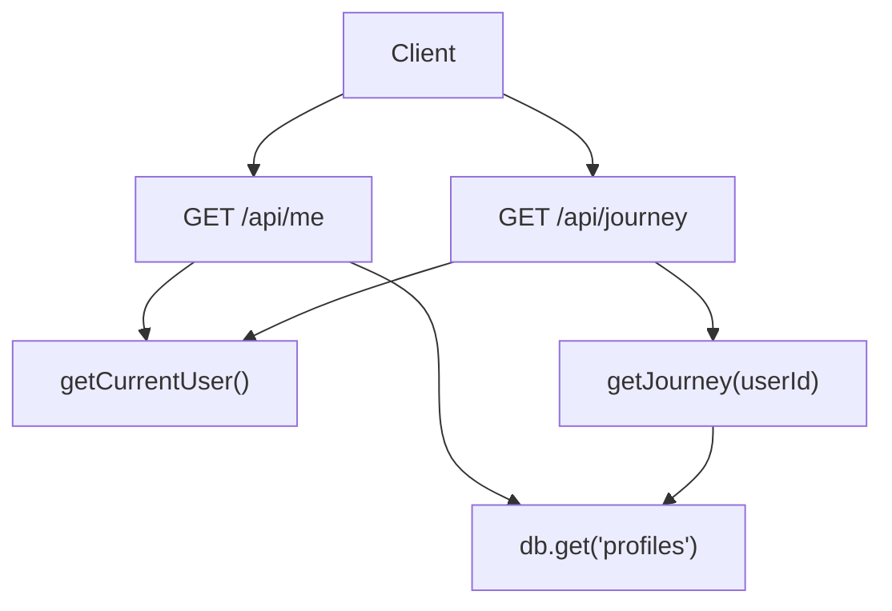
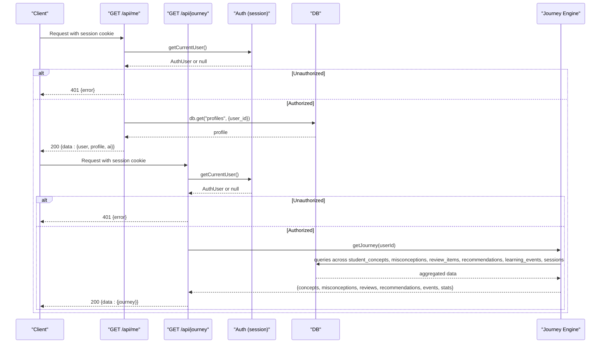
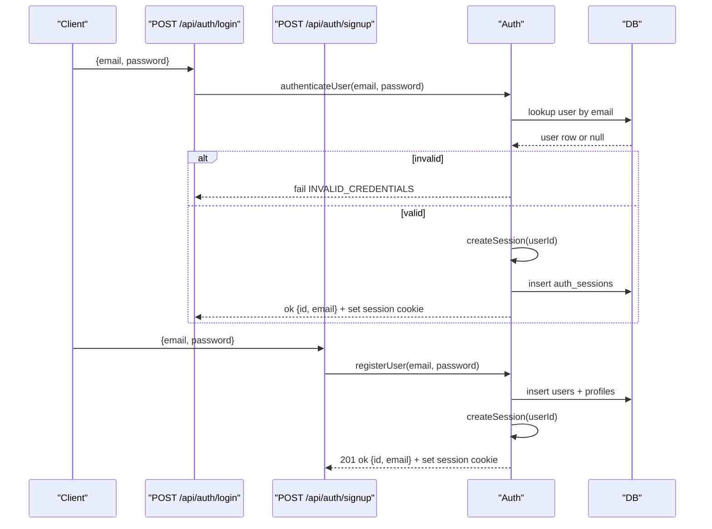
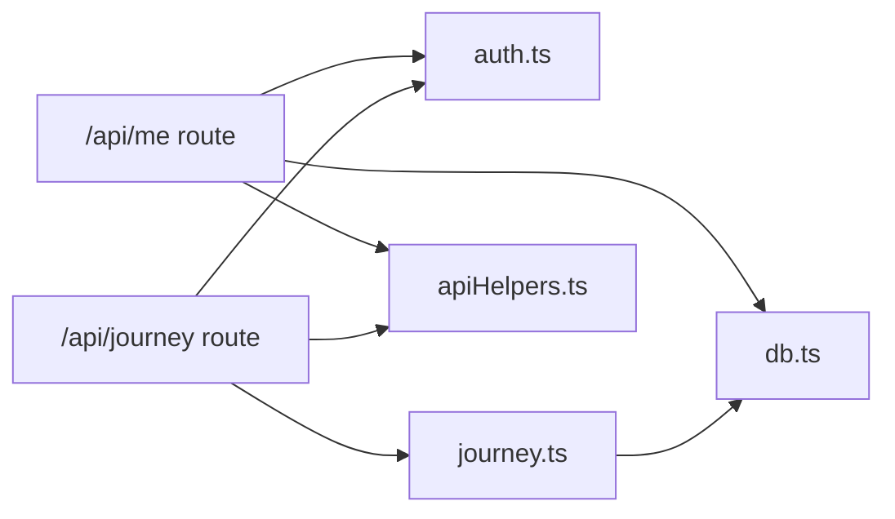

# User Management API

<cite>
**Referenced Files in This Document**
- [route.ts](file://stepwise ai/app/app/api/me/route.ts)
- [route.ts](file://stepwise ai/app/app/api/journey/route.ts)
- [auth.ts](file://stepwise ai/app/lib/auth.ts)
- [types.ts](file://stepwise ai/app/lib/types.ts)
- [journey.ts](file://stepwise ai/app/lib/journey.ts)
- [apiHelpers.ts](file://stepwise ai/app/lib/apiHelpers.ts)
- [db.ts](file://stepwise ai/app/lib/db.ts)
- [client.ts](file://stepwise ai/app/lib/client.ts)
- [login route.ts](file://stepwise ai/app/app/api/auth/login/route.ts)
- [signup route.ts](file://stepwise ai/app/app/api/auth/signup/route.ts)
</cite>

## Table of Contents
1. Introduction
2. Project Structure
3. Core Components
4. Architecture Overview
5. Detailed Component Analysis
6. Dependency Analysis
7. Performance Considerations
8. Troubleshooting Guide
9. Conclusion
10. Appendices

## Introduction
This document provides detailed API documentation for StepWise AI user management endpoints focused on:
- GET /api/me: Retrieve the current authenticated user’s profile, preferences, and account settings.
- GET /api/journey: Access long-term learning progress, concept mastery history, and personalized recommendations.

It specifies request/response schemas, authentication requirements, data privacy controls, access permissions, examples, rate limiting considerations, data retention policies, and compliance guidance for educational data protection.

## Project Structure
The relevant API routes are implemented as Next.js App Router handlers under app/api. Authentication is handled via signed session cookies. The journey endpoint aggregates learning state from a local JSON-backed relational store.

**Diagram sources**
- [route.ts:20-33](file://stepwise ai/app/app/api/me/route.ts#L20-L33)
- [route.ts:8-16](file://stepwise ai/app/app/api/journey/route.ts#L8-L16)
- [auth.ts:78-102](file://stepwise ai/app/lib/auth.ts#L78-L102)
- [journey.ts:274-356](file://stepwise ai/app/lib/journey.ts#L274-L356)
- [db.ts:123-199](file://stepwise ai/app/lib/db.ts#L123-L199)

**Section sources**
- [route.ts:1-79](file://stepwise ai/app/app/api/me/route.ts#L1-L79)
- [route.ts:1-17](file://stepwise ai/app/app/api/journey/route.ts#L1-L17)
- [auth.ts:1-139](file://stepwise ai/app/lib/auth.ts#L1-L139)
- [journey.ts:1-357](file://stepwise ai/app/lib/journey.ts#L1-L357)
- [db.ts:1-224](file://stepwise ai/app/lib/db.ts#L1-L224)

## Core Components
- Authentication: Signed httpOnly session cookie with secure defaults in production; session validation returns minimal user identity.
- Profile API: Reads and updates user profile fields with strict whitelisting and input sanitization.
- Journey API: Aggregates concepts, misconceptions, reviews, recommendations, events, and summary statistics for the authenticated user.
- Response envelope: All responses follow a consistent { data, error } structure with standardized error codes.

**Section sources**
- [auth.ts:46-102](file://stepwise ai/app/lib/auth.ts#L46-L102)
- [route.ts:20-79](file://stepwise ai/app/app/api/me/route.ts#L20-L79)
- [route.ts:8-16](file://stepwise ai/app/app/api/journey/route.ts#L8-L16)
- [apiHelpers.ts:8-30](file://stepwise ai/app/lib/apiHelpers.ts#L8-L30)

## Architecture Overview
The API enforces authorization-first access patterns. Both endpoints require a valid session cookie. The me endpoint returns user identity plus profile and AI provider info. The journey endpoint returns a comprehensive learning map derived from multiple tables.

**Diagram sources**
- [route.ts:20-33](file://stepwise ai/app/app/api/me/route.ts#L20-L33)
- [route.ts:8-16](file://stepwise ai/app/app/api/journey/route.ts#L8-L16)
- [auth.ts:78-102](file://stepwise ai/app/lib/auth.ts#L78-L102)
- [journey.ts:274-356](file://stepwise ai/app/lib/journey.ts#L274-L356)
- [db.ts:123-199](file://stepwise ai/app/lib/db.ts#L123-L199)

## Detailed Component Analysis

### Endpoint: GET /api/me
Retrieves the current user’s identity, profile, and AI provider context. Requires a valid session cookie.

- Method: GET
- Path: /api/me
- Authentication: Required (session cookie)
- Success response: 200 OK
- Error responses:
  - 401 UNAUTHORIZED if no valid session
  - 500 SERVER_ERROR on server-side failures

Response schema:
- data.user: object
  - id: number
  - email: string
- data.profile: object (nullable)
  - user_id: number
  - display_name: string
  - age_band: enum ("EARLY_LEARNER" | "YOUNG_LEARNER" | "EARLY_TEEN" | "TEEN" | "ADULT")
  - education_level: string
  - preferred_language: string
  - explanation_depth: enum ("QUICK" | "STANDARD" | "DETAILED" | "DEEP_DIVE")
  - autonomy_level: enum ("GUIDED" | "BALANCED" | "INDEPENDENT")
  - learning_mode: enum ("GUIDED" | "BALANCED" | "CHALLENGE" | "EXPLAIN" | "REVIEW")
  - theme: enum ("light" | "dark" | "system")
  - onboarded: number
- data.ai: object
  - provider: string
  - isDemo: boolean

Example success payload:
{
  "data": {
    "user": { "id": 1, "email": "learner@example.com" },
    "profile": { ... },
    "ai": { "provider": "StepWise AI", "isDemo": false }
  },
  "error": null
}

Example unauthorized payload:
{
  "data": null,
  "error": { "code": "UNAUTHORIZED", "message": "Please sign in to continue." }
}

Notes:
- Input validation and whitelisting are enforced on PATCH /api/me (see below).
- Session cookie is httpOnly, sameSite lax, secure in production, maxAge 30 days.

**Section sources**
- [route.ts:20-33](file://stepwise ai/app/app/api/me/route.ts#L20-L33)
- [auth.ts:78-102](file://stepwise ai/app/lib/auth.ts#L78-L102)
- [types.ts:239-250](file://stepwise ai/app/lib/types.ts#L239-L250)
- [apiHelpers.ts:19-21](file://stepwise ai/app/lib/apiHelpers.ts#L19-L21)

### Endpoint: PATCH /api/me
Updates user profile preferences with strict field validation and sanitization. Only whitelisted fields can be updated.

- Method: PATCH
- Path: /api/me
- Authentication: Required (session cookie)
- Request body: Partial profile object (only specified fields will be updated)
- Allowed fields:
  - display_name: string (trimmed, max length enforced)
  - age_band: enum
  - education_level: string (trimmed, max length enforced)
  - preferred_language: string (default "en", trimmed, max length enforced)
  - explanation_depth: enum
  - autonomy_level: enum
  - learning_mode: enum
  - theme: enum
  - onboarded: boolean (sets flag when true)
- Success response: 200 OK with updated profile
- Error responses:
  - 400 NO_CHANGES if no valid fields provided
  - 401 UNAUTHORIZED if not authenticated
  - 500 SERVER_ERROR on server-side failures

Example request:
{
  "preferred_language": "fr",
  "explanation_depth": "DETAILED",
  "learning_mode": "BALANCED",
  "theme": "dark"
}

Example success response:
{
  "data": { "profile": { ... } },
  "error": null
}

Validation behavior:
- Unknown fields are ignored.
- Enum values are validated against allowed sets.
- Strings are trimmed and clamped to configured maximum lengths.
- Timestamps are set server-side.

**Section sources**
- [route.ts:35-79](file://stepwise ai/app/app/api/me/route.ts#L35-L79)
- [apiHelpers.ts:32-41](file://stepwise ai/app/lib/apiHelpers.ts#L32-L41)

### Endpoint: GET /api/journey
Returns the authenticated user’s long-term learning map including concept statuses, misconceptions, scheduled reviews, recommendations, recent events, and summary statistics.

- Method: GET
- Path: /api/journey
- Authentication: Required (session cookie)
- Success response: 200 OK
- Error responses:
  - 401 UNAUTHORIZED if no valid session
  - 500 SERVER_ERROR on server-side failures

Response schema:
- data.journey: object
  - concepts: array of objects
    - name: string
    - subject: string
    - topic: string
    - status: enum ("UNKNOWN" | "INTRODUCED" | "EXPLORING" | "DEVELOPING" | "PARTIALLY_UNDERSTOOD" | "UNDERSTOOD" | "STRONG" | "MASTERED" | "NEEDS_REVIEW" | "MISCONCEPTION_DETECTED" | "PREREQUISITE_BLOCKED")
    - evidence_count: number
    - review_due: string | null
  - misconceptions: array of objects
    - description: string
    - concept_name: string
    - status: string
    - occurrence_count: number
  - reviews: array of objects
    - concept_name: string
    - due_at: string
    - reason: string
    - status: string
  - recommendations: array of objects
    - type: enum ("CONTINUE" | "REVIEW" | "STRENGTHEN_PREREQUISITE" | "PRACTICE" | "GO_DEEPER" | "APPLY" | "EXPLORE" | "REST")
    - title: string
    - reason: string
  - events: array of objects
    - event_type: string
    - created_at: string
    - detail_json: string
  - stats: object
    - sessions: number
    - completed: number
    - self_corrections: number

Example success payload:
{
  "data": {
    "journey": {
      "concepts": [ ... ],
      "misconceptions": [ ... ],
      "reviews": [ ... ],
      "recommendations": [ ... ],
      "events": [ ... ],
      "stats": { "sessions": 12, "completed": 9, "self_corrections": 5 }
    }
  },
  "error": null
}

Processing logic highlights:
- Concept status transitions are evidence-driven based on completion ratio, hints used, conceptual errors, and self-corrections.
- Misconception lifecycle tracks detection, recurrence, and resolution.
- Spaced review items are scheduled for developing concepts.
- Recommendations are generated based on performance and gaps.

**Section sources**
- [route.ts:8-16](file://stepwise ai/app/app/api/journey/route.ts#L8-L16)
- [journey.ts:59-262](file://stepwise ai/app/lib/journey.ts#L59-L262)
- [journey.ts:274-356](file://stepwise ai/app/lib/journey.ts#L274-L356)
- [types.ts:149-193](file://stepwise ai/app/lib/types.ts#L149-L193)

### Authentication and Sessions
- Login creates a signed session cookie and persists it server-side.
- Logout clears the session cookie and removes the session record.
- Signup validates email format and password strength, then creates a user and profile, and issues a session.

Authentication flow:

**Diagram sources**
- [login route.ts:7-29](file://stepwise ai/app/app/api/auth/login/route.ts#L7-L29)
- [signup route.ts:10-35](file://stepwise ai/app/app/api/auth/signup/route.ts#L10-L35)
- [auth.ts:104-136](file://stepwise ai/app/lib/auth.ts#L104-L136)
- [auth.ts:46-67](file://stepwise ai/app/lib/auth.ts#L46-L67)

**Section sources**
- [auth.ts:46-102](file://stepwise ai/app/lib/auth.ts#L46-L102)
- [login route.ts:7-29](file://stepwise ai/app/app/api/auth/login/route.ts#L7-L29)
- [signup route.ts:10-35](file://stepwise ai/app/app/api/auth/signup/route.ts#L10-L35)

## Dependency Analysis
- Endpoints depend on:
  - Authentication module for session verification and user identity.
  - Database layer for reading/writing user profiles and learning data.
  - Journey engine for aggregating learning state and generating recommendations.
  - API helpers for consistent response envelopes and safe error handling.

**Diagram sources**
- [route.ts:1-79](file://stepwise ai/app/app/api/me/route.ts#L1-L79)
- [route.ts:1-17](file://stepwise ai/app/app/api/journey/route.ts#L1-L17)
- [auth.ts:1-139](file://stepwise ai/app/lib/auth.ts#L1-L139)
- [journey.ts:1-357](file://stepwise ai/app/lib/journey.ts#L1-L357)
- [apiHelpers.ts:1-42](file://stepwise ai/app/lib/apiHelpers.ts#L1-L42)
- [db.ts:1-224](file://stepwise ai/app/lib/db.ts#L1-L224)

**Section sources**
- [route.ts:1-79](file://stepwise ai/app/app/api/me/route.ts#L1-L79)
- [route.ts:1-17](file://stepwise ai/app/app/api/journey/route.ts#L1-L17)
- [auth.ts:1-139](file://stepwise ai/app/lib/auth.ts#L1-L139)
- [journey.ts:1-357](file://stepwise ai/app/lib/journey.ts#L1-L357)
- [apiHelpers.ts:1-42](file://stepwise ai/app/lib/apiHelpers.ts#L1-L42)
- [db.ts:1-224](file://stepwise ai/app/lib/db.ts#L1-L224)

## Performance Considerations
- Database operations are synchronous and atomic within transactions; ensure payloads remain small to avoid large JSON writes.
- Journey reads limit result sets (e.g., top 100 concepts, top 30 misconceptions/reviews/events) to control response size.
- Avoid frequent PATCH calls to /api/me; batch preference updates where possible.
- For high-throughput scenarios, consider moving from the embedded JSON store to PostgreSQL as indicated by the database layer design.

[No sources needed since this section provides general guidance]

## Troubleshooting Guide
Common errors and resolutions:
- UNAUTHORIZED: Ensure the client sends requests with credentials enabled and that the session cookie is present and valid.
- NO_CHANGES: Verify that at least one whitelisted field is included in PATCH requests.
- SERVER_ERROR: Check server logs; stack traces are intentionally suppressed in responses.

Client integration tips:
- Use the provided client helper to unwrap the standard envelope and handle errors consistently.
- Always send credentials: "same-origin" for browser-based clients.

**Section sources**
- [apiHelpers.ts:8-30](file://stepwise ai/app/lib/apiHelpers.ts#L8-L30)
- [client.ts:7-27](file://stepwise ai/app/lib/client.ts#L7-L27)

## Conclusion
The StepWise AI user management API provides secure, well-structured endpoints for retrieving and updating user profiles and accessing long-term learning progress. Authentication is enforced via signed session cookies, and all responses adhere to a consistent envelope. The journey endpoint offers rich insights into concept mastery, misconceptions, and adaptive recommendations, enabling personalized learning experiences.

[No sources needed since this section summarizes without analyzing specific files]

## Appendices

### Data Privacy Controls and Access Permissions
- Authorization-first: Both endpoints require a valid session cookie; unauthenticated requests receive 401.
- Minimal identity exposure: The me endpoint returns only user id and email, not sensitive credentials.
- Profile updates are restricted to whitelisted fields; unknown fields are ignored.
- Session cookies are httpOnly, sameSite lax, and secure in production environments.

**Section sources**
- [auth.ts:59-71](file://stepwise ai/app/lib/auth.ts#L59-L71)
- [route.ts:20-33](file://stepwise ai/app/app/api/me/route.ts#L20-L33)
- [route.ts:8-16](file://stepwise ai/app/app/api/journey/route.ts#L8-L16)

### Rate Limiting
- No built-in rate limiting is implemented in the current codebase.
- Recommendation: Apply rate limiting at the reverse proxy or edge layer (e.g., per-IP or per-user limits) to protect endpoints from abuse.

[No sources needed since this section provides general guidance]

### Data Retention Policies
- Embedded JSON store persists data to disk; consider implementing cleanup jobs for expired sessions and old events in production.
- Cascade deletion utility exists to remove all user-related data upon account deletion.

**Section sources**
- [db.ts:201-224](file://stepwise ai/app/lib/db.ts#L201-L224)

### Compliance Considerations for Educational Data Protection
- Minimize data collection: Only collect necessary profile fields and learning metrics.
- Secure storage: Ensure encryption at rest for the database file and TLS in transit.
- Auditability: Maintain learning events for transparency while respecting privacy.
- Consent and rights: Provide mechanisms for users to view, export, and delete their data.

[No sources needed since this section provides general guidance]

### Example Workflows

- Query user progress:
  - Call GET /api/journey with a valid session cookie to retrieve concepts, misconceptions, reviews, recommendations, events, and stats.

- Update preferences:
  - Call PATCH /api/me with desired fields (e.g., preferred_language, explanation_depth, learning_mode, theme).

- Integrate with external learning management systems:
  - Use the journey data to sync concept statuses and recommendations to an LMS via its API.
  - Map StepWise concept statuses to LMS proficiency levels and schedule reviews accordingly.

[No sources needed since this section provides general guidance]