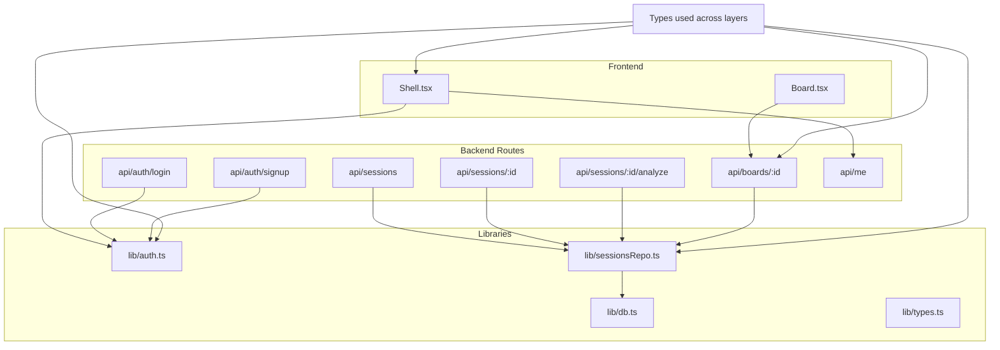
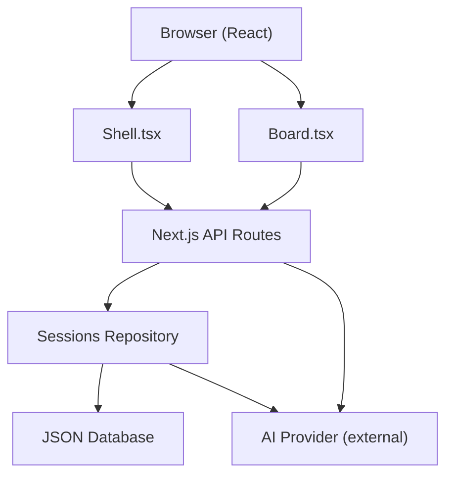
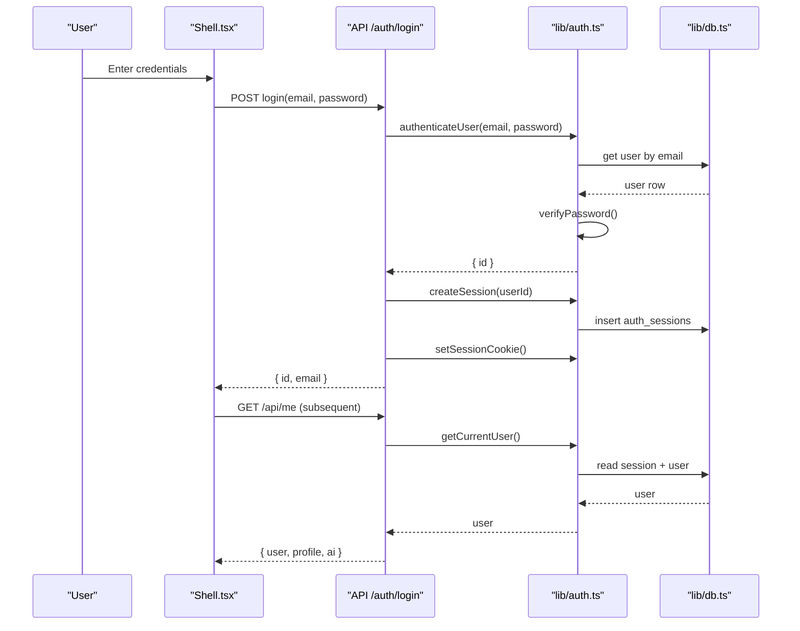
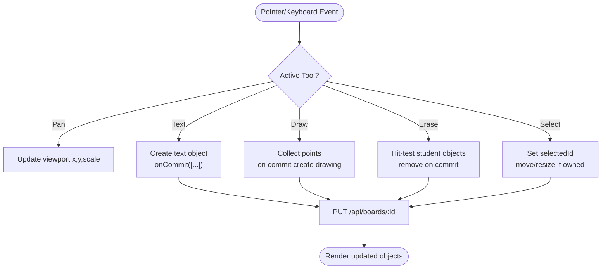
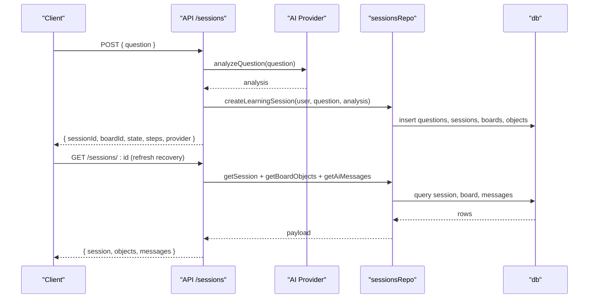
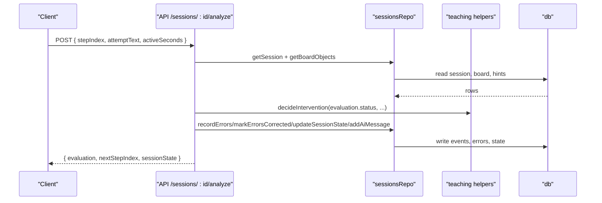
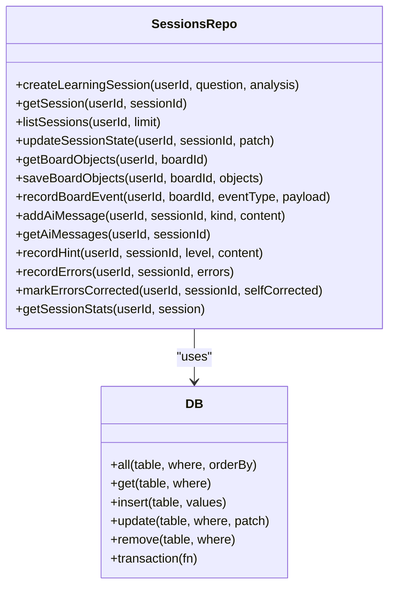
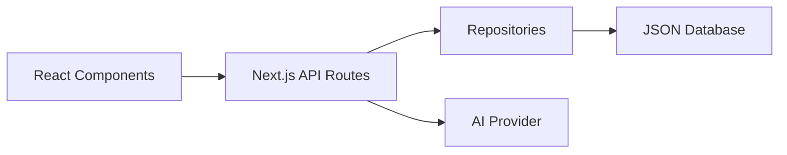
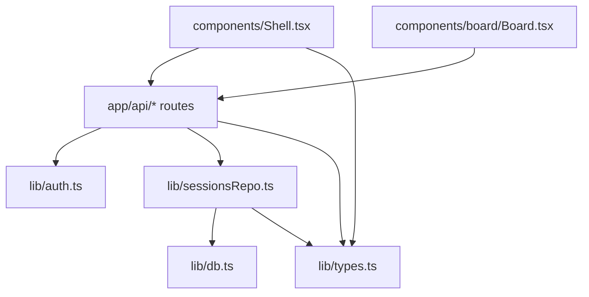

# Architecture Overview

<cite>
**Referenced Files in This Document**
- [Shell.tsx](file://app/components/Shell.tsx)
- [Board.tsx](file://app/components/board/Board.tsx)
- [login route](file://app/app/api/auth/login/route.ts)
- [signup route](file://app/app/api/auth/signup/route.ts)
- [sessions route](file://app/app/api/sessions/route.ts)
- [session GET route](file://app/app/api/sessions/[id]/route.ts)
- [analyze route](file://app/app/api/sessions/[id]/analyze/route.ts)
- [boards route](file://app/app/api/boards/[id]/route.ts)
- [me route](file://app/app/api/me/route.ts)
- [auth module](file://app/lib/auth.ts)
- [database module](file://app/lib/db.ts)
- [sessions repository](file://app/lib/sessionsRepo.ts)
- [types](file://app/lib/types.ts)
</cite>

## Table of Contents
1. Introduction
2. Project Structure
3. Core Components
4. Architecture Overview
5. Detailed Component Analysis
6. Dependency Analysis
7. Performance Considerations
8. Troubleshooting Guide
9. Conclusion

## Introduction
StepWise AI is a full-stack Next.js application with a React frontend and Node.js backend. It uses the App Router for routing, a component-based UI architecture centered on an interactive Board workspace, and a repository pattern for data access backed by an embedded JSON database. The system separates concerns into:
- Presentation layer: React components (Shell, Board)
- Business logic layer: API routes and teaching engine helpers
- Data access layer: repository functions that enforce ownership and validation
- Storage layer: file-based JSON store with transactional semantics

The central “Board” paradigm replaces chat-style interfaces with a spatial canvas where students think, draw, and iterate while the AI observes and evaluates meaningful submissions.

## Project Structure
The project follows a feature-oriented layout within Next.js App Router:
- app/app: Pages and API routes organized by domain (auth, sessions, boards, me)
- app/components: Client-side React components (Shell, Board)
- app/lib: Shared libraries (authentication, database, repositories, types, AI integration)

**Diagram sources**
- [Shell.tsx:1-124](file://app/components/Shell.tsx#L1-L124)
- [Board.tsx:1-540](file://app/components/board/Board.tsx#L1-L540)
- [login route:1-30](file://app/app/api/auth/login/route.ts#L1-L30)
- [signup route:1-36](file://app/app/api/auth/signup/route.ts#L1-L36)
- [sessions route:1-56](file://app/app/api/sessions/route.ts#L1-L56)
- [session GET route:1-51](file://app/app/api/sessions/[id]/route.ts#L1-L51)
- [analyze route:1-180](file://app/app/api/sessions/[id]/analyze/route.ts#L1-L180)
- [boards route:1-106](file://app/app/api/boards/[id]/route.ts#L1-L106)
- [auth module:1-139](file://app/lib/auth.ts#L1-L139)
- [sessions repository:1-399](file://app/lib/sessionsRepo.ts#L1-L399)
- [database module:1-224](file://app/lib/db.ts#L1-L224)
- [types:1-302](file://app/lib/types.ts#L1-L302)

**Section sources**
- [Shell.tsx:1-124](file://app/components/Shell.tsx#L1-L124)
- [Board.tsx:1-540](file://app/components/board/Board.tsx#L1-L540)
- [sessions route:1-56](file://app/app/api/sessions/route.ts#L1-L56)
- [sessions repository:1-399](file://app/lib/sessionsRepo.ts#L1-L399)
- [database module:1-224](file://app/lib/db.ts#L1-L224)

## Core Components
- Shell: Authenticates users via session cookie, enforces onboarding, applies adaptive theme, and provides navigation.
- Board: Spatial canvas supporting pan/zoom, object creation/editing/drawing, selection/resizing, and optimistic updates persisted to the server.
- Authentication: Secure password hashing, signed session cookies, and user lookup.
- Repository: Enforces ownership checks, validates inputs, and persists board snapshots and learning events.
- Database: Embedded JSON store with atomic transactions and safe persistence.

Key architectural decisions:
- App Router for predictable routing and server-side APIs co-located with pages.
- Component-based UI with clear separation between stateful canvas (Board) and shell chrome (Shell).
- Repository pattern centralizes business rules around sessions, boards, and evaluation artifacts.
- JSON storage enables zero-dependency development and easy migration to PostgreSQL by swapping only the storage layer.

**Section sources**
- [Shell.tsx:1-124](file://app/components/Shell.tsx#L1-L124)
- [Board.tsx:1-540](file://app/components/board/Board.tsx#L1-L540)
- [auth module:1-139](file://app/lib/auth.ts#L1-L139)
- [sessions repository:1-399](file://app/lib/sessionsRepo.ts#L1-L399)
- [database module:1-224](file://app/lib/db.ts#L1-L224)

## Architecture Overview
StepWise AI implements a layered architecture:
- Presentation: React components render the Shell and Board; client interactions are captured and debounced before persisting.
- API Layer: Route handlers validate input, enforce authentication, and delegate to repositories.
- Business Logic: Repositories orchestrate multi-step operations, apply teaching-engine decisions, and record learning events.
- Storage: A JSON-backed relational-like store ensures consistency via transactions and safe writes.

**Diagram sources**
- [Shell.tsx:1-124](file://app/components/Shell.tsx#L1-L124)
- [Board.tsx:1-540](file://app/components/board/Board.tsx#L1-L540)
- [sessions route:1-56](file://app/app/api/sessions/route.ts#L1-L56)
- [analyze route:1-180](file://app/app/api/sessions/[id]/analyze/route.ts#L1-L180)
- [sessions repository:1-399](file://app/lib/sessionsRepo.ts#L1-L399)
- [database module:1-224](file://app/lib/db.ts#L1-L224)

## Detailed Component Analysis

### Authentication Flow
Users authenticate via email/password. On success, a signed session cookie is set. Subsequent requests validate the cookie and resolve the current user.

**Diagram sources**
- [login route:1-30](file://app/app/api/auth/login/route.ts#L1-L30)
- [auth module:1-139](file://app/lib/auth.ts#L1-L139)
- [database module:1-224](file://app/lib/db.ts#L1-L224)
- [me route:1-79](file://app/app/api/me/route.ts#L1-L79)
- [Shell.tsx:1-124](file://app/components/Shell.tsx#L1-L124)

**Section sources**
- [login route:1-30](file://app/app/api/auth/login/route.ts#L1-L30)
- [auth module:1-139](file://app/lib/auth.ts#L1-L139)
- [me route:1-79](file://app/app/api/me/route.ts#L1-L79)
- [Shell.tsx:1-124](file://app/components/Shell.tsx#L1-L124)

### Interactive Board Paradigm
The Board is the central workspace. It supports tools (select, text, draw, erase, pan), viewport controls, and object editing. Changes are committed via callbacks that ultimately call the boards API to persist snapshots.

**Diagram sources**
- [Board.tsx:1-540](file://app/components/board/Board.tsx#L1-L540)
- [boards route:1-106](file://app/app/api/boards/[id]/route.ts#L1-L106)
- [sessions repository:1-399](file://app/lib/sessionsRepo.ts#L1-L399)

**Section sources**
- [Board.tsx:1-540](file://app/components/board/Board.tsx#L1-L540)
- [boards route:1-106](file://app/app/api/boards/[id]/route.ts#L1-L106)

### Session Lifecycle and Evaluation
When a student submits a question, the system analyzes it, creates a session, seeds the board, and returns initial state. During work, evaluations drive state transitions and learning analytics.

**Diagram sources**
- [sessions route:1-56](file://app/app/api/sessions/route.ts#L1-L56)
- [session GET route:1-51](file://app/app/api/sessions/[id]/route.ts#L1-L51)
- [sessions repository:1-399](file://app/lib/sessionsRepo.ts#L1-L399)
- [database module:1-224](file://app/lib/db.ts#L1-L224)

**Section sources**
- [sessions route:1-56](file://app/app/api/sessions/route.ts#L1-L56)
- [session GET route:1-51](file://app/app/api/sessions/[id]/route.ts#L1-L51)
- [sessions repository:1-399](file://app/lib/sessionsRepo.ts#L1-L399)

### Evaluation and Teaching Engine Integration
Submissions trigger evaluation against the current step. Errors are recorded, hints tracked, and state transitions applied based on outcomes.

**Diagram sources**
- [analyze route:1-180](file://app/app/api/sessions/[id]/analyze/route.ts#L1-L180)
- [sessions repository:1-399](file://app/lib/sessionsRepo.ts#L1-L399)
- [database module:1-224](file://app/lib/db.ts#L1-L224)

**Section sources**
- [analyze route:1-180](file://app/app/api/sessions/[id]/analyze/route.ts#L1-L180)
- [sessions repository:1-399](file://app/lib/sessionsRepo.ts#L1-L399)

### Data Access Layer (Repository Pattern)
The repository encapsulates all data operations with strict ownership checks and validation:
- Ownership verification on every read/write
- Input sanitization and size limits
- Atomic transactions for multi-row writes
- Safe parsing of JSON fields

**Diagram sources**
- [sessions repository:1-399](file://app/lib/sessionsRepo.ts#L1-L399)
- [database module:1-224](file://app/lib/db.ts#L1-L224)

**Section sources**
- [sessions repository:1-399](file://app/lib/sessionsRepo.ts#L1-L399)
- [database module:1-224](file://app/lib/db.ts#L1-L224)

### System Boundaries and Interactions
- Frontend boundary: React components interact with API endpoints using typed envelopes and handle loading/error states.
- API boundary: Validates and authorizes requests, delegates to repositories, and integrates with external AI providers.
- Storage boundary: JSON file store with atomic writes and transactions; designed for future swap to PostgreSQL.

**Diagram sources**
- [Shell.tsx:1-124](file://app/components/Shell.tsx#L1-L124)
- [Board.tsx:1-540](file://app/components/board/Board.tsx#L1-L540)
- [sessions route:1-56](file://app/app/api/sessions/route.ts#L1-L56)
- [sessions repository:1-399](file://app/lib/sessionsRepo.ts#L1-L399)
- [database module:1-224](file://app/lib/db.ts#L1-L224)

## Dependency Analysis
Layered dependencies ensure loose coupling and testability:
- Components depend on API routes and shared types.
- API routes depend on repositories and authentication.
- Repositories depend on the database abstraction and types.
- External AI provider is abstracted behind a provider interface.

**Diagram sources**
- [types:1-302](file://app/lib/types.ts#L1-L302)
- [Shell.tsx:1-124](file://app/components/Shell.tsx#L1-L124)
- [Board.tsx:1-540](file://app/components/board/Board.tsx#L1-L540)
- [auth module:1-139](file://app/lib/auth.ts#L1-L139)
- [sessions repository:1-399](file://app/lib/sessionsRepo.ts#L1-L399)
- [database module:1-224](file://app/lib/db.ts#L1-L224)

**Section sources**
- [types:1-302](file://app/lib/types.ts#L1-L302)
- [auth module:1-139](file://app/lib/auth.ts#L1-L139)
- [sessions repository:1-399](file://app/lib/sessionsRepo.ts#L1-L399)
- [database module:1-224](file://app/lib/db.ts#L1-L224)

## Performance Considerations
- Optimistic UI: Board updates are immediate and persisted asynchronously via debounced snapshots.
- Transactional writes: Multi-step operations use transactions to reduce disk I/O and ensure consistency.
- Input limits: Content sizes are bounded to prevent large payloads and protect storage.
- Read patterns: Queries filter by user_id to avoid cross-user leakage and minimize result sets.
- Scalability path: Replace the JSON store with a relational database without changing repository contracts.

[No sources needed since this section provides general guidance]

## Troubleshooting Guide
Common issues and diagnostics:
- Authentication failures: Verify session cookie presence and signature; check expired or missing sessions.
- Unauthorized access: Ensure getCurrentUser resolves before accessing protected routes.
- Board not found: Validate board ownership via user_id before reads/writes.
- Invalid inputs: Check type and length constraints enforced by route handlers and repositories.
- Storage errors: Inspect JSON file integrity and permissions; confirm atomic rename behavior.

**Section sources**
- [auth module:1-139](file://app/lib/auth.ts#L1-L139)
- [boards route:1-106](file://app/app/api/boards/[id]/route.ts#L1-L106)
- [sessions repository:1-399](file://app/lib/sessionsRepo.ts#L1-L399)
- [database module:1-224](file://app/lib/db.ts#L1-L224)

## Conclusion
StepWise AI’s architecture emphasizes clarity, safety, and extensibility:
- Clear separation of presentation, business logic, data access, and storage
- Robust authentication and session management
- Repository-driven data access with strong ownership enforcement
- An interactive Board paradigm that centers learning on visual, iterative thinking
- A storage layer designed for easy migration to production-grade databases

This design supports scalable growth while keeping the developer experience simple and maintainable.

[No sources needed since this section summarizes without analyzing specific files]