# Authentication System

<cite>
**Referenced Files in This Document**
- [auth.ts](file://stepwise ai/app/lib/auth.ts)
- [signup route.ts](file://stepwise ai/app/app/api/auth/signup/route.ts)
- [login route.ts](file://stepwise ai/app/app/api/auth/login/route.ts)
- [logout route.ts](file://stepwise ai/app/app/api/auth/logout/route.ts)
- [me route.ts](file://stepwise ai/app/app/api/me/route.ts)
- [db.ts](file://stepwise ai/app/lib/db.ts)
- [client.ts](file://stepwise ai/app/lib/client.ts)
- [apiHelpers.ts](file://stepwise ai/app/lib/apiHelpers.ts)
- [signup page.tsx](file://stepwise ai/app/app/signup/page.tsx)
- [login page.tsx](file://stepwise ai/app/app/login/page.tsx)
- [onboarding page.tsx](file://stepwise ai/app/app/onboarding/page.tsx)
</cite>

## Table of Contents
1. Introduction
2. Project Structure
3. Core Components
4. Architecture Overview
5. Detailed Component Analysis
6. Dependency Analysis
7. Performance Considerations
8. Troubleshooting Guide
9. Conclusion
10. Appendices

## Introduction
This document explains StepWise AI’s authentication system, focusing on secure user registration, login, and logout using cookie-based sessions with hashed passwords. It covers the end-to-end flow from signup to profile completion and active sessions, details security measures (password hashing via Node.js crypto, session signing/verification, and route protection), and provides guidance for implementing protected routes, accessing user context, and handling authentication state in React components. It also addresses error handling strategies, best practices, session persistence, logout behavior, and production considerations.

## Project Structure
The authentication system is implemented as a Next.js application with:
- Server-side API routes for auth endpoints (/api/auth/signup, /api/auth/login, /api/auth/logout) and user profile (/api/me).
- A shared authentication library that handles password hashing, session creation/verification, and cookie management.
- A lightweight embedded JSON database layer for users, profiles, and sessions.
- Client helpers and pages for form handling and navigation.

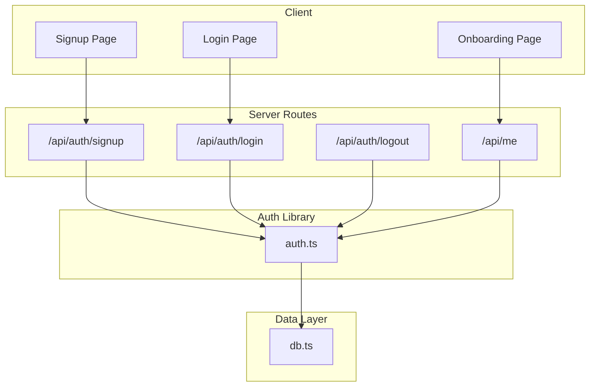

**Diagram sources**
- [signup route.ts:1-36](file://stepwise ai/app/app/api/auth/signup/route.ts#L1-L36)
- [login route.ts:1-30](file://stepwise ai/app/app/api/auth/login/route.ts#L1-L30)
- [logout route.ts:1-12](file://stepwise ai/app/app/api/auth/logout/route.ts#L1-L12)
- [me route.ts:1-79](file://stepwise ai/app/app/api/me/route.ts#L1-L79)
- [auth.ts:1-139](file://stepwise ai/app/lib/auth.ts#L1-L139)
- [db.ts:1-224](file://stepwise ai/app/lib/db.ts#L1-L224)

**Section sources**
- [signup route.ts:1-36](file://stepwise ai/app/app/api/auth/signup/route.ts#L1-L36)
- [login route.ts:1-30](file://stepwise ai/app/app/api/auth/login/route.ts#L1-L30)
- [logout route.ts:1-12](file://stepwise ai/app/app/api/auth/logout/route.ts#L1-L12)
- [me route.ts:1-79](file://stepwise ai/app/app/api/me/route.ts#L1-L79)
- [auth.ts:1-139](file://stepwise ai/app/lib/auth.ts#L1-L139)
- [db.ts:1-224](file://stepwise ai/app/lib/db.ts#L1-L224)

## Core Components
- Password hashing and verification: Uses Node.js crypto scrypt with random salt and constant-time comparison to prevent timing attacks.
- Session management: Creates signed session tokens stored server-side; sets httpOnly cookies with appropriate flags.
- Route protection: Reads and validates session cookies to identify authenticated users; returns unauthorized responses when missing or invalid.
- User model and profile: Users store email and hashed password; profiles store learning preferences and onboarding status.
- Client integration: Standardized API envelope and helper functions for consistent error handling and request/response processing.

**Section sources**
- [auth.ts:24-40](file://stepwise ai/app/lib/auth.ts#L24-L40)
- [auth.ts:46-71](file://stepwise ai/app/lib/auth.ts#L46-L71)
- [auth.ts:78-102](file://stepwise ai/app/lib/auth.ts#L78-L102)
- [auth.ts:104-136](file://stepwise ai/app/lib/auth.ts#L104-L136)
- [db.ts:23-44](file://stepwise ai/app/lib/db.ts#L23-L44)
- [apiHelpers.ts:8-30](file://stepwise ai/app/lib/apiHelpers.ts#L8-L30)
- [client.ts:7-27](file://stepwise ai/app/lib/client.ts#L7-L27)

## Architecture Overview
The authentication architecture follows a clear separation of concerns:
- Client pages submit credentials to server routes.
- Server routes validate input, call the auth library for hashing and session operations, and interact with the database layer.
- The auth library manages secure password hashing, session token generation/signing, and cookie lifecycle.
- Protected routes enforce authentication by validating the session cookie and returning appropriate responses.

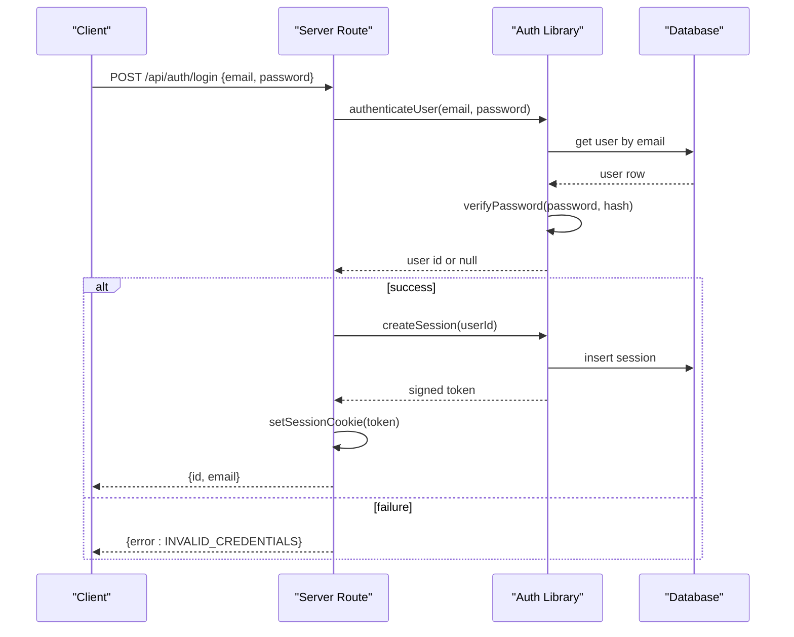

**Diagram sources**
- [login route.ts:7-29](file://stepwise ai/app/app/api/auth/login/route.ts#L7-L29)
- [auth.ts:130-136](file://stepwise ai/app/lib/auth.ts#L130-L136)
- [auth.ts:46-51](file://stepwise ai/app/lib/auth.ts#L46-L51)
- [auth.ts:59-67](file://stepwise ai/app/lib/auth.ts#L59-L67)
- [db.ts:141-159](file://stepwise ai/app/lib/db.ts#L141-L159)

## Detailed Component Analysis

### Password Hashing and Verification
- Hashing uses scrypt with a random 16-byte salt and produces a prefixed string format for storage.
- Verification parses stored hashes, recomputes the candidate hash, and compares using constant-time equality to mitigate timing attacks.
- Errors during parsing/computation are handled gracefully to avoid leaking information.

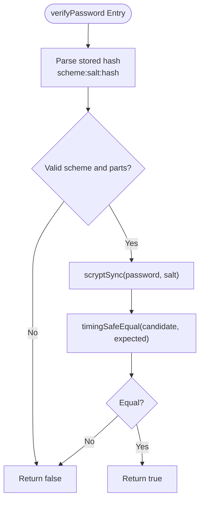

**Diagram sources**
- [auth.ts:30-40](file://stepwise ai/app/lib/auth.ts#L30-L40)

**Section sources**
- [auth.ts:24-40](file://stepwise ai/app/lib/auth.ts#L24-L40)

### Session Management
- Sessions are created by generating a random token, persisting it with user_id and expiry, and returning a signed value combining token and HMAC signature.
- Cookies are set with httpOnly, sameSite lax, secure flag in production, path root, and maxAge for long-lived sessions.
- Logout destroys the server-side session record and clears the cookie.

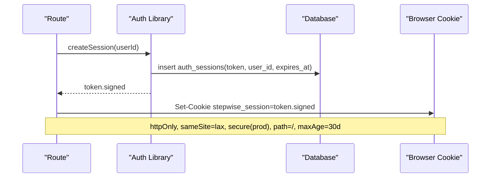

**Diagram sources**
- [auth.ts:46-67](file://stepwise ai/app/lib/auth.ts#L46-L67)
- [logout route.ts:7-11](file://stepwise ai/app/app/api/auth/logout/route.ts#L7-L11)

**Section sources**
- [auth.ts:46-71](file://stepwise ai/app/lib/auth.ts#L46-L71)
- [logout route.ts:1-12](file://stepwise ai/app/app/api/auth/logout/route.ts#L1-L12)

### Current User Resolution and Route Protection
- getCurrentUser reads the session cookie, verifies the signature using the same secret, checks the session exists and is not expired, then resolves the user object.
- Protected routes use this function to ensure only authenticated users can access resources; otherwise, they return an unauthorized response.

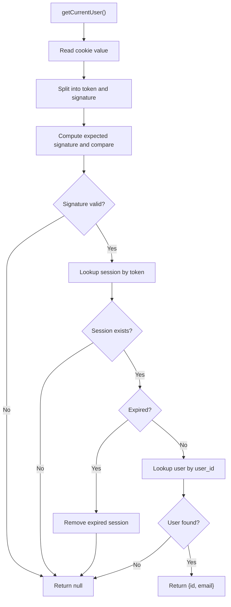

**Diagram sources**
- [auth.ts:78-102](file://stepwise ai/app/lib/auth.ts#L78-L102)

**Section sources**
- [auth.ts:78-102](file://stepwise ai/app/lib/auth.ts#L78-L102)
- [me route.ts:20-33](file://stepwise ai/app/app/api/me/route.ts#L20-L33)

### Registration Flow
- Validates email format and minimum password length.
- Checks for existing user by email.
- Registers user with hashed password and creates default profile fields within a transaction.
- Creates a session and sets the cookie; returns minimal user info.

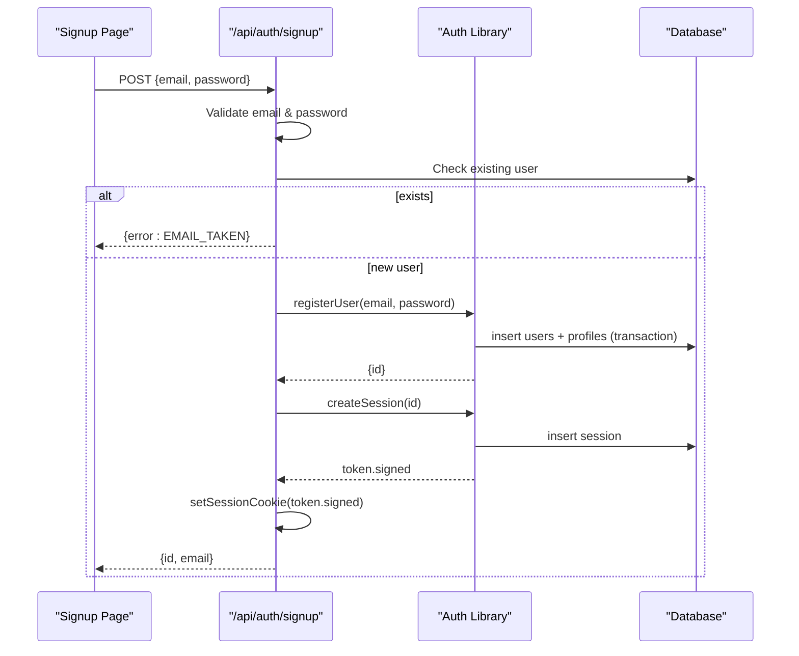

**Diagram sources**
- [signup route.ts:10-35](file://stepwise ai/app/app/api/auth/signup/route.ts#L10-L35)
- [auth.ts:104-128](file://stepwise ai/app/lib/auth.ts#L104-L128)
- [auth.ts:46-67](file://stepwise ai/app/lib/auth.ts#L46-L67)

**Section sources**
- [signup route.ts:1-36](file://stepwise ai/app/app/api/auth/signup/route.ts#L1-L36)
- [auth.ts:104-128](file://stepwise ai/app/lib/auth.ts#L104-L128)

### Login Flow
- Validates presence of credentials.
- Authenticates user and updates last login timestamp.
- Creates session and sets cookie; returns minimal user info.

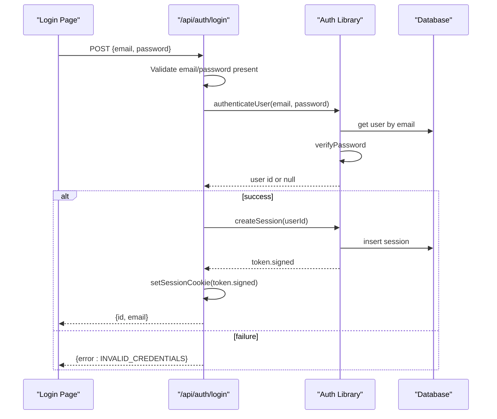

**Diagram sources**
- [login route.ts:7-29](file://stepwise ai/app/app/api/auth/login/route.ts#L7-L29)
- [auth.ts:130-136](file://stepwise ai/app/lib/auth.ts#L130-L136)
- [auth.ts:46-67](file://stepwise ai/app/lib/auth.ts#L46-L67)

**Section sources**
- [login route.ts:1-30](file://stepwise ai/app/app/api/auth/login/route.ts#L1-L30)
- [auth.ts:130-136](file://stepwise ai/app/lib/auth.ts#L130-L136)

### Logout Flow
- Destroys the current session record and clears the session cookie.

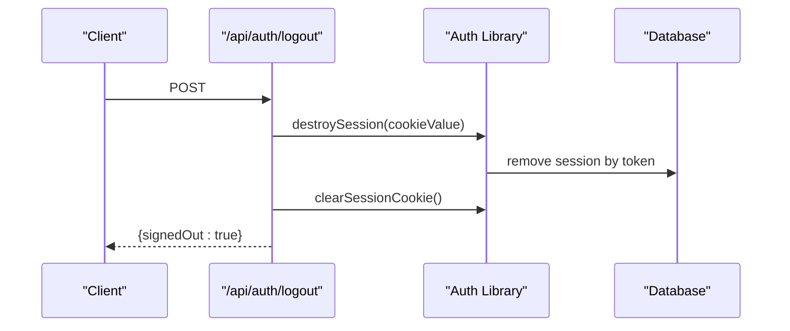

**Diagram sources**
- [logout route.ts:7-11](file://stepwise ai/app/app/api/auth/logout/route.ts#L7-L11)
- [auth.ts:53-71](file://stepwise ai/app/lib/auth.ts#L53-L71)

**Section sources**
- [logout route.ts:1-12](file://stepwise ai/app/app/api/auth/logout/route.ts#L1-L12)
- [auth.ts:53-71](file://stepwise ai/app/lib/auth.ts#L53-L71)

### Profile Completion and Onboarding
- On first login or after signup, users complete their profile via /api/me PATCH.
- The onboarding page fetches current profile via GET /api/me to prefill values and redirects to login if unauthenticated.
- Updates include display name, age band, education level, explanation depth, autonomy level, theme, and onboarded flag.

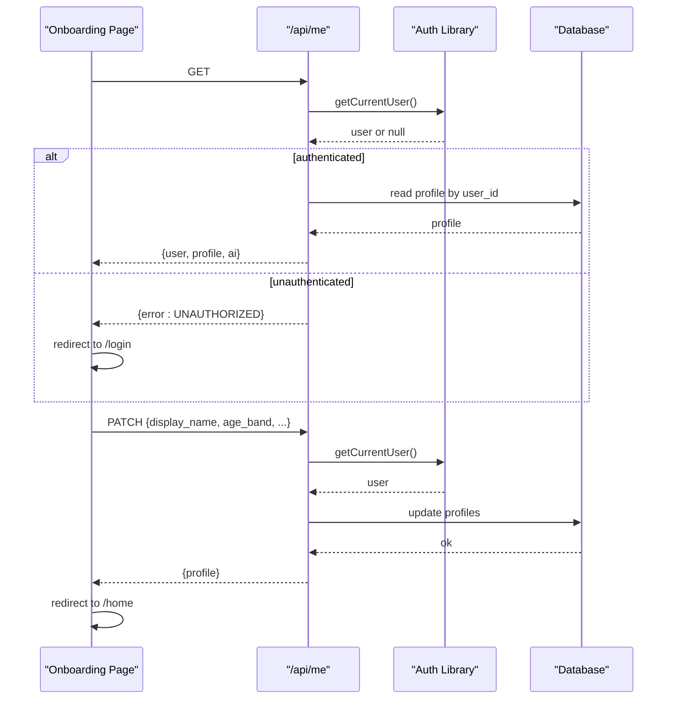

**Diagram sources**
- [onboarding page.tsx:21-59](file://stepwise ai/app/app/onboarding/page.tsx#L21-L59)
- [me route.ts:20-79](file://stepwise ai/app/app/api/me/route.ts#L20-L79)

**Section sources**
- [onboarding page.tsx:1-140](file://stepwise ai/app/app/onboarding/page.tsx#L1-L140)
- [me route.ts:1-79](file://stepwise ai/app/app/api/me/route.ts#L1-L79)

### Data Model
- Users: id, email, password_hash, created_at, last_login_at.
- Profiles: user_id, display_name, age_band, education_level, preferred_language, explanation_depth, autonomy_level, learning_mode, theme, onboarded, timestamps.
- Auth sessions: token, user_id, expires_at, created_at.

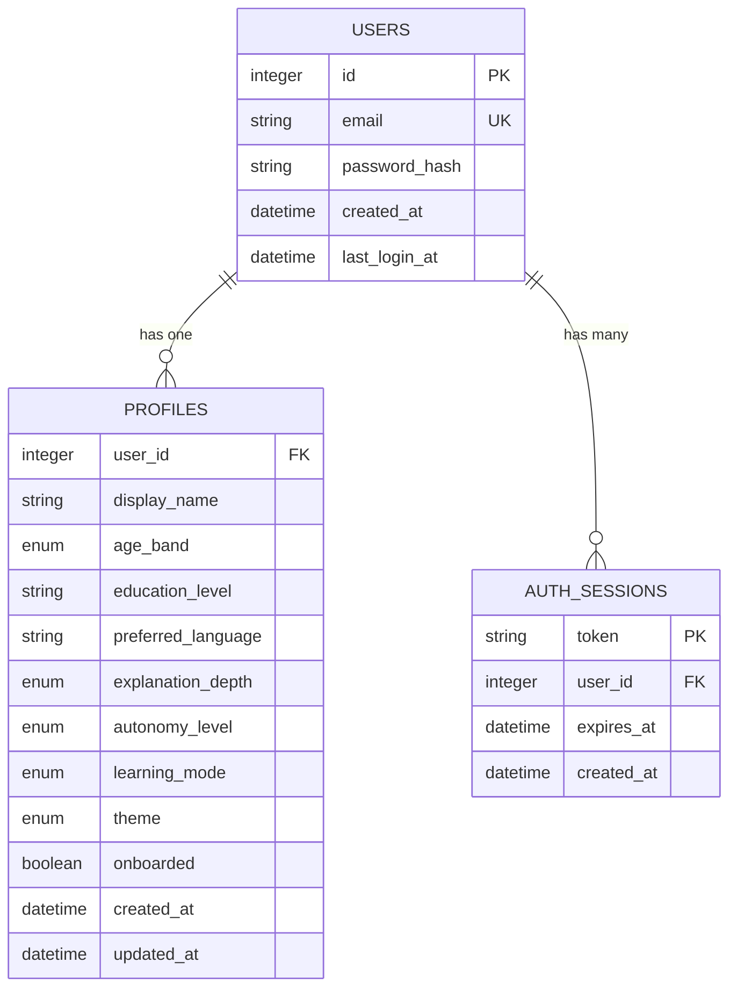

**Diagram sources**
- [db.ts:23-44](file://stepwise ai/app/lib/db.ts#L23-L44)
- [auth.ts:104-128](file://stepwise ai/app/lib/auth.ts#L104-L128)

**Section sources**
- [db.ts:23-44](file://stepwise ai/app/lib/db.ts#L23-L44)
- [auth.ts:104-128](file://stepwise ai/app/lib/auth.ts#L104-L128)

## Dependency Analysis
- Routes depend on the auth library for cryptographic operations and session handling.
- The auth library depends on the database layer for persistence and on Next.js headers for cookie management.
- Client pages depend on the client helper for standardized API calls and error handling.

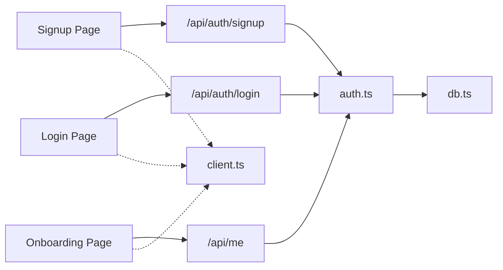

**Diagram sources**
- [signup route.ts:1-36](file://stepwise ai/app/app/api/auth/signup/route.ts#L1-L36)
- [login route.ts:1-30](file://stepwise ai/app/app/api/auth/login/route.ts#L1-L30)
- [me route.ts:1-79](file://stepwise ai/app/app/api/me/route.ts#L1-L79)
- [auth.ts:1-139](file://stepwise ai/app/lib/auth.ts#L1-L139)
- [db.ts:1-224](file://stepwise ai/app/lib/db.ts#L1-L224)
- [client.ts:1-28](file://stepwise ai/app/lib/client.ts#L1-L28)

**Section sources**
- [signup route.ts:1-36](file://stepwise ai/app/app/api/auth/signup/route.ts#L1-L36)
- [login route.ts:1-30](file://stepwise ai/app/app/api/auth/login/route.ts#L1-L30)
- [me route.ts:1-79](file://stepwise ai/app/app/api/me/route.ts#L1-L79)
- [auth.ts:1-139](file://stepwise ai/app/lib/auth.ts#L1-L139)
- [db.ts:1-224](file://stepwise ai/app/lib/db.ts#L1-L224)
- [client.ts:1-28](file://stepwise ai/app/lib/client.ts#L1-L28)

## Performance Considerations
- Password hashing uses scrypt with moderate parameters; consider tuning cost factors based on deployment environment to balance security and latency.
- Database writes are synchronous and atomic per operation; under high concurrency, consider migrating to a relational database with connection pooling.
- Session lookup occurs on every protected request; caching session metadata at the edge may reduce load but must preserve security guarantees.

[No sources needed since this section provides general guidance]

## Troubleshooting Guide
- Invalid credentials: Ensure email normalization and password validation match server expectations; check that hashing scheme matches stored format.
- Unauthorized responses: Confirm session cookie is present, correctly signed, and not expired; verify AUTH_SECRET configuration in production.
- Signup failures: Validate email format and uniqueness; ensure database tables exist and transactions commit successfully.
- Onboarding issues: Confirm /api/me GET returns profile data; handle redirects to login when unauthenticated.

**Section sources**
- [login route.ts:7-29](file://stepwise ai/app/app/api/auth/login/route.ts#L7-L29)
- [signup route.ts:10-35](file://stepwise ai/app/app/api/auth/signup/route.ts#L10-L35)
- [me route.ts:20-33](file://stepwise ai/app/app/api/me/route.ts#L20-L33)
- [apiHelpers.ts:12-30](file://stepwise ai/app/lib/apiHelpers.ts#L12-L30)

## Conclusion
StepWise AI’s authentication system implements secure registration, login, and logout flows using cookie-based sessions and robust password hashing. Route protection relies on validated session cookies and server-side session records. The design emphasizes safety (constant-time comparisons, httpOnly cookies, strict input validation), clarity (consistent API envelopes), and extensibility (database abstraction). For production, ensure strong secrets, proper cookie flags, and consider scaling the database layer while preserving these security properties.

[No sources needed since this section summarizes without analyzing specific files]

## Appendices

### Implementing Protected Routes
- Use the current user resolution function to guard routes; return unauthorized responses when no valid session is present.
- Example pattern: call the current user resolver at the start of a route handler and branch based on result.

**Section sources**
- [auth.ts:78-102](file://stepwise ai/app/lib/auth.ts#L78-L102)
- [me route.ts:20-33](file://stepwise ai/app/app/api/me/route.ts#L20-L33)

### Accessing User Context in React Components
- Fetch current user/profile via the user endpoint and handle errors by redirecting to login.
- Preload profile data on onboarding to populate forms and guide next steps.

**Section sources**
- [onboarding page.tsx:21-36](file://stepwise ai/app/app/onboarding/page.tsx#L21-L36)
- [client.ts:7-27](file://stepwise ai/app/lib/client.ts#L7-L27)

### Handling Authentication State
- After successful login/signup, rely on the server-set cookie; navigate to appropriate pages.
- On logout, call the logout endpoint and clear local UI state accordingly.

**Section sources**
- [login page.tsx:16-27](file://stepwise ai/app/app/login/page.tsx#L16-L27)
- [signup page.tsx:17-32](file://stepwise ai/app/app/signup/page.tsx#L17-L32)
- [logout route.ts:7-11](file://stepwise ai/app/app/api/auth/logout/route.ts#L7-L11)

### Security Best Practices and Production Deployment
- Enforce a strong, random AUTH_SECRET; fail safely in production if missing.
- Ensure cookies are httpOnly, sameSite lax, and secure in production environments.
- Validate all inputs on the server side and normalize emails to lowercase.
- Avoid leaking sensitive information in error messages; use generic messages for failures.

**Section sources**
- [auth.ts:12-22](file://stepwise ai/app/lib/auth.ts#L12-L22)
- [auth.ts:59-67](file://stepwise ai/app/lib/auth.ts#L59-L67)
- [signup route.ts:10-21](file://stepwise ai/app/app/api/auth/signup/route.ts#L10-L21)
- [apiHelpers.ts:12-30](file://stepwise ai/app/lib/apiHelpers.ts#L12-L30)