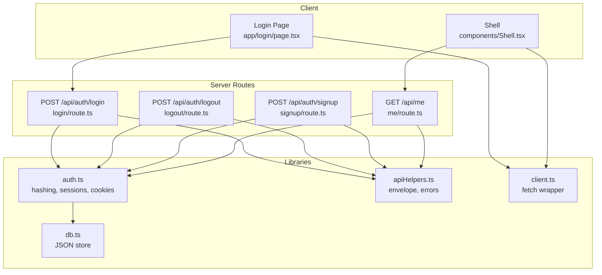
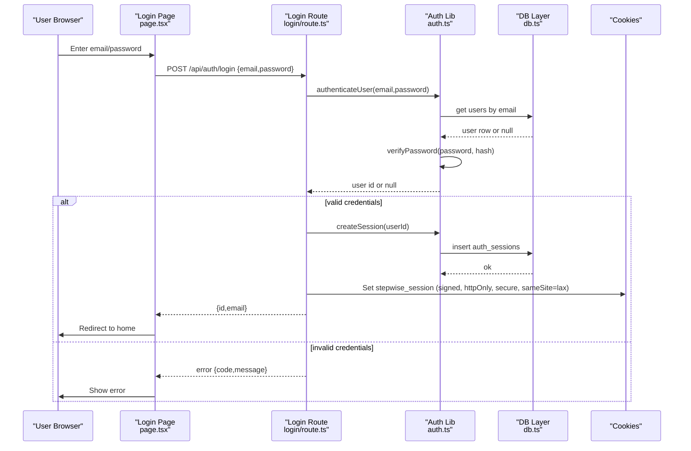
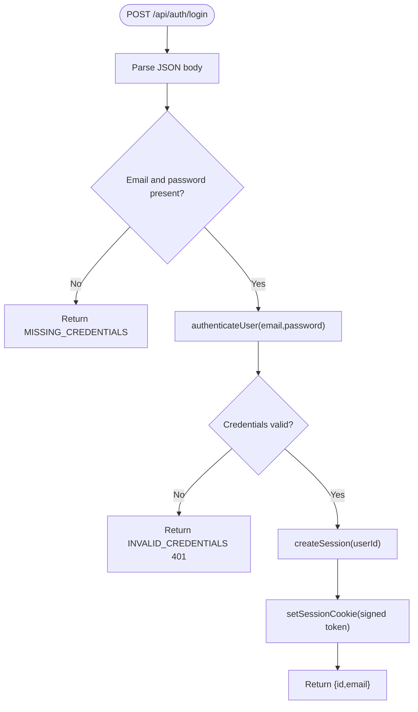
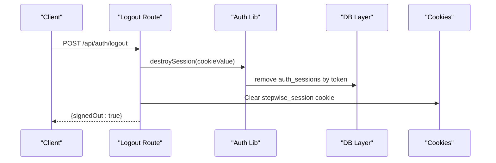
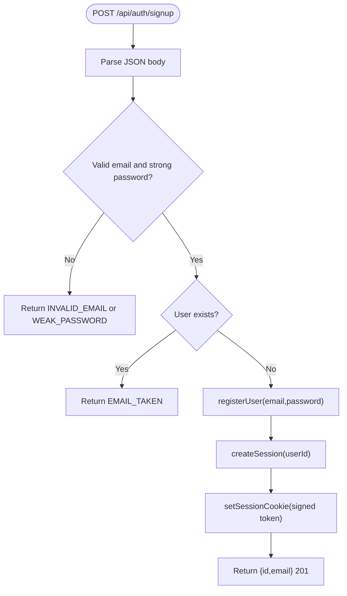
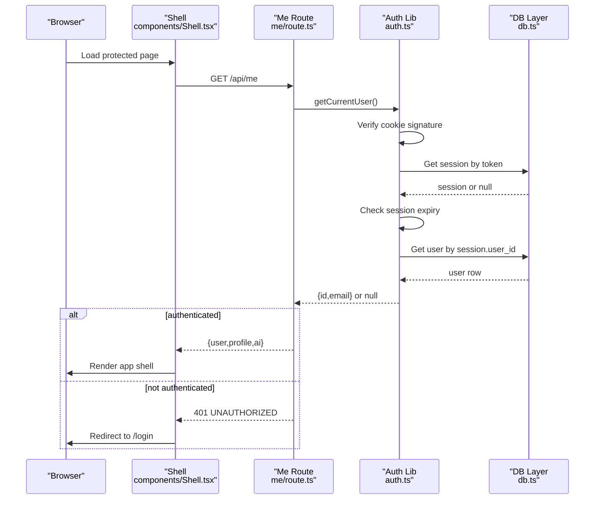
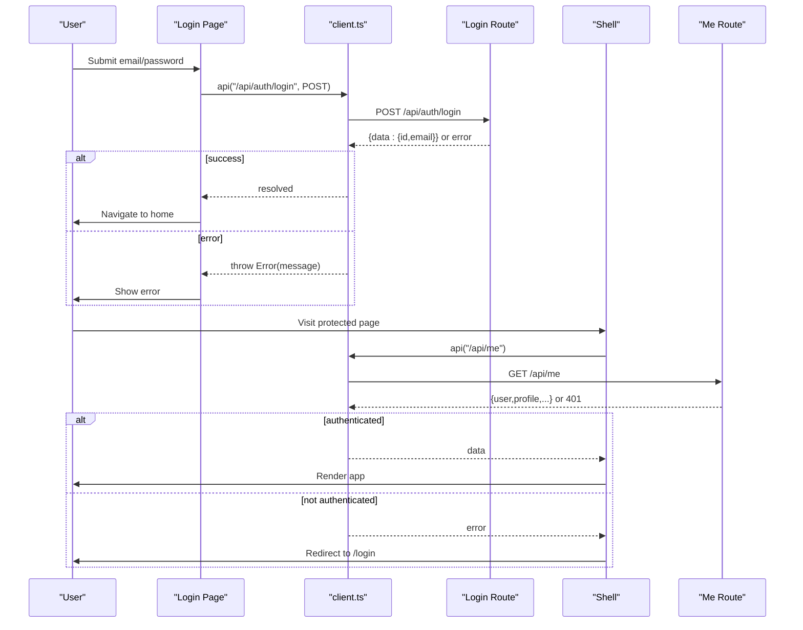
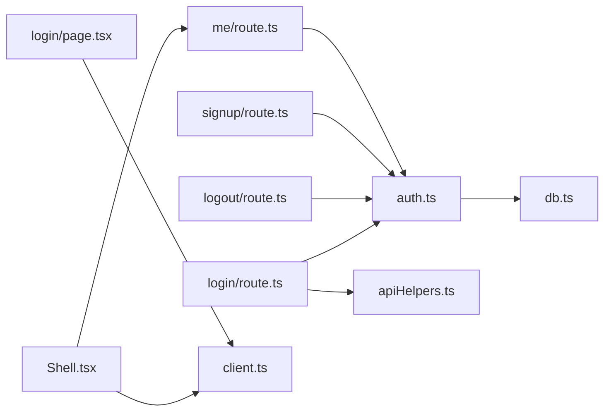

# Login & Authentication

<cite>
**Referenced Files in This Document**
- [route.ts](file://stepwise ai/app/app/api/auth/login/route.ts)
- [route.ts](file://stepwise ai/app/app/api/logout/route.ts)
- [route.ts](file://stepwise ai/app/app/api/auth/signup/route.ts)
- [auth.ts](file://stepwise ai/app/lib/auth.ts)
- [db.ts](file://stepwise ai/app/lib/db.ts)
- [apiHelpers.ts](file://stepwise ai/app/lib/apiHelpers.ts)
- [client.ts](file://stepwise ai/app/lib/client.ts)
- [page.tsx](file://stepwise ai/app/app/login/page.tsx)
- [Shell.tsx](file://stepwise ai/app/components/Shell.tsx)
- [route.ts](file://stepwise ai/app/app/api/me/route.ts)
</cite>

## Table of Contents
1. Introduction
2. Project Structure
3. Core Components
4. Architecture Overview
5. Detailed Component Analysis
6. Dependency Analysis
7. Performance Considerations
8. Troubleshooting Guide
9. Conclusion

## Introduction
This document explains StepWise AI’s login and authentication system, focusing on the server-side API endpoints for credential verification, session creation, cookie management, and protected route enforcement. It also covers client-side usage in React components to access authenticated user context and handle authentication state changes. The implementation uses secure password hashing, signed session cookies with expiration, and a simple embedded database layer for persistence.

## Project Structure
The authentication system spans Next.js Route Handlers (server), shared library modules, and React components:
- Server routes: login, logout, signup, and me endpoints
- Shared auth logic: password hashing, session token generation, cookie handling, current user resolution
- Database abstraction: JSON-backed store with transaction support
- Client helpers: standardized API envelope and fetch wrapper
- UI: login page and shell that enforces authentication for protected routes

**Diagram sources**
- [route.ts:7-29](file://stepwise ai/app/app/api/auth/login/route.ts#L7-L29)
- [route.ts:7-11](file://stepwise ai/app/app/api/logout/route.ts#L7-L11)
- [route.ts:10-35](file://stepwise ai/app/app/api/auth/signup/route.ts#L10-L35)
- [route.ts:20-33](file://stepwise ai/app/app/api/me/route.ts#L20-L33)
- [auth.ts:24-102](file://stepwise ai/app/lib/auth.ts#L24-L102)
- [apiHelpers.ts:8-30](file://stepwise ai/app/lib/apiHelpers.ts#L8-L30)
- [client.ts:7-27](file://stepwise ai/app/lib/client.ts#L7-L27)
- [db.ts:123-199](file://stepwise ai/app/lib/db.ts#L123-L199)
- [page.tsx:16-27](file://stepwise ai/app/app/login/page.tsx#L16-L27)
- [Shell.tsx:38-52](file://stepwise ai/app/components/Shell.tsx#L38-L52)

**Section sources**
- [route.ts:7-29](file://stepwise ai/app/app/api/auth/login/route.ts#L7-L29)
- [route.ts:7-11](file://stepwise ai/app/app/api/logout/route.ts#L7-L11)
- [route.ts:10-35](file://stepwise ai/app/app/api/auth/signup/route.ts#L10-L35)
- [route.ts:20-33](file://stepwise ai/app/app/api/me/route.ts#L20-L33)
- [auth.ts:24-102](file://stepwise ai/app/lib/auth.ts#L24-L102)
- [db.ts:123-199](file://stepwise ai/app/lib/db.ts#L123-L199)
- [apiHelpers.ts:8-30](file://stepwise ai/app/lib/apiHelpers.ts#L8-L30)
- [client.ts:7-27](file://stepwise ai/app/lib/client.ts#L7-L27)
- [page.tsx:16-27](file://stepwise ai/app/app/login/page.tsx#L16-L27)
- [Shell.tsx:38-52](file://stepwise ai/app/components/Shell.tsx#L38-L52)

## Core Components
- Password hashing and verification: scrypt-based hashing with random salt and constant-time comparison to prevent timing attacks.
- Session tokens: cryptographically random tokens stored in the database with an expiration timestamp; signed with HMAC using a secret from environment variables.
- Cookie management: httpOnly, sameSite lax, secure flag in production, path set to root, maxAge aligned with session duration.
- Current user resolution: validates cookie signature, checks session existence and expiry, then resolves user identity.
- Protected route enforcement: server-side check via getCurrentUser; client-side protection via Shell component calling /api/me.

**Section sources**
- [auth.ts:24-40](file://stepwise ai/app/lib/auth.ts#L24-L40)
- [auth.ts:42-67](file://stepwise ai/app/lib/auth.ts#L42-L67)
- [auth.ts:78-102](file://stepwise ai/app/lib/auth.ts#L78-L102)
- [route.ts:7-29](file://stepwise ai/app/app/api/auth/login/route.ts#L7-L29)
- [route.ts:20-33](file://stepwise ai/app/app/api/me/route.ts#L20-L33)

## Architecture Overview
The authentication flow uses a combination of server-side validation, secure storage, and signed cookies. Clients authenticate by posting credentials to the login endpoint, which returns a success response and sets a signed session cookie. Subsequent requests automatically include the cookie, enabling server-side identification of the current user.

**Diagram sources**
- [page.tsx:16-27](file://stepwise ai/app/app/login/page.tsx#L16-L27)
- [route.ts:7-29](file://stepwise ai/app/app/api/auth/login/route.ts#L7-L29)
- [auth.ts:130-136](file://stepwise ai/app/lib/auth.ts#L130-L136)
- [auth.ts:46-51](file://stepwise ai/app/lib/auth.ts#L46-L51)
- [auth.ts:59-67](file://stepwise ai/app/lib/auth.ts#L59-L67)
- [db.ts:141-159](file://stepwise ai/app/lib/db.ts#L141-L159)

## Detailed Component Analysis

### Login Endpoint (/api/auth/login)
- Accepts JSON body with email and password.
- Normalizes and validates inputs using safe helpers.
- Authenticates via the auth library; returns consistent error messages regardless of whether the email exists.
- On success, creates a session, sets a signed cookie, and returns minimal user data.

**Diagram sources**
- [route.ts:7-29](file://stepwise ai/app/app/api/auth/login/route.ts#L7-L29)
- [auth.ts:130-136](file://stepwise ai/app/lib/auth.ts#L130-L136)
- [auth.ts:46-51](file://stepwise ai/app/lib/auth.ts#L46-L51)
- [auth.ts:59-67](file://stepwise ai/app/lib/auth.ts#L59-L67)

**Section sources**
- [route.ts:7-29](file://stepwise ai/app/app/api/auth/login/route.ts#L7-L29)
- [apiHelpers.ts:8-30](file://stepwise ai/app/lib/apiHelpers.ts#L8-L30)

### Logout Endpoint (/api/auth/logout)
- Destroys the active session in the database and clears the session cookie.
- Returns a success envelope indicating signed out state.

**Diagram sources**
- [route.ts:7-11](file://stepwise ai/app/app/api/logout/route.ts#L7-L11)
- [auth.ts:53-57](file://stepwise ai/app/lib/auth.ts#L53-L57)
- [auth.ts:69-71](file://stepwise ai/app/lib/auth.ts#L69-L71)

**Section sources**
- [route.ts:7-11](file://stepwise ai/app/app/api/logout/route.ts#L7-L11)
- [auth.ts:53-71](file://stepwise ai/app/lib/auth.ts#L53-L71)

### Signup Endpoint (/api/auth/signup)
- Validates email format and password strength.
- Prevents duplicate accounts.
- Registers user, creates session, sets cookie, and returns created user info.

**Diagram sources**
- [route.ts:10-35](file://stepwise ai/app/app/api/auth/signup/route.ts#L10-L35)
- [auth.ts:104-128](file://stepwise ai/app/lib/auth.ts#L104-L128)
- [auth.ts:46-51](file://stepwise ai/app/lib/auth.ts#L46-L51)
- [auth.ts:59-67](file://stepwise ai/app/lib/auth.ts#L59-L67)

**Section sources**
- [route.ts:10-35](file://stepwise ai/app/app/api/auth/signup/route.ts#L10-L35)
- [auth.ts:104-128](file://stepwise ai/app/lib/auth.ts#L104-L128)

### Current User Resolution (/api/me)
- Verifies the session cookie and returns user profile and preferences if authenticated.
- Used by the Shell component to gate protected pages and apply theme settings.

**Diagram sources**
- [route.ts:20-33](file://stepwise ai/app/app/api/me/route.ts#L20-L33)
- [auth.ts:78-102](file://stepwise ai/app/lib/auth.ts#L78-L102)
- [Shell.tsx:38-52](file://stepwise ai/app/components/Shell.tsx#L38-L52)

**Section sources**
- [route.ts:20-33](file://stepwise ai/app/app/api/me/route.ts#L20-L33)
- [auth.ts:78-102](file://stepwise ai/app/lib/auth.ts#L78-L102)
- [Shell.tsx:38-52](file://stepwise ai/app/components/Shell.tsx#L38-L52)

### Client-Side Usage and State Handling
- Login page posts credentials to the login endpoint and handles success/failure states.
- The client helper wraps fetch calls and throws errors based on the server envelope.
- The Shell component calls /api/me to validate sessions and redirect unauthenticated users.

**Diagram sources**
- [page.tsx:16-27](file://stepwise ai/app/app/login/page.tsx#L16-L27)
- [client.ts:7-27](file://stepwise ai/app/lib/client.ts#L7-L27)
- [route.ts:7-29](file://stepwise ai/app/app/api/auth/login/route.ts#L7-L29)
- [Shell.tsx:38-52](file://stepwise ai/app/components/Shell.tsx#L38-L52)
- [route.ts:20-33](file://stepwise ai/app/app/api/me/route.ts#L20-L33)

**Section sources**
- [page.tsx:16-27](file://stepwise ai/app/app/login/page.tsx#L16-L27)
- [client.ts:7-27](file://stepwise ai/app/lib/client.ts#L7-L27)
- [Shell.tsx:38-52](file://stepwise ai/app/components/Shell.tsx#L38-L52)

## Dependency Analysis
- Login route depends on auth library for authentication and session creation, and apiHelpers for consistent responses.
- Auth library depends on crypto utilities, Next.js cookies, and the db layer for persistence.
- Shell depends on client helper to call /api/me and enforce authentication at the UI level.
- Database layer provides atomic transactions and table operations used across auth flows.

**Diagram sources**
- [route.ts:7-29](file://stepwise ai/app/app/api/auth/login/route.ts#L7-L29)
- [route.ts:7-11](file://stepwise ai/app/app/api/logout/route.ts#L7-L11)
- [route.ts:10-35](file://stepwise ai/app/app/api/auth/signup/route.ts#L10-L35)
- [route.ts:20-33](file://stepwise ai/app/app/api/me/route.ts#L20-L33)
- [auth.ts:24-102](file://stepwise ai/app/lib/auth.ts#L24-L102)
- [db.ts:123-199](file://stepwise ai/app/lib/db.ts#L123-L199)
- [Shell.tsx:38-52](file://stepwise ai/app/components/Shell.tsx#L38-L52)
- [client.ts:7-27](file://stepwise ai/app/lib/client.ts#L7-L27)
- [page.tsx:16-27](file://stepwise ai/app/app/login/page.tsx#L16-L27)

**Section sources**
- [route.ts:7-29](file://stepwise ai/app/app/api/auth/login/route.ts#L7-L29)
- [auth.ts:24-102](file://stepwise ai/app/lib/auth.ts#L24-L102)
- [db.ts:123-199](file://stepwise ai/app/lib/db.ts#L123-L199)
- [Shell.tsx:38-52](file://stepwise ai/app/components/Shell.tsx#L38-L52)
- [client.ts:7-27](file://stepwise ai/app/lib/client.ts#L7-L27)

## Performance Considerations
- Password hashing uses scrypt with a fixed cost parameter; consider tuning parameters for your deployment environment to balance security and latency.
- Session lookup is O(1) per request after cookie parsing; ensure the database file remains small and accessible.
- Cookies are httpOnly and signed, minimizing client-side overhead and preventing XSS-based theft.
- Use short-lived sessions and frequent re-authentication for sensitive actions if needed.

[No sources needed since this section provides general guidance]

## Troubleshooting Guide
Common error scenarios and how they are handled:
- Missing credentials: Login endpoint returns a specific code when email or password is absent.
- Invalid credentials: Consistent error message is returned without revealing whether the email exists.
- Account lockout: Not implemented in the current codebase; no account lockout mechanism is present.
- Session timeout: Sessions have an expiration timestamp; expired sessions are removed and treated as unauthenticated.
- Unauthenticated access: Protected routes return unauthorized; client redirects to login.

Recommended debugging steps:
- Verify AUTH_SECRET is set in production; missing or default values cause failures.
- Ensure cookies are enabled and sameSite policy allows cross-site navigation if applicable.
- Check network responses for the standard envelope and error codes.
- Inspect database tables for session rows and their expiration times.

**Section sources**
- [route.ts:7-29](file://stepwise ai/app/app/api/auth/login/route.ts#L7-L29)
- [auth.ts:12-22](file://stepwise ai/app/lib/auth.ts#L12-L22)
- [auth.ts:78-102](file://stepwise ai/app/lib/auth.ts#L78-L102)
- [route.ts:20-33](file://stepwise ai/app/app/api/me/route.ts#L20-L33)

## Conclusion
StepWise AI’s authentication system combines secure password hashing, signed session cookies, and server-side session validation to protect routes and manage user state. The login flow normalizes inputs, verifies credentials, and establishes a session cookie. Protected routes rely on cookie-based identification, with client-side guards ensuring only authenticated users can access certain pages. While robust against common threats like XSS and CSRF (via httpOnly and sameSite), additional measures such as rate limiting and explicit CSRF tokens may be considered depending on deployment needs.

[No sources needed since this section summarizes without analyzing specific files]