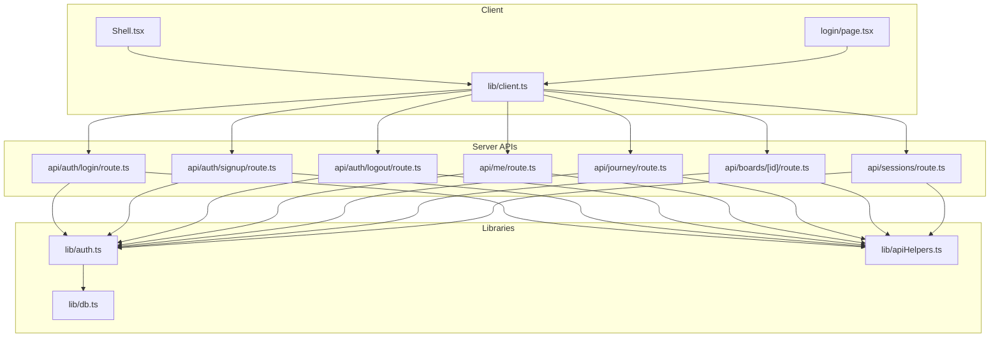
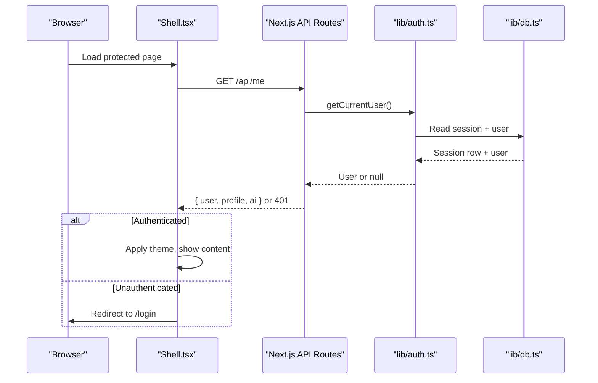
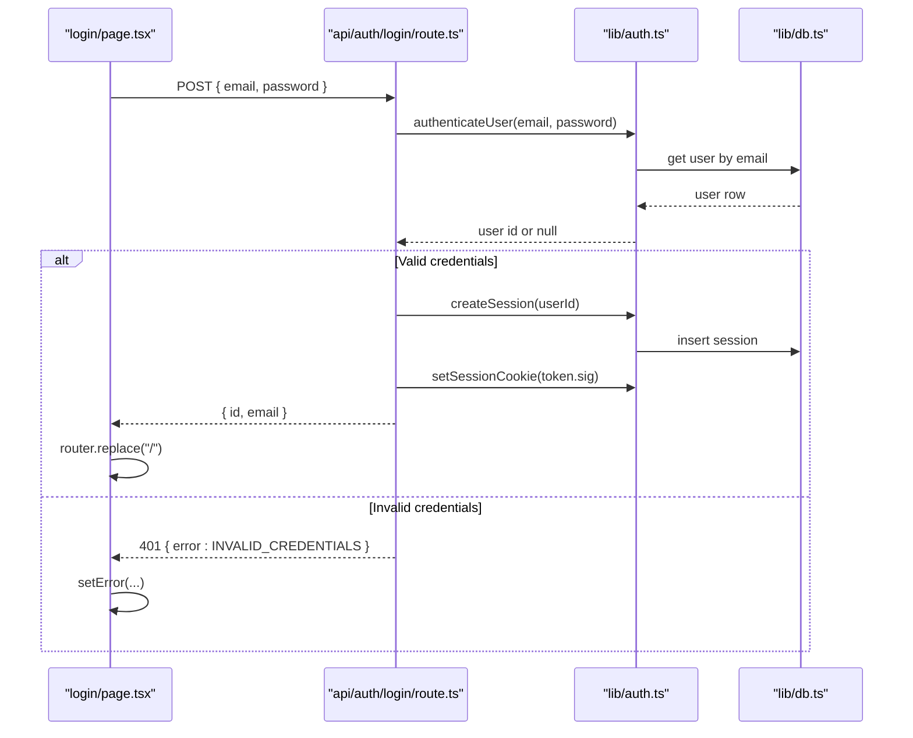
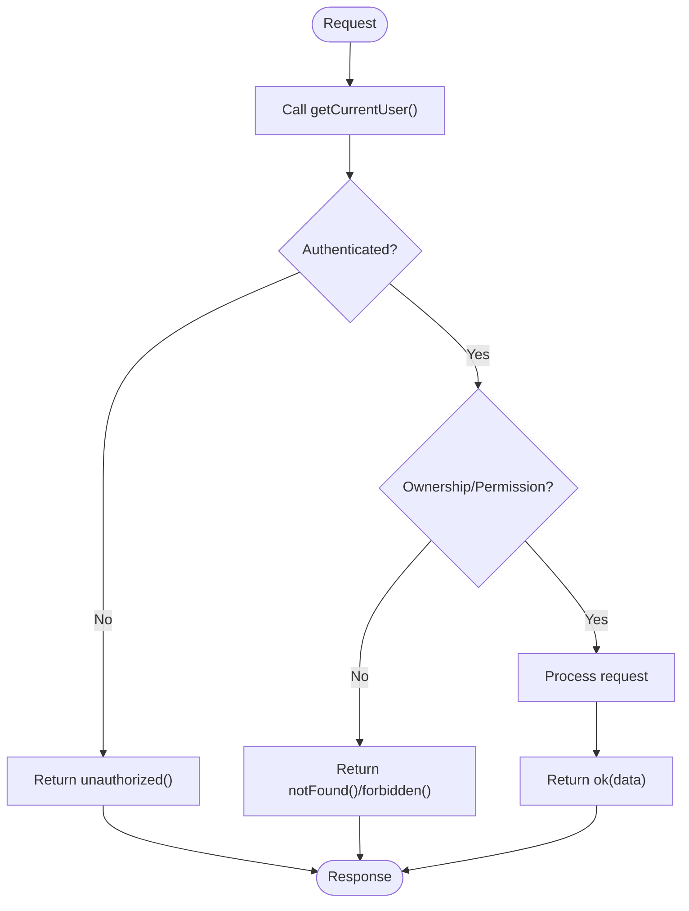
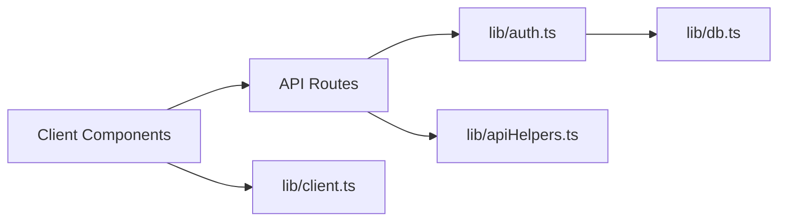

# Route Protection & Authorization

<cite>
**Referenced Files in This Document**
- [auth.ts](file://stepwise ai/app/lib/auth.ts)
- [apiHelpers.ts](file://stepwise ai/app/lib/apiHelpers.ts)
- [client.ts](file://stepwise ai/app/lib/client.ts)
- [db.ts](file://stepwise ai/app/lib/db.ts)
- [login route.ts](file://stepwise ai/app/app/api/auth/login/route.ts)
- [signup route.ts](file://stepwise ai/app/app/api/auth/signup/route.ts)
- [logout route.ts](file://stepwise ai/app/app/api/auth/logout/route.ts)
- [me route.ts](file://stepwise ai/app/app/api/me/route.ts)
- [journey route.ts](file://stepwise ai/app/app/api/journey/route.ts)
- [boards/[id] route.ts](file://stepwise ai/app/app/api/boards/[id]/route.ts)
- [sessions route.ts](file://stepwise ai/app/app/api/sessions/route.ts)
- [Shell.tsx](file://stepwise ai/app/components/Shell.tsx)
- [login page.tsx](file://stepwise ai/app/app/login/page.tsx)
</cite>

## Table of Contents
1. Introduction
2. Project Structure
3. Core Components
4. Architecture Overview
5. Detailed Component Analysis
6. Dependency Analysis
7. Performance Considerations
8. Troubleshooting Guide
9. Conclusion

## Introduction
This document explains how StepWise AI protects routes and enforces authorization across API endpoints and Next.js pages. It covers server-side authentication via signed session cookies, client-side navigation guards, role-based access patterns, and strategies for handling unauthorized access and redirects. The goal is to help developers implement protected API endpoints, secure React components with authentication checks, and manage common authorization scenarios such as admin-only routes, user-scoped data access, and conditional UI rendering based on authentication state.

## Project Structure
The application uses a Next.js App Router structure with:
- Server-side API routes under app/api that enforce authentication and authorization at the endpoint level.
- A shared authentication library (lib/auth) that manages sessions, password hashing, and cookie handling.
- Client-side helpers (lib/client) that unwrap standardized API envelopes and propagate errors.
- A shared authenticated shell component (components/Shell.tsx) that validates sessions on the client and redirects unauthenticated users.

**Diagram sources**
- [Shell.tsx:1-124](file://stepwise ai/app/components/Shell.tsx#L1-L124)
- [login page.tsx:1-76](file://stepwise ai/app/app/login/page.tsx#L1-L76)
- [client.ts:1-28](file://stepwise ai/app/lib/client.ts#L1-L28)
- [login route.ts:1-30](file://stepwise ai/app/app/api/auth/login/route.ts#L1-L30)
- [signup route.ts:1-36](file://stepwise ai/app/app/api/auth/signup/route.ts#L1-L36)
- [logout route.ts:1-12](file://stepwise ai/app/app/api/auth/logout/route.ts#L1-L12)
- [me route.ts:1-79](file://stepwise ai/app/app/api/me/route.ts#L1-L79)
- [journey route.ts:1-17](file://stepwise ai/app/app/api/journey/route.ts#L1-L17)
- [boards/[id] route.ts:1-106](file://stepwise ai/app/app/api/boards/[id]/route.ts#L1-L106)
- [sessions route.ts:1-56](file://stepwise ai/app/app/api/sessions/route.ts#L1-L56)
- [auth.ts:1-139](file://stepwise ai/app/lib/auth.ts#L1-L139)
- [apiHelpers.ts:1-42](file://stepwise ai/app/lib/apiHelpers.ts#L1-L42)
- [db.ts:1-224](file://stepwise ai/app/lib/db.ts#L1-L224)

**Section sources**
- [Shell.tsx:1-124](file://stepwise ai/app/components/Shell.tsx#L1-L124)
- [client.ts:1-28](file://stepwise ai/app/lib/client.ts#L1-L28)
- [auth.ts:1-139](file://stepwise ai/app/lib/auth.ts#L1-L139)
- [apiHelpers.ts:1-42](file://stepwise ai/app/lib/apiHelpers.ts#L1-L42)

## Core Components
- Authentication library (lib/auth): Implements password hashing, session creation/validation, and httpOnly signed session cookies. Provides getCurrentUser to resolve the current authenticated user from the cookie and database.
- API helpers (lib/apiHelpers): Standardizes responses with { data, error } envelopes, provides unauthorized/notFound/serverError helpers, and input sanitization utilities.
- Client helper (lib/client): Wraps fetch calls, enforces credentials: same-origin, unwraps the envelope, and throws consistent errors for client-side handling.
- Authenticated shell (components/Shell.tsx): On mount, calls /api/me to validate the session; if successful, applies theme and shows content; otherwise redirects to login. Also handles logout by calling /api/auth/logout and redirecting.
- Protected API routes: Each route begins by calling getCurrentUser and returns unauthorized() when missing. Some routes additionally enforce ownership or permissions before processing.

Key responsibilities:
- Server-side: Validate identity via signed session cookies and persist sessions in the database. Enforce per-route authorization (ownership, roles).
- Client-side: Guard navigation and render protected UI only after verifying session via /api/me. Handle errors and redirect to login.

**Section sources**
- [auth.ts:1-139](file://stepwise ai/app/lib/auth.ts#L1-L139)
- [apiHelpers.ts:1-42](file://stepwise ai/app/lib/apiHelpers.ts#L1-L42)
- [client.ts:1-28](file://stepwise ai/app/lib/client.ts#L1-L28)
- [Shell.tsx:1-124](file://stepwise ai/app/components/Shell.tsx#L1-L124)

## Architecture Overview
StepWise uses a cookie-based session model with server-side validation and client-side guards:
- Login/Signup create a signed session token stored in an httpOnly cookie.
- Subsequent requests include the cookie automatically due to same-origin settings.
- API routes call getCurrentUser to authenticate; if absent, they return a standardized 401 response.
- Client components use the Shell to verify session early and redirect unauthenticated users.

**Diagram sources**
- [Shell.tsx:38-52](file://stepwise ai/app/components/Shell.tsx#L38-L52)
- [me route.ts:20-33](file://stepwise ai/app/app/api/me/route.ts#L20-L33)
- [auth.ts:78-102](file://stepwise ai/app/lib/auth.ts#L78-L102)
- [db.ts:141-145](file://stepwise ai/app/lib/db.ts#L141-L145)

## Detailed Component Analysis

### Authentication Library (lib/auth.ts)
Responsibilities:
- Password hashing and verification using scrypt with random salts and timing-safe comparison.
- Session lifecycle: create, sign, store, destroy, and set/clear httpOnly cookies.
- Current user resolution: parse cookie, verify signature, validate session expiry, and resolve user.

Security notes:
- Uses httpOnly, sameSite lax, and secure flags in production.
- Fails safely if AUTH_SECRET is missing in production.
- Avoids storing plaintext passwords; stores hashed values.

Complexity:
- Hashing and verification are constant-time where applicable and bounded by password length.
- Session lookup is O(1) per table scan with simple equality filters.

Optimization opportunities:
- Consider caching short-lived session lookups in memory for high-throughput scenarios.
- Add rate limiting around login/signup to mitigate brute-force attempts.

Error handling:
- Returns null for invalid/expired sessions.
- Throws on missing secrets in production to fail fast.

**Section sources**
- [auth.ts:12-22](file://stepwise ai/app/lib/auth.ts#L12-L22)
- [auth.ts:24-40](file://stepwise ai/app/lib/auth.ts#L24-L40)
- [auth.ts:46-71](file://stepwise ai/app/lib/auth.ts#L46-L71)
- [auth.ts:78-102](file://stepwise ai/app/lib/auth.ts#L78-L102)
- [auth.ts:104-136](file://stepwise ai/app/lib/auth.ts#L104-L136)

### API Helpers (lib/apiHelpers.ts)
Responsibilities:
- Standardized response envelope: ok(data), fail(code, message, status), unauthorized(), notFound(), serverError().
- Input sanitization: str(value, fallback, max), int(value, fallback).

Usage pattern:
- Every API route returns one of these helpers to ensure consistent client behavior and safe error messages.

**Section sources**
- [apiHelpers.ts:8-30](file://stepwise ai/app/lib/apiHelpers.ts#L8-L30)
- [apiHelpers.ts:32-41](file://stepwise ai/app/lib/apiHelpers.ts#L32-L41)

### Client Helper (lib/client.ts)
Responsibilities:
- Wraps fetch with credentials: same-origin to send cookies automatically.
- Parses JSON and throws a unified error when res.ok is false or payload.error exists.
- Returns payload.data for successful responses.

Usage pattern:
- Used by login page and Shell to call API endpoints consistently.

**Section sources**
- [client.ts:1-28](file://stepwise ai/app/lib/client.ts#L1-L28)

### Authenticated Shell (components/Shell.tsx)
Responsibilities:
- Validates session by calling /api/me on mount.
- Redirects to /onboarding if user is onboarded=false; otherwise renders protected content.
- Redirects to /login on failure (unauthenticated).
- Applies theme and displays demo banner based on profile and AI provider info.
- Handles logout by calling /api/auth/logout and redirecting to /login.

Navigation guard pattern:
- Client-side guard ensures that even if a user navigates directly to a protected route, the Shell will enforce authentication before rendering.

**Section sources**
- [Shell.tsx:38-52](file://stepwise ai/app/components/Shell.tsx#L38-L52)
- [Shell.tsx:64-70](file://stepwise ai/app/components/Shell.tsx#L64-L70)
- [Shell.tsx:72-79](file://stepwise ai/app/components/Shell.tsx#L72-L79)

### Login Flow (app/api/auth/login/route.ts + app/login/page.tsx)
Flow:
- Client submits email/password via api("/api/auth/login", POST).
- Server validates inputs, authenticates user, creates session, sets cookie, and returns user data.
- Client replaces route to home upon success; shows error on failure.

**Diagram sources**
- [login page.tsx:16-27](file://stepwise ai/app/app/login/page.tsx#L16-L27)
- [login route.ts:7-29](file://stepwise ai/app/app/api/auth/login/route.ts#L7-L29)
- [auth.ts:130-136](file://stepwise ai/app/lib/auth.ts#L130-L136)
- [auth.ts:46-67](file://stepwise ai/app/lib/auth.ts#L46-L67)
- [db.ts:147-159](file://stepwise ai/app/lib/db.ts#L147-L159)

**Section sources**
- [login page.tsx:16-27](file://stepwise ai/app/app/login/page.tsx#L16-L27)
- [login route.ts:7-29](file://stepwise ai/app/app/api/auth/login/route.ts#L7-L29)

### Signup Flow (app/api/auth/signup/route.ts)
Flow:
- Client posts email/password.
- Server validates email format and password strength, checks uniqueness, registers user, creates session, sets cookie, and returns 201 with user data.

Authorization note:
- New users are immediately authenticated via session creation.

**Section sources**
- [signup route.ts:10-35](file://stepwise ai/app/app/api/auth/signup/route.ts#L10-L35)
- [auth.ts:104-127](file://stepwise ai/app/lib/auth.ts#L104-L127)

### Logout Flow (app/api/auth/logout/route.ts)
Flow:
- Client calls POST /api/auth/logout.
- Server destroys session record and clears cookie.
- Client redirects to login.

**Section sources**
- [logout route.ts:7-11](file://stepwise ai/app/app/api/auth/logout/route.ts#L7-L11)
- [Shell.tsx:64-70](file://stepwise ai/app/components/Shell.tsx#L64-L70)

### Protected Endpoints Pattern
All protected endpoints follow a consistent pattern:
- Call getCurrentUser(); if null, return unauthorized().
- For resource-specific routes, enforce ownership or permissions before processing.
- Return standardized responses via apiHelpers.

Examples:
- /api/me: Requires authentication; returns user profile and AI provider info.
- /api/journey: Requires authentication; returns learning journey scoped to user.id.
- /api/sessions: Requires authentication; creates and lists sessions scoped to user.id.
- /api/boards/:id: Requires authentication and ownership check (user_id matches board owner); persists objects and records events.

**Diagram sources**
- [me route.ts:20-33](file://stepwise ai/app/app/api/me/route.ts#L20-L33)
- [journey route.ts:8-16](file://stepwise ai/app/app/api/journey/route.ts#L8-L16)
- [sessions route.ts:11-43](file://stepwise ai/app/app/api/sessions/route.ts#L11-L43)
- [boards/[id] route.ts:24-35](file://stepwise ai/app/app/api/boards/[id]/route.ts#L24-L35)

**Section sources**
- [me route.ts:20-33](file://stepwise ai/app/app/api/me/route.ts#L20-L33)
- [journey route.ts:8-16](file://stepwise ai/app/app/api/journey/route.ts#L8-L16)
- [sessions route.ts:11-43](file://stepwise ai/app/app/api/sessions/route.ts#L11-L43)
- [boards/[id] route.ts:24-35](file://stepwise ai/app/app/api/boards/[id]/route.ts#L24-L35)

### Ownership and Resource-Level Authorization
Pattern:
- After authentication, verify that the requested resource belongs to the current user.
- Example: boards/:id checks ownsBoard(user.id, boardId) before reading/writing.

Implementation details:
- Ownership is enforced by querying the database for a matching user_id alongside the resource id.
- If ownership fails, return notFound() to avoid leaking existence information.

**Section sources**
- [boards/[id] route.ts:24-35](file://stepwise ai/app/app/api/boards/[id]/route.ts#L24-L35)

### Role-Based Access Control (RBAC) Patterns
Current state:
- The codebase does not define explicit roles or permissions tables.
- RBAC can be implemented by adding a role field to users/profiles and checking it in protected routes.

Recommended approach:
- Extend getCurrentUser to include role(s).
- Create a middleware-like function in each route to assert roles (e.g., requireAdmin()).
- Use centralized helpers to keep checks consistent across routes.

[No sources needed since this section proposes future enhancements without analyzing specific files]

### Conditional UI Rendering Based on Authentication State
Patterns:
- Shell component conditionally renders content only after successful /api/me call.
- On failure, redirects to /login.
- On success, applies theme and shows navigation and user info.

Best practices:
- Always treat client-side auth state as ephemeral; re-validate on every protected page load.
- Keep UI minimal until auth is confirmed to avoid flash-of-unauthenticated-content.

**Section sources**
- [Shell.tsx:38-52](file://stepwise ai/app/components/Shell.tsx#L38-L52)
- [Shell.tsx:72-79](file://stepwise ai/app/components/Shell.tsx#L72-L79)

## Dependency Analysis
High-level dependencies:
- API routes depend on lib/auth for authentication and lib/apiHelpers for responses.
- lib/auth depends on lib/db for persistence.
- Client components depend on lib/client for consistent API calls and error handling.

**Diagram sources**
- [login route.ts:1-30](file://stepwise ai/app/app/api/auth/login/route.ts#L1-L30)
- [me route.ts:1-79](file://stepwise ai/app/app/api/me/route.ts#L1-L79)
- [auth.ts:1-139](file://stepwise ai/app/lib/auth.ts#L1-L139)
- [apiHelpers.ts:1-42](file://stepwise ai/app/lib/apiHelpers.ts#L1-L42)
- [db.ts:1-224](file://stepwise ai/app/lib/db.ts#L1-L224)
- [client.ts:1-28](file://stepwise ai/app/lib/client.ts#L1-L28)

**Section sources**
- [login route.ts:1-30](file://stepwise ai/app/app/api/auth/login/route.ts#L1-L30)
- [me route.ts:1-79](file://stepwise ai/app/app/api/me/route.ts#L1-L79)
- [auth.ts:1-139](file://stepwise ai/app/lib/auth.ts#L1-L139)
- [apiHelpers.ts:1-42](file://stepwise ai/app/lib/apiHelpers.ts#L1-L42)
- [db.ts:1-224](file://stepwise ai/app/lib/db.ts#L1-L224)
- [client.ts:1-28](file://stepwise ai/app/lib/client.ts#L1-L28)

## Performance Considerations
- Database layer reads fresh from disk and writes synchronously; suitable for development but may bottleneck under high concurrency. Consider caching hot paths (e.g., current user) in memory for production.
- Session validation involves cookie parsing, HMAC verification, and two DB lookups; ensure indexes on auth_sessions.token and users.id/email for scale.
- Avoid heavy operations in request handlers; offload AI analysis and long-running tasks to background jobs if needed.

[No sources needed since this section provides general guidance]

## Troubleshooting Guide
Common issues and resolutions:
- 401 UNAUTHORIZED on protected routes: Ensure the browser sends cookies (credentials: same-origin) and that the session cookie is present and valid. Verify AUTH_SECRET is set in production.
- Redirect loops: Confirm Shell’s /api/me call succeeds; check network tab for 401 responses and ensure cookies are not blocked by browser settings.
- Login failures: Validate email format and password length on signup; ensure constants-ish messaging prevents revealing whether an account exists.
- Data not persisted: Check db transactions and write paths; ensure proper ownership checks pass before updates.

Error handling patterns:
- API routes return standardized errors via apiHelpers; clients throw unified errors via client.ts.
- Shell redirects to /login on any failure during session validation.

**Section sources**
- [apiHelpers.ts:12-30](file://stepwise ai/app/lib/apiHelpers.ts#L12-L30)
- [client.ts:17-27](file://stepwise ai/app/lib/client.ts#L17-L27)
- [Shell.tsx:38-52](file://stepwise ai/app/components/Shell.tsx#L38-L52)
- [auth.ts:12-22](file://stepwise ai/app/lib/auth.ts#L12-L22)

## Conclusion
StepWise AI implements robust route protection through server-side session validation and client-side guards. Protected API endpoints consistently authenticate users and enforce ownership or permissions before processing. The Shell component ensures that protected pages only render after verifying the session, redirecting unauthenticated users to login. To extend the system:
- Add role-based checks in routes for admin-only features.
- Introduce permission tables and centralized authorization helpers.
- Optimize performance with caching and database indexing for production workloads.

[No sources needed since this section summarizes without analyzing specific files]