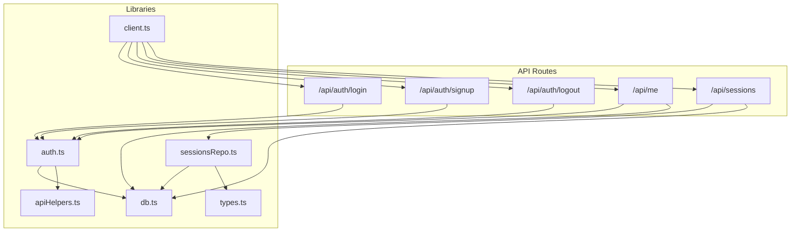
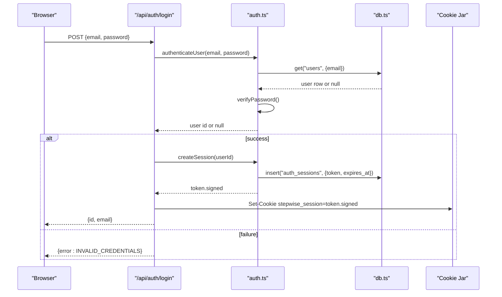
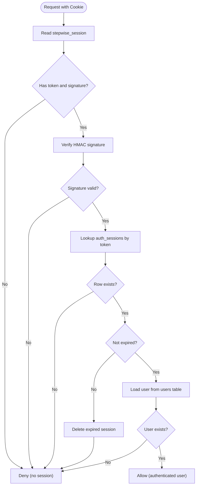
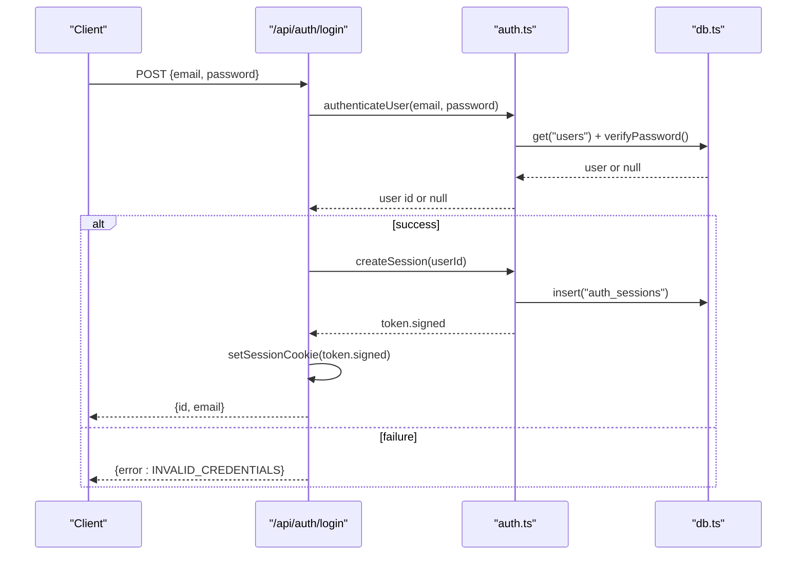
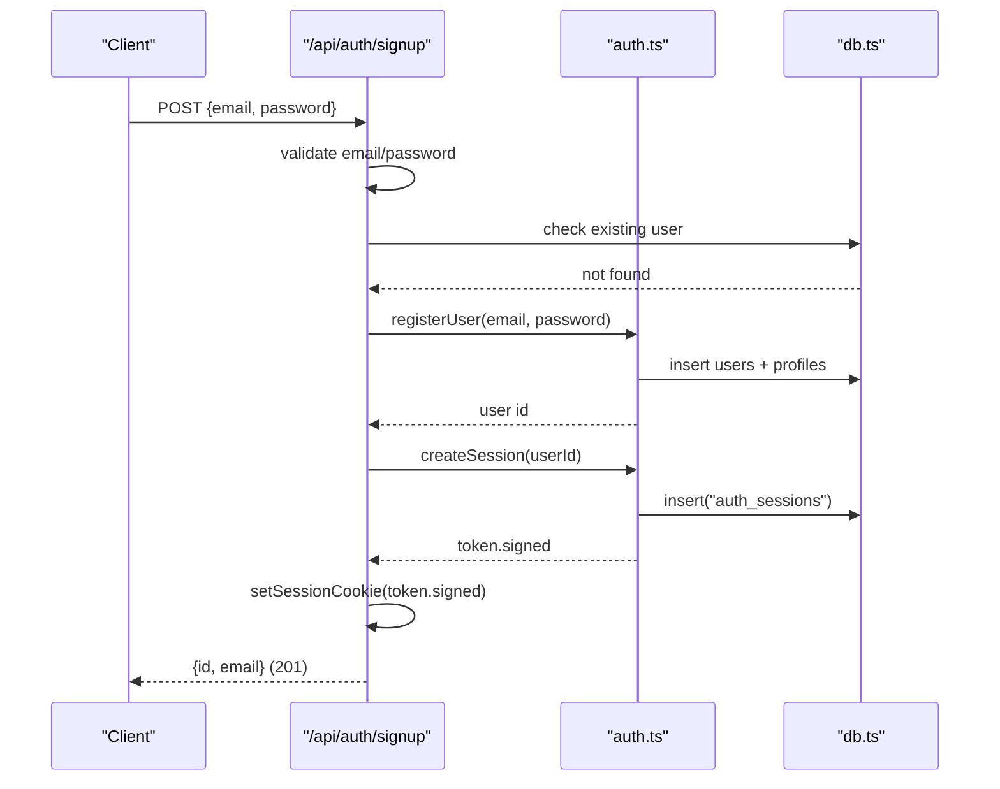
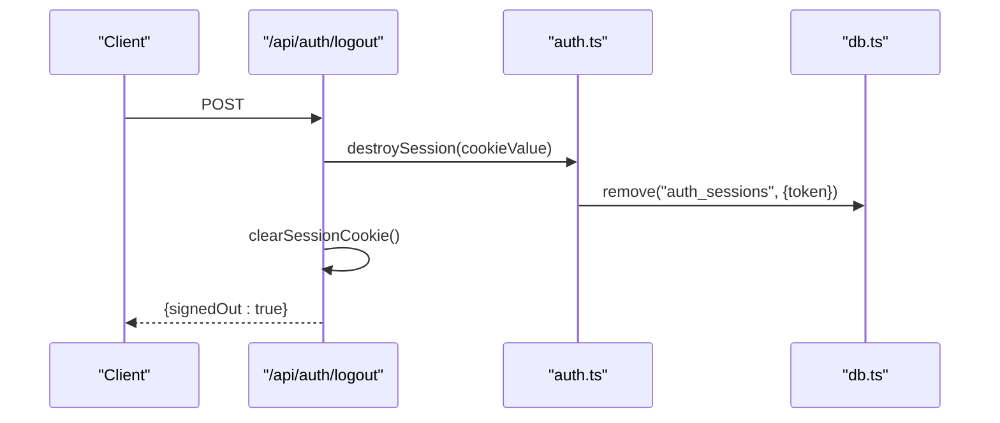
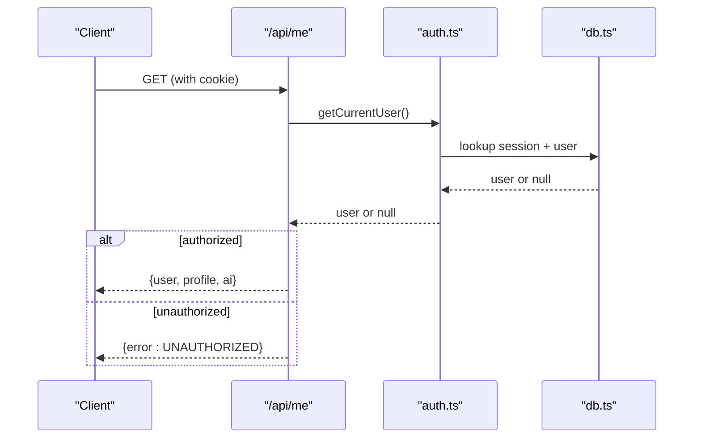
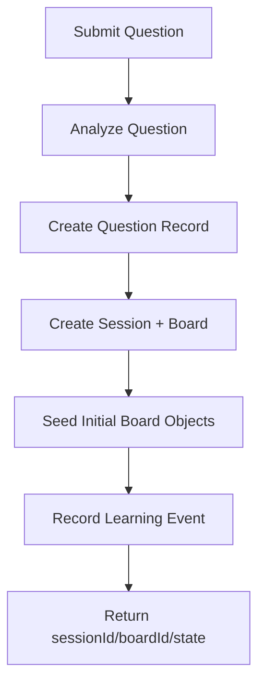
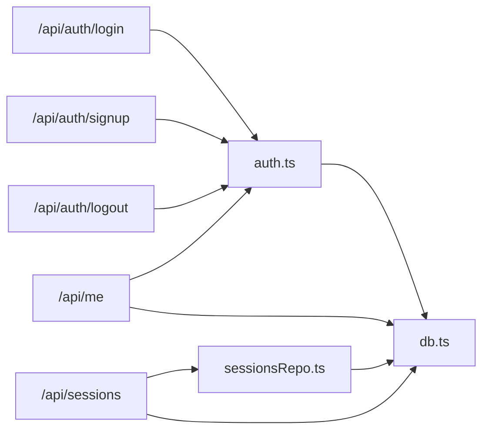

# Session Management

<cite>
**Referenced Files in This Document**
- [auth.ts](file://stepwise ai/app/lib/auth.ts)
- [login route.ts](file://stepwise ai/app/app/api/auth/login/route.ts)
- [logout route.ts](file://stepwise ai/app/app/api/auth/logout/route.ts)
- [signup route.ts](file://stepwise ai/app/app/api/auth/signup/route.ts)
- [db.ts](file://stepwise ai/app/lib/db.ts)
- [sessionsRepo.ts](file://stepwise ai/app/lib/sessionsRepo.ts)
- [types.ts](file://stepwise ai/app/lib/types.ts)
- [client.ts](file://stepwise ai/app/lib/client.ts)
- [apiHelpers.ts](file://stepwise ai/app/lib/apiHelpers.ts)
- [me route.ts](file://stepwise ai/app/app/api/me/route.ts)
- [sessions route.ts](file://stepwise ai/app/app/api/sessions/route.ts)
</cite>

## Table of Contents
1. [Introduction](#introduction)
2. [Project Structure](#project-structure)
3. [Core Components](#core-components)
4. [Architecture Overview](#architecture-overview)
5. [Detailed Component Analysis](#detailed-component-analysis)
6. [Dependency Analysis](#dependency-analysis)
7. [Performance Considerations](#performance-considerations)
8. [Troubleshooting Guide](#troubleshooting-guide)
9. [Conclusion](#conclusion)
10. [Appendices](#appendices)

## Introduction
This document explains StepWise AI’s session management system with a focus on the complete lifecycle of user sessions: creation at login, persistence via signed cookies, validation on each request, expiration and cleanup, and logout behavior. It also documents how learning sessions (per-question interactions) are created, tracked, and persisted to maintain state across page refreshes. Security best practices such as secure cookie configuration, session hijacking prevention, and proper cleanup are covered alongside practical guidance for building session-aware components and handling expiration gracefully.

## Project Structure
The session system spans authentication routes, a shared auth library, a database abstraction, and a repository layer that persists learning sessions and related data. Client helpers coordinate authenticated requests using same-origin cookies.

**Diagram sources**
- [login route.ts:1-30](file://stepwise ai/app/app/api/auth/login/route.ts#L1-L30)
- [signup route.ts:1-36](file://stepwise ai/app/app/api/auth/signup/route.ts#L1-L36)
- [logout route.ts:1-12](file://stepwise ai/app/app/api/auth/logout/route.ts#L1-L12)
- [me route.ts:1-79](file://stepwise ai/app/app/api/me/route.ts#L1-L79)
- [sessions route.ts:1-56](file://stepwise ai/app/app/api/sessions/route.ts#L1-L56)
- [auth.ts:1-139](file://stepwise ai/app/lib/auth.ts#L1-L139)
- [db.ts:1-224](file://stepwise ai/app/lib/db.ts#L1-L224)
- [sessionsRepo.ts:1-399](file://stepwise ai/app/lib/sessionsRepo.ts#L1-L399)
- [types.ts:1-302](file://stepwise ai/app/lib/types.ts#L1-L302)
- [client.ts:1-28](file://stepwise ai/app/lib/client.ts#L1-L28)
- [apiHelpers.ts:1-42](file://stepwise ai/app/lib/apiHelpers.ts#L1-L42)

**Section sources**
- [auth.ts:1-139](file://stepwise ai/app/lib/auth.ts#L1-L139)
- [db.ts:1-224](file://stepwise ai/app/lib/db.ts#L1-L224)
- [sessionsRepo.ts:1-399](file://stepwise ai/app/lib/sessionsRepo.ts#L1-L399)
- [types.ts:1-302](file://stepwise ai/app/lib/types.ts#L1-L302)
- [client.ts:1-28](file://stepwise ai/app/lib/client.ts#L1-L28)
- [apiHelpers.ts:1-42](file://stepwise ai/app/lib/apiHelpers.ts#L1-L42)
- [login route.ts:1-30](file://stepwise ai/app/app/api/auth/login/route.ts#L1-L30)
- [signup route.ts:1-36](file://stepwise ai/app/app/api/auth/signup/route.ts#L1-L36)
- [logout route.ts:1-12](file://stepwise ai/app/app/api/auth/logout/route.ts#L1-L12)
- [me route.ts:1-79](file://stepwise ai/app/app/api/me/route.ts#L1-L79)
- [sessions route.ts:1-56](file://stepwise ai/app/app/api/sessions/route.ts#L1-L56)

## Core Components
- Authentication and session cookies:
  - Creates signed session tokens stored in an httpOnly cookie.
  - Verifies signatures and checks expiry on every request.
  - Provides utilities to set/clear cookies and destroy server-side sessions.
- Database abstraction:
  - JSON-backed relational store with transactions and atomic writes.
  - Defines tables including users, profiles, and auth_sessions.
- Learning sessions repository:
  - Creates per-question learning sessions, boards, and initial objects.
  - Tracks state transitions, hints, errors, and statistics.
- API routes:
  - Login, signup, logout endpoints orchestrate authentication and session lifecycle.
  - Protected endpoints use getCurrentUser to enforce authorization.
- Client helper:
  - Sends authenticated requests with credentials included.

**Section sources**
- [auth.ts:1-139](file://stepwise ai/app/lib/auth.ts#L1-L139)
- [db.ts:1-224](file://stepwise ai/app/lib/db.ts#L1-L224)
- [sessionsRepo.ts:1-399](file://stepwise ai/app/lib/sessionsRepo.ts#L1-L399)
- [login route.ts:1-30](file://stepwise ai/app/app/api/auth/login/route.ts#L1-L30)
- [signup route.ts:1-36](file://stepwise ai/app/app/api/auth/signup/route.ts#L1-L36)
- [logout route.ts:1-12](file://stepwise ai/app/app/api/auth/logout/route.ts#L1-L12)
- [me route.ts:1-79](file://stepwise ai/app/app/api/me/route.ts#L1-L79)
- [sessions route.ts:1-56](file://stepwise ai/app/app/api/sessions/route.ts#L1-L56)
- [client.ts:1-28](file://stepwise ai/app/lib/client.ts#L1-L28)

## Architecture Overview
The session architecture combines server-side authentication with client-side cookies to maintain user identity across requests and page refreshes. Each protected endpoint validates the session before granting access. Learning sessions encapsulate a single question-driven interaction and persist state to support recovery after refresh.

**Diagram sources**
- [login route.ts:1-30](file://stepwise ai/app/app/api/auth/login/route.ts#L1-L30)
- [auth.ts:24-67](file://stepwise ai/app/lib/auth.ts#L24-L67)
- [db.ts:147-159](file://stepwise ai/app/lib/db.ts#L147-L159)

## Detailed Component Analysis

### Authentication and Session Cookies
- Token generation and signing:
  - Generates a random token and computes an HMAC signature; stores both in the cookie value as token.signature.
  - Persists the token and expiry in the auth_sessions table.
- Cookie configuration:
  - httpOnly prevents client-side script access.
  - SameSite lax mitigates CSRF risks.
  - Secure flag enabled in production to enforce HTTPS.
  - Path set to root and maxAge aligned with session duration.
- Session verification:
  - On each request, the cookie is read, split into token and signature, signature verified with constant-time comparison, and the session row checked for existence and expiry. Expired sessions are deleted.
- Logout:
  - Destroys the server-side session record and clears the cookie.

**Diagram sources**
- [auth.ts:42-102](file://stepwise ai/app/lib/auth.ts#L42-L102)
- [db.ts:141-145](file://stepwise ai/app/lib/db.ts#L141-L145)

**Section sources**
- [auth.ts:9-71](file://stepwise ai/app/lib/auth.ts#L9-L71)
- [auth.ts:78-102](file://stepwise ai/app/lib/auth.ts#L78-L102)
- [logout route.ts:1-12](file://stepwise ai/app/app/api/auth/logout/route.ts#L1-L12)

### Login Flow
- Validates input, authenticates user, creates a session, sets the cookie, and returns minimal user info.

**Diagram sources**
- [login route.ts:1-30](file://stepwise ai/app/app/api/auth/login/route.ts#L1-L30)
- [auth.ts:24-67](file://stepwise ai/app/lib/auth.ts#L24-L67)
- [db.ts:147-159](file://stepwise ai/app/lib/db.ts#L147-L159)

**Section sources**
- [login route.ts:1-30](file://stepwise ai/app/app/api/auth/login/route.ts#L1-L30)
- [auth.ts:24-67](file://stepwise ai/app/lib/auth.ts#L24-L67)

### Signup Flow
- Validates email format and password strength, ensures uniqueness, registers user and profile, creates a session, and sets the cookie.

**Diagram sources**
- [signup route.ts:1-36](file://stepwise ai/app/app/api/auth/signup/route.ts#L1-L36)
- [auth.ts:104-128](file://stepwise ai/app/lib/auth.ts#L104-L128)
- [db.ts:147-159](file://stepwise ai/app/lib/db.ts#L147-L159)

**Section sources**
- [signup route.ts:1-36](file://stepwise ai/app/app/api/auth/signup/route.ts#L1-L36)
- [auth.ts:104-128](file://stepwise ai/app/lib/auth.ts#L104-L128)

### Logout Flow
- Destroys the server-side session and clears the cookie.

**Diagram sources**
- [logout route.ts:1-12](file://stepwise ai/app/app/api/auth/logout/route.ts#L1-L12)
- [auth.ts:53-71](file://stepwise ai/app/lib/auth.ts#L53-L71)

**Section sources**
- [logout route.ts:1-12](file://stepwise ai/app/app/api/auth/logout/route.ts#L1-L12)
- [auth.ts:53-71](file://stepwise ai/app/lib/auth.ts#L53-L71)

### Protected Endpoints and Authorization
- Endpoints like /api/me and /api/sessions call getCurrentUser to enforce authentication. If no valid session is present, they return unauthorized responses.

**Diagram sources**
- [me route.ts:1-79](file://stepwise ai/app/app/api/me/route.ts#L1-L79)
- [auth.ts:78-102](file://stepwise ai/app/lib/auth.ts#L78-L102)

**Section sources**
- [me route.ts:1-79](file://stepwise ai/app/app/api/me/route.ts#L1-L79)
- [auth.ts:78-102](file://stepwise ai/app/lib/auth.ts#L78-L102)

### Learning Sessions (Per-Question Interactions)
- Creation:
  - When a user submits a question, the system analyzes it, creates a question record, a session, and a board, seeds initial board objects, and records a learning event.
- State tracking:
  - Sessions track current step, status, and serialized state JSON to persist progress.
- Persistence:
  - Board objects, messages, hints, errors, and events are stored with ownership and timestamps.
- Recovery:
  - Clients can resume by fetching the session and board state from the server.

**Diagram sources**
- [sessions route.ts:11-44](file://stepwise ai/app/app/api/sessions/route.ts#L11-L44)
- [sessionsRepo.ts:26-116](file://stepwise ai/app/lib/sessionsRepo.ts#L26-L116)

**Section sources**
- [sessions route.ts:1-56](file://stepwise ai/app/app/api/sessions/route.ts#L1-L56)
- [sessionsRepo.ts:26-116](file://stepwise ai/app/lib/sessionsRepo.ts#L26-L116)
- [types.ts:6-24](file://stepwise ai/app/lib/types.ts#L6-L24)

## Dependency Analysis
- Authentication depends on:
  - Next.js cookies API for setting/reading cookies.
  - Crypto primitives for hashing and HMAC signing.
  - Database layer for user and session persistence.
- API routes depend on:
  - Authentication functions for session validation.
  - Helpers for consistent response envelopes and input sanitization.
- Learning sessions depend on:
  - AI provider abstraction for question analysis.
  - Repository for creating and updating session state and related entities.

**Diagram sources**
- [login route.ts:1-30](file://stepwise ai/app/app/api/auth/login/route.ts#L1-L30)
- [signup route.ts:1-36](file://stepwise ai/app/app/api/auth/signup/route.ts#L1-L36)
- [logout route.ts:1-12](file://stepwise ai/app/app/api/auth/logout/route.ts#L1-L12)
- [me route.ts:1-79](file://stepwise ai/app/app/api/me/route.ts#L1-L79)
- [sessions route.ts:1-56](file://stepwise ai/app/app/api/sessions/route.ts#L1-L56)
- [auth.ts:1-139](file://stepwise ai/app/lib/auth.ts#L1-L139)
- [sessionsRepo.ts:1-399](file://stepwise ai/app/lib/sessionsRepo.ts#L1-L399)
- [db.ts:1-224](file://stepwise ai/app/lib/db.ts#L1-L224)

**Section sources**
- [auth.ts:1-139](file://stepwise ai/app/lib/auth.ts#L1-L139)
- [sessionsRepo.ts:1-399](file://stepwise ai/app/lib/sessionsRepo.ts#L1-L399)
- [db.ts:1-224](file://stepwise ai/app/lib/db.ts#L1-L224)
- [login route.ts:1-30](file://stepwise ai/app/app/api/auth/login/route.ts#L1-L30)
- [signup route.ts:1-36](file://stepwise ai/app/app/api/auth/signup/route.ts#L1-L36)
- [logout route.ts:1-12](file://stepwise ai/app/app/api/auth/logout/route.ts#L1-L12)
- [me route.ts:1-79](file://stepwise ai/app/app/api/me/route.ts#L1-L79)
- [sessions route.ts:1-56](file://stepwise ai/app/app/api/sessions/route.ts#L1-L56)

## Performance Considerations
- Session verification is lightweight: signature check plus one or two database lookups per request.
- Database operations are synchronous and atomic within transactions, ensuring consistency during hot-reload scenarios.
- Avoid excessive reads/writes in tight loops; batch updates where possible.
- Keep session payloads small; only essential identifiers are stored in cookies.

[No sources needed since this section provides general guidance]

## Troubleshooting Guide
- Invalid or missing cookie:
  - Ensure credentials are sent with requests (same-origin).
  - Confirm cookie is set and not blocked by browser settings.
- Signature mismatch:
  - Indicates tampering or misconfiguration; verify secret and signing logic.
- Expired session:
  - Re-authenticate or extend session if appropriate.
- Unauthorized responses:
  - Check that protected endpoints receive a valid session cookie.
- Server errors:
  - Inspect logs; ensure environment variables (e.g., AUTH_SECRET) are configured.

**Section sources**
- [client.ts:7-27](file://stepwise ai/app/lib/client.ts#L7-L27)
- [apiHelpers.ts:8-30](file://stepwise ai/app/lib/apiHelpers.ts#L8-L30)
- [auth.ts:78-102](file://stepwise ai/app/lib/auth.ts#L78-L102)

## Conclusion
StepWise AI implements a robust, secure session management system using signed httpOnly cookies and server-side session storage. The design separates concerns between authentication, authorization, and learning session persistence, enabling reliable state maintenance across page refreshes and safe logout behavior. By following the documented flows and security practices, developers can build session-aware features that are resilient, secure, and user-friendly.

[No sources needed since this section summarizes without analyzing specific files]

## Appendices

### Implementing Session-Aware Components
- Use the client helper to send authenticated requests with credentials included.
- Handle error responses indicating unauthorized or invalid sessions by prompting re-login.
- For long-running tasks, poll or use optimistic UI updates while verifying session validity on critical actions.

**Section sources**
- [client.ts:7-27](file://stepwise ai/app/lib/client.ts#L7-L27)
- [apiHelpers.ts:19-30](file://stepwise ai/app/lib/apiHelpers.ts#L19-L30)

### Handling Session Expiration Gracefully
- Detect unauthorized responses and redirect to login.
- Optionally show a non-intrusive banner indicating session will expire soon.
- Refresh or re-authenticate silently when possible to minimize disruption.

**Section sources**
- [apiHelpers.ts:19-30](file://stepwise ai/app/lib/apiHelpers.ts#L19-L30)
- [auth.ts:78-102](file://stepwise ai/app/lib/auth.ts#L78-L102)

### Maintaining User State Across Page Refreshes
- Rely on the cookie to persist the session automatically.
- On app start, call a protected endpoint (e.g., /api/me) to validate the session and load user profile.
- Cache minimal user info locally after successful validation to avoid unnecessary network calls.

**Section sources**
- [me route.ts:20-33](file://stepwise ai/app/app/api/me/route.ts#L20-L33)
- [auth.ts:78-102](file://stepwise ai/app/lib/auth.ts#L78-L102)

### Session Security Best Practices
- Secure cookie configuration:
  - httpOnly, sameSite lax, secure in production, path set to root, appropriate maxAge.
- Session hijacking prevention:
  - Signed tokens with HMAC, constant-time comparison, server-side session lookup, expiry checks.
- Proper cleanup:
  - Destroy server-side session on logout and clear cookie immediately.

**Section sources**
- [auth.ts:9-71](file://stepwise ai/app/lib/auth.ts#L9-L71)
- [auth.ts:78-102](file://stepwise ai/app/lib/auth.ts#L78-L102)
- [logout route.ts:1-12](file://stepwise ai/app/app/api/auth/logout/route.ts#L1-L12)

### Session Persistence Strategies and Recovery
- Persist learning session state in the database to recover after refresh or reconnect.
- Store board snapshots and incremental updates to minimize data loss.
- Provide endpoints to fetch session details and board state for resuming work seamlessly.

**Section sources**
- [sessionsRepo.ts:26-116](file://stepwise ai/app/lib/sessionsRepo.ts#L26-L116)
- [sessionsRepo.ts:176-195](file://stepwise ai/app/lib/sessionsRepo.ts#L176-L195)
- [sessionsRepo.ts:239-265](file://stepwise ai/app/lib/sessionsRepo.ts#L239-L265)