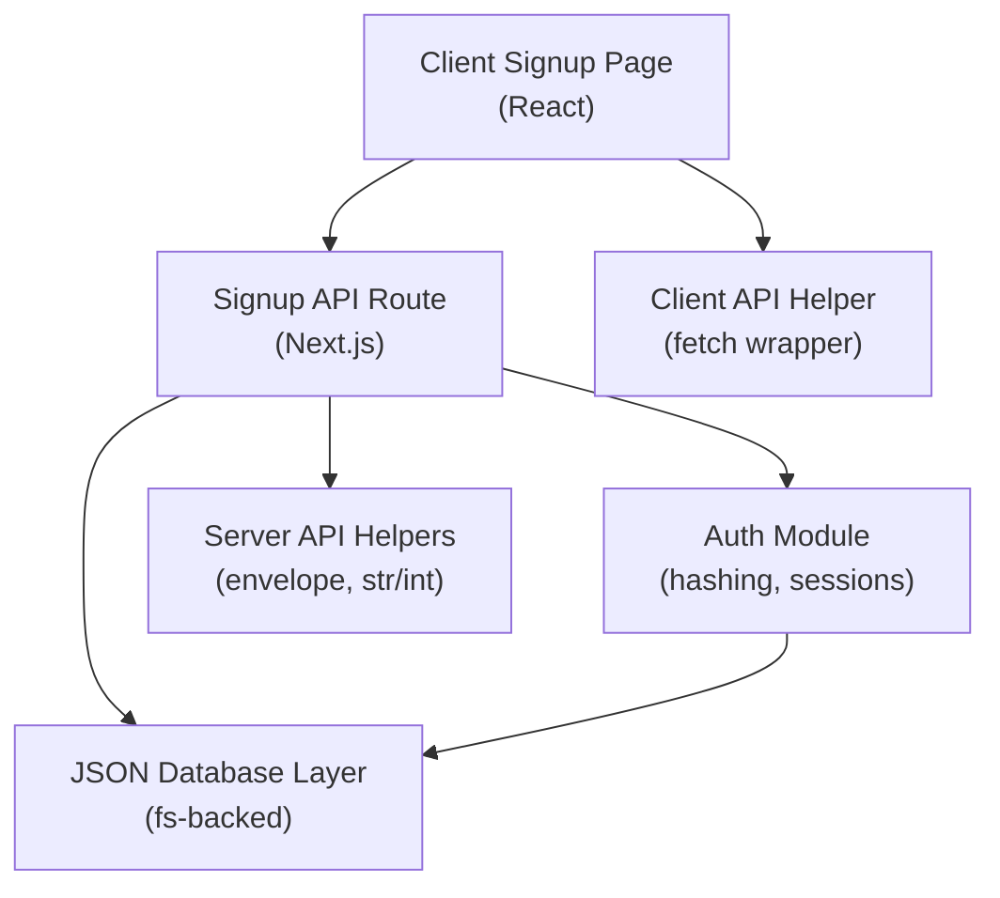
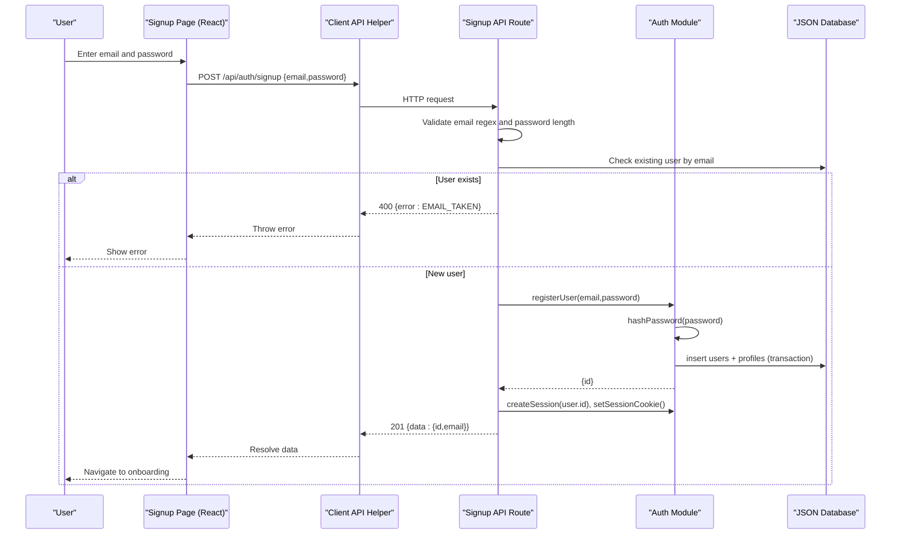
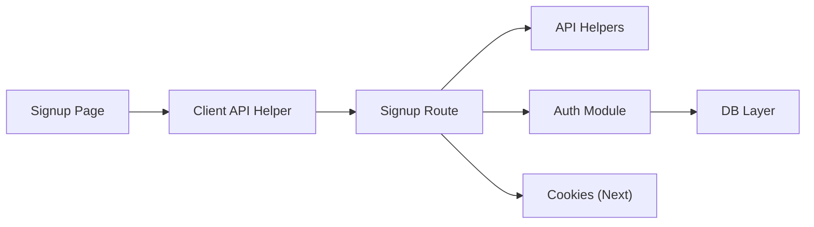

# User Registration

<cite>
**Referenced Files in This Document**
- [route.ts](file://stepwise ai/app/app/api/auth/signup/route.ts)
- [page.tsx](file://stepwise ai/app/app/signup/page.tsx)
- [auth.ts](file://stepwise ai/app/lib/auth.ts)
- [db.ts](file://stepwise ai/app/lib/db.ts)
- [apiHelpers.ts](file://stepwise ai/app/lib/apiHelpers.ts)
- [client.ts](file://stepwise ai/app/lib/client.ts)
- [types.ts](file://stepwise ai/app/lib/types.ts)
- [login route.ts](file://stepwise ai/app/app/api/auth/login/route.ts)
- [me route.ts](file://stepwise ai/app/app/api/me/route.ts)
</cite>

## Table of Contents
1. [Introduction](#introduction)
2. [Project Structure](#project-structure)
3. [Core Components](#core-components)
4. [Architecture Overview](#architecture-overview)
5. [Detailed Component Analysis](#detailed-component-analysis)
6. [Dependency Analysis](#dependency-analysis)
7. [Performance Considerations](#performance-considerations)
8. [Troubleshooting Guide](#troubleshooting-guide)
9. [Conclusion](#conclusion)
10. [Appendices](#appendices)

## Introduction
This document explains StepWise AI’s user registration system end-to-end: the client-side signup form, the server-side signup API endpoint, input validation, password hashing using Node.js crypto, and persistence to an embedded JSON database. It also covers error handling for duplicate users and validation failures, the User model structure and constraints, and security considerations such as password strength checks, input sanitization, and protection against common vulnerabilities.

## Project Structure
The registration feature spans a Next.js App Router API route, a React client page, shared authentication utilities, and a JSON-based data store.

**Diagram sources**
- [page.tsx:17-32](file://stepwise ai/app/app/signup/page.tsx#L17-L32)
- [route.ts:10-35](file://stepwise ai/app/app/api/auth/signup/route.ts#L10-L35)
- [auth.ts:24-51](file://stepwise ai/app/lib/auth.ts#L24-L51)
- [db.ts:123-159](file://stepwise ai/app/lib/db.ts#L123-L159)
- [client.ts:7-27](file://stepwise ai/app/lib/client.ts#L7-L27)
- [apiHelpers.ts:8-36](file://stepwise ai/app/lib/apiHelpers.ts#L8-L36)

**Section sources**
- [page.tsx:1-92](file://stepwise ai/app/app/signup/page.tsx#L1-L92)
- [route.ts:1-36](file://stepwise ai/app/app/api/auth/signup/route.ts#L1-L36)
- [auth.ts:1-139](file://stepwise ai/app/lib/auth.ts#L1-L139)
- [db.ts:1-224](file://stepwise ai/app/lib/db.ts#L1-L224)
- [client.ts:1-28](file://stepwise ai/app/lib/client.ts#L1-L28)
- [apiHelpers.ts:1-42](file://stepwise ai/app/lib/apiHelpers.ts#L1-L42)

## Core Components
- Signup API route: Validates inputs, checks for existing users, creates a hashed password, persists user and profile, issues a session cookie, and returns a success response.
- Client signup page: Collects email and password, validates confirm password on the client, calls the API, and navigates to onboarding on success.
- Authentication module: Implements secure password hashing with scrypt, session creation and cookie management, and user registration logic that persists both user and profile records.
- Database layer: A small relational-style JSON store with atomic writes and transaction support; used to persist users and profiles.
- API helpers: Provide consistent envelope responses and safe input parsing (string clamping/trimming).
- Client helper: Wraps fetch to handle the standard envelope and throw errors when responses indicate failure.

**Section sources**
- [route.ts:10-35](file://stepwise ai/app/app/api/auth/signup/route.ts#L10-L35)
- [page.tsx:17-32](file://stepwise ai/app/app/signup/page.tsx#L17-L32)
- [auth.ts:24-51](file://stepwise ai/app/lib/auth.ts#L24-L51)
- [auth.ts:104-128](file://stepwise ai/app/lib/auth.ts#L104-L128)
- [db.ts:123-159](file://stepwise ai/app/lib/db.ts#L123-L159)
- [apiHelpers.ts:8-36](file://stepwise ai/app/lib/apiHelpers.ts#L8-L36)
- [client.ts:7-27](file://stepwise ai/app/lib/client.ts#L7-L27)

## Architecture Overview
The registration flow begins at the client form, proceeds through the Next.js API route, applies validation and hashing, persists data via the JSON database, sets a signed session cookie, and responds with a minimal user payload.

**Diagram sources**
- [page.tsx:17-32](file://stepwise ai/app/app/signup/page.tsx#L17-L32)
- [route.ts:10-35](file://stepwise ai/app/app/api/auth/signup/route.ts#L10-L35)
- [auth.ts:24-51](file://stepwise ai/app/lib/auth.ts#L24-L51)
- [auth.ts:104-128](file://stepwise ai/app/lib/auth.ts#L104-L128)
- [db.ts:123-159](file://stepwise ai/app/lib/db.ts#L123-L159)

## Detailed Component Analysis

### Signup API Endpoint
- Input extraction and sanitization: Uses a helper to safely parse and clamp strings from the request body.
- Validation rules:
  - Email must match a standard email pattern.
  - Password must be at least 8 characters.
- Duplicate check: Queries the database for an existing user by email.
- Registration: Calls the auth module to register the user, which hashes the password and inserts user and profile rows atomically.
- Session: Creates a session token, signs it, stores it in the database, and sets an httpOnly cookie.
- Response: Returns a 201 status with minimal user data (id and email).

Error handling:
- Invalid email returns a specific code and message.
- Weak password returns a specific code and message.
- Existing email returns a specific code and message.
- Unexpected exceptions return a generic server error without leaking internals.

**Section sources**
- [route.ts:10-35](file://stepwise ai/app/app/api/auth/signup/route.ts#L10-L35)
- [apiHelpers.ts:8-36](file://stepwise ai/app/lib/apiHelpers.ts#L8-L36)

### Client Signup Form
- State: Tracks email, password, confirm password, error messages, and busy state.
- Client-side validation: Ensures password and confirm password match before submission.
- Submission: Sends a POST to the signup endpoint with email and password via the client helper.
- Navigation: On success, redirects to the onboarding page.
- Error display: Shows server-provided error messages or a fallback message.

Security notes:
- The form uses HTML attributes like type="password" and autoComplete hints for better UX and browser behavior.
- Minimum length is enforced on the client for immediate feedback; server enforces the same rule.

**Section sources**
- [page.tsx:17-32](file://stepwise ai/app/app/signup/page.tsx#L17-L32)
- [page.tsx:48-81](file://stepwise ai/app/app/signup/page.tsx#L48-L81)

### Password Hashing and Verification
- Hashing: Uses Node.js crypto scrypt with a random salt; stores scheme, salt, and hash in a structured string format.
- Verification: Parses stored value, recomputes hash with the same salt, and compares using a constant-time comparison to prevent timing attacks.
- Usage: Called during user registration to store only the hashed password.

Security considerations:
- Scrypt provides strong memory-hard hashing suitable for passwords.
- Salt is unique per password to defend against rainbow table attacks.
- Constant-time comparison mitigates timing side channels.

**Section sources**
- [auth.ts:24-40](file://stepwise ai/app/lib/auth.ts#L24-L40)

### User Data Persistence (JSON Database)
- Storage: Embedded JSON file with tables for users, profiles, and other entities.
- Atomic writes: Writes to a temporary file then renames to ensure consistency.
- Transactions: Multi-step operations are buffered and committed once, rolling back on error.
- Insert: Auto-increments IDs where configured; returns last inserted ID.
- Query: Provides get and all with simple equality filters.

Registration persistence:
- Inserts a user row with email, hashed password, timestamps, and null last login.
- Inserts a default profile row linked to the new user.

Constraints and integrity:
- No SQL injection risk because there is no SQL; queries use object matching.
- Unique email enforcement is handled in the API route prior to insertion.

**Section sources**
- [db.ts:73-94](file://stepwise ai/app/lib/db.ts#L73-L94)
- [db.ts:123-159](file://stepwise ai/app/lib/db.ts#L123-L159)
- [db.ts:183-194](file://stepwise ai/app/lib/db.ts#L183-L194)
- [auth.ts:104-128](file://stepwise ai/app/lib/auth.ts#L104-L128)

### Session Management
- Creation: Generates a random token, computes an HMAC signature using a secret, stores the session record with expiration, and returns a combined token.signature string.
- Cookie: Sets an httpOnly, sameSite lax, secure (in production) cookie with a long max age.
- Current user: Verifies the cookie signature, checks session existence and expiry, and resolves the associated user.

Security considerations:
- Secret-based signing prevents tampering.
- HttpOnly cookies mitigate XSS access to session tokens.
- Secure flag ensures HTTPS-only transmission in production.

**Section sources**
- [auth.ts:42-67](file://stepwise ai/app/lib/auth.ts#L42-L67)
- [auth.ts:78-102](file://stepwise ai/app/lib/auth.ts#L78-L102)

### API Envelope and Helpers
- Server helpers: Provide standardized success and error envelopes, unauthorized/not found/server error responses, and safe input parsing functions (str, int).
- Client helper: Wraps fetch, parses JSON, throws on non-OK responses or envelope errors, and returns data payloads.

Consistency:
- All endpoints return a uniform envelope with either data or error fields, simplifying client error handling.

**Section sources**
- [apiHelpers.ts:8-41](file://stepwise ai/app/lib/apiHelpers.ts#L8-L41)
- [client.ts:7-27](file://stepwise ai/app/lib/client.ts#L7-L27)

## Dependency Analysis
The registration flow depends on tightly coupled modules with clear responsibilities:

**Diagram sources**
- [page.tsx:17-32](file://stepwise ai/app/app/signup/page.tsx#L17-L32)
- [route.ts:10-35](file://stepwise ai/app/app/api/auth/signup/route.ts#L10-L35)
- [auth.ts:24-51](file://stepwise ai/app/lib/auth.ts#L24-L51)
- [db.ts:123-159](file://stepwise ai/app/lib/db.ts#L123-L159)

**Section sources**
- [route.ts:1-36](file://stepwise ai/app/app/api/auth/signup/route.ts#L1-L36)
- [auth.ts:1-139](file://stepwise ai/app/lib/auth.ts#L1-L139)
- [db.ts:1-224](file://stepwise ai/app/lib/db.ts#L1-L224)
- [apiHelpers.ts:1-42](file://stepwise ai/app/lib/apiHelpers.ts#L1-L42)
- [client.ts:1-28](file://stepwise ai/app/lib/client.ts#L1-L28)

## Performance Considerations
- Password hashing: scrypt is intentionally CPU-intensive; keep minimum password length reasonable to balance security and latency.
- Database writes: JSON file writes are synchronous; transactions batch changes to minimize disk I/O.
- Network: Minimal payload returned from signup reduces bandwidth and parsing overhead.

[No sources needed since this section provides general guidance]

## Troubleshooting Guide
Common issues and resolutions:
- Invalid email: Ensure the email matches a valid pattern; the server will reject malformed emails.
- Weak password: Use at least 8 characters; consider adding complexity requirements if desired.
- Duplicate email: If an account already exists, update your UI to inform the user and prompt them to sign in instead.
- Server errors: Generic server errors hide internal details; check server logs for stack traces while keeping client messages user-friendly.

Related flows:
- Login: Similar input handling and session creation; uses the same auth module for verification.
- Me endpoint: Demonstrates how current user is resolved from the session cookie and how profile updates are validated.

**Section sources**
- [route.ts:16-26](file://stepwise ai/app/app/api/auth/signup/route.ts#L16-L26)
- [login route.ts:7-25](file://stepwise ai/app/app/api/auth/login/route.ts#L7-L25)
- [me route.ts:20-33](file://stepwise ai/app/app/api/me/route.ts#L20-L33)

## Conclusion
StepWise AI’s registration system combines robust client-side validation, secure server-side hashing and session management, and a reliable JSON-backed data store. The design emphasizes safety (constant-time comparisons, httpOnly cookies, input sanitization), clarity (consistent API envelopes), and simplicity (embedded database with transactions). Following the patterns outlined here ensures a secure and maintainable registration experience.

[No sources needed since this section summarizes without analyzing specific files]

## Appendices

### User Model and Constraints
- Users table fields used during registration:
  - id: auto-incremented integer
  - email: lowercase string, validated for format and uniqueness
  - password_hash: scrypt-derived string with salt
  - created_at: ISO timestamp
  - last_login_at: nullable timestamp
- Profiles table fields initialized during registration:
  - user_id: foreign key to users.id
  - display_name: string
  - age_band: enum-like string
  - education_level: string
  - preferred_language: string
  - explanation_depth: enum-like string
  - autonomy_level: enum-like string
  - learning_mode: enum-like string
  - theme: string
  - onboarded: numeric flag
  - created_at/updated_at: ISO timestamps

These structures are enforced by the registration transaction and subsequent profile reads/updates.

**Section sources**
- [auth.ts:104-128](file://stepwise ai/app/lib/auth.ts#L104-L128)
- [db.ts:23-44](file://stepwise ai/app/lib/db.ts#L23-L44)
- [types.ts:239-250](file://stepwise ai/app/lib/types.ts#L239-L250)

### Security Checklist
- Password strength: Enforce minimum length on both client and server; consider adding complexity rules.
- Input sanitization: Use provided helpers to trim and clamp inputs.
- Protection against injection: No SQL is used; queries rely on object matching.
- XSS mitigation: Avoid rendering untrusted content; use httpOnly cookies for sessions.
- Timing attacks: Use constant-time comparison for password verification.
- Secrets management: Ensure AUTH_SECRET is set in production.

**Section sources**
- [auth.ts:24-40](file://stepwise ai/app/lib/auth.ts#L24-L40)
- [apiHelpers.ts:32-36](file://stepwise ai/app/lib/apiHelpers.ts#L32-L36)
- [db.ts:1-13](file://stepwise ai/app/lib/db.ts#L1-L13)