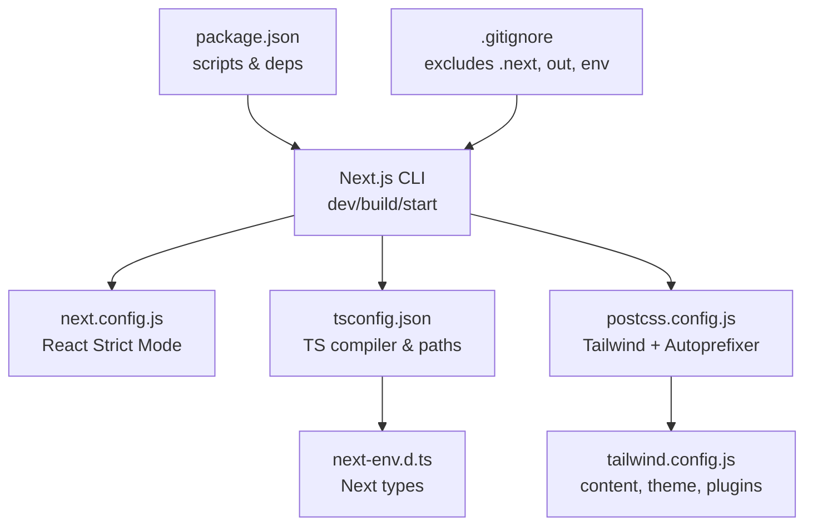
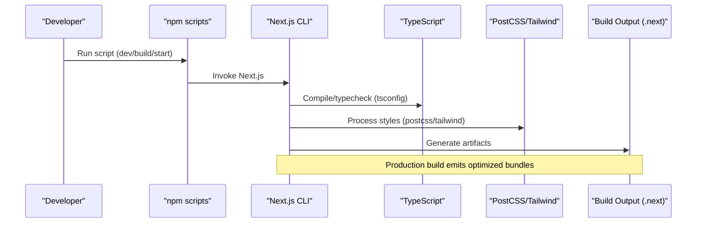
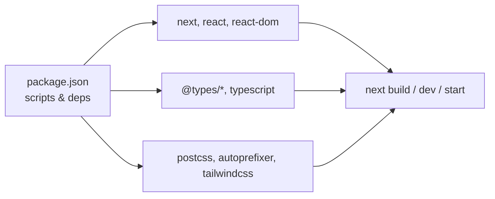

# Build Configuration

<cite>
**Referenced Files in This Document**
- [next.config.js](file://stepwise ai/app/next.config.js)
- [package.json](file://stepwise ai/app/package.json)
- [tsconfig.json](file://stepwise ai/app/tsconfig.json)
- [postcss.config.js](file://stepwise ai/app/postcss.config.js)
- [tailwind.config.js](file://stepwise ai/app/tailwind.config.js)
- [next-env.d.ts](file://stepwise ai/app/next-env.d.ts)
- [.gitignore](file://stepwise ai/app/.gitignore)
</cite>

## Table of Contents
1. [Introduction](#introduction)
2. [Project Structure](#project-structure)
3. [Core Components](#core-components)
4. [Architecture Overview](#architecture-overview)
5. [Detailed Component Analysis](#detailed-component-analysis)
6. [Dependency Analysis](#dependency-analysis)
7. [Performance Considerations](#performance-considerations)
8. [Troubleshooting Guide](#troubleshooting-guide)
9. [Conclusion](#conclusion)

## Introduction
This document explains the build configuration for StepWise AI, focusing on Next.js settings, TypeScript compilation, module resolution and path mappings, environment-specific behavior, asset optimization, and performance tuning. It also documents the npm scripts used for development, building, linting, type checking, and production startup, and shows how to tailor the build for different deployment targets while understanding the impact on application performance.

## Project Structure
The build-related configuration lives under the app directory:
- Next.js runtime and build options are defined in next.config.js.
- Scripts and dependencies are declared in package.json.
- TypeScript compilation and module resolution are configured in tsconfig.json.
- CSS pipeline uses PostCSS with Tailwind and Autoprefixer via postcss.config.js and tailwind.config.js.
- Type declarations for Next.js are provided by next-env.d.ts.
- Build artifacts and sensitive files are excluded from version control via .gitignore.

**Diagram sources**
- [package.json:6-11](file://stepwise ai/app/package.json#L6-L11)
- [next.config.js:1-7](file://stepwise ai/app/next.config.js#L1-L7)
- [tsconfig.json:1-22](file://stepwise ai/app/tsconfig.json#L1-L22)
- [postcss.config.js:1-7](file://stepwise ai/app/postcss.config.js#L1-L7)
- [tailwind.config.js:1-57](file://stepwise ai/app/tailwind.config.js#L1-L57)
- [next-env.d.ts:1-6](file://stepwise ai/app/next-env.d.ts#L1-L6)
- [.gitignore:1-10](file://stepwise ai/app/.gitignore#L1-L10)

**Section sources**
- [package.json:6-11](file://stepwise ai/app/package.json#L6-L11)
- [next.config.js:1-7](file://stepwise ai/app/next.config.js#L1-L7)
- [tsconfig.json:1-22](file://stepwise ai/app/tsconfig.json#L1-L22)
- [postcss.config.js:1-7](file://stepwise ai/app/postcss.config.js#L1-L7)
- [tailwind.config.js:1-57](file://stepwise ai/app/tailwind.config.js#L1-L57)
- [next-env.d.ts:1-6](file://stepwise ai/app/next-env.d.ts#L1-L6)
- [.gitignore:1-10](file://stepwise ai/app/.gitignore#L1-L10)

## Core Components
- Next.js configuration: Enables React Strict Mode for safer development-time checks.
- TypeScript configuration: Strict mode enabled, no emit (type-check only), bundler-style module resolution, JSON imports, incremental builds, Next plugin, and a path alias mapping @/* to project root.
- CSS pipeline: PostCSS runs Tailwind and Autoprefixer; Tailwind scans specified directories for content and defines theme extensions.
- Scripts: Development server, production build, production start, linting, and type checking commands.

**Section sources**
- [next.config.js:1-7](file://stepwise ai/app/next.config.js#L1-L7)
- [tsconfig.json:1-22](file://stepwise ai/app/tsconfig.json#L1-L22)
- [postcss.config.js:1-7](file://stepwise ai/app/postcss.config.js#L1-L7)
- [tailwind.config.js:1-57](file://stepwise ai/app/tailwind.config.js#L1-L57)
- [package.json:6-11](file://stepwise ai/app/package.json#L6-L11)

## Architecture Overview
The build process is orchestrated by Next.js using the scripts in package.json. During dev or build, Next reads next.config.js for runtime flags, compiles TypeScript per tsconfig.json, and processes styles through PostCSS/Tailwind. The resulting output is either served by next dev or packaged for production via next build and started with next start.

**Diagram sources**
- [package.json:6-11](file://stepwise ai/app/package.json#L6-L11)
- [next.config.js:1-7](file://stepwise ai/app/next.config.js#L1-L7)
- [tsconfig.json:1-22](file://stepwise ai/app/tsconfig.json#L1-L22)
- [postcss.config.js:1-7](file://stepwise ai/app/postcss.config.js#L1-L7)
- [tailwind.config.js:1-57](file://stepwise ai/app/tailwind.config.js#L1-L57)

## Detailed Component Analysis

### Next.js Configuration
- React Strict Mode is enabled to catch potential issues during development.
- No additional Next.js features are currently configured; this is a minimal setup suitable for straightforward deployments.

Practical implications:
- Development benefits from stricter checks without impacting production output beyond standard behavior.
- Future enhancements (e.g., image optimization, redirects, rewrites) can be added here as needed.

**Section sources**
- [next.config.js:1-7](file://stepwise ai/app/next.config.js#L1-L7)

### TypeScript Compilation and Module Resolution
Key settings and their effects:
- Target and lib: Emit compatible JavaScript and include DOM APIs for browser environments.
- allowJs: Permits mixed JS/TS codebases during migration or when integrating libraries.
- skipLibCheck: Speeds up type checking by skipping library declaration checks.
- strict: Enforces strong typing across the project.
- noEmit: TypeScript is used purely for type checking; Next handles emitting.
- esModuleInterop and moduleResolution bundler: Optimized for modern bundlers like Next.js.
- resolveJsonModule: Allows importing JSON modules.
- isolatedModules: Ensures each file can be transpiled independently, improving build speed and compatibility.
- jsx preserve: Leaves JSX for Next to handle.
- incremental: Speeds up subsequent builds by caching.
- Next plugin: Integrates Next-specific type support.
- Path mapping: @/* maps to the project root, enabling clean import aliases.

Impact on performance:
- Incremental builds and isolatedModules reduce compile times.
- skipLibCheck reduces overhead on large dependency trees.
- Bundler-style resolution aligns with Next’s internal bundling strategy.

**Section sources**
- [tsconfig.json:1-22](file://stepwise ai/app/tsconfig.json#L1-L22)

### CSS Pipeline and Asset Optimization
- PostCSS config enables Tailwind and Autoprefixer.
- Tailwind config:
  - Content scanning limited to app and components directories to minimize generated CSS.
  - Dark mode via class strategy.
  - Theme extensions for colors, fonts, shadows, animations, and keyframes.
  - No extra plugins currently.

Optimization notes:
- Restricting content paths reduces CSS size.
- Using utility-first classes encourages tree-shaking of unused styles.
- Autoprefixer ensures cross-browser compatibility without manual vendor prefixes.

**Section sources**
- [postcss.config.js:1-7](file://stepwise ai/app/postcss.config.js#L1-L7)
- [tailwind.config.js:1-57](file://stepwise ai/app/tailwind.config.js#L1-L57)

### Scripts and Workflows
Available scripts:
- Development: Starts the Next.js development server on port 3000.
- Build: Produces an optimized production build.
- Start: Runs the production server on port 3000.
- Lint: Runs Next’s built-in linter.
- Typecheck: Executes TypeScript type checking without emitting files.

Recommended workflow:
- Use the development script for local iteration.
- Run lint and typecheck before committing changes.
- Use the build script to generate production assets.
- Use the start script to serve the production build locally or in CI.

**Section sources**
- [package.json:6-11](file://stepwise ai/app/package.json#L6-L11)

### Environment-Specific Behavior
- The repository includes example and local environment files, and excludes sensitive files from version control.
- Runtime behavior may depend on environment variables at build or runtime (for example, security-sensitive flags such as cookie secure settings are commonly gated by environment).

Operational guidance:
- Keep secrets out of version control; use environment variables injected by your hosting platform.
- Validate required environment variables in CI to fail fast on misconfiguration.

**Section sources**
- [.gitignore:1-10](file://stepwise ai/app/.gitignore#L1-L10)

### Customizing the Build for Different Targets
Current state:
- Minimal Next.js configuration with React Strict Mode.
- Standard Next.js build pipeline via scripts.

Possible customizations:
- Add Next.js features such as redirects, rewrites, headers, or image domains if needed.
- Configure environment-specific values via Next’s environment variable handling.
- Integrate custom Webpack or Vite-like optimizations through Next’s advanced configuration if necessary.

Relationship to performance:
- Each added feature can affect bundle size, cold start, and runtime behavior.
- Prefer using Next’s built-in optimizations first (e.g., automatic code splitting, static generation where applicable) before introducing custom tooling.

[No sources needed since this section provides general guidance]

## Dependency Analysis
The build depends on Next.js, React, and TypeScript tooling, with PostCSS and Tailwind for styling.

**Diagram sources**
- [package.json:13-26](file://stepwise ai/app/package.json#L13-L26)

**Section sources**
- [package.json:13-26](file://stepwise ai/app/package.json#L13-L26)

## Performance Considerations
- TypeScript:
  - Keep strict mode for safety; consider skipLibCheck for faster checks in large repos.
  - Use incremental builds and isolatedModules to improve compile times.
- CSS:
  - Ensure Tailwind content paths remain scoped to actual usage to keep CSS small.
  - Avoid unnecessary theme extensions that increase bundle size.
- Next.js:
  - React Strict Mode aids development but does not alter production output.
  - Leverage Next’s default optimizations (code splitting, static assets, etc.).
- Scripts:
  - Run typecheck and lint in CI to catch issues early and avoid regressions.
  - Use the production build and start scripts for deployment to ensure optimal output.

[No sources needed since this section provides general guidance]

## Troubleshooting Guide
Common issues and resolutions:
- Build artifacts present in repo: Ensure .next and out are ignored; verify .gitignore includes these directories.
- Missing environment variables: Confirm required variables are set in your deployment environment; do not rely on .env.local in production.
- Type errors: Run the typecheck script to identify issues before building.
- Style not applied: Verify Tailwind content paths include all relevant directories and that PostCSS is configured correctly.

**Section sources**
- [.gitignore:1-10](file://stepwise ai/app/.gitignore#L1-L10)

## Conclusion
StepWise AI uses a clean, minimal Next.js build setup with strict TypeScript, efficient CSS processing, and clear scripts for development, building, and production. React Strict Mode improves developer experience, while TypeScript and Tailwind configurations promote maintainability and performance. To scale the build for complex needs, extend next.config.js thoughtfully and validate changes with typecheck and lint steps in CI.