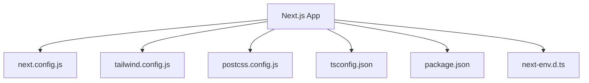
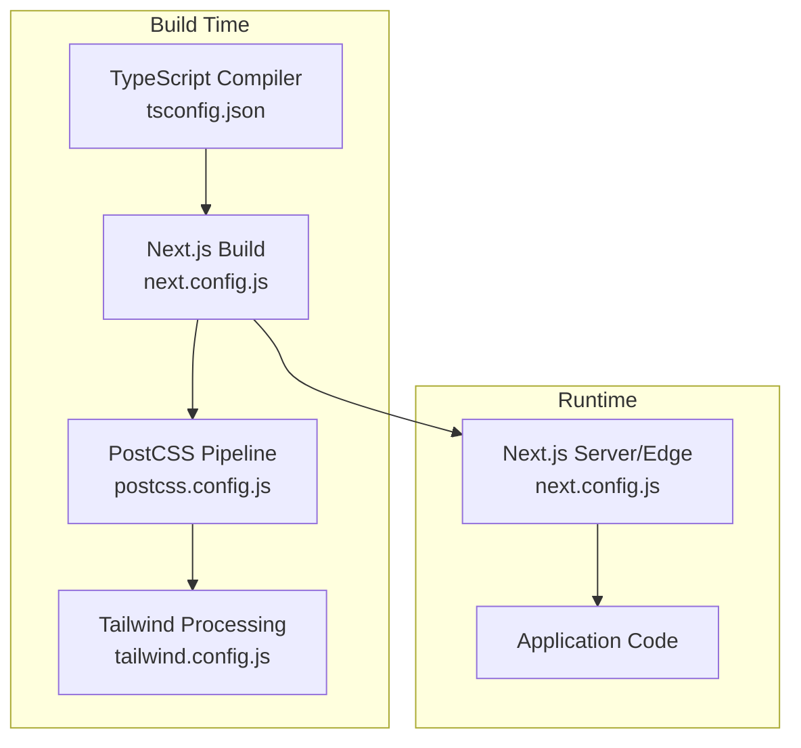
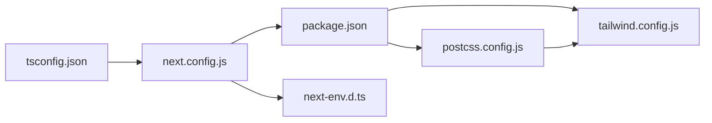

# Configuration and Deployment

<cite>
**Referenced Files in This Document**
- [next.config.js](file://stepwise ai/app/next.config.js)
- [tailwind.config.js](file://stepwise ai/app/tailwind.config.js)
- [postcss.config.js](file://stepwise ai/app/postcss.config.js)
- [tsconfig.json](file://stepwise ai/app/tsconfig.json)
- [package.json](file://stepwise ai/app/package.json)
- [next-env.d.ts](file://stepwise ai/app/next-env.d.ts)
</cite>

## Table of Contents
1. [Introduction](#introduction)
2. [Project Structure](#project-structure)
3. [Core Components](#core-components)
4. [Architecture Overview](#architecture-overview)
5. [Detailed Component Analysis](#detailed-component-analysis)
6. [Dependency Analysis](#dependency-analysis)
7. [Performance Considerations](#performance-considerations)
8. [Troubleshooting Guide](#troubleshooting-guide)
9. [Conclusion](#conclusion)
10. [Appendices](#appendices)

## Introduction
This document provides comprehensive guidance for configuring and deploying StepWise AI in production environments. It covers Next.js configuration, environment variables, Tailwind CSS theming and responsive design, PostCSS processing pipeline, TypeScript compilation settings, build optimization, asset bundling, performance tuning, deployment options (Vercel, Docker, traditional servers), monitoring, logging, error tracking, performance monitoring, scaling, load balancing, and high availability considerations.

## Project Structure
StepWise AI is a Next.js application with the following relevant configuration files at the root of the app directory:
- next.config.js: Next.js runtime and build behavior
- tailwind.config.js: Design system, theme extensions, and content scanning
- postcss.config.js: CSS processing pipeline
- tsconfig.json: TypeScript compiler and module resolution
- package.json: Scripts, dependencies, and dev dependencies
- next-env.d.ts: Auto-generated types for environment variables

**Diagram sources**
- [next.config.js:1-7](file://stepwise ai/app/next.config.js#L1-L7)
- [tailwind.config.js:1-57](file://stepwise ai/app/tailwind.config.js#L1-L57)
- [postcss.config.js:1-7](file://stepwise ai/app/postcss.config.js#L1-L7)
- [tsconfig.json:1-22](file://stepwise ai/app/tsconfig.json#L1-L22)
- [package.json:1-28](file://stepwise ai/app/package.json#L1-L28)
- [next-env.d.ts](file://stepwise ai/app/next-env.d.ts)

**Section sources**
- [next.config.js:1-7](file://stepwise ai/app/next.config.js#L1-L7)
- [tailwind.config.js:1-57](file://stepwise ai/app/tailwind.config.js#L1-L57)
- [postcss.config.js:1-7](file://stepwise ai/app/postcss.config.js#L1-L7)
- [tsconfig.json:1-22](file://stepwise ai/app/tsconfig.json#L1-L22)
- [package.json:1-28](file://stepwise ai/app/package.json#L1-L28)
- [next-env.d.ts](file://stepwise ai/app/next-env.d.ts)

## Core Components
- Next.js Runtime and Build: Controlled by next.config.js to enable strict mode and other runtime behaviors.
- Design System: Tailwind CSS configured with custom brand and ink color palettes, typography, shadows, animations, and keyframes. Content scanning targets app and components directories.
- CSS Pipeline: PostCSS integrates Tailwind CSS and Autoprefixer for cross-browser compatibility.
- TypeScript: Strict type checking, ES modules, bundler module resolution, JSON imports, incremental builds, and path aliases.
- Scripts and Dependencies: Standard Next.js scripts for development, building, starting, linting, and type-checking; React and Next.js as core dependencies; Tailwind, PostCSS, Autoprefixer, and TypeScript as dev dependencies.

**Section sources**
- [next.config.js:1-7](file://stepwise ai/app/next.config.js#L1-L7)
- [tailwind.config.js:1-57](file://stepwise ai/app/tailwind.config.js#L1-L57)
- [postcss.config.js:1-7](file://stepwise ai/app/postcss.config.js#L1-L7)
- [tsconfig.json:1-22](file://stepwise ai/app/tsconfig.json#L1-L22)
- [package.json:1-28](file://stepwise ai/app/package.json#L1-L28)

## Architecture Overview
The build and runtime architecture centers on Next.js with Tailwind CSS and PostCSS for styling, and TypeScript for type safety. The configuration files coordinate how code is compiled, assets are processed, and the application runs in different environments.

**Diagram sources**
- [tsconfig.json:1-22](file://stepwise ai/app/tsconfig.json#L1-L22)
- [next.config.js:1-7](file://stepwise ai/app/next.config.js#L1-L7)
- [postcss.config.js:1-7](file://stepwise ai/app/postcss.config.js#L1-L7)
- [tailwind.config.js:1-57](file://stepwise ai/app/tailwind.config.js#L1-L57)

## Detailed Component Analysis

### Next.js Configuration
- Purpose: Controls runtime behavior and build-time options for Next.js.
- Key Settings:
  - React Strict Mode enabled for improved debugging and consistency.
- Production Notes:
  - Use environment variables to toggle features or set base paths.
  - Configure output, redirects, rewrites, headers, and compression via next.config.js when needed.
  - Integrate with Vercel’s environment variables for seamless deployments.

**Section sources**
- [next.config.js:1-7](file://stepwise ai/app/next.config.js#L1-L7)

### Tailwind CSS Configuration
- Purpose: Defines the design system, theme extensions, and content scanning rules.
- Theme Extensions:
  - Custom color scales for brand and ink.
  - Font family stack optimized for readability across platforms.
  - Custom box shadows for cards and panels.
  - Animations and keyframes for fade-in and slide-up effects.
- Content Scanning: Targets app and components directories to include only used styles in production.
- Dark Mode: Enabled via class strategy for consistent theme switching.

**Section sources**
- [tailwind.config.js:1-57](file://stepwise ai/app/tailwind.config.js#L1-L57)

### PostCSS Configuration
- Purpose: Orchestrates CSS processing using Tailwind CSS and Autoprefixer.
- Benefits:
  - Ensures cross-browser compatibility through vendor prefixing.
  - Integrates seamlessly with Tailwind’s utility-first approach.
- Extensibility: Additional plugins can be added to the pipeline as needed.

**Section sources**
- [postcss.config.js:1-7](file://stepwise ai/app/postcss.config.js#L1-L7)

### TypeScript Configuration
- Purpose: Configures compilation, type checking, and module resolution for the project.
- Key Settings:
  - Target ES2017 with DOM libraries for browser compatibility.
  - Strict mode enabled for robust type safety.
  - Module set to esnext with bundler module resolution for modern tooling.
  - JSON module support for importing configuration data.
  - Incremental builds for faster compile times.
  - Path alias @/* mapped to the project root for cleaner imports.
  - Next.js plugin included for enhanced integration.

**Section sources**
- [tsconfig.json:1-22](file://stepwise ai/app/tsconfig.json#L1-L22)

### Environment Variables
- Purpose: Provide runtime configuration without changing code.
- Usage:
  - Define variables in .env.local for local development.
  - Set environment-specific variables in CI/CD pipelines or hosting platforms (e.g., Vercel).
  - Access variables via process.env in server-side code or API routes.
- Type Safety:
  - next-env.d.ts provides auto-generated types for environment variables recognized by Next.js.

**Section sources**
- [next-env.d.ts](file://stepwise ai/app/next-env.d.ts)

### Scripts and Dependencies
- Purpose: Standardize development, build, and deployment workflows.
- Scripts:
  - Development server on port 3000.
  - Production build generation.
  - Production server start on port 3000.
  - Linting and type checking for quality assurance.
- Dependencies:
  - Next.js and React for application framework and UI.
  - Tailwind CSS, PostCSS, Autoprefixer, and TypeScript for styling and type safety.

**Section sources**
- [package.json:1-28](file://stepwise ai/app/package.json#L1-L28)

## Dependency Analysis
The configuration files form a cohesive dependency chain that influences how the application is built and run.

**Diagram sources**
- [tsconfig.json:1-22](file://stepwise ai/app/tsconfig.json#L1-L22)
- [next.config.js:1-7](file://stepwise ai/app/next.config.js#L1-L7)
- [package.json:1-28](file://stepwise ai/app/package.json#L1-L28)
- [tailwind.config.js:1-57](file://stepwise ai/app/tailwind.config.js#L1-L57)
- [postcss.config.js:1-7](file://stepwise ai/app/postcss.config.js#L1-L7)
- [next-env.d.ts](file://stepwise ai/app/next-env.d.ts)

**Section sources**
- [tsconfig.json:1-22](file://stepwise ai/app/tsconfig.json#L1-L22)
- [next.config.js:1-7](file://stepwise ai/app/next.config.js#L1-L7)
- [package.json:1-28](file://stepwise ai/app/package.json#L1-L28)
- [tailwind.config.js:1-57](file://stepwise ai/app/tailwind.config.js#L1-L57)
- [postcss.config.js:1-7](file://stepwise ai/app/postcss.config.js#L1-L7)
- [next-env.d.ts](file://stepwise ai/app/next-env.d.ts)

## Performance Considerations
- Build Optimization:
  - Enable incremental builds via TypeScript settings to speed up repeated builds.
  - Use Next.js production build to generate optimized static assets and server bundles.
- Asset Bundling:
  - Tailwind content scanning ensures only used styles are included, reducing bundle size.
  - PostCSS with Autoprefixer adds necessary prefixes without bloating CSS.
- Runtime Tuning:
  - Keep React Strict Mode enabled during development for better diagnostics.
  - Leverage environment variables to disable debug logs in production.
- Monitoring and Metrics:
  - Integrate performance monitoring tools (e.g., RUM, APM) via environment variables.
  - Track build metrics and bundle sizes in CI/CD pipelines.

[No sources needed since this section provides general guidance]

## Troubleshooting Guide
- Build Failures:
  - Verify TypeScript strict mode errors and fix type mismatches.
  - Ensure all imported modules resolve correctly with bundler module resolution.
- Styling Issues:
  - Confirm Tailwind content paths include all component directories.
  - Check PostCSS pipeline order and plugin versions for compatibility.
- Environment Variables:
  - Validate variable names and values in .env.local and platform-specific settings.
  - Use next-env.d.ts to ensure type-safe access to environment variables.
- Runtime Errors:
  - Inspect server logs for unhandled exceptions.
  - Use Next.js error boundaries and logging utilities to capture client-side issues.

**Section sources**
- [tsconfig.json:1-22](file://stepwise ai/app/tsconfig.json#L1-L22)
- [tailwind.config.js:1-57](file://stepwise ai/app/tailwind.config.js#L1-L57)
- [postcss.config.js:1-7](file://stepwise ai/app/postcss.config.js#L1-L7)
- [next-env.d.ts](file://stepwise ai/app/next-env.d.ts)

## Conclusion
StepWise AI’s configuration leverages Next.js, Tailwind CSS, PostCSS, and TypeScript to deliver a robust, scalable, and maintainable application. By carefully managing environment variables, optimizing builds, and integrating monitoring and logging, you can deploy confidently to Vercel, Docker, or traditional servers while ensuring high performance and reliability.

[No sources needed since this section summarizes without analyzing specific files]

## Appendices

### Environment-Specific Configurations
- Development:
  - Use .env.local for local secrets and endpoints.
  - Run development server with hot reloading.
- Staging:
  - Configure staging-specific environment variables in CI/CD or hosting platform.
  - Enable additional logging and feature flags for validation.
- Production:
  - Set production-only variables (API keys, base URLs, telemetry endpoints).
  - Disable debug modes and enable compression and caching where applicable.

[No sources needed since this section provides general guidance]

### Build Process and Asset Bundling
- Build Steps:
  - TypeScript compilation with strict checks and incremental builds.
  - Next.js build generates optimized bundles and static assets.
  - PostCSS processes CSS with Tailwind and Autoprefixer.
- Optimization Strategies:
  - Minify assets and enable gzip/brotli compression at the server level.
  - Use CDN for static assets and configure cache headers.

[No sources needed since this section provides general guidance]

### Deployment Options
- Vercel:
  - Connect repository and configure environment variables in the dashboard.
  - Utilize preview deployments for pull requests and production releases.
- Docker Containers:
  - Create a multi-stage Dockerfile to build Next.js and serve with Node.js.
  - Expose port 3000 and manage environment variables via container orchestration.
- Traditional Servers:
  - Install Node.js, install dependencies, run production build, and start the server.
  - Use a reverse proxy (Nginx/Apache) for SSL termination and load balancing.

[No sources needed since this section provides general guidance]

### Monitoring, Logging, and Error Tracking
- Logging:
  - Centralize logs using structured logging libraries and ship to log aggregators.
  - Separate request logs from application logs for clarity.
- Error Tracking:
  - Integrate error tracking services to capture stack traces and context.
  - Mask sensitive information in error reports.
- Performance Monitoring:
  - Implement real-user monitoring and server-side metrics collection.
  - Set alerts for latency spikes and error rate increases.

[No sources needed since this section provides general guidance]

### Scaling, Load Balancing, and High Availability
- Scaling:
  - Scale horizontally by running multiple instances behind a load balancer.
  - Use auto-scaling policies based on CPU, memory, and request rates.
- Load Balancing:
  - Configure health checks and session affinity if required.
  - Distribute traffic evenly across healthy instances.
- High Availability:
  - Deploy across multiple regions or availability zones.
  - Implement database read replicas and caching layers to reduce load.

[No sources needed since this section provides general guidance]