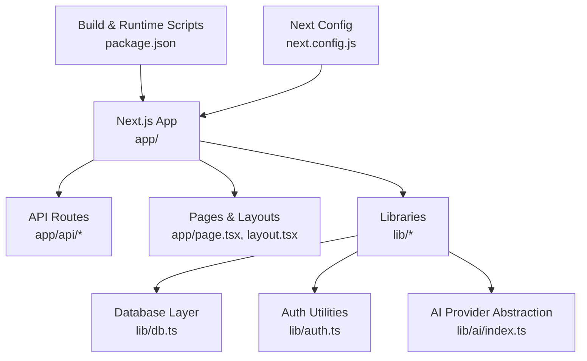
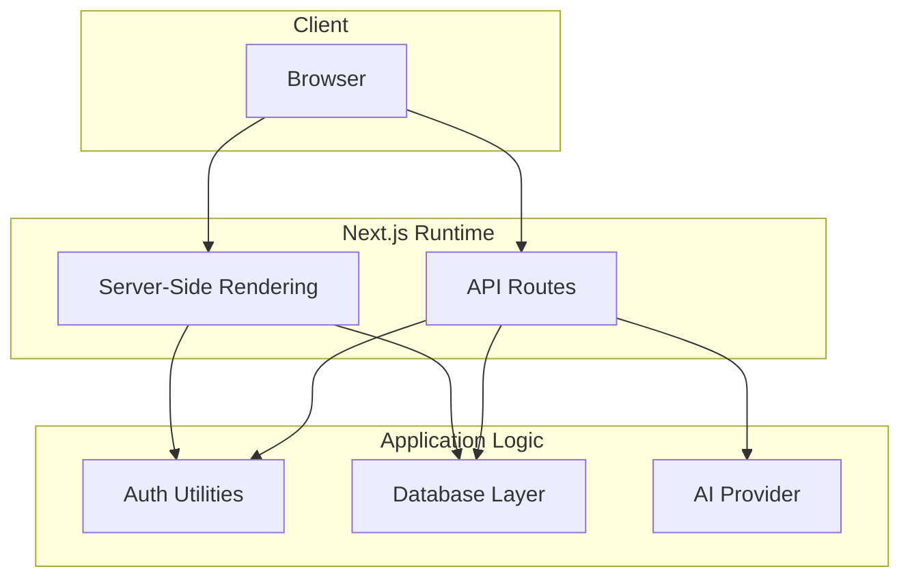
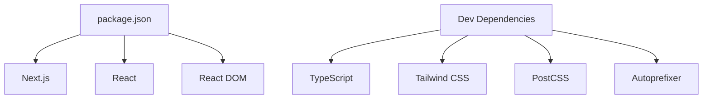

# Deployment Strategies

<cite>
**Referenced Files in This Document**
- [package.json](file://stepwise ai/app/package.json)
- [next.config.js](file://stepwise ai/app/next.config.js)
- [db.ts](file://stepwise ai/app/lib/db.ts)
- [auth.ts](file://stepwise ai/app/lib/auth.ts)
- [index.ts](file://stepwise ai/app/lib/ai/index.ts)
- [.gitignore](file://stepwise ai/app/.gitignore)
</cite>

## Table of Contents
1. Introduction
2. Project Structure
3. Core Components
4. Architecture Overview
5. Detailed Component Analysis
6. Dependency Analysis
7. Performance Considerations
8. Troubleshooting Guide
9. Conclusion
10. Appendices

## Introduction
This document provides comprehensive deployment guidance for StepWise AI across multiple platforms and environments. It covers:
- Vercel platform deployment with automatic builds and optimizations
- Docker containerization for self-hosted deployments
- Traditional Node.js server deployments
It also explains build artifacts, static asset handling, server-side rendering configuration, scaling strategies, high availability, monitoring and logging, error tracking, performance monitoring, CI/CD pipeline configuration, automated testing, and rollback strategies.

## Project Structure
StepWise AI is a Next.js application using the App Router and API routes. The project includes:
- Application code under app/ (pages, API routes, components, lib)
- Build and runtime scripts defined in package.json
- Minimal Next.js configuration in next.config.js
- Embedded JSON-based database layer with file persistence
- Authentication utilities using signed session cookies
- AI provider abstraction to switch between demo and real providers

**Diagram sources**
- [package.json:6-11](file://stepwise ai/app/package.json#L6-L11)
- [next.config.js:1-7](file://stepwise ai/app/next.config.js#L1-L7)
- [db.ts:1-13](file://stepwise ai/app/lib/db.ts#L1-L13)
- [auth.ts:1-10](file://stepwise ai/app/lib/auth.ts#L1-L10)
- [index.ts:1-26](file://stepwise ai/app/lib/ai/index.ts#L1-L26)

**Section sources**
- [package.json:1-28](file://stepwise ai/app/package.json#L1-L28)
- [next.config.js:1-7](file://stepwise ai/app/next.config.js#L1-L7)
- [db.ts:1-224](file://stepwise ai/app/lib/db.ts#L1-L224)
- [auth.ts:1-138](file://stepwise ai/app/lib/auth.ts#L1-L138)
- [index.ts:1-26](file://stepwise ai/app/lib/ai/index.ts#L1-L26)

## Core Components
- Next.js runtime and build system: Provides development, build, and production start commands.
- Database layer: Embedded JSON store with atomic writes and transaction support; designed to be swappable for PostgreSQL in production.
- Authentication: Secure password hashing, signed session cookies, and session management via DB-backed sessions.
- AI provider abstraction: Centralized selection of AI provider based on environment variables.

Key responsibilities:
- Build artifacts and static assets are produced by Next.js during build and served at runtime.
- Server-side rendering is enabled by default in Next.js App Router.
- Environment-driven behavior for secrets and feature toggles.

**Section sources**
- [package.json:6-11](file://stepwise ai/app/package.json#L6-L11)
- [db.ts:1-13](file://stepwise ai/app/lib/db.ts#L1-L13)
- [auth.ts:1-10](file://stepwise ai/app/lib/auth.ts#L1-L10)
- [index.ts:1-26](file://stepwise ai/app/lib/ai/index.ts#L1-L26)

## Architecture Overview
The application follows a standard Next.js architecture:
- Client requests hit Next.js serverless or server functions (API routes).
- Business logic resides in lib modules (database, auth, AI).
- Data persistence uses an embedded JSON file by default, with a clear path to swap to PostgreSQL.
- Authentication relies on signed cookies and server-side session validation.

**Diagram sources**
- [next.config.js:1-7](file://stepwise ai/app/next.config.js#L1-L7)
- [auth.ts:46-67](file://stepwise ai/app/lib/auth.ts#L46-L67)
- [db.ts:123-199](file://stepwise ai/app/lib/db.ts#L123-L199)
- [index.ts:12-21](file://stepwise ai/app/lib/ai/index.ts#L12-L21)

## Detailed Component Analysis

### Next.js Build and Runtime
- Development: Runs a local dev server with hot reloading.
- Build: Produces optimized production artifacts including server bundles and static assets.
- Start: Serves the built application in production mode.

Operational notes:
- Ensure environment variables are set before starting the production server.
- Static assets and server bundles are managed automatically by Next.js.

**Section sources**
- [package.json:6-11](file://stepwise ai/app/package.json#L6-L11)
- [next.config.js:1-7](file://stepwise ai/app/next.config.js#L1-L7)

### Database Layer
- Storage: JSON file with atomic write semantics (write to temp file then rename).
- Transactions: Multi-step operations commit once at the end or discard on error.
- Swappable design: Comments indicate the production target is PostgreSQL; swapping requires reimplementing this module’s interface.

Deployment implications:
- For single-node deployments, the JSON file works well if the data directory is persistent.
- For multi-instance deployments, use a shared filesystem or migrate to PostgreSQL to avoid concurrent write conflicts.

**Section sources**
- [db.ts:1-13](file://stepwise ai/app/lib/db.ts#L1-L13)
- [db.ts:66-94](file://stepwise ai/app/lib/db.ts#L66-L94)
- [db.ts:183-199](file://stepwise ai/app/lib/db.ts#L183-L199)

### Authentication
- Password hashing: Uses secure hashing with salt and timing-safe comparison.
- Session management: Creates signed tokens stored in httpOnly cookies; sessions persisted in DB with expiration.
- Security: Enforces secure cookie flags in production and validates signatures server-side.

Operational notes:
- Requires a strong secret configured via environment variable.
- Sessions are validated against DB entries and expired sessions are cleaned up.

**Section sources**
- [auth.ts:24-40](file://stepwise ai/app/lib/auth.ts#L24-L40)
- [auth.ts:46-67](file://stepwise ai/app/lib/auth.ts#L46-L67)
- [auth.ts:79-102](file://stepwise ai/app/lib/auth.ts#L79-L102)

### AI Provider Abstraction
- Selection: Chooses provider based on environment variables; defaults to demo when not configured.
- Extensibility: New providers can be added and selected via configuration without changing application code.

Operational notes:
- Ensure required API keys are set for production providers.
- Demo mode is useful for development and non-production environments.

**Section sources**
- [index.ts:12-21](file://stepwise ai/app/lib/ai/index.ts#L12-L21)
- [index.ts:23-26](file://stepwise ai/app/lib/ai/index.ts#L23-L26)

### API Routes and SSR
- API routes handle authentication endpoints and business operations.
- Pages and layouts leverage Next.js App Router for server-side rendering and routing.

Operational notes:
- Keep API routes stateless where possible to scale horizontally.
- Use environment variables for sensitive configuration.

**Section sources**
- [next.config.js:1-7](file://stepwise ai/app/next.config.js#L1-L7)
- [package.json:6-11](file://stepwise ai/app/package.json#L6-L11)

## Dependency Analysis
Core runtime dependencies include Next.js, React, and React DOM. Development dependencies cover TypeScript, Tailwind CSS, PostCSS, and Autoprefixer. These define the build and runtime requirements for deployment.

**Diagram sources**
- [package.json:13-26](file://stepwise ai/app/package.json#L13-L26)

**Section sources**
- [package.json:13-26](file://stepwise ai/app/package.json#L13-L26)

## Performance Considerations
- Build-time optimizations: Next.js automatically optimizes server bundles and static assets during build.
- Caching: Leverage browser caching for static assets; configure CDN if serving from external origins.
- Database: For high concurrency, replace the embedded JSON store with a proper relational database (e.g., PostgreSQL) as indicated by the design comments.
- Concurrency: Avoid long-running synchronous operations in request handlers; offload heavy tasks to background jobs if needed.
- Scaling: Stateless API routes enable horizontal scaling behind a load balancer.

[No sources needed since this section provides general guidance]

## Troubleshooting Guide
Common issues and resolutions:
- Missing secrets: Ensure AUTH_SECRET and any provider-specific keys are set in the environment.
- Database file permissions: Verify that the process has read/write access to the data directory.
- Cookie security: In production, ensure HTTPS is used so secure cookies are enforced.
- AI provider errors: Confirm provider keys and network access; fall back to demo mode for debugging.

Operational checks:
- Validate environment variables at startup.
- Monitor logs for authentication failures and database errors.
- Test API routes independently to isolate issues.

**Section sources**
- [auth.ts:12-22](file://stepwise ai/app/lib/auth.ts#L12-L22)
- [db.ts:66-94](file://stepwise ai/app/lib/db.ts#L66-L94)
- [index.ts:12-21](file://stepwise ai/app/lib/ai/index.ts#L12-L21)

## Conclusion
StepWise AI is a Next.js application with a modular architecture suitable for multiple deployment targets. Its embedded database layer is intentionally swappable, enabling migration to PostgreSQL for production scalability. Authentication and AI provider abstractions simplify configuration and enhance security. With proper environment setup, CI/CD automation, and observability, the application can be deployed reliably on Vercel, Docker containers, or traditional Node.js servers.

[No sources needed since this section summarizes without analyzing specific files]

## Appendices

### Vercel Platform Deployment
- Automatic builds: Push to your repository; Vercel detects Next.js and runs the build script automatically.
- Environment variables: Configure AUTH_SECRET and AI provider keys in Vercel settings.
- Optimizations: Next.js handles static asset optimization and serverless function bundling.
- Rollback: Use Vercel’s preview deployments and rollbacks to previous versions.

[No sources needed since this section provides general guidance]

### Docker Containerization
- Base image: Use a Node.js LTS image aligned with the project’s engine requirements.
- Build steps: Install dependencies, run type checks, and build the Next.js app.
- Runtime: Expose port 3000 and run the production server.
- Persistence: Mount a volume for the data directory to persist the embedded database file.
- Secrets: Inject secrets via environment variables at runtime.

[No sources needed since this section provides general guidance]

### Traditional Node.js Server Deployment
- Requirements: Node.js runtime compatible with the project’s dependencies.
- Commands: Use the provided build and start scripts to generate and serve production artifacts.
- Environment: Set necessary environment variables before starting the server.
- Process management: Use a process manager (e.g., PM2) to manage restarts and logs.

**Section sources**
- [package.json:6-11](file://stepwise ai/app/package.json#L6-L11)

### Build Artifacts and Static Asset Handling
- Artifacts: Next.js produces server bundles and static assets during build.
- Serving: The production server serves both dynamic routes and static assets.
- Optimization: Assets are minified and hashed for caching; configure CDN for global distribution.

**Section sources**
- [package.json:6-11](file://stepwise ai/app/package.json#L6-L11)
- [next.config.js:1-7](file://stepwise ai/app/next.config.js#L1-L7)

### Server-Side Rendering Configuration
- Default behavior: Next.js App Router enables SSR out of the box.
- Strict mode: React strict mode is enabled in configuration for improved development experience.
- Customization: Extend next.config.js for advanced SSR settings if needed.

**Section sources**
- [next.config.js:1-7](file://stepwise ai/app/next.config.js#L1-L7)

### Scaling Considerations and High Availability
- Horizontal scaling: Deploy multiple instances behind a load balancer; keep API routes stateless.
- Database: Migrate to PostgreSQL for multi-instance consistency and durability.
- Session storage: Consider externalizing sessions to a distributed store if needed.
- Health checks: Implement health endpoints to support rolling updates and auto-restarts.

[No sources needed since this section provides general guidance]

### Monitoring and Logging
- Logs: Capture application logs from the Node.js process; forward to centralized logging.
- Metrics: Track request latency, error rates, and resource usage.
- Error tracking: Integrate an error tracking service to capture unhandled exceptions.
- Observability: Add structured logging and correlation IDs for request tracing.

[No sources needed since this section provides general guidance]

### CI/CD Pipeline Configuration
- Stages: Lint, type check, unit tests, build, and deploy.
- Caching: Cache node_modules and build artifacts to speed up pipelines.
- Secrets: Store secrets in CI/CD vaults; inject into deployment environments.
- Quality gates: Enforce passing tests and linting before merging.

[No sources needed since this section provides general guidance]

### Automated Testing in Deployment Pipelines
- Unit tests: Run framework and library tests.
- Integration tests: Exercise API routes against a test database.
- End-to-end tests: Execute critical user flows in a staging-like environment.
- Reporting: Publish test results and coverage reports.

[No sources needed since this section provides general guidance]

### Rollback Strategies for Production Deployments
- Versioned deployments: Maintain previous versions for quick rollback.
- Blue/green or canary: Gradually shift traffic to new versions and revert if issues arise.
- Database migrations: Ensure backward-compatible migrations and provide rollback scripts.
- Feature flags: Toggle features without redeploying to mitigate risk.

[No sources needed since this section provides general guidance]