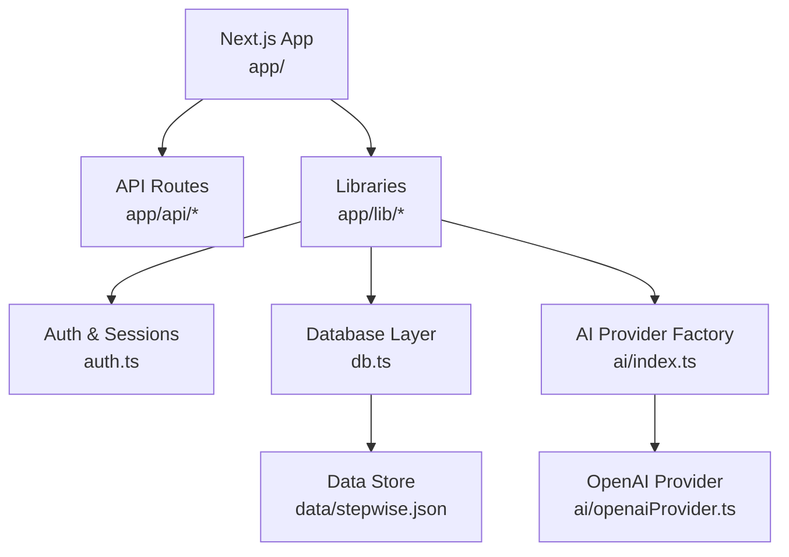
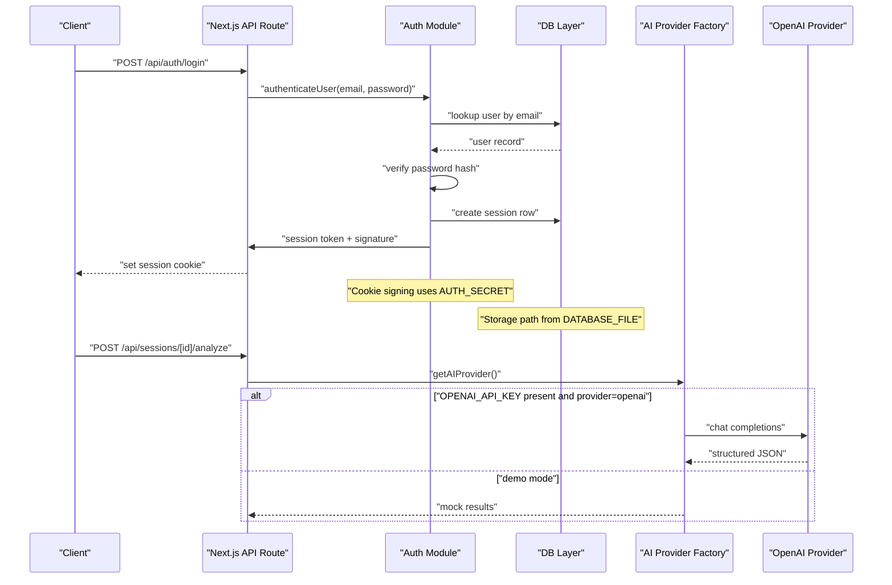
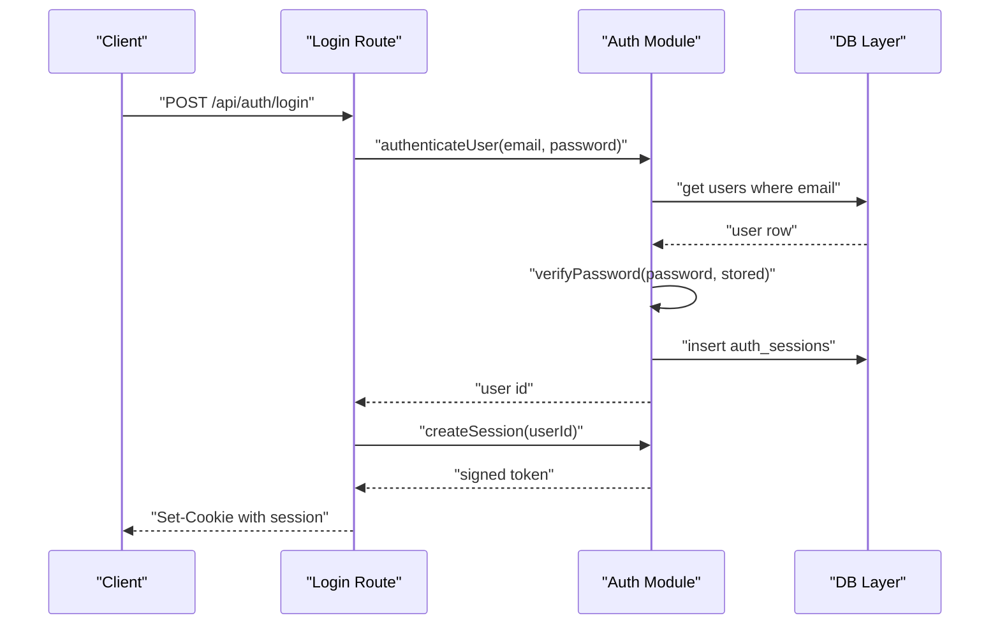
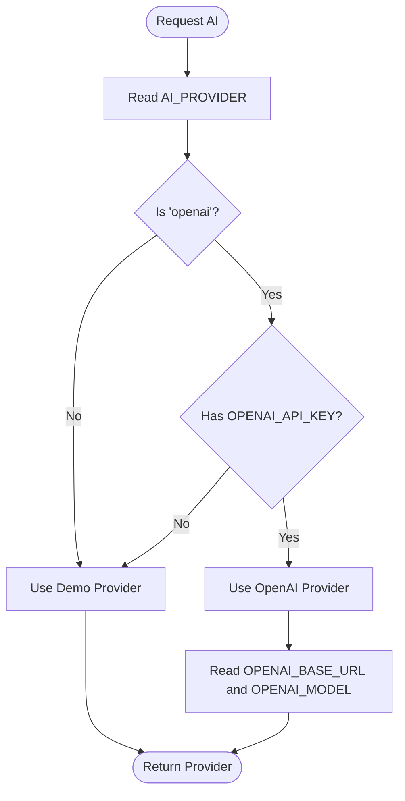
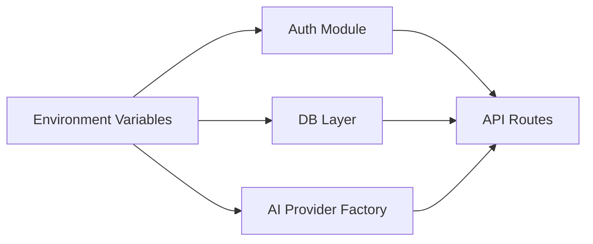

# Environment Setup

<cite>
**Referenced Files in This Document**
- [package.json](file://stepwise ai/app/package.json)
- [next.config.js](file://stepwise ai/app/next.config.js)
- [db.ts](file://stepwise ai/app/lib/db.ts)
- [auth.ts](file://stepwise ai/app/lib/auth.ts)
- [index.ts](file://stepwise ai/app/lib/ai/index.ts)
- [openaiProvider.ts](file://stepwise ai/app/lib/ai/openaiProvider.ts)
- [apiHelpers.ts](file://stepwise ai/app/lib/apiHelpers.ts)
- [types.ts](file://stepwise ai/app/lib/types.ts)
- [.gitignore](file://stepwise ai/app/.gitignore)
</cite>

## Table of Contents
1. Introduction
2. Project Structure
3. Core Components
4. Architecture Overview
5. Detailed Component Analysis
6. Dependency Analysis
7. Performance Considerations
8. Troubleshooting Guide
9. Conclusion

## Introduction
This document explains how to set up and configure StepWise AI for local development, staging, and production. It covers all environment variables used by the application, including authentication secrets, database storage location, and AI service integration. It also provides security best practices for managing sensitive configuration data, default values, validation behavior, and troubleshooting steps for common configuration issues.

## Project Structure
StepWise AI is a Next.js application with server-side logic in API routes and shared libraries under app/lib. Configuration is primarily driven by environment variables read at runtime:
- Authentication and session signing use a secret stored in an environment variable.
- Database persistence uses a file-based JSON store whose path can be configured via an environment variable.
- AI provider selection and credentials are controlled by environment variables.
- The project ignores local environment files from version control to prevent accidental leaks.

**Diagram sources**
- [next.config.js:1-7](file://stepwise ai/app/next.config.js#L1-L7)
- [auth.ts:12-67](file://stepwise ai/app/lib/auth.ts#L12-L67)
- [db.ts:61-94](file://stepwise ai/app/lib/db.ts#L61-L94)
- [index.ts:12-20](file://stepwise ai/app/lib/ai/index.ts#L12-L20)
- [openaiProvider.ts:24-31](file://stepwise ai/app/lib/ai/openaiProvider.ts#L24-L31)

**Section sources**
- [package.json:6-11](file://stepwise ai/app/package.json#L6-L11)
- [next.config.js:1-7](file://stepwise ai/app/next.config.js#L1-L7)
- [.gitignore:1-10](file://stepwise ai/app/.gitignore#L1-L10)

## Core Components
This section summarizes the environment-driven components that require configuration:

- Authentication and sessions
  - Uses a secret to sign session cookies.
  - Enforces secure cookie settings in production.
  - Requires a long random secret in production; development allows a fallback.

- Database layer
  - Stores data in a JSON file under the data directory.
  - Path is configurable via an environment variable; defaults to a relative path.
  - Writes are atomic using a temporary file and rename.

- AI provider integration
  - Chooses between a demo provider and an OpenAI-compatible provider based on environment variables.
  - When enabled, requires an API key and supports custom base URL and model name.

- API helpers and types
  - Provide consistent error envelopes and input sanitization utilities.
  - Define domain types used across the application.

**Section sources**
- [auth.ts:12-67](file://stepwise ai/app/lib/auth.ts#L12-L67)
- [db.ts:61-94](file://stepwise ai/app/lib/db.ts#L61-L94)
- [index.ts:12-20](file://stepwise ai/app/lib/ai/index.ts#L12-L20)
- [openaiProvider.ts:24-31](file://stepwise ai/app/lib/ai/openaiProvider.ts#L24-L31)
- [apiHelpers.ts:8-30](file://stepwise ai/app/lib/apiHelpers.ts#L8-L30)
- [types.ts:252-302](file://stepwise ai/app/lib/types.ts#L252-L302)

## Architecture Overview
The following diagram shows how environment variables influence runtime behavior across authentication, storage, and AI services.

**Diagram sources**
- [auth.ts:12-67](file://stepwise ai/app/lib/auth.ts#L12-L67)
- [db.ts:61-94](file://stepwise ai/app/lib/db.ts#L61-L94)
- [index.ts:12-20](file://stepwise ai/app/lib/ai/index.ts#L12-L20)
- [openaiProvider.ts:24-31](file://stepwise ai/app/lib/ai/openaiProvider.ts#L24-L31)

## Detailed Component Analysis

### Environment Variables Reference
- AUTH_SECRET
  - Purpose: Secret used to sign session cookies.
  - Required: Yes in production; missing or placeholder triggers a hard failure in production.
  - Default: Development allows a deterministic insecure value when not set.
  - Validation: Checked before signing tokens; errors if invalid in production.
  - Security: Must be a long, random string in production. Never commit secrets to source control.

- NODE_ENV
  - Purpose: Runtime environment indicator (development, production).
  - Used by: Cookie secure flag and auth secret validation.
  - Behavior: In production, sets secure cookies and enforces strict secret requirements.

- DATABASE_FILE
  - Purpose: Path to the JSON data store file.
  - Default: Relative path resolved to ./data/stepwise.db (converted to .json).
  - Behavior: Directory is created if missing; writes are atomic via temp file + rename.

- AI_PROVIDER
  - Purpose: Selects active AI provider.
  - Values: openai enables OpenAI-compatible provider; any other value falls back to demo.
  - Default: mock (demo mode).

- OPENAI_API_KEY
  - Purpose: API key for OpenAI-compatible provider.
  - Required: Yes when AI_PROVIDER is set to openai.
  - Validation: Missing key throws an error when attempting to use the provider.

- OPENAI_BASE_URL
  - Purpose: Base URL for the chat completions endpoint.
  - Default: https://api.openai.com/v1
  - Behavior: Trailing slash is removed automatically.

- OPENAI_MODEL
  - Purpose: Model name used for requests.
  - Default: gpt-4o-mini

- Additional Notes
  - Sensitive files such as .env.local and data directories are ignored by version control.
  - All environment reads occur server-side; no client exposure of secrets.

**Section sources**
- [auth.ts:12-22](file://stepwise ai/app/lib/auth.ts#L12-L22)
- [auth.ts:59-67](file://stepwise ai/app/lib/auth.ts#L59-L67)
- [db.ts:61-71](file://stepwise ai/app/lib/db.ts#L61-L71)
- [db.ts:88-94](file://stepwise ai/app/lib/db.ts#L88-L94)
- [index.ts:12-20](file://stepwise ai/app/lib/ai/index.ts#L12-L20)
- [openaiProvider.ts:24-31](file://stepwise ai/app/lib/ai/openaiProvider.ts#L24-L31)
- [.gitignore:1-10](file://stepwise ai/app/.gitignore#L1-L10)

### Local Development Setup
- Install dependencies and start the dev server using the scripts defined in package.json.
- Create a local environment file to hold secrets and configuration. Ensure it is ignored by version control.
- Set required variables for local development:
  - AUTH_SECRET: Can be any string locally; ensure it is not committed.
  - DATABASE_FILE: Optional; defaults to a local JSON file under data/.
  - AI_PROVIDER: Leave unset or set to a non-openai value to use demo mode.
- Start the application and verify login/signup flows and AI features in demo mode.

**Section sources**
- [package.json:6-11](file://stepwise ai/app/package.json#L6-L11)
- [.gitignore:7-8](file://stepwise ai/app/.gitignore#L7-L8)
- [auth.ts:12-22](file://stepwise ai/app/lib/auth.ts#L12-L22)
- [db.ts:61-71](file://stepwise ai/app/lib/db.ts#L61-L71)
- [index.ts:12-20](file://stepwise ai/app/lib/ai/index.ts#L12-L20)

### Staging and Production Configuration
- Set NODE_ENV to production to enable secure cookie flags and strict secret checks.
- Configure AUTH_SECRET to a strong, randomly generated value.
- Configure DATABASE_FILE to a persistent, backed-up location suitable for production workloads.
- If using the OpenAI-compatible provider:
  - Set AI_PROVIDER to openai.
  - Set OPENAI_API_KEY to a valid key.
  - Optionally set OPENAI_BASE_URL and OPENAI_MODEL to match your deployment needs.
- Ensure environment files are managed by your deployment platform and never committed to repositories.

**Section sources**
- [auth.ts:12-22](file://stepwise ai/app/lib/auth.ts#L12-L22)
- [auth.ts:59-67](file://stepwise ai/app/lib/auth.ts#L59-L67)
- [db.ts:61-71](file://stepwise ai/app/lib/db.ts#L61-L71)
- [index.ts:12-20](file://stepwise ai/app/lib/ai/index.ts#L12-L20)
- [openaiProvider.ts:24-31](file://stepwise ai/app/lib/ai/openaiProvider.ts#L24-L31)

### Security Best Practices
- Secrets Management
  - Use a secrets manager or platform-provided environment injection for AUTH_SECRET and OPENAI_API_KEY.
  - Rotate secrets regularly and revoke compromised keys immediately.
  - Never include secrets in code, logs, or error messages.

- Least Privilege
  - Limit access to environment variables to only the processes that need them.
  - Restrict filesystem permissions for the data directory and storage file.

- Secure Defaults
  - Rely on production-enforced secure cookie settings.
  - Validate and sanitize all inputs through provided helpers to avoid injection risks.

- Audit and Monitoring
  - Log configuration availability without exposing values.
  - Monitor for failed authentication due to missing or invalid secrets.

**Section sources**
- [auth.ts:12-22](file://stepwise ai/app/lib/auth.ts#L12-L22)
- [auth.ts:59-67](file://stepwise ai/app/lib/auth.ts#L59-L67)
- [apiHelpers.ts:8-30](file://stepwise ai/app/lib/apiHelpers.ts#L8-L30)
- [.gitignore:1-10](file://stepwise ai/app/.gitignore#L1-L10)

### Environment Variable Validation and Defaults
- AUTH_SECRET
  - Validation: Throws an error in production if missing or placeholder.
  - Default: Development allows a deterministic insecure value when not set.

- DATABASE_FILE
  - Default: Resolves to a JSON file under data/ with a .db suffix converted to .json.
  - Validation: Ensures directory exists; writes atomically to prevent corruption.

- AI_PROVIDER, OPENAI_API_KEY, OPENAI_BASE_URL, OPENAI_MODEL
  - Validation: Missing OPENAI_API_KEY when using openai provider causes an error.
  - Defaults: Demo mode when provider is not openai or key is missing; default base URL and model applied otherwise.

**Section sources**
- [auth.ts:12-22](file://stepwise ai/app/lib/auth.ts#L12-L22)
- [db.ts:61-71](file://stepwise ai/app/lib/db.ts#L61-L71)
- [db.ts:88-94](file://stepwise ai/app/lib/db.ts#L88-L94)
- [index.ts:12-20](file://stepwise ai/app/lib/ai/index.ts#L12-L20)
- [openaiProvider.ts:24-31](file://stepwise ai/app/lib/ai/openaiProvider.ts#L24-L31)

### Data Flow: Login and Session Creation

**Diagram sources**
- [auth.ts:12-67](file://stepwise ai/app/lib/auth.ts#L12-L67)
- [db.ts:147-159](file://stepwise ai/app/lib/db.ts#L147-L159)

### Data Flow: AI Provider Selection

**Diagram sources**
- [index.ts:12-20](file://stepwise ai/app/lib/ai/index.ts#L12-L20)
- [openaiProvider.ts:24-31](file://stepwise ai/app/lib/ai/openaiProvider.ts#L24-L31)

## Dependency Analysis
Environment variables drive module behavior and coupling:
- Auth depends on AUTH_SECRET and NODE_ENV for secure session handling.
- DB depends on DATABASE_FILE for storage location.
- AI factory depends on AI_PROVIDER and OPENAI_* variables to select and configure providers.
- API helpers provide consistent error responses and input sanitization used across routes.

**Diagram sources**
- [auth.ts:12-67](file://stepwise ai/app/lib/auth.ts#L12-L67)
- [db.ts:61-94](file://stepwise ai/app/lib/db.ts#L61-L94)
- [index.ts:12-20](file://stepwise ai/app/lib/ai/index.ts#L12-L20)

**Section sources**
- [auth.ts:12-67](file://stepwise ai/app/lib/auth.ts#L12-L67)
- [db.ts:61-94](file://stepwise ai/app/lib/db.ts#L61-L94)
- [index.ts:12-20](file://stepwise ai/app/lib/ai/index.ts#L12-L20)
- [apiHelpers.ts:8-30](file://stepwise ai/app/lib/apiHelpers.ts#L8-L30)

## Performance Considerations
- Storage I/O
  - The JSON store performs synchronous reads/writes per operation; consider scaling to a real database for high concurrency.
  - Atomic writes reduce corruption risk but may still bottleneck under heavy load.

- AI Requests
  - Network latency and rate limits apply when using external providers; cache results where appropriate.
  - Sanitization and schema enforcement add CPU overhead; keep payloads minimal.

- Cookies and Sessions
  - Secure cookies in production reduce exposure but require HTTPS.
  - Session rows grow over time; implement cleanup policies for expired sessions.

[No sources needed since this section provides general guidance]

## Troubleshooting Guide
Common configuration issues and resolutions:

- Missing or invalid AUTH_SECRET in production
  - Symptom: Application fails during session operations.
  - Resolution: Set a strong, random AUTH_SECRET in your environment.

- Database file not found or permission errors
  - Symptom: Errors reading or writing the data store.
  - Resolution: Ensure DATABASE_FILE points to a writable path; create the data directory if necessary.

- AI provider not available
  - Symptom: Errors when calling AI functions.
  - Resolution: Set AI_PROVIDER to openai and provide OPENAI_API_KEY; optionally configure OPENAI_BASE_URL and OPENAI_MODEL.

- Demo mode unexpectedly active
  - Symptom: AI features return mock data.
  - Resolution: Verify AI_PROVIDER and OPENAI_API_KEY are correctly set.

- Cookie not set or rejected by browser
  - Symptom: Cannot stay logged in.
  - Resolution: Ensure NODE_ENV is set to production for secure cookies and that the site is served over HTTPS.

- Accidental secret exposure
  - Symptom: Secrets appear in repository or logs.
  - Resolution: Remove secrets from code and logs; use .env.local and platform secrets management; confirm .gitignore excludes sensitive files.

**Section sources**
- [auth.ts:12-22](file://stepwise ai/app/lib/auth.ts#L12-L22)
- [auth.ts:59-67](file://stepwise ai/app/lib/auth.ts#L59-L67)
- [db.ts:61-71](file://stepwise ai/app/lib/db.ts#L61-L71)
- [db.ts:88-94](file://stepwise ai/app/lib/db.ts#L88-L94)
- [index.ts:12-20](file://stepwise ai/app/lib/ai/index.ts#L12-L20)
- [openaiProvider.ts:24-31](file://stepwise ai/app/lib/ai/openaiProvider.ts#L24-L31)
- [.gitignore:1-10](file://stepwise ai/app/.gitignore#L1-L10)

## Conclusion
StepWise AI’s environment setup centers on a small set of well-defined variables controlling authentication, storage, and AI integration. By configuring AUTH_SECRET, DATABASE_FILE, and AI provider settings appropriately per environment, you can run the application securely in development, staging, and production. Follow the security best practices, validate environment inputs, and use the troubleshooting guide to resolve common issues quickly.