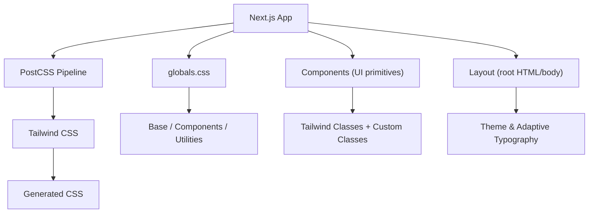
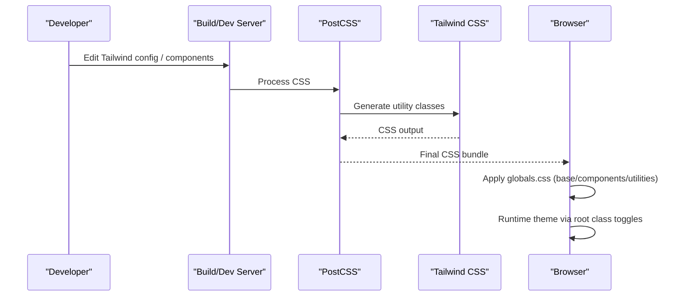
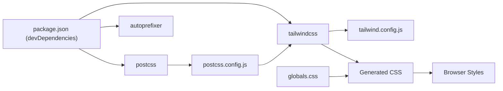

# Styling Configuration

<cite>
**Referenced Files in This Document**
- [tailwind.config.js](file://stepwise ai/app/tailwind.config.js)
- [postcss.config.js](file://stepwise ai/app/postcss.config.js)
- [globals.css](file://stepwise ai/app/app/globals.css)
- [layout.tsx](file://stepwise ai/app/app/layout.tsx)
- [ui.tsx](file://stepwise ai/app/components/ui.tsx)
- [Shell.tsx](file://stepwise ai/app/components/Shell.tsx)
- [Board.tsx](file://stepwise ai/app/components/board/Board.tsx)
- [package.json](file://stepwise ai/app/package.json)
</cite>

## Table of Contents
1. [Introduction](#introduction)
2. [Project Structure](#project-structure)
3. [Core Components](#core-components)
4. [Architecture Overview](#architecture-overview)
5. [Detailed Component Analysis](#detailed-component-analysis)
6. [Dependency Analysis](#dependency-analysis)
7. [Performance Considerations](#performance-considerations)
8. [Troubleshooting Guide](#troubleshooting-guide)
9. [Conclusion](#conclusion)

## Introduction
This document explains the styling configuration for StepWise AI, focusing on Tailwind CSS setup, PostCSS processing, global styles, component-level styling patterns, responsive design, and guidelines to extend the design system while maintaining visual consistency. It also covers performance considerations for CSS bundling and loading optimization.

## Project Structure
StepWise AI uses a Next.js app with:
- Tailwind CSS configured via tailwind.config.js
- PostCSS pipeline with autoprefixer for cross-browser compatibility
- Global styles defined in globals.css
- Shared UI primitives in components/ui.tsx
- App shell that applies theme and adaptive typography classes
- Feature components (e.g., Board) using Tailwind utilities and custom classes

**Diagram sources**
- [postcss.config.js:1-7](file://stepwise ai/app/postcss.config.js#L1-L7)
- [tailwind.config.js:1-57](file://stepwise ai/app/tailwind.config.js#L1-L57)
- [globals.css:1-67](file://stepwise ai/app/app/globals.css#L1-L67)
- [layout.tsx:1-17](file://stepwise ai/app/app/layout.tsx#L1-L17)
- [ui.tsx:1-218](file://stepwise ai/app/components/ui.tsx#L1-L218)
- [Shell.tsx:1-124](file://stepwise ai/app/components/Shell.tsx#L1-L124)

**Section sources**
- [postcss.config.js:1-7](file://stepwise ai/app/postcss.config.js#L1-L7)
- [tailwind.config.js:1-57](file://stepwise ai/app/tailwind.config.js#L1-L57)
- [globals.css:1-67](file://stepwise ai/app/app/globals.css#L1-L67)
- [layout.tsx:1-17](file://stepwise ai/app/app/layout.tsx#L1-L17)
- [ui.tsx:1-218](file://stepwise ai/app/components/ui.tsx#L1-L218)
- [Shell.tsx:1-124](file://stepwise ai/app/components/Shell.tsx#L1-L124)

## Core Components
- Tailwind configuration defines:
  - Content scanning paths for unused CSS elimination
  - Dark mode strategy
  - Extended color palette (brand, ink)
  - Font family
  - Custom shadows
  - Animations and keyframes
- PostCSS config wires Tailwind and Autoprefixer
- Global CSS sets base layers, CSS variables for board surface, body theming, focus states, reduced motion, and panel scrollbars
- UI primitives provide consistent Button, Card, Input, Textarea, Select, Badge, Spinner, Alert, EmptyState, DemoBanner
- Shell applies dark/light theme and adaptive typography based on user profile
- Board uses Tailwind utilities and custom classes for canvas and interactive elements

**Section sources**
- [tailwind.config.js:1-57](file://stepwise ai/app/tailwind.config.js#L1-L57)
- [postcss.config.js:1-7](file://stepwise ai/app/postcss.config.js#L1-L7)
- [globals.css:1-67](file://stepwise ai/app/app/globals.css#L1-L67)
- [ui.tsx:1-218](file://stepwise ai/app/components/ui.tsx#L1-L218)
- [Shell.tsx:1-124](file://stepwise ai/app/components/Shell.tsx#L1-L124)
- [Board.tsx:1-540](file://stepwise ai/app/components/board/Board.tsx#L1-L540)

## Architecture Overview
The styling architecture flows from configuration to generated CSS and runtime theme application:

**Diagram sources**
- [postcss.config.js:1-7](file://stepwise ai/app/postcss.config.js#L1-L7)
- [tailwind.config.js:1-57](file://stepwise ai/app/tailwind.config.js#L1-L57)
- [globals.css:1-67](file://stepwise ai/app/app/globals.css#L1-L67)
- [Shell.tsx:54-62](file://stepwise ai/app/components/Shell.tsx#L54-L62)

## Detailed Component Analysis

### Tailwind CSS Configuration
- Content scanning limits CSS generation to relevant files, reducing bundle size
- Dark mode is class-based; toggle via root element class
- Extended color tokens:
  - brand: 50–950 scale for primary actions and highlights
  - ink: 50–950 scale for text, borders, backgrounds
- Font family set to Inter with system fallbacks
- Custom shadows for cards and panels
- Animation utilities and keyframes for fade-in and slide-up transitions

Guidelines:
- Use brand and ink tokens consistently across components
- Prefer Tailwind utilities over custom CSS when possible
- Extend theme via the same file to keep design tokens centralized

**Section sources**
- [tailwind.config.js:1-57](file://stepwise ai/app/tailwind.config.js#L1-L57)

### PostCSS Configuration
- Uses Tailwind plugin to process utilities and components
- Autoprefixer ensures vendor prefixes for broad browser support

Guidelines:
- Keep plugins minimal to avoid build overhead
- Rely on Tailwind’s built-in modernization where applicable

**Section sources**
- [postcss.config.js:1-7](file://stepwise ai/app/postcss.config.js#L1-L7)

### Global CSS Structure
- Base layers include Tailwind base, components, and utilities
- CSS variables define board background and dot pattern colors for light/dark modes
- Body applies default theme colors and antialiasing
- Focus-visible outlines use brand color for accessibility
- Reduced motion media query disables animations/transitions for users who prefer it
- Custom .board-surface provides a dotted canvas background
- Adaptive typography helpers (.band-early, .band-young) adjust font sizes
- Panel scrollbar styling uses theme colors for light/dark modes

Guidelines:
- Add new global styles here only if they are truly global
- Prefer component-scoped styles or Tailwind utilities for local concerns
- Use CSS variables for theme-aware values that change at runtime

**Section sources**
- [globals.css:1-67](file://stepwise ai/app/app/globals.css#L1-L67)

### Design System Primitives (components/ui.tsx)
- Button: variants (primary, secondary, ghost, danger), sizes (sm, md, lg), disabled state
- Card: consistent border, shadow, and dark mode background
- Input, Textarea, Select: labeled inputs with focus ring using brand color and dark mode variants
- Badge: semantic tones (neutral, green, amber, red, blue, purple) with dark mode variants
- Spinner: accessible status indicator with animation
- Alert: contextual messages with tone variants
- EmptyState: centered messaging area
- DemoBanner: development-mode notice

Guidelines:
- Always use these primitives to ensure visual consistency
- Avoid ad-hoc button/input styles in feature components
- Extend variants by adding new options in one place

**Section sources**
- [ui.tsx:1-218](file://stepwise ai/app/components/ui.tsx#L1-L218)

### Theme Application and Adaptive Typography (Shell.tsx)
- Reads user profile to determine theme (light/dark/system) and age band
- Toggles root class for dark mode
- Applies adaptive typography classes based on age band
- Provides navigation and layout structure using Tailwind utilities

Guidelines:
- Do not hardcode theme logic in child components; rely on root classes
- Use adaptive typography classes for age-appropriate sizing

**Section sources**
- [Shell.tsx:1-124](file://stepwise ai/app/components/Shell.tsx#L1-L124)

### Canvas and Interactive Elements (Board.tsx)
- Uses Tailwind utilities extensively for layout, spacing, colors, and interactions
- Leverages custom .board-surface for canvas background
- Applies selection rings and highlight rings for feedback states
- Zoom controls and overlays use consistent spacing and colors

Guidelines:
- Keep complex positioning in component styles; use utilities for presentation
- Maintain contrast and accessibility for interactive elements

**Section sources**
- [Board.tsx:1-540](file://stepwise ai/app/components/board/Board.tsx#L1-L540)

### Root Layout
- Imports globals.css once at the root
- Sets language and minimum height on html/body
- Applies sans-serif font globally

Guidelines:
- Keep layout minimal; defer most styling to Tailwind and globals

**Section sources**
- [layout.tsx:1-17](file://stepwise ai/app/app/layout.tsx#L1-L17)

## Dependency Analysis
Styling dependencies flow through the build and runtime:

**Diagram sources**
- [package.json:18-26](file://stepwise ai/app/package.json#L18-L26)
- [postcss.config.js:1-7](file://stepwise ai/app/postcss.config.js#L1-L7)
- [tailwind.config.js:1-57](file://stepwise ai/app/tailwind.config.js#L1-L57)
- [globals.css:1-67](file://stepwise ai/app/app/globals.css#L1-L67)

**Section sources**
- [package.json:18-26](file://stepwise ai/app/package.json#L18-L26)
- [postcss.config.js:1-7](file://stepwise ai/app/postcss.config.js#L1-L7)
- [tailwind.config.js:1-57](file://stepwise ai/app/tailwind.config.js#L1-L57)
- [globals.css:1-67](file://stepwise ai/app/app/globals.css#L1-L67)

## Performance Considerations
- Unused CSS elimination:
  - Ensure content paths in Tailwind config cover all components and pages to enable tree-shaking of unused utilities
- Minimize custom CSS:
  - Prefer Tailwind utilities; add global CSS only for true global needs
- Dark mode strategy:
  - Class-based dark mode avoids heavy media queries in CSS
- Animations:
  - Respect prefers-reduced-motion to improve UX and reduce work for assistive technologies
- Bundle size:
  - Keep PostCSS plugins minimal; rely on Tailwind’s optimized pipeline
- Runtime theme switching:
  - Toggle root classes instead of re-rendering large trees to minimize layout thrashing

[No sources needed since this section provides general guidance]

## Troubleshooting Guide
- Colors not applying:
  - Verify content paths include all directories where classes are used
  - Confirm you are using extended tokens (brand.*, ink.*) rather than undefined names
- Dark mode not working:
  - Ensure root element has the correct class toggled at runtime
  - Check that components use dark: variants appropriately
- Focus outline missing:
  - Confirm globals.css includes :focus-visible rules and that components do not override outline behavior
- Animations too fast/slow:
  - Adjust animation durations in Tailwind config or leverage existing utilities
- Scrollbar styling not visible:
  - Ensure container uses the custom class and that CSS variables resolve correctly in dark mode

**Section sources**
- [tailwind.config.js:1-57](file://stepwise ai/app/tailwind.config.js#L1-L57)
- [globals.css:1-67](file://stepwise ai/app/app/globals.css#L1-L67)
- [Shell.tsx:54-62](file://stepwise ai/app/components/Shell.tsx#L54-L62)

## Conclusion
StepWise AI’s styling system centers on a well-structured Tailwind configuration, a lean PostCSS pipeline, and a small set of global styles that establish consistent defaults. The shared UI primitives enforce visual consistency, while the Shell component centralizes theme and adaptive typography. By following the guidelines above—using design tokens, preferring utilities, and keeping custom CSS scoped—you can extend the design system confidently and maintain performance and accessibility across the application.

[No sources needed since this section summarizes without analyzing specific files]