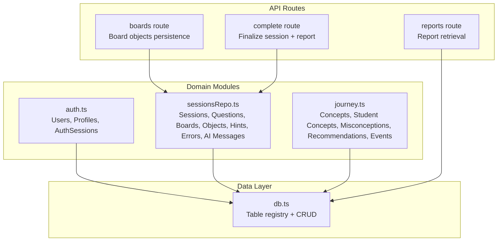
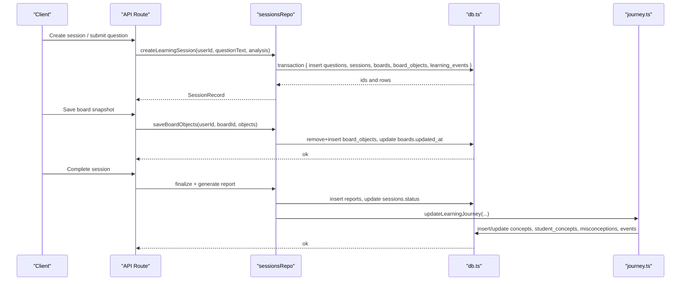
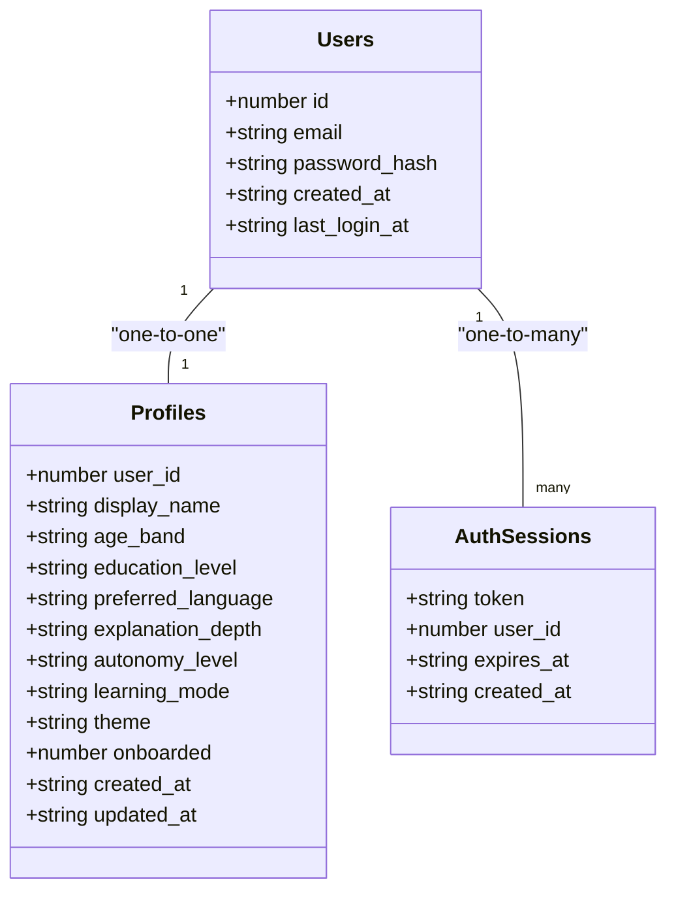
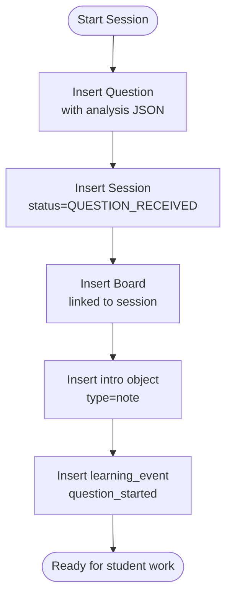
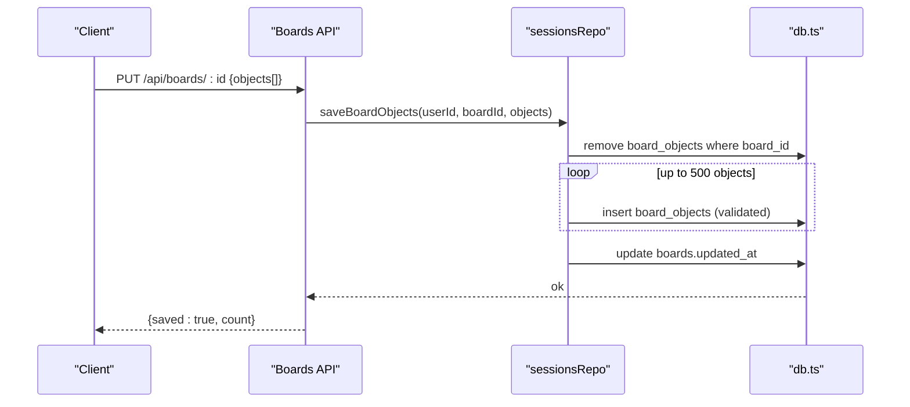
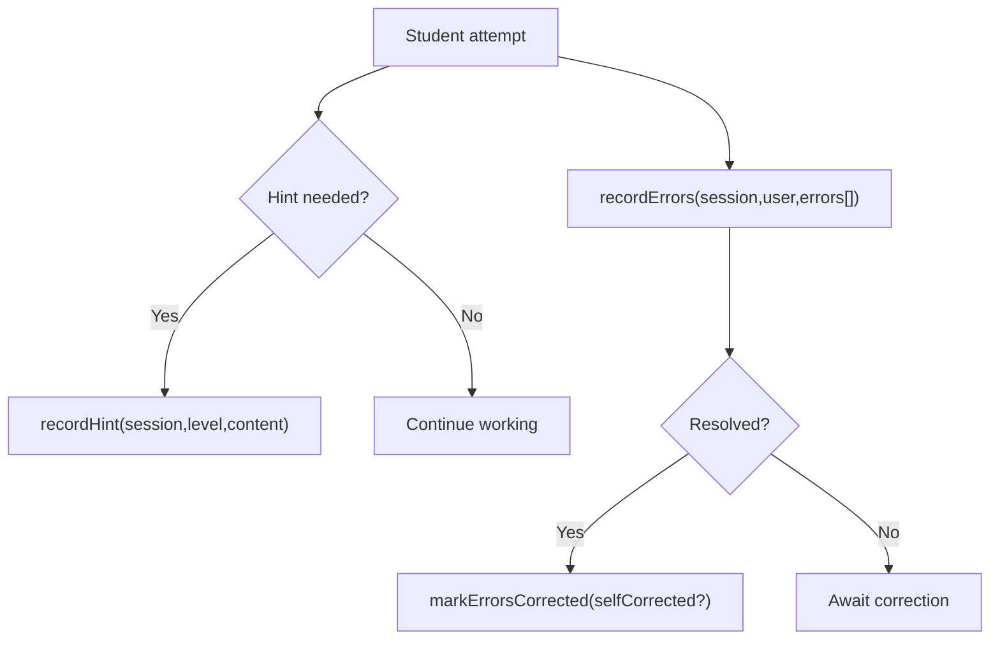
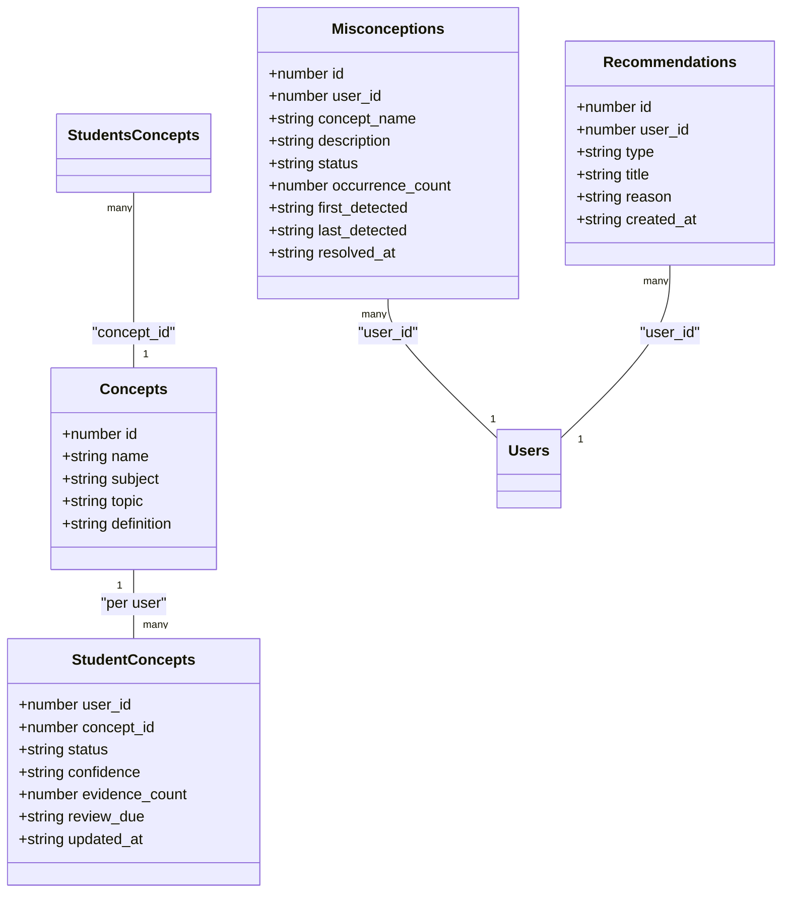
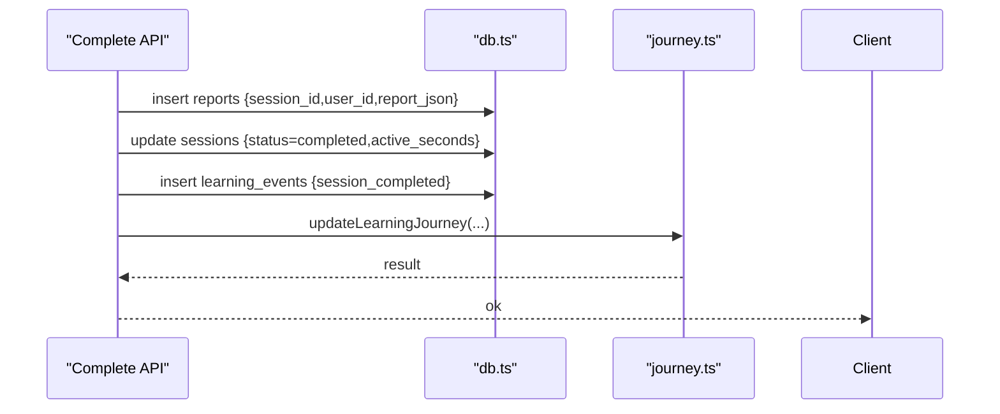
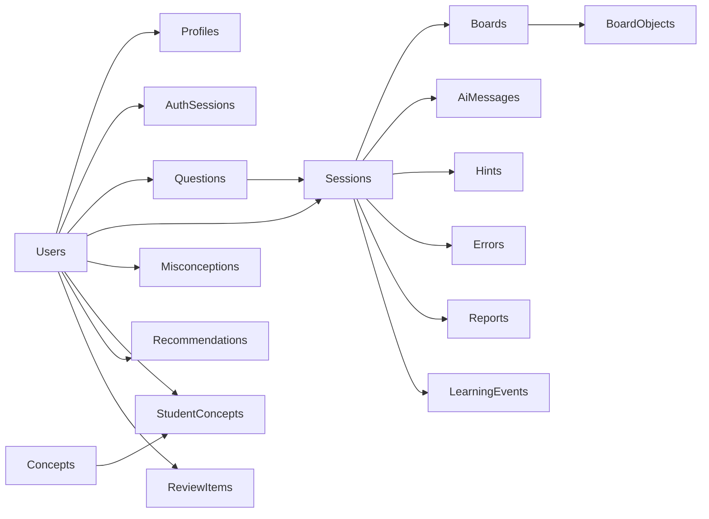

# Data Models and Schema

<cite>
**Referenced Files in This Document**
- [db.ts](file://stepwise ai/app/lib/db.ts)
- [types.ts](file://stepwise ai/app/lib/types.ts)
- [auth.ts](file://stepwise ai/app/lib/auth.ts)
- [sessionsRepo.ts](file://stepwise ai/app/lib/sessionsRepo.ts)
- [journey.ts](file://stepwise ai/app/lib/journey.ts)
- [route.ts (boards)](file://stepwise ai/app/app/api/boards/[id]/route.ts)
- [route.ts (reports)](file://stepwise ai/app/app/api/reports/[sessionId]/route.ts)
- [route.ts (complete)](file://stepwise ai/app/app/api/sessions/[id]/complete/route.ts)
</cite>

## Table of Contents
1. Introduction
2. Project Structure
3. Core Components
4. Architecture Overview
5. Detailed Component Analysis
6. Dependency Analysis
7. Performance Considerations
8. Troubleshooting Guide
9. Conclusion

## Introduction
This document describes the data model for StepWise AI’s core entities: Users, Profiles, Sessions, BoardObjects, Questions, AI Messages, Learning Journey concepts, and Reports. It explains field definitions, data types, constraints, business rules, auto-increment behavior, and foreign key relationships that maintain referential integrity across tables. It also maps the domain model to the educational workflow from question intake through board interaction, evaluation, hints, learning journey updates, and final reporting.

## Project Structure
The application uses a small relational-style API over an embedded JSON store with table metadata defining which tables auto-generate numeric IDs. The schema is defined by table names and usage patterns across modules.

**Diagram sources**
- [db.ts:23-44](file://stepwise ai/app/lib/db.ts#L23-L44)
- [auth.ts:104-127](file://stepwise ai/app/lib/auth.ts#L104-L127)
- [sessionsRepo.ts:26-116](file://stepwise ai/app/lib/sessionsRepo.ts#L26-L116)
- [journey.ts:26-36](file://stepwise ai/app/lib/journey.ts#L26-L36)
- [route.ts (boards):43-85](file://stepwise ai/app/app/api/boards/[id]/route.ts#L43-L85)
- [route.ts (reports):8-19](file://stepwise ai/app/app/api/reports/[sessionId]/route.ts#L8-L19)
- [route.ts (complete):76-98](file://stepwise ai/app/app/api/sessions/[id]/complete/route.ts#L76-L98)

**Section sources**
- [db.ts:23-44](file://stepwise ai/app/lib/db.ts#L23-L44)

## Core Components
This section summarizes each entity, its fields, types, constraints, and business rules as inferred from code usage.

- users
  - Purpose: Identity and authentication root.
  - Key fields: id (auto), email, password_hash, created_at, last_login_at.
  - Constraints: email normalized; password hashed before storage; last_login_at updated on login.
  - Auto-increment: yes.
  - References: profiles.user_id, auth_sessions.user_id, questions.user_id, sessions.user_id, etc.

- profiles
  - Purpose: User preferences and adaptive UI settings.
  - Key fields: user_id (PK-like), display_name, age_band, education_level, preferred_language, explanation_depth, autonomy_level, learning_mode, theme, onboarded, created_at, updated_at.
  - Constraints: one profile per user; defaults set at registration.
  - Auto-increment: no (uses user_id as primary key).
  - References: user_id -> users.id.

- auth_sessions
  - Purpose: Signed session tokens for authentication.
  - Key fields: token (PK-like), user_id, expires_at, created_at.
  - Constraints: token signed; expiration enforced; removed on logout or expiry.
  - Auto-increment: no.
  - References: user_id -> users.id.

- questions
  - Purpose: Captures the student’s original question and AI analysis.
  - Key fields: id (auto), user_id, original_text, input_type, subject, topic, difficulty, normalized_question, analysis_json, created_at.
  - Constraints: text truncated to safe lengths; analysis stored as JSON.
  - Auto-increment: yes.
  - References: user_id -> users.id.

- sessions
  - Purpose: A learning episode tied to a question and board.
  - Key fields: id (auto), user_id, question_id, started_at, ended_at, active_seconds, status, current_step, state, state_json, created_at, updated_at.
  - Constraints: state machine values; ends when completed; active_seconds tracked.
  - Auto-increment: yes.
  - References: user_id -> users.id; question_id -> questions.id.

- boards
  - Purpose: Workspace container for a session.
  - Key fields: id (auto), session_id, title, created_at, updated_at.
  - Constraints: one board per session; ownership verified via user_id on access.
  - Auto-increment: yes.
  - References: session_id -> sessions.id; implicitly linked to user via session.user_id.

- board_objects
  - Purpose: Visual elements on the board (text, drawing, notes, formulas, etc.).
  - Key fields: id (string), board_id, type, x, y, width, height, rotation, z_index, content, style_json, meta_json, owner, created_at, updated_at.
  - Constraints: type and owner enumerated; dimensions clamped; content and JSON fields truncated; max 500 objects per save.
  - Auto-increment: no (client-provided string id).
  - References: board_id -> boards.id.

- ai_messages
  - Purpose: AI-generated messages within a session.
  - Key fields: id (auto), session_id, kind, content_json, created_at.
  - Constraints: kind limited length; content serialized JSON with size cap.
  - Auto-increment: yes.
  - References: session_id -> sessions.id.

- hints
  - Purpose: Escalating hints provided during a session.
  - Key fields: id (auto), session_id, level, content, created_at.
  - Constraints: level integer; content truncated; recorded per hint request.
  - Auto-increment: yes.
  - References: session_id -> sessions.id.

- errors
  - Purpose: Detected mistakes during attempts.
  - Key fields: id (auto), session_id, user_id, category, severity, description, corrected, self_corrected, created_at.
  - Constraints: categories/severity enumerated; corrected flags updated when resolved.
  - Auto-increment: yes.
  - References: session_id -> sessions.id; user_id -> users.id.

- concepts
  - Purpose: Canonical concept catalog used by learning journey.
  - Key fields: id (auto), name, subject, topic, definition.
  - Constraints: name unique-ish lookup; subject/topic truncated.
  - Auto-increment: yes.

- student_concepts
  - Purpose: Per-user concept mastery tracking.
  - Key fields: user_id, concept_id, status, confidence, evidence_count, review_due, updated_at.
  - Constraints: status transitions governed by evidence and hints; review scheduling based on performance.
  - Auto-increment: no (composite key implied).
  - References: user_id -> users.id; concept_id -> concepts.id.

- misconceptions
  - Purpose: Tracks recurring conceptual misunderstandings.
  - Key fields: id (auto), user_id, concept_name, description, status, occurrence_count, first_detected, last_detected, resolved_at.
  - Constraints: lifecycle states; occurrence count drives escalation.
  - Auto-increment: yes.
  - References: user_id -> users.id.

- reports
  - Purpose: Final summary of a learning session.
  - Key fields: id (auto), session_id, user_id, report_json, created_at.
  - Constraints: report JSON validated; one report per session/user pair.
  - Auto-increment: yes.
  - References: session_id -> sessions.id; user_id -> users.id.

- review_items
  - Purpose: Scheduled reviews for concepts needing reinforcement.
  - Key fields: id (auto), user_id, concept_name, due_at, reason, status.
  - Auto-increment: yes.
  - References: user_id -> users.id.

- recommendations
  - Purpose: Next learning actions derived from journey state.
  - Key fields: id (auto), user_id, type, title, reason, created_at.
  - Auto-increment: yes.
  - References: user_id -> users.id.

- learning_events
  - Purpose: Audit trail of meaningful events (question started, hints requested, session completed, journey updated).
  - Key fields: id (auto), user_id, session_id, event_type, detail_json, created_at.
  - Auto-increment: yes.
  - References: user_id -> users.id; session_id -> sessions.id.

**Section sources**
- [auth.ts:104-127](file://stepwise ai/app/lib/auth.ts#L104-L127)
- [sessionsRepo.ts:26-116](file://stepwise ai/app/lib/sessionsRepo.ts#L26-L116)
- [sessionsRepo.ts:197-282](file://stepwise ai/app/lib/sessionsRepo.ts#L197-L282)
- [sessionsRepo.ts:284-399](file://stepwise ai/app/lib/sessionsRepo.ts#L284-L399)
- [journey.ts:26-36](file://stepwise ai/app/lib/journey.ts#L26-L36)
- [journey.ts:59-144](file://stepwise ai/app/lib/journey.ts#L59-L144)
- [route.ts (boards):43-85](file://stepwise ai/app/app/api/boards/[id]/route.ts#L43-L85)
- [route.ts (reports):8-19](file://stepwise ai/app/app/api/reports/[sessionId]/route.ts#L8-L19)
- [route.ts (complete):76-98](file://stepwise ai/app/app/api/sessions/[id]/complete/route.ts#L76-L98)

## Architecture Overview
The data layer defines tables and auto-increment behavior. Domain modules insert and query these tables while enforcing business rules and validation. API routes enforce ownership and orchestrate multi-step transactions.

**Diagram sources**
- [sessionsRepo.ts:26-116](file://stepwise ai/app/lib/sessionsRepo.ts#L26-L116)
- [sessionsRepo.ts:239-265](file://stepwise ai/app/lib/sessionsRepo.ts#L239-L265)
- [route.ts (complete):76-98](file://stepwise ai/app/app/api/sessions/[id]/complete/route.ts#L76-L98)
- [journey.ts:59-144](file://stepwise ai/app/lib/journey.ts#L59-L144)

## Detailed Component Analysis

### Users and Profiles
- Registration inserts a user and creates a default profile with adaptive UI settings.
- Login updates last_login_at and issues a signed session cookie backed by auth_sessions.
- Profile updates are scoped by user_id.

**Diagram sources**
- [auth.ts:104-127](file://stepwise ai/app/lib/auth.ts#L104-L127)
- [auth.ts:46-57](file://stepwise ai/app/lib/auth.ts#L46-L57)
- [auth.ts:78-102](file://stepwise ai/app/lib/auth.ts#L78-L102)

**Section sources**
- [auth.ts:104-127](file://stepwise ai/app/lib/auth.ts#L104-L127)
- [auth.ts:46-57](file://stepwise ai/app/lib/auth.ts#L46-L57)
- [auth.ts:78-102](file://stepwise ai/app/lib/auth.ts#L78-L102)

### Questions and Sessions
- A new learning session creates a Question record with AI analysis, a Session, a Board, initial board objects (e.g., introduction note), and a learning event.
- Sessions track state machine transitions, step progress, timing, and status.

**Diagram sources**
- [sessionsRepo.ts:26-116](file://stepwise ai/app/lib/sessionsRepo.ts#L26-L116)

**Section sources**
- [sessionsRepo.ts:26-116](file://stepwise ai/app/lib/sessionsRepo.ts#L26-L116)

### BoardObjects and Boards
- Boards encapsulate a session’s workspace. Board objects are persisted as a full snapshot with validation and limits.
- Ownership checks ensure users can only modify their own boards.

**Diagram sources**
- [route.ts (boards):43-85](file://stepwise ai/app/app/api/boards/[id]/route.ts#L43-L85)
- [sessionsRepo.ts:239-265](file://stepwise ai/app/lib/sessionsRepo.ts#L239-L265)

**Section sources**
- [route.ts (boards):43-85](file://stepwise ai/app/app/api/boards/[id]/route.ts#L43-L85)
- [sessionsRepo.ts:197-282](file://stepwise ai/app/lib/sessionsRepo.ts#L197-L282)

### AI Messages, Hints, and Errors
- AI messages are appended per session with a kind and serialized content.
- Hints escalate levels and are recorded with timestamps.
- Errors are captured per attempt and later marked corrected or self-corrected.

**Diagram sources**
- [sessionsRepo.ts:284-399](file://stepwise ai/app/lib/sessionsRepo.ts#L284-L399)

**Section sources**
- [sessionsRepo.ts:284-399](file://stepwise ai/app/lib/sessionsRepo.ts#L284-L399)

### Learning Journey: Concepts, Misconceptions, Reviews, Recommendations
- Concepts are canonical entries; student_concepts tracks per-user mastery with evidence-based transitions.
- Misconceptions have a lifecycle driven by recurrence and resolution.
- Review items and recommendations are generated to guide next steps.

**Diagram sources**
- [journey.ts:26-36](file://stepwise ai/app/lib/journey.ts#L26-L36)
- [journey.ts:59-144](file://stepwise ai/app/lib/journey.ts#L59-L144)

**Section sources**
- [journey.ts:26-36](file://stepwise ai/app/lib/journey.ts#L26-L36)
- [journey.ts:59-144](file://stepwise ai/app/lib/journey.ts#L59-L144)

### Reports
- Final reports are generated after session completion and stored with JSON payload.
- Retrieval enforces ownership by matching session_id and user_id.

**Diagram sources**
- [route.ts (complete):76-98](file://stepwise ai/app/app/api/sessions/[id]/complete/route.ts#L76-L98)
- [route.ts (reports):8-19](file://stepwise ai/app/app/api/reports/[sessionId]/route.ts#L8-L19)

**Section sources**
- [route.ts (complete):76-98](file://stepwise ai/app/app/api/sessions/[id]/complete/route.ts#L76-L98)
- [route.ts (reports):8-19](file://stepwise ai/app/app/api/reports/[sessionId]/route.ts#L8-L19)

## Dependency Analysis
Foreign key relationships are enforced by application logic and cascade deletion utilities rather than database-level constraints.

**Diagram sources**
- [db.ts:23-44](file://stepwise ai/app/lib/db.ts#L23-L44)
- [auth.ts:104-127](file://stepwise ai/app/lib/auth.ts#L104-L127)
- [sessionsRepo.ts:26-116](file://stepwise ai/app/lib/sessionsRepo.ts#L26-L116)
- [journey.ts:59-144](file://stepwise ai/app/lib/journey.ts#L59-L144)

Auto-increment behavior:
- Tables with autoIncrement true: users, questions, sessions, boards, board_events, ai_messages, concepts, errors, hints, mastery_evidence, misconceptions, reports, review_items, recommendations, learning_events.
- Tables without autoIncrement: profiles, auth_sessions, board_objects, concept_prereqs, student_concepts.

Cascade deletion:
- deleteUserCascade removes all related records for a user atomically, mirroring ON DELETE CASCADE semantics.

**Section sources**
- [db.ts:23-44](file://stepwise ai/app/lib/db.ts#L23-L44)
- [db.ts:201-223](file://stepwise ai/app/lib/db.ts#L201-L223)

## Performance Considerations
- Board snapshots are capped at 500 objects and fields are truncated to prevent oversized payloads.
- Transactions batch multiple writes to reduce disk I/O and ensure consistency.
- Sorting and filtering are performed in-memory; consider indexing strategies when migrating to PostgreSQL.
- Avoid frequent AI calls; debounce client-side changes and persist only meaningful updates.

[No sources needed since this section provides general guidance]

## Troubleshooting Guide
Common issues and how they are handled:
- Ownership verification: API routes check user ownership before reading/writing boards, sessions, and reports.
- Invalid or missing data: JSON fields are parsed safely with fallbacks; malformed JSON returns empty structures.
- Cascade deletes: Use deleteUserCascade to clean up orphaned data when removing a user.
- Session finalization: Ensure session status is set to completed and active_seconds recorded when generating reports.

**Section sources**
- [route.ts (boards):43-85](file://stepwise ai/app/app/api/boards/[id]/route.ts#L43-L85)
- [route.ts (reports):8-19](file://stepwise ai/app/app/api/reports/[sessionId]/route.ts#L8-L19)
- [db.ts:201-223](file://stepwise ai/app/lib/db.ts#L201-L223)
- [route.ts (complete):76-98](file://stepwise ai/app/app/api/sessions/[id]/complete/route.ts#L76-L98)

## Conclusion
StepWise AI’s data model centers around a clear separation of concerns: identity and preferences (users, profiles), learning episodes (questions, sessions, boards, board_objects), feedback and guidance (hints, errors, ai_messages), long-term learning memory (concepts, student_concepts, misconceptions, recommendations, review_items), and outcomes (reports, learning_events). The embedded JSON store provides a simple relational interface with auto-increment support and transactional safety. Application logic enforces referential integrity and business rules, ensuring a robust foundation for the interactive learning workflow.