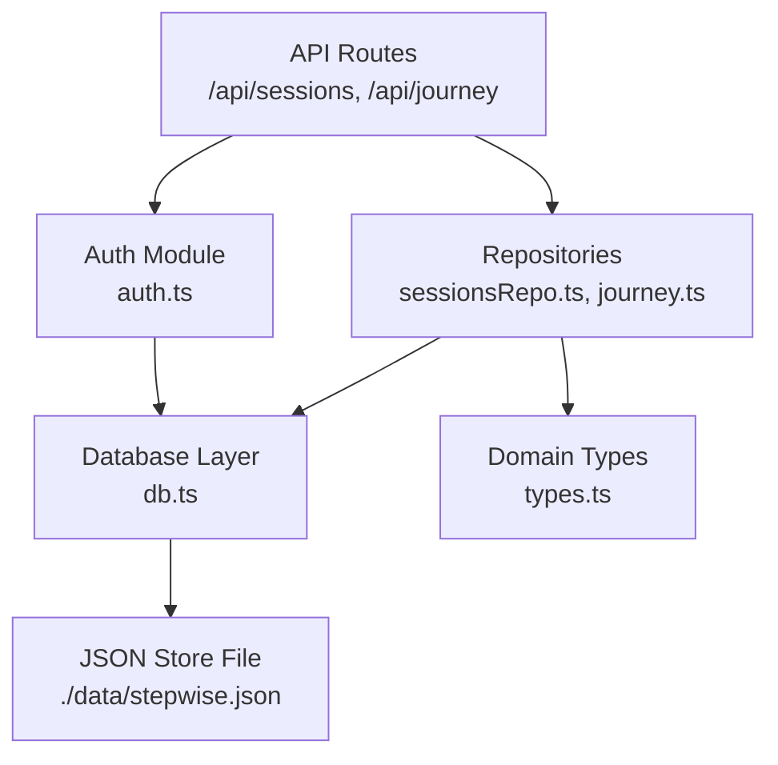
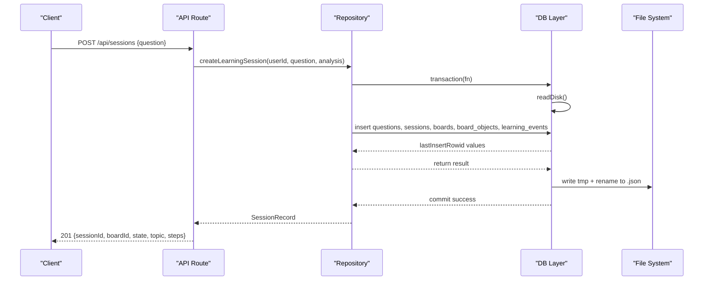
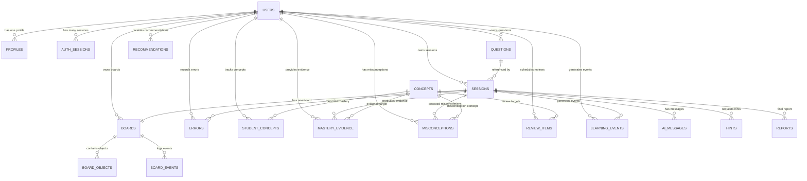
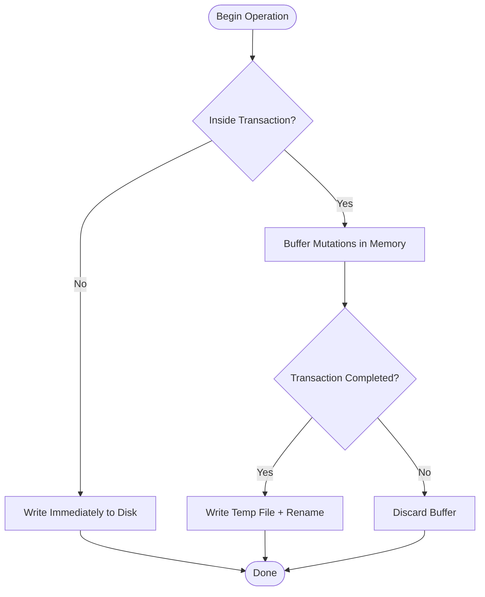
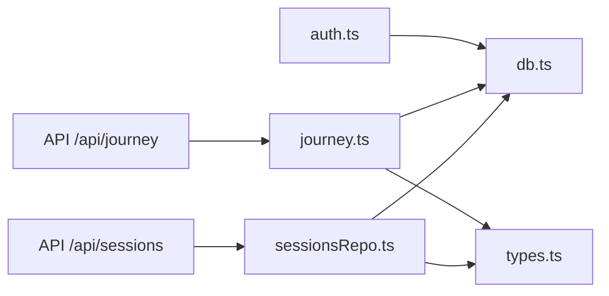

# Database Design

<cite>
**Referenced Files in This Document**
- [db.ts](file://stepwise ai/app/lib/db.ts)
- [types.ts](file://stepwise ai/app/lib/types.ts)
- [sessionsRepo.ts](file://stepwise ai/app/lib/sessionsRepo.ts)
- [journey.ts](file://stepwise ai/app/lib/journey.ts)
- [auth.ts](file://stepwise ai/app/lib/auth.ts)
- [route.ts (sessions)](file://stepwise ai/app/app/api/sessions/route.ts)
- [route.ts (journey)](file://stepwise ai/app/app/api/journey/route.ts)
</cite>

## Table of Contents
1. [Introduction](#introduction)
2. [Project Structure](#project-structure)
3. [Core Components](#core-components)
4. [Architecture Overview](#architecture-overview)
5. [Detailed Component Analysis](#detailed-component-analysis)
6. [Dependency Analysis](#dependency-analysis)
7. [Performance Considerations](#performance-considerations)
8. [Troubleshooting Guide](#troubleshooting-guide)
9. [Conclusion](#conclusion)
10. [Appendices](#appendices)

## Introduction
This document describes StepWise AI’s custom JSON-based relational database system and the data model that underpins Users, Sessions, BoardObjects, and Learning Journey records. It explains schema design, field definitions, constraints, foreign key relationships enforced by application logic, transactional write semantics using temp file + rename, common query patterns, performance strategies, migration approach, backup procedures, validation rules, lifecycle management, and the repository pattern used to abstract database operations.

## Project Structure
The persistence layer is implemented as a small embedded JSON store with a minimal relational-style API. The core modules are:
- Data access layer: defines tables, transactions, and CRUD operations over a single JSON file on disk.
- Domain types: TypeScript interfaces and enums that define the shape of entities such as sessions, board objects, learning journey concepts, and reports.
- Repositories: server-side data access modules that enforce ownership and business rules when reading/writing data.
- API routes: Next.js endpoints that orchestrate use cases like creating a learning session or retrieving the learning journey.

**Diagram sources**
- [db.ts:123-199](file://stepwise ai/app/lib/db.ts#L123-L199)
- [sessionsRepo.ts:26-116](file://stepwise ai/app/lib/sessionsRepo.ts#L26-L116)
- [journey.ts:59-262](file://stepwise ai/app/lib/journey.ts#L59-L262)
- [auth.ts:46-127](file://stepwise ai/app/lib/auth.ts#L46-L127)
- [route.ts (sessions):11-40](file://stepwise ai/app/app/api/sessions/route.ts#L11-L40)
- [route.ts (journey):8-13](file://stepwise ai/app/app/api/journey/route.ts#L8-L13)

**Section sources**
- [db.ts:1-108](file://stepwise ai/app/lib/db.ts#L1-L108)
- [types.ts:1-302](file://stepwise ai/app/lib/types.ts#L1-L302)
- [sessionsRepo.ts:1-399](file://stepwise ai/app/lib/sessionsRepo.ts#L1-L399)
- [journey.ts:1-357](file://stepwise ai/app/lib/journey.ts#L1-L357)
- [auth.ts:1-139](file://stepwise ai/app/lib/auth.ts#L1-L139)
- [route.ts (sessions):1-56](file://stepwise ai/app/app/api/sessions/route.ts#L1-L56)
- [route.ts (journey):1-17](file://stepwise ai/app/app/api/journey/route.ts#L1-L17)

## Core Components
- Database layer (db.ts): Provides a typed, SQL-like interface for querying and mutating rows in a JSON store. It defines table metadata, auto-increment sequences, atomic transactions, and cascade deletion helpers.
- Domain types (types.ts): Centralizes entity shapes and enumerations for sessions, board objects, evaluation results, hints, learning journey concepts, misconceptions, recommendations, and final reports.
- Session repository (sessionsRepo.ts): Encapsulates creation, retrieval, updates, and persistence of sessions, boards, board objects, AI messages, hints, errors, and related events. Enforces user ownership on every operation.
- Learning journey engine (journey.ts): Implements concept mastery tracking, misconception lifecycle, spaced review scheduling, and explainable recommendations based on evidence from sessions.
- Authentication module (auth.ts): Manages users, profiles, and auth sessions; uses transactions to create users and default profiles atomically.

Key responsibilities:
- Atomic writes via transactions and temp file + rename.
- Ownership checks before reads/writes.
- Evidence-driven concept status transitions.
- Consistent serialization/deserialization of complex fields.

**Section sources**
- [db.ts:19-44](file://stepwise ai/app/lib/db.ts#L19-L44)
- [db.ts:123-199](file://stepwise ai/app/lib/db.ts#L123-L199)
- [types.ts:6-25](file://stepwise ai/app/lib/types.ts#L6-L25)
- [types.ts:26-57](file://stepwise ai/app/lib/types.ts#L26-L57)
- [types.ts:149-187](file://stepwise ai/app/lib/types.ts#L149-L187)
- [sessionsRepo.ts:26-116](file://stepwise ai/app/lib/sessionsRepo.ts#L26-L116)
- [journey.ts:59-262](file://stepwise ai/app/lib/journey.ts#L59-L262)
- [auth.ts:104-127](file://stepwise ai/app/lib/auth.ts#L104-L127)

## Architecture Overview
The system follows a layered architecture:
- API routes receive requests, validate inputs, and delegate to repositories.
- Repositories enforce business rules and ownership, then call the database layer.
- The database layer persists changes to a JSON file atomically using transactions.

**Diagram sources**
- [route.ts (sessions):11-40](file://stepwise ai/app/app/api/sessions/route.ts#L11-L40)
- [sessionsRepo.ts:26-116](file://stepwise ai/app/lib/sessionsRepo.ts#L26-L116)
- [db.ts:183-194](file://stepwise ai/app/lib/db.ts#L183-L194)
- [db.ts:88-94](file://stepwise ai/app/lib/db.ts#L88-L94)

## Detailed Component Analysis

### Schema Design and Entity Relationships
The database layer declares a set of logical tables stored within a single JSON file. Each table is an array of row objects. Auto-increment IDs are managed per table via a sequence map.

Logical tables and their roles:
- users: Identity and authentication root.
- profiles: User preferences and adaptive UI settings.
- auth_sessions: Signed session tokens with expiration.
- questions: Normalized student questions and AI analysis.
- sessions: Learning session state machine and timing.
- boards: Per-session visual workspace.
- board_objects: Canvas items with geometry, content, style, meta, and ownership.
- board_events: Audit log of board interactions.
- ai_messages: AI-generated messages tied to sessions.
- concepts: Canonical concept catalog.
- concept_prereqs: Concept dependency graph.
- student_concepts: Per-user concept mastery states and evidence.
- errors: Detected errors per session/user with correction flags.
- hints: Escalating hints requested during sessions.
- mastery_evidence: Evidence entries supporting concept mastery.
- misconceptions: Misconception lifecycle tracking per user.
- reports: Final session reports.
- review_items: Spaced repetition due items.
- recommendations: Explainable next-step suggestions.
- learning_events: Event log for learning activities.

Primary keys and auto-increment behavior:
- Tables marked with autoIncrement generate numeric ids via a per-table sequence.
- Non-auto-increment tables rely on application-managed ids (e.g., board_objects id strings).

Foreign key relationships (enforced by application logic):
- sessions.question_id -> questions.id
- sessions.user_id -> users.id
- boards.session_id -> sessions.id
- boards.user_id -> users.id
- board_objects.board_id -> boards.id
- ai_messages.session_id -> sessions.id
- hints.session_id -> sessions.id
- errors.session_id -> sessions.id
- errors.user_id -> users.id
- student_concepts.user_id -> users.id
- student_concepts.concept_id -> concepts.id
- mastery_evidence.user_id -> users.id
- mastery_evidence.concept_id -> concepts.id
- mastery_evidence.session_id -> sessions.id
- misconceptions.user_id -> users.id
- review_items.user_id -> users.id
- recommendations.user_id -> users.id
- learning_events.user_id -> users.id
- learning_events.session_id -> sessions.id

Cascade deletion:
- deleteUserCascade removes all user-scoped rows across multiple tables before deleting the user, simulating ON DELETE CASCADE.

**Diagram sources**
- [db.ts:23-44](file://stepwise ai/app/lib/db.ts#L23-L44)
- [db.ts:201-223](file://stepwise ai/app/lib/db.ts#L201-L223)
- [sessionsRepo.ts:26-116](file://stepwise ai/app/lib/sessionsRepo.ts#L26-L116)
- [journey.ts:59-262](file://stepwise ai/app/lib/journey.ts#L59-L262)
- [auth.ts:104-127](file://stepwise ai/app/lib/auth.ts#L104-L127)

**Section sources**
- [db.ts:23-44](file://stepwise ai/app/lib/db.ts#L23-L44)
- [db.ts:201-223](file://stepwise ai/app/lib/db.ts#L201-L223)
- [sessionsRepo.ts:26-116](file://stepwise ai/app/lib/sessionsRepo.ts#L26-L116)
- [journey.ts:59-262](file://stepwise ai/app/lib/journey.ts#L59-L262)
- [auth.ts:104-127](file://stepwise ai/app/lib/auth.ts#L104-L127)

### Field Definitions and Constraints
- users: email, password_hash, created_at, last_login_at. Unique email enforced at registration time by lookup.
- profiles: user_id (FK), display_name, age_band, education_level, preferred_language, explanation_depth, autonomy_level, learning_mode, theme, onboarded, timestamps.
- auth_sessions: token (unique), user_id (FK), expires_at, created_at. Expiration checked on login.
- questions: user_id (FK), original_text, input_type, subject, topic, difficulty, normalized_question, analysis_json, created_at. Text fields truncated to limits.
- sessions: user_id (FK), question_id (FK), started_at, ended_at, active_seconds, status, current_step, state, state_json, created_at, updated_at. State machine constrained by SessionState enum.
- boards: session_id (FK), user_id (FK), title, status, timestamps.
- board_objects: id (string), board_id (FK), type, x, y, width, height, rotation, z_index, content, style_json, meta_json, owner, timestamps. Width/height clamped; content and JSON fields truncated.
- board_events: board_id (FK), session_id (FK), event_type, payload_json, created_at.
- ai_messages: session_id (FK), kind, content_json, created_at.
- concepts: name (unique per catalog), subject, topic, definition.
- concept_prereqs: concept dependencies (schema declared but not actively used in analyzed code).
- student_concepts: user_id (FK), concept_id (FK), status, confidence, evidence_count, self_correction_count, hint_count, last_seen, last_practiced, review_due, updated_at.
- errors: session_id (FK), user_id (FK), category, severity, description, corrected, self_corrected, created_at.
- hints: session_id (FK), level, content, created_at.
- mastery_evidence: user_id (FK), concept_id (FK), session_id (FK), evidence_type, detail, created_at.
- misconceptions: user_id (FK), concept_name, description, status, occurrence_count, first_detected, last_detected, resolved_at.
- reports: session_id (FK), structured report fields.
- review_items: user_id (FK), concept_name, due_at, reason, status, created_at.
- recommendations: user_id (FK), type, title, reason, created_at.
- learning_events: user_id (FK), session_id (FK), event_type, detail_json, created_at.

Constraints and validation:
- Input truncation applied to text fields (e.g., question text, content, payloads).
- Numeric ranges enforced for board object dimensions.
- Enum-constrained fields (e.g., SessionState, BoardObjectType, ConceptStatus).
- Ownership checks ensure user_id matches authenticated user before any read/write.

**Section sources**
- [auth.ts:104-127](file://stepwise ai/app/lib/auth.ts#L104-L127)
- [sessionsRepo.ts:26-116](file://stepwise ai/app/lib/sessionsRepo.ts#L26-L116)
- [sessionsRepo.ts:198-265](file://stepwise ai/app/lib/sessionsRepo.ts#L198-L265)
- [journey.ts:59-262](file://stepwise ai/app/lib/journey.ts#L59-L262)
- [types.ts:6-25](file://stepwise ai/app/lib/types.ts#L6-L25)
- [types.ts:26-57](file://stepwise ai/app/lib/types.ts#L26-L57)
- [types.ts:149-187](file://stepwise ai/app/lib/types.ts#L149-L187)

### Transaction Support and Atomic Writes
- Transactions buffer mutations in memory and persist once at the end using a temp file + rename pattern, ensuring atomicity and crash safety.
- If an error occurs inside a transaction, the buffer is discarded and no partial writes occur.
- Non-transactional writes immediately persist after each mutation.

**Diagram sources**
- [db.ts:88-94](file://stepwise ai/app/lib/db.ts#L88-L94)
- [db.ts:183-194](file://stepwise ai/app/lib/db.ts#L183-L194)

**Section sources**
- [db.ts:88-94](file://stepwise ai/app/lib/db.ts#L88-L94)
- [db.ts:183-194](file://stepwise ai/app/lib/db.ts#L183-L194)

### Repository Pattern Implementation
- sessionsRepo.ts encapsulates session and board operations, enforcing ownership and providing consistent APIs for the API layer.
- journey.ts encapsulates learning journey updates and queries, implementing concept mastery logic and recommendation generation.
- auth.ts provides user and session management with transactional registration.

Common methods:
- createLearningSession: Creates question, session, board, initial board objects, and learning event atomically.
- getSession/listSessions: Retrieves session details and lists recent sessions with report presence.
- updateSessionState: Updates session state machine fields and timestamps.
- getBoardObjects/saveBoardObjects: Reads and replaces board objects atomically with ownership verification.
- recordBoardEvent/addAiMessage/recordHint/recordErrors/markErrorsCorrected: Log events and track feedback.
- updateLearningJourney: Updates concept statuses, misconceptions, reviews, and recommendations based on session outcomes.
- getJourney: Aggregates concepts, misconceptions, reviews, recommendations, events, and stats.

**Section sources**
- [sessionsRepo.ts:26-116](file://stepwise ai/app/lib/sessionsRepo.ts#L26-L116)
- [sessionsRepo.ts:118-195](file://stepwise ai/app/lib/sessionsRepo.ts#L118-L195)
- [sessionsRepo.ts:198-399](file://stepwise ai/app/lib/sessionsRepo.ts#L198-L399)
- [journey.ts:59-357](file://stepwise ai/app/lib/journey.ts#L59-L357)
- [auth.ts:46-127](file://stepwise ai/app/lib/auth.ts#L46-L127)

### Common Query Patterns and Data Access Methods
- Filtering by user_id and session_id to enforce ownership.
- Ordering by id or timestamps for lists.
- Parsing JSON fields safely with fallbacks.
- Limiting results to avoid large payloads.

Examples:
- List recent sessions for a user with limit.
- Retrieve board objects ordered by z-index.
- Fetch AI messages for a session ordered by id.
- Aggregate journey view combining multiple tables.

**Section sources**
- [sessionsRepo.ts:148-174](file://stepwise ai/app/lib/sessionsRepo.ts#L148-L174)
- [sessionsRepo.ts:198-204](file://stepwise ai/app/lib/sessionsRepo.ts#L198-L204)
- [sessionsRepo.ts:300-312](file://stepwise ai/app/lib/sessionsRepo.ts#L300-L312)
- [journey.ts:274-357](file://stepwise ai/app/lib/journey.ts#L274-L357)

### Performance Optimization Strategies
- Use transactions for multi-step writes to reduce disk I/O and ensure consistency.
- Limit list sizes (e.g., slice to 20–30 rows) to minimize memory and network overhead.
- Truncate large text fields and JSON payloads to bounded sizes.
- Clamp numeric fields (e.g., board object dimensions) to prevent oversized storage.
- Avoid unnecessary joins by fetching related entities separately and assembling in memory.

[No sources needed since this section provides general guidance]

### Migration Approach and Backup Procedures
- Migration strategy: Since the store is a JSON file with a known structure, migrations involve transforming existing rows to new schemas and updating table metadata if needed. Apply transformations in a transaction to ensure consistency.
- Backup procedure: Copy the JSON store file to a backup location. Because writes use temp file + rename, backups taken between renames will be consistent snapshots. Schedule periodic copies and retain versions for recovery.

[No sources needed since this section provides general guidance]

### Data Validation Rules and Business Constraints
- Ownership enforcement: Every read/write verifies the authenticated user owns the resource (e.g., board, session).
- State machine constraints: Session state transitions follow defined states; updates only modify allowed fields.
- Evidence-driven mastery: Concept status advances only based on completion ratios, self-corrections, and hint usage; mastery requires repeated evidence.
- Misconception lifecycle: Tracks occurrences and status transitions; recurring issues escalate.
- Recommendation explainability: Recommendations include reasons derived from session metrics.

**Section sources**
- [sessionsRepo.ts:118-195](file://stepwise ai/app/lib/sessionsRepo.ts#L118-L195)
- [journey.ts:59-262](file://stepwise ai/app/lib/journey.ts#L59-L262)
- [types.ts:6-25](file://stepwise ai/app/lib/types.ts#L6-L25)
- [types.ts:149-187](file://stepwise ai/app/lib/types.ts#L149-L187)

### Data Lifecycle Management
- Creation: Users register with profiles; sessions start with questions, boards, and initial objects; concepts are created on demand.
- Updates: Sessions progress through states; board objects are replaced atomically; concept statuses evolve based on evidence; misconceptions tracked and addressed.
- Archival: Completed sessions produce reports; review items schedule spaced repetition; events provide audit trails.
- Deletion: Cascade deletion removes all user-related data atomically.

**Section sources**
- [auth.ts:104-127](file://stepwise ai/app/lib/auth.ts#L104-L127)
- [sessionsRepo.ts:26-116](file://stepwise ai/app/lib/sessionsRepo.ts#L26-L116)
- [journey.ts:59-262](file://stepwise ai/app/lib/journey.ts#L59-L262)
- [db.ts:201-223](file://stepwise ai/app/lib/db.ts#L201-L223)

## Dependency Analysis
The following diagram shows how components depend on each other:

**Diagram sources**
- [route.ts (sessions):11-40](file://stepwise ai/app/app/api/sessions/route.ts#L11-L40)
- [route.ts (journey):8-13](file://stepwise ai/app/app/api/journey/route.ts#L8-L13)
- [sessionsRepo.ts:1-399](file://stepwise ai/app/lib/sessionsRepo.ts#L1-L399)
- [journey.ts:1-357](file://stepwise ai/app/lib/journey.ts#L1-L357)
- [auth.ts:1-139](file://stepwise ai/app/lib/auth.ts#L1-L139)
- [types.ts:1-302](file://stepwise ai/app/lib/types.ts#L1-L302)

**Section sources**
- [route.ts (sessions):11-40](file://stepwise ai/app/app/api/sessions/route.ts#L11-L40)
- [route.ts (journey):8-13](file://stepwise ai/app/app/api/journey/route.ts#L8-L13)
- [sessionsRepo.ts:1-399](file://stepwise ai/app/lib/sessionsRepo.ts#L1-L399)
- [journey.ts:1-357](file://stepwise ai/app/lib/journey.ts#L1-L357)
- [auth.ts:1-139](file://stepwise ai/app/lib/auth.ts#L1-L139)
- [types.ts:1-302](file://stepwise ai/app/lib/types.ts#L1-L302)

## Performance Considerations
- Prefer transactions for batch writes to minimize disk I/O.
- Limit query result sets to reduce memory usage and response size.
- Normalize large JSON payloads into separate tables if they grow significantly.
- Index-like behavior can be simulated by maintaining sorted arrays or auxiliary maps for frequently queried fields.
- Monitor file size growth and consider partitioning by user or time if necessary.

[No sources needed since this section provides general guidance]

## Troubleshooting Guide
- Ownership errors: Ensure all queries include user_id filters; verify authentication context before calling repositories.
- State inconsistencies: Validate session state transitions; check state_json parsing and updates.
- Data corruption: Use transactions to roll back partial writes; verify JSON parse safety with safeParse helpers.
- Cascade deletions: Use deleteUserCascade to remove user data consistently; confirm all dependent tables are covered.

**Section sources**
- [sessionsRepo.ts:118-195](file://stepwise ai/app/lib/sessionsRepo.ts#L118-L195)
- [sessionsRepo.ts:206-233](file://stepwise ai/app/lib/sessionsRepo.ts#L206-L233)
- [db.ts:201-223](file://stepwise ai/app/lib/db.ts#L201-L223)

## Conclusion
StepWise AI’s JSON-based relational database provides a compact, embeddable persistence layer with strong transactional guarantees and clear ownership semantics. The schema supports rich learning workflows around sessions, boards, and long-term concept mastery. The repository pattern centralizes business logic and ensures consistent data access across the application. With careful validation, evidence-driven state transitions, and atomic writes, the system maintains integrity while remaining simple to operate and evolve.

[No sources needed since this section summarizes without analyzing specific files]

## Appendices

### Appendix A: Key API Workflows
- Create learning session: Validates input, analyzes question, creates question/session/board/objects/events atomically.
- Retrieve journey: Aggregates concepts, misconceptions, reviews, recommendations, events, and stats for the authenticated user.

**Section sources**
- [route.ts (sessions):11-40](file://stepwise ai/app/app/api/sessions/route.ts#L11-L40)
- [route.ts (journey):8-13](file://stepwise ai/app/app/api/journey/route.ts#L8-L13)

### Appendix B: Error Handling and Safety
- Safe JSON parsing with fallbacks prevents crashes on malformed data.
- Input truncation protects against oversized payloads.
- Transactions ensure consistency even if errors occur mid-operation.

**Section sources**
- [sessionsRepo.ts:206-233](file://stepwise ai/app/lib/sessionsRepo.ts#L206-L233)
- [db.ts:183-194](file://stepwise ai/app/lib/db.ts#L183-L194)