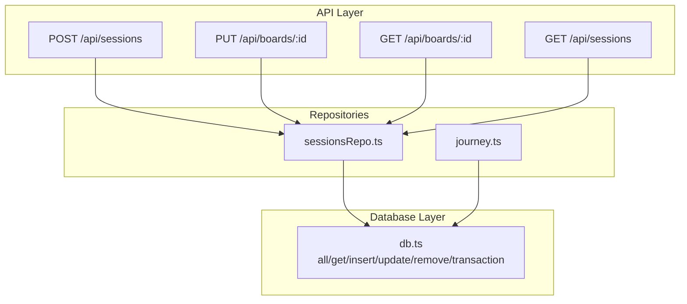
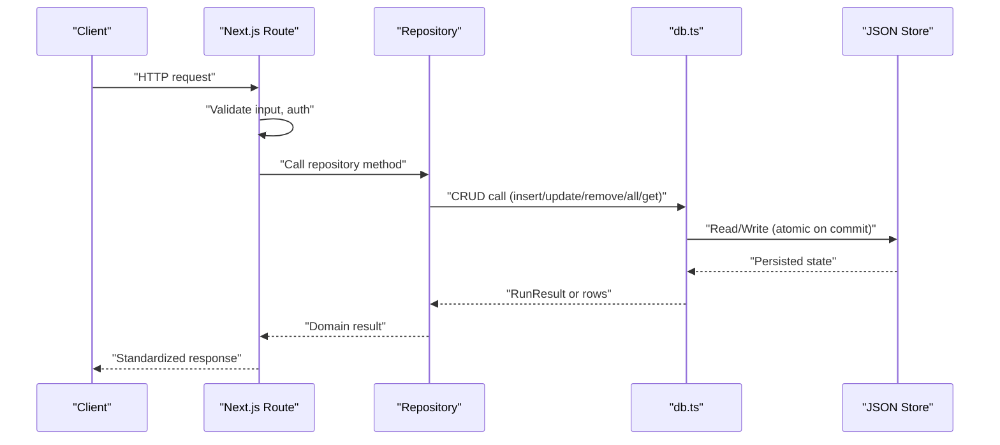
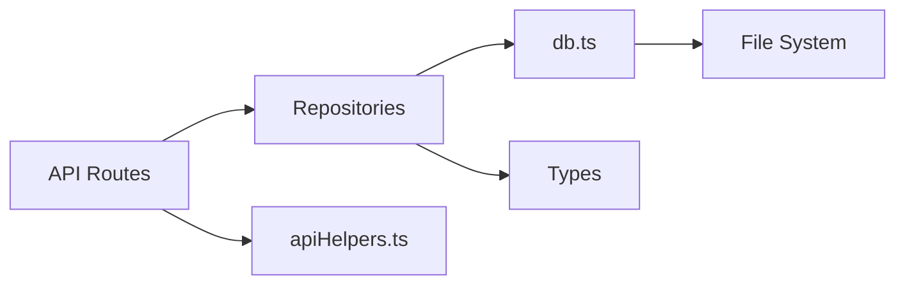

# CRUD Operations

<cite>
**Referenced Files in This Document**
- [db.ts](file://stepwise ai/app/lib/db.ts)
- [sessionsRepo.ts](file://stepwise ai/app/lib/sessionsRepo.ts)
- [journey.ts](file://stepwise ai/app/lib/journey.ts)
- [route.ts (boards)](file://stepwise ai/app/app/api/boards/[id]/route.ts)
- [route.ts (sessions)](file://stepwise ai/app/app/api/sessions/route.ts)
- [apiHelpers.ts](file://stepwise ai/app/lib/apiHelpers.ts)
</cite>

## Table of Contents
1. [Introduction](#introduction)
2. [Project Structure](#project-structure)
3. [Core Components](#core-components)
4. [Architecture Overview](#architecture-overview)
5. [Detailed Component Analysis](#detailed-component-analysis)
6. [Dependency Analysis](#dependency-analysis)
7. [Performance Considerations](#performance-considerations)
8. [Troubleshooting Guide](#troubleshooting-guide)
9. [Conclusion](#conclusion)

## Introduction
This document explains the CRUD operations provided by the StepWise AI database layer and how they are used across the application. The database layer is an embedded JSON store with a relational-style API. It supports:
- Insert with auto-increment primary keys and lastInsertRowid
- Update with where clauses, batch updates, and change tracking
- Remove with cascade deletion support
- Query methods all() and get() for filtering, sorting, and ordering
- Transactions for atomic multi-step operations

The documentation includes practical usage patterns, parameter validation, error handling, and return value semantics for each operation.

## Project Structure
The database layer lives in a single module that exposes a small, stable interface consumed by repositories and API routes. Repositories implement business logic and enforce ownership checks before calling the database layer. API routes validate inputs, call repositories, and return standardized responses.

**Diagram sources**
- [route.ts (sessions):11-43](file://stepwise ai/app/app/api/sessions/route.ts#L11-L43)
- [route.ts (boards):29-84](file://stepwise ai/app/app/api/boards/[id]/route.ts#L29-L84)
- [sessionsRepo.ts:26-116](file://stepwise ai/app/lib/sessionsRepo.ts#L26-L116)
- [journey.ts:59-262](file://stepwise ai/app/lib/journey.ts#L59-L262)
- [db.ts:123-199](file://stepwise ai/app/lib/db.ts#L123-L199)

**Section sources**
- [db.ts:1-224](file://stepwise ai/app/lib/db.ts#L1-L224)
- [sessionsRepo.ts:1-399](file://stepwise ai/app/lib/sessionsRepo.ts#L1-L399)
- [journey.ts:1-357](file://stepwise ai/app/lib/journey.ts#L1-L357)
- [route.ts (sessions):1-56](file://stepwise ai/app/app/api/sessions/route.ts#L1-L56)
- [route.ts (boards):1-106](file://stepwise ai/app/app/api/boards/[id]/route.ts#L1-L106)

## Core Components
- Database module exports:
  - all(table, where?, orderBy?) → Row[]
  - get(table, where) → Row | null
  - insert(table, values) → RunResult
  - update(table, where, patch) → RunResult
  - remove(table, where) → RunResult
  - transaction(fn) → T
  - deleteUserCascade(userId) → void
- Types:
  - Row = Record<string, any>
  - RunResult = { changes: number; lastInsertRowid: number }

Key behaviors:
- Auto-increment: Tables marked with autoIncrement receive an incremented id assigned by the store sequence.
- Where matching: Exact key/value equality across all specified fields.
- Sorting: all() supports optional orderBy with key and direction asc/desc.
- Persistence: Writes are synchronous to disk using atomic rename; transactions buffer writes until commit.

**Section sources**
- [db.ts:17-49](file://stepwise ai/app/lib/db.ts#L17-L49)
- [db.ts:111-199](file://stepwise ai/app/lib/db.ts#L111-L199)

## Architecture Overview
The data flow from API to storage:

**Diagram sources**
- [route.ts (sessions):11-43](file://stepwise ai/app/app/api/sessions/route.ts#L11-L43)
- [route.ts (boards):43-84](file://stepwise ai/app/app/api/boards/[id]/route.ts#L43-L84)
- [sessionsRepo.ts:26-116](file://stepwise ai/app/lib/sessionsRepo.ts#L26-L116)
- [db.ts:123-199](file://stepwise ai/app/lib/db.ts#L123-L199)

## Detailed Component Analysis

### Insert: Adding Records with Auto-Increment and lastInsertRowid
Behavior:
- If the table has autoIncrement enabled, the store increments its per-table sequence and assigns row.id.
- Returns RunResult with changes=1 and lastInsertRowid equal to the new row’s id (or 0 if no id was set).
- Commits immediately unless inside a transaction.

Usage examples:
- Creating a session and related entities atomically:
  - Create question, then use its lastInsertRowid to create session and board entries within a transaction.
  - Reference path: [createLearningSession:26-116](file://stepwise ai/app/lib/sessionsRepo.ts#L26-L116)
- Ensuring concept existence and capturing id:
  - Use ensureConcept to insert only when missing and capture lastInsertRowid.
  - Reference path: [ensureConcept:26-36](file://stepwise ai/app/lib/journey.ts#L26-L36)

Parameter validation and error handling:
- Input sanitization occurs at the API layer (e.g., str(), int()) before reaching repositories.
- Repository methods may throw domain errors (e.g., NOT_FOUND) which routes convert to standard responses.

Return value handling:
- Always check lastInsertRowid when you need the newly created id.
- changes will be 1 for successful inserts.

**Section sources**
- [db.ts:147-159](file://stepwise ai/app/lib/db.ts#L147-L159)
- [sessionsRepo.ts:26-116](file://stepwise ai/app/lib/sessionsRepo.ts#L26-L116)
- [journey.ts:26-36](file://stepwise ai/app/lib/journey.ts#L26-L36)
- [route.ts (sessions):11-43](file://stepwise ai/app/app/api/sessions/route.ts#L11-L43)

### Update: Modifying Records with Where Clauses, Batch Updates, and Change Tracking
Behavior:
- Matches rows by exact equality on all where fields.
- Applies patch via Object.assign to each matched row.
- Tracks changes count; commits only if changes > 0.
- Returns RunResult with changes and lastInsertRowid=0.

Batch updates:
- Provide multiple where matches by omitting unique constraints or using non-unique fields.
- Example: Marking all uncorrected errors for a session updated individually per row in a loop.

Usage examples:
- Updating session state with conditional fields and timestamp:
  - Reference path: [updateSessionState:176-195](file://stepwise ai/app/lib/sessionsRepo.ts#L176-L195)
- Iterating over query results to update individual records:
  - Reference path: [markErrorsCorrected:351-361](file://stepwise ai/app/lib/sessionsRepo.ts#L351-L361)

Change tracking and not found scenarios:
- changes=0 indicates no rows matched or no fields changed.
- Callers should handle changes===0 appropriately (e.g., log, continue, or respond accordingly).

**Section sources**
- [db.ts:161-172](file://stepwise ai/app/lib/db.ts#L161-L172)
- [sessionsRepo.ts:176-195](file://stepwise ai/app/lib/sessionsRepo.ts#L176-L195)
- [sessionsRepo.ts:351-361](file://stepwise ai/app/lib/sessionsRepo.ts#L351-L361)

### Remove: Deleting Records with Cascade Deletion
Behavior:
- Removes all rows matching where conditions.
- Returns RunResult with changes count and lastInsertRowid=0.
- Commits only if changes > 0.

Cascade deletion:
- deleteUserCascade removes related rows across many tables before deleting the user, wrapped in a transaction for atomicity.

Usage examples:
- Cascade delete on user removal:
  - Reference path: [deleteUserCascade:201-223](file://stepwise ai/app/lib/db.ts#L201-L223)

Not found scenarios:
- changes=0 means no rows were deleted; callers can treat this as “no-op” or signal accordingly.

**Section sources**
- [db.ts:174-181](file://stepwise ai/app/lib/db.ts#L174-L181)
- [db.ts:201-223](file://stepwise ai/app/lib/db.ts#L201-L223)

### Query Methods: all() and get()
Behavior:
- all(table, where?, orderBy?): Filters by exact match on where fields; optionally sorts by a key ascending or descending; returns copies of rows.
- get(table, where): Returns first matching row copy or null.

Filtering, sorting, and ordering:
- Filtering uses exact equality across all provided keys.
- Sorting supports key and direction; null/undefined values sort to the end.

Usage examples:
- Listing sessions with limit and order:
  - Reference path: [listSessions:148-174](file://stepwise ai/app/lib/sessionsRepo.ts#L148-L174)
- Fetching a single record by composite key:
  - Reference path: [getSession:118-146](file://stepwise ai/app/lib/sessionsRepo.ts#L118-L146)
- Reading journey components with ordering:
  - Reference path: [getJourney:274-356](file://stepwise ai/app/lib/journey.ts#L274-L356)

Handling not found:
- get() returns null when no match exists; callers should handle null gracefully.

**Section sources**
- [db.ts:123-145](file://stepwise ai/app/lib/db.ts#L123-L145)
- [sessionsRepo.ts:118-174](file://stepwise ai/app/lib/sessionsRepo.ts#L118-L174)
- [journey.ts:274-356](file://stepwise ai/app/lib/journey.ts#L274-L356)

### Transactions: Atomic Multi-Step Operations
Behavior:
- Creates a buffered store snapshot; all mutations apply to the buffer.
- On success, writes once to disk; on error, discards buffer.
- Ensures consistency across multiple related writes.

Usage examples:
- Creating a learning session with multiple dependent inserts:
  - Reference path: [createLearningSession:26-116](file://stepwise ai/app/lib/sessionsRepo.ts#L26-L116)
- Saving a full board snapshot atomically:
  - Reference path: [saveBoardObjects:239-265](file://stepwise ai/app/lib/sessionsRepo.ts#L239-L265)

**Section sources**
- [db.ts:183-194](file://stepwise ai/app/lib/db.ts#L183-L194)
- [sessionsRepo.ts:26-116](file://stepwise ai/app/lib/sessionsRepo.ts#L26-L116)
- [sessionsRepo.ts:239-265](file://stepwise ai/app/lib/sessionsRepo.ts#L239-L265)

## Dependency Analysis
High-level dependencies between layers:

- API routes depend on repositories and helpers for validation and response formatting.
- Repositories depend on db.ts for persistence and types for shape definitions.
- db.ts depends on the file system for persistence.

**Diagram sources**
- [route.ts (sessions):1-56](file://stepwise ai/app/app/api/sessions/route.ts#L1-L56)
- [route.ts (boards):1-106](file://stepwise ai/app/app/api/boards/[id]/route.ts#L1-L106)
- [sessionsRepo.ts:1-399](file://stepwise ai/app/lib/sessionsRepo.ts#L1-L399)
- [journey.ts:1-357](file://stepwise ai/app/lib/journey.ts#L1-L357)
- [db.ts:1-224](file://stepwise ai/app/lib/db.ts#L1-L224)
- [apiHelpers.ts:1-41](file://stepwise ai/app/lib/apiHelpers.ts#L1-L41)

**Section sources**
- [apiHelpers.ts:1-41](file://stepwise ai/app/lib/apiHelpers.ts#L1-L41)
- [db.ts:1-224](file://stepwise ai/app/lib/db.ts#L1-L224)

## Performance Considerations
- Synchronous I/O: All reads/writes are synchronous; keep payloads reasonable and avoid large batches in tight loops.
- Transactions: Group related writes into transactions to minimize disk writes and ensure consistency.
- Sorting: Sorting is performed in-memory after filtering; prefer efficient where clauses to reduce dataset size.
- Limits: Apply limits (e.g., slice) when listing to avoid loading excessive data.

[No sources needed since this section provides general guidance]

## Troubleshooting Guide
Common issues and resolutions:
- Not found:
  - get() returns null; ensure your where clause matches existing data.
  - API routes return standardized notFound responses for missing resources.
- No changes made:
  - update()/remove() return changes=0; verify where conditions and data types.
- Unexpected sort order:
  - all() sorts by key; null/undefined values sort last. Ensure consistent field types.
- Authorization failures:
  - API routes enforce ownership checks; ensure userId is included in where clauses for security.

Error handling patterns:
- API helpers provide ok(), fail(), unauthorized(), notFound(), serverError() for consistent responses.
- Domain errors (e.g., NOT_FOUND thrown in repositories) are caught and mapped to appropriate HTTP responses.

**Section sources**
- [apiHelpers.ts:8-30](file://stepwise ai/app/lib/apiHelpers.ts#L8-L30)
- [route.ts (boards):43-84](file://stepwise ai/app/app/api/boards/[id]/route.ts#L43-L84)
- [db.ts:141-181](file://stepwise ai/app/lib/db.ts#L141-L181)

## Conclusion
The StepWise AI database layer provides a concise, safe, and predictable CRUD API backed by an embedded JSON store. Auto-increment, transactions, and cascade deletion simplify complex workflows. Repositories enforce ownership and business rules, while API routes standardize input validation and responses. By following the usage patterns and error handling strategies outlined here, developers can reliably implement data operations across the application.

[No sources needed since this section summarizes without analyzing specific files]