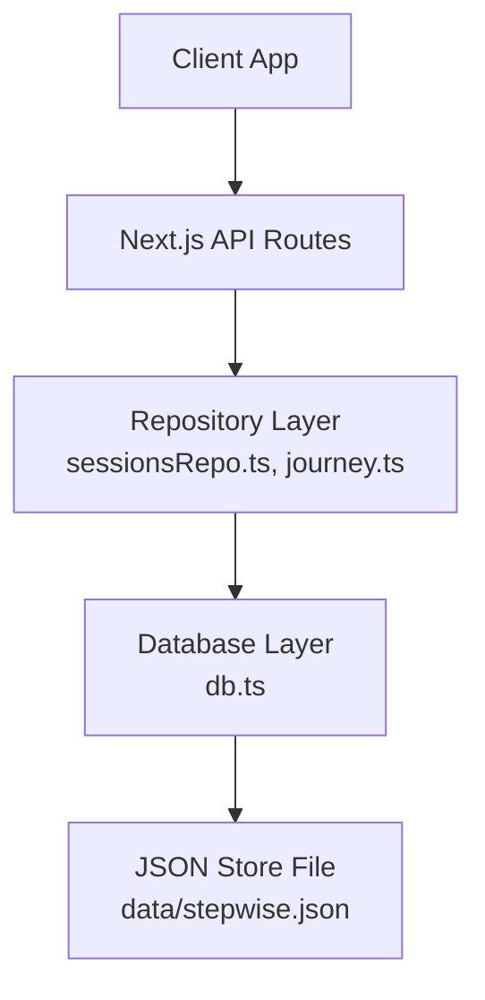
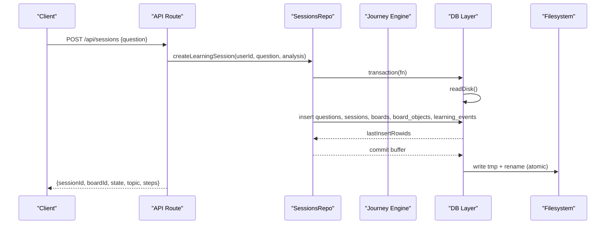
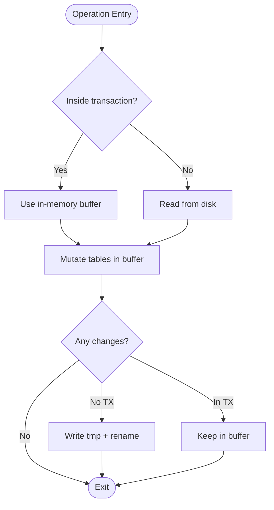
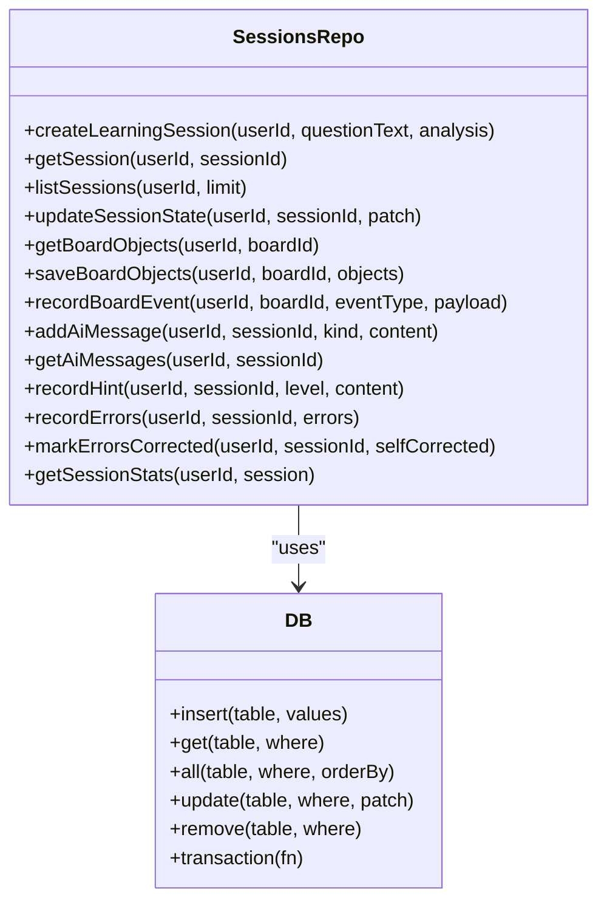
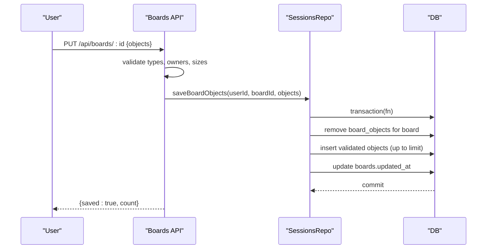
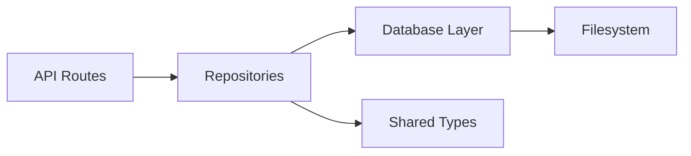

# Database Operations and Query Patterns

<cite>
**Referenced Files in This Document**
- [db.ts](file://stepwise ai/app/lib/db.ts)
- [sessionsRepo.ts](file://stepwise ai/app/lib/sessionsRepo.ts)
- [journey.ts](file://stepwise ai/app/lib/journey.ts)
- [types.ts](file://stepwise ai/app/lib/types.ts)
- [route.ts (sessions)](file://stepwise ai/app/app/api/sessions/route.ts)
- [route.ts (boards)](file://stepwise ai/app/app/api/boards/[id]/route.ts)
</cite>

## Table of Contents
1. Introduction
2. Project Structure
3. Core Components
4. Architecture Overview
5. Detailed Component Analysis
6. Dependency Analysis
7. Performance Considerations
8. Troubleshooting Guide
9. Conclusion
10. Appendices

## Introduction
This document explains how StepWise AI persists and queries data using a lightweight, embedded JSON store with a relational-style API. It covers CRUD operations, filtering via where clauses, ordering, transactional multi-step writes using temp file + rename, common query patterns across sessions and boards, performance considerations for large datasets, and the repository pattern that abstracts database access.

## Project Structure
StepWise AI separates concerns into:
- A low-level database module that implements persistence and query primitives.
- A repository layer that encapsulates domain-specific operations (sessions, boards, learning journey).
- API routes that enforce ownership and call repositories to perform data operations.

**Diagram sources**
- [route.ts (sessions):1-56](file://stepwise ai/app/app/api/sessions/route.ts#L1-L56)
- [route.ts (boards):1-106](file://stepwise ai/app/app/api/boards/[id]/route.ts#L1-L106)
- [sessionsRepo.ts:1-399](file://stepwise ai/app/lib/sessionsRepo.ts#L1-L399)
- [journey.ts:1-356](file://stepwise ai/app/lib/journey.ts#L1-L356)
- [db.ts:1-224](file://stepwise ai/app/lib/db.ts#L1-L224)

**Section sources**
- [db.ts:1-224](file://stepwise ai/app/lib/db.ts#L1-L224)
- [sessionsRepo.ts:1-399](file://stepwise ai/app/lib/sessionsRepo.ts#L1-L399)
- [journey.ts:1-356](file://stepwise ai/app/lib/journey.ts#L1-L356)
- [route.ts (sessions):1-56](file://stepwise ai/app/app/api/sessions/route.ts#L1-L56)
- [route.ts (boards):1-106](file://stepwise ai/app/app/api/boards/[id]/route.ts#L1-L106)

## Core Components
- Database layer (db.ts): Provides insert, get, all, update, remove, and transaction. It stores tables as arrays of rows in a single JSON file and uses atomic write via temp file + rename.
- Repository layer (sessionsRepo.ts, journey.ts): Encapsulates domain logic such as creating sessions, persisting board snapshots, recording events, and computing learning progress.
- Types (types.ts): Define shared domain models used by repositories and APIs.

Key responsibilities:
- db.ts: Low-level persistence, filtering, ordering, transactions, cascade delete helper.
- sessionsRepo.ts: Session lifecycle, board object persistence, hints, errors, AI messages, stats.
- journey.ts: Concept mastery tracking, recommendations, learning events, user journey aggregation.

**Section sources**
- [db.ts:116-199](file://stepwise ai/app/lib/db.ts#L116-L199)
- [sessionsRepo.ts:26-116](file://stepwise ai/app/lib/sessionsRepo.ts#L26-L116)
- [journey.ts:26-36](file://stepwise ai/app/lib/journey.ts#L26-L36)

## Architecture Overview
The application follows a layered architecture:
- API routes validate input and enforce ownership before delegating to repositories.
- Repositories coordinate multiple table operations and wrap them in transactions when needed.
- The database layer serializes changes atomically to disk.

**Diagram sources**
- [route.ts (sessions):11-44](file://stepwise ai/app/app/api/sessions/route.ts#L11-L44)
- [sessionsRepo.ts:26-116](file://stepwise ai/app/lib/sessionsRepo.ts#L26-L116)
- [db.ts:183-194](file://stepwise ai/app/lib/db.ts#L183-L194)
- [db.ts:88-94](file://stepwise ai/app/lib/db.ts#L88-L94)

## Detailed Component Analysis

### Database Layer: CRUD, Where, Ordering, Transactions
- Insert: Adds a row; auto-incremented id is assigned if configured for the table. Returns change count and last inserted id.
- Get: Finds a single row matching all key-value pairs in where.
- All: Filters rows by where and optionally sorts by a key in ascending or descending order.
- Update: Updates all rows matching where with patch fields; timestamps are updated by callers.
- Remove: Deletes all rows matching where.
- Transaction: Wraps multiple operations in an in-memory buffer; on success, writes once atomically; on error, discards changes.

Where clause behavior:
- Exact equality match across all provided keys. No operators or nested conditions.

Ordering:
- Single-key sort with direction asc/desc. Null/undefined values are sorted to the end.

Atomicity:
- Writes use a temporary file then rename to ensure consistency. Transactions buffer all changes and commit once at the end.

Cascade delete:
- Helper removes related rows across many tables within a transaction.

**Diagram sources**
- [db.ts:96-104](file://stepwise ai/app/lib/db.ts#L96-L104)
- [db.ts:183-194](file://stepwise ai/app/lib/db.ts#L183-L194)
- [db.ts:88-94](file://stepwise ai/app/lib/db.ts#L88-L94)

**Section sources**
- [db.ts:116-199](file://stepwise ai/app/lib/db.ts#L116-L199)
- [db.ts:201-223](file://stepwise ai/app/lib/db.ts#L201-L223)

### Repository Pattern: Sessions and Boards
The repository abstracts domain operations behind clear functions:
- Create a learning session: inserts question, session, board, initial board objects, and a learning event atomically.
- Retrieve session: joins sessions, questions, and boards while verifying ownership.
- List sessions: returns recent sessions with report presence flag.
- Update session state: updates status, step, timestamps, and completion time.
- Board objects: load and save full snapshots with validation and limits.
- Events and analytics: record board events, AI messages, hints, errors, and compute session stats.

Ownership enforcement:
- Every lookup includes user_id to prevent cross-user access.

**Diagram sources**
- [sessionsRepo.ts:26-399](file://stepwise ai/app/lib/sessionsRepo.ts#L26-L399)
- [db.ts:123-199](file://stepwise ai/app/lib/db.ts#L123-L199)

**Section sources**
- [sessionsRepo.ts:26-116](file://stepwise ai/app/lib/sessionsRepo.ts#L26-L116)
- [sessionsRepo.ts:118-195](file://stepwise ai/app/lib/sessionsRepo.ts#L118-L195)
- [sessionsRepo.ts:198-265](file://stepwise ai/app/lib/sessionsRepo.ts#L198-L265)
- [sessionsRepo.ts:267-399](file://stepwise ai/app/lib/sessionsRepo.ts#L267-L399)

### Learning Journey and Progress Tracking
- Ensures concepts exist and tracks their status progression.
- Records recommendations based on performance and conceptual gaps.
- Aggregates learning events and provides a user’s long-term journey view.

Common patterns:
- Upsert-like concept creation via get/insert.
- Batch inserts for recommendations and events.
- Ordered retrieval of recent events.

**Section sources**
- [journey.ts:26-36](file://stepwise ai/app/lib/journey.ts#L26-L36)
- [journey.ts:207-245](file://stepwise ai/app/lib/journey.ts#L207-L245)
- [journey.ts:325-356](file://stepwise ai/app/lib/journey.ts#L325-L356)

### API Integration Examples
- Creating a session:
  - Validates request, analyzes question via AI provider, then calls repository to create session and board atomically.
- Loading and saving boards:
  - Verifies ownership, validates inputs, and persists a snapshot with limits and sanitization.

**Diagram sources**
- [route.ts (boards):43-85](file://stepwise ai/app/app/api/boards/[id]/route.ts#L43-L85)
- [sessionsRepo.ts:239-265](file://stepwise ai/app/lib/sessionsRepo.ts#L239-L265)
- [db.ts:183-194](file://stepwise ai/app/lib/db.ts#L183-L194)

**Section sources**
- [route.ts (sessions):11-44](file://stepwise ai/app/app/api/sessions/route.ts#L11-L44)
- [route.ts (boards):28-85](file://stepwise ai/app/app/api/boards/[id]/route.ts#L28-L85)

## Dependency Analysis
- API routes depend on authentication helpers and repositories.
- Repositories depend on the database layer and shared types.
- The database layer depends only on Node filesystem utilities.

**Diagram sources**
- [route.ts (sessions):1-56](file://stepwise ai/app/app/api/sessions/route.ts#L1-L56)
- [route.ts (boards):1-106](file://stepwise ai/app/app/api/boards/[id]/route.ts#L1-L106)
- [sessionsRepo.ts:1-399](file://stepwise ai/app/lib/sessionsRepo.ts#L1-L399)
- [journey.ts:1-356](file://stepwise ai/app/lib/journey.ts#L1-L356)
- [db.ts:1-224](file://stepwise ai/app/lib/db.ts#L1-L224)
- [types.ts:1-302](file://stepwise ai/app/lib/types.ts#L1-L302)

**Section sources**
- [sessionsRepo.ts:1-399](file://stepwise ai/app/lib/sessionsRepo.ts#L1-L399)
- [journey.ts:1-356](file://stepwise ai/app/lib/journey.ts#L1-L356)
- [db.ts:1-224](file://stepwise ai/app/lib/db.ts#L1-L224)
- [types.ts:1-302](file://stepwise ai/app/lib/types.ts#L1-L302)

## Performance Considerations
- In-memory buffering per transaction reduces disk I/O by committing once at the end.
- Atomic writes via temp file + rename avoid partial writes and corruption.
- Input size limits protect against oversized payloads (e.g., board objects limited to 500 items; content truncated to safe lengths).
- Sorting is single-key; avoid deep nesting or complex expressions in where clauses.
- For large datasets:
  - Prefer narrow selects by including specific where keys (e.g., user_id, session_id).
  - Use ordered queries with small limits to reduce sorting overhead.
  - Batch writes inside transactions to minimize disk syncs.
  - Consider archiving or partitioning historical data if tables grow significantly.
  - Monitor JSON file size; consider migrating to a server-side database when scale demands it.

[No sources needed since this section provides general guidance]

## Troubleshooting Guide
- Ownership errors:
  - Ensure queries include user_id to prevent unauthorized access. If a board or session is not found, verify ownership checks in the route and repository.
- Unexpected empty results:
  - Verify where keys match stored field names and types. Remember where uses exact equality across all keys.
- Data not persisted:
  - Confirm operations run inside a transaction when multiple writes must be consistent. Outside transactions, each write commits immediately; ensure no exceptions occur mid-operation.
- Cascade deletes:
  - Use the provided cascade helper to remove related records consistently.

**Section sources**
- [route.ts (boards):24-35](file://stepwise ai/app/app/api/boards/[id]/route.ts#L24-L35)
- [sessionsRepo.ts:118-146](file://stepwise ai/app/lib/sessionsRepo.ts#L118-L146)
- [db.ts:183-194](file://stepwise ai/app/lib/db.ts#L183-L194)
- [db.ts:201-223](file://stepwise ai/app/lib/db.ts#L201-L223)

## Conclusion
StepWise AI’s data layer combines a simple, robust JSON store with a clean repository pattern. CRUD operations are straightforward, filtering is exact-match based, and ordering supports single-key asc/desc. Transactions provide atomic multi-step operations using temp file + rename. Repositories encapsulate domain workflows like session creation, board persistence, and learning progress tracking, while enforcing ownership and safety constraints. For growing workloads, apply batching, careful querying, and eventual migration to a server-side database.

[No sources needed since this section summarizes without analyzing specific files]

## Appendices

### Common Query Patterns
- Find user sessions:
  - Filter sessions by user_id, order by id desc, limit results, and enrich with question text and report presence.
- Retrieve board objects:
  - Verify board ownership, fetch board_objects by board_id, and sort by z_index.
- Update learning progress:
  - Patch session fields (state, current_step, status, timestamps), set ended_at on completion.
- Record hints and errors:
  - Insert hint and corresponding learning event; batch-insert errors with truncation and mark corrections later.

**Section sources**
- [sessionsRepo.ts:148-174](file://stepwise ai/app/lib/sessionsRepo.ts#L148-L174)
- [sessionsRepo.ts:198-204](file://stepwise ai/app/lib/sessionsRepo.ts#L198-L204)
- [sessionsRepo.ts:176-195](file://stepwise ai/app/lib/sessionsRepo.ts#L176-L195)
- [sessionsRepo.ts:314-361](file://stepwise ai/app/lib/sessionsRepo.ts#L314-L361)