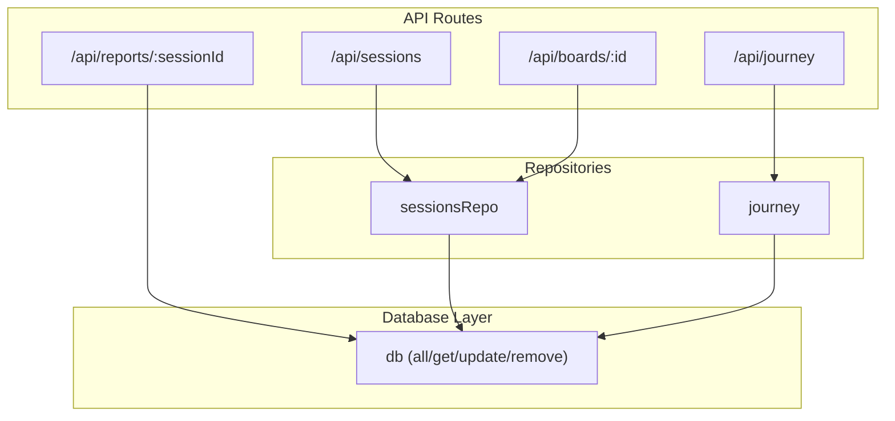
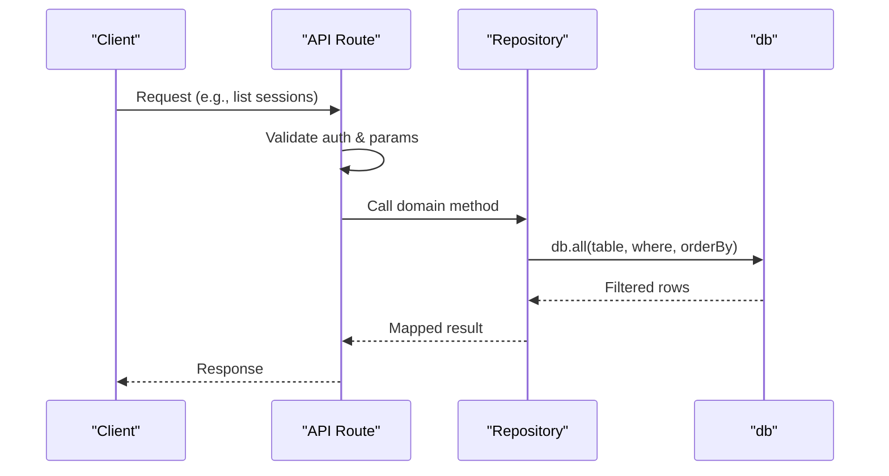
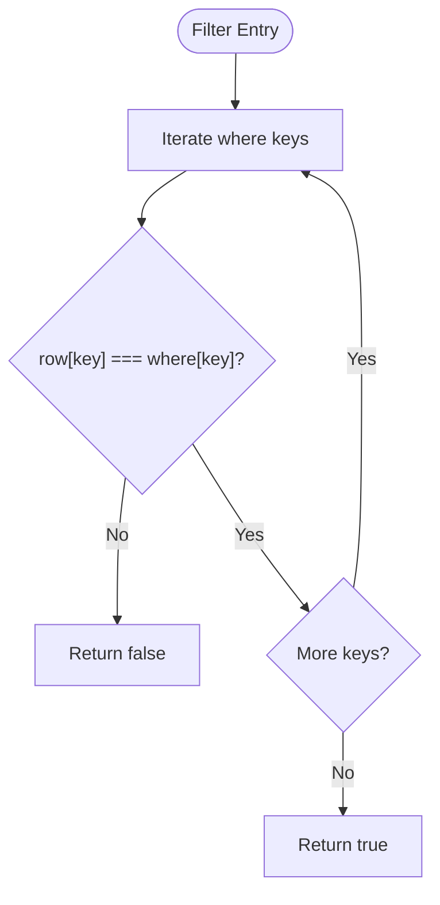
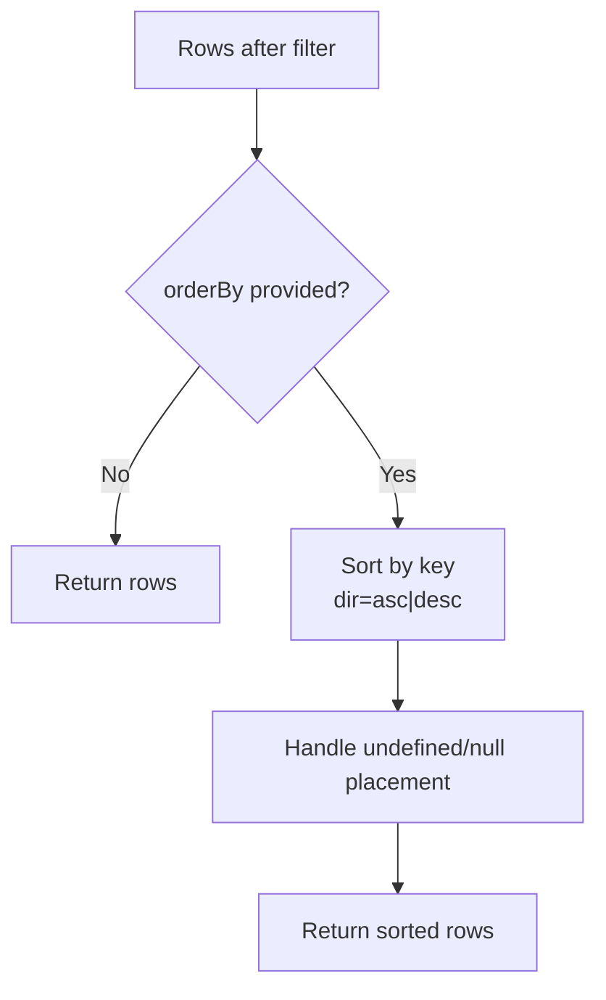
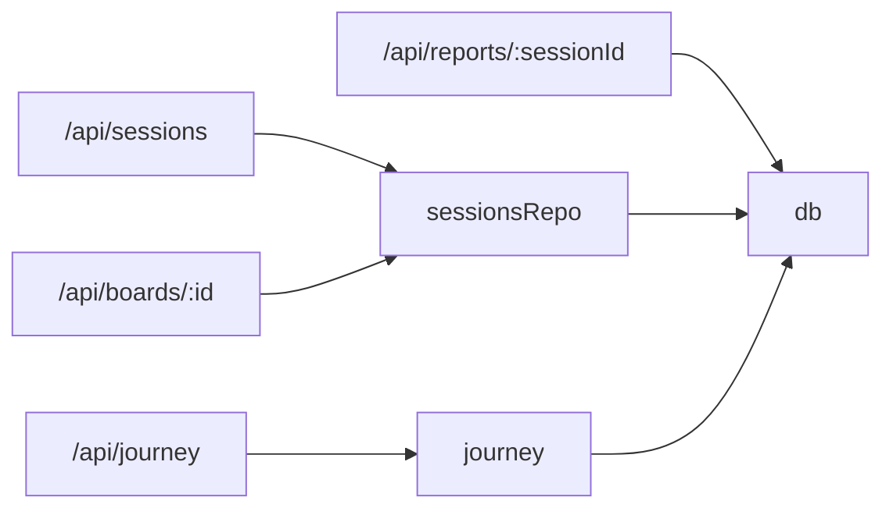

# Query Patterns and Filtering

<cite>
**Referenced Files in This Document**
- [db.ts](file://stepwise ai/app/lib/db.ts)
- [sessionsRepo.ts](file://stepwise ai/app/lib/sessionsRepo.ts)
- [journey.ts](file://stepwise ai/app/lib/journey.ts)
- [types.ts](file://stepwise ai/app/lib/types.ts)
- [route.ts (sessions)](file://stepwise ai/app/app/api/sessions/route.ts)
- [route.ts (boards/[id])](file://stepwise ai/app/app/api/boards/[id]/route.ts)
- [route.ts (reports/[sessionId])](file://stepwise ai/app/app/api/reports/[sessionId]/route.ts)
</cite>

## Table of Contents
1. [Introduction](#introduction)
2. [Project Structure](#project-structure)
3. [Core Components](#core-components)
4. [Architecture Overview](#architecture-overview)
5. [Detailed Component Analysis](#detailed-component-analysis)
6. [Dependency Analysis](#dependency-analysis)
7. [Performance Considerations](#performance-considerations)
8. [Troubleshooting Guide](#troubleshooting-guide)
9. [Conclusion](#conclusion)

## Introduction
This document explains how StepWise AI performs queries and filtering across its embedded JSON store. It focuses on:
- The where clause system that supports exact matching across multiple fields
- How the matches function evaluates conditions
- The orderBy functionality for sorting results by any field with ascending or descending order support
- Common query patterns used throughout the application (user sessions, board objects, learning events)
- Examples of complex queries combining filters and sorting
- Performance considerations and strategies to construct efficient queries

## Project Structure
The query layer is implemented in a small database module that exposes a simple relational-style API. Repository modules build domain-specific operations using this API, and API routes orchestrate requests while enforcing ownership and returning structured responses.

**Diagram sources**
- [route.ts (sessions):1-56](file://stepwise ai/app/app/api/sessions/route.ts#L1-L56)
- [route.ts (boards/[id]):1-106](file://stepwise ai/app/app/api/boards/[id]/route.ts#L1-L106)
- [route.ts (reports/[sessionId]):1-21](file://stepwise ai/app/app/api/reports/[sessionId]/route.ts#L1-L21)
- [sessionsRepo.ts:1-399](file://stepwise ai/app/lib/sessionsRepo.ts#L1-L399)
- [journey.ts:207-356](file://stepwise ai/app/lib/journey.ts#L207-L356)
- [db.ts:110-199](file://stepwise ai/app/lib/db.ts#L110-L199)

**Section sources**
- [db.ts:110-199](file://stepwise ai/app/lib/db.ts#L110-L199)
- [sessionsRepo.ts:1-399](file://stepwise ai/app/lib/sessionsRepo.ts#L1-L399)
- [journey.ts:207-356](file://stepwise ai/app/lib/journey.ts#L207-L356)
- [route.ts (sessions):1-56](file://stepwise ai/app/app/api/sessions/route.ts#L1-L56)
- [route.ts (boards/[id]):1-106](file://stepwise ai/app/app/api/boards/[id]/route.ts#L1-L106)
- [route.ts (reports/[sessionId]):1-21](file://stepwise ai/app/app/api/reports/[sessionId]/route.ts#L1-L21)

## Core Components
- Database layer: Provides all/get/update/remove with a where clause and optional orderBy.
- Matches function: Performs exact equality checks across all keys provided in the where object.
- Repositories: Implement domain operations such as session management, board persistence, and journey aggregation.
- API routes: Enforce authentication and ownership, then delegate to repositories or direct db calls.

Key capabilities:
- Exact multi-field matching via where objects
- Sorting by any field with asc/desc direction
- Transactional writes for consistency
- Ownership verification before reads/writes

**Section sources**
- [db.ts:116-139](file://stepwise ai/app/lib/db.ts#L116-L139)
- [db.ts:141-181](file://stepwise ai/app/lib/db.ts#L141-L181)
- [db.ts:183-199](file://stepwise ai/app/lib/db.ts#L183-L199)

## Architecture Overview
The query flow starts at an API route, which validates input and user context, then delegates to repository functions or direct db calls. Repositories compose db.all and db.get with precise where clauses and orderBy options to retrieve data efficiently.

**Diagram sources**
- [route.ts (sessions):1-56](file://stepwise ai/app/app/api/sessions/route.ts#L1-L56)
- [sessionsRepo.ts:148-174](file://stepwise ai/app/lib/sessionsRepo.ts#L148-L174)
- [db.ts:123-139](file://stepwise ai/app/lib/db.ts#L123-L139)

## Detailed Component Analysis

### Where Clause and Matches Function
- The where clause is a plain object whose keys must match row properties exactly.
- The matches function iterates over where keys and returns false if any key’s value differs from the row’s value.
- This enables multi-field exact matching by passing multiple keys in the where object.

Common usage patterns:
- Single-field filter: { id: sessionId }
- Multi-field filter: { session_id: sessionId, user_id: userId }
- Combined with orderBy: { key: "created_at", dir: "desc" }

**Diagram sources**
- [db.ts:116-121](file://stepwise ai/app/lib/db.ts#L116-L121)

**Section sources**
- [db.ts:116-121](file://stepwise ai/app/lib/db.ts#L116-L121)

### OrderBy Functionality
- The all method accepts an optional orderBy parameter with a key and optional direction ("asc" default, "desc").
- Sorting compares values directly; undefined/null values are ordered last.
- Sorting is applied after filtering, ensuring correct result sets.

Usage examples:
- Newest first: { key: "id", dir: "desc" }
- Chronological: { key: "created_at" }
- Z-index ordering: { key: "z_index" }

**Diagram sources**
- [db.ts:123-139](file://stepwise ai/app/lib/db.ts#L123-L139)

**Section sources**
- [db.ts:123-139](file://stepwise ai/app/lib/db.ts#L123-L139)

### Common Query Patterns

#### Finding User Sessions
- List recent sessions for a user with limit and sort by newest first.
- Combine with question lookup to enrich response.

Pattern highlights:
- Filter by user_id
- Sort by id desc
- Slice to limit results

**Section sources**
- [sessionsRepo.ts:148-174](file://stepwise ai/app/lib/sessionsRepo.ts#L148-L174)
- [route.ts (sessions):46-55](file://stepwise ai/app/app/api/sessions/route.ts#L46-L55)

#### Retrieving Board Objects
- Verify ownership of the board by checking { id, user_id }.
- Retrieve board objects filtered by board_id and sorted by z_index.

Pattern highlights:
- Ownership check via db.get
- Filter by board_id
- Sort by z_index for rendering order

**Section sources**
- [route.ts (boards/[id]):24-35](file://stepwise ai/app/app/api/boards/[id]/route.ts#L24-L35)
- [sessionsRepo.ts:197-204](file://stepwise ai/app/lib/sessionsRepo.ts#L197-L204)

#### Filtering Learning Events
- Fetch learning events for a user, sorted by id desc, limited to recent entries.
- Used to display activity timelines and insights.

Pattern highlights:
- Filter by user_id
- Sort by id desc
- Limit via slice

**Section sources**
- [journey.ts:329-336](file://stepwise ai/app/lib/journey.ts#L329-L336)

#### Complex Queries Combining Filters and Sorting
- Journey view aggregates multiple tables:
  - student_concepts filtered by user_id, sorted by updated_at desc
  - misconceptions filtered by user_id, sorted by last_detected desc
  - review_items filtered by user_id and status "pending", sorted by due_at
  - recommendations filtered by user_id, sorted by id desc
  - learning_events filtered by user_id, sorted by id desc

These demonstrate chaining multiple where clauses and orderBy options across different tables to produce a comprehensive report.

**Section sources**
- [journey.ts:287-336](file://stepwise ai/app/lib/journey.ts#L287-L336)

#### Report Access with Ownership Verification
- Reports endpoint verifies ownership by querying reports with both session_id and user_id.
- Ensures users can only access their own reports.

**Section sources**
- [route.ts (reports/[sessionId]):8-16](file://stepwise ai/app/app/api/reports/[sessionId]/route.ts#L8-L16)

### Data Models and Types
- Session state machine defines lifecycle states used in sessions.
- BoardObject type describes visual elements persisted per board.
- These types guide how queries map raw rows into domain models.

**Section sources**
- [types.ts:7-24](file://stepwise ai/app/lib/types.ts#L7-L24)
- [types.ts:26-57](file://stepwise ai/app/lib/types.ts#L26-L57)

## Dependency Analysis
- API routes depend on repositories and/or db directly.
- Repositories depend on db for all data operations.
- Types define contracts between layers.

**Diagram sources**
- [route.ts (sessions):1-56](file://stepwise ai/app/app/api/sessions/route.ts#L1-L56)
- [route.ts (boards/[id]):1-106](file://stepwise ai/app/app/api/boards/[id]/route.ts#L1-L106)
- [route.ts (reports/[sessionId]):1-21](file://stepwise ai/app/app/api/reports/[sessionId]/route.ts#L1-L21)
- [sessionsRepo.ts:1-399](file://stepwise ai/app/lib/sessionsRepo.ts#L1-L399)
- [journey.ts:207-356](file://stepwise ai/app/lib/journey.ts#L207-L356)
- [db.ts:110-199](file://stepwise ai/app/lib/db.ts#L110-L199)

**Section sources**
- [db.ts:110-199](file://stepwise ai/app/lib/db.ts#L110-L199)
- [sessionsRepo.ts:1-399](file://stepwise ai/app/lib/sessionsRepo.ts#L1-L399)
- [journey.ts:207-356](file://stepwise ai/app/lib/journey.ts#L207-L356)

## Performance Considerations
- In-memory filtering: All filtering occurs in memory after reading the table snapshot. For large datasets, prefer narrow where clauses to minimize rows processed.
- Sorting overhead: Sorting is applied post-filter; use orderBy only when necessary and avoid deep nesting or heavy transformations.
- Limiting results: Use slice to cap returned rows (e.g., limiting sessions or events) to reduce payload size and processing time.
- Transactions: Batch writes within transactions to reduce disk I/O and ensure consistency.
- Field selection: Map rows to minimal required fields before returning to clients to reduce serialization cost.
- Avoid unnecessary joins: Compose multiple db.get calls carefully; consider caching repeated lookups within a request scope if needed.

Optimization strategies:
- Always include user_id in where clauses to restrict scope early.
- Prefer specific identifiers (id, session_id) for fast equality checks.
- Use orderBy sparingly and only on stable numeric or timestamp fields.
- Cap result sets with slice to prevent large payloads.
- Reuse computed values within a transaction to avoid redundant reads.

[No sources needed since this section provides general guidance]

## Troubleshooting Guide
- Unexpected empty results: Ensure where keys match actual row properties and types; verify user_id and foreign keys.
- Incorrect sort order: Confirm orderBy.key exists and values are comparable; note that undefined/null are placed last.
- Ownership errors: Verify that get/update/remove calls include user_id to enforce access control.
- Large payloads: Apply slice limits and map to minimal fields to reduce response size.

**Section sources**
- [db.ts:116-139](file://stepwise ai/app/lib/db.ts#L116-L139)
- [sessionsRepo.ts:197-204](file://stepwise ai/app/lib/sessionsRepo.ts#L197-L204)
- [journey.ts:287-336](file://stepwise ai/app/lib/journey.ts#L287-L336)

## Conclusion
StepWise AI’s query system centers around a simple yet powerful where clause that supports exact multi-field matching and an orderBy option for flexible sorting. Repositories encapsulate common patterns like listing user sessions, retrieving board objects, and aggregating learning events, while API routes enforce ownership and return structured responses. For large datasets, focus on narrowing where clauses, limiting results, and minimizing transformations to maintain performance.

[No sources needed since this section summarizes without analyzing specific files]