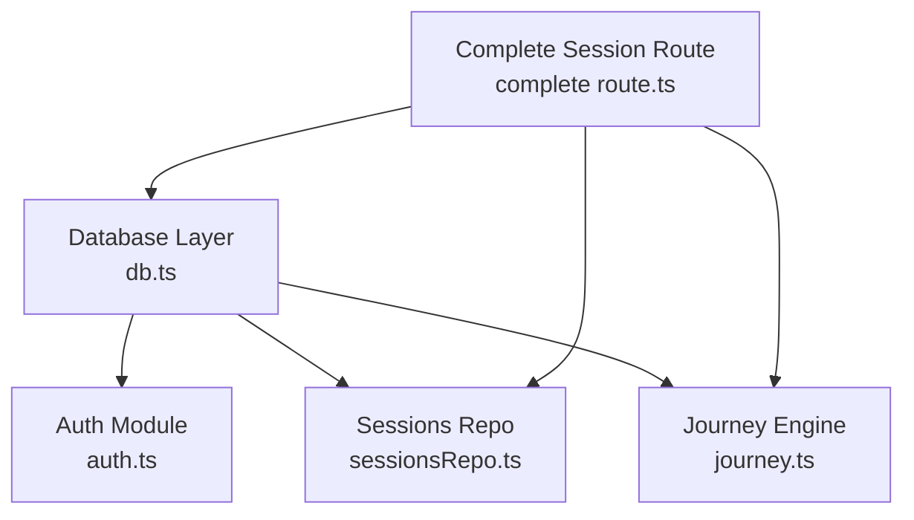
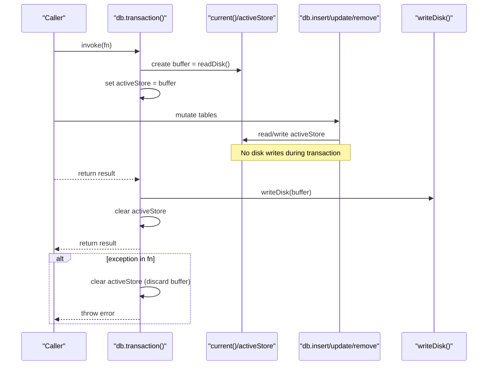
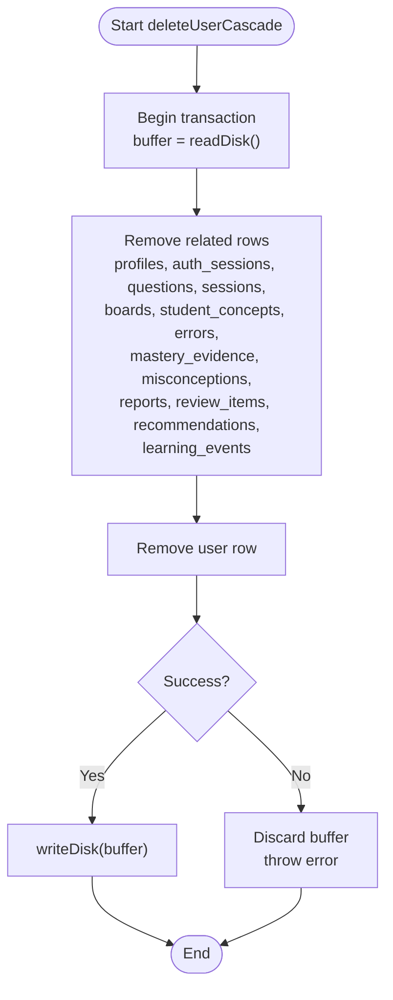
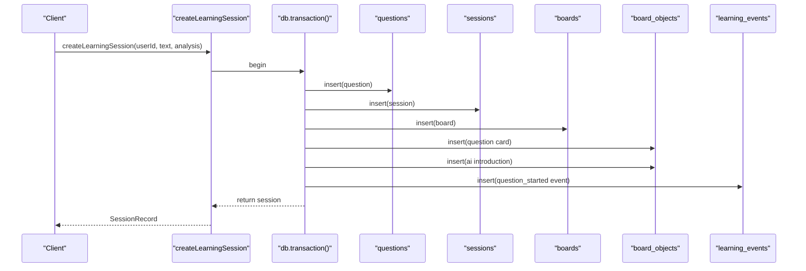
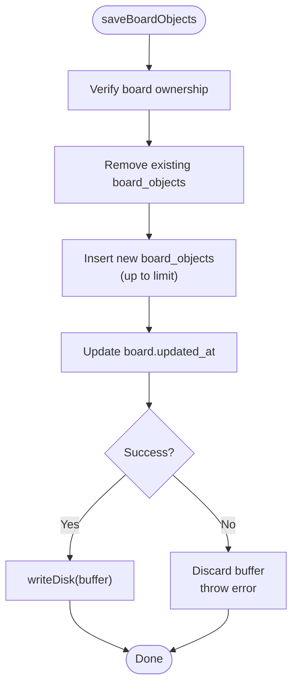
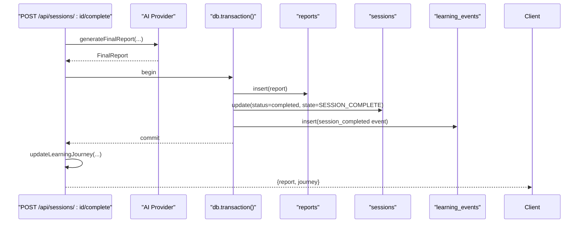
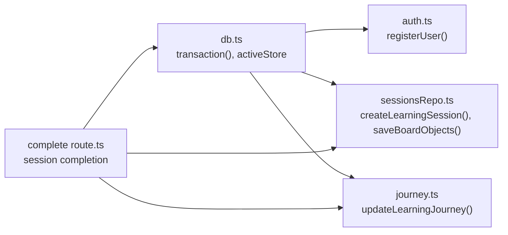

# Transaction Management

<cite>
**Referenced Files in This Document**
- [db.ts](file://stepwise ai/app/lib/db.ts)
- [auth.ts](file://stepwise ai/app/lib/auth.ts)
- [sessionsRepo.ts](file://stepwise ai/app/lib/sessionsRepo.ts)
- [journey.ts](file://stepwise ai/app/lib/journey.ts)
- [complete route.ts](file://stepwise ai/app/app/api/sessions/[id]/complete/route.ts)
</cite>

## Table of Contents
1. [Introduction](#introduction)
2. [Project Structure](#project-structure)
3. [Core Components](#core-components)
4. [Architecture Overview](#architecture-overview)
5. [Detailed Component Analysis](#detailed-component-analysis)
6. [Dependency Analysis](#dependency-analysis)
7. [Performance Considerations](#performance-considerations)
8. [Troubleshooting Guide](#troubleshooting-guide)
9. [Conclusion](#conclusion)

## Introduction
This document explains how StepWise AI ensures data consistency across multi-step database operations using its transaction management layer. The core mechanism is a transaction() method that buffers all mutations in memory during execution and commits them atomically at the end. An activeStore variable holds the working copy of the store while a transaction runs, preventing intermediate writes to disk until the transaction completes successfully. If any operation inside a transaction fails, the buffer is discarded and no partial changes are persisted.

The documentation covers:
- How transactions collect and commit mutations
- The role of activeStore in buffering changes
- Real-world examples from the codebase (user deletion cascade, session creation, board snapshot save, final report completion)
- Error handling and rollback behavior
- Best practices for transaction scope and performance

## Project Structure
The transaction system lives in the database module and is consumed by several domain modules that perform multi-table updates.

**Diagram sources**
- [db.ts:123-199](file://stepwise ai/app/lib/db.ts#L123-L199)
- [auth.ts:104-128](file://stepwise ai/app/lib/auth.ts#L104-L128)
- [sessionsRepo.ts:26-116](file://stepwise ai/app/lib/sessionsRepo.ts#L26-L116)
- [journey.ts:59-262](file://stepwise ai/app/lib/journey.ts#L59-L262)
- [complete route.ts:76-98](file://stepwise ai/app/app/api/sessions/[id]/complete/route.ts#L76-L98)

**Section sources**
- [db.ts:1-224](file://stepwise ai/app/lib/db.ts#L1-L224)

## Core Components
- Store shape and persistence:
  - The store contains tables and sequence counters. It is read from or written to a JSON file on disk.
  - Writes use an atomic temp-file + rename pattern to avoid partial files.
- Transaction buffer:
  - A module-level activeStore holds the working copy during a transaction.
  - All reads within a transaction see the buffered state via current().
  - All writes modify the buffer; they do not write to disk immediately when activeStore is set.
- Atomic commit:
  - On successful completion, the buffer is written to disk as one unit.
  - On failure, the buffer is discarded and no changes persist.

Key implementation references:
- Store lifecycle and activeStore: [db.ts:61-99](file://stepwise ai/app/lib/db.ts#L61-L99)
- Transaction boundary and commit: [db.ts:183-194](file://stepwise ai/app/lib/db.ts#L183-L194)
- Cascade delete example: [db.ts:201-223](file://stepwise ai/app/lib/db.ts#L201-L223)

**Section sources**
- [db.ts:61-99](file://stepwise ai/app/lib/db.ts#L61-L99)
- [db.ts:183-194](file://stepwise ai/app/lib/db.ts#L183-L194)
- [db.ts:201-223](file://stepwise ai/app/lib/db.ts#L201-L223)

## Architecture Overview
At runtime, each request may call domain functions that wrap multiple db operations in db.transaction(). Inside the transaction:
- Reads go through current(), which returns activeStore if present, otherwise reads from disk.
- Mutations update activeStore.tables and sequences.
- commit(s) only writes to disk when not inside a transaction; inside a transaction, writes stay in memory.
- At the end of the transaction callback, the buffer is written once to disk. If an exception occurs, the finally block clears activeStore and the buffer is lost.

**Diagram sources**
- [db.ts:61-99](file://stepwise ai/app/lib/db.ts#L61-L99)
- [db.ts:183-194](file://stepwise ai/app/lib/db.ts#L183-L194)

## Detailed Component Analysis

### Transaction Buffer and Active Store
- activeStore is a module-level variable that is non-null only during a transaction.
- current() returns activeStore when present, ensuring all reads within a transaction see uncommitted changes made earlier in the same transaction.
- commit(s) skips disk writes when activeStore is set, deferring persistence until the transaction ends.

Behavioral implications:
- Consistency: Intermediate states never leak to disk.
- Isolation: Each transaction works against a fresh snapshot of disk state at start time.
- Atomicity: Either all changes in the transaction are persisted, or none are.

References:
- activeStore declaration and usage: [db.ts:61-99](file://stepwise ai/app/lib/db.ts#L61-L99)
- Transaction wrapper: [db.ts:183-194](file://stepwise ai/app/lib/db.ts#L183-L194)

**Section sources**
- [db.ts:61-99](file://stepwise ai/app/lib/db.ts#L61-L99)
- [db.ts:183-194](file://stepwise ai/app/lib/db.ts#L183-L194)

### User Deletion Cascade
A comprehensive cascade removes all user-related records before deleting the user itself, all within a single transaction.

Flow:
- Start transaction with a fresh buffer.
- Delete related rows across many tables (profiles, sessions, boards, events, etc.).
- Finally delete the user row.
- Commit once at the end.

**Diagram sources**
- [db.ts:201-223](file://stepwise ai/app/lib/db.ts#L201-L223)
- [db.ts:183-194](file://stepwise ai/app/lib/db.ts#L183-L194)

**Section sources**
- [db.ts:201-223](file://stepwise ai/app/lib/db.ts#L201-L223)

### Learning Session Creation Workflow
Creating a learning session involves inserting into multiple tables and seeding initial board objects, all atomically.

Steps:
- Insert question record.
- Insert session record referencing the question.
- Insert board record referencing the session.
- Seed board_objects for the question and AI introduction.
- Record a learning_event indicating the session started.
- Return the created session view.

**Diagram sources**
- [sessionsRepo.ts:26-116](file://stepwise ai/app/lib/sessionsRepo.ts#L26-L116)
- [db.ts:183-194](file://stepwise ai/app/lib/db.ts#L183-L194)

**Section sources**
- [sessionsRepo.ts:26-116](file://stepwise ai/app/lib/sessionsRepo.ts#L26-L116)

### Save Board Snapshot
Saving a full board snapshot replaces all objects for a board atomically.

Flow:
- Verify ownership of the board.
- Remove existing board_objects for the board.
- Insert new objects (with size/content limits).
- Update board updated_at timestamp.
- Commit once.

**Diagram sources**
- [sessionsRepo.ts:239-265](file://stepwise ai/app/lib/sessionsRepo.ts#L239-L265)
- [db.ts:183-194](file://stepwise ai/app/lib/db.ts#L183-L194)

**Section sources**
- [sessionsRepo.ts:239-265](file://stepwise ai/app/lib/sessionsRepo.ts#L239-L265)

### Final Report Completion
Finalizing a session generates a report and persists it together with session finalization and a completion event in one transaction.

Flow:
- Generate final report externally.
- Within a transaction:
  - Insert report record.
  - Update session state to completed.
  - Record session_completed event.
- After the transaction, update the learning journey separately.

**Diagram sources**
- [complete route.ts:76-98](file://stepwise ai/app/app/api/sessions/[id]/complete/route.ts#L76-L98)
- [db.ts:183-194](file://stepwise ai/app/lib/db.ts#L183-L194)

**Section sources**
- [complete route.ts:76-98](file://stepwise ai/app/app/api/sessions/[id]/complete/route.ts#L76-L98)

### Learning Journey Update
Updating the learning journey touches multiple tables to reflect concept mastery, misconceptions, reviews, and recommendations.

Highlights:
- Misconception lifecycle updates or inserts.
- Concept status transitions based on evidence and hints used.
- Mastery evidence recording.
- Spaced review scheduling.
- Recommendations insertion.
- Learning event logging.

All these steps occur within a single transaction to ensure consistent state across tables.

**Section sources**
- [journey.ts:59-262](file://stepwise ai/app/lib/journey.ts#L59-L262)

### Registration Transaction
User registration creates both a user and a profile atomically.

Flow:
- Insert user with hashed password and timestamps.
- Insert profile linked to the new user.
- Return the new user id.

**Section sources**
- [auth.ts:104-128](file://stepwise ai/app/lib/auth.ts#L104-L128)

## Dependency Analysis
The transaction system is central to several modules:

**Diagram sources**
- [db.ts:183-194](file://stepwise ai/app/lib/db.ts#L183-L194)
- [auth.ts:104-128](file://stepwise ai/app/lib/auth.ts#L104-L128)
- [sessionsRepo.ts:26-116](file://stepwise ai/app/lib/sessionsRepo.ts#L26-L116)
- [sessionsRepo.ts:239-265](file://stepwise ai/app/lib/sessionsRepo.ts#L239-L265)
- [journey.ts:59-262](file://stepwise ai/app/lib/journey.ts#L59-L262)
- [complete route.ts:76-98](file://stepwise ai/app/app/api/sessions/[id]/complete/route.ts#L76-L98)

**Section sources**
- [db.ts:183-194](file://stepwise ai/app/lib/db.ts#L183-L194)
- [auth.ts:104-128](file://stepwise ai/app/lib/auth.ts#L104-L128)
- [sessionsRepo.ts:26-116](file://stepwise ai/app/lib/sessionsRepo.ts#L26-L116)
- [sessionsRepo.ts:239-265](file://stepwise ai/app/lib/sessionsRepo.ts#L239-L265)
- [journey.ts:59-262](file://stepwise ai/app/lib/journey.ts#L59-L262)
- [complete route.ts:76-98](file://stepwise ai/app/app/api/sessions/[id]/complete/route.ts#L76-L98)

## Performance Considerations
- Single write per transaction: Because writes are deferred until commit, a transaction performs one disk write instead of many, reducing I/O overhead.
- Memory buffer: Large transactions keep all changes in memory; keep transaction scopes tight to avoid excessive memory usage.
- Read isolation: Reads within a transaction see the buffered state, avoiding repeated disk reads and ensuring consistency.
- Batch operations: Group related inserts/updates into one transaction to minimize disk writes and improve throughput.
- Avoid long-running transactions: Keep business logic inside the transaction minimal to reduce lock-like contention on the in-memory buffer and to fail fast on errors.

[No sources needed since this section provides general guidance]

## Troubleshooting Guide
Common issues and how the transaction system handles them:
- Partial failures: If any operation inside a transaction throws, the buffer is discarded and no changes are persisted. This prevents inconsistent states such as a user without a profile or a session without its board.
- Ownership checks: Some transactions include ownership verification (e.g., saving board objects). If ownership fails, an error is thrown and the transaction rolls back.
- Idempotency: In session completion, duplicate reports are prevented before starting the transaction, avoiding redundant work.

Operational tips:
- Wrap all multi-table updates in db.transaction() to guarantee atomicity.
- Validate inputs and ownership before beginning a transaction to fail early.
- Keep transaction callbacks small and focused on data mutations; move heavy computation outside the transaction where possible.

**Section sources**
- [db.ts:183-194](file://stepwise ai/app/lib/db.ts#L183-L194)
- [sessionsRepo.ts:239-265](file://stepwise ai/app/lib/sessionsRepo.ts#L239-L265)
- [complete route.ts:23-27](file://stepwise ai/app/app/api/sessions/[id]/complete/route.ts#L23-L27)

## Conclusion
StepWise AI’s transaction management uses a simple but effective buffer mechanism to ensure atomicity and consistency across multi-step operations. By collecting mutations in memory and committing them once at the end, the system avoids partial writes and maintains data integrity. The activeStore isolates in-flight changes from disk until a transaction succeeds. Real-world workflows—such as user deletion cascades, session creation, board snapshots, and final report completion—demonstrate how transactions encapsulate complex, cross-table operations safely. Following best practices around transaction scope, validation, and performance will help maintain reliable and efficient data operations.

[No sources needed since this section summarizes without analyzing specific files]