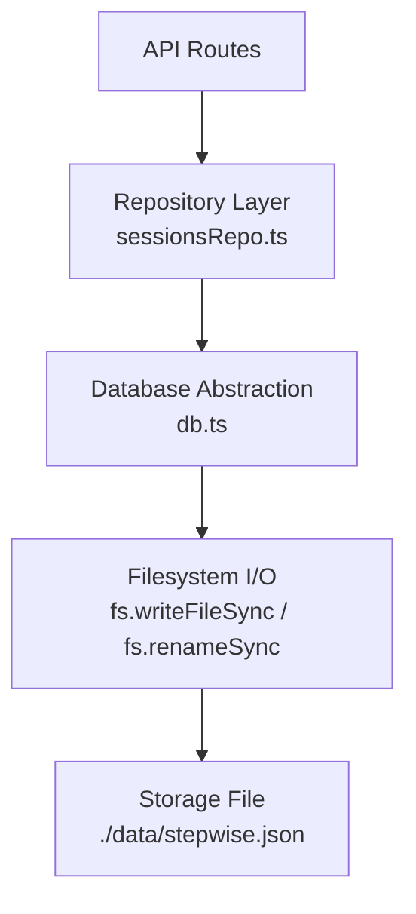
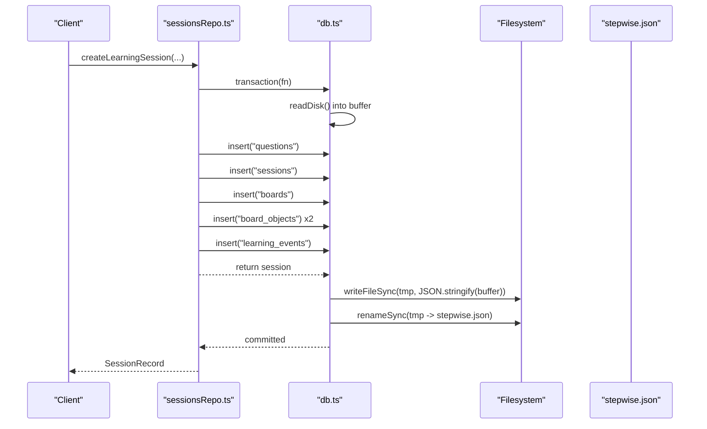
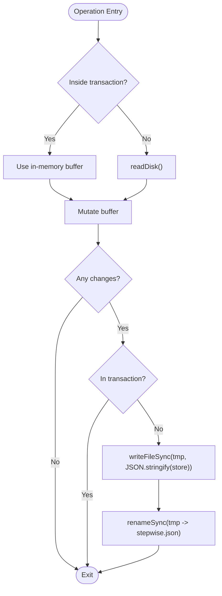
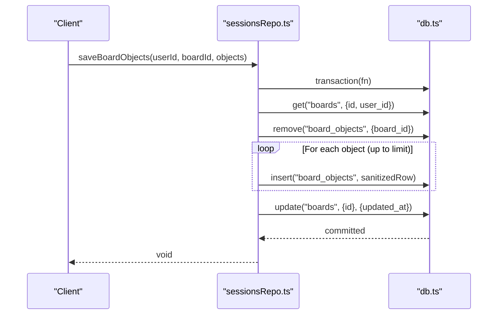
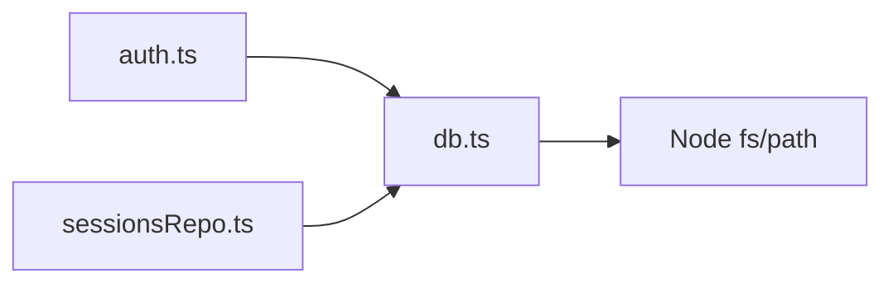

# Persistence Layer and Storage

<cite>
**Referenced Files in This Document**
- [db.ts](file://stepwise ai/app/lib/db.ts)
- [sessionsRepo.ts](file://stepwise ai/app/lib/sessionsRepo.ts)
- [types.ts](file://stepwise ai/app/lib/types.ts)
- [auth.ts](file://stepwise ai/app/lib/auth.ts)
- [package.json](file://stepwise ai/app/package.json)
- [.gitignore](file://stepwise ai/app/.gitignore)
</cite>

## Table of Contents
1. [Introduction](#introduction)
2. [Project Structure](#project-structure)
3. [Core Components](#core-components)
4. [Architecture Overview](#architecture-overview)
5. [Detailed Component Analysis](#detailed-component-analysis)
6. [Dependency Analysis](#dependency-analysis)
7. [Performance Considerations](#performance-considerations)
8. [Troubleshooting Guide](#troubleshooting-guide)
9. [Conclusion](#conclusion)
10. [Appendices](#appendices)

## Introduction
This document explains StepWise AI’s persistence layer: a JSON-based embedded database that stores all application data in a single file. It covers the storage model, atomic write semantics using temporary files and rename, startup behavior that initializes default tables, backup and recovery strategies, migration approaches for schema evolution, and performance characteristics with scalability considerations for production deployments.

## Project Structure
The persistence layer is implemented as a small, self-contained module that reads and writes a JSON file on disk. The repository organizes this logic under the app library, with higher-level repositories (e.g., sessions) building on top of it.

**Diagram sources**
- [db.ts:14-15](file://stepwise ai/app/lib/db.ts#L14-L15)
- [db.ts:73-94](file://stepwise ai/app/lib/db.ts#L73-L94)
- [sessionsRepo.ts:6-7](file://stepwise ai/app/lib/sessionsRepo.ts#L6-L7)

**Section sources**
- [db.ts:1-13](file://stepwise ai/app/lib/db.ts#L1-L13)
- [sessionsRepo.ts:1-8](file://stepwise ai/app/lib/sessionsRepo.ts#L1-L8)

## Core Components
- Embedded JSON store with a relational-style API (CRUD operations).
- Atomic writes via temporary file plus rename to ensure consistency.
- Transaction support for multi-step operations that commit once or discard on error.
- Default table initialization at startup to ensure schema readiness.
- Repository functions that enforce ownership checks and orchestrate cross-table updates.

Key responsibilities:
- db.ts: Low-level persistence, file I/O, transactional buffer, auto-increment sequences, cascade delete helper.
- sessionsRepo.ts: Business-oriented operations for sessions, boards, events, messages, hints, errors, and stats.
- types.ts: Shared domain models used by repositories and routes.

**Section sources**
- [db.ts:17-49](file://stepwise ai/app/lib/db.ts#L17-L49)
- [db.ts:123-199](file://stepwise ai/app/lib/db.ts#L123-L199)
- [sessionsRepo.ts:26-116](file://stepwise ai/app/lib/sessionsRepo.ts#L26-L116)
- [types.ts:1-57](file://stepwise ai/app/lib/types.ts#L1-L57)

## Architecture Overview
StepWise uses an embedded JSON database with a simple interface that mimics relational operations. All writes are synchronous and atomic through a temp-file + rename pattern. Transactions buffer changes in memory and persist them atomically at the end.

**Diagram sources**
- [sessionsRepo.ts:26-116](file://stepwise ai/app/lib/sessionsRepo.ts#L26-L116)
- [db.ts:183-194](file://stepwise ai/app/lib/db.ts#L183-L194)
- [db.ts:73-94](file://stepwise ai/app/lib/db.ts#L73-L94)

## Detailed Component Analysis

### Embedded JSON Database (db.ts)
- Storage shape:
  - tables: map from table name to array of rows
  - seq: per-table auto-increment counters
- Startup defaults:
  - On first run or if parsing fails, defaults initialize empty arrays and zeroed sequences for all known tables.
- Path resolution:
  - Uses DATABASE_FILE environment variable; defaults to ./data/stepwise.db but converts to .json.
- Read path:
  - Reads entire file, parses JSON, merges with defaults to guarantee all tables exist.
- Write path:
  - Creates directory recursively if needed.
  - Writes to a temporary file next to the target.
  - Atomically renames temp to final file.
- Query API:
  - all(table, where, orderBy): filter and sort rows.
  - get(table, where): find one row.
  - insert(table, values): auto-assign id when configured.
  - update(table, where, patch): match and merge fields.
  - remove(table, where): filter out matching rows.
- Transactions:
  - Wraps a function in an in-memory buffer; commits once at the end or discards on error.
- Cascade delete:
  - Helper removes related rows across multiple tables before deleting the user.

**Diagram sources**
- [db.ts:96-104](file://stepwise ai/app/lib/db.ts#L96-L104)
- [db.ts:183-194](file://stepwise ai/app/lib/db.ts#L183-L194)
- [db.ts:73-94](file://stepwise ai/app/lib/db.ts#L73-L94)

**Section sources**
- [db.ts:17-49](file://stepwise ai/app/lib/db.ts#L17-L49)
- [db.ts:61-94](file://stepwise ai/app/lib/db.ts#L61-L94)
- [db.ts:123-199](file://stepwise ai/app/lib/db.ts#L123-L199)
- [db.ts:201-224](file://stepwise ai/app/lib/db.ts#L201-L224)

### Sessions and Board Repository (sessionsRepo.ts)
- Ownership enforcement:
  - Every lookup includes user_id to prevent ID spoofing.
- Create learning session:
  - Inserts question, session, board, initial board objects, and learning event within a single transaction.
- Session lifecycle:
  - Retrieves session with joined context (question text, analysis, board info).
  - Updates session state, status, timing, and marks completion timestamps.
- Board persistence:
  - Replaces all board objects atomically within a transaction, enforcing size limits and sanitizing content.
- Events and messages:
  - Records board events, AI messages, hints, and errors tied to sessions and users.
- Statistics:
  - Computes session stats including time metrics, hints, errors, and progress.

**Diagram sources**
- [sessionsRepo.ts:239-265](file://stepwise ai/app/lib/sessionsRepo.ts#L239-L265)
- [db.ts:183-194](file://stepwise ai/app/lib/db.ts#L183-L194)

**Section sources**
- [sessionsRepo.ts:26-116](file://stepwise ai/app/lib/sessionsRepo.ts#L26-L116)
- [sessionsRepo.ts:118-195](file://stepwise ai/app/lib/sessionsRepo.ts#L118-L195)
- [sessionsRepo.ts:197-282](file://stepwise ai/app/lib/sessionsRepo.ts#L197-L282)
- [sessionsRepo.ts:284-399](file://stepwise ai/app/lib/sessionsRepo.ts#L284-L399)

### Data Model and Types (types.ts)
- Defines domain models for sessions, board objects, evaluation feedback, hints, questions, concepts, reports, and UI preferences.
- Ensures consistent shapes between API routes, repositories, and UI.

**Section sources**
- [types.ts:1-57](file://stepwise ai/app/lib/types.ts#L1-L57)
- [types.ts:126-147](file://stepwise ai/app/lib/types.ts#L126-L147)
- [types.ts:149-230](file://stepwise ai/app/lib/types.ts#L149-L230)

### Authentication Integration (auth.ts)
- Uses the same embedded database to manage users, profiles, and auth sessions.
- Demonstrates transaction usage for creating a user and profile together.

**Section sources**
- [auth.ts:78-128](file://stepwise ai/app/lib/auth.ts#L78-L128)

## Dependency Analysis
- The repository layer depends on the database abstraction for all persistence.
- The database abstraction depends only on Node’s built-in filesystem modules.
- No external database drivers or native dependencies are required.

**Diagram sources**
- [auth.ts:78-128](file://stepwise ai/app/lib/auth.ts#L78-L128)
- [sessionsRepo.ts:6-7](file://stepwise ai/app/lib/sessionsRepo.ts#L6-L7)
- [db.ts:14-15](file://stepwise ai/app/lib/db.ts#L14-L15)

**Section sources**
- [package.json:13-16](file://stepwise ai/app/package.json#L13-L16)
- [db.ts:14-15](file://stepwise ai/app/lib/db.ts#L14-L15)

## Performance Considerations
- Synchronous I/O:
  - All reads/writes are synchronous to ensure consistency across hot-reload instances and simplify concurrency in a single-process runtime.
- Single-file model:
  - Entire dataset resides in one JSON file; reads parse the whole file on each operation.
- Auto-increment sequences:
  - Maintained in-memory per process; reset on restart, which is acceptable for development and light workloads.
- Transaction buffering:
  - Reduces disk writes by batching multiple mutations into a single atomic commit.
- Scalability:
  - Suitable for small to medium datasets typical of personal or classroom use.
  - Not designed for high-concurrency or large-scale multi-user production environments without additional sharding or backend services.
- Production target:
  - The design intentionally abstracts persistence so it can be swapped to PostgreSQL later while keeping the same interface.

[No sources needed since this section provides general guidance]

## Troubleshooting Guide
- Missing or corrupted database file:
  - On parse failure, defaults initialize empty tables and sequences; data will be lost if the file was corrupted.
- Temporary file left behind:
  - If the process crashes during write, a .tmp file may remain; safe to delete or rename to the final file if valid JSON.
- Directory not found:
  - The writer creates directories recursively; ensure the process has write permissions to the configured path.
- Environment configuration:
  - DATABASE_FILE controls the storage location; verify it points to a writable path.
- Backups:
  - Copy stepwise.json to a backup location regularly. Since writes are atomic via rename, backups taken outside of a rename operation should be consistent.

**Section sources**
- [db.ts:73-94](file://stepwise ai/app/lib/db.ts#L73-L94)
- [db.ts:61-71](file://stepwise ai/app/lib/db.ts#L61-L71)
- [.gitignore:4-6](file://stepwise ai/app/.gitignore#L4-L6)

## Conclusion
StepWise AI’s persistence layer provides a simple, robust, and portable embedded JSON database with atomic writes and transaction support. It is ideal for development and small-scale deployments, with a clear path to migrate to a relational database like PostgreSQL by reimplementing the database abstraction. Backup and recovery are straightforward due to the single-file format and atomic rename strategy.

[No sources needed since this section summarizes without analyzing specific files]

## Appendices

### File Structure of stepwise.json
- Top-level structure:
  - tables: map of table names to arrays of rows
  - seq: map of table names to auto-increment counters
- Tables include users, profiles, auth_sessions, questions, sessions, boards, board_objects, board_events, ai_messages, concepts, concept_prereqs, student_concepts, errors, hints, mastery_evidence, misconceptions, reports, review_items, recommendations, learning_events.

**Section sources**
- [db.ts:17-49](file://stepwise ai/app/lib/db.ts#L17-L49)
- [db.ts:46-59](file://stepwise ai/app/lib/db.ts#L46-L59)

### Startup Process and Default Initialization
- On first load or parse failure, defaults create empty arrays and zeroed sequences for all known tables.
- This ensures the application starts with a valid schema even if no data exists yet.

**Section sources**
- [db.ts:51-85](file://stepwise ai/app/lib/db.ts#L51-L85)

### Atomic Write Pattern
- Writes occur to a temporary file adjacent to the target.
- After successful write, the temporary file is renamed to the final filename atomically.
- This prevents partial writes from corrupting the live database.

**Section sources**
- [db.ts:88-94](file://stepwise ai/app/lib/db.ts#L88-L94)

### Backup and Recovery Procedures
- Manual backup:
  - Copy stepwise.json to a secure location periodically.
  - Because writes are atomic, backups taken outside of a rename operation are consistent.
- Disaster recovery:
  - Stop the application.
  - Replace stepwise.json with a known-good backup.
  - Restart the application; defaults will fill any missing tables.

**Section sources**
- [db.ts:73-94](file://stepwise ai/app/lib/db.ts#L73-L94)

### Data Migration Strategies
- Current approach:
  - Defaults initialize all known tables on startup, ensuring backward compatibility for new tables.
- Evolving schema:
  - Add new tables to the TABLES registry; they will be initialized automatically.
  - For existing table changes, consider adding migration logic around startup to transform rows safely.
- Future-proofing:
  - The abstraction allows swapping to PostgreSQL; migrations can then leverage SQL tools.

**Section sources**
- [db.ts:23-44](file://stepwise ai/app/lib/db.ts#L23-L44)
- [db.ts:51-85](file://stepwise ai/app/lib/db.ts#L51-L85)