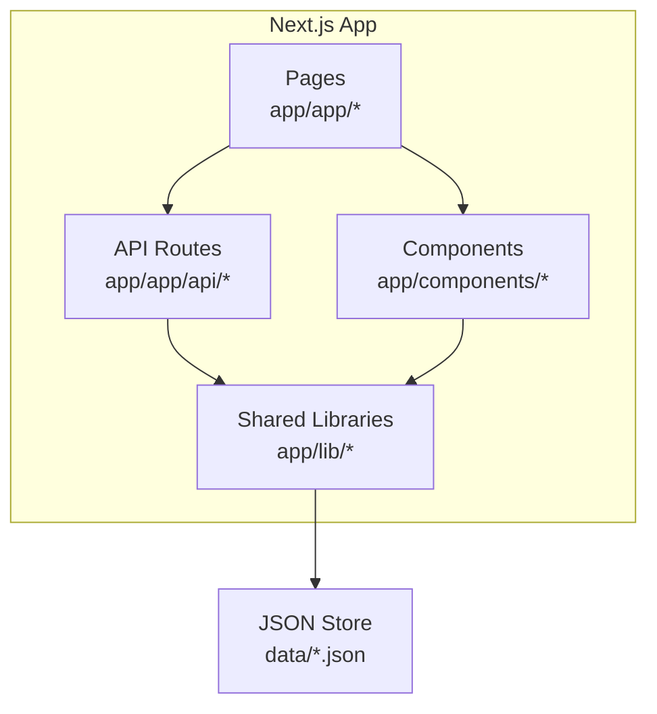
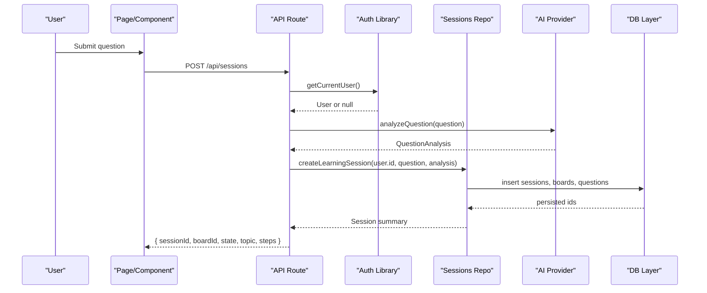
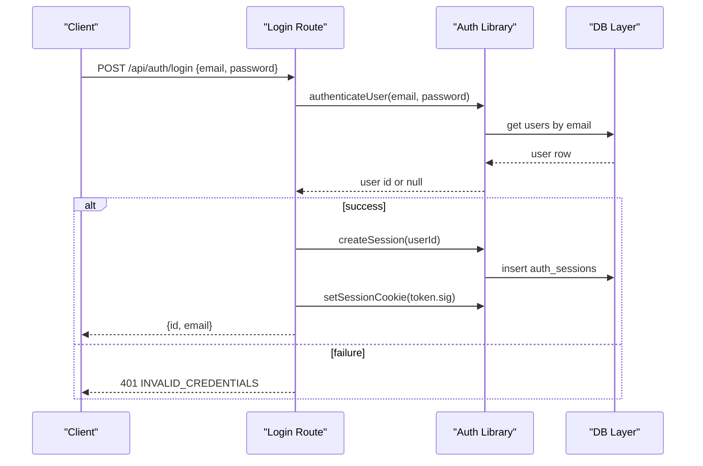
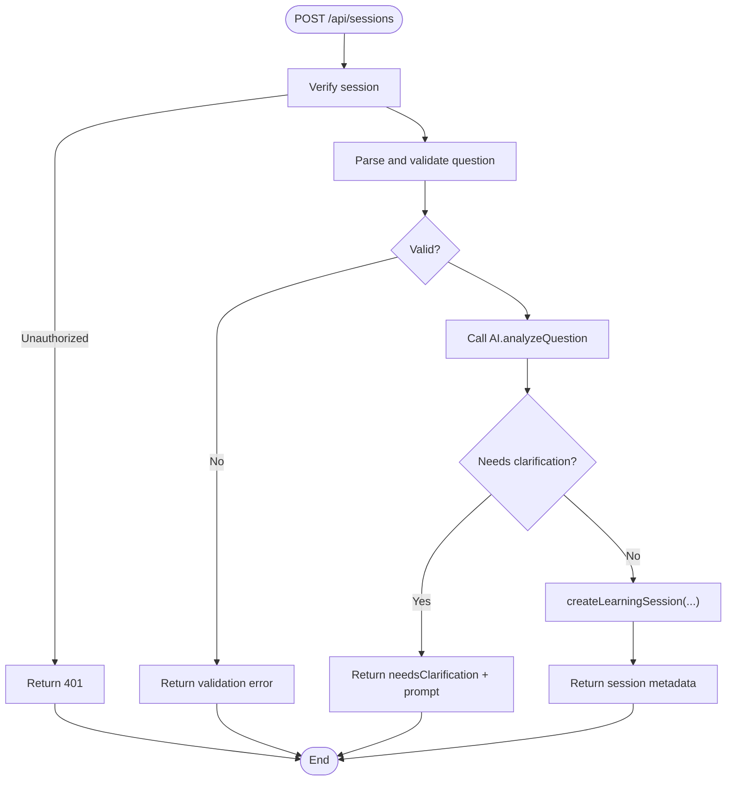
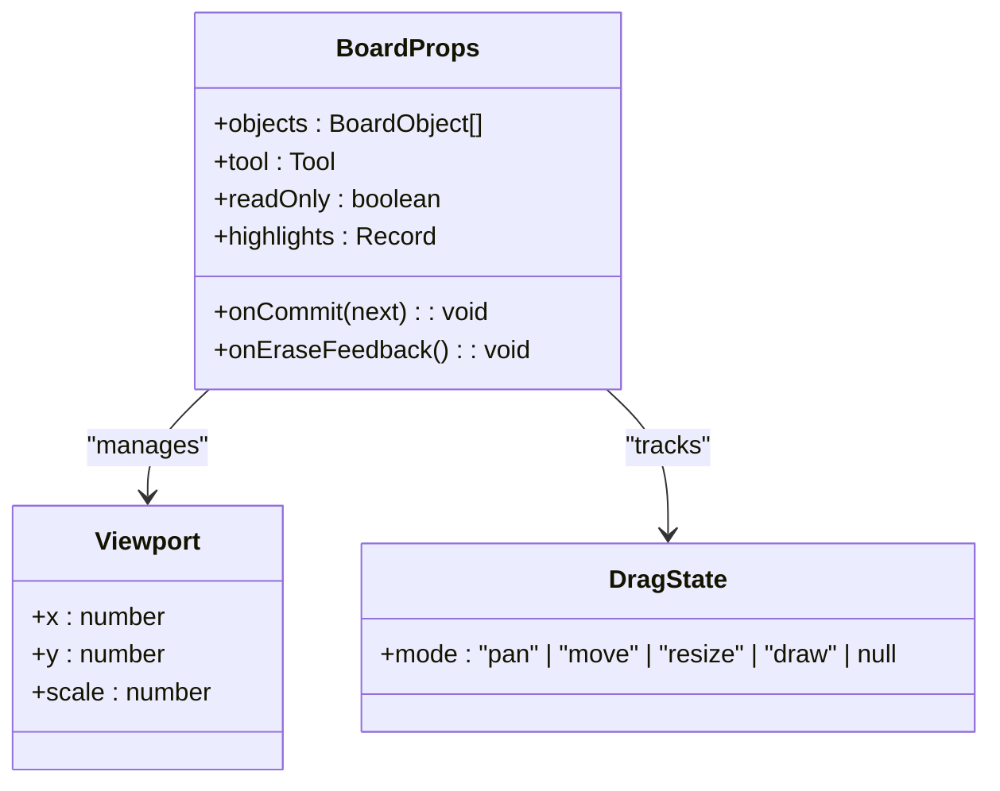
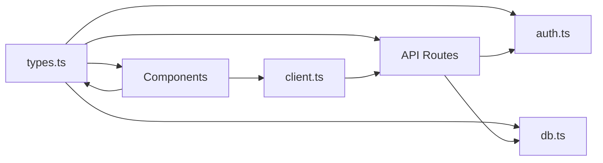

# Developer Guidelines

<cite>
**Referenced Files in This Document**
- [next.config.js](file://stepwise ai/app/next.config.js)
- [tsconfig.json](file://stepwise ai/app/tsconfig.json)
- [types.ts](file://stepwise ai/app/lib/types.ts)
- [db.ts](file://stepwise ai/app/lib/db.ts)
- [auth.ts](file://stepwise ai/app/lib/auth.ts)
- [client.ts](file://stepwise ai/app/lib/client.ts)
- [Shell.tsx](file://stepwise ai/app/components/Shell.tsx)
- [Board.tsx](file://stepwise ai/app/components/board/Board.tsx)
- [ui.tsx](file://stepwise ai/app/components/ui.tsx)
- [login route.ts](file://stepwise ai/app/app/api/auth/login/route.ts)
- [sessions route.ts](file://stepwise ai/app/app/api/sessions/route.ts)
</cite>

## Table of Contents
1. Introduction
2. Project Structure
3. Core Components
4. Architecture Overview
5. Detailed Component Analysis
6. Dependency Analysis
7. Performance Considerations
8. Troubleshooting Guide
9. Conclusion
10. Appendices

## Introduction
This document provides comprehensive developer guidelines for contributing to StepWise AI. It covers coding standards and conventions for TypeScript, React components, and API implementations; project structure and naming conventions; Git workflow recommendations; development environment setup; debugging techniques; maintainability, documentation, and testing practices; performance optimization; security considerations; accessibility requirements; release and deployment procedures; code review guidelines; quality assurance; and contribution standards for open source contributors.

## Project Structure
StepWise AI is a Next.js application with:
- App Router pages under app/app
- Server-side API routes under app/app/api
- Shared domain types under app/lib/types.ts
- A zero-dependency JSON database layer under app/lib/db.ts
- Authentication utilities under app/lib/auth.ts
- Client-side API helper under app/lib/client.ts
- UI primitives and shared components under app/components
- Feature components (e.g., Board) under app/components/board

**Diagram sources**
- [next.config.js:1-7](file://stepwise ai/app/next.config.js#L1-L7)
- [tsconfig.json:1-22](file://stepwise ai/app/tsconfig.json#L1-L22)

**Section sources**
- [next.config.js:1-7](file://stepwise ai/app/next.config.js#L1-L7)
- [tsconfig.json:1-22](file://stepwise ai/app/tsconfig.json#L1-L22)

## Core Components
- Domain types: Centralized type definitions for sessions, board objects, evaluation results, hints, learning journey, profiles, AI provider abstraction, and API envelopes.
- Database layer: In-memory/JSON store with transaction support, auto-increment sequences, and cascade delete helpers.
- Authentication: Password hashing, session creation/validation, httpOnly cookies, and current user resolution.
- Client API helper: Standardized fetch wrapper that unwraps the { data, error } envelope.
- UI primitives: Consistent design system components (Button, Card, Input, Textarea, Select, Badge, Spinner, Alert, EmptyState, DemoBanner).
- Shell: Authenticated layout that verifies session, applies adaptive theme, and renders navigation.
- Board: Interactive spatial canvas supporting pan, zoom, drawing, text, erase, selection, resizing, and commit-driven persistence.

**Section sources**
- [types.ts:1-302](file://stepwise ai/app/lib/types.ts#L1-L302)
- [db.ts:1-224](file://stepwise ai/app/lib/db.ts#L1-L224)
- [auth.ts:1-139](file://stepwise ai/app/lib/auth.ts#L1-L139)
- [client.ts:1-28](file://stepwise ai/app/lib/client.ts#L1-L28)
- [ui.tsx:1-218](file://stepwise ai/app/components/ui.tsx#L1-L218)
- [Shell.tsx:1-124](file://stepwise ai/app/components/Shell.tsx#L1-L124)
- [Board.tsx:1-540](file://stepwise ai/app/components/board/Board.tsx#L1-L540)

## Architecture Overview
The application follows a layered architecture:
- Presentation: Next.js pages and client components render UI and handle interactions.
- Application logic: API routes orchestrate business flows, enforce authentication, validate inputs, and delegate to libraries.
- Domain services: Libraries encapsulate domain logic (AI provider abstraction, sessions repository, teaching engine, etc.).
- Persistence: A small relational-style JSON store abstracts storage details and ensures safe writes.

**Diagram sources**
- [sessions route.ts:1-56](file://stepwise ai/app/app/api/sessions/route.ts#L1-L56)
- [auth.ts:73-102](file://stepwise ai/app/lib/auth.ts#L73-L102)
- [db.ts:147-199](file://stepwise ai/app/lib/db.ts#L147-L199)

## Detailed Component Analysis

### Authentication Flow
- Login endpoint validates input, authenticates credentials, creates a signed session token, sets an httpOnly cookie, and returns minimal user info.
- Current user resolution verifies cookie signature, checks session expiry, and resolves user identity.

**Diagram sources**
- [login route.ts:1-30](file://stepwise ai/app/app/api/auth/login/route.ts#L1-L30)
- [auth.ts:24-67](file://stepwise ai/app/lib/auth.ts#L24-L67)
- [auth.ts:73-102](file://stepwise ai/app/lib/auth.ts#L73-L102)
- [db.ts:141-159](file://stepwise ai/app/lib/db.ts#L141-L159)

**Section sources**
- [login route.ts:1-30](file://stepwise ai/app/app/api/auth/login/route.ts#L1-L30)
- [auth.ts:1-139](file://stepwise ai/app/lib/auth.ts#L1-L139)

### Learning Session Creation
- The sessions route enforces authentication, validates the question, delegates analysis to the AI provider, handles clarification requests, persists the session and related entities, and returns initial board context.

**Diagram sources**
- [sessions route.ts:1-56](file://stepwise ai/app/app/api/sessions/route.ts#L1-L56)

**Section sources**
- [sessions route.ts:1-56](file://stepwise ai/app/app/api/sessions/route.ts#L1-L56)

### Board Interaction Model
- The Board component manages viewport state, pointer events for pan/move/draw/erase, keyboard shortcuts, object editing, and rendering with z-index ordering.
- All mutations are funneled through onCommit callbacks, enabling optimistic updates and centralized persistence strategies.

**Diagram sources**
- [Board.tsx:1-540](file://stepwise ai/app/components/board/Board.tsx#L1-L540)
- [types.ts:26-57](file://stepwise ai/app/lib/types.ts#L26-L57)

**Section sources**
- [Board.tsx:1-540](file://stepwise ai/app/components/board/Board.tsx#L1-L540)
- [types.ts:1-302](file://stepwise ai/app/lib/types.ts#L1-L302)

### Design System and Accessibility
- UI primitives provide consistent styling, sizes, and variants.
- Components use semantic attributes (labels, roles, aria-live) and avoid color-only status indicators.
- Demo mode banner clearly labels non-production behavior.

**Section sources**
- [ui.tsx:1-218](file://stepwise ai/app/components/ui.tsx#L1-L218)

### Client API Envelope
- The client helper normalizes responses, throws errors when the server indicates failure, and unwraps data for typed usage.

**Section sources**
- [client.ts:1-28](file://stepwise ai/app/lib/client.ts#L1-L28)

## Dependency Analysis
Key dependencies and relationships:
- Pages and components depend on client.ts for API calls and on UI primitives for presentation.
- API routes depend on auth.ts for identity, db.ts for persistence, and AI provider abstractions via lib/ai.
- Types unify contracts across layers.

**Diagram sources**
- [types.ts:1-302](file://stepwise ai/app/lib/types.ts#L1-L302)
- [auth.ts:1-139](file://stepwise ai/app/lib/auth.ts#L1-L139)
- [db.ts:1-224](file://stepwise ai/app/lib/db.ts#L1-L224)
- [client.ts:1-28](file://stepwise ai/app/lib/client.ts#L1-L28)
- [login route.ts:1-30](file://stepwise ai/app/app/api/auth/login/route.ts#L1-L30)
- [sessions route.ts:1-56](file://stepwise ai/app/app/api/sessions/route.ts#L1-L56)

**Section sources**
- [types.ts:1-302](file://stepwise ai/app/lib/types.ts#L1-L302)
- [auth.ts:1-139](file://stepwise ai/app/lib/auth.ts#L1-L139)
- [db.ts:1-224](file://stepwise ai/app/lib/db.ts#L1-L224)
- [client.ts:1-28](file://stepwise ai/app/lib/client.ts#L1-L28)
- [login route.ts:1-30](file://stepwise ai/app/app/api/auth/login/route.ts#L1-L30)
- [sessions route.ts:1-56](file://stepwise ai/app/app/api/sessions/route.ts#L1-L56)

## Performance Considerations
- Prefer memoization and stable references in React components to minimize re-renders.
- Use debounced handlers for high-frequency events (e.g., draw, pan).
- Batch writes using transactions where possible to reduce disk I/O.
- Avoid unnecessary re-computation in render paths; extract heavy logic into callbacks or effects.
- Keep payloads minimal; paginate lists and limit fields returned from APIs.
- Leverage Next.js runtime configuration and incremental compilation settings already enabled.

[No sources needed since this section provides general guidance]

## Troubleshooting Guide
Common issues and resolutions:
- Authentication failures: Ensure AUTH_SECRET is set in production; verify cookie flags and session expiry handling.
- Invalid or missing inputs: Validate all incoming request bodies; return structured errors using the standard envelope.
- Database write errors: Confirm file permissions for the JSON store directory; inspect transaction boundaries and rollback behavior.
- Network errors: Handle fetch failures gracefully in client.ts and surface user-friendly messages.

**Section sources**
- [auth.ts:12-22](file://stepwise ai/app/lib/auth.ts#L12-L22)
- [auth.ts:73-102](file://stepwise ai/app/lib/auth.ts#L73-L102)
- [db.ts:73-94](file://stepwise ai/app/lib/db.ts#L73-L94)
- [client.ts:17-27](file://stepwise ai/app/lib/client.ts#L17-L27)

## Conclusion
StepWise AI’s architecture emphasizes clear separation of concerns, strong typing, secure authentication, and a flexible AI provider abstraction. By following these guidelines—consistent TypeScript patterns, robust API contracts, accessible UI components, and disciplined Git workflows—you can contribute effectively while maintaining code quality, security, and performance.

[No sources needed since this section summarizes without analyzing specific files]

## Appendices

### Coding Standards and Conventions
- TypeScript
  - Enable strict mode and path aliases as configured.
  - Define shared types in lib/types.ts and import them across layers.
  - Prefer explicit types over any; use discriminated unions for state machines.
- React Components
  - Use “use client” directives only where necessary.
  - Compose UI from primitives in ui.tsx; avoid ad-hoc styles.
  - Provide accessible labels, roles, and aria attributes.
- API Implementations
  - Validate and sanitize all inputs; return standardized error envelopes.
  - Enforce authentication before processing sensitive operations.
  - Keep routes thin; delegate logic to libraries.

**Section sources**
- [tsconfig.json:1-22](file://stepwise ai/app/tsconfig.json#L1-L22)
- [types.ts:1-302](file://stepwise ai/app/lib/types.ts#L1-L302)
- [ui.tsx:1-218](file://stepwise ai/app/components/ui.tsx#L1-L218)
- [login route.ts:1-30](file://stepwise ai/app/app/api/auth/login/route.ts#L1-L30)
- [sessions route.ts:1-56](file://stepwise ai/app/app/api/sessions/route.ts#L1-L56)

### Naming Conventions and File Organization
- Feature-based directories: group related pages, routes, and components by feature.
- Shared utilities in lib/, domain types in lib/types.ts.
- Prefix internal modules with descriptive names; keep exports minimal and focused.
- Use kebab-case for file names and PascalCase for components and types.

**Section sources**
- [types.ts:1-302](file://stepwise ai/app/lib/types.ts#L1-L302)
- [db.ts:1-224](file://stepwise ai/app/lib/db.ts#L1-L224)
- [auth.ts:1-139](file://stepwise ai/app/lib/auth.ts#L1-L139)

### Git Workflow
- Branching strategy
  - main: protected, production-ready code.
  - develop: integration branch for features.
  - feature/<ticket>-<short-desc>: per-feature branches.
  - hotfix/<ticket>-<short-desc>: urgent fixes.
- Commit message conventions
  - Format: type(scope): description
  - Types: feat, fix, refactor, docs, test, chore
  - Reference tickets and link to specs when applicable.
- Pull requests
  - Small, focused PRs linked to issues/specs.
  - Include tests, updated docs, and screenshots for UI changes.
  - Require reviews and CI passes before merge.

[No sources needed since this section provides general guidance]

### Development Environment Setup
- Install dependencies and run the Next.js dev server.
- Configure environment variables:
  - DATABASE_FILE: path to JSON store (defaults to ./data/stepwise.db resolved to .json).
  - AUTH_SECRET: long random secret required in production.
- Verify authentication flow and basic API endpoints.

**Section sources**
- [db.ts:66-71](file://stepwise ai/app/lib/db.ts#L66-L71)
- [auth.ts:12-22](file://stepwise ai/app/lib/auth.ts#L12-L22)

### Debugging Techniques
- Use browser DevTools to inspect network requests and response envelopes.
- Log structured messages in API routes during development; avoid leaking secrets.
- For board interactions, log viewport and drag state transitions to diagnose event handling issues.
- Validate schema assumptions with TypeScript and runtime checks at API boundaries.

**Section sources**
- [client.ts:1-28](file://stepwise ai/app/lib/client.ts#L1-L28)
- [Board.tsx:1-540](file://stepwise ai/app/components/board/Board.tsx#L1-L540)

### Writing Maintainable Code
- Keep functions small and single-purpose; extract reusable logic into lib/.
- Favor composition over inheritance; prefer pure functions where possible.
- Centralize constants and configuration; avoid magic strings and numbers.
- Document public APIs with JSDoc comments and inline explanations for complex logic.

[No sources needed since this section provides general guidance]

### Testing Guidelines
- Unit tests: Test pure functions in lib/ with representative inputs and edge cases.
- Integration tests: Validate API routes against the JSON store and mock external services if needed.
- Component tests: Assert rendering, interactions, and accessibility attributes for critical UI components.
- E2E tests: Cover key user journeys such as login, session creation, and board interactions.

[No sources needed since this section provides general guidance]

### Security Considerations
- Never store plaintext passwords; use provided hashing utilities.
- Set httpOnly, sameSite, and secure flags for session cookies.
- Validate and sanitize all inputs; reject malformed payloads early.
- Protect sensitive routes with authentication checks.
- Avoid logging sensitive data; mask tokens and identifiers.

**Section sources**
- [auth.ts:24-67](file://stepwise ai/app/lib/auth.ts#L24-L67)
- [auth.ts:73-102](file://stepwise ai/app/lib/auth.ts#L73-L102)
- [login route.ts:1-30](file://stepwise ai/app/app/api/auth/login/route.ts#L1-L30)

### Accessibility Requirements
- Use semantic HTML and appropriate roles.
- Provide labels and descriptions for interactive elements.
- Ensure keyboard navigability and focus management.
- Avoid color-only indicators; combine color with icons/text.
- Announce dynamic updates with aria-live regions.

**Section sources**
- [ui.tsx:150-186](file://stepwise ai/app/components/ui.tsx#L150-L186)
- [Board.tsx:316-328](file://stepwise ai/app/components/board/Board.tsx#L316-L328)

### Release Process and Version Management
- Use semantic versioning for releases.
- Tag releases and generate changelogs from commits.
- Run full test suites and linting before publishing.
- Deploy to staging, perform smoke tests, then promote to production.

[No sources needed since this section provides general guidance]

### Deployment Procedures
- Build the Next.js app and deploy artifacts to your hosting platform.
- Ensure environment variables are configured on the target environment.
- Verify health checks and monitor logs post-deployment.
- Roll back quickly if issues are detected.

[No sources needed since this section provides general guidance]

### Code Review Guidelines and Quality Assurance
- Review for correctness, readability, and adherence to standards.
- Check for security pitfalls and performance regressions.
- Ensure tests cover new functionality and edge cases.
- Validate accessibility and UX improvements.
- Request changes when necessary; approve when satisfied.

[No sources needed since this section provides general guidance]

### Contribution Standards for Open Source Contributors
- Follow the branching and commit conventions outlined above.
- Keep PRs small and well-scoped; include tests and docs.
- Engage constructively in reviews; address feedback promptly.
- Respect project governance and community norms.

[No sources needed since this section provides general guidance]