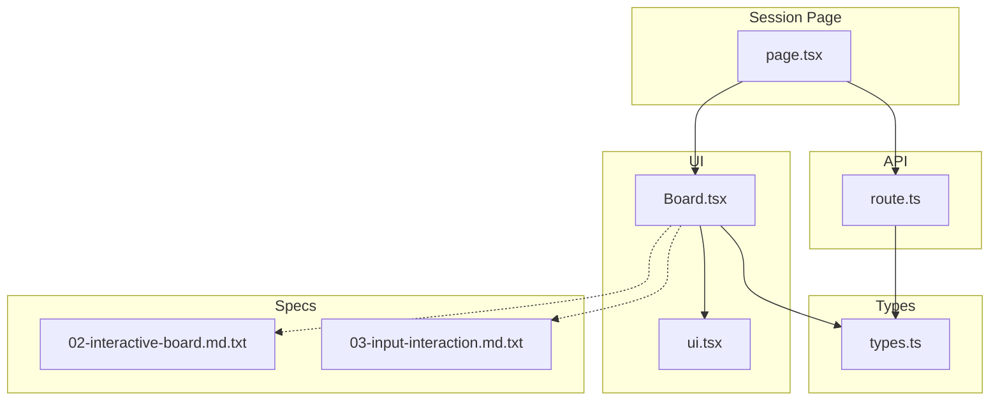
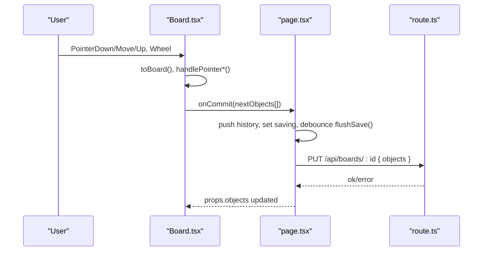
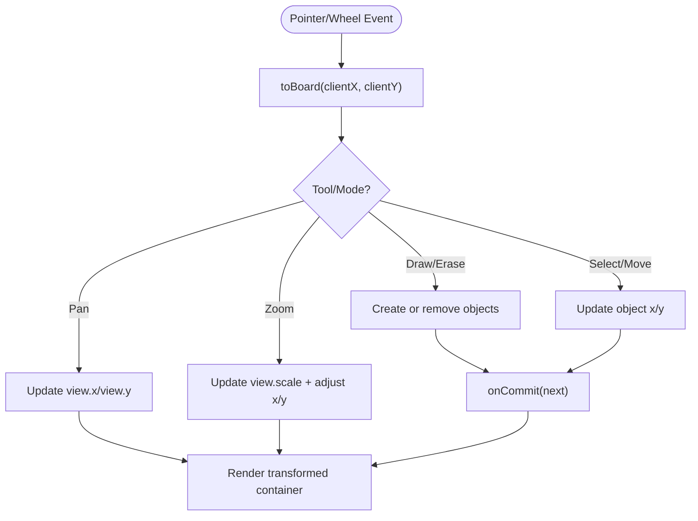
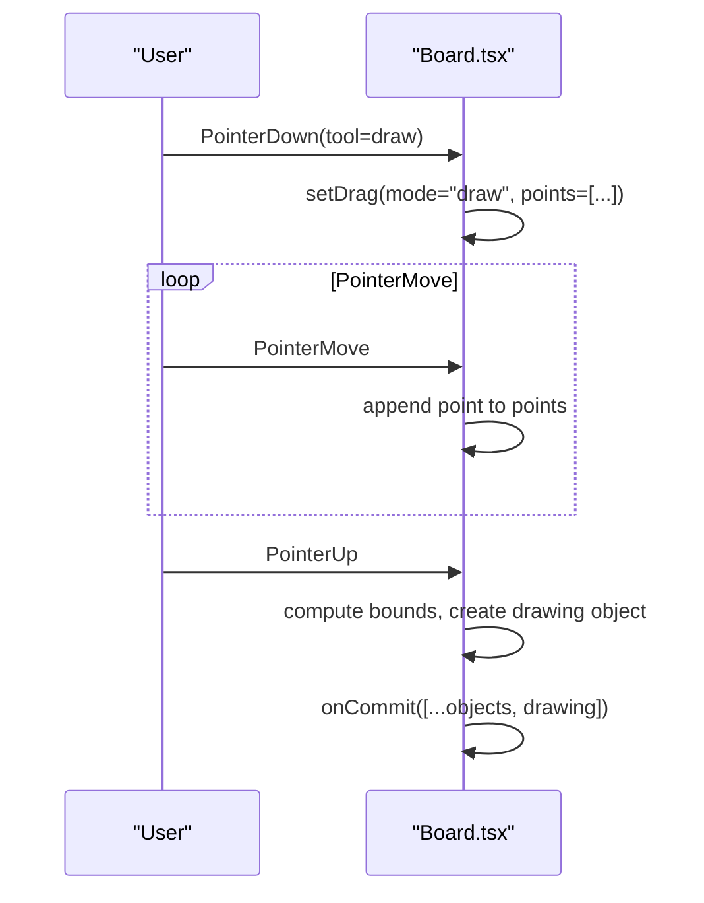
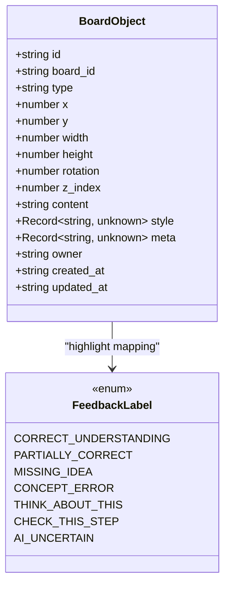
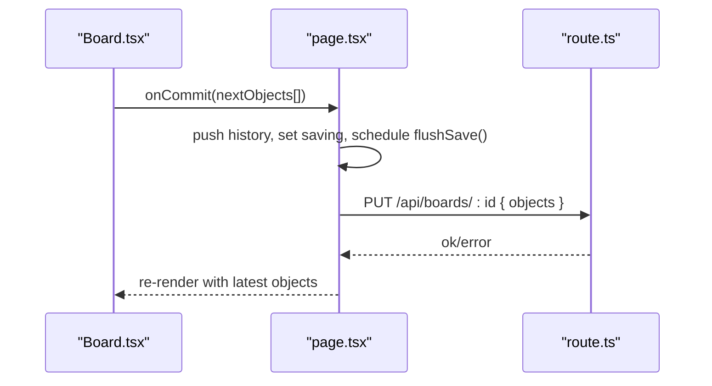
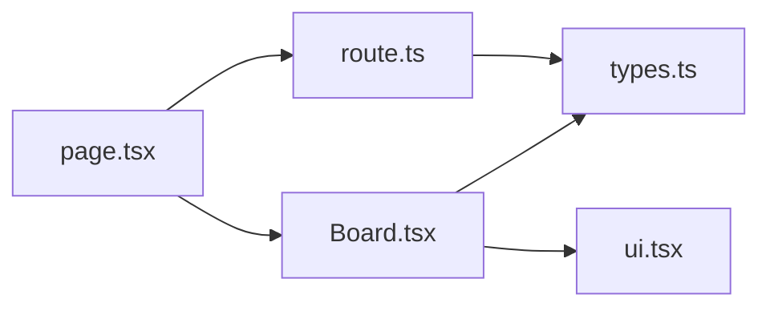

# Board Component

<cite>
**Referenced Files in This Document**
- [Board.tsx](file://stepwise ai/app/components/board/Board.tsx)
- [types.ts](file://stepwise ai/app/lib/types.ts)
- [ui.tsx](file://stepwise ai/app/components/ui.tsx)
- [page.tsx](file://stepwise ai/app/app/session/[id]/page.tsx)
- [route.ts](file://stepwise ai/app/app/api/boards/[id]/route.ts)
- [02-interactive-board.md.txt](file://stepwise ai/specs/02-interactive-board.md.txt)
- [03-input-interaction.md.txt](file://stepwise ai/specs/03-input-interaction.md.txt)
</cite>

## Table of Contents
1. [Introduction](#introduction)
2. [Project Structure](#project-structure)
3. [Core Components](#core-components)
4. [Architecture Overview](#architecture-overview)
5. [Detailed Component Analysis](#detailed-component-analysis)
6. [Dependency Analysis](#dependency-analysis)
7. [Performance Considerations](#performance-considerations)
8. [Troubleshooting Guide](#troubleshooting-guide)
9. [Conclusion](#conclusion)
10. [Appendices](#appendices)

## Introduction
The Board component is the core interactive learning canvas where students think, write, draw, and collaborate with AI guidance. It implements an infinite spatial canvas with pan/zoom, object rendering, tool management (select, text, draw, erase, pan), and a structured board object model. The component integrates with a session page that provides autosave, undo/redo, and persistence to a server API. Specifications define the intended behavior for an intelligent, accessible, and performant learning workspace.

## Project Structure
At a high level:
- The Board UI lives in a dedicated component file.
- Shared domain types define the board object model and feedback labels.
- A shared UI primitives file provides consistent design tokens and feedback metadata used by the Board.
- The session page orchestrates state, persistence, and history around the Board.
- A Next.js API route persists board objects to storage.
- Specs describe the intended behavior for the interactive board and input systems.

**Diagram sources**
- [Board.tsx:1-540](file://stepwise ai/app/components/board/Board.tsx#L1-L540)
- [types.ts:26-57](file://stepwise ai/app/lib/types.ts#L26-L57)
- [ui.tsx:177-186](file://stepwise ai/app/components/ui.tsx#L177-L186)
- [page.tsx:99-146](file://stepwise ai/app/app/session/[id]/page.tsx#L99-L146)
- [route.ts:28-42](file://stepwise ai/app/app/api/boards/[id]/route.ts#L28-L42)

**Section sources**
- [Board.tsx:1-540](file://stepwise ai/app/components/board/Board.tsx#L1-L540)
- [types.ts:26-57](file://stepwise ai/app/lib/types.ts#L26-L57)
- [ui.tsx:177-186](file://stepwise ai/app/components/ui.tsx#L177-L186)
- [page.tsx:99-146](file://stepwise ai/app/app/session/[id]/page.tsx#L99-L146)
- [route.ts:28-42](file://stepwise ai/app/app/api/boards/[id]/route.ts#L28-L42)
- [02-interactive-board.md.txt:1-40](file://stepwise ai/specs/02-interactive-board.md.txt#L1-L40)
- [03-input-interaction.md.txt:1-40](file://stepwise ai/specs/03-input-interaction.md.txt#L1-L40)

## Core Components
- Board component: Implements the infinite canvas, coordinate transforms, pointer interactions, tools, selection, editing, drawing, erasing, and zoom controls. Renders objects using absolute positioning and z-index sorting.
- ObjectView: Renders individual board objects based on type (text/drawing), supports editing via textarea, highlights, and resize handles.
- Types: Define the board object model including position, size, rotation, z-index, content, style, meta, ownership, and timestamps; also define feedback labels and evaluation structures.
- UI primitives: Provide consistent styling and feedback metadata used by the Board for highlighting and status.
- Session page: Manages commit flow, autosave, undo/redo, and loading/saving board state through the API.
- API route: Validates and persists board objects to storage with ownership and type checks.

**Section sources**
- [Board.tsx:14-67](file://stepwise ai/app/components/board/Board.tsx#L14-L67)
- [Board.tsx:107-128](file://stepwise ai/app/components/board/Board.tsx#L107-L128)
- [Board.tsx:145-205](file://stepwise ai/app/components/board/Board.tsx#L145-L205)
- [Board.tsx:207-283](file://stepwise ai/app/components/board/Board.tsx#L207-L283)
- [Board.tsx:316-405](file://stepwise ai/app/components/board/Board.tsx#L316-L405)
- [Board.tsx:408-539](file://stepwise ai/app/components/board/Board.tsx#L408-L539)
- [types.ts:26-57](file://stepwise ai/app/lib/types.ts#L26-L57)
- [ui.tsx:177-186](file://stepwise ai/app/components/ui.tsx#L177-L186)
- [page.tsx:99-146](file://stepwise ai/app/app/session/[id]/page.tsx#L99-L146)
- [route.ts:28-42](file://stepwise ai/app/app/api/boards/[id]/route.ts#L28-L42)

## Architecture Overview
The Board is a client-side React component that renders an infinite canvas using CSS transforms. It maintains local viewport state (pan x/y and scale) and object state (position, size, content). Pointer events drive tool behaviors: select/move, pan, draw, erase, and text creation/editing. Changes are committed via an onCommit callback to the parent session page, which manages undo/redo and debounced autosave to the server API.

**Diagram sources**
- [Board.tsx:107-128](file://stepwise ai/app/components/board/Board.tsx#L107-L128)
- [Board.tsx:145-205](file://stepwise ai/app/components/board/Board.tsx#L145-L205)
- [Board.tsx:207-283](file://stepwise ai/app/components/board/Board.tsx#L207-L283)
- [page.tsx:99-146](file://stepwise ai/app/app/session/[id]/page.tsx#L99-L146)
- [route.ts:28-42](file://stepwise ai/app/app/api/boards/[id]/route.ts#L28-L42)

## Detailed Component Analysis

### Spatial Canvas and Coordinate Systems
- Viewport state holds x, y offsets and scale.
- toBoard converts client coordinates to board coordinates using container bounding rect and current view.
- Wheel zoom adjusts scale centered on cursor and updates x/y to keep the point under the cursor stable.
- Rendering uses a transform translate(x,y) scale(s) on a child container so all objects move together.

**Diagram sources**
- [Board.tsx:107-128](file://stepwise ai/app/components/board/Board.tsx#L107-L128)
- [Board.tsx:145-205](file://stepwise ai/app/components/board/Board.tsx#L145-L205)
- [Board.tsx:207-283](file://stepwise ai/app/components/board/Board.tsx#L207-L283)

**Section sources**
- [Board.tsx:107-128](file://stepwise ai/app/components/board/Board.tsx#L107-L128)
- [Board.tsx:316-364](file://stepwise ai/app/components/board/Board.tsx#L316-L364)

### Tool Management System
Tools supported:
- Select: Click to select; drag to move student-owned objects; click empty space to pan.
- Text: Click to create a new text object and enter edit mode immediately.
- Draw: Drag to capture points; on pointer up, create a drawing object with normalized points and color.
- Erase: Click or drag over student-owned objects to remove them; triggers optional feedback callback.
- Pan: Explicit pan tool, Space key hold, or middle mouse button enables panning.

Keyboard shortcuts:
- Space: temporary pan mode.
- Delete/Backspace: remove selected student-owned object.
- Escape: deselect and stop editing.

**Diagram sources**
- [Board.tsx:145-205](file://stepwise ai/app/components/board/Board.tsx#L145-L205)
- [Board.tsx:207-283](file://stepwise ai/app/components/board/Board.tsx#L207-L283)

**Section sources**
- [Board.tsx:73-105](file://stepwise ai/app/components/board/Board.tsx#L73-L105)
- [Board.tsx:145-205](file://stepwise ai/app/components/board/Board.tsx#L145-L205)
- [Board.tsx:207-283](file://stepwise ai/app/components/board/Board.tsx#L207-L283)

### Object Model and Rendering
- BoardObject includes id, board_id, type, x, y, width, height, rotation, z_index, content, style, meta, owner, created_at, updated_at.
- Ownership distinguishes student vs ai/system/imported; affects editability and visual treatment.
- Rendering sorts objects by z_index and positions absolutely within the transformed container.
- Drawing objects store serialized points and color in content; text objects render as preformatted text.
- Highlights from AI feedback apply ring styles and badges using FEEDBACK_META.

**Diagram sources**
- [types.ts:26-57](file://stepwise ai/app/lib/types.ts#L26-L57)
- [types.ts:64-71](file://stepwise ai/app/lib/types.ts#L64-L71)
- [ui.tsx:177-186](file://stepwise ai/app/components/ui.tsx#L177-L186)
- [Board.tsx:408-539](file://stepwise ai/app/components/board/Board.tsx#L408-L539)

**Section sources**
- [types.ts:26-57](file://stepwise ai/app/lib/types.ts#L26-L57)
- [Board.tsx:316-405](file://stepwise ai/app/components/board/Board.tsx#L316-L405)
- [Board.tsx:408-539](file://stepwise ai/app/components/board/Board.tsx#L408-L539)
- [ui.tsx:177-186](file://stepwise ai/app/components/ui.tsx#L177-L186)

### Real-Time Collaboration, State Synchronization, and Persistence
- The Board delegates persistence to the parent session page via onCommit.
- The session page maintains an undo/redo history stack and debounced autosave to the server.
- The API route validates object types and owners before persisting and returns success/error.
- Current implementation focuses on single-user autosave; collaboration would require additional conflict resolution and real-time sync mechanisms not present in the codebase.

**Diagram sources**
- [page.tsx:99-146](file://stepwise ai/app/app/session/[id]/page.tsx#L99-L146)
- [route.ts:28-42](file://stepwise ai/app/app/api/boards/[id]/route.ts#L28-L42)

**Section sources**
- [page.tsx:99-146](file://stepwise ai/app/app/session/[id]/page.tsx#L99-L146)
- [route.ts:28-42](file://stepwise ai/app/app/api/boards/[id]/route.ts#L28-L42)

### Extensibility: Adding Custom Objects and New Tools
- Custom objects: Extend BoardObjectType and implement rendering logic in ObjectView based on obj.type. Ensure content serialization matches your needs and update validation in the API route if necessary.
- New tools: Add a new tool string to the Tool union, handle it in handlePointerDown/move/up, and update cursor and interaction logic accordingly.
- Integration with teaching engine: Use highlights and feedback labels to reflect AI analysis results; pass feedback via the highlights prop to visually annotate objects.

**Section sources**
- [types.ts:26-37](file://stepwise ai/app/lib/types.ts#L26-L37)
- [Board.tsx:408-539](file://stepwise ai/app/components/board/Board.tsx#L408-L539)
- [route.ts:10-22](file://stepwise ai/app/app/api/boards/[id]/route.ts#L10-L22)

## Dependency Analysis
- Board depends on types for BoardObject and FeedbackLabel.
- Board uses ui.tsx FEEDBACK_META for consistent feedback visuals.
- Session page depends on Board and API route for persistence.
- API route depends on types for validation.

**Diagram sources**
- [Board.tsx:1-540](file://stepwise ai/app/components/board/Board.tsx#L1-L540)
- [types.ts:26-57](file://stepwise ai/app/lib/types.ts#L26-L57)
- [ui.tsx:177-186](file://stepwise ai/app/components/ui.tsx#L177-L186)
- [page.tsx:99-146](file://stepwise ai/app/app/session/[id]/page.tsx#L99-L146)
- [route.ts:28-42](file://stepwise ai/app/app/api/boards/[id]/route.ts#L28-L42)

**Section sources**
- [Board.tsx:1-540](file://stepwise ai/app/components/board/Board.tsx#L1-L540)
- [types.ts:26-57](file://stepwise ai/app/lib/types.ts#L26-L57)
- [ui.tsx:177-186](file://stepwise ai/app/components/ui.tsx#L177-L186)
- [page.tsx:99-146](file://stepwise ai/app/app/session/[id]/page.tsx#L99-L146)
- [route.ts:28-42](file://stepwise ai/app/app/api/boards/[id]/route.ts#L28-L42)

## Performance Considerations
- Rendering: Objects are sorted by z_index each render; consider memoization or virtualization for large canvases.
- Interaction: Pointer events update state frequently; batching commits and debouncing heavy operations can reduce re-renders.
- Zoom/Pan: Transform-based approach is efficient; ensure minimal DOM mutations during drag.
- Memory: Keep object arrays bounded; avoid storing excessive raw stroke data in content unless necessary.
- Cross-browser compatibility: Uses standard pointer events and CSS transforms; test touch and keyboard interactions across devices.

[No sources needed since this section provides general guidance]

## Troubleshooting Guide
- Undo/Redo issues: Verify history stack management in the session page and ensure commit pushes snapshots correctly.
- Autosave failures: Check API route responses and error handling; confirm network connectivity and authentication.
- Object deletion: Ensure delete/backspace only removes student-owned objects and clears selection appropriately.
- Editing conflicts: When editingId is active, pointer events are ignored to prevent conflicts; ensure blur/escape exits editing cleanly.
- Accessibility: Confirm aria-labels and roles are present; use non-color indicators for feedback.

**Section sources**
- [page.tsx:118-146](file://stepwise ai/app/app/session/[id]/page.tsx#L118-L146)
- [Board.tsx:73-105](file://stepwise ai/app/components/board/Board.tsx#L73-L105)
- [Board.tsx:316-405](file://stepwise ai/app/components/board/Board.tsx#L316-L405)

## Conclusion
The Board component delivers a robust, interactive learning canvas with pan/zoom, tool-driven interactions, and a clear object model. It integrates seamlessly with a session page that provides autosave, undo/redo, and persistence. While collaboration features are not implemented in the current code, the architecture supports future extensions. Adhering to specs ensures accessibility, performance, and educational value.

[No sources needed since this section summarizes without analyzing specific files]

## Appendices

### Examples and Best Practices
- Adding custom board objects:
  - Extend BoardObjectType and implement rendering in ObjectView.
  - Serialize relevant data into content and update API validation if needed.
- Implementing new tools:
  - Add tool variant to Tool union.
  - Handle tool-specific logic in pointer handlers and update cursor behavior.
- Integrating with the teaching engine:
  - Pass highlights to Board to annotate objects with feedback labels.
  - Use FEEDBACK_META for consistent icons and labels.

**Section sources**
- [types.ts:26-37](file://stepwise ai/app/lib/types.ts#L26-L37)
- [Board.tsx:408-539](file://stepwise ai/app/components/board/Board.tsx#L408-L539)
- [ui.tsx:177-186](file://stepwise ai/app/components/ui.tsx#L177-L186)