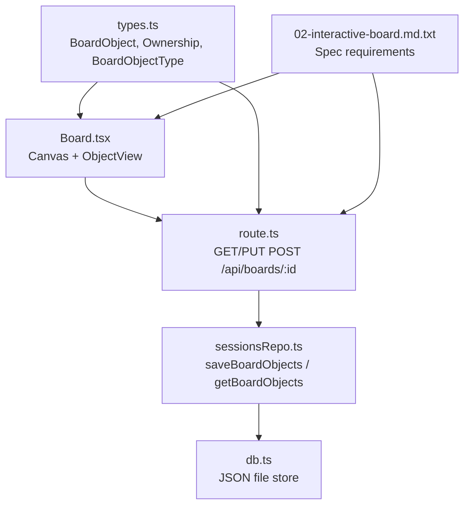
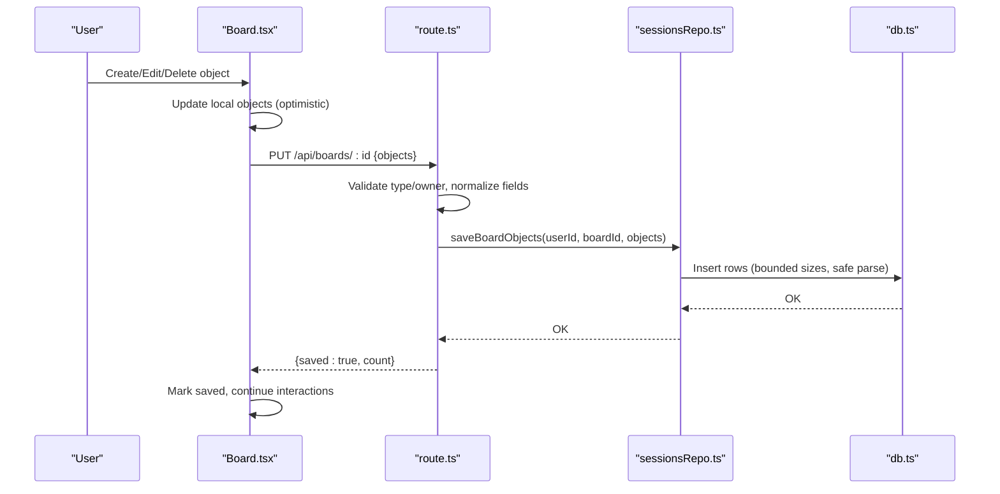
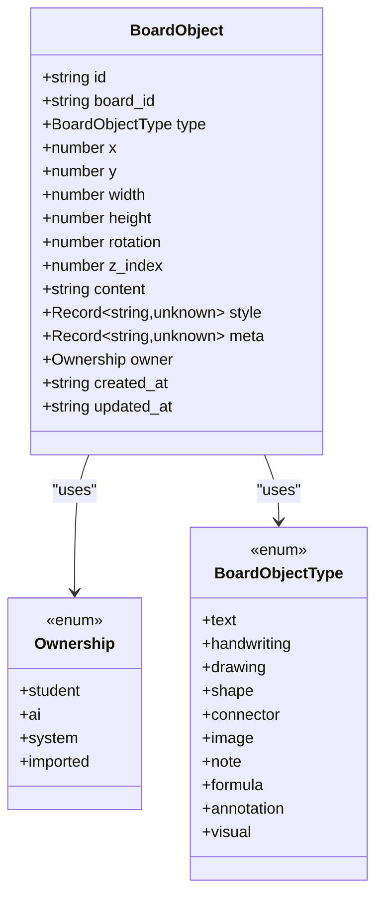
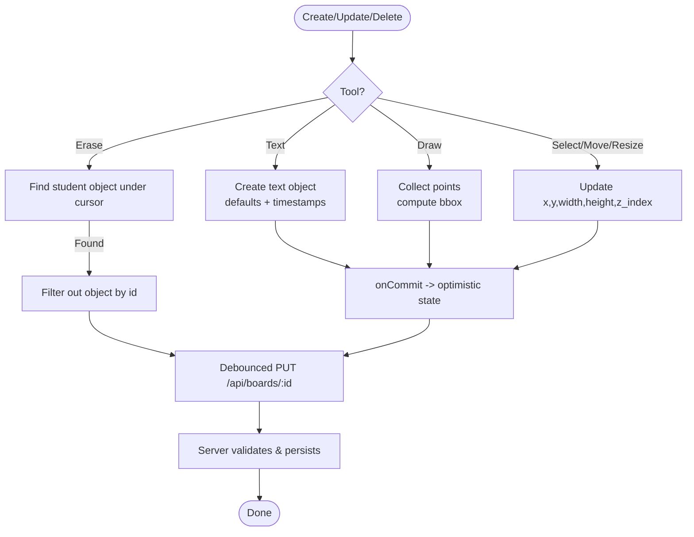
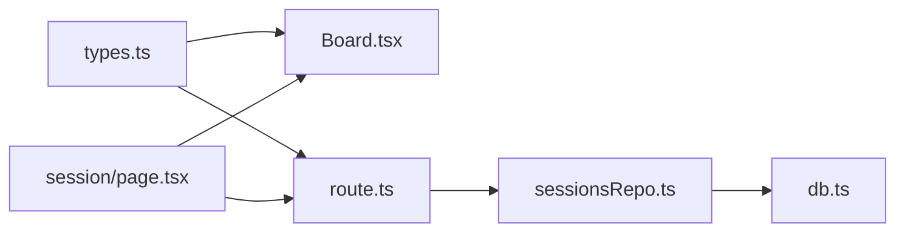

# Board Object Model

<cite>
**Referenced Files in This Document**
- [types.ts](file://stepwise ai/app/lib/types.ts)
- [Board.tsx](file://stepwise ai/app/components/board/Board.tsx)
- [route.ts](file://stepwise ai/app/app/api/boards/[id]/route.ts)
- [sessionsRepo.ts](file://stepwise ai/app/lib/sessionsRepo.ts)
- [db.ts](file://stepwise ai/app/lib/db.ts)
- [page.tsx](file://stepwise ai/app/app/session/[id]/page.tsx)
- [02-interactive-board.md.txt](file://stepwise ai/specs/02-interactive-board.md.txt)
</cite>

## Table of Contents
1. [Introduction](#introduction)
2. [Project Structure](#project-structure)
3. [Core Components](#core-components)
4. [Architecture Overview](#architecture-overview)
5. [Detailed Component Analysis](#detailed-component-analysis)
6. [Dependency Analysis](#dependency-analysis)
7. [Performance Considerations](#performance-considerations)
8. [Troubleshooting Guide](#troubleshooting-guide)
9. [Conclusion](#conclusion)
10. [Appendices](#appendices)

## Introduction
This document describes the board object model used by the StepWise AI learning canvas. It covers all supported object types (text, formula, drawing, and AI/system objects), their properties (id, position, dimensions, rotation, z-index, content, style, metadata, ownership, timestamps), lifecycle from creation to deletion, validation rules and data integrity constraints, serialization format for persistence, and differences between student-owned and AI/system objects.

## Project Structure
The board object model spans shared types, UI rendering, API routes, and persistence:
- Shared domain types define the canonical shape of a board object and related enums.
- The React board component renders and edits objects on an infinite canvas with pan/zoom, selection, editing, resizing, and deletion.
- API routes validate incoming snapshots and persist them to a local database.
- Repository functions handle reading/writing board objects and events, including safe parsing and size limits.
- Session page coordinates optimistic updates, undo/redo history, and debounced autosave.

**Diagram sources**
- [Board.tsx:1-540](file://stepwise ai/app/components/board/Board.tsx#L1-L540)
- [route.ts:1-105](file://stepwise ai/app/app/api/boards/[id]/route.ts#L1-L105)
- [sessionsRepo.ts:203-286](file://stepwise ai/app/lib/sessionsRepo.ts#L203-L286)
- [db.ts:70-117](file://stepwise ai/app/lib/db.ts#L70-L117)
- [types.ts:26-57](file://stepwise ai/app/lib/types.ts#L26-L57)
- [02-interactive-board.md.txt:1-1](file://stepwise ai/specs/02-interactive-board.md.txt#L1-L1)

**Section sources**
- [types.ts:26-57](file://stepwise ai/app/lib/types.ts#L26-L57)
- [Board.tsx:1-540](file://stepwise ai/app/components/board/Board.tsx#L1-L540)
- [route.ts:1-105](file://stepwise ai/app/app/api/boards/[id]/route.ts#L1-L105)
- [sessionsRepo.ts:203-286](file://stepwise ai/app/lib/sessionsRepo.ts#L203-L286)
- [db.ts:70-117](file://stepwise ai/app/lib/db.ts#L70-L117)
- [02-interactive-board.md.txt:1-1](file://stepwise ai/specs/02-interactive-board.md.txt#L1-L1)

## Core Components
- BoardObject type defines the canonical schema for every object on the board.
- Ownership distinguishes who created or controls the object: student, ai, system, imported.
- BoardObjectType enumerates supported kinds: text, handwriting, drawing, shape, connector, image, note, formula, annotation, visual.
- The board UI creates, moves, resizes, edits, highlights, and deletes objects; it enforces read-only behavior for non-student owners where appropriate.
- API routes validate and sanitize inputs before saving.
- Persistence layer serializes objects into a JSON-backed store with safe parsing and bounded sizes.

Key responsibilities:
- Client-side modeling and interaction: Board.tsx
- Type contract: types.ts
- Validation and persistence: route.ts, sessionsRepo.ts, db.ts

**Section sources**
- [types.ts:26-57](file://stepwise ai/app/lib/types.ts#L26-L57)
- [Board.tsx:145-297](file://stepwise ai/app/components/board/Board.tsx#L145-L297)
- [route.ts:10-85](file://stepwise ai/app/app/api/boards/[id]/route.ts#L10-L85)
- [sessionsRepo.ts:206-265](file://stepwise ai/app/lib/sessionsRepo.ts#L206-L265)

## Architecture Overview
The board is a client-first, server-backed workspace:
- The UI maintains an optimistic list of BoardObject instances.
- User actions trigger commits that update local state and schedule debounced saves.
- The server validates each object’s type and owner against allowed sets, normalizes numeric fields, truncates large strings, and persists a full snapshot per board.
- On load, the server returns persisted objects which the UI renders as an infinite canvas with pan/zoom and interactive tools.

**Diagram sources**
- [Board.tsx:145-297](file://stepwise ai/app/components/board/Board.tsx#L145-L297)
- [route.ts:41-85](file://stepwise ai/app/app/api/boards/[id]/route.ts#L41-L85)
- [sessionsRepo.ts:239-265](file://stepwise ai/app/lib/sessionsRepo.ts#L239-L265)
- [db.ts:101-108](file://stepwise ai/app/lib/db.ts#L101-L108)

## Detailed Component Analysis

### BoardObject Data Model
Canonical fields:
- id: string — unique identifier for the object within a board.
- board_id: string — parent board identifier.
- type: BoardObjectType — kind of object.
- x, y: number — top-left position in board coordinates.
- width, height: number — bounding box dimensions.
- rotation: number — rotation angle (degrees).
- z_index: number — stacking order.
- content: string — serialized payload; varies by type (e.g., plain text, formula text, or JSON for drawings).
- style: Record<string, unknown> — presentation metadata (colors, fonts, etc.).
- meta: Record<string, unknown> — domain-specific metadata (e.g., annotations, references).
- owner: Ownership — student, ai, system, imported.
- created_at, updated_at: string — ISO timestamps.

Supported types include text, formula, drawing, and others such as handwriting, shape, connector, image, note, annotation, visual.

Ownership semantics:
- student: editable by the user; deletable via keyboard or erase tool.
- ai/system/imported: treated as read-only for direct content editing in the UI; can be moved/resized/deleted depending on context and policy.

**Section sources**
- [types.ts:26-57](file://stepwise ai/app/lib/types.ts#L26-L57)
- [Board.tsx:408-539](file://stepwise ai/app/components/board/Board.tsx#L408-L539)

#### Class Diagram

**Diagram sources**
- [types.ts:26-57](file://stepwise ai/app/lib/types.ts#L26-L57)

### Object Lifecycle: Creation to Deletion
Creation flows:
- Text object: created when the user selects the text tool and clicks on the canvas; defaults include minimal dimensions, zero rotation, next z-index, empty content, student ownership, and current timestamps.
- Drawing object: created after freehand strokes; content stores points and color as JSON; defaults similar to text but with computed bounding box.
- AI/system objects: typically created by backend processes or AI services; they carry owner values other than student and are rendered read-only for direct editing.

Editing flows:
- Text editing: double-click opens inline editor; changes update content and timestamp on blur or escape.
- Move/resize: drag to move; resize handle adjusts width/height with minimum bounds; updates propagate immediately and are debounced to autosave.

Deletion flows:
- Keyboard Delete/Backspace removes selected object only if owned by student and not in read-only mode.
- Erase tool removes the first student-owned object under the pointer.

Validation and constraints:
- Server enforces allowed types and owners; invalid values are normalized to safe defaults.
- Numeric fields are coerced to numbers with fallbacks.
- Content and JSON fields are truncated to prevent oversized payloads.
- Dimensions are clamped to reasonable ranges during persistence.

**Diagram sources**
- [Board.tsx:145-297](file://stepwise ai/app/components/board/Board.tsx#L145-L297)
- [route.ts:41-85](file://stepwise ai/app/app/api/boards/[id]/route.ts#L41-L85)
- [sessionsRepo.ts:239-265](file://stepwise ai/app/lib/sessionsRepo.ts#L239-L265)

**Section sources**
- [Board.tsx:145-297](file://stepwise ai/app/components/board/Board.tsx#L145-L297)
- [Board.tsx:408-539](file://stepwise ai/app/components/board/Board.tsx#L408-L539)
- [route.ts:41-85](file://stepwise ai/app/app/api/boards/[id]/route.ts#L41-L85)
- [sessionsRepo.ts:239-265](file://stepwise ai/app/lib/sessionsRepo.ts#L239-L265)

### Content Structure by Type
- text: plain string content representing typed notes or explanations.
- formula: string content representing mathematical expressions or formulas.
- drawing: JSON-encoded structure containing an array of points and optional styling like color; rendered as SVG polyline.
- Other types (handwriting, shape, connector, image, note, annotation, visual): stored as string content and/or metadata; rendering logic may interpret content differently based on type.

Rendering considerations:
- Drawing objects parse content safely; malformed content falls back to empty points.
- Text-like objects display content directly with whitespace handling.

**Section sources**
- [Board.tsx:250-283](file://stepwise ai/app/components/board/Board.tsx#L250-L283)
- [Board.tsx:432-454](file://stepwise ai/app/components/board/Board.tsx#L432-L454)
- [types.ts:26-57](file://stepwise ai/app/lib/types.ts#L26-L57)

### Styling and Metadata
- style: arbitrary key-value pairs for presentation (e.g., colors, fonts); persisted as JSON and parsed safely on load.
- meta: arbitrary key-value pairs for domain metadata (e.g., concept tags, references); persisted as JSON and parsed safely on load.
- Both fields are sanitized to objects and truncated at the persistence layer to limit storage size.

**Section sources**
- [route.ts:50-85](file://stepwise ai/app/app/api/boards/[id]/route.ts#L50-L85)
- [sessionsRepo.ts:218-233](file://stepwise ai/app/lib/sessionsRepo.ts#L218-L233)
- [sessionsRepo.ts:239-265](file://stepwise ai/app/lib/sessionsRepo.ts#L239-L265)

### Ownership Differences: Student vs AI/System
- Student-owned objects:
  - Fully editable (content, position, size).
  - Deletable via keyboard or erase tool.
  - Can be duplicated and repositioned freely.
- AI/system-owned objects:
  - Rendered read-only for direct content editing in the UI.
  - Can be moved, resized, deleted, annotated around, and duplicated per spec guidance.
  - Used for educational visuals, diagrams, hints, and feedback annotations.

Visual cues:
- AI/system objects receive distinct borders and badges to indicate origin.
- Feedback labels can highlight specific objects to guide attention.

**Section sources**
- [Board.tsx:428-539](file://stepwise ai/app/components/board/Board.tsx#L428-L539)
- [02-interactive-board.md.txt:1-1](file://stepwise ai/specs/02-interactive-board.md.txt#L1-L1)

### Timestamps and Auditability
- created_at and updated_at are set on creation and on edits.
- The persistence layer records updated timestamps for both objects and boards.
- Events can be recorded separately for meaningful board actions.

**Section sources**
- [Board.tsx:156-175](file://stepwise ai/app/components/board/Board.tsx#L156-L175)
- [Board.tsx:259-279](file://stepwise ai/app/components/board/Board.tsx#L259-L279)
- [sessionsRepo.ts:239-265](file://stepwise ai/app/lib/sessionsRepo.ts#L239-L265)
- [db.ts:106-108](file://stepwise ai/app/lib/db.ts#L106-L108)

## Dependency Analysis
- Board.tsx depends on types.ts for BoardObject and Ownership.
- route.ts imports types.ts and uses sessionsRepo.ts for persistence.
- sessionsRepo.ts reads/writes via db.ts and applies safe parsing and size limits.
- Page-level session controller orchestrates optimistic updates and debounced saves.

**Diagram sources**
- [types.ts:26-57](file://stepwise ai/app/lib/types.ts#L26-L57)
- [Board.tsx:1-540](file://stepwise ai/app/components/board/Board.tsx#L1-L540)
- [route.ts:1-105](file://stepwise ai/app/app/api/boards/[id]/route.ts#L1-L105)
- [sessionsRepo.ts:203-286](file://stepwise ai/app/lib/sessionsRepo.ts#L203-L286)
- [db.ts:70-117](file://stepwise ai/app/lib/db.ts#L70-L117)
- [page.tsx:100-146](file://stepwise ai/app/app/session/[id]/page.tsx#L100-L146)

**Section sources**
- [types.ts:26-57](file://stepwise ai/app/lib/types.ts#L26-L57)
- [Board.tsx:1-540](file://stepwise ai/app/components/board/Board.tsx#L1-L540)
- [route.ts:1-105](file://stepwise ai/app/app/api/boards/[id]/route.ts#L1-L105)
- [sessionsRepo.ts:203-286](file://stepwise ai/app/lib/sessionsRepo.ts#L203-L286)
- [db.ts:70-117](file://stepwise ai/app/lib/db.ts#L70-L117)
- [page.tsx:100-146](file://stepwise ai/app/app/session/[id]/page.tsx#L100-L146)

## Performance Considerations
- Debounced autosave reduces network overhead while preserving responsiveness.
- Snapshot-based persistence replaces all objects atomically per board, simplifying consistency at the cost of larger payloads.
- Size limits on content and JSON fields protect storage and parsing performance.
- Rendering sorts objects by z-index and uses absolute positioning for efficient layout.
- Drawing content is compactly encoded as point arrays to minimize payload size.

[No sources needed since this section provides general guidance]

## Troubleshooting Guide
Common issues and resolutions:
- Invalid type or owner:
  - Cause: Client sends unsupported type or owner.
  - Resolution: Server normalizes to default values; ensure client adheres to allowed sets.
- Oversized content:
  - Cause: Large text or JSON payloads.
  - Resolution: Content and JSON fields are truncated; consider splitting content or using external resources.
- Malformed drawing content:
  - Cause: Corrupted JSON in content.
  - Resolution: Parser falls back to empty points; regenerate drawing or repair content.
- Unauthorized access:
  - Cause: Missing or invalid authentication.
  - Resolution: Ensure authenticated requests; verify board ownership checks.
- Persistence errors:
  - Cause: Database transaction failures or missing board.
  - Resolution: Check ownership and existence; retry operations.

**Section sources**
- [route.ts:10-85](file://stepwise ai/app/app/api/boards/[id]/route.ts#L10-L85)
- [sessionsRepo.ts:218-265](file://stepwise ai/app/lib/sessionsRepo.ts#L218-L265)
- [db.ts:101-108](file://stepwise ai/app/lib/db.ts#L101-L108)

## Conclusion
The board object model provides a flexible, extensible foundation for an AI-aware learning canvas. It supports multiple object types with clear ownership semantics, robust validation, and safe persistence. The UI offers rich interactivity while maintaining separation between student-authored and AI/system-provided content. Autosave and event recording support reliability and auditability, enabling a responsive and pedagogically effective experience.

[No sources needed since this section summarizes without analyzing specific files]

## Appendices

### API Envelope and Error Handling
- API responses use a consistent envelope with data or error fields.
- Errors include codes and messages for client handling.

**Section sources**
- [types.ts:298-302](file://stepwise ai/app/lib/types.ts#L298-L302)

### Board Snapshot for Evaluation
- A lightweight snapshot includes essential fields for AI evaluation contexts.

**Section sources**
- [types.ts:259-263](file://stepwise ai/app/lib/types.ts#L259-L263)