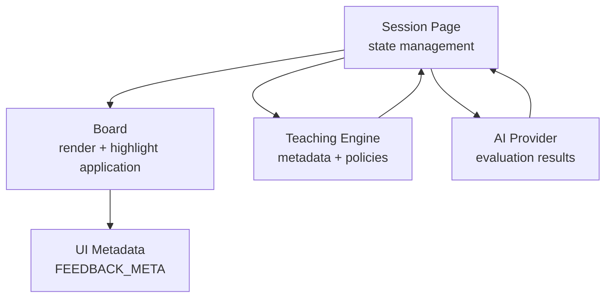
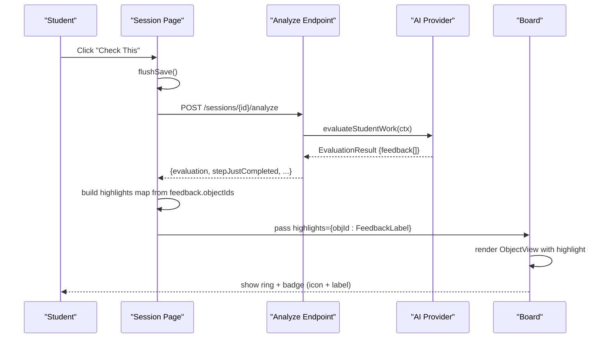
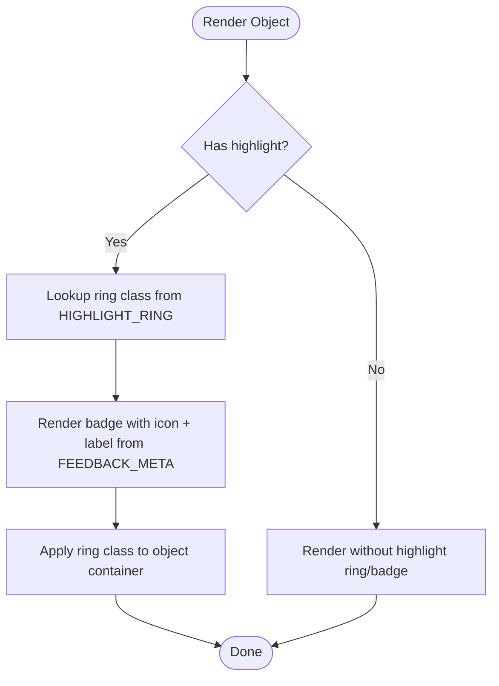
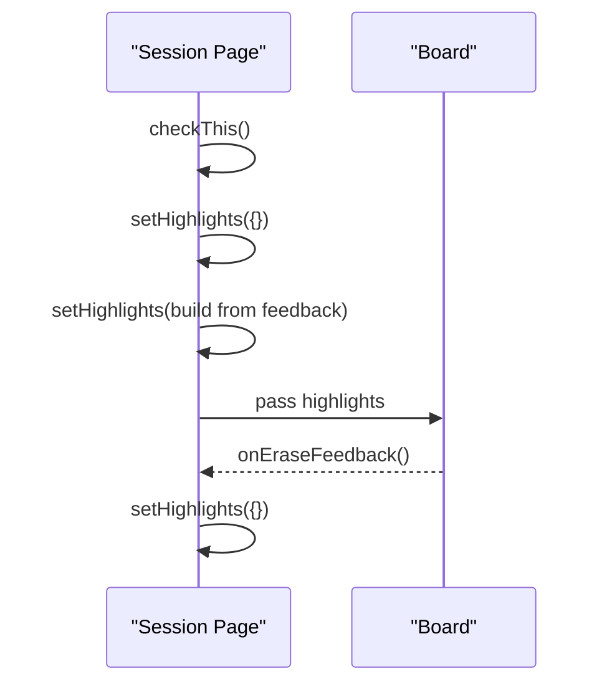
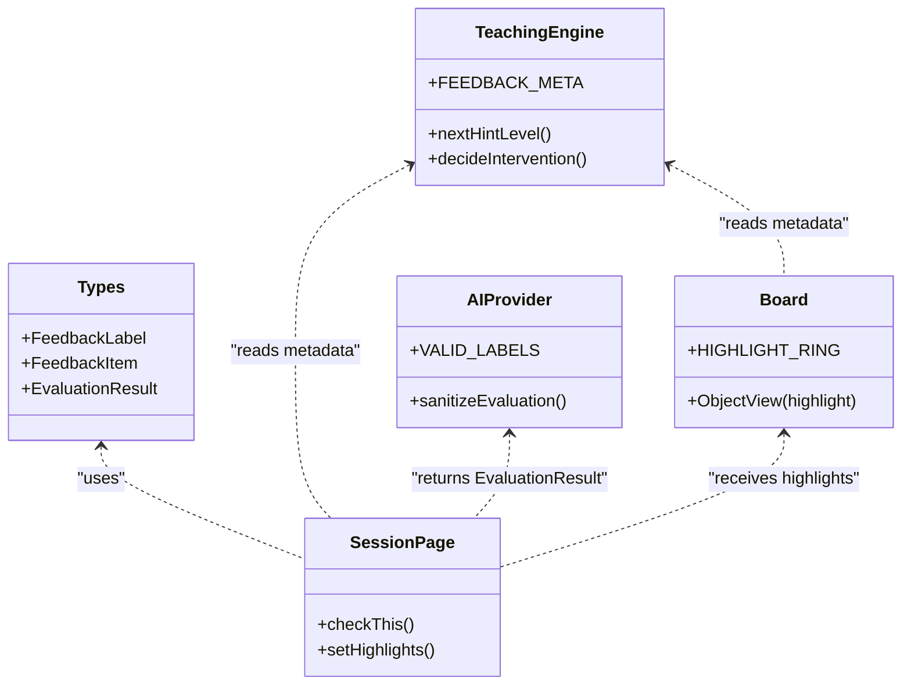
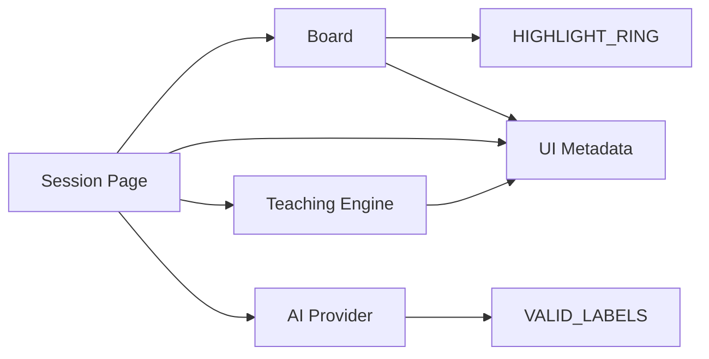

# Feedback & Highlighting System

<cite>
**Referenced Files in This Document**
- [types.ts](file://stepwise ai/app/lib/types.ts)
- [Board.tsx](file://stepwise ai/app/components/board/Board.tsx)
- [ui.tsx](file://stepwise ai/app/components/ui.tsx)
- [teaching.ts](file://stepwise ai/app/lib/teaching.ts)
- [openaiProvider.ts](file://stepwise ai/app/lib/ai/openaiProvider.ts)
- [page.tsx (Session)](file://stepwise ai/app/app/session/[id]/page.tsx)
</cite>

## Table of Contents
1. [Introduction](#introduction)
2. [Project Structure](#project-structure)
3. [Core Components](#core-components)
4. [Architecture Overview](#architecture-overview)
5. [Detailed Component Analysis](#detailed-component-analysis)
6. [Dependency Analysis](#dependency-analysis)
7. [Performance Considerations](#performance-considerations)
8. [Troubleshooting Guide](#troubleshooting-guide)
9. [Conclusion](#conclusion)
10. [Appendices](#appendices)

## Introduction
This document explains the feedback highlighting system that provides visual indicators for AI-generated feedback on board objects. It covers:
- The FeedbackLabel taxonomy and how each label maps to ring colors, icons, and labels
- How highlights are applied to board objects and managed throughout their lifecycle
- Integration with the teaching engine and AI providers
- Examples for implementing custom feedback types and overriding styles for different learning contexts

## Project Structure
The feedback highlighting system spans several layers:
- Types define the feedback labels and data structures
- Board renders objects and applies highlight rings and badges
- UI components provide shared metadata (icons and labels) for feedback
- Teaching engine defines consistent metadata and policies
- AI provider sanitizes and validates feedback from external models
- Session page orchestrates evaluation, highlights, and user actions

**Diagram sources**
- [page.tsx (Session):189-227](file://stepwise ai/app/app/session/[id]/page.tsx#L189-L227)
- [Board.tsx:28-36](file://stepwise ai/app/components/board/Board.tsx#L28-L36)
- [ui.tsx:177-186](file://stepwise ai/app/components/ui.tsx#L177-L186)
- [teaching.ts:8-16](file://stepwise ai/app/lib/teaching.ts#L8-L16)
- [openaiProvider.ts:224-279](file://stepwise ai/app/lib/ai/openaiProvider.ts#L224-L279)

**Section sources**
- [types.ts:61-78](file://stepwise ai/app/lib/types.ts#L61-L78)
- [Board.tsx:28-36](file://stepwise ai/app/components/board/Board.tsx#L28-L36)
- [ui.tsx:177-186](file://stepwise ai/app/components/ui.tsx#L177-L186)
- [teaching.ts:8-16](file://stepwise ai/app/lib/teaching.ts#L8-L16)
- [openaiProvider.ts:224-279](file://stepwise ai/app/lib/ai/openaiProvider.ts#L224-L279)
- [page.tsx (Session):189-227](file://stepwise ai/app/app/session/[id]/page.tsx#L189-L227)

## Core Components
- FeedbackLabel taxonomy: a closed set of labels used across the app to represent AI feedback categories
- FeedbackItem: structured feedback with label, title, message, and objectIds linking to board objects
- Highlight mapping: per-label CSS ring classes applied to board objects
- Metadata registry: icon and label text for each FeedbackLabel, ensuring accessibility (icon + text, never color alone)
- Evaluation pipeline: session page calls analyze endpoint, receives EvaluationResult, builds highlights map, and passes it to Board

Key responsibilities:
- Types: define FeedbackLabel, FeedbackItem, EvaluationResult
- Board: apply highlight rings and display badge with icon + label
- UI: central FEEDBACK_META for consistent icons and labels
- Teaching engine: mirrors metadata and provides policy helpers
- AI provider: validates and sanitizes feedback labels before use

**Section sources**
- [types.ts:61-78](file://stepwise ai/app/lib/types.ts#L61-L78)
- [Board.tsx:28-36](file://stepwise ai/app/components/board/Board.tsx#L28-L36)
- [ui.tsx:177-186](file://stepwise ai/app/components/ui.tsx#L177-L186)
- [teaching.ts:8-16](file://stepwise ai/app/lib/teaching.ts#L8-L16)
- [openaiProvider.ts:224-279](file://stepwise ai/app/lib/ai/openaiProvider.ts#L224-L279)
- [page.tsx (Session):189-227](file://stepwise ai/app/app/session/[id]/page.tsx#L189-L227)

## Architecture Overview
The feedback flow begins when the student submits work via “Check This.” The session page persists changes, calls the analyze API, and receives an EvaluationResult containing feedback items. Each feedback item references one or more board objects by id. The session page builds a highlights map (object id → FeedbackLabel) and passes it to Board. Board renders each object with a corresponding ring style and a small badge showing the icon and label.

**Diagram sources**
- [page.tsx (Session):189-227](file://stepwise ai/app/app/session/[id]/page.tsx#L189-L227)
- [openaiProvider.ts:224-279](file://stepwise ai/app/lib/ai/openaiProvider.ts#L224-L279)
- [Board.tsx:408-539](file://stepwise ai/app/components/board/Board.tsx#L408-L539)

## Detailed Component Analysis

### FeedbackLabel Taxonomy and Visual Styles
FeedbackLabel is a closed union type representing distinct feedback categories. Each label has:
- A ring color class applied to the object border
- An icon and human-readable label displayed in a badge
- Consistent semantics enforced by validation in the AI provider

Mapping summary:
- CORRECT_UNDERSTANDING: green ring; green circle icon; “Correct understanding”
- PARTIALLY_CORRECT: amber ring; yellow circle icon; “Partially correct”
- MISSING_IDEA: sky blue ring; blue circle icon; “Missing idea”
- CONCEPT_ERROR: red ring; red circle icon; “Concept error”
- THINK_ABOUT_THIS: violet ring; purple circle icon; “Think about this”
- CHECK_THIS_STEP: orange ring; orange circle icon; “Check this step”
- AI_UNCERTAIN: slate ring; white circle icon; “AI uncertain”

These mappings are defined in:
- Ring styles: Board component’s HIGHLIGHT_RING
- Icons and labels: FEEDBACK_META in UI and Teaching modules

Accessibility note: Always pair color with icon and text. Never rely on color alone.

**Section sources**
- [types.ts:64-71](file://stepwise ai/app/lib/types.ts#L64-L71)
- [Board.tsx:28-36](file://stepwise ai/app/components/board/Board.tsx#L28-L36)
- [ui.tsx:177-186](file://stepwise ai/app/components/ui.tsx#L177-L186)
- [teaching.ts:8-16](file://stepwise ai/app/lib/teaching.ts#L8-L16)
- [openaiProvider.ts:224-232](file://stepwise ai/app/lib/ai/openaiProvider.ts#L224-L232)

### Applying Highlights to Objects
Board receives a highlights map keyed by object id. For each object:
- If the object id exists in highlights, compute the ring class from HIGHLIGHT_RING
- Render a small badge at top-right with icon and label from FEEDBACK_META
- Maintain selection ring separately from highlight ring

Object rendering logic ensures:
- Only student-owned objects typically receive highlights (though any object can be highlighted if referenced)
- Drawing objects do not get borders; they still receive highlight rings where applicable

**Diagram sources**
- [Board.tsx:408-539](file://stepwise ai/app/components/board/Board.tsx#L408-L539)
- [Board.tsx:28-36](file://stepwise ai/app/components/board/Board.tsx#L28-L36)
- [ui.tsx:177-186](file://stepwise ai/app/components/ui.tsx#L177-L186)

**Section sources**
- [Board.tsx:408-539](file://stepwise ai/app/components/board/Board.tsx#L408-L539)
- [Board.tsx:28-36](file://stepwise ai/app/components/board/Board.tsx#L28-L36)
- [ui.tsx:177-186](file://stepwise ai/app/components/ui.tsx#L177-L186)

### Highlight Lifecycle Management
Highlights are transient and tied to the current evaluation result:
- Build phase: After analyze returns, iterate feedback items and map each object id to its label
- Display phase: Pass highlights to Board; objects render with ring + badge
- Clear phase: When erasing feedback (e.g., using erase tool), clear highlights to reset state

Lifecycle events:
- Creation: On successful analyze call, set highlights from feedback
- Update: Rebuild highlights on subsequent checks
- Removal: Clear highlights when explicitly resetting or after erasing feedback

**Diagram sources**
- [page.tsx (Session):189-227](file://stepwise ai/app/app/session/[id]/page.tsx#L189-L227)
- [page.tsx (Session):387-394](file://stepwise ai/app/app/session/[id]/page.tsx#L387-L394)

**Section sources**
- [page.tsx (Session):189-227](file://stepwise ai/app/app/session/[id]/page.tsx#L189-L227)
- [page.tsx (Session):387-394](file://stepwise ai/app/app/session/[id]/page.tsx#L387-L394)

### Integration with the Teaching Engine
The teaching engine provides:
- FEEDBACK_META: canonical icon and label for each FeedbackLabel
- Hint escalation and intervention policies
- State transitions based on evaluation status

Integration points:
- Session page uses FEEDBACK_META to render feedback list in the panel
- Board uses FEEDBACK_META to render badge on highlighted objects
- AI provider validates feedback labels against a whitelist to ensure safety and consistency

**Diagram sources**
- [types.ts:61-78](file://stepwise ai/app/lib/types.ts#L61-L78)
- [teaching.ts:8-16](file://stepwise ai/app/lib/teaching.ts#L8-L16)
- [openaiProvider.ts:224-279](file://stepwise ai/app/lib/ai/openaiProvider.ts#L224-L279)
- [page.tsx (Session):189-227](file://stepwise ai/app/app/session/[id]/page.tsx#L189-L227)
- [Board.tsx:28-36](file://stepwise ai/app/components/board/Board.tsx#L28-L36)

**Section sources**
- [teaching.ts:8-16](file://stepwise ai/app/lib/teaching.ts#L8-L16)
- [openaiProvider.ts:224-279](file://stepwise ai/app/lib/ai/openaiProvider.ts#L224-L279)
- [page.tsx (Session):189-227](file://stepwise ai/app/app/session/[id]/page.tsx#L189-L227)
- [Board.tsx:28-36](file://stepwise ai/app/components/board/Board.tsx#L28-L36)

### Examples: Implementing Custom Feedback Types and Styling Overrides
To add a new feedback type:
1. Extend FeedbackLabel in types with a new string literal
2. Add a ring class mapping in Board’s HIGHLIGHT_RING
3. Add icon and label in FEEDBACK_META (both in ui.tsx and teaching.ts)
4. Ensure AI provider’s VALID_LABELS includes the new label
5. Update any UI lists that render feedback to use FEEDBACK_META

Example pattern (conceptual steps):
- Define new label: e.g., “NEEDS_REVIEW”
- Map ring: e.g., “ring-4 ring-indigo-400”
- Add metadata: e.g., icon “🟣”, label “Needs review”
- Whitelist in provider: include “NEEDS_REVIEW” in VALID_LABELS
- Use consistently in session page and Board

Styling overrides for different learning contexts:
- Adjust ring thickness or color intensity via Tailwind classes in HIGHLIGHT_RING
- Customize badge appearance by modifying ObjectView’s badge className
- Provide context-specific labels in FEEDBACK_META for age bands or explanation depth

Note: Always preserve accessibility by keeping icon + text together and avoiding color-only signals.

**Section sources**
- [types.ts:64-71](file://stepwise ai/app/lib/types.ts#L64-L71)
- [Board.tsx:28-36](file://stepwise ai/app/components/board/Board.tsx#L28-L36)
- [ui.tsx:177-186](file://stepwise ai/app/components/ui.tsx#L177-L186)
- [teaching.ts:8-16](file://stepwise ai/app/lib/teaching.ts#L8-L16)
- [openaiProvider.ts:224-232](file://stepwise ai/app/lib/ai/openaiProvider.ts#L224-L232)

## Dependency Analysis
- Session Page depends on:
  - Board for rendering and highlight application
  - AI Provider indirectly through API responses
  - UI metadata for consistent feedback presentation
- Board depends on:
  - HIGHLIGHT_RING for visual styles
  - FEEDBACK_META for badge content
- AI Provider depends on:
  - VALID_LABELS to sanitize feedback
  - Types for EvaluationResult structure
- Teaching Engine provides:
  - Shared metadata and policy functions used by UI and session logic

**Diagram sources**
- [page.tsx (Session):189-227](file://stepwise ai/app/app/session/[id]/page.tsx#L189-L227)
- [Board.tsx:28-36](file://stepwise ai/app/components/board/Board.tsx#L28-L36)
- [ui.tsx:177-186](file://stepwise ai/app/components/ui.tsx#L177-L186)
- [teaching.ts:8-16](file://stepwise ai/app/lib/teaching.ts#L8-L16)
- [openaiProvider.ts:224-232](file://stepwise ai/app/lib/ai/openaiProvider.ts#L224-L232)

**Section sources**
- [page.tsx (Session):189-227](file://stepwise ai/app/app/session/[id]/page.tsx#L189-L227)
- [Board.tsx:28-36](file://stepwise ai/app/components/board/Board.tsx#L28-L36)
- [ui.tsx:177-186](file://stepwise ai/app/components/ui.tsx#L177-L186)
- [teaching.ts:8-16](file://stepwise ai/app/lib/teaching.ts#L8-L16)
- [openaiProvider.ts:224-232](file://stepwise ai/app/lib/ai/openaiProvider.ts#L224-L232)

## Performance Considerations
- Keep highlights map minimal: only include object ids present in feedback
- Avoid unnecessary re-renders: update highlights only when evaluation changes
- Debounce saves to prevent excessive network calls during rapid edits
- Limit feedback items rendered in UI to a reasonable count to avoid heavy DOM updates

[No sources needed since this section provides general guidance]

## Troubleshooting Guide
Common issues and resolutions:
- Highlights not appearing:
  - Verify feedback.item.objectIds match actual board object ids
  - Ensure validate labels are whitelisted in AI provider
  - Confirm Board receives highlights prop and ObjectView renders badge
- Incorrect ring color:
  - Check HIGHLIGHT_MAPPING for the label
  - Ensure Tailwind classes are available in your environment
- Accessibility warnings:
  - Ensure FEEDBACK_META includes both icon and label
  - Do not rely solely on color to convey meaning

**Section sources**
- [openaiProvider.ts:224-279](file://stepwise ai/app/lib/ai/openaiProvider.ts#L224-L279)
- [Board.tsx:408-539](file://stepwise ai/app/components/board/Board.tsx#L408-L539)
- [ui.tsx:177-186](file://stepwise ai/app/components/ui.tsx#L177-L186)

## Conclusion
The feedback highlighting system provides a robust, accessible way to visualize AI-generated feedback directly on board objects. By centralizing metadata and enforcing label validation, the system ensures consistent visuals and semantics across contexts. The lifecycle management keeps highlights aligned with the current evaluation, while extensibility points allow customization for different learning scenarios.

[No sources needed since this section summarizes without analyzing specific files]

## Appendices

### Data Model Summary
- FeedbackLabel: closed set of feedback categories
- FeedbackItem: label, title, message, objectIds
- EvaluationResult: status, summary, feedback[], errors[], strengths[], missingElements[], interventionLevel, nextAction

**Section sources**
- [types.ts:61-78](file://stepwise ai/app/lib/types.ts#L61-L78)