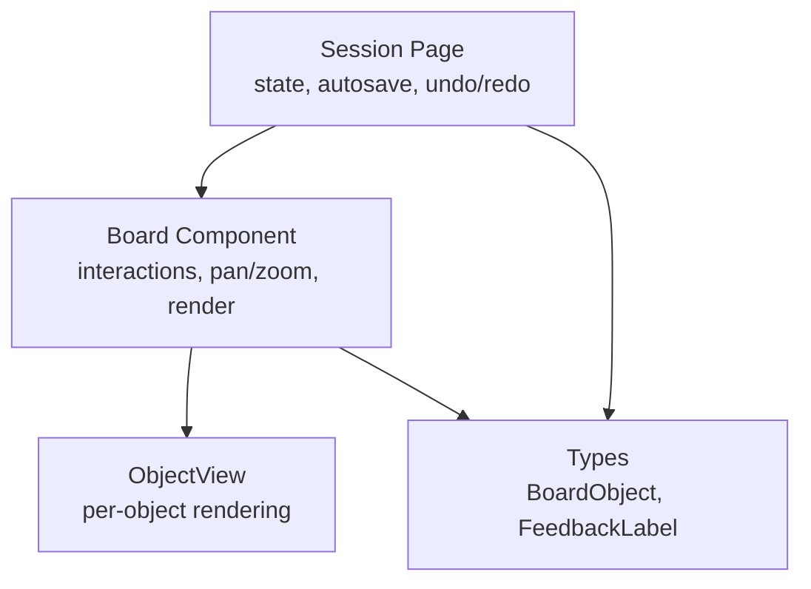
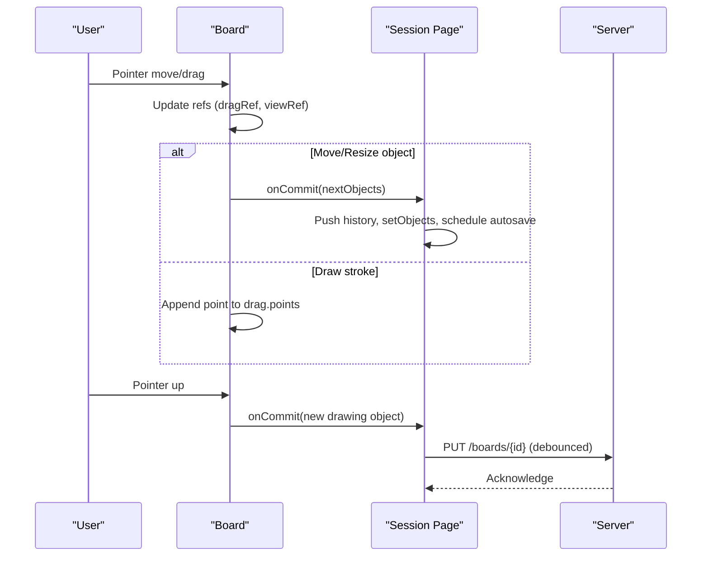
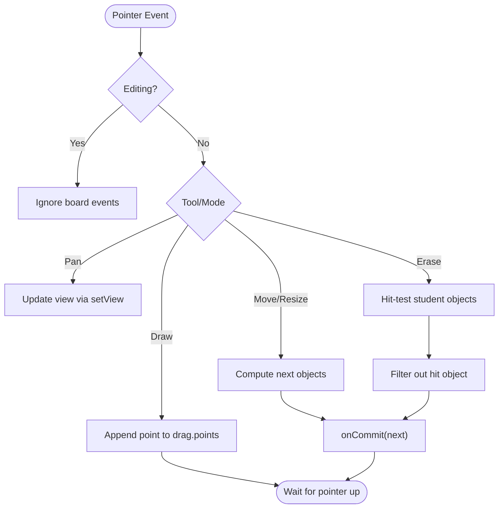
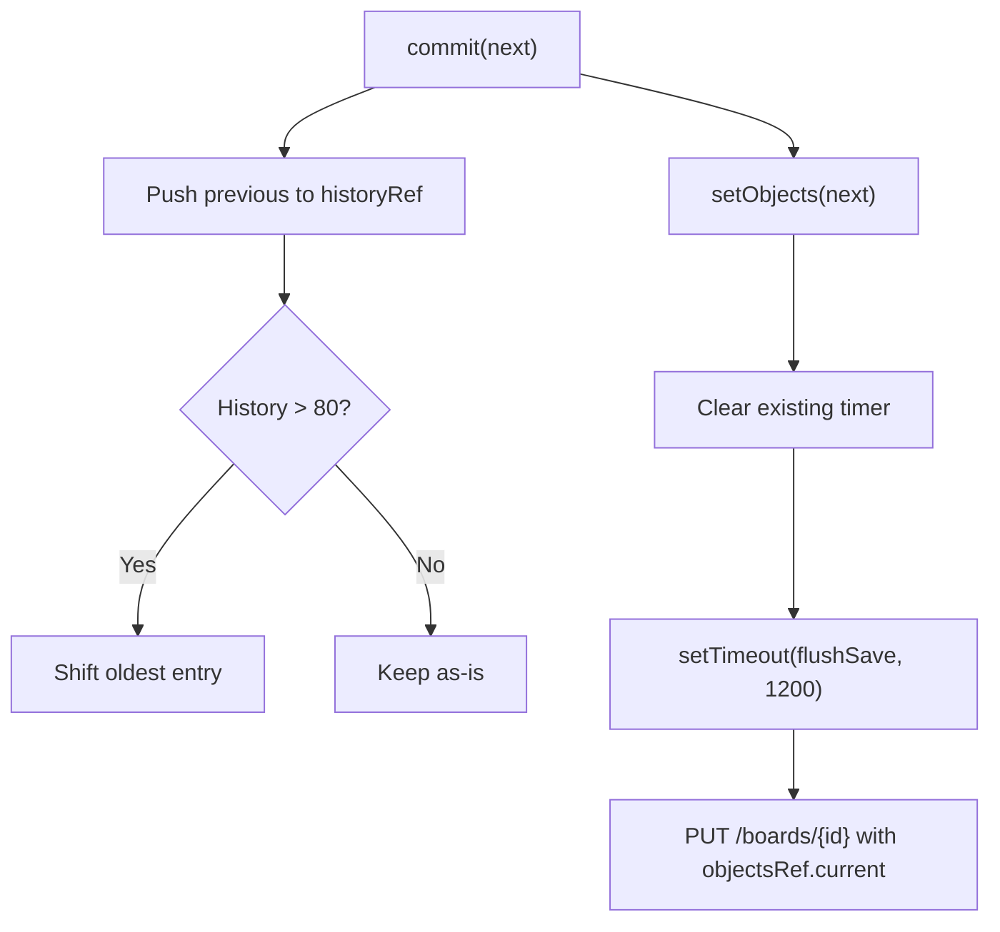
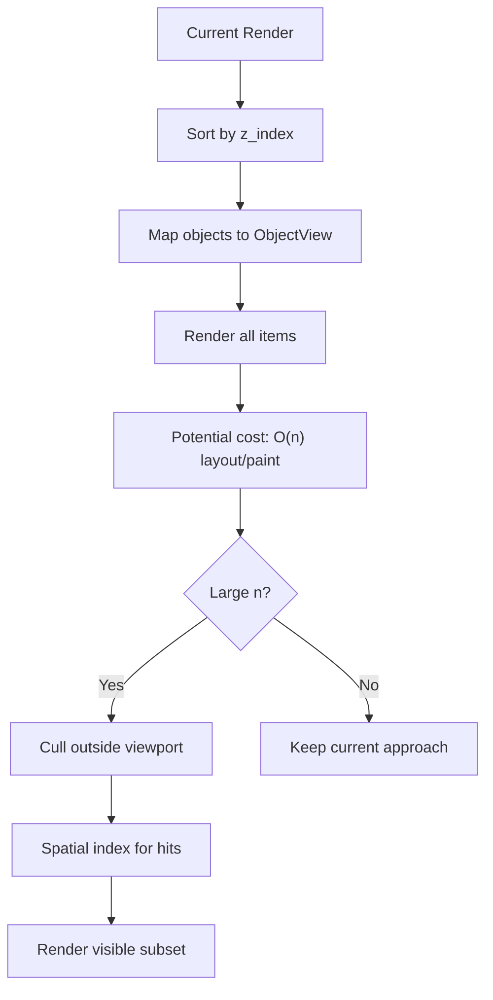
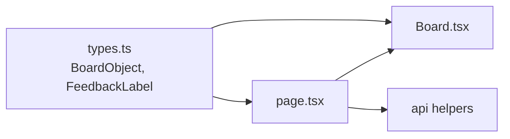

# Performance & Optimization

<cite>
**Referenced Files in This Document**
- [Board.tsx](file://stepwise ai/app/components/board/Board.tsx)
- [page.tsx](file://stepwise ai/app/app/session/[id]/page.tsx)
- [types.ts](file://stepwise ai/app/lib/types.ts)
</cite>

## Table of Contents
1. [Introduction](#introduction)
2. [Project Structure](#project-structure)
3. [Core Components](#core-components)
4. [Architecture Overview](#architecture-overview)
5. [Detailed Component Analysis](#detailed-component-analysis)
6. [Dependency Analysis](#dependency-analysis)
7. [Performance Considerations](#performance-considerations)
8. [Troubleshooting Guide](#troubleshooting-guide)
9. [Conclusion](#conclusion)

## Introduction
This document explains the performance optimization strategies used by the Board component and its surrounding session page to deliver smooth, interactive experiences at scale. It focuses on efficient re-rendering with React hooks, minimizing DOM manipulation, memory management for large canvases, use of refs to avoid unnecessary re-renders, virtual scrolling considerations for large object sets, GPU acceleration techniques, profiling approaches for identifying bottlenecks, and best practices for maintaining responsiveness under load.

## Project Structure
The Board is implemented as a client-side canvas-like UI built with React and CSS transforms. The session page manages state, persistence, undo/redo, and autosave, while the Board handles pointer interactions, pan/zoom, drawing, erasing, and rendering objects. Shared types define the data model for board objects and feedback.

**Diagram sources**
- [page.tsx:45-130](file://stepwise ai/app/app/session/[id]/page.tsx#L45-L130)
- [Board.tsx:44-364](file://stepwise ai/app/components/board/Board.tsx#L44-L364)
- [types.ts:41-57](file://stepwise ai/app/lib/types.ts#L41-L57)

**Section sources**
- [page.tsx:45-130](file://stepwise ai/app/app/session/[id]/page.tsx#L45-L130)
- [Board.tsx:44-364](file://stepwise ai/app/components/board/Board.tsx#L44-L364)
- [types.ts:41-57](file://stepwise ai/app/lib/types.ts#L41-L57)

## Core Components
- Board: Manages viewport (pan/zoom), drag states, selection, editing, drawing, erasing, and renders objects using CSS transforms for GPU-accelerated movement. Uses refs to hold mutable values across event handlers without triggering re-renders.
- Session Page: Owns the authoritative objects array, implements undo/redo history, debounced autosave, and orchestrates AI evaluation flows. Provides commit callbacks to the Board.
- ObjectView: Renders individual objects (text, drawings, formulas) with minimal overhead per item.

Key performance patterns observed:
- Refs for high-frequency updates (drag, view, objects) to avoid re-renders during interaction.
- useCallback for stable handler references.
- CSS transform-based pan/zoom for GPU acceleration.
- Debounced autosave to reduce network pressure.
- Local temporary state for drawing points to defer committing until stroke ends.

**Section sources**
- [Board.tsx:59-71](file://stepwise ai/app/components/board/Board.tsx#L59-L71)
- [Board.tsx:107-128](file://stepwise ai/app/components/board/Board.tsx#L107-L128)
- [Board.tsx:145-248](file://stepwise ai/app/components/board/Board.tsx#L145-L248)
- [Board.tsx:329-364](file://stepwise ai/app/components/board/Board.tsx#L329-L364)
- [page.tsx:100-130](file://stepwise ai/app/app/session/[id]/page.tsx#L100-L130)

## Architecture Overview
The Board receives immutable objects from the session page and renders them inside a transformed container. Pointer events update local refs and trigger minimal state changes (e.g., drag mode or view). Drawing strokes accumulate locally and are committed once finished. Autosave batches writes to the server.

**Diagram sources**
- [Board.tsx:207-248](file://stepwise ai/app/components/board/Board.tsx#L207-L248)
- [Board.tsx:250-283](file://stepwise ai/app/components/board/Board.tsx#L250-L283)
- [page.tsx:118-130](file://stepwise ai/app/app/session/[id]/page.tsx#L118-L130)

## Detailed Component Analysis

### Board: Efficient Re-rendering and Interaction
- Refs for mutable state:
  - objectsRef, dragRef, viewRef keep current values accessible in event handlers without causing re-renders.
  - This avoids expensive recalculations and reflows during fast interactions like panning and dragging.
- Stable handlers:
  - toBoard uses useCallback to prevent recreating functions on each render.
- Viewport transforms:
  - Pan/zoom applied via CSS transform translate/scale on a single container, leveraging GPU compositing for smooth motion.
- Minimal DOM updates:
  - Drawing accumulates points in local state and only commits a new object on pointer up, reducing frequent state updates.
  - Erase and move operations create minimal diffs and call onCommit once per change.

**Diagram sources**
- [Board.tsx:145-248](file://stepwise ai/app/components/board/Board.tsx#L145-L248)
- [Board.tsx:250-283](file://stepwise ai/app/components/board/Board.tsx#L250-L283)

**Section sources**
- [Board.tsx:59-71](file://stepwise ai/app/components/board/Board.tsx#L59-L71)
- [Board.tsx:107-128](file://stepwise ai/app/components/board/Board.tsx#L107-L128)
- [Board.tsx:145-248](file://stepwise ai/app/components/board/Board.tsx#L145-L248)
- [Board.tsx:250-283](file://stepwise ai/app/components/board/Board.tsx#L250-L283)
- [Board.tsx:329-364](file://stepwise ai/app/components/board/Board.tsx#L329-L364)

### Session Page: Memory Management and Autosave
- Undo/Redo history:
  - Maintains bounded history arrays (historyRef, futureRef) with a cap to prevent unbounded memory growth.
- Debounced autosave:
  - Uses a timer to batch saves every 1200ms, reducing network calls and server load.
- Force render trick:
  - A dummy state increment triggers re-renders when necessary (e.g., after undo/redo), ensuring UI consistency.
- Optimistic updates:
  - setObjects(next) immediately reflects user actions; saving happens asynchronously.

**Diagram sources**
- [page.tsx:118-130](file://stepwise ai/app/app/session/[id]/page.tsx#L118-L130)

**Section sources**
- [page.tsx:118-130](file://stepwise ai/app/app/session/[id]/page.tsx#L118-L130)
- [page.tsx:132-158](file://stepwise ai/app/app/session/[id]/page.tsx#L132-L158)

### Rendering Strategy and Virtualization Considerations
- Current approach:
  - All objects are rendered within a transformed container. Sorting by z-index ensures correct draw order.
  - Each object is wrapped in ObjectView, which conditionally renders text or SVG drawings.
- Potential issues at scale:
  - Rendering thousands of objects can cause layout thrashing and heavy paint costs.
- Recommended virtualization:
  - Implement viewport culling to render only visible objects based on view.x, view.y, and view.scale.
  - Use a virtualized list or spatial index (e.g., quadtree) to quickly find candidates near the viewport.
  - For drawings, consider offscreen canvases or WebGL for complex paths.

[No sources needed since this diagram shows conceptual workflow, not actual code structure]

### GPU Acceleration Techniques
- CSS transforms:
  - Pan/zoom uses transform: translate(...) scale(...), enabling compositor-only updates and smoother motion.
- SVG overlays:
  - Temporary drawing overlay uses an SVG polyline for vector graphics that scale cleanly.
- Recommendations:
  - Prefer transform over top/left positioning for moving elements.
  - Avoid layout-triggering properties during animation (width, height, left, top).
  - Use will-change sparingly if needed for known animated layers.

**Section sources**
- [Board.tsx:329-334](file://stepwise ai/app/components/board/Board.tsx#L329-L334)
- [Board.tsx:352-363](file://stepwise ai/app/components/board/Board.tsx#L352-L363)

## Dependency Analysis
- Board depends on shared types for object shapes and feedback labels.
- Session Page depends on Board and provides commit callbacks, tool state, and highlights.
- Autosave depends on API helpers to persist objects.

**Diagram sources**
- [types.ts:41-57](file://stepwise ai/app/lib/types.ts#L41-L57)
- [Board.tsx:4-5](file://stepwise ai/app/components/board/Board.tsx#L4-L5)
- [page.tsx:6-8](file://stepwise ai/app/app/session/[id]/page.tsx#L6-L8)

**Section sources**
- [types.ts:41-57](file://stepwise ai/app/lib/types.ts#L41-L57)
- [Board.tsx:4-5](file://stepwise ai/app/components/board/Board.tsx#L4-L5)
- [page.tsx:6-8](file://stepwise ai/app/app/session/[id]/page.tsx#L6-L8)

## Performance Considerations
- Efficient re-rendering with hooks:
  - useRef for mutable values accessed in event handlers (objectsRef, dragRef, viewRef) to avoid re-renders during high-frequency interactions.
  - useCallback for stable function references (toBoard, flushSave, commit) to minimize dependency churn.
- DOM manipulation minimization:
  - Accumulate drawing points locally and commit once on pointer up.
  - Use CSS transforms for pan/zoom instead of updating layout properties.
- Memory management:
  - Bounded undo/redo history (max 80 entries) prevents unbounded growth.
  - Debounced autosave reduces frequent writes and memory churn.
- Virtual scrolling considerations:
  - For large object sets, implement viewport culling and spatial indexing to render only visible items and optimize hit testing.
- GPU acceleration:
  - Rely on transform-based animations and SVG for scalable vector graphics.
  - Avoid forced synchronous layouts during interactions.

[No sources needed since this section provides general guidance]

## Troubleshooting Guide
- Stutter during pan/zoom:
  - Ensure transforms are used and avoid layout-triggering updates in hot paths.
  - Verify refs are used for frequently updated values.
- Excessive saves:
  - Confirm autosave debounce is active and timers are cleared before scheduling new ones.
- Memory leaks:
  - Check that event listeners are removed in cleanup effects.
  - Validate undo/redo history caps are enforced.
- Slow rendering with many objects:
  - Introduce viewport culling and consider virtualization.
  - Profile with browser dev tools to identify layout/paint bottlenecks.

**Section sources**
- [Board.tsx:74-105](file://stepwise ai/app/components/board/Board.tsx#L74-L105)
- [page.tsx:100-130](file://stepwise ai/app/app/session/[id]/page.tsx#L100-L130)

## Conclusion
The Board and Session Page employ several proven performance strategies: refs for mutable state, stable handlers via useCallback, transform-based GPU acceleration, debounced autosave, and bounded undo/redo history. To scale further, adopt viewport culling and virtualization for large datasets, and continue profiling to maintain smooth interactions under load.