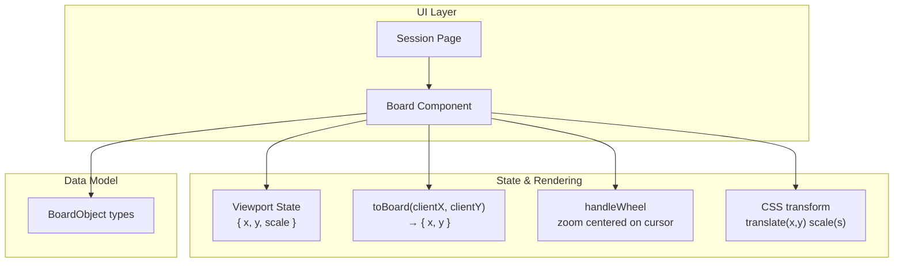
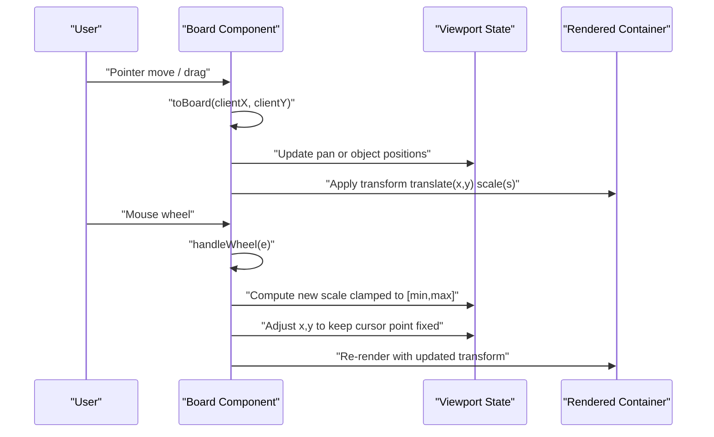
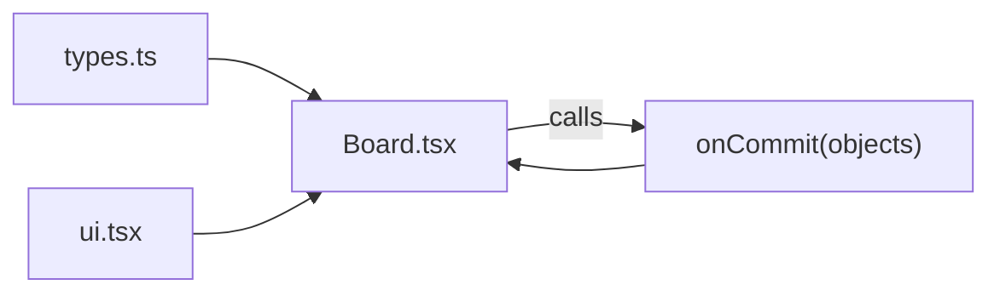
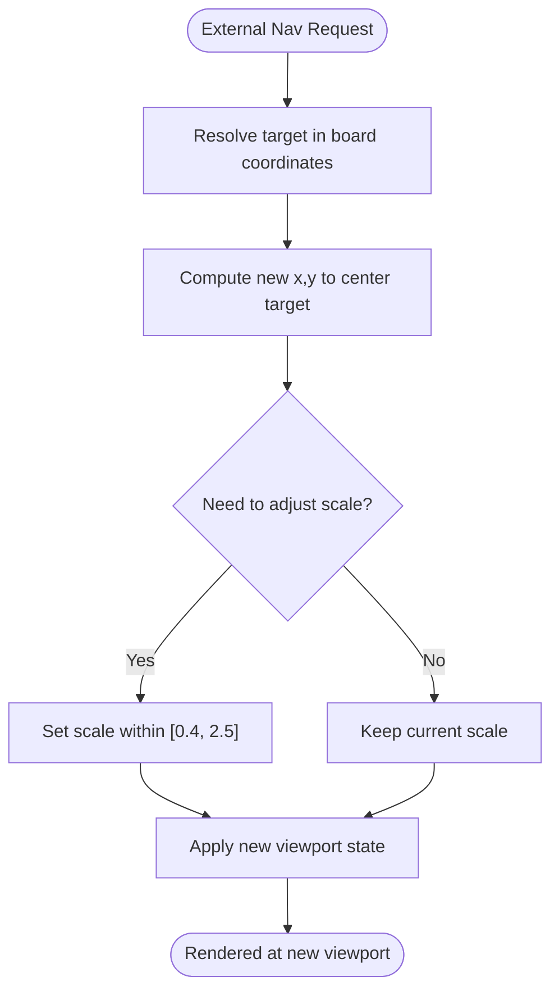

# Spatial Canvas & Viewport

<cite>
**Referenced Files in This Document**
- [Board.tsx](file://app/components/board/Board.tsx)
- [types.ts](file://app/lib/types.ts)
- [page.tsx](file://app/app/session/[id]/page.tsx)
</cite>

## Table of Contents
1. Introduction
2. Project Structure
3. Core Components
4. Architecture Overview
5. Detailed Component Analysis
6. Dependency Analysis
7. Performance Considerations
8. Troubleshooting Guide
9. Conclusion
10. Appendices

## Introduction
This document explains the spatial canvas and viewport system that powers the interactive learning board. It focuses on:
- Coordinate transformation between client (screen) coordinates and board (world) coordinates via the toBoard function
- Viewport state management for pan (x, y) and zoom (scale)
- Wheel-based zoom centered on the cursor with scale constraints
- Transform-based rendering using CSS transforms for performance
- Examples for implementing custom viewport controls and integrating with external navigation systems

## Project Structure
The viewport logic is implemented inside a single React component that owns the view state and renders the board content. The data model for board objects is defined in a shared types file. A session page composes the Board component and manages persistence and AI evaluation around it.

**Diagram sources**
- [Board.tsx:15-19](file://app/components/board/Board.tsx#L15-L19)
- [Board.tsx:60-61](file://app/components/board/Board.tsx#L60-L61)
- [Board.tsx:107-114](file://app/components/board/Board.tsx#L107-L114)
- [Board.tsx:117-128](file://app/components/board/Board.tsx#L117-L128)
- [Board.tsx:329-334](file://app/components/board/Board.tsx#L329-L334)
- [types.ts:41-57](file://app/lib/types.ts#L41-L57)

**Section sources**
- [Board.tsx:15-19](file://app/components/board/Board.tsx#L15-L19)
- [Board.tsx:60-61](file://app/components/board/Board.tsx#L60-L61)
- [types.ts:41-57](file://app/lib/types.ts#L41-L57)
- [page.tsx:1-20](file://app/app/session/[id]/page.tsx#L1-L20)

## Core Components
- Viewport state: an object containing pan offsets (x, y) and zoom level (scale). Default values are set when the component mounts.
- Coordinate conversion: toBoard converts screen coordinates into board coordinates by subtracting the container offset and current pan, then dividing by scale.
- Wheel zoom: handleWheel computes a new scale constrained between minimum and maximum bounds and adjusts pan so zoom centers on the cursor position.
- Rendering: a child container uses CSS transform translate(x, y) scale(s) to apply the viewport, enabling GPU-accelerated panning and zooming.

Key responsibilities:
- Maintain a single source of truth for viewport state
- Provide deterministic coordinate mapping for pointer events
- Apply performant CSS transforms for all visual updates
- Expose programmatic zoom helpers for external controls

**Section sources**
- [Board.tsx:15-19](file://app/components/board/Board.tsx#L15-L19)
- [Board.tsx:60-61](file://app/components/board/Board.tsx#L60-L61)
- [Board.tsx:107-114](file://app/components/board/Board.tsx#L107-L114)
- [Board.tsx:117-128](file://app/components/board/Board.tsx#L117-L128)
- [Board.tsx:329-334](file://app/components/board/Board.tsx#L329-L334)

## Architecture Overview
The Board component encapsulates all viewport behavior. Pointer events are translated to board coordinates using toBoard. Wheel events adjust zoom while keeping the point under the cursor stationary. The rendered tree applies a single transform to a container holding all board objects, minimizing layout thrashing and leveraging compositor optimizations.

**Diagram sources**
- [Board.tsx:107-114](file://app/components/board/Board.tsx#L107-L114)
- [Board.tsx:117-128](file://app/components/board/Board.tsx#L117-L128)
- [Board.tsx:329-334](file://app/components/board/Board.tsx#L329-L334)

## Detailed Component Analysis

### Coordinate Transformation: toBoard
Purpose:
- Convert client (screen) coordinates from pointer events into board (world) coordinates used for object placement and interaction.

Algorithm overview:
- Retrieve the bounding rectangle of the board container
- Subtract the container’s top-left offset and current pan (view.x, view.y)
- Divide by current scale to normalize into board units

Complexity:
- O(1) per call; constant-time arithmetic operations

Edge cases:
- Missing container reference is handled safely by defaulting offsets to zero
- Negative coordinates are supported; results can be outside visible area

Usage points:
- Pointer down/move/up for selecting, moving, resizing, drawing, erasing
- Resize handle start

**Section sources**
- [Board.tsx:107-114](file://app/components/board/Board.tsx#L107-L114)
- [Board.tsx:145-205](file://app/components/board/Board.tsx#L145-L205)
- [Board.tsx:207-248](file://app/components/board/Board.tsx#L207-L248)
- [Board.tsx:285-289](file://app/components/board/Board.tsx#L285-L289)

### Viewport State Management
State shape:
- x: horizontal pan offset in pixels
- y: vertical pan offset in pixels
- scale: zoom factor

Initialization:
- Defaults to a small positive offset and scale 1

Updates:
- Pan: during pointer drag in pan mode, update x and y based on delta movement
- Zoom: via wheel or programmatic zoomBy, clamp scale to a safe range and adjust pan to keep the cursor point stable

Constraints:
- Scale is clamped between 0.4 and 2.5

**Section sources**
- [Board.tsx:15-19](file://app/components/board/Board.tsx#L15-L19)
- [Board.tsx:60-61](file://app/components/board/Board.tsx#L60-L61)
- [Board.tsx:210-216](file://app/components/board/Board.tsx#L210-L216)
- [Board.tsx:299-301](file://app/components/board/Board.tsx#L299-L301)

### Wheel Event Handling: Zoom Centered on Cursor
Behavior:
- Determine zoom factor based on scroll direction
- Compute new scale clamped to [0.4, 2.5]
- Calculate mouse position relative to container
- Adjust pan so the point under the cursor remains visually stationary after zoom

Mathematical insight:
- Uses ratio k = newScale / oldScale
- New pan = cursorInContainer - (cursorInContainer - oldPan) * k

Performance:
- Single state update per wheel event
- No layout recalculation beyond transform application

**Section sources**
- [Board.tsx:117-128](file://app/components/board/Board.tsx#L117-L128)

### Transform-Based Rendering
Approach:
- All board objects are placed at their world coordinates (left/top equal to object x/y)
- A single parent container applies CSS transform: translate(view.x, view.y) scale(view.scale)
- This leverages the browser compositor for smooth panning and zooming

Benefits:
- Minimal reflow/repaint
- Consistent hit-testing against world coordinates via toBoard
- Simple mental model: objects live in world space; viewport moves them

**Section sources**
- [Board.tsx:329-334](file://app/components/board/Board.tsx#L329-L334)
- [Board.tsx:494-513](file://app/components/board/Board.tsx#L494-L513)

### Interaction Flow: Pointer Events and Drag Modes
Modes:
- Pan: triggered by tool, Space key, or middle-click; updates viewport pan
- Move: drags selected student-owned objects; updates object positions
- Resize: resizes selected objects with minimum size constraints
- Draw/Erase: collects points in world coordinates; creates drawing objects or removes hits

Flow summary:
- PointerDown determines mode and captures pointer if needed
- PointerMove updates state based on active mode
- PointerUp finalizes actions (e.g., creating drawings)

**Section sources**
- [Board.tsx:145-205](file://app/components/board/Board.tsx#L145-L205)
- [Board.tsx:207-248](file://app/components/board/Board.tsx#L207-L248)
- [Board.tsx:250-283](file://app/components/board/Board.tsx#L250-L283)

### Data Model Integration
Board objects include:
- Position and size (x, y, width, height)
- Type and content
- Ownership and metadata

The viewport operates independently of object semantics but relies on consistent world coordinates for all interactions.

**Section sources**
- [types.ts:41-57](file://app/lib/types.ts#L41-L57)

## Dependency Analysis
- Board.tsx depends on:
  - types.ts for BoardObject and related types
  - UI components for feedback labels and styling
- page.tsx composes Board and provides:
  - Objects list and commit callback for persistence
  - Tool selection and read-only modes
  - Undo/redo and autosave around board changes

Coupling:
- Board owns its viewport state; no external dependency for pan/zoom
- External integration points:
  - onCommit to persist changes
  - Programmatic zoomBy for custom controls
  - Tool prop and readOnly flag for UX control

Potential circular dependencies:
- None observed; Board is self-contained regarding viewport logic

External integrations:
- Next.js router and API helpers are used in the session page, not within the Board component

**Diagram sources**
- [Board.tsx:4-5](file://app/components/board/Board.tsx#L4-L5)
- [types.ts:41-57](file://app/lib/types.ts#L41-L57)
- [page.tsx:1-20](file://app/app/session/[id]/page.tsx#L1-L20)

**Section sources**
- [Board.tsx:4-5](file://app/components/board/Board.tsx#L4-L5)
- [types.ts:41-57](file://app/lib/types.ts#L41-L57)
- [page.tsx:1-20](file://app/app/session/[id]/page.tsx#L1-L20)

## Performance Considerations
- Use of CSS transform for viewport ensures GPU-composited updates, avoiding expensive layout recalculations
- Single transform applied to a container minimizes style churn
- toBoard performs constant-time math per event
- Clamping scale prevents extreme zoom levels that could degrade performance or usability
- Pointer capture reduces event handling overhead during drags

[No sources needed since this section provides general guidance]

## Troubleshooting Guide
Common issues and resolutions:
- Zoom does not center on cursor:
  - Ensure wheel handler computes new pan using the formula that keeps the cursor point fixed
  - Verify container bounding rect is available before computing offsets
- Panning feels off after zoom:
  - Confirm pan updates use the origin stored at drag start
  - Check that toBoard divides by current scale consistently
- Drawing misalignment:
  - Validate that all drawing points are recorded in board coordinates via toBoard
  - Ensure min sizes for drawings are enforced to avoid degenerate shapes
- Scale constraints not respected:
  - Confirm both wheel zoom and programmatic zoomBy clamp scale to [0.4, 2.5]

**Section sources**
- [Board.tsx:117-128](file://app/components/board/Board.tsx#L117-L128)
- [Board.tsx:210-216](file://app/components/board/Board.tsx#L210-L216)
- [Board.tsx:250-283](file://app/components/board/Board.tsx#L250-L283)
- [Board.tsx:299-301](file://app/components/board/Board.tsx#L299-L301)

## Conclusion
The viewport system provides a robust, performant foundation for an interactive spatial canvas. By separating world coordinates from screen coordinates through toBoard, constraining zoom, and applying a single CSS transform, it achieves smooth panning and zooming with minimal overhead. The design exposes clear extension points for custom controls and external navigation integration.

[No sources needed since this section summarizes without analyzing specific files]

## Appendices

### Implementing Custom Viewport Controls
You can build external controls that drive the same viewport state:
- Zoom buttons:
  - Call the provided zoomBy helper with factors like 1.2 (in) or 1/1.2 (out)
  - Scale will be clamped to [0.4, 2.5] automatically
- Reset view:
  - Set viewport to initial defaults (x=40, y=20, scale=1)
- Keyboard shortcuts:
  - Bind keys to zoomBy calls or reset view

Integration example outline:
- Place your controls outside the Board component
- Pass callbacks or props to trigger zoom/reset behaviors exposed by the Board
- Keep UI synchronized by reading current scale percentage from the Board’s state if needed

**Section sources**
- [Board.tsx:299-301](file://app/components/board/Board.tsx#L299-L301)
- [Board.tsx:366-403](file://app/components/board/Board.tsx#L366-L403)

### Integrating with External Navigation Systems
To synchronize external navigation with the board:
- Map external “go to” actions to viewport changes:
  - Compute target board coordinates for the item to focus
  - Adjust x, y so the target appears centered in the viewport
  - Optionally animate scale to highlight the region
- Use toBoard to convert external coordinates if they are provided in screen space
- Debounce rapid navigation updates to avoid excessive re-renders

Conceptual flow:

[No sources needed since this diagram shows conceptual workflow, not actual code structure]