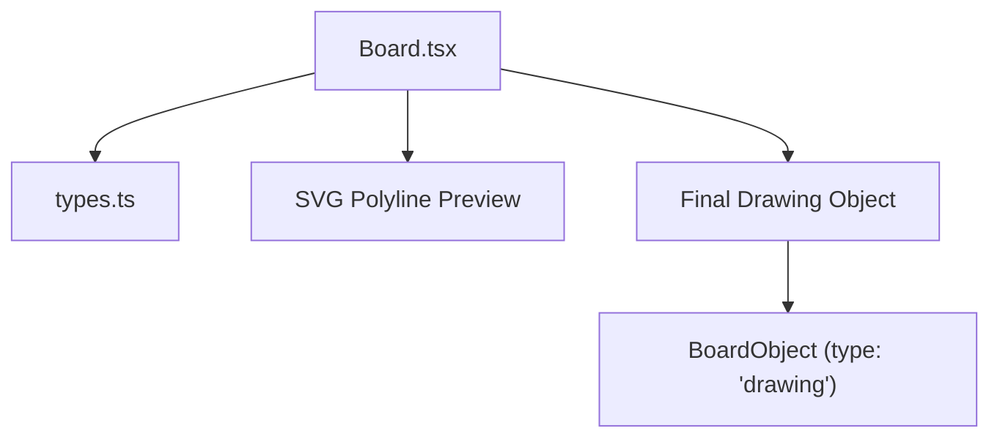
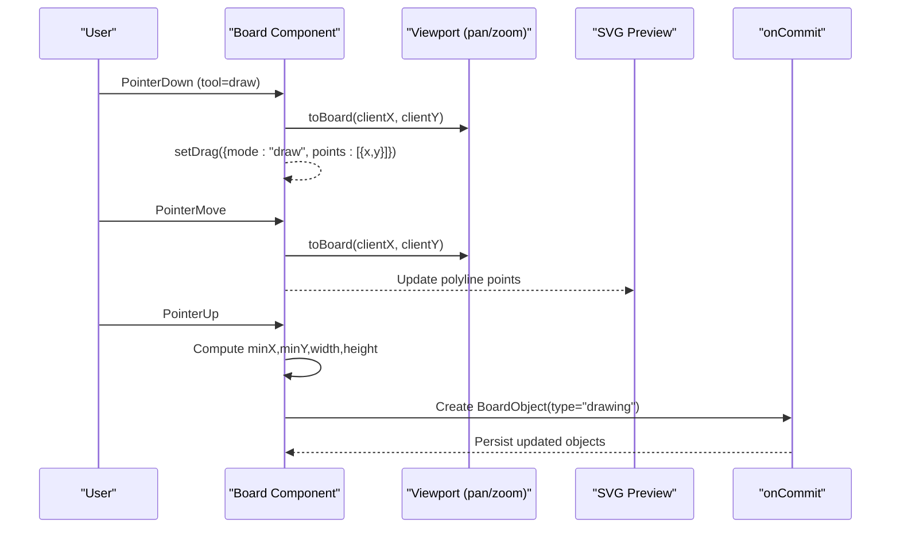
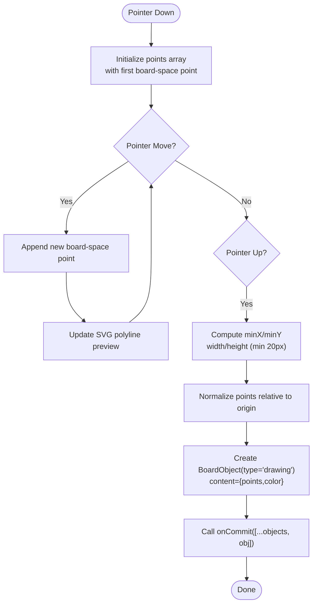
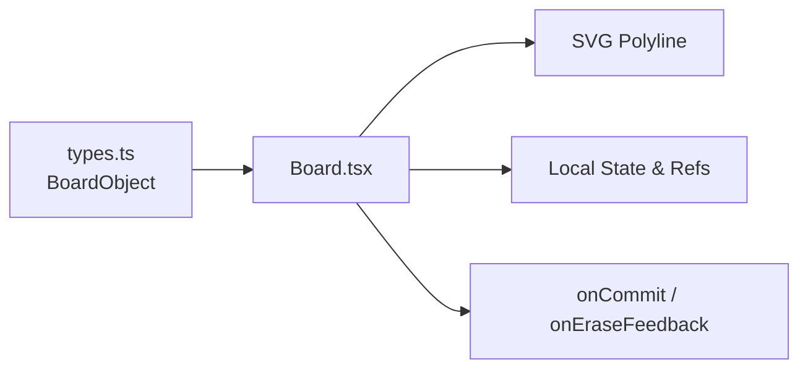

# Drawing Tool

<cite>
**Referenced Files in This Document**
- [Board.tsx](file://app/components/board/Board.tsx)
- [types.ts](file://app/lib/types.ts)
</cite>

## Table of Contents
1. [Introduction](#introduction)
2. [Project Structure](#project-structure)
3. [Core Components](#core-components)
4. [Architecture Overview](#architecture-overview)
5. [Detailed Component Analysis](#detailed-component-analysis)
6. [Dependency Analysis](#dependency-analysis)
7. [Performance Considerations](#performance-considerations)
8. [Troubleshooting Guide](#troubleshooting-guide)
9. [Conclusion](#conclusion)

## Introduction
This document explains the drawing tool implemented in the interactive board component. It covers how pointer events capture stroke points, how real-time previews are rendered using SVG polyline elements, and how a final drawing object is created with bounding box calculation. It also documents coordinate transformation from client space to board space, stroke point array management, color customization (default blue #3b82f6), the drawing object structure including the points array and minimum size constraints (20px), and performance considerations for large drawings and memory management for stroke point arrays.

## Project Structure
The drawing functionality is implemented within the Board component and uses shared types for board objects. The key files involved are:
- Board component that handles pointer events, view transforms, preview rendering, and final object creation
- Shared types that define the board object model used by the drawing tool

**Diagram sources**
- [Board.tsx:145-283](file://app/components/board/Board.tsx#L145-L283)
- [Board.tsx:352-363](file://app/components/board/Board.tsx#L352-L363)
- [Board.tsx:433-454](file://app/components/board/Board.tsx#L433-L454)
- [types.ts:41-57](file://app/lib/types.ts#L41-L57)

**Section sources**
- [Board.tsx:145-283](file://app/components/board/Board.tsx#L145-L283)
- [Board.tsx:352-363](file://app/components/board/Board.tsx#L352-L363)
- [Board.tsx:433-454](file://app/components/board/Board.tsx#L433-L454)
- [types.ts:41-57](file://app/lib/types.ts#L41-L57)

## Core Components
- Pointer event handling: Captures start, move, and end events to build stroke points during drawing
- Coordinate transformation: Converts client coordinates to board coordinates accounting for pan and zoom
- Real-time preview: Renders an SVG polyline overlay while drawing
- Final object creation: Computes bounding box, stores normalized points, and persists via onCommit
- Rendering of saved drawings: Parses stored content and renders as SVG polyline

**Section sources**
- [Board.tsx:107-114](file://app/components/board/Board.tsx#L107-L114)
- [Board.tsx:145-283](file://app/components/board/Board.tsx#L145-L283)
- [Board.tsx:352-363](file://app/components/board/Board.tsx#L352-L363)
- [Board.tsx:433-454](file://app/components/board/Board.tsx#L433-L454)

## Architecture Overview
The drawing tool follows a clear event-driven flow:
- On pointer down in draw mode, initialize a stroke with the first point
- On pointer move, append new points and update the SVG polyline preview
- On pointer up, compute bounding box, normalize points, create a BoardObject of type "drawing", and commit it

**Diagram sources**
- [Board.tsx:107-114](file://app/components/board/Board.tsx#L107-L114)
- [Board.tsx:145-183](file://app/components/board/Board.tsx#L145-L183)
- [Board.tsx:207-248](file://app/components/board/Board.tsx#L207-L248)
- [Board.tsx:250-283](file://app/components/board/Board.tsx#L250-L283)
- [Board.tsx:352-363](file://app/components/board/Board.tsx#L352-L363)

## Detailed Component Analysis

### Stroke Point Capture During Pointer Events
- Pointer down initiates drawing mode and captures the first board-space point
- Pointer move appends subsequent points to the stroke array
- Pointer up finalizes the stroke if more than one point exists

Key behaviors:
- Uses a drag state to track drawing mode and current points
- Reuses the same drag state for erasing when erase tool is active
- Prevents interference with text editing by ignoring pointer events while editing

**Section sources**
- [Board.tsx:145-183](file://app/components/board/Board.tsx#L145-L183)
- [Board.tsx:207-248](file://app/components/board/Board.tsx#L207-L248)
- [Board.tsx:250-283](file://app/components/board/Board.tsx#L250-L283)

### Real-Time Preview Rendering Using SVG Polyline Elements
- While drawing, an SVG overlay renders a polyline with the current points
- The preview uses default stroke color #3b82f6 and consistent stroke styling
- The preview is non-interactive and positioned over the transformed board area

Rendering details:
- Points are converted to a string format suitable for SVG polyline
- Stroke width and line joins are configured for smooth visuals

**Section sources**
- [Board.tsx:352-363](file://app/components/board/Board.tsx#L352-L363)

### Final Drawing Object Creation With Bounding Box Calculation
On pointer up:
- Calculates minX and minY across all stroke points
- Computes width and height, enforcing a minimum of 20px
- Normalizes points relative to the bounding box origin
- Creates a BoardObject with type "drawing" and stores points and color in content JSON
- Commits the new object to the board state

Minimum size constraint:
- Both width and height are clamped to at least 20px to ensure visible drawings

Color customization:
- Default color is #3b82f6
- Stored color can be read back when rendering saved drawings

**Section sources**
- [Board.tsx:250-283](file://app/components/board/Board.tsx#L250-L283)
- [Board.tsx:433-454](file://app/components/board/Board.tsx#L433-L454)

### Coordinate Transformation From Client Space To Board Space
- The toBoard function converts client coordinates to board coordinates
- Accounts for container offset and viewport transform (pan x/y and scale)
- Used consistently for drawing, moving, resizing, and hit testing

Formula behavior:
- Subtracts container offsets and viewport translation
- Divides by current scale to map into board space

**Section sources**
- [Board.tsx:107-114](file://app/components/board/Board.tsx#L107-L114)

### Stroke Point Array Management
- Maintained in drag state during a single drawing session
- Appended on each pointer move
- Cleared on pointer up after creating the final object
- Reused as a flag for erasing mode when needed

Memory considerations:
- The array grows with each move event; consider strategies for very long strokes (see Performance section)

**Section sources**
- [Board.tsx:181-183](file://app/components/board/Board.tsx#L181-L183)
- [Board.tsx:241-247](file://app/components/board/Board.tsx#L241-L247)
- [Board.tsx:250-283](file://app/components/board/Board.tsx#L250-L283)

### Color Customization Options
- Default stroke color is #3b82f6 for both preview and final drawing
- Saved drawings store color in content JSON and render using that color
- No UI for changing color is present in this component; extension points exist via content parsing

**Section sources**
- [Board.tsx:270-273](file://app/components/board/Board.tsx#L270-L273)
- [Board.tsx:352-363](file://app/components/board/Board.tsx#L352-L363)
- [Board.tsx:433-454](file://app/components/board/Board.tsx#L433-L454)

### Drawing Object Structure
A drawing object is a BoardObject with:
- type: "drawing"
- x, y: top-left corner of bounding box
- width, height: dimensions with minimum 20px enforced
- content: JSON string containing:
  - points: array of {x, y} normalized to bounding box origin
  - color: string color value (default #3b82f6)
- owner: "student"
- timestamps and other standard fields per BoardObject

Rendering:
- Parsed content provides points and color
- Renders an SVG polyline within the object’s bounds

**Section sources**
- [Board.tsx:250-283](file://app/components/board/Board.tsx#L250-L283)
- [Board.tsx:433-454](file://app/components/board/Board.tsx#L433-L454)
- [types.ts:41-57](file://app/lib/types.ts#L41-L57)

### Flowchart: Drawing Stroke Lifecycle

**Diagram sources**
- [Board.tsx:145-183](file://app/components/board/Board.tsx#L145-L183)
- [Board.tsx:207-248](file://app/components/board/Board.tsx#L207-L248)
- [Board.tsx:250-283](file://app/components/board/Board.tsx#L250-L283)

## Dependency Analysis
- Board.tsx depends on types.ts for BoardObject definition
- Board.tsx manages internal state (drag, view, selection) and side effects (onCommit)
- Rendering relies on React and SVG primitives for preview and final display

**Diagram sources**
- [types.ts:41-57](file://app/lib/types.ts#L41-L57)
- [Board.tsx:145-283](file://app/components/board/Board.tsx#L145-L283)
- [Board.tsx:352-363](file://app/components/board/Board.tsx#L352-L363)

**Section sources**
- [types.ts:41-57](file://app/lib/types.ts#L41-L57)
- [Board.tsx:145-283](file://app/components/board/Board.tsx#L145-L283)

## Performance Considerations
- Large stroke point arrays: Each pointer move appends a point; for very long strokes, consider downsampling or throttling to reduce memory and re-render costs
- Memory management: Clearing the points array on pointer up prevents leaks; avoid retaining references beyond the drawing session
- Rendering efficiency: The preview uses a lightweight SVG overlay; for extremely dense paths, consider batching updates or reducing point frequency
- Bounding box normalization: Storing normalized points reduces storage size and simplifies rendering
- Minimum size enforcement: Ensures small gestures still produce visible objects without excessive overhead

[No sources needed since this section provides general guidance]

## Troubleshooting Guide
- Drawing not starting: Ensure tool is set to "draw" and not in editing mode; verify pointer events are captured
- Preview not updating: Confirm pointer move events are firing and toBoard returns valid coordinates
- Final object not created: Check that more than one point was recorded; verify onCommit is called with the new object
- Erase not working: Verify eraseAt logic targets student-owned objects and that coordinates fall within object bounds
- Color mismatch: Confirm content JSON includes color; default is #3b82f6 if missing

**Section sources**
- [Board.tsx:145-183](file://app/components/board/Board.tsx#L145-L183)
- [Board.tsx:207-248](file://app/components/board/Board.tsx#L207-L248)
- [Board.tsx:250-283](file://app/components/board/Board.tsx#L250-L283)
- [Board.tsx:130-143](file://app/components/board/Board.tsx#L130-L143)

## Conclusion
The drawing tool integrates seamlessly with the interactive board, providing intuitive stroke capture, real-time SVG preview, and robust final object creation with normalized points and bounded dimensions. The implementation leverages clear coordinate transformations, efficient state management, and consistent styling with a default blue color. For optimal performance with large drawings, consider point sampling and update throttling to balance responsiveness and memory usage.

[No sources needed since this section summarizes without analyzing specific files]