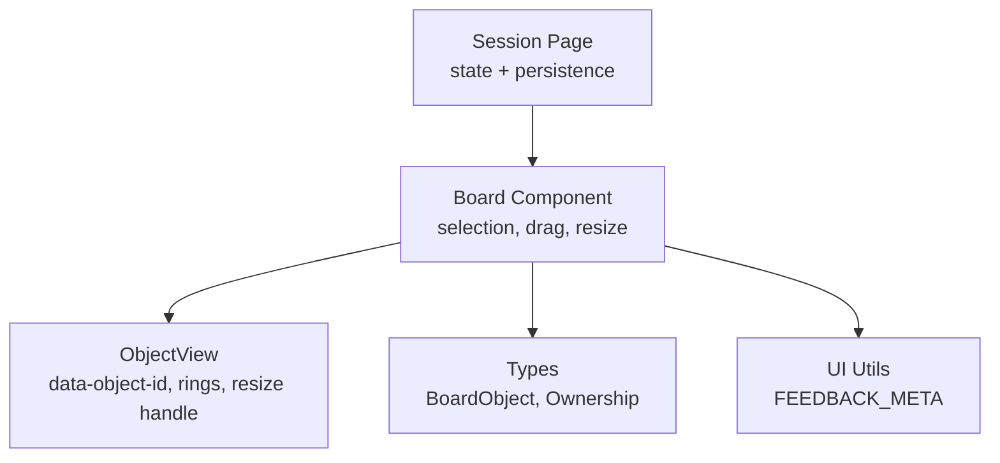
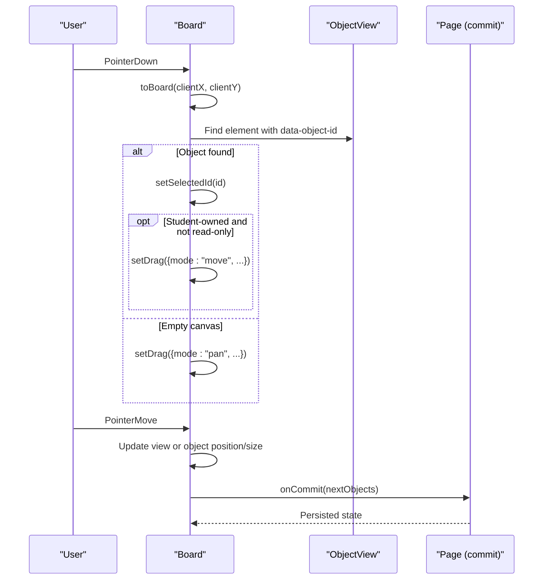
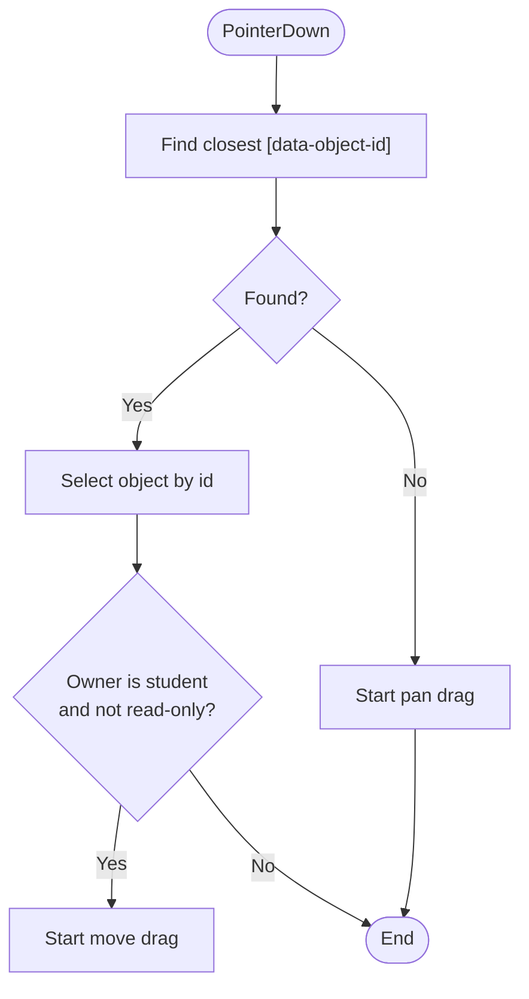
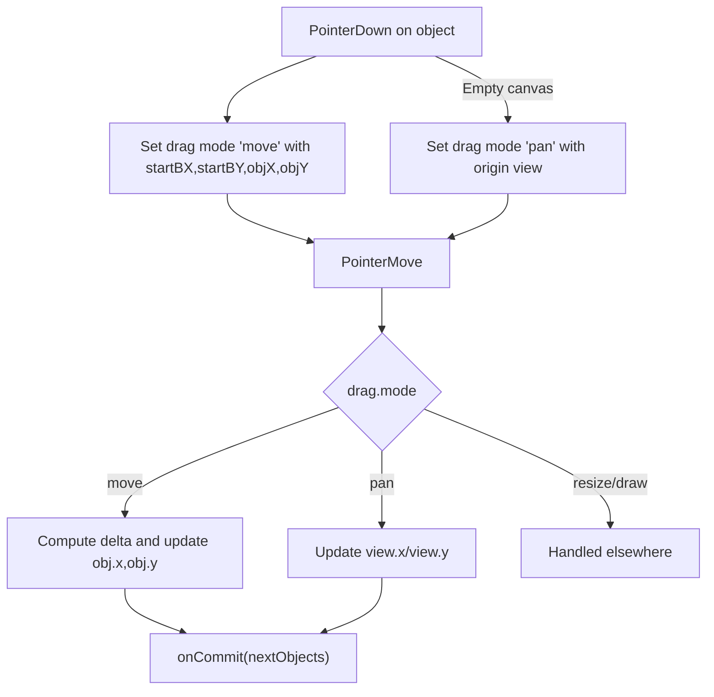
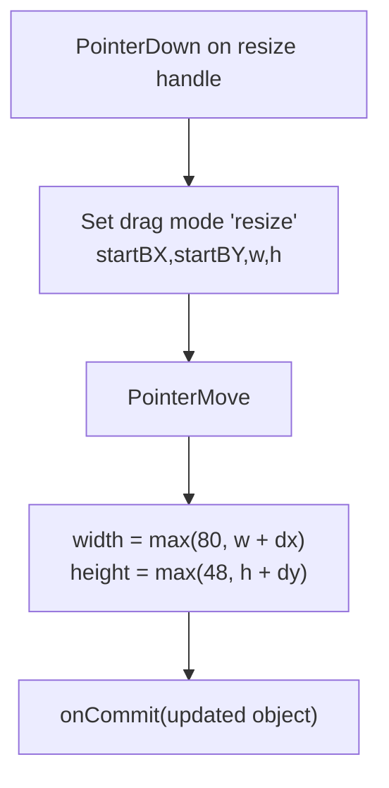
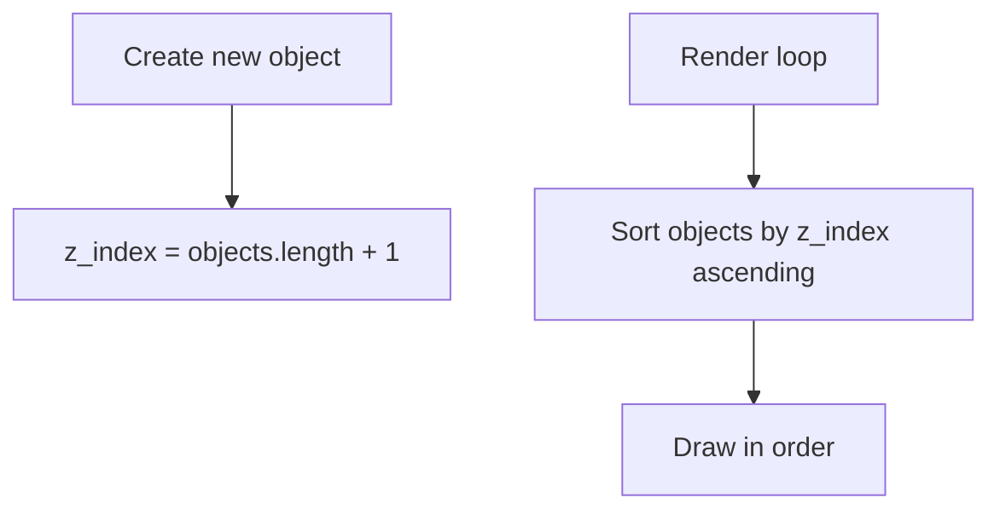
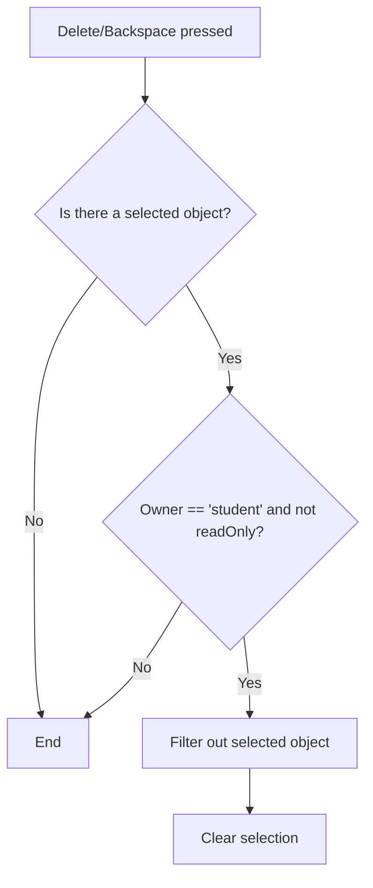
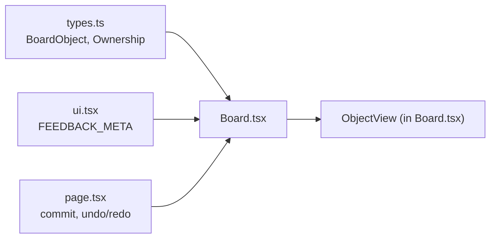

# Selection & Object Manipulation

<cite>
**Referenced Files in This Document**
- [Board.tsx](file://stepwise ai/app/components/board/Board.tsx)
- [types.ts](file://stepwise ai/app/lib/types.ts)
- [ui.tsx](file://stepwise ai/app/components/ui.tsx)
- [page.tsx](file://stepwise ai/app/app/session/[id]/page.tsx)
</cite>

## Table of Contents
1. [Introduction](#introduction)
2. [Project Structure](#project-structure)
3. [Core Components](#core-components)
4. [Architecture Overview](#architecture-overview)
5. [Detailed Component Analysis](#detailed-component-analysis)
6. [Dependency Analysis](#dependency-analysis)
7. [Performance Considerations](#performance-considerations)
8. [Troubleshooting Guide](#troubleshooting-guide)
9. [Conclusion](#conclusion)

## Introduction
This document explains the selection and object manipulation system on the interactive board. It covers:
- Object hit detection using data-object-id attributes
- Visual selection indicators with ring styling and feedback highlights
- Multi-object selection support (current state and extension points)
- Drag-and-drop movement with coordinate tracking
- Resize handles with minimum size constraints
- Z-index layering for object stacking
- Delete functionality via keyboard shortcuts and ownership rules
- Examples for implementing custom object manipulation behaviors
- The relationship between selection state and object ownership

## Project Structure
The selection and manipulation logic is implemented primarily in the Board component, which renders objects, handles pointer events, manages drag states, and applies visual selection and resize behavior. Types define the BoardObject model including ownership and z-index. UI utilities provide feedback metadata used to render highlight badges. The session page integrates the Board and persists changes.



**Diagram sources**
- [page.tsx:118-130](file://stepwise ai/app/app/session/[id]/page.tsx#L118-L130)
- [Board.tsx:44-105](file://stepwise ai/app/components/board/Board.tsx#L44-L105)
- [Board.tsx:408-539](file://stepwise ai/app/components/board/Board.tsx#L408-L539)
- [types.ts:41-57](file://stepwise ai/app/lib/types.ts#L41-L57)
- [ui.tsx:178-186](file://stepwise ai/app/components/ui.tsx#L178-L186)

**Section sources**
- [Board.tsx:44-105](file://stepwise ai/app/components/board/Board.tsx#L44-L105)
- [types.ts:41-57](file://stepwise ai/app/lib/types.ts#L41-L57)
- [ui.tsx:178-186](file://stepwise ai/app/components/ui.tsx#L178-L186)
- [page.tsx:118-130](file://stepwise ai/app/app/session/[id]/page.tsx#L118-L130)

## Core Components
- Board: Central controller for tool mode, viewport pan/zoom, pointer interactions, selection state, drag modes (pan, move, resize, draw), and commit pipeline.
- ObjectView: Renders each object with data-object-id, selection ring, optional feedback badge, and a resize handle when selected and editable.
- Types: Define BoardObject fields including owner, z_index, dimensions, and content.
- UI: Provides FEEDBACK_META used to render contextual labels next to highlighted objects.

Key responsibilities:
- Hit detection uses data-object-id to identify the clicked object.
- Selection state is stored as a single selectedId; multi-selection is not currently active but can be extended.
- Dragging moves student-owned objects; resizing enforces minimum width and height.
- Keyboard shortcuts allow deletion of selected student-owned objects and deselection.

**Section sources**
- [Board.tsx:145-205](file://stepwise ai/app/components/board/Board.tsx#L145-L205)
- [Board.tsx:207-283](file://stepwise ai/app/components/board/Board.tsx#L207-L283)
- [Board.tsx:285-297](file://stepwise ai/app/components/board/Board.tsx#L285-L297)
- [Board.tsx:408-539](file://stepwise ai/app/components/board/Board.tsx#L408-L539)
- [types.ts:41-57](file://stepwise ai/app/lib/types.ts#L41-L57)

## Architecture Overview
The Board listens to pointer events and translates client coordinates to board coordinates using the current viewport transform. It determines whether the user is panning, moving an object, resizing, drawing, or erasing based on tool mode and event target. Selection is applied by matching data-object-id. Visual feedback includes a selection ring and optional highlight ring from AI feedback. Deletion is handled via keyboard shortcuts with ownership checks.



**Diagram sources**
- [Board.tsx:107-128](file://stepwise ai/app/components/board/Board.tsx#L107-L128)
- [Board.tsx:145-205](file://stepwise ai/app/components/board/Board.tsx#L145-L205)
- [Board.tsx:207-248](file://stepwise ai/app/components/board/Board.tsx#L207-L248)
- [page.tsx:118-130](file://stepwise ai/app/app/session/[id]/page.tsx#L118-L130)

## Detailed Component Analysis

### Object Hit Detection with data-object-id
- When the select tool is active, pointer down traverses up to find the nearest element with data-object-id.
- If found, the corresponding object is selected; if it belongs to the student and editing is allowed, a move drag begins immediately.
- If no object is found, the canvas pans.



**Diagram sources**
- [Board.tsx:190-205](file://stepwise ai/app/components/board/Board.tsx#L190-L205)

**Section sources**
- [Board.tsx:190-205](file://stepwise ai/app/components/board/Board.tsx#L190-L205)

### Visual Selection Indicators and Feedback Highlights
- Selected objects receive a selection ring class when selected and not read-only.
- AI feedback highlights apply additional ring styles mapped from feedback labels to Tailwind ring classes.
- A small badge displays the feedback icon and label near the object.

```mermaid
classDiagram
class Board {
+selectedId : string?
+highlights : Record<string, FeedbackLabel>
}
class ObjectView {
+obj : BoardObject
+selected : boolean
+highlight : FeedbackLabel?
}
class UI {
+FEEDBACK_META : Record<string, {icon,label}>
}
Board --> ObjectView : "renders"
ObjectView --> UI : "uses FEEDBACK_META"
```

**Diagram sources**
- [Board.tsx:28-36](file://stepwise ai/app/components/board/Board.tsx#L28-L36)
- [Board.tsx:494-539](file://stepwise ai/app/components/board/Board.tsx#L494-L539)
- [ui.tsx:178-186](file://stepwise ai/app/components/ui.tsx#L178-L186)

**Section sources**
- [Board.tsx:28-36](file://stepwise ai/app/components/board/Board.tsx#L28-L36)
- [Board.tsx:494-539](file://stepwise ai/app/components/board/Board.tsx#L494-L539)
- [ui.tsx:178-186](file://stepwise ai/app/components/ui.tsx#L178-L186)

### Drag-and-Drop Movement with Coordinate Tracking
- Pointer move updates either the viewport (pan) or the object’s x/y (move).
- Coordinates are converted from client space to board space using toBoard, accounting for viewport translation and scale.
- For move mode, the new position is computed relative to the initial click offset and previous object position.



**Diagram sources**
- [Board.tsx:107-128](file://stepwise ai/app/components/board/Board.tsx#L107-L128)
- [Board.tsx:197-205](file://stepwise ai/app/components/board/Board.tsx#L197-L205)
- [Board.tsx:207-248](file://stepwise ai/app/components/board/Board.tsx#L207-L248)

**Section sources**
- [Board.tsx:107-128](file://stepwise ai/app/components/board/Board.tsx#L107-L128)
- [Board.tsx:197-205](file://stepwise ai/app/components/board/Board.tsx#L197-L205)
- [Board.tsx:207-248](file://stepwise ai/app/components/board/Board.tsx#L207-L248)

### Resize Handles and Minimum Size Constraints
- When an object is selected and editable, a small resize handle appears at the bottom-right corner.
- Starting a resize captures the initial board coordinates and original width/height.
- During resize, width and height are clamped to minimums: width >= 80px, height >= 48px.



**Diagram sources**
- [Board.tsx:285-289](file://stepwise ai/app/components/board/Board.tsx#L285-L289)
- [Board.tsx:228-240](file://stepwise ai/app/components/board/Board.tsx#L228-L240)
- [Board.tsx:530-536](file://stepwise ai/app/components/board/Board.tsx#L530-L536)

**Section sources**
- [Board.tsx:228-240](file://stepwise ai/app/components/board/Board.tsx#L228-L240)
- [Board.tsx:285-289](file://stepwise ai/app/components/board/Board.tsx#L285-L289)
- [Board.tsx:530-536](file://stepwise ai/app/components/board/Board.tsx#L530-L536)

### Z-Index Management for Layering
- Objects are sorted by z_index before rendering to ensure correct stacking order.
- New objects created via text or drawing tools are assigned a z_index that increments over existing objects, placing them on top.



**Diagram sources**
- [Board.tsx:155-179](file://stepwise ai/app/components/board/Board.tsx#L155-L179)
- [Board.tsx:259-280](file://stepwise ai/app/components/board/Board.tsx#L259-L280)
- [Board.tsx:314-351](file://stepwise ai/app/components/board/Board.tsx#L314-L351)

**Section sources**
- [Board.tsx:155-179](file://stepwise ai/app/components/board/Board.tsx#L155-L179)
- [Board.tsx:259-280](file://stepwise ai/app/components/board/Board.tsx#L259-L280)
- [Board.tsx:314-351](file://stepwise ai/app/components/board/Board.tsx#L314-L351)

### Delete Functionality and Ownership Rules
- Keyboard shortcuts: pressing Delete or Backspace removes the currently selected object if it belongs to the student and the board is not read-only.
- Pressing Escape clears selection and exits editing mode.
- Erase tool deletes any student-owned object under the cursor without needing selection.



**Diagram sources**
- [Board.tsx:74-105](file://stepwise ai/app/components/board/Board.tsx#L74-L105)

**Section sources**
- [Board.tsx:74-105](file://stepwise ai/app/components/board/Board.tsx#L74-L105)

### Multi-Object Selection Support
- Current implementation tracks a single selectedId; multi-selection is not active.
- Extension points:
  - Maintain a Set of selectedIds instead of a single id.
  - Add modifier key handling (e.g., Shift/Ctrl) to toggle selection.
  - Update hit detection to support box selection and bulk operations.
  - Adjust delete behavior to remove all selected objects.

[No sources needed since this section proposes extensions beyond current code]

### Relationship Between Selection State and Object Ownership
- Only student-owned objects can be moved, resized, or deleted via keyboard shortcuts.
- AI/system-owned objects are rendered differently and cannot be edited unless explicitly allowed by props.
- Read-only mode disables interaction regardless of ownership.

**Section sources**
- [Board.tsx:197-199](file://stepwise ai/app/components/board/Board.tsx#L197-L199)
- [Board.tsx:84-90](file://stepwise ai/app/components/board/Board.tsx#L84-L90)
- [Board.tsx:336-351](file://stepwise ai/app/components/board/Board.tsx#L336-L351)
- [types.ts:39-57](file://stepwise ai/app/lib/types.ts#L39-L57)

## Dependency Analysis
- Board depends on types for BoardObject structure and on ui for FEEDBACK_META.
- Session page provides commit callbacks and undo/redo history, persisting changes to the server.
- ObjectView depends on Board-provided props and renders DOM attributes/data-object-id for hit detection.



**Diagram sources**
- [types.ts:41-57](file://stepwise ai/app/lib/types.ts#L41-L57)
- [ui.tsx:178-186](file://stepwise ai/app/components/ui.tsx#L178-L186)
- [Board.tsx:44-105](file://stepwise ai/app/components/board/Board.tsx#L44-L105)
- [page.tsx:118-130](file://stepwise ai/app/app/session/[id]/page.tsx#L118-L130)

**Section sources**
- [types.ts:41-57](file://stepwise ai/app/lib/types.ts#L41-L57)
- [ui.tsx:178-186](file://stepwise ai/app/components/ui.tsx#L178-L186)
- [Board.tsx:44-105](file://stepwise ai/app/components/board/Board.tsx#L44-L105)
- [page.tsx:118-130](file://stepwise ai/app/app/session/[id]/page.tsx#L118-L130)

## Performance Considerations
- Sorting objects by z_index on every render ensures correct layering but may be costly with large numbers of objects. Consider memoization or incremental updates if performance degrades.
- Using refs for mutable state (objectsRef, dragRef, viewRef) avoids stale closures during pointer events and reduces re-renders.
- Debounced autosave prevents excessive network requests while preserving responsiveness.

[No sources needed since this section provides general guidance]

## Troubleshooting Guide
- Selection does not trigger:
  - Ensure elements have data-object-id and are within the board root.
  - Verify tool is set to "select" and not in edit mode.
- Delete shortcut has no effect:
  - Confirm the selected object’s owner is "student" and the board is not read-only.
- Resize handle not visible:
  - The object must be selected and not read-only; check props passed to ObjectView.
- Dragging moves the wrong object:
  - Check that toBoard correctly accounts for viewport transform and that start offsets are captured properly.

**Section sources**
- [Board.tsx:74-105](file://stepwise ai/app/components/board/Board.tsx#L74-L105)
- [Board.tsx:190-205](file://stepwise ai/app/components/board/Board.tsx#L190-L205)
- [Board.tsx:285-289](file://stepwise ai/app/components/board/Board.tsx#L285-L289)
- [Board.tsx:107-128](file://stepwise ai/app/components/board/Board.tsx#L107-L128)

## Conclusion
The board implements a robust selection and manipulation system centered around data-object-id hit detection, clear visual feedback via rings and badges, and safe editing constrained by object ownership. Drag-and-drop movement and resizing enforce sensible constraints and maintain consistent layering through z-index. While multi-selection is not currently active, the architecture provides clear extension points to add advanced selection behaviors. Keyboard shortcuts streamline common actions like deletion and deselection, improving usability.