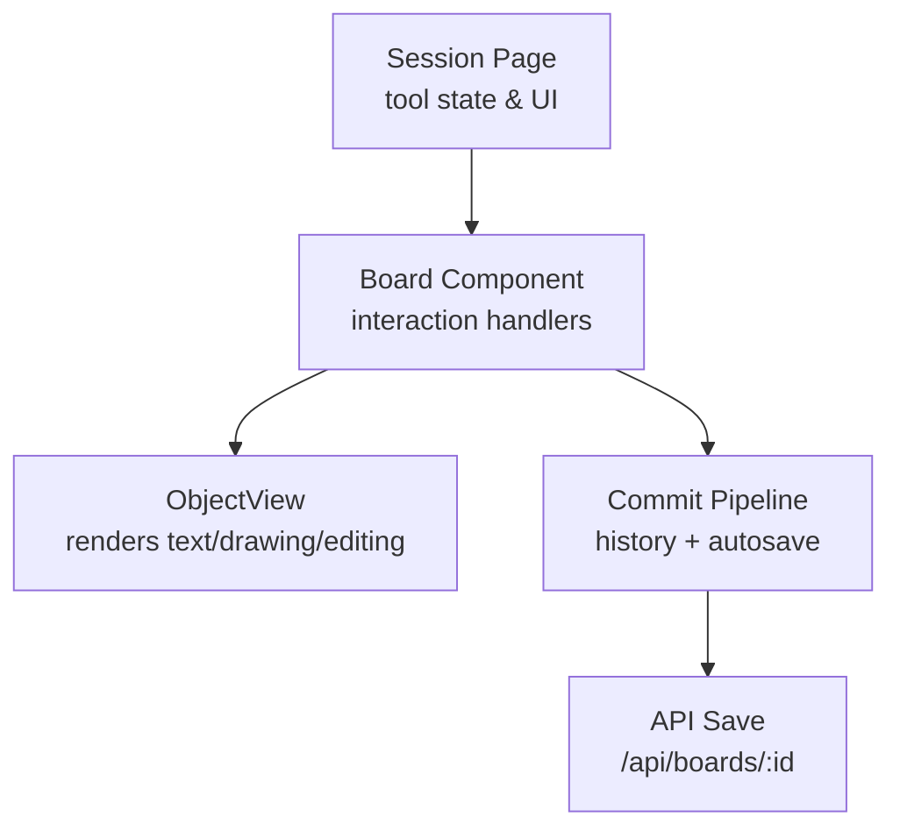
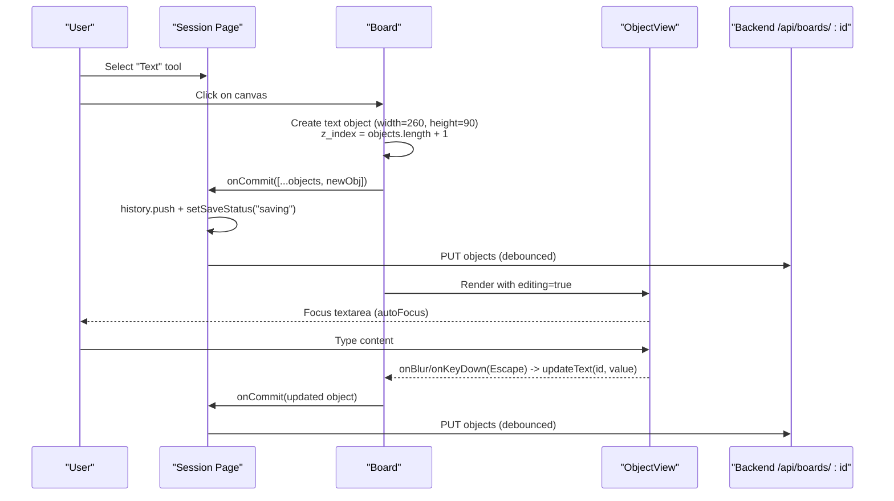
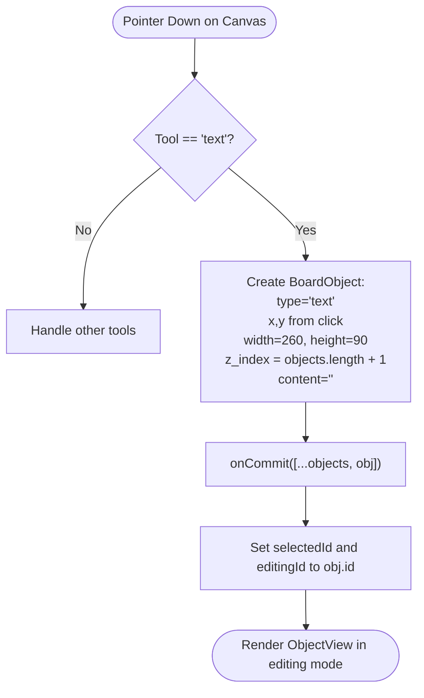
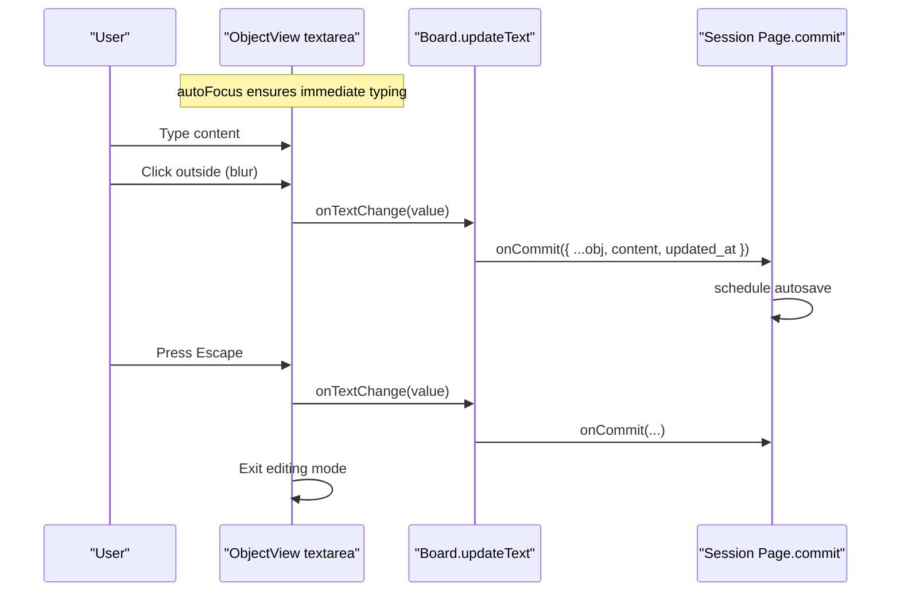
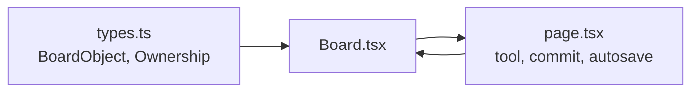

# Text Tool

<cite>
**Referenced Files in This Document**
- [Board.tsx](file://stepwise ai/app/components/board/Board.tsx)
- [types.ts](file://stepwise ai/app/lib/types.ts)
- [page.tsx](file://stepwise ai/app/app/session/[id]/page.tsx)
</cite>

## Table of Contents
1. [Introduction](#introduction)
2. [Project Structure](#project-structure)
3. [Core Components](#core-components)
4. [Architecture Overview](#architecture-overview)
5. [Detailed Component Analysis](#detailed-component-analysis)
6. [Dependency Analysis](#dependency-analysis)
7. [Performance Considerations](#performance-considerations)
8. [Troubleshooting Guide](#troubleshooting-guide)
9. [Conclusion](#conclusion)

## Introduction
This document explains the text tool implementation used on the interactive learning board. It covers how a user creates text objects by clicking, how objects are sized and styled by default, how inline editing works with focus management and persistence, and how keyboard shortcuts integrate with editing and selection. It also includes examples of object properties, content updates, and accessibility considerations for screen readers.

## Project Structure
The text tool is implemented within a shared Board component that renders different object types (text, drawing, etc.) and handles interactions like click-to-create, drag/move, resize, pan, and edit. The session page wires up the Board to the application state, including undo/redo, autosave, and tool selection.

**Diagram sources**
- [page.tsx:306-399](file://stepwise ai/app/app/session/[id]/page.tsx#L306-L399)
- [Board.tsx:145-180](file://stepwise ai/app/components/board/Board.tsx#L145-L180)
- [Board.tsx:291-297](file://stepwise ai/app/components/board/Board.tsx#L291-L297)
- [page.tsx:99-130](file://stepwise ai/app/app/session/[id]/page.tsx#L99-L130)

**Section sources**
- [Board.tsx:1-11](file://stepwise ai/app/components/board/Board.tsx#L1-L11)
- [page.tsx:306-399](file://stepwise ai/app/app/session/[id]/page.tsx#L306-L399)

## Core Components
- Board: Manages tools, viewport, selection, editing state, pointer events, and rendering of objects. It creates text objects on click when the text tool is active and opens inline editing immediately after creation.
- ObjectView: Renders each object. For text-like objects it shows either a static view or an editable textarea during editing. It manages focus, blur persistence, and Escape handling.
- Session Page: Provides the toolbar to select the text tool, passes current objects and commit callbacks to Board, and orchestrates undo/redo and autosave.

Key behaviors:
- Click-to-create: When the text tool is active and not read-only, clicking on the canvas creates a new text object at the clicked coordinates.
- Automatic sizing: New text objects are created with fixed default dimensions of 260 pixels width and 90 pixels height.
- Inline editing: Immediately after creation, the object enters editing mode with a textarea focused. Editing persists on blur or when pressing Escape.
- Z-index management: Each new object receives a z_index based on the current number of objects plus one, ensuring newly created items appear above existing ones.

**Section sources**
- [Board.tsx:145-180](file://stepwise ai/app/components/board/Board.tsx#L145-L180)
- [Board.tsx:291-297](file://stepwise ai/app/components/board/Board.tsx#L291-L297)
- [Board.tsx:455-474](file://stepwise ai/app/components/board/Board.tsx#L455-L474)
- [Board.tsx:507-513](file://stepwise ai/app/components/board/Board.tsx#L507-L513)
- [page.tsx:356-358](file://stepwise ai/app/app/session/[id]/page.tsx#L356-L358)

## Architecture Overview
The text tool integrates into the board’s interaction model. The session page holds the active tool and delegates object mutations to the Board via a commit callback. The Board updates local state and triggers autosave through the session page’s pipeline.

**Diagram sources**
- [Board.tsx:145-180](file://stepwise ai/app/components/board/Board.tsx#L145-L180)
- [Board.tsx:291-297](file://stepwise ai/app/components/board/Board.tsx#L291-L297)
- [Board.tsx:455-474](file://stepwise ai/app/components/board/Board.tsx#L455-L474)
- [page.tsx:99-130](file://stepwise ai/app/app/session/[id]/page.tsx#L99-L130)

## Detailed Component Analysis

### Text Object Creation Flow
When the text tool is active and the canvas is clicked:
- A new BoardObject is created with type "text", position derived from the click location, default size 260x90, empty content, owner "student", and z_index set to ensure it appears above previous objects.
- The Board sets the object as selected and immediately starts editing by setting the editingId to the new object’s id.
- The commit callback updates the session page’s objects array and schedules an autosave.

**Diagram sources**
- [Board.tsx:145-180](file://stepwise ai/app/components/board/Board.tsx#L145-L180)

**Section sources**
- [Board.tsx:145-180](file://stepwise ai/app/components/board/Board.tsx#L145-L180)

### Default Styling and Content Initialization
- Default styling: Non-drawing objects receive borders and shadows; student text objects use a white background with dark text in light mode and inverted colors in dark mode. AI/system objects have distinct backgrounds and borders.
- Content initialization: New text objects start with an empty string content. During editing, the textarea uses the object’s content as its initial value.

Accessibility:
- The board container has role="application" and aria-label describing the canvas.
- The editing textarea has an aria-label for screen readers.
- Resize handle has an aria-label when visible.

**Section sources**
- [Board.tsx:475-491](file://stepwise ai/app/components/board/Board.tsx#L475-L491)
- [Board.tsx:455-474](file://stepwise ai/app/components/board/Board.tsx#L455-L474)
- [Board.tsx:316-328](file://stepwise ai/app/components/board/Board.tsx#L316-L328)
- [Board.tsx:530-536](file://stepwise ai/app/components/board/Board.tsx#L530-L536)

### Editing Lifecycle: Focus Management, Blur Persistence, Keyboard Shortcuts
- Focus management: When editing begins, the textarea is auto-focused so users can immediately type.
- Blur persistence: On blur, the textarea’s current value is committed via updateText, which calls onCommit to update the object’s content and timestamp.
- Escape handling: Pressing Escape while editing commits the current value and exits editing mode. Additionally, pressing Escape anywhere deselects the current object and clears editing if any.

**Diagram sources**
- [Board.tsx:455-474](file://stepwise ai/app/components/board/Board.tsx#L455-L474)
- [Board.tsx:291-297](file://stepwise ai/app/components/board/Board.tsx#L291-L297)
- [page.tsx:99-130](file://stepwise ai/app/app/session/[id]/page.tsx#L99-L130)

**Section sources**
- [Board.tsx:455-474](file://stepwise ai/app/components/board/Board.tsx#L455-L474)
- [Board.tsx:73-105](file://stepwise ai/app/components/board/Board.tsx#L73-L105)

### Z-Index Management
- Each new object receives a z_index equal to the current number of objects plus one. This ensures that newly created text objects render above previously created objects.
- Objects are sorted by z_index before rendering to maintain correct stacking order.

**Section sources**
- [Board.tsx:167-167](file://stepwise ai/app/components/board/Board.tsx#L167-L167)
- [Board.tsx:314-314](file://stepwise ai/app/components/board/Board.tsx#L314-L314)
- [Board.tsx:507-513](file://stepwise ai/app/components/board/Board.tsx#L507-L513)

### Examples of Text Object Properties and Updates
- Properties include:
  - id: unique identifier
  - type: "text"
  - x, y: position in board coordinates
  - width: 260 (default)
  - height: 90 (default)
  - rotation: 0
  - z_index: computed as objects.length + 1
  - content: string (initially empty; updated on blur or Escape)
  - style: record (empty by default)
  - meta: record (empty by default)
  - owner: "student"
  - created_at, updated_at: ISO timestamps
- Content updates:
  - updateText maps over objects to replace the target object’s content and updated_at, then commits via onCommit.

These patterns ensure consistent data shape and reliable persistence.

**Section sources**
- [types.ts:41-57](file://stepwise ai/app/lib/types.ts#L41-L57)
- [Board.tsx:158-174](file://stepwise ai/app/components/board/Board.tsx#L158-L174)
- [Board.tsx:291-297](file://stepwise ai/app/components/board/Board.tsx#L291-L297)

### Accessibility Features for Screen Readers
- The board root element has role="application" and an aria-label describing the canvas context.
- The editing textarea has an aria-label indicating it contains object text.
- The resize handle has an aria-label when present.
- These attributes help assistive technologies identify and describe interactive elements.

**Section sources**
- [Board.tsx:316-328](file://stepwise ai/app/components/board/Board.tsx#L316-L328)
- [Board.tsx:472-472](file://stepwise ai/app/components/board/Board.tsx#L472-L472)
- [Board.tsx:530-536](file://stepwise ai/app/components/board/Board.tsx#L530-L536)

## Dependency Analysis
The text tool depends on:
- Shared domain types for BoardObject structure and ownership semantics.
- The session page for tool state, commit pipeline, and autosave integration.
- The Board component for interaction handling and rendering.

**Diagram sources**
- [types.ts:41-57](file://stepwise ai/app/lib/types.ts#L41-L57)
- [Board.tsx:1-11](file://stepwise ai/app/components/board/Board.tsx#L1-L11)
- [page.tsx:99-130](file://stepwise ai/app/app/session/[id]/page.tsx#L99-L130)

**Section sources**
- [types.ts:41-57](file://stepwise ai/app/lib/types.ts#L41-L57)
- [Board.tsx:1-11](file://stepwise ai/app/components/board/Board.tsx#L1-L11)
- [page.tsx:99-130](file://stepwise ai/app/app/session/[id]/page.tsx#L99-L130)

## Performance Considerations
- Autosave is debounced to avoid excessive network requests while the user edits.
- History stack is bounded to prevent unbounded memory growth.
- Sorting by z_index occurs per render but operates on a small array typical for board sessions.
- Pointer event handling avoids unnecessary work by early returns when editing is active.

[No sources needed since this section provides general guidance]

## Troubleshooting Guide
Common issues and resolutions:
- Text object does not appear: Ensure the text tool is selected and the canvas is not in read-only mode. Verify that onCommit is called and the session page updates objects state.
- Editing does not persist: Confirm that blur and Escape handlers call updateText and that onCommit schedules autosave. Check network status if save fails.
- Escape key not exiting editing: Verify that the textarea’s onKeyDown handler checks for Escape and calls onDoneEditing. Also confirm global Escape handler clears editingId.
- Z-index incorrect: Ensure new objects compute z_index as objectsRef.current.length + 1 and that objects are sorted by z_index before rendering.

**Section sources**
- [Board.tsx:73-105](file://stepwise ai/app/components/board/Board.tsx#L73-L105)
- [Board.tsx:455-474](file://stepwise ai/app/components/board/Board.tsx#L455-L474)
- [page.tsx:99-130](file://stepwise ai/app/app/session/[id]/page.tsx#L99-L130)

## Conclusion
The text tool provides a streamlined workflow for creating and editing text objects on the interactive board. It supports click-to-create with automatic default sizing, inline editing with robust focus and persistence, and sensible z-index management to keep new content visible. Integration with the session page ensures changes are saved reliably and undo/redo remains functional. Accessibility features make the experience usable for screen reader users.

[No sources needed since this section summarizes without analyzing specific files]