# Tool Management System

<cite>
**Referenced Files in This Document**
- [Board.tsx](file://stepwise ai/app/components/board/Board.tsx)
- [page.tsx](file://stepwise ai/app/app/session/[id]/page.tsx)
- [types.ts](file://stepwise ai/app/lib/types.ts)
</cite>

## Table of Contents
1. [Introduction](#introduction)
2. [Project Structure](#project-structure)
3. [Core Components](#core-components)
4. [Architecture Overview](#architecture-overview)
5. [Detailed Component Analysis](#detailed-component-analysis)
6. [Dependency Analysis](#dependency-analysis)
7. [Performance Considerations](#performance-considerations)
8. [Troubleshooting Guide](#troubleshooting-guide)
9. [Conclusion](#conclusion)
10. [Appendices](#appendices)

## Introduction
This document explains the tool management system that powers the interactive board with select, text, draw, erase, and pan tools. It covers:
- The tool state machine and how pointer events are handled per tool
- Cursor switching logic based on active tool and temporary pan mode via Space
- Tool-specific behaviors: creating text objects, capturing strokes, erasing student objects, and manipulating selected objects
- How to extend the system with custom tools and additional interactions

## Project Structure
The tooling is implemented across two primary files:
- Board component: encapsulates canvas interaction, tool dispatch, drag states, viewport controls, and object rendering
- Session page: owns tool selection UI, undo/redo, autosave, and passes tool state down to the Board

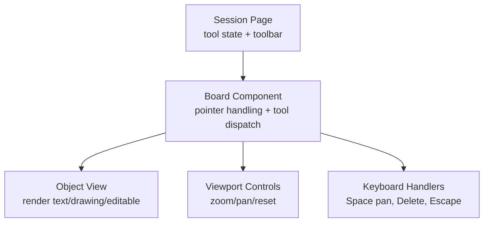

**Diagram sources**
- [page.tsx:289-304](file://stepwise ai/app/app/session/[id]/page.tsx#L289-L304)
- [Board.tsx:145-205](file://stepwise ai/app/components/board/Board.tsx#L145-L205)
- [Board.tsx:316-405](file://stepwise ai/app/components/board/Board.tsx#L316-L405)

**Section sources**
- [Board.tsx:1-11](file://stepwise ai/app/components/board/Board.tsx#L1-L11)
- [page.tsx:45-71](file://stepwise ai/app/app/session/[id]/page.tsx#L45-L71)

## Core Components
- Tool type: a union of "select", "text", "draw", "erase", "pan"
- Drag state: discriminated union for pan/move/resize/draw modes
- Viewport: x, y, scale for pan and zoom
- Object model: BoardObject with owner, type, geometry, content, timestamps

Key responsibilities:
- Session page manages tool selection UI and persistence (autosave, undo/redo)
- Board handles all pointer events, keyboard shortcuts, and tool-specific actions
- ObjectView renders different object types and supports editing and resizing

**Section sources**
- [Board.tsx:13-26](file://stepwise ai/app/components/board/Board.tsx#L13-L26)
- [Board.tsx:44-58](file://stepwise ai/app/components/board/Board.tsx#L44-L58)
- [types.ts:26-57](file://stepwise ai/app/lib/types.ts#L26-L57)
- [page.tsx:53-71](file://stepwise ai/app/app/session/[id]/page.tsx#L53-L71)

## Architecture Overview
The system uses a simple state machine driven by the active tool and drag mode. Pointer events flow into a central dispatcher that branches behavior by tool and current drag mode. Keyboard events can temporarily switch behavior (e.g., Space enables pan).

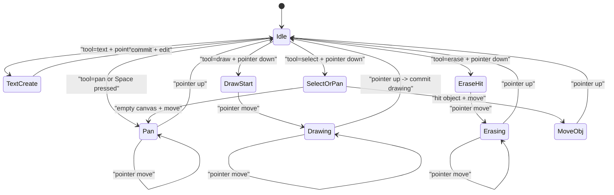

**Diagram sources**
- [Board.tsx:145-205](file://stepwise ai/app/components/board/Board.tsx#L145-L205)
- [Board.tsx:207-248](file://stepwise ai/app/components/board/Board.tsx#L207-L248)
- [Board.tsx:250-283](file://stepwise ai/app/components/board/Board.tsx#L250-L283)

## Detailed Component Analysis

### Tool State Machine and Pointer Event Handling
- Pointer capture ensures continuous tracking during drags
- Pan mode is enabled when:
  - Active tool is "pan"
  - Space key is held
  - Middle mouse button is pressed
- On pointer down:
  - Text tool creates a new text object at the click location and enters edit mode
  - Draw tool starts collecting points
  - Erase tool removes the first student-owned object under the pointer and continues erasing while dragging
  - Select tool selects an object if hit; otherwise pans the view
- On pointer move:
  - Pan updates viewport
  - Move resizes or moves objects
  - Draw appends points
  - Erase continues removing objects under cursor
- On pointer up:
  - Draw commits a stroke as a drawing object
  - All modes clear drag state

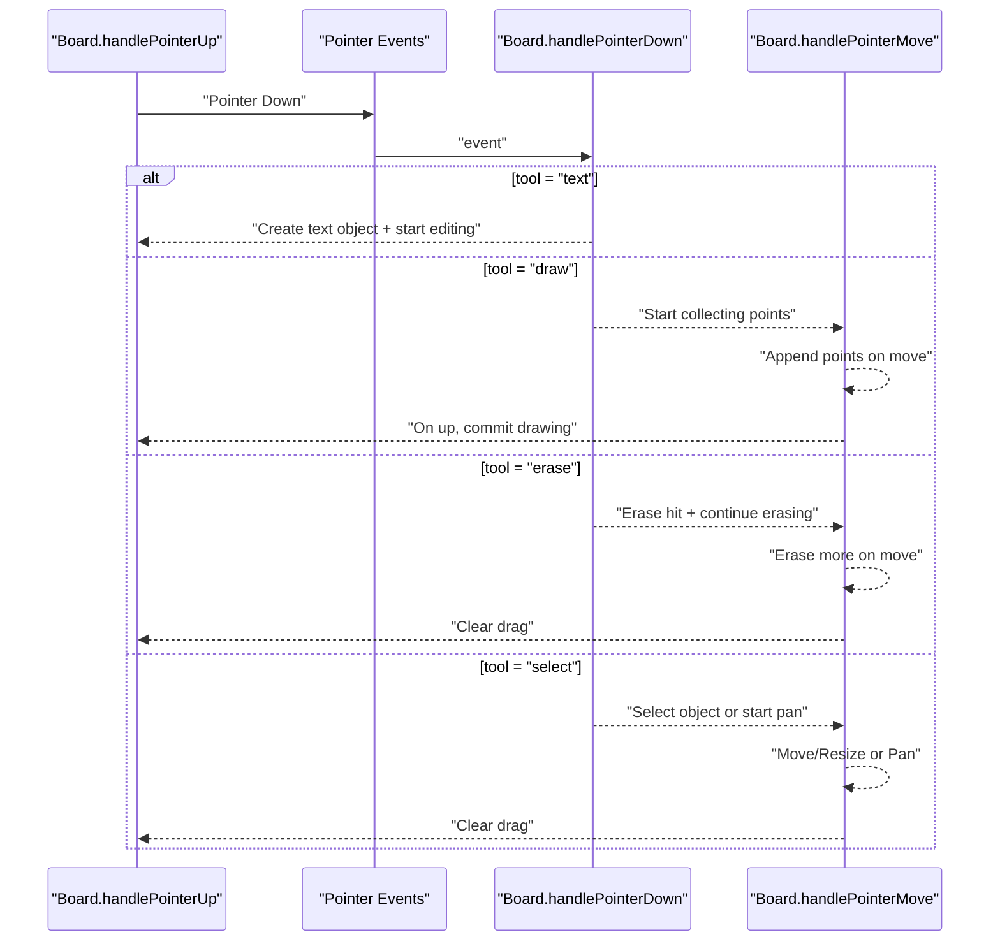

**Diagram sources**
- [Board.tsx:145-205](file://stepwise ai/app/components/board/Board.tsx#L145-L205)
- [Board.tsx:207-248](file://stepwise ai/app/components/board/Board.tsx#L207-L248)
- [Board.tsx:250-283](file://stepwise ai/app/components/board/Board.tsx#L250-L283)

**Section sources**
- [Board.tsx:145-205](file://stepwise ai/app/components/board/Board.tsx#L145-L205)
- [Board.tsx:207-248](file://stepwise ai/app/components/board/Board.tsx#L207-L248)
- [Board.tsx:250-283](file://stepwise ai/app/components/board/Board.tsx#L250-L283)

### Cursor Switching Logic
Cursor changes based on active tool and temporary pan mode:
- Pan or Space held: grab cursor
- Text tool: text cursor
- Draw tool: crosshair cursor
- Erase tool: cell-like cursor
- Default: default cursor

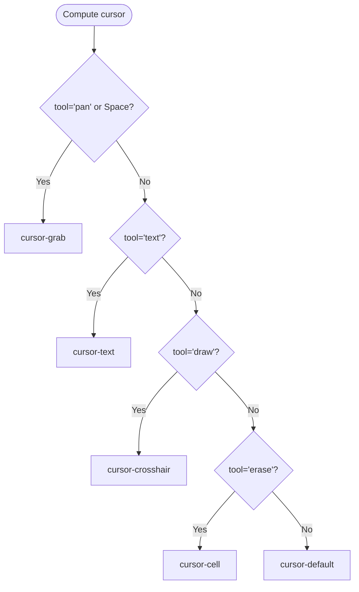

**Diagram sources**
- [Board.tsx:303-312](file://stepwise ai/app/components/board/Board.tsx#L303-L312)

**Section sources**
- [Board.tsx:303-312](file://stepwise ai/app/components/board/Board.tsx#L303-L312)

### Keyboard Shortcuts and Temporary Pan Mode
- Space: toggles temporary pan mode without changing the active tool
- Delete/Backspace: removes the currently selected student-owned object
- Escape: deselects and exits editing mode
- Ctrl/Cmd+Z/Y: undo/redo managed at the session page level

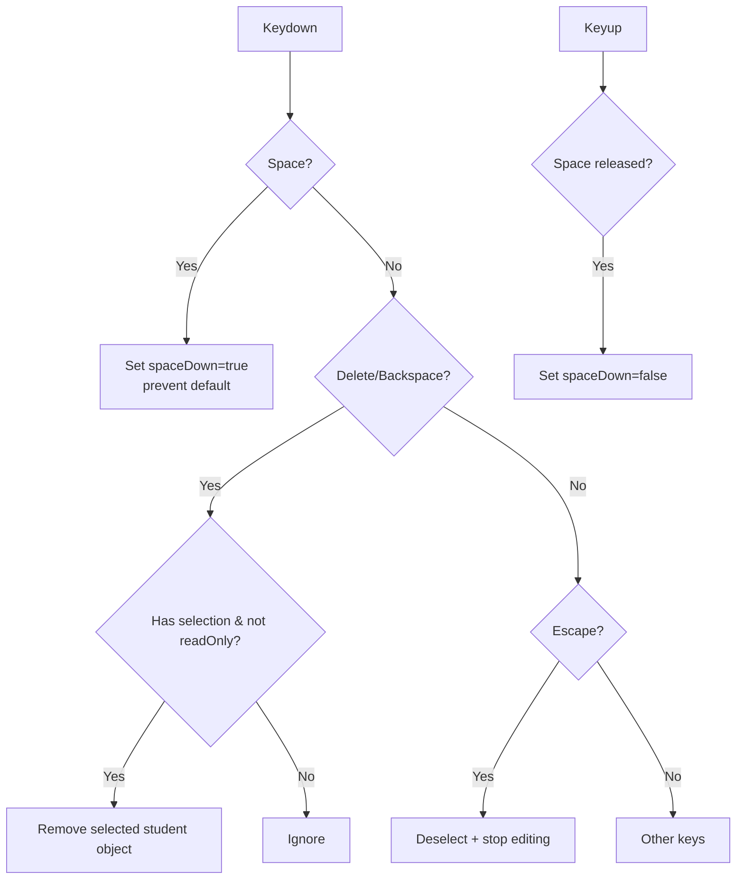

**Diagram sources**
- [Board.tsx:73-105](file://stepwise ai/app/components/board/Board.tsx#L73-L105)
- [page.tsx:160-179](file://stepwise ai/app/app/session/[id]/page.tsx#L160-L179)

**Section sources**
- [Board.tsx:73-105](file://stepwise ai/app/components/board/Board.tsx#L73-L105)
- [page.tsx:160-179](file://stepwise ai/app/app/session/[id]/page.tsx#L160-L179)

### Tool-Specific Behaviors

#### Text Tool
- Creates a new text object at the pointer location
- Sets ownership to student, assigns geometry and z-index
- Immediately selects and opens editing mode for the new object

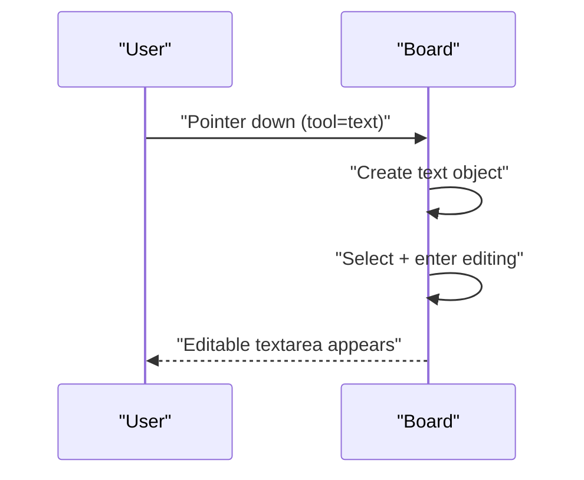

**Diagram sources**
- [Board.tsx:155-180](file://stepwise ai/app/components/board/Board.tsx#L155-L180)

**Section sources**
- [Board.tsx:155-180](file://stepwise ai/app/components/board/Board.tsx#L155-L180)

#### Draw Tool
- Captures stroke points during pointer move
- Renders a live preview polyline
- On pointer up, commits a drawing object with normalized points and color

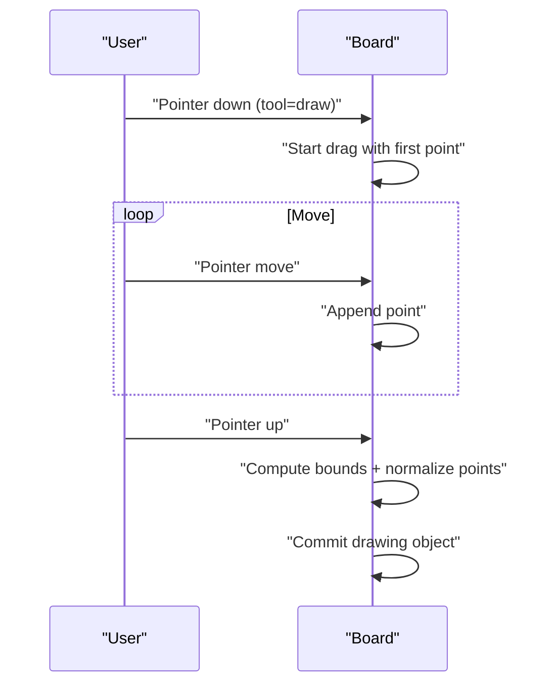

**Diagram sources**
- [Board.tsx:181-183](file://stepwise ai/app/components/board/Board.tsx#L181-L183)
- [Board.tsx:241-247](file://stepwise ai/app/components/board/Board.tsx#L241-L247)
- [Board.tsx:250-283](file://stepwise ai/app/components/board/Board.tsx#L250-L283)

**Section sources**
- [Board.tsx:181-183](file://stepwise ai/app/components/board/Board.tsx#L181-L183)
- [Board.tsx:241-247](file://stepwise ai/app/components/board/Board.tsx#L241-L247)
- [Board.tsx:250-283](file://stepwise ai/app/components/board/Board.tsx#L250-L283)

#### Erase Tool
- Removes the first student-owned object whose bounding box contains the pointer
- While dragging, continues erasing objects under the cursor
- Triggers optional feedback callback

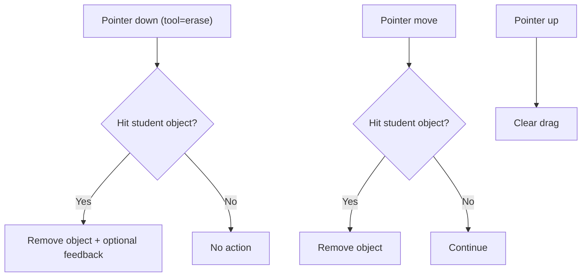

**Diagram sources**
- [Board.tsx:130-143](file://stepwise ai/app/components/board/Board.tsx#L130-L143)
- [Board.tsx:185-188](file://stepwise ai/app/components/board/Board.tsx#L185-L188)
- [Board.tsx:241-244](file://stepwise ai/app/components/board/Board.tsx#L241-L244)

**Section sources**
- [Board.tsx:130-143](file://stepwise ai/app/components/board/Board.tsx#L130-L143)
- [Board.tsx:185-188](file://stepwise ai/app/components/board/Board.tsx#L185-L188)
- [Board.tsx:241-244](file://stepwise ai/app/components/board/Board.tsx#L241-L244)

#### Select Tool
- Selects an object if pointer hits one; otherwise clears selection
- If the selected object belongs to the student and not read-only, allows moving it
- If no object is hit, pans the view
- Supports resizing via a handle when selected

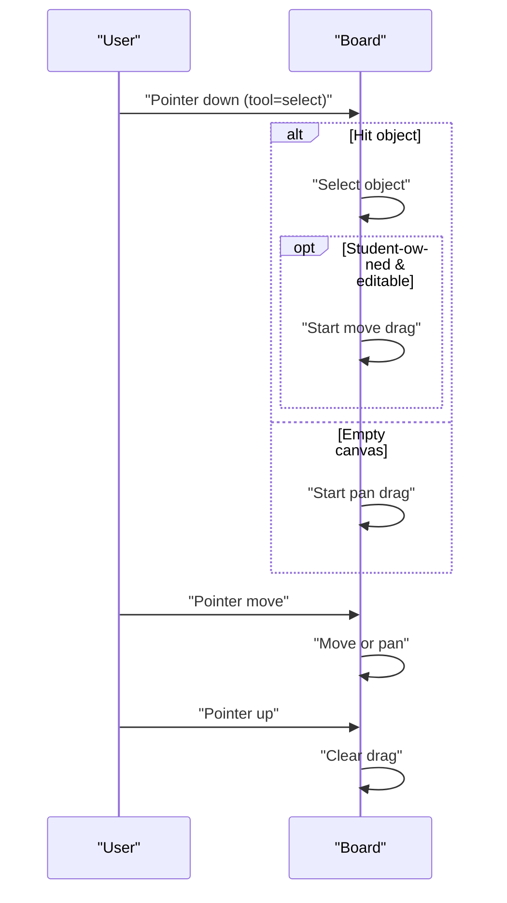

**Diagram sources**
- [Board.tsx:190-205](file://stepwise ai/app/components/board/Board.tsx#L190-L205)
- [Board.tsx:219-226](file://stepwise ai/app/components/board/Board.tsx#L219-L226)
- [Board.tsx:228-239](file://stepwise ai/app/components/board/Board.tsx#L228-L239)

**Section sources**
- [Board.tsx:190-205](file://stepwise ai/app/components/board/Board.tsx#L190-L205)
- [Board.tsx:219-226](file://stepwise ai/app/components/board/Board.tsx#L219-L226)
- [Board.tsx:228-239](file://stepwise ai/app/components/board/Board.tsx#L228-L239)

### Toolbar and Tool Selection
The session page provides a toolbar that sets the active tool. Buttons are disabled when the session is completed.

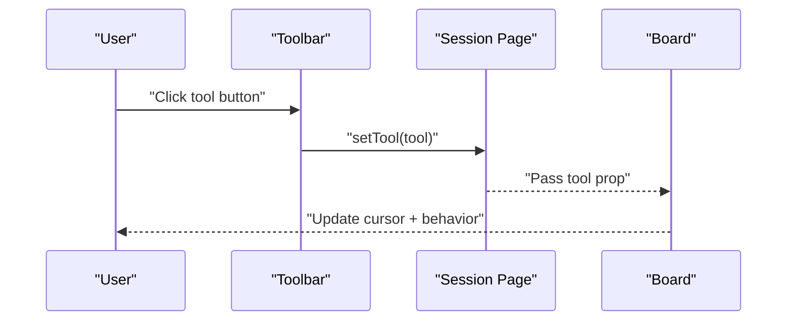

**Diagram sources**
- [page.tsx:289-304](file://stepwise ai/app/app/session/[id]/page.tsx#L289-L304)
- [page.tsx:356-360](file://stepwise ai/app/app/session/[id]/page.tsx#L356-L360)

**Section sources**
- [page.tsx:289-304](file://stepwise ai/app/app/session/[id]/page.tsx#L289-L304)
- [page.tsx:356-360](file://stepwise ai/app/app/session/[id]/page.tsx#L356-L360)

### Extending the Tool Interface and Adding Custom Tools
To add a new tool:
1. Extend the Tool union type to include your new tool name
2. Add a toolbar button in the session page to set the new tool
3. In the Board component:
   - Update pointer-down logic to handle the new tool’s initial action
   - Update pointer-move logic to handle ongoing interactions for the new tool
   - Update pointer-up logic if the tool commits on release
   - Update cursor computation to reflect the new tool
4. Optionally add keyboard shortcuts if needed

Example extension steps:
- Add a new tool string to the Tool union
- Implement creation or manipulation logic in handlePointerDown/Move/Up
- Render any visual feedback (e.g., preview shapes) similar to the draw tool’s polyline preview
- Ensure proper cleanup on pointer up

**Section sources**
- [Board.tsx:13-26](file://stepwise ai/app/components/board/Board.tsx#L13-L26)
- [Board.tsx:145-205](file://stepwise ai/app/components/board/Board.tsx#L145-L205)
- [Board.tsx:207-248](file://stepwise ai/app/components/board/Board.tsx#L207-L248)
- [Board.tsx:250-283](file://stepwise ai/app/components/board/Board.tsx#L250-L283)
- [Board.tsx:303-312](file://stepwise ai/app/components/board/Board.tsx#L303-L312)
- [page.tsx:289-304](file://stepwise ai/app/app/session/[id]/page.tsx#L289-L304)

## Dependency Analysis
- Board depends on shared types for BoardObject and FeedbackLabel
- Session page imports Board and Tool type, manages tool state, and persists changes
- Undo/redo and autosave are managed in the session page and affect the Board through committed object arrays

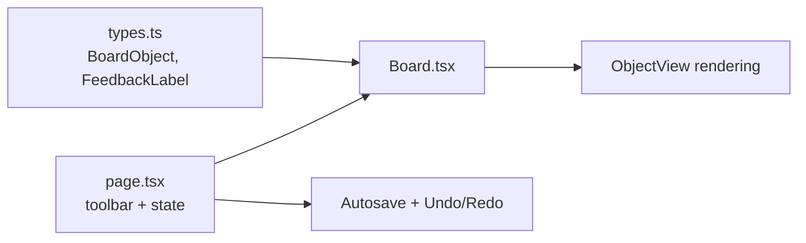

**Diagram sources**
- [types.ts:26-57](file://stepwise ai/app/lib/types.ts#L26-L57)
- [page.tsx:118-130](file://stepwise ai/app/app/session/[id]/page.tsx#L118-L130)
- [Board.tsx:44-58](file://stepwise ai/app/components/board/Board.tsx#L44-L58)

**Section sources**
- [types.ts:26-57](file://stepwise ai/app/lib/types.ts#L26-L57)
- [page.tsx:118-130](file://stepwise ai/app/app/session/[id]/page.tsx#L118-L130)
- [Board.tsx:44-58](file://stepwise ai/app/components/board/Board.tsx#L44-L58)

## Performance Considerations
- Use refs to avoid stale closures in event handlers (objectsRef, dragRef, viewRef)
- Debounced autosave reduces network calls during rapid edits
- Limit history stack size to prevent memory growth
- Normalize drawing points to reduce payload size
- Clamp zoom scale to reasonable bounds to avoid excessive transforms

[No sources needed since this section provides general guidance]

## Troubleshooting Guide
Common issues and resolutions:
- Objects not responding to pointer events: ensure data-object-id attributes are present and pointer events are captured correctly
- Temporary pan not working: verify Space key handling and that typing inputs do not intercept the key
- Drawing not committing: check that pointer up triggers commit only when multiple points exist
- Erase not removing objects: confirm object owner is "student" and bounding box includes pointer coordinates
- Undo/redo not functioning: ensure history/future stacks are updated on each commit

**Section sources**
- [Board.tsx:73-105](file://stepwise ai/app/components/board/Board.tsx#L73-L105)
- [Board.tsx:130-143](file://stepwise ai/app/components/board/Board.tsx#L130-L143)
- [Board.tsx:250-283](file://stepwise ai/app/components/board/Board.tsx#L250-L283)
- [page.tsx:118-130](file://stepwise ai/app/app/session/[id]/page.tsx#L118-L130)
- [page.tsx:146-158](file://stepwise ai/app/app/session/[id]/page.tsx#L146-L158)

## Conclusion
The tool management system centers around a clear state machine driven by the active tool and drag mode. Pointer events are dispatched consistently, enabling robust interactions for select, text, draw, erase, and pan. Cursor feedback and keyboard shortcuts enhance usability. The design is extensible: adding new tools involves updating the tool union, implementing event handling, and integrating toolbar controls.

[No sources needed since this section summarizes without analyzing specific files]

## Appendices

### Data Model Reference
- BoardObject fields include id, board_id, type, geometry (x, y, width, height), rotation, z_index, content, style, meta, owner, timestamps
- Ownership distinguishes student, ai, system, imported objects
- Feedback labels provide AI-driven annotations on objects

**Section sources**
- [types.ts:26-57](file://stepwise ai/app/lib/types.ts#L26-L57)
- [types.ts:64-71](file://stepwise ai/app/lib/types.ts#L64-L71)