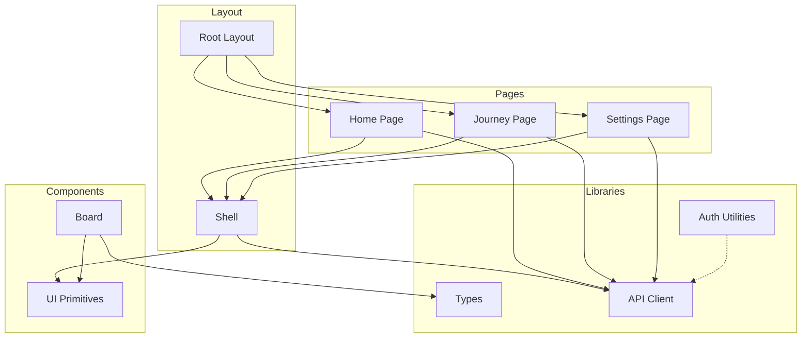
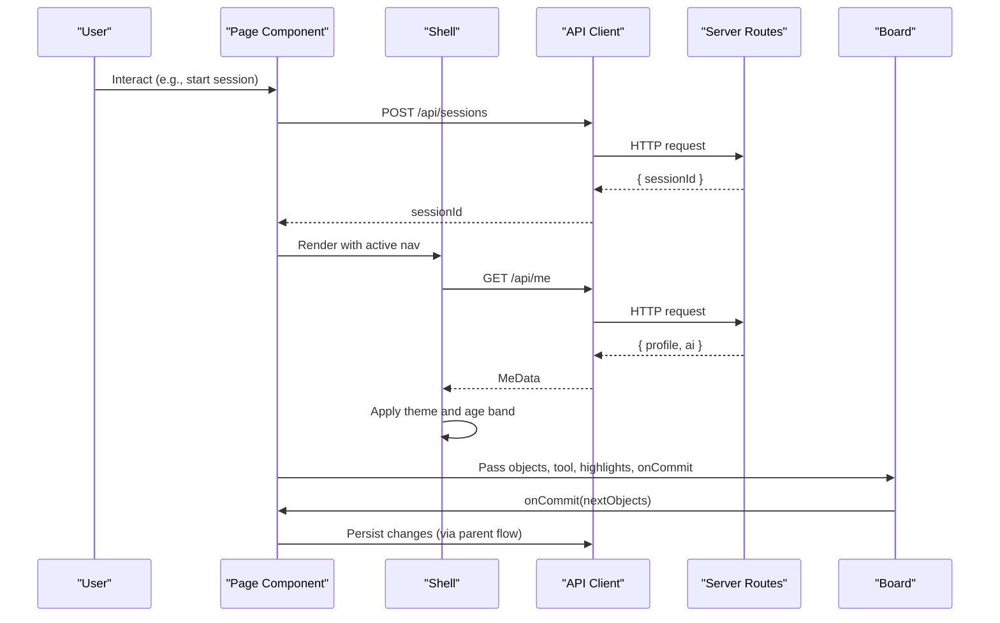
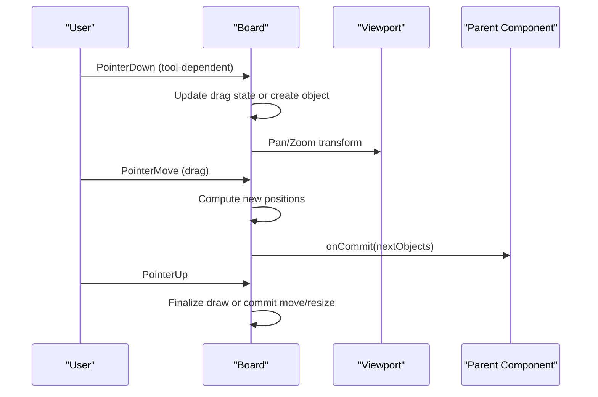
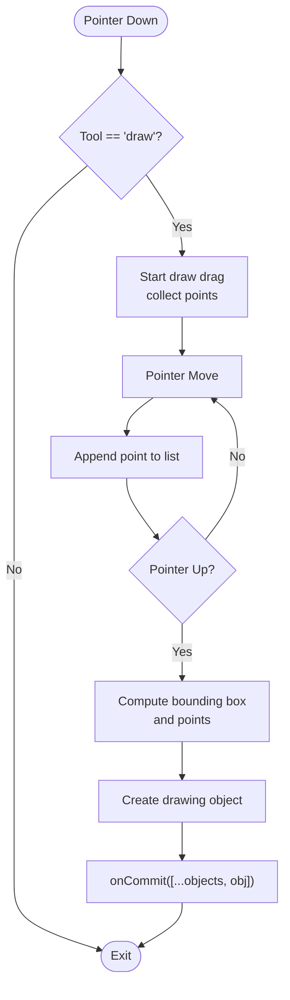
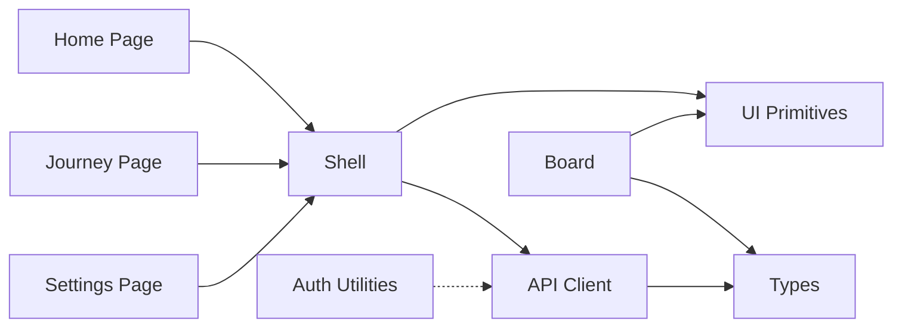

# Frontend Components

<cite>
**Referenced Files in This Document**
- [Shell.tsx](file://app/components/Shell.tsx)
- [Board.tsx](file://app/components/board/Board.tsx)
- [ui.tsx](file://app/components/ui.tsx)
- [types.ts](file://app/lib/types.ts)
- [client.ts](file://app/lib/client.ts)
- [auth.ts](file://app/lib/auth.ts)
- [layout.tsx](file://app/app/layout.tsx)
- [globals.css](file://app/app/globals.css)
- [tailwind.config.js](file://app/tailwind.config.js)
- [home/page.tsx](file://app/app/home/page.tsx)
- [journey/page.tsx](file://app/app/journey/page.tsx)
- [settings/page.tsx](file://app/app/settings/page.tsx)
</cite>

## Table of Contents
1. Introduction
2. Project Structure
3. Core Components
4. Architecture Overview
5. Detailed Component Analysis
6. Dependency Analysis
7. Performance Considerations
8. Troubleshooting Guide
9. Conclusion
10. Appendices

## Introduction
This document explains StepWise AI’s React component library and UI architecture. It covers the reusable UI primitives, the Shell layout that manages authentication and global state, and the Board canvas that supports tool-based object manipulation and feedback visualization. It also documents styling with Tailwind CSS, theme customization, accessibility, responsive design, performance techniques, and patterns for extending or integrating third-party libraries.

## Project Structure
The application is a Next.js app using client components for interactive features. The key directories are:
- app/components: Shared UI primitives and layout components (Shell, Board, ui).
- app/app: Page-level components that compose Shell and UI primitives to build routes like Home, Journey, and Settings.
- app/lib: Domain types, API client, and server-side auth utilities used by both client and server code.
- app/app/globals.css and tailwind.config.js: Global styles and Tailwind theme configuration.



**Diagram sources**
- [layout.tsx:10-16](file://app/app/layout.tsx#L10-L16)
- [Shell.tsx:27-123](file://app/components/Shell.tsx#L27-L123)
- [Board.tsx:44-406](file://app/components/board/Board.tsx#L44-L406)
- [ui.tsx:12-218](file://app/components/ui.tsx#L12-L218)
- [types.ts:26-57](file://app/lib/types.ts#L26-L57)
- [client.ts:7-27](file://app/lib/client.ts#L7-L27)
- [auth.ts:78-102](file://app/lib/auth.ts#L78-L102)
- [home/page.tsx:20-172](file://app/app/home/page.tsx#L20-L172)
- [journey/page.tsx:61-235](file://app/app/journey/page.tsx#L61-L235)
- [settings/page.tsx:8-187](file://app/app/settings/page.tsx#L8-L187)

**Section sources**
- [layout.tsx:10-16](file://app/app/layout.tsx#L10-L16)
- [Shell.tsx:27-123](file://app/components/Shell.tsx#L27-L123)
- [Board.tsx:44-406](file://app/components/board/Board.tsx#L44-L406)
- [ui.tsx:12-218](file://app/components/ui.tsx#L12-L218)
- [types.ts:26-57](file://app/lib/types.ts#L26-L57)
- [client.ts:7-27](file://app/lib/client.ts#L7-L27)
- [auth.ts:78-102](file://app/lib/auth.ts#L78-L102)
- [home/page.tsx:20-172](file://app/app/home/page.tsx#L20-L172)
- [journey/page.tsx:61-235](file://app/app/journey/page.tsx#L61-L235)
- [settings/page.tsx:8-187](file://app/app/settings/page.tsx#L8-L187)

## Core Components
- Shell: Application shell for authenticated pages. Verifies session via /api/me, applies adaptive theme and age-band classes, renders header navigation, demo banner, and delegates content rendering to children.
- Board: Spatial canvas supporting tools (select, text, draw, erase, pan), viewport pan/zoom, object selection/editing/resizing, keyboard shortcuts, and feedback highlights. All changes are committed through onCommit.
- UI Primitives: Consistent set of accessible components including Button, Card, Input, Textarea, Select, Badge, Spinner, Alert, EmptyState, DemoBanner, and shared FEEDBACK_META labels.

Key responsibilities:
- Shell centralizes authentication checks and global theme application.
- Board encapsulates complex interaction logic and renders objects based on typed data.
- UI primitives standardize appearance and behavior across pages.

**Section sources**
- [Shell.tsx:27-123](file://app/components/Shell.tsx#L27-L123)
- [Board.tsx:44-406](file://app/components/board/Board.tsx#L44-L406)
- [ui.tsx:12-218](file://app/components/ui.tsx#L12-L218)

## Architecture Overview
The UI architecture follows a layered approach:
- Pages compose Shell and UI primitives to present domain-specific views.
- Shell ensures authenticated context and applies global theme settings.
- Board provides an interactive workspace with tool-driven interactions and persistent updates via callbacks.
- Types define the shared domain model for board objects, feedback, profiles, and AI provider contracts.
- API client abstracts network calls and error handling; auth utilities manage sessions server-side.



**Diagram sources**
- [home/page.tsx:36-59](file://app/app/home/page.tsx#L36-L59)
- [Shell.tsx:38-62](file://app/components/Shell.tsx#L38-L62)
- [client.ts:7-27](file://app/lib/client.ts#L7-L27)
- [Board.tsx:44-58](file://app/components/board/Board.tsx#L44-L58)

**Section sources**
- [home/page.tsx:36-59](file://app/app/home/page.tsx#L36-L59)
- [Shell.tsx:38-62](file://app/components/Shell.tsx#L38-L62)
- [client.ts:7-27](file://app/lib/client.ts#L7-L27)
- [Board.tsx:44-58](file://app/components/board/Board.tsx#L44-L58)

## Detailed Component Analysis

### Shell Component
Responsibilities:
- Verify user session by calling /api/me and handle redirects to onboarding or login.
- Apply theme and age-band classes to the root element for adaptive UI.
- Render header with navigation links and logout action.
- Show demo banner when running in demo mode.

Props:
- children: React node rendered as main content.
- active: Highlights current navigation item ("home", "journey", "settings").

Events and side effects:
- Fetches user profile and AI provider info; navigates if not onboarded or unauthenticated.
- Applies dark/system theme and learner band classes to documentElement.

Accessibility:
- Uses semantic header and nav elements with aria-label for navigation.

Performance:
- Minimal re-renders; theme application occurs once after fetching profile.

Extensibility:
- Add new top-level navigation by adding Link entries and updating active prop usage.
- Integrate additional global banners or notifications above the header.

**Section sources**
- [Shell.tsx:27-123](file://app/components/Shell.tsx#L27-L123)

#### Shell Class Diagram
```mermaid
classDiagram
class Shell {
+children ReactNode
+active "home" | "journey" | "settings"
-me MeData?
-failed boolean
+applyTheme(theme, ageBand) void
+logout() Promise<void>
}
class MeData {
+user { id : number; email : string }
+profile { display_name; age_band; education_level; preferred_language; explanation_depth; autonomy_level; learning_mode; theme; onboarded }
+ai { provider : string; isDemo : boolean }
}
Shell --> MeData : "uses"
```

**Diagram sources**
- [Shell.tsx:11-25](file://app/components/Shell.tsx#L11-L25)
- [Shell.tsx:27-123](file://app/components/Shell.tsx#L27-L123)

### Board Component
Responsibilities:
- Provide a spatial canvas with pan/zoom and multiple tools: select, text, draw, erase, pan.
- Manage object lifecycle: create, move, resize, edit, delete.
- Render feedback highlights per object and show zoom controls.
- Commit all changes via onCommit callback to enable persistence and collaboration.

Props:
- objects: Array of BoardObject instances.
- tool: Current active tool.
- readOnly: Disables editing when true.
- highlights: Mapping from object IDs to FeedbackLabel for visual cues.
- onCommit: Callback to persist next objects array.
- onEraseFeedback: Optional callback invoked when erasing feedback-related objects.

Interactions:
- Pointer events for drag/move/resize/draw/pan.
- Keyboard shortcuts: Space for temporary pan, Delete removes selected student-owned objects, Escape deselects.
- Wheel zoom centered on cursor.

Rendering:
- Sorts objects by z-index.
- Renders ObjectView for each object with selection ring, highlight badge, and editable textarea when editing.

Accessibility:
- Canvas has role="application" and aria-label.
- Zoom controls have aria-labels.
- Resize handle has aria-label.

Performance:
- Uses refs to avoid stale closures during pointer events.
- Local state for viewport and drag reduces unnecessary re-renders.

Extensibility:
- Add new tools by extending Tool type and handling in pointer handlers.
- Extend object types by expanding BoardObjectType and rendering logic in ObjectView.

**Section sources**
- [Board.tsx:13-58](file://app/components/board/Board.tsx#L13-L58)
- [Board.tsx:73-105](file://app/components/board/Board.tsx#L73-L105)
- [Board.tsx:107-128](file://app/components/board/Board.tsx#L107-L128)
- [Board.tsx:145-205](file://app/components/board/Board.tsx#L145-L205)
- [Board.tsx:207-283](file://app/components/board/Board.tsx#L207-L283)
- [Board.tsx:316-406](file://app/components/board/Board.tsx#L316-L406)
- [Board.tsx:408-540](file://app/components/board/Board.tsx#L408-L540)

#### Board Sequence Diagram


**Diagram sources**
- [Board.tsx:145-205](file://app/components/board/Board.tsx#L145-L205)
- [Board.tsx:207-283](file://app/components/board/Board.tsx#L207-L283)
- [Board.tsx:316-406](file://app/components/board/Board.tsx#L316-L406)

#### Board Flowchart (Draw Tool)


**Diagram sources**
- [Board.tsx:181-183](file://app/components/board/Board.tsx#L181-L183)
- [Board.tsx:241-247](file://app/components/board/Board.tsx#L241-L247)
- [Board.tsx:250-283](file://app/components/board/Board.tsx#L250-L283)

### UI Primitives
Components:
- Button: Variants (primary, secondary, ghost, danger) and sizes (sm, md, lg).
- Card: Container with consistent border and shadow.
- Input, Textarea, Select: Form fields with label and hint support.
- Badge: Status indicators with tone variants.
- Spinner: Accessible loading indicator.
- Alert: Contextual messages with tone variants.
- EmptyState: Placeholder for empty lists or states.
- DemoBanner: Warning banner for demo mode.
- FEEDBACK_META: Centralized mapping of feedback labels to icons and labels.

Customization:
- Use className to override styles.
- Leverage Tailwind utility classes for spacing, typography, and colors.

Accessibility:
- Inputs associate labels via htmlFor/id.
- Spinner uses role="status" and aria-live.
- Buttons inherit focus-visible styles from globals.

**Section sources**
- [ui.tsx:12-218](file://app/components/ui.tsx#L12-L218)

### Page Composition Patterns
- Home Page: Composes Shell, UI primitives, and API client to start sessions and list ongoing/completed ones.
- Journey Page: Displays learning journey metrics, recommendations, concepts, misconceptions, and reviews.
- Settings Page: Loads and saves profile preferences, applies theme instantly.

These pages demonstrate composition of Shell and UI primitives, data fetching via the API client, and state management within page components.

**Section sources**
- [home/page.tsx:20-172](file://app/app/home/page.tsx#L20-L172)
- [journey/page.tsx:61-235](file://app/app/journey/page.tsx#L61-L235)
- [settings/page.tsx:8-187](file://app/app/settings/page.tsx#L8-L187)

## Dependency Analysis
Component relationships:
- Pages depend on Shell and UI primitives.
- Shell depends on API client and UI primitives.
- Board depends on types and UI primitives for feedback labels.
- Types define shared models used across components.
- Auth utilities provide server-side session management referenced by API routes.



**Diagram sources**
- [home/page.tsx:20-172](file://app/app/home/page.tsx#L20-L172)
- [journey/page.tsx:61-235](file://app/app/journey/page.tsx#L61-L235)
- [settings/page.tsx:8-187](file://app/app/settings/page.tsx#L8-L187)
- [Shell.tsx:27-123](file://app/components/Shell.tsx#L27-L123)
- [Board.tsx:44-58](file://app/components/board/Board.tsx#L44-L58)
- [types.ts:26-57](file://app/lib/types.ts#L26-L57)
- [client.ts:7-27](file://app/lib/client.ts#L7-L27)
- [auth.ts:78-102](file://app/lib/auth.ts#L78-L102)

**Section sources**
- [home/page.tsx:20-172](file://app/app/home/page.tsx#L20-L172)
- [journey/page.tsx:61-235](file://app/app/journey/page.tsx#L61-L235)
- [settings/page.tsx:8-187](file://app/app/settings/page.tsx#L8-L187)
- [Shell.tsx:27-123](file://app/components/Shell.tsx#L27-L123)
- [Board.tsx:44-58](file://app/components/board/Board.tsx#L44-L58)
- [types.ts:26-57](file://app/lib/types.ts#L26-L57)
- [client.ts:7-27](file://app/lib/client.ts#L7-L27)
- [auth.ts:78-102](file://app/lib/auth.ts#L78-L102)

## Performance Considerations
- Memoization: Use React.memo for expensive UI primitives when props change frequently.
- State colocation: Keep transient UI state (viewport, drag) local to Board to minimize re-renders.
- Event handling: Use refs to avoid capturing stale state in event listeners.
- Rendering optimization: Sort objects by z-index once per render; avoid deep cloning unless necessary.
- Network efficiency: Batch commits where possible; debounce rapid edits before committing.
- Lazy loading: Code-split heavy components (e.g., Board) using dynamic imports to reduce initial bundle size.
- Accessibility and reduced motion: Respect prefers-reduced-motion to disable animations for users who prefer it.

[No sources needed since this section provides general guidance]

## Troubleshooting Guide
Common issues and resolutions:
- Authentication failures: If /api/me fails, Shell redirects to login. Ensure cookies and server routes are configured correctly.
- Theme not applying: Verify root element class toggles and that Tailwind darkMode is set to class.
- Board interactions not working: Check that containerRef exists and pointer events are attached; ensure no overlay blocks input.
- API errors: The client throws descriptive errors; wrap calls with try/catch and display alerts to users.
- Session expiry: Server-side session verification clears expired sessions; refresh or re-login as needed.

**Section sources**
- [Shell.tsx:38-52](file://app/components/Shell.tsx#L38-L52)
- [client.ts:7-27](file://app/lib/client.ts#L7-L27)
- [auth.ts:78-102](file://app/lib/auth.ts#L78-L102)

## Conclusion
StepWise AI’s frontend combines a robust Shell for authentication and theming, a powerful Board for interactive learning, and a cohesive set of UI primitives for consistent experiences. The architecture emphasizes clear separation of concerns, strong typing, and accessible, responsive design. Extending the system involves adding new tools, objects, or pages while leveraging existing patterns for state management, API integration, and styling.

[No sources needed since this section summarizes without analyzing specific files]

## Appendices

### Styling System and Theme Customization
- Tailwind configuration defines brand and ink color scales, custom shadows, animations, and font families.
- Dark mode is enabled via class strategy; toggle by adding/removing "dark" on the root element.
- Globals include CSS variables for board background and dot pattern, focus-visible styles, and reduced motion support.
- Age-band classes adjust typography for different learner groups.

**Section sources**
- [tailwind.config.js:1-57](file://app/tailwind.config.js#L1-L57)
- [globals.css:1-67](file://app/app/globals.css#L1-L67)

### Data Models and Types
- BoardObject defines spatial properties, ownership, and metadata for canvas items.
- FeedbackLabel maps to visual highlights and labels for teaching feedback.
- Profile and related types drive adaptive UI behaviors such as theme and explanation depth.

**Section sources**
- [types.ts:26-57](file://app/lib/types.ts#L26-L57)
- [types.ts:61-78](file://app/lib/types.ts#L61-L78)
- [types.ts:232-250](file://app/lib/types.ts#L232-L250)

### Integration Points and Third-Party Libraries
- API client abstracts fetch calls and error handling; extend by adding new endpoints and response envelopes.
- Auth utilities manage secure sessions; integrate with server routes to protect protected resources.
- UI primitives can be extended with new variants or composed into larger widgets.

**Section sources**
- [client.ts:7-27](file://app/lib/client.ts#L7-L27)
- [auth.ts:78-102](file://app/lib/auth.ts#L78-L102)
- [ui.tsx:12-218](file://app/components/ui.tsx#L12-L218)