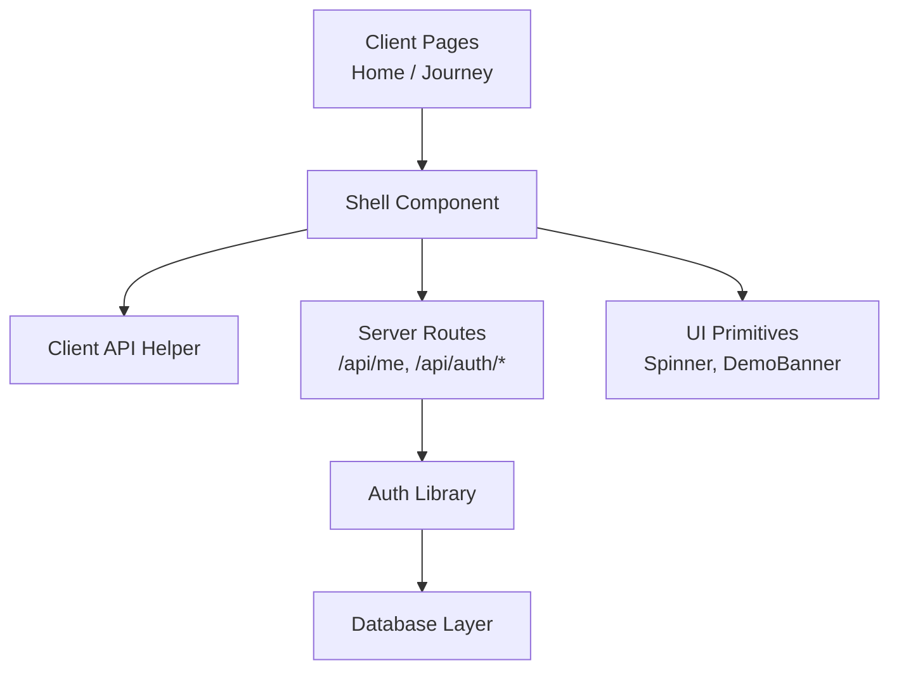
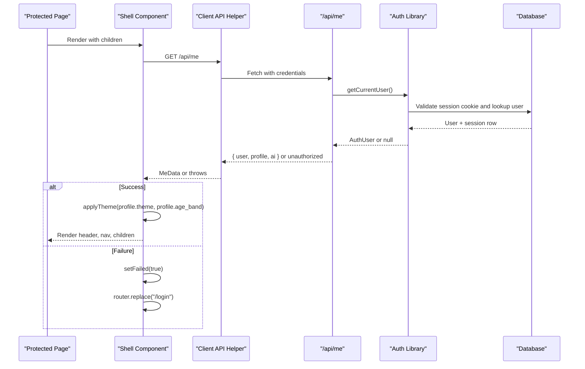
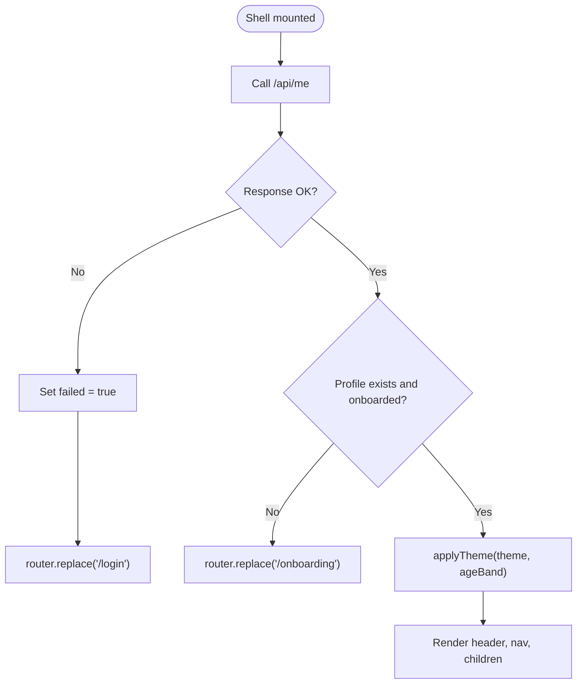
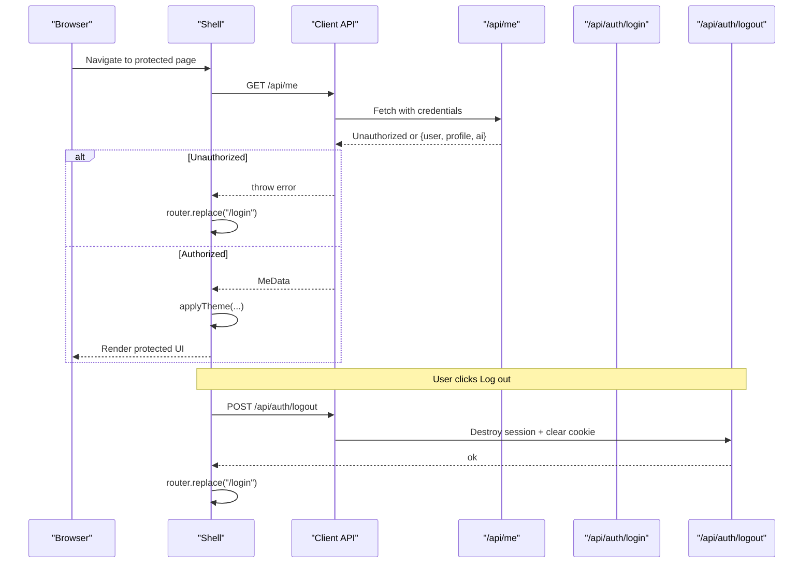
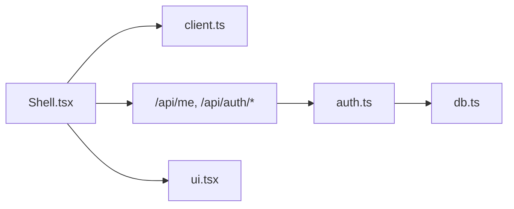

# Shell Component

<cite>
**Referenced Files in This Document**
- [Shell.tsx](file://app/components/Shell.tsx)
- [ui.tsx](file://app/components/ui.tsx)
- [client.ts](file://app/lib/client.ts)
- [auth.ts](file://app/lib/auth.ts)
- [route.ts (me)](file://app/app/api/me/route.ts)
- [route.ts (login)](file://app/app/api/auth/login/route.ts)
- [route.ts (logout)](file://app/app/api/auth/logout/route.ts)
- [types.ts](file://app/lib/types.ts)
- [db.ts](file://app/lib/db.ts)
- [home page](file://app/app/home/page.tsx)
- [journey page](file://app/app/journey/page.tsx)
</cite>

## Table of Contents
1. Introduction
2. Project Structure
3. Core Components
4. Architecture Overview
5. Detailed Component Analysis
6. Dependency Analysis
7. Performance Considerations
8. Troubleshooting Guide
9. Conclusion

## Introduction
The Shell component is the authenticated application wrapper used by protected pages. It validates the user session, applies adaptive theming based on profile preferences and age band, displays a demo-mode banner when applicable, renders primary navigation, and provides logout functionality. It centralizes authentication state handling for pages that wrap their content with Shell, ensuring consistent UX and security posture across the app.

## Project Structure
The Shell component lives under the components directory and is consumed by protected pages such as Home and Journey. It relies on:
- A client-side API helper to call server endpoints with credentials.
- Server routes to validate sessions and return user/profile data.
- Authentication utilities to manage cookies and sessions.
- UI primitives for loading states and banners.

**Diagram sources**
- [Shell.tsx:1-124](file://app/components/Shell.tsx#L1-L124)
- [client.ts:1-28](file://app/lib/client.ts#L1-L28)
- [route.ts (me):1-79](file://app/app/api/me/route.ts#L1-L79)
- [route.ts (login):1-30](file://app/app/api/auth/login/route.ts#L1-L30)
- [route.ts (logout):1-12](file://app/app/api/auth/logout/route.ts#L1-L12)
- [auth.ts:1-139](file://app/lib/auth.ts#L1-L139)
- [db.ts:1-224](file://app/lib/db.ts#L1-L224)
- [ui.tsx:1-218](file://app/components/ui.tsx#L1-L218)

**Section sources**
- [Shell.tsx:1-124](file://app/components/Shell.tsx#L1-L124)
- [home page:1-172](file://app/app/home/page.tsx#L1-L172)
- [journey page:1-235](file://app/app/journey/page.tsx#L1-L235)

## Core Components
- Shell: Validates session via /api/me, enforces onboarding redirect if needed, applies theme and age-band classes, shows demo banner, renders header navigation, and handles logout.
- MeData interface: Defines the shape of current user info, profile fields, and AI configuration returned by /api/me.
- Client API helper: Normalizes fetch calls, sends credentials, and unwraps standard envelopes.
- Auth library: Implements secure password hashing, session creation/validation, and cookie management.
- Server /api/me route: Returns user, profile, and AI provider info after verifying the session.
- UI primitives: Provide Spinner and DemoBanner used by Shell.

Key responsibilities:
- Authentication state: Fetches and caches MeData; redirects to login on failure.
- Session validation: Ensures a valid signed session cookie exists before rendering protected content.
- Theme application: Toggles dark mode and age-band classes on the document root.
- Navigation context: Renders active links and exposes logout.

**Section sources**
- [Shell.tsx:11-79](file://app/components/Shell.tsx#L11-L79)
- [client.ts:1-28](file://app/lib/client.ts#L1-L28)
- [auth.ts:42-102](file://app/lib/auth.ts#L42-L102)
- [route.ts (me):20-33](file://app/app/api/me/route.ts#L20-L33)
- [ui.tsx:150-218](file://app/components/ui.tsx#L150-L218)

## Architecture Overview
The Shell orchestrates a client-side flow that depends on server-side session verification and profile retrieval. On mount, it requests /api/me; success triggers theme application and renders the shell UI, while failure redirects to login. Logout posts to /api/auth/logout, which invalidates the server session and clears the cookie.

**Diagram sources**
- [Shell.tsx:38-52](file://app/components/Shell.tsx#L38-L52)
- [client.ts:7-27](file://app/lib/client.ts#L7-L27)
- [route.ts (me):20-33](file://app/app/api/me/route.ts#L20-L33)
- [auth.ts:78-102](file://app/lib/auth.ts#L78-L102)
- [db.ts:123-199](file://app/lib/db.ts#L123-L199)

## Detailed Component Analysis

### Shell Component
Responsibilities:
- Mount-time session check via /api/me.
- Redirect to onboarding if profile missing or not onboarded.
- Apply adaptive theme and age-band classes to document root.
- Show demo banner when AI is in demo mode.
- Render header with navigation and user display name.
- Handle logout by calling /api/auth/logout and redirecting to login.

Error handling:
- Network or auth errors result in a failed state and redirect to login.
- Loading state shows a spinner until MeData resolves.

Integration:
- Pages wrap content with Shell and pass an active tab key to highlight the current link.

**Diagram sources**
- [Shell.tsx:38-62](file://app/components/Shell.tsx#L38-L62)
- [Shell.tsx:64-79](file://app/components/Shell.tsx#L64-L79)

**Section sources**
- [Shell.tsx:27-124](file://app/components/Shell.tsx#L27-L124)

### MeData Interface
Structure:
- user: id and email from the authenticated session.
- profile: display_name, age_band, education_level, preferred_language, explanation_depth, autonomy_level, learning_mode, theme, onboarded.
- ai: provider display name and isDemo flag.

This interface mirrors the response produced by /api/me and drives both UI behavior (theme, banner) and feature gating (onboarding).

**Section sources**
- [Shell.tsx:11-25](file://app/components/Shell.tsx#L11-L25)
- [route.ts (me):20-33](file://app/app/api/me/route.ts#L20-L33)
- [types.ts:232-257](file://app/lib/types.ts#L232-L257)

### Adaptive Theming System
Mechanism:
- Reads profile.theme and profile.age_band from MeData.
- Applies "dark" class when theme is "dark" or "system" with system preference matching dark.
- Applies "band-early" or "band-young" classes based on age_band values.
- Uses Tailwind CSS classes to style the entire application accordingly.

Behavior:
- Immediate visual adaptation without full reload.
- Consistent with user preferences stored in the profile.

**Section sources**
- [Shell.tsx:54-62](file://app/components/Shell.tsx#L54-L62)
- [types.ts:232-250](file://app/lib/types.ts#L232-L250)

### Authentication Flow and Redirect Logic
Client side:
- Shell calls /api/me on mount.
- On success, proceeds to render protected UI.
- On failure, sets failed state and redirects to login.

Server side:
- /api/me verifies the session using getCurrentUser and returns user/profile/ai info.
- Login route authenticates credentials, creates a session, and sets a signed httpOnly cookie.
- Logout route destroys the session and clears the cookie.

Redirects:
- Unauthenticated access leads to /login.
- Missing or incomplete onboarding leads to /onboarding.

**Diagram sources**
- [Shell.tsx:38-70](file://app/components/Shell.tsx#L38-L70)
- [route.ts (me):20-33](file://app/app/api/me/route.ts#L20-L33)
- [route.ts (login):7-29](file://app/app/api/auth/login/route.ts#L7-L29)
- [route.ts (logout):7-11](file://app/app/api/auth/logout/route.ts#L7-L11)
- [auth.ts:46-71](file://app/lib/auth.ts#L46-L71)

**Section sources**
- [Shell.tsx:38-70](file://app/components/Shell.tsx#L38-L70)
- [route.ts (login):7-29](file://app/app/api/auth/login/route.ts#L7-L29)
- [route.ts (logout):7-11](file://app/app/api/auth/logout/route.ts#L7-L11)
- [auth.ts:46-71](file://app/lib/auth.ts#L46-L71)

### Integrating Pages with Shell
- Wrap page content with Shell and pass the active tab key ("home", "journey", "settings").
- Use client API helper for all server calls; handle loading and error states within the page.
- Example patterns:
  - Home page loads sessions and starts new ones, then navigates to session detail.
  - Journey page loads learning journey data and displays stats and recommendations.

Loading states:
- Pages can show Spinners while fetching data.
- Shell itself shows a Spinner during initial MeData resolution.

Logout:
- Triggered from Shell’s header button; no additional page logic required.

**Section sources**
- [home page:20-69](file://app/app/home/page.tsx#L20-L69)
- [home page:64-172](file://app/app/home/page.tsx#L64-L172)
- [journey page:61-83](file://app/app/journey/page.tsx#L61-L83)
- [journey page:83-235](file://app/app/journey/page.tsx#L83-L235)

### Security Considerations
- Passwords are hashed with scrypt-based hashing; never stored in plaintext.
- Sessions are stored server-side with tokens and expiration; cookies are httpOnly, sameSite lax, and secure in production.
- Session cookies are signed using HMAC to prevent tampering.
- /api/me enforces authentication; unauthenticated requests receive unauthorized responses.
- Input validation and whitelisting occur on the server for profile updates.

Session management:
- createSession generates a random token, stores it with expiry, and returns a signed cookie value.
- getCurrentUser validates signature, checks expiry, and resolves user identity.
- destroySession removes the token from storage; clearSessionCookie deletes the cookie.

**Section sources**
- [auth.ts:24-40](file://app/lib/auth.ts#L24-L40)
- [auth.ts:46-71](file://app/lib/auth.ts#L46-L71)
- [auth.ts:78-102](file://app/lib/auth.ts#L78-L102)
- [route.ts (me):20-33](file://app/app/api/me/route.ts#L20-L33)
- [db.ts:147-199](file://app/lib/db.ts#L147-L199)

### Performance Optimization Techniques
- Single network call per Shell mount to fetch MeData; avoids redundant requests.
- Minimal DOM mutations: only toggles classes on document root for theming.
- Lightweight UI feedback with Spinner and conditional rendering to avoid unnecessary re-renders.
- Server-side input validation reduces payload size and prevents invalid writes.
- Database layer uses atomic writes and transactions to ensure consistency and reduce contention.

[No sources needed since this section provides general guidance]

## Dependency Analysis
Shell depends on:
- Client API helper for standardized fetch and envelope handling.
- Server routes for authentication and profile retrieval.
- Auth library for session validation and cookie operations.
- UI primitives for consistent status indicators and banners.

**Diagram sources**
- [Shell.tsx:1-124](file://app/components/Shell.tsx#L1-L124)
- [client.ts:1-28](file://app/lib/client.ts#L1-L28)
- [route.ts (me):1-79](file://app/app/api/me/route.ts#L1-L79)
- [auth.ts:1-139](file://app/lib/auth.ts#L1-L139)
- [db.ts:1-224](file://app/lib/db.ts#L1-L224)
- [ui.tsx:1-218](file://app/components/ui.tsx#L1-L218)

**Section sources**
- [Shell.tsx:1-124](file://app/components/Shell.tsx#L1-L124)
- [client.ts:1-28](file://app/lib/client.ts#L1-L28)
- [auth.ts:1-139](file://app/lib/auth.ts#L1-L139)
- [db.ts:1-224](file://app/lib/db.ts#L1-L224)
- [ui.tsx:1-218](file://app/components/ui.tsx#L1-L218)

## Performance Considerations
- Avoid repeated MeData calls by relying on Shell’s single fetch per protected page lifecycle.
- Keep theme application minimal; toggling classes is efficient and does not trigger layout thrashing.
- Use lazy loading for heavy page content beyond Shell’s scope.
- Ensure server routes respond quickly by validating inputs early and returning concise payloads.

[No sources needed since this section provides general guidance]

## Troubleshooting Guide
Common issues and resolutions:
- Redirect loop to login:
  - Verify that the session cookie is present and valid.
  - Confirm /api/me returns authorized responses.
  - Check that cookies are set with correct flags (httpOnly, sameSite, secure).
- Theme not applying:
  - Ensure profile.theme and age_band are present in MeData.
  - Confirm document root classes are toggled correctly.
- Demo banner always visible:
  - Check AI provider configuration and isDemo flag returned by /api/me.
- Logout not clearing session:
  - Ensure /api/auth/logout is called and clears the cookie.
  - Verify destroySession removes the token from storage.

**Section sources**
- [Shell.tsx:38-70](file://app/components/Shell.tsx#L38-L70)
- [route.ts (me):20-33](file://app/app/api/me/route.ts#L20-L33)
- [route.ts (logout):7-11](file://app/app/api/auth/logout/route.ts#L7-L11)
- [auth.ts:53-71](file://app/lib/auth.ts#L53-L71)

## Conclusion
The Shell component centralizes authentication, session validation, adaptive theming, and navigation for protected pages. It ensures a secure and consistent user experience by leveraging server-side session verification, robust error handling, and minimal client-side state. Integration is straightforward: wrap page content with Shell, handle loading states in pages, and rely on Shell for logout and theme management. The design emphasizes security through signed cookies, server-side validation, and careful session lifecycle management, while maintaining performance through efficient DOM updates and minimal network calls.