# UI Primitives

<cite>
**Referenced Files in This Document**
- [ui.tsx](file://stepwise ai/app/components/ui.tsx)
- [Shell.tsx](file://stepwise ai/app/components/Shell.tsx)
- [Board.tsx](file://stepwise ai/app/components/board/Board.tsx)
- [types.ts](file://stepwise ai/app/lib/types.ts)
- [tailwind.config.js](file://stepwise ai/app/tailwind.config.js)
- [globals.css](file://stepwise ai/app/app/globals.css)
- [layout.tsx](file://stepwise ai/app/app/layout.tsx)
- [package.json](file://stepwise ai/app/package.json)
</cite>

## Table of Contents
1. [Introduction](#introduction)
2. [Project Structure](#project-structure)
3. [Core Components](#core-components)
4. [Architecture Overview](#architecture-overview)
5. [Detailed Component Analysis](#detailed-component-analysis)
6. [Dependency Analysis](#dependency-analysis)
7. [Performance Considerations](#performance-considerations)
8. [Troubleshooting Guide](#troubleshooting-guide)
9. [Conclusion](#conclusion)
10. [Appendices](#appendices)

## Introduction
This document describes StepWise AI’s reusable UI primitive components and the design system that powers them. It covers base components (buttons, forms, badges, alerts, spinners), layout utilities, and the interactive Board canvas. You will find component APIs, props, events, styling options, accessibility features, keyboard navigation, responsive behavior, theme integration with Tailwind CSS, and best practices for consistent usage and extension.

## Project Structure
StepWise organizes UI primitives under a single shared module and composes them across pages and containers:
- Shared primitives are exported from a dedicated component file and consumed by pages and shells.
- The application shell manages authentication state, theme application, and global navigation.
- The Board is a complex interactive canvas built on top of primitives and domain types.
- Theme and design tokens are defined via Tailwind configuration and global styles.

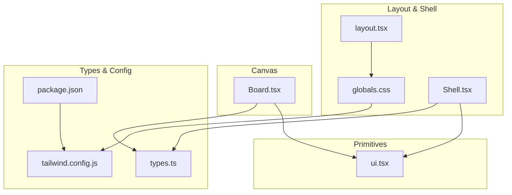

**Diagram sources**
- [ui.tsx:1-218](file://stepwise ai/app/components/ui.tsx#L1-L218)
- [Shell.tsx:1-124](file://stepwise ai/app/components/Shell.tsx#L1-L124)
- [Board.tsx:1-540](file://stepwise ai/app/components/board/Board.tsx#L1-L540)
- [types.ts:1-302](file://stepwise ai/app/lib/types.ts#L1-L302)
- [tailwind.config.js:1-57](file://stepwise ai/app/tailwind.config.js#L1-L57)
- [globals.css:1-67](file://stepwise ai/app/app/globals.css#L1-L67)
- [layout.tsx:1-17](file://stepwise ai/app/app/layout.tsx#L1-L17)
- [package.json:1-28](file://stepwise ai/app/package.json#L1-L28)

**Section sources**
- [ui.tsx:1-218](file://stepwise ai/app/components/ui.tsx#L1-L218)
- [Shell.tsx:1-124](file://stepwise ai/app/components/Shell.tsx#L1-L124)
- [Board.tsx:1-540](file://stepwise ai/app/components/board/Board.tsx#L1-L540)
- [types.ts:1-302](file://stepwise ai/app/lib/types.ts#L1-L302)
- [tailwind.config.js:1-57](file://stepwise ai/app/tailwind.config.js#L1-L57)
- [globals.css:1-67](file://stepwise ai/app/app/globals.css#L1-L67)
- [layout.tsx:1-17](file://stepwise ai/app/app/layout.tsx#L1-L17)
- [package.json:1-28](file://stepwise ai/app/package.json#L1-L28)

## Core Components
The primitive library provides a cohesive set of building blocks:
- Button: primary, secondary, ghost, danger variants; small, medium, large sizes; disabled state; accessible focus ring.
- Card: container with border, background, and shadow; supports dark mode.
- Input, Textarea, Select: labeled form controls with consistent borders, focus states, and optional hints; accessible label association.
- Badge: semantic status chips with multiple tones; always paired with text.
- Spinner: loading indicator with ARIA live region for screen readers.
- Alert: contextual messages (info, error, success, warning) with tone-based styling.
- EmptyState: placeholder content for empty data sets with optional action slot.
- DemoBanner: development banner to indicate demo mode.

Key API highlights:
- Props follow React native attribute patterns where applicable, extended with design-specific props like variant, size, tone, label, hint.
- Styling uses Tailwind utility classes with brand and ink color tokens, ensuring consistency across light/dark themes.
- Accessibility includes proper labels, roles, aria-live regions, and visible focus indicators.

**Section sources**
- [ui.tsx:10-218](file://stepwise ai/app/components/ui.tsx#L10-L218)
- [globals.css:24-38](file://stepwise ai/app/app/globals.css#L24-L38)
- [tailwind.config.js:5-53](file://stepwise ai/app/tailwind.config.js#L5-L53)

## Architecture Overview
The UI architecture separates concerns between primitives, layout/shell, and domain-specific components:
- Primitives encapsulate visual and interaction patterns without business logic.
- Shell orchestrates authentication, theme application, and navigation using primitives.
- Board composes primitives and domain types to provide an interactive learning canvas.
- Types define shared contracts for board objects, feedback, evaluation, and profiles.
- Tailwind config defines design tokens (colors, shadows, animations) used throughout.

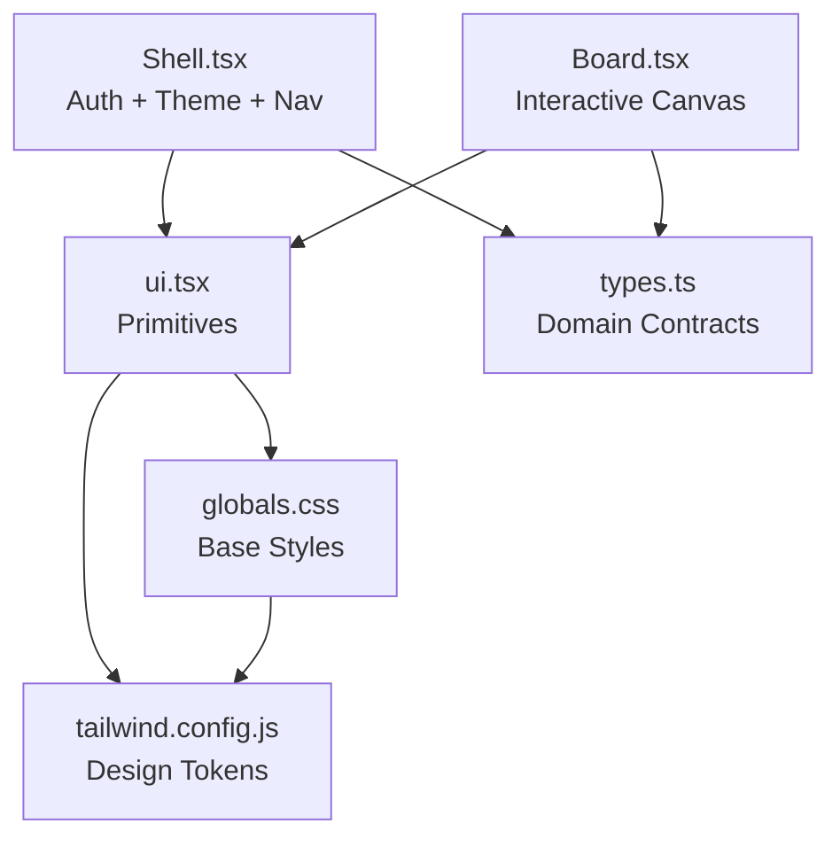

**Diagram sources**
- [ui.tsx:1-218](file://stepwise ai/app/components/ui.tsx#L1-L218)
- [Shell.tsx:1-124](file://stepwise ai/app/components/Shell.tsx#L1-L124)
- [Board.tsx:1-540](file://stepwise ai/app/components/board/Board.tsx#L1-L540)
- [types.ts:1-302](file://stepwise ai/app/lib/types.ts#L1-L302)
- [tailwind.config.js:1-57](file://stepwise ai/app/tailwind.config.js#L1-L57)
- [globals.css:1-67](file://stepwise ai/app/app/globals.css#L1-L67)

## Detailed Component Analysis

### Button
- Purpose: Primary call-to-action and secondary actions with consistent sizing and variants.
- Props:
  - variant: "primary" | "secondary" | "ghost" | "danger"
  - size: "sm" | "md" | "lg"
  - className: additional overrides
  - All standard HTML button attributes via spread
- Events: onClick, onKeyDown, etc., inherited from native button.
- Styling:
  - Base class ensures alignment, rounded corners, transitions, and disabled states.
  - Sizes control font size and padding.
  - Variants map to brand and ink colors with hover states and dark mode support.
- Accessibility:
  - Inherits native button semantics.
  - Focus-visible ring applied globally for clear focus indication.
- Usage patterns:
  - Use primary for main actions, secondary for less prominent actions, ghost for inline actions, danger for destructive actions.
  - Combine with icons or text as needed.

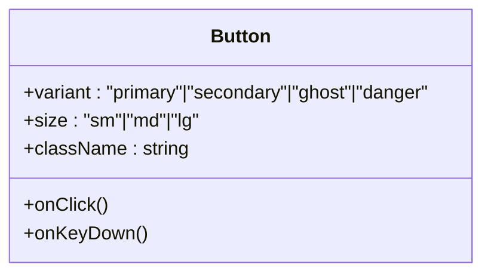

**Diagram sources**
- [ui.tsx:10-36](file://stepwise ai/app/components/ui.tsx#L10-L36)

**Section sources**
- [ui.tsx:10-36](file://stepwise ai/app/components/ui.tsx#L10-L36)
- [globals.css:24-38](file://stepwise ai/app/app/globals.css#L24-L38)

### Card
- Purpose: Container for grouped content with consistent border, background, and shadow.
- Props:
  - className: additional overrides
  - children: any React nodes
- Styling:
  - Light and dark backgrounds with borders and card shadow.
- Accessibility:
  - Semantic div; use within sections or panels with appropriate headings if needed.

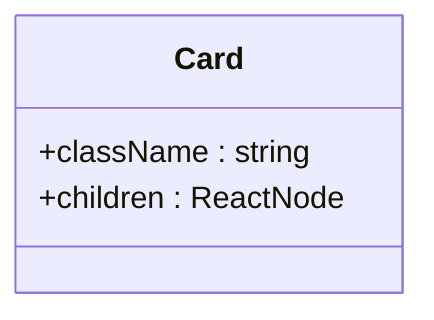

**Diagram sources**
- [ui.tsx:38-52](file://stepwise ai/app/components/ui.tsx#L38-L52)

**Section sources**
- [ui.tsx:38-52](file://stepwise ai/app/components/ui.tsx#L38-L52)

### Input, Textarea, Select
- Purpose: Form controls with labels, hints, and consistent styling.
- Props:
  - Input: label?, hint?, id?, plus all native input attributes
  - Textarea: label?, id?, plus all native textarea attributes
  - Select: label?, id?, children (options), plus all native select attributes
- Events: onChange, onBlur, onFocus, onSubmit (via parent form), etc.
- Styling:
  - Borders, focus rings, placeholders, and dark mode support.
  - Full width by default; can be wrapped in grids or flex layouts.
- Accessibility:
  - Label association via htmlFor/id for screen readers.
  - Native semantics ensure keyboard navigation and form validation.

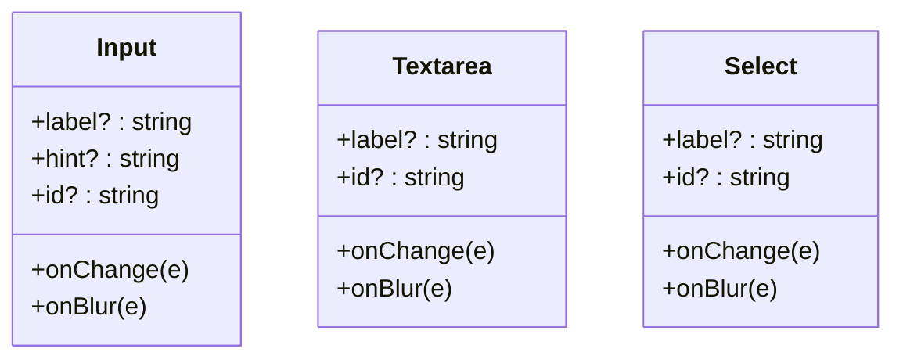

**Diagram sources**
- [ui.tsx:54-126](file://stepwise ai/app/components/ui.tsx#L54-L126)

**Section sources**
- [ui.tsx:54-126](file://stepwise ai/app/components/ui.tsx#L54-L126)

### Badge
- Purpose: Status chips with tone-based coloring.
- Props:
  - children: content
  - tone: "neutral" | "green" | "amber" | "red" | "blue" | "purple"
- Styling:
  - Rounded pill shape with tone-specific backgrounds and text colors; dark mode support.
- Accessibility:
  - Always pair with descriptive text; avoid relying solely on color.

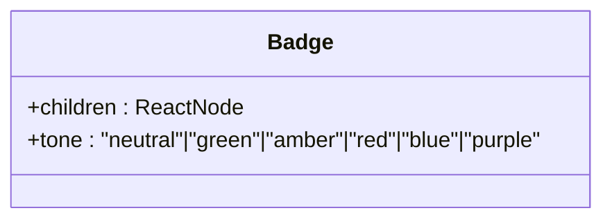

**Diagram sources**
- [ui.tsx:128-148](file://stepwise ai/app/components/ui.tsx#L128-L148)

**Section sources**
- [ui.tsx:128-148](file://stepwise ai/app/components/ui.tsx#L128-L148)

### Spinner
- Purpose: Loading indicator with accessible announcement.
- Props:
  - label?: string (default "Working...")
- Accessibility:
  - role="status" and aria-live="polite" for screen reader announcements.
- Styling:
  - Animated spinner using Tailwind animation utilities; brand-colored border.

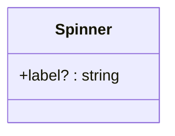

**Diagram sources**
- [ui.tsx:150-157](file://stepwise ai/app/components/ui.tsx#L150-L157)

**Section sources**
- [ui.tsx:150-157](file://stepwise ai/app/components/ui.tsx#L150-L157)

### Alert
- Purpose: Contextual messages for info, errors, success, and warnings.
- Props:
  - tone: "info" | "error" | "success" | "warning"
  - children: message content
- Styling:
  - Tone-based background and border; dark mode support.
- Accessibility:
  - Use semantic roles and ARIA attributes at the page level when necessary (e.g., aria-live for dynamic updates).

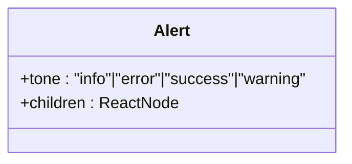

**Diagram sources**
- [ui.tsx:159-175](file://stepwise ai/app/components/ui.tsx#L159-L175)

**Section sources**
- [ui.tsx:159-175](file://stepwise ai/app/components/ui.tsx#L159-L175)

### EmptyState
- Purpose: Placeholder for empty datasets with title, message, icon, and optional action.
- Props:
  - icon?: string
  - title: string
  - message: string
  - action?: ReactNode
- Styling:
  - Centered layout with typography hierarchy and spacing.

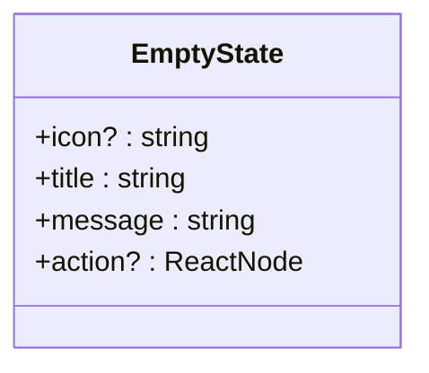

**Diagram sources**
- [ui.tsx:188-207](file://stepwise ai/app/components/ui.tsx#L188-L207)

**Section sources**
- [ui.tsx:188-207](file://stepwise ai/app/components/ui.tsx#L188-L207)

### DemoBanner
- Purpose: Development banner indicating demo mode usage.
- Props:
  - visible: boolean
- Styling:
  - Amber-themed banner with border and text; hidden when not visible.

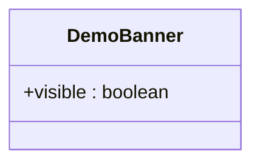

**Diagram sources**
- [ui.tsx:209-217](file://stepwise ai/app/components/ui.tsx#L209-L217)

**Section sources**
- [ui.tsx:209-217](file://stepwise ai/app/components/ui.tsx#L209-L217)

### Shell (App Layout)
- Purpose: Authenticated shell applying theme, showing navigation, and handling logout.
- Props:
  - children: page content
  - active: "home" | "journey" | "settings"
- Behavior:
  - Fetches user profile and applies theme (light/dark/system) and age band classes.
  - Redirects to onboarding if not onboarded; redirects to login on failure.
  - Displays DemoBanner based on provider mode.
- Accessibility:
  - Navigation uses aria-label for context.
  - Uses native Link elements for routing.

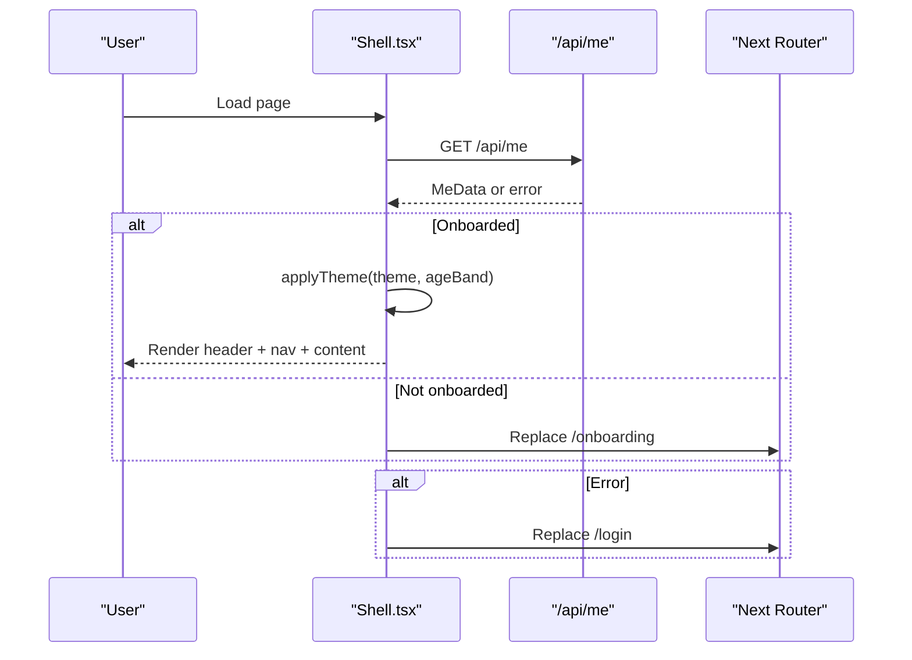

**Diagram sources**
- [Shell.tsx:27-79](file://stepwise ai/app/components/Shell.tsx#L27-L79)
- [Shell.tsx:54-62](file://stepwise ai/app/components/Shell.tsx#L54-L62)

**Section sources**
- [Shell.tsx:1-124](file://stepwise ai/app/components/Shell.tsx#L1-L124)

### Board (Interactive Canvas)
- Purpose: Spatial canvas for student thinking with draggable, resizable, editable objects; pan and zoom; persistence via callbacks.
- Props:
  - objects: array of BoardObject
  - tool: "select" | "text" | "draw" | "erase" | "pan"
  - readOnly: boolean
  - highlights: Record<objectId, FeedbackLabel>
  - onCommit(nextObjects): callback to persist changes
  - onEraseFeedback?(): optional callback when erasing feedback
- Interactions:
  - Pointer events for drag, resize, draw, erase.
  - Wheel zoom centered on cursor.
  - Keyboard shortcuts: Space for temporary pan, Delete/Backspace to remove selected student object, Escape to deselect or stop editing.
- Accessibility:
  - role="application" and aria-label for the canvas.
  - Resize handle has aria-label.
  - Editing textareas have aria-label.
- Rendering:
  - Objects sorted by z-index.
  - Highlights apply colored rings based on feedback labels.
  - Drawing objects render SVG polylines; text/formula objects render styled text areas.

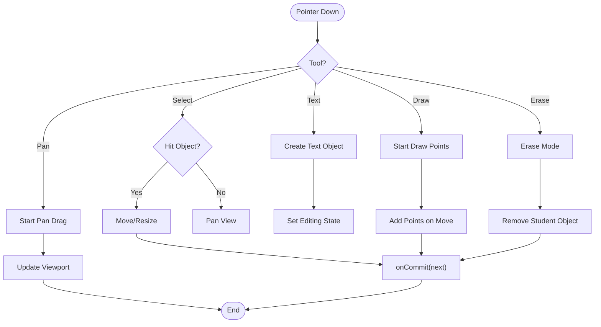

**Diagram sources**
- [Board.tsx:145-283](file://stepwise ai/app/components/board/Board.tsx#L145-L283)
- [Board.tsx:74-105](file://stepwise ai/app/components/board/Board.tsx#L74-L105)
- [Board.tsx:316-405](file://stepwise ai/app/components/board/Board.tsx#L316-L405)

**Section sources**
- [Board.tsx:1-540](file://stepwise ai/app/components/board/Board.tsx#L1-L540)
- [types.ts:26-57](file://stepwise ai/app/lib/types.ts#L26-L57)
- [types.ts:64-78](file://stepwise ai/app/lib/types.ts#L64-L78)

## Dependency Analysis
- Primitives depend on Tailwind design tokens and global focus styles.
- Shell depends on primitives (Spinner, DemoBanner) and domain types (MeData structure inferred from usage).
- Board depends on primitives (FEEDBACK_META) and domain types (BoardObject, FeedbackLabel).
- Types define shared contracts used across components.
- Global CSS provides base styles, focus rings, reduced motion support, and board surface visuals.

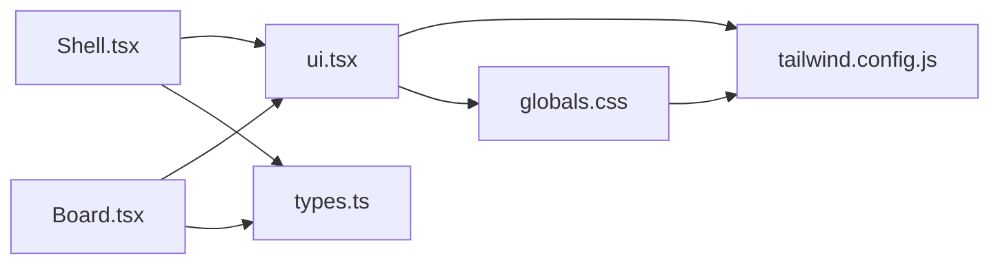

**Diagram sources**
- [ui.tsx:1-218](file://stepwise ai/app/components/ui.tsx#L1-L218)
- [Shell.tsx:1-124](file://stepwise ai/app/components/Shell.tsx#L1-L124)
- [Board.tsx:1-540](file://stepwise ai/app/components/board/Board.tsx#L1-L540)
- [types.ts:1-302](file://stepwise ai/app/lib/types.ts#L1-L302)
- [tailwind.config.js:1-57](file://stepwise ai/app/tailwind.config.js#L1-L57)
- [globals.css:1-67](file://stepwise ai/app/app/globals.css#L1-L67)

**Section sources**
- [ui.tsx:1-218](file://stepwise ai/app/components/ui.tsx#L1-L218)
- [Shell.tsx:1-124](file://stepwise ai/app/components/Shell.tsx#L1-L124)
- [Board.tsx:1-540](file://stepwise ai/app/components/board/Board.tsx#L1-L540)
- [types.ts:1-302](file://stepwise ai/app/lib/types.ts#L1-L302)
- [tailwind.config.js:1-57](file://stepwise ai/app/tailwind.config.js#L1-L57)
- [globals.css:1-67](file://stepwise ai/app/app/globals.css#L1-L67)

## Performance Considerations
- Primitives are lightweight and rely on Tailwind utilities; avoid excessive custom styles to keep bundle size minimal.
- Board performs frequent state updates during drag/resize; consider debouncing commits if integrating heavy persistence logic.
- Use readOnly mode for AI/system objects to reduce unnecessary interactions and re-renders.
- Leverage Tailwind’s dark mode via class strategy to minimize runtime toggles.
- Respect prefers-reduced-motion to disable animations for users who prefer reduced motion.

[No sources needed since this section provides general guidance]

## Troubleshooting Guide
Common issues and resolutions:
- Focus visibility missing: Ensure global focus-visible styles are applied; verify no custom outlines override defaults.
- Dark mode not switching: Confirm root element has correct class toggled by Shell; check Tailwind darkMode setting.
- Form inputs not announcing labels: Verify label htmlFor matches input id; ensure inputs are properly nested or associated.
- Spinner not announced: Confirm role="status" and aria-live="polite" are present; avoid hiding visually only.
- Board interactions blocked: Ensure pointer events are not intercepted by child elements; check editing state prevents canvas interactions.

**Section sources**
- [globals.css:24-38](file://stepwise ai/app/app/globals.css#L24-L38)
- [Shell.tsx:54-62](file://stepwise ai/app/components/Shell.tsx#L54-L62)
- [ui.tsx:54-126](file://stepwise ai/app/components/ui.tsx#L54-L126)
- [ui.tsx:150-157](file://stepwise ai/app/components/ui.tsx#L150-L157)
- [Board.tsx:145-205](file://stepwise ai/app/components/board/Board.tsx#L145-L205)

## Conclusion
StepWise’s UI primitives provide a consistent, accessible, and theme-aware foundation for building interactive learning experiences. By adhering to the documented APIs, leveraging Tailwind design tokens, and following accessibility guidelines, teams can maintain uniformity and extend components safely. The Board demonstrates how primitives integrate with domain types to create powerful, user-centric interfaces.

[No sources needed since this section summarizes without analyzing specific files]

## Appendices

### Accessibility Checklist
- Use semantic elements and native attributes where possible.
- Associate labels with inputs via htmlFor/id.
- Provide ARIA roles and live regions for dynamic content.
- Ensure visible focus indicators and keyboard navigation.
- Respect reduced motion preferences.

**Section sources**
- [globals.css:24-38](file://stepwise ai/app/app/globals.css#L24-L38)
- [ui.tsx:54-126](file://stepwise ai/app/components/ui.tsx#L54-L126)
- [ui.tsx:150-157](file://stepwise ai/app/components/ui.tsx#L150-L157)
- [Board.tsx:316-405](file://stepwise ai/app/components/board/Board.tsx#L316-L405)

### Theme Integration with Tailwind
- Brand and ink color scales define consistent palettes.
- Shadows and animations extend the design system.
- Dark mode toggled via class strategy; Shell applies theme classes based on user profile.
- Global CSS sets base typography, focus rings, and board surface visuals.

**Section sources**
- [tailwind.config.js:5-53](file://stepwise ai/app/tailwind.config.js#L5-L53)
- [Shell.tsx:54-62](file://stepwise ai/app/components/Shell.tsx#L54-L62)
- [globals.css:5-13](file://stepwise ai/app/app/globals.css#L5-L13)
- [globals.css:40-53](file://stepwise ai/app/app/globals.css#L40-L53)

### Responsive Behavior Guidelines
- Use Tailwind responsive prefixes for layout adjustments.
- Inputs and selects are full-width by default; wrap in grids for multi-column layouts.
- Board zoom and pan adapt to viewport size; ensure touch interactions are supported.

**Section sources**
- [ui.tsx:54-126](file://stepwise ai/app/components/ui.tsx#L54-L126)
- [Board.tsx:116-128](file://stepwise ai/app/components/board/Board.tsx#L116-L128)

### Extending Primitives
- Add new variants or sizes by extending prop unions and mapping to Tailwind classes.
- Maintain accessibility by preserving native semantics and adding ARIA attributes as needed.
- Keep styling consistent with existing tokens and avoid hardcoding colors.

**Section sources**
- [ui.tsx:10-36](file://stepwise ai/app/components/ui.tsx#L10-L36)
- [ui.tsx:128-148](file://stepwise ai/app/components/ui.tsx#L128-L148)