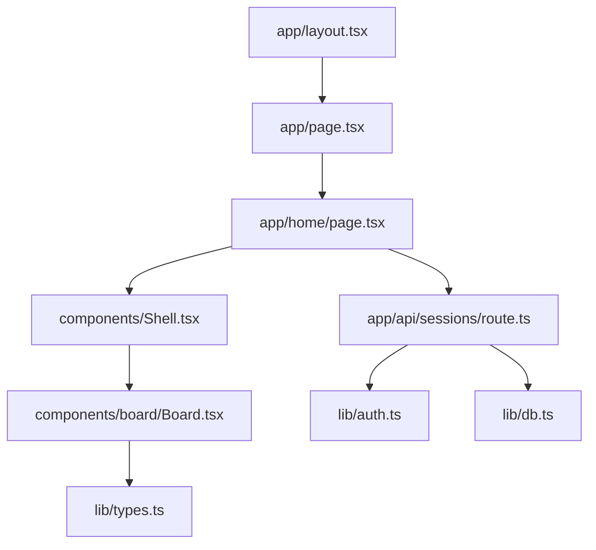
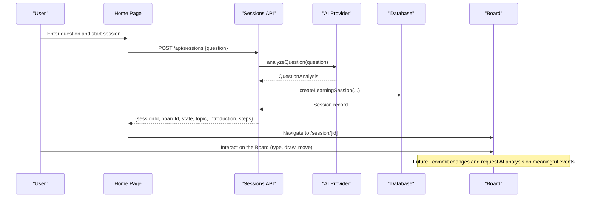
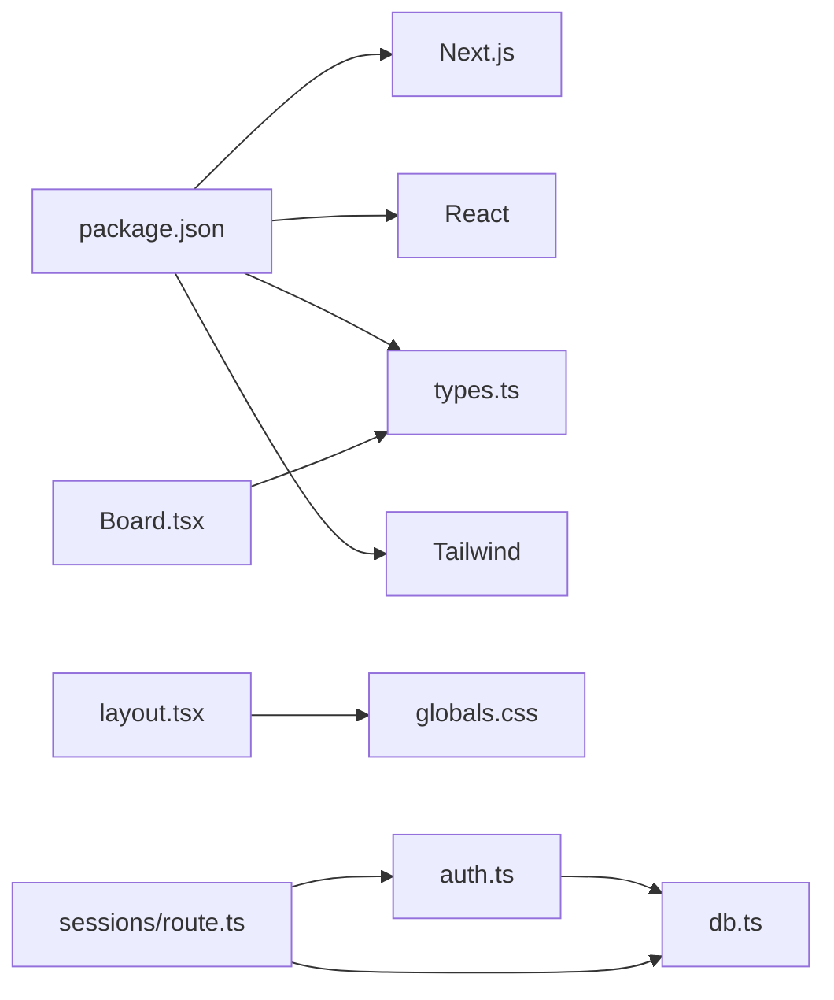

# Getting Started

<cite>
**Referenced Files in This Document**
- [package.json](file://stepwise ai/app/package.json)
- [next.config.js](file://stepwise ai/app/next.config.js)
- [layout.tsx](file://stepwise ai/app/app/layout.tsx)
- [page.tsx](file://stepwise ai/app/app/page.tsx)
- [home/page.tsx](file://stepwise ai/app/app/home/page.tsx)
- [Board.tsx](file://stepwise ai/app/components/board/Board.tsx)
- [Shell.tsx](file://stepwise ai/app/components/Shell.tsx)
- [auth.ts](file://stepwise ai/app/lib/auth.ts)
- [db.ts](file://stepwise ai/app/lib/db.ts)
- [types.ts](file://stepwise ai/app/lib/types.ts)
- [sessions/route.ts](file://stepwise ai/app/app/api/sessions/route.ts)
- [STEPWISE_MASTER_SPEC.md.txt](file://stepwise ai/specs/STEPWISE_MASTER_SPEC.md.txt)
</cite>

## Table of Contents
1. Introduction
2. Project Structure
3. Core Components
4. Architecture Overview
5. Detailed Component Analysis
6. Dependency Analysis
7. Performance Considerations
8. Troubleshooting Guide
9. Conclusion

## Introduction
StepWise AI is an interactive, AI-powered learning environment where the central workspace is a spatial Board. Instead of a traditional chat-only interface, students think and work directly on the Board by typing, drawing, moving objects, and annotating visuals. The AI observes the student’s work, detects errors or missing ideas, and provides adaptive hints and guidance. The goal is to help students learn by doing, not by passively reading answers.

Key principles:
- The Board is the classroom; your work is the evidence.
- The AI guides rather than solves for you.
- Feedback is visual and contextual, tied to specific parts of your Board.
- Learning is structured into steps with escalating support when needed.

This guide explains how to install, run, and use StepWise locally, and introduces the core concepts that make it different from typical chat-based learning tools.

## Project Structure
The application is a Next.js project located under stepwise ai/app. It includes:
- Pages and routes under app/ (Next.js App Router)
- Shared components under components/
- Domain types and utilities under lib/
- API routes under app/api/
- Product specifications under specs/

**Diagram sources**
- [layout.tsx:1-17](file://stepwise ai/app/app/layout.tsx#L1-L17)
- [page.tsx:1-18](file://stepwise ai/app/app/page.tsx#L1-L18)
- [home/page.tsx:1-172](file://stepwise ai/app/app/home/page.tsx#L1-L172)
- [Shell.tsx:1-124](file://stepwise ai/app/components/Shell.tsx#L1-L124)
- [Board.tsx:1-540](file://stepwise ai/app/components/board/Board.tsx#L1-L540)
- [sessions/route.ts:1-56](file://stepwise ai/app/app/api/sessions/route.ts#L1-L56)
- [auth.ts:1-139](file://stepwise ai/app/lib/auth.ts#L1-L139)
- [db.ts:1-224](file://stepwise ai/app/lib/db.ts#L1-L224)
- [types.ts:1-302](file://stepwise ai/app/lib/types.ts#L1-L302)

**Section sources**
- [package.json:1-28](file://stepwise ai/app/package.json#L1-L28)
- [next.config.js:1-7](file://stepwise ai/app/next.config.js#L1-L7)
- [layout.tsx:1-17](file://stepwise ai/app/app/layout.tsx#L1-L17)

## Core Components
- Root layout and routing: The root layout sets metadata and loads global styles. The root page redirects based on authentication and onboarding state.
- Home page: Where you enter a question to start a session. It lists ongoing and completed sessions and navigates to the active session.
- Shell: A shared authenticated shell that verifies sessions, applies adaptive themes, and provides navigation.
- Board: An interactive canvas supporting text, drawings, pan/zoom, selection, editing, and resizing. It integrates feedback highlights and supports keyboard shortcuts.
- Sessions API: Creates a learning session, analyzes the question via the AI abstraction, and returns session details to open the Board.
- Authentication and database: Secure session cookies and password hashing, plus an embedded JSON store for persistence during development.

**Section sources**
- [page.tsx:1-18](file://stepwise ai/app/app/page.tsx#L1-L18)
- [home/page.tsx:1-172](file://stepwise ai/app/app/home/page.tsx#L1-L172)
- [Shell.tsx:1-124](file://stepwise ai/app/components/Shell.tsx#L1-L124)
- [Board.tsx:1-540](file://stepwise ai/app/components/board/Board.tsx#L1-L540)
- [sessions/route.ts:1-56](file://stepwise ai/app/app/api/sessions/route.ts#L1-L56)
- [auth.ts:1-139](file://stepwise ai/app/lib/auth.ts#L1-L139)
- [db.ts:1-224](file://stepwise ai/app/lib/db.ts#L1-L224)
- [types.ts:1-302](file://stepwise ai/app/lib/types.ts#L1-L302)

## Architecture Overview
At a high level:
- The client renders pages using Next.js App Router.
- Authenticated flows are wrapped by Shell, which validates sessions and applies adaptive UI settings.
- The home page collects a question and calls /api/sessions to create a session.
- The server authenticates the request, uses the AI abstraction to analyze the question, persists session data, and returns session context to navigate to the Board.
- The Board manages local interactions and commits changes through callbacks; future integrations can persist updates and trigger AI analysis at meaningful events.

**Diagram sources**
- [home/page.tsx:35-59](file://stepwise ai/app/app/home/page.tsx#L35-L59)
- [sessions/route.ts:11-44](file://stepwise ai/app/app/api/sessions/route.ts#L11-L44)
- [types.ts:126-147](file://stepwise ai/app/lib/types.ts#L126-L147)

## Detailed Component Analysis

### Installation and Local Setup
- Node.js requirements: Use a recent LTS version compatible with Next.js 14.
- Install dependencies:
  - Run npm install inside the app directory to install React, Next.js, TypeScript, Tailwind, and other dev dependencies.
- Start the development server:
  - Run npm run dev to start the Next.js dev server on port 3000.
- Access the application:
  - Open http://localhost:3000 in your browser.
- Build and start production:
  - Run npm run build followed by npm start to serve the app on port 3000.

Notes:
- The root layout sets the app title and description.
- The package scripts define dev, build, and start commands.

**Section sources**
- [package.json:6-12](file://stepwise ai/app/package.json#L6-L12)
- [package.json:13-26](file://stepwise ai/app/package.json#L13-L26)
- [layout.tsx:4-8](file://stepwise ai/app/app/layout.tsx#L4-L8)

### Running the Application Locally
- After installing dependencies, run the dev server and open localhost:3000.
- If not logged in, you will be redirected to login. Create an account or log in to access the home page.
- On first login, you may be directed to onboarding to set preferences.

Behavior:
- The root page checks authentication and onboarding status and redirects accordingly.
- The Shell component verifies sessions and adapts the theme based on profile settings.

**Section sources**
- [page.tsx:7-17](file://stepwise ai/app/app/page.tsx#L7-L17)
- [Shell.tsx:38-62](file://stepwise ai/app/components/Shell.tsx#L38-L62)

### Creating Your First Learning Session
- From the home page, type a question in the input area.
- Click “Start Learning” or press Ctrl/Cmd + Enter.
- The system analyzes your question, creates a session, and navigates you to the session page where the Board opens.
- If the question needs clarification, the UI shows a message prompting you to add more detail.

What happens behind the scenes:
- The home page calls the sessions API with your question.
- The server validates the request, analyzes the question via the AI abstraction, creates a session, and returns session details.

**Section sources**
- [home/page.tsx:35-59](file://stepwise ai/app/app/home/page.tsx#L35-L59)
- [sessions/route.ts:11-44](file://stepwise ai/app/app/api/sessions/route.ts#L11-L44)

### Using the Board
The Board is your interactive workspace. You can:
- Add text: Select the text tool and click on the canvas to place a text box. Double-click to edit.
- Draw: Select the draw tool and sketch shapes or diagrams.
- Move and resize: Select an object and drag to move; use the resize handle to adjust size.
- Pan and zoom: Hold Space and drag to pan; use the mouse wheel or zoom controls to zoom in/out.
- Delete: Press Delete/Backspace to remove a selected student-owned object.
- Erase: Use the erase tool to remove objects by clicking them.

Feedback highlights:
- When the AI evaluates your work, relevant objects can be highlighted with color-coded rings indicating correctness, partial understanding, missing ideas, concept errors, or uncertainty.

Keyboard shortcuts:
- Space: temporary pan mode
- Delete/Backspace: remove selected student object
- Escape: deselect or stop editing

**Section sources**
- [Board.tsx:73-105](file://stepwise ai/app/components/board/Board.tsx#L73-L105)
- [Board.tsx:116-128](file://stepwise ai/app/components/board/Board.tsx#L116-L128)
- [Board.tsx:145-205](file://stepwise ai/app/components/board/Board.tsx#L145-L205)
- [Board.tsx:207-283](file://stepwise ai/app/components/board/Board.tsx#L207-L283)
- [Board.tsx:285-301](file://stepwise ai/app/components/board/Board.tsx#L285-L301)
- [Board.tsx:316-404](file://stepwise ai/app/components/board/Board.tsx#L316-L404)
- [Board.tsx:408-540](file://stepwise ai/app/components/board/Board.tsx#L408-L540)

### Basic Usage Examples
- Ask a conceptual question: Type something like “Explain how photosynthesis works” and start the session. The Board will open with AI-generated guidance and steps.
- Work through multi-step problems: Follow the AI’s instructions on the Board, type or draw your reasoning, and receive contextual feedback.
- Iterate and correct: When feedback indicates errors or missing ideas, revise your work on the Board and continue until you reach understanding.

How this differs from chat-based systems:
- In chat-only systems, you read answers and type responses in a linear thread.
- In StepWise, you actively construct your thinking on the Board while the AI observes and guides you in real time. Feedback is tied to specific parts of your work, making corrections and improvements more concrete and actionable.

**Section sources**
- [STEPWISE_MASTER_SPEC.md.txt:1-1](file://stepwise ai/specs/STEPWISE_MASTER_SPEC.md.txt#L1-L1)

## Dependency Analysis
Core runtime dependencies:
- Next.js, React, React DOM for the frontend and server-side rendering.
- TypeScript and Tailwind for type safety and styling.

Development dependencies include PostCSS, Autoprefixer, and TypeScript tooling.

Configuration:
- Next.js config enables strict React mode.
- Global styles are loaded in the root layout.

Data layer:
- The embedded JSON store persists users, sessions, boards, and related entities in a local file during development.
- Authentication uses secure session cookies and hashed passwords.

**Diagram sources**
- [package.json:13-26](file://stepwise ai/app/package.json#L13-L26)
- [next.config.js:1-7](file://stepwise ai/app/next.config.js#L1-L7)
- [layout.tsx:1-17](file://stepwise ai/app/app/layout.tsx#L1-L17)
- [auth.ts:1-139](file://stepwise ai/app/lib/auth.ts#L1-L139)
- [db.ts:1-224](file://stepwise ai/app/lib/db.ts#L1-L224)
- [sessions/route.ts:1-56](file://stepwise ai/app/app/api/sessions/route.ts#L1-L56)
- [Board.tsx:1-540](file://stepwise ai/app/components/board/Board.tsx#L1-L540)
- [types.ts:1-302](file://stepwise ai/app/lib/types.ts#L1-L302)

**Section sources**
- [package.json:13-26](file://stepwise ai/app/package.json#L13-L26)
- [next.config.js:1-7](file://stepwise ai/app/next.config.js#L1-L7)
- [db.ts:1-224](file://stepwise ai/app/lib/db.ts#L1-L224)
- [auth.ts:1-139](file://stepwise ai/app/lib/auth.ts#L1-L139)

## Performance Considerations
- The Board is designed to feel immediate. Avoid sending AI requests for every keystroke or mouse movement.
- Use local state and optimistic updates for responsiveness.
- Persist changes efficiently and debounce heavy operations.
- Keep rendering efficient by leveraging React best practices and avoiding unnecessary re-renders.
- Ensure responsive behavior across devices without sacrificing the Board’s primary role as the workspace.

[No sources needed since this section provides general guidance]

## Troubleshooting Guide
Common setup issues and resolutions:
- Port already in use:
  - The dev server runs on port 3000 by default. If another process is using the port, stop the conflicting process or change the port configuration.
- Missing dependencies:
  - Ensure you ran npm install in the app directory before starting the server.
- Authentication redirect loop:
  - Verify that your session cookie is being set and that the AUTH_SECRET environment variable is configured if required by your deployment.
- Database file not found:
  - The embedded store writes to a JSON file in the data directory. Ensure the directory exists and has write permissions.
- Environment variables:
  - For production-like behavior, set AUTH_SECRET. Development allows a fallback secret but should not be used in production.

Where to look:
- Scripts and ports are defined in package.json.
- Authentication and session handling are implemented in auth.ts.
- Data persistence is managed by db.ts.
- Routing and redirects are handled in page.tsx and Shell.tsx.

**Section sources**
- [package.json:6-12](file://stepwise ai/app/package.json#L6-L12)
- [auth.ts:12-22](file://stepwise ai/app/lib/auth.ts#L12-L22)
- [auth.ts:59-71](file://stepwise ai/app/lib/auth.ts#L59-L71)
- [db.ts:66-94](file://stepwise ai/app/lib/db.ts#L66-L94)
- [page.tsx:7-17](file://stepwise ai/app/app/page.tsx#L7-L17)
- [Shell.tsx:38-62](file://stepwise ai/app/components/Shell.tsx#L38-L62)

## Conclusion
You now have the essentials to install, run, and use StepWise AI locally. Start by entering a question on the home page to open your first Board session. Use the Board to think visually and interactively, and let the AI guide you with contextual feedback. Remember: the Board is your workspace, the AI is your teacher, and your work is the evidence of learning. As you become comfortable, explore the full range of Board features and leverage the adaptive guidance to deepen your understanding.

[No sources needed since this section summarizes without analyzing specific files]