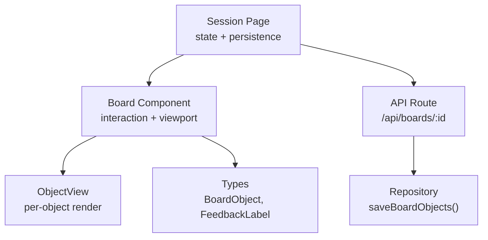
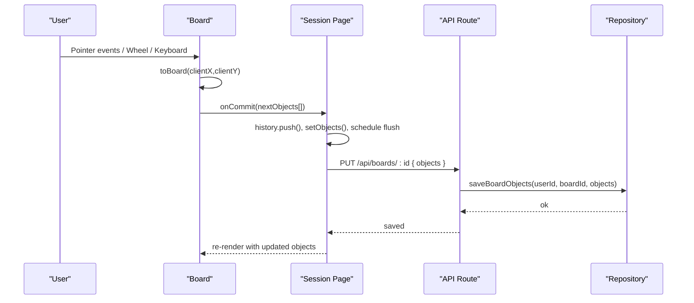
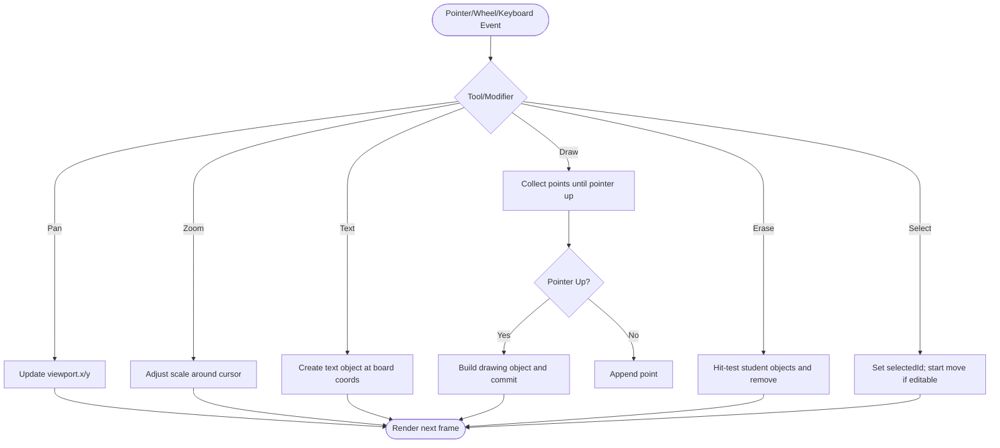
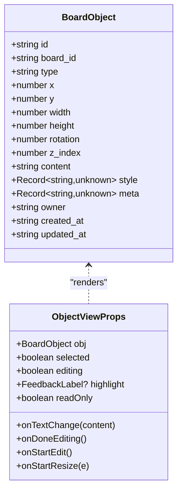
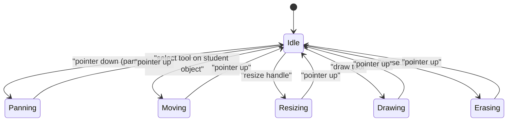
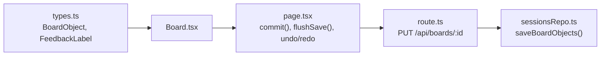

# Board Architecture & Core Components

<cite>
**Referenced Files in This Document**
- [Board.tsx](file://stepwise ai/app/components/board/Board.tsx)
- [types.ts](file://stepwise ai/app/lib/types.ts)
- [page.tsx](file://stepwise ai/app/app/session/[id]/page.tsx)
- [route.ts](file://stepwise ai/app/app/api/boards/[id]/route.ts)
- [sessionsRepo.ts](file://stepwise ai/app/lib/sessionsRepo.ts)
</cite>

## Table of Contents
1. [Introduction](#introduction)
2. [Project Structure](#project-structure)
3. [Core Components](#core-components)
4. [Architecture Overview](#architecture-overview)
5. [Detailed Component Analysis](#detailed-component-analysis)
6. [Dependency Analysis](#dependency-analysis)
7. [Performance Considerations](#performance-considerations)
8. [Troubleshooting Guide](#troubleshooting-guide)
9. [Conclusion](#conclusion)

## Introduction
This document explains the Interactive Board’s core architecture with a focus on:
- The main Board component structure and its relationship to ObjectView
- Viewport management (pan and zoom) and coordinate transformation between client and board coordinates
- The object model (BoardObject interface) and how different object types are handled
- The rendering pipeline that sorts objects by z-index and renders them in order
- State management using React hooks for view state, drag state, selection state, and editing state
- Examples of handling text, drawing, and formula objects
- How the Board integrates with the parent page for persistence and undo/redo

## Project Structure
The interactive board is implemented as a client-side React component within a Next.js application. The key files involved are:
- Board component and internal ObjectView renderer
- Shared type definitions for BoardObject and related models
- Session page that owns board state, persistence, and undo/redo
- API route and repository for saving board snapshots

**Diagram sources**
- [page.tsx:100-146](file://stepwise ai/app/app/session/[id]/page.tsx#L100-L146)
- [Board.tsx:44-406](file://stepwise ai/app/components/board/Board.tsx#L44-L406)
- [Board.tsx:408-539](file://stepwise ai/app/components/board/Board.tsx#L408-L539)
- [types.ts:26-57](file://stepwise ai/app/lib/types.ts#L26-L57)
- [route.ts:68-84](file://stepwise ai/app/app/api/boards/[id]/route.ts#L68-L84)
- [sessionsRepo.ts:206-244](file://stepwise ai/app/lib/sessionsRepo.ts#L206-L244)

**Section sources**
- [Board.tsx:44-406](file://stepwise ai/app/components/board/Board.tsx#L44-L406)
- [types.ts:26-57](file://stepwise ai/app/lib/types.ts#L26-L57)
- [page.tsx:100-146](file://stepwise ai/app/app/session/[id]/page.tsx#L100-L146)
- [route.ts:68-84](file://stepwise ai/app/app/api/boards/[id]/route.ts#L68-L84)
- [sessionsRepo.ts:206-244](file://stepwise ai/app/lib/sessionsRepo.ts#L206-L244)

## Core Components
- Board: Manages viewport (pan/zoom), pointer interactions, tool modes, selection, editing, and delegates per-object rendering to ObjectView. It also computes board coordinates from client events and sorts objects by z-index before rendering.
- ObjectView: Renders an individual BoardObject based on its type (text, formula, drawing), supports editing mode for text-like content, shows selection and feedback highlights, and exposes resize handles for student-owned objects.
- Types: Define the canonical BoardObject shape and related enums used across the app.

Key responsibilities:
- Coordinate transforms: Convert client pointer positions to board coordinates using current viewport transform.
- Viewport control: Pan via pointer drag or space+drag; zoom via wheel centered on cursor and via UI buttons.
- Interaction: Create text/drawing objects, move/resize/select/delete, erase by hit-testing bounding boxes.
- Rendering: Sort objects by z_index and render each through ObjectView with appropriate styles and overlays.

**Section sources**
- [Board.tsx:15-26](file://stepwise ai/app/components/board/Board.tsx#L15-L26)
- [Board.tsx:107-128](file://stepwise ai/app/components/board/Board.tsx#L107-L128)
- [Board.tsx:145-283](file://stepwise ai/app/components/board/Board.tsx#L145-L283)
- [Board.tsx:314-364](file://stepwise ai/app/components/board/Board.tsx#L314-L364)
- [Board.tsx:408-539](file://stepwise ai/app/components/board/Board.tsx#L408-L539)
- [types.ts:26-57](file://stepwise ai/app/lib/types.ts#L26-L57)

## Architecture Overview
The Board is a self-contained interactive canvas. It receives the current list of BoardObject instances and a commit callback from the parent session page. All mutations go through onCommit, which the parent uses to update local state, persist changes, and manage undo/redo.

**Diagram sources**
- [Board.tsx:107-128](file://stepwise ai/app/components/board/Board.tsx#L107-L128)
- [Board.tsx:145-283](file://stepwise ai/app/components/board/Board.tsx#L145-L283)
- [page.tsx:100-146](file://stepwise ai/app/app/session/[id]/page.tsx#L100-L146)
- [route.ts:68-84](file://stepwise ai/app/app/api/boards/[id]/route.ts#L68-L84)
- [sessionsRepo.ts:206-244](file://stepwise ai/app/lib/sessionsRepo.ts#L206-L244)

## Detailed Component Analysis

### Board Component: Viewport, Interactions, and Rendering Pipeline
- Viewport state: Holds x, y, scale and is applied via CSS transform to a container element.
- Coordinate transformation: toBoard maps client pointer coordinates to board coordinates by subtracting viewport offset and dividing by scale.
- Pan: Pointer drag when tool is pan, Space held, or middle mouse button; updates viewport x/y.
- Zoom: Wheel event adjusts scale while keeping the cursor point stationary; UI buttons adjust scale uniformly.
- Tool modes: select, text, draw, erase, pan. Each mode changes pointer behavior and creates or modifies objects accordingly.
- Selection and editing: selectedId tracks the focused object; editingId toggles inline editing for text-like objects.
- Rendering pipeline: Objects are sorted by z_index and rendered sequentially; ObjectView applies absolute positioning and z-index to ensure correct stacking.

**Diagram sources**
- [Board.tsx:107-128](file://stepwise ai/app/components/board/Board.tsx#L107-L128)
- [Board.tsx:145-283](file://stepwise ai/app/components/board/Board.tsx#L145-L283)
- [Board.tsx:314-364](file://stepwise ai/app/components/board/Board.tsx#L314-L364)

**Section sources**
- [Board.tsx:15-26](file://stepwise ai/app/components/board/Board.tsx#L15-L26)
- [Board.tsx:107-128](file://stepwise ai/app/components/board/Board.tsx#L107-L128)
- [Board.tsx:145-283](file://stepwise ai/app/components/board/Board.tsx#L145-L283)
- [Board.tsx:314-364](file://stepwise ai/app/components/board/Board.tsx#L314-L364)

### ObjectView Component: Per-Object Rendering and Editing
- Type-based rendering:
  - Drawing: Parses JSON content into points and color; renders an SVG polyline.
  - Text/Formulas: Displays content in a styled div; enters editing mode via double-click to show a textarea.
  - Other types: Rendered as generic content containers with owner-specific styling.
- Selection and feedback: Applies ring styles for selection and highlight overlays based on feedback labels.
- Editability: Only student-owned objects can be edited or resized unless explicitly allowed.
- Resize handle: Visible when selected and editable; triggers resize drag mode in Board.

**Diagram sources**
- [types.ts:26-57](file://stepwise ai/app/lib/types.ts#L26-L57)
- [Board.tsx:408-539](file://stepwise ai/app/components/board/Board.tsx#L408-L539)

**Section sources**
- [Board.tsx:408-539](file://stepwise ai/app/components/board/Board.tsx#L408-L539)
- [types.ts:26-57](file://stepwise ai/app/lib/types.ts#L26-L57)

### State Management with React Hooks
- View state: useState for viewport (x, y, scale).
- Drag state: Discriminated union for pan/move/resize/draw modes; stored in state and mirrored in refs for performance during pointer moves.
- Selection state: selectedId controls which object is highlighted and potentially moved/resized.
- Editing state: editingId toggles inline editing for text-like objects.
- Temporary pan: spaceDown flag enables temporary pan mode without changing tool.
- Refs: objectsRef, dragRef, viewRef keep latest values accessible inside event handlers without stale closures.

**Diagram sources**
- [Board.tsx:21-26](file://stepwise ai/app/components/board/Board.tsx#L21-L26)
- [Board.tsx:59-71](file://stepwise ai/app/components/board/Board.tsx#L59-L71)
- [Board.tsx:145-283](file://stepwise ai/app/components/board/Board.tsx#L145-L283)

**Section sources**
- [Board.tsx:59-71](file://stepwise ai/app/components/board/Board.tsx#L59-L71)
- [Board.tsx:145-283](file://stepwise ai/app/components/board/Board.tsx#L145-L283)

### Handling Different Object Types
- Text: Created at board coordinates with default dimensions; editable via double-click; updates propagate through onCommit.
- Formula: Treated similarly to text for display and editing; owner determines editability.
- Drawing: Captured as a sequence of points; on pointer up, a new drawing object is created with computed bounds and serialized points.

Examples of creation and rendering flows:
- Text creation flow: pointer down in text mode → create BoardObject → commit → ObjectView renders textarea in editing mode.
- Drawing creation flow: pointer down in draw mode → collect points → pointer up → compute bounds → create BoardObject → ObjectView renders SVG polyline.

**Section sources**
- [Board.tsx:155-183](file://stepwise ai/app/components/board/Board.tsx#L155-L183)
- [Board.tsx:250-283](file://stepwise ai/app/components/board/Board.tsx#L250-L283)
- [Board.tsx:432-492](file://stepwise ai/app/components/board/Board.tsx#L432-L492)

### Relationship Between Board and ObjectView
- Board owns global state (viewport, tools, selection, editing) and orchestrates interactions.
- ObjectView is a presentational component that renders a single BoardObject according to its type and state flags passed from Board.
- Board passes callbacks to ObjectView for text edits, editing lifecycle, and resize initiation, ensuring all mutations flow back through Board’s commit path.

**Section sources**
- [Board.tsx:314-364](file://stepwise ai/app/components/board/Board.tsx#L314-L364)
- [Board.tsx:408-539](file://stepwise ai/app/components/board/Board.tsx#L408-L539)

## Dependency Analysis
- Board depends on shared types for BoardObject and FeedbackLabel.
- Board emits mutations via onCommit to the parent session page.
- Session page manages undo/redo history and persists board snapshots to the server via API route.
- API route validates ownership and delegates to repository to atomically replace board objects.
- Repository serializes BoardObject arrays to database rows and provides safe parsing for JSON fields.

**Diagram sources**
- [types.ts:26-57](file://stepwise ai/app/lib/types.ts#L26-L57)
- [Board.tsx:44-406](file://stepwise ai/app/components/board/Board.tsx#L44-L406)
- [page.tsx:100-146](file://stepwise ai/app/app/session/[id]/page.tsx#L100-L146)
- [route.ts:68-84](file://stepwise ai/app/app/api/boards/[id]/route.ts#L68-L84)
- [sessionsRepo.ts:206-244](file://stepwise ai/app/lib/sessionsRepo.ts#L206-L244)

**Section sources**
- [types.ts:26-57](file://stepwise ai/app/lib/types.ts#L26-L57)
- [Board.tsx:44-406](file://stepwise ai/app/components/board/Board.tsx#L44-L406)
- [page.tsx:100-146](file://stepwise ai/app/app/session/[id]/page.tsx#L100-L146)
- [route.ts:68-84](file://stepwise ai/app/app/api/boards/[id]/route.ts#L68-L84)
- [sessionsRepo.ts:206-244](file://stepwise ai/app/lib/sessionsRepo.ts#L206-L244)

## Performance Considerations
- Sorting objects by z-index on every render ensures correct stacking but may be costly with large boards; consider memoization or incremental sorting if needed.
- Using refs for frequently accessed mutable values (objects, drag, view) avoids stale closures and reduces unnecessary re-renders during pointer moves.
- Debounced persistence via timer prevents excessive network calls during rapid edits.
- Minimum size constraints on resize prevent degenerate layouts and reduce layout thrashing.

[No sources needed since this section provides general guidance]

## Troubleshooting Guide
- Objects not editable: Ensure owner is "student" and readOnly prop is false; only student-owned objects allow editing and resizing.
- Deletion not working: Delete/Backspace removes only selected student-owned objects; verify selection and ownership.
- Pan/zoom issues: Wheel zoom centers on cursor; reset view button restores default viewport. If panning feels stuck, check for active editing state that may intercept events.
- Persistence errors: Save status cycles through saving/saved/error; network failures will surface as error state. Verify API route ownership checks and repository transaction success.

**Section sources**
- [Board.tsx:73-105](file://stepwise ai/app/components/board/Board.tsx#L73-L105)
- [Board.tsx:130-143](file://stepwise ai/app/components/board/Board.tsx#L130-L143)
- [Board.tsx:299-301](file://stepwise ai/app/components/board/Board.tsx#L299-L301)
- [page.tsx:100-146](file://stepwise ai/app/app/session/[id]/page.tsx#L100-L146)

## Conclusion
The Interactive Board centers around a robust Board component that manages viewport interactions, coordinate transformations, and a clear rendering pipeline ordered by z-index. The BoardObject model defines a consistent schema for all objects, enabling flexible rendering and editing through ObjectView. State is managed with React hooks and refs to balance correctness and performance, while the parent session page coordinates persistence and undo/redo. Together, these pieces provide a responsive, extensible canvas for text, formulas, drawings, and future object types.