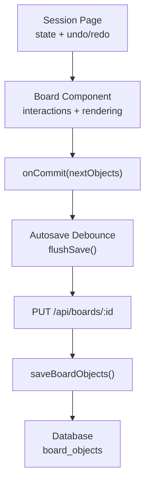
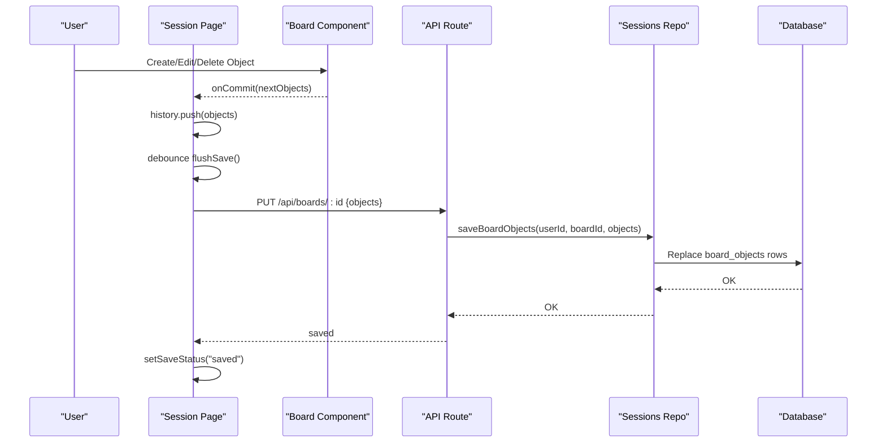
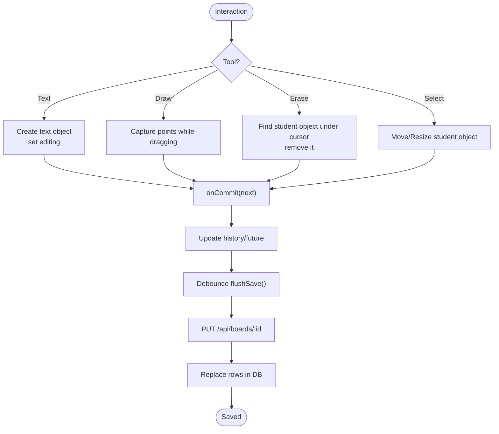
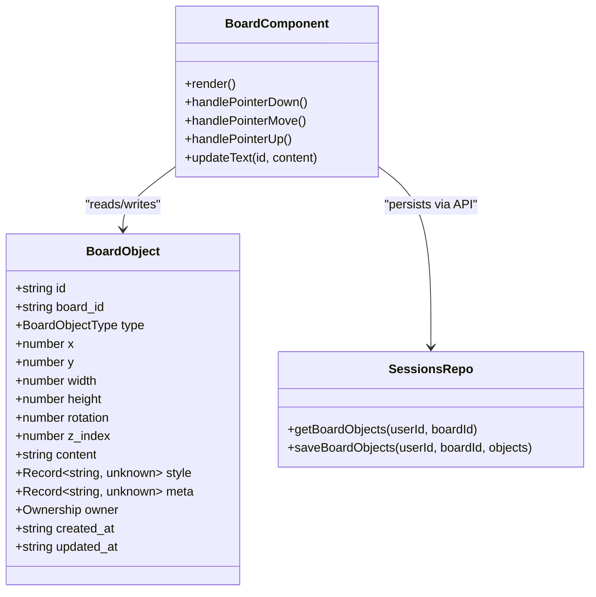
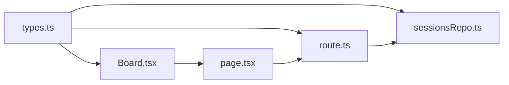

# Board Objects & Content Types

<cite>
**Referenced Files in This Document**
- [Board.tsx](file://stepwise ai/app/components/board/Board.tsx)
- [types.ts](file://stepwise ai/app/lib/types.ts)
- [sessionsRepo.ts](file://stepwise ai/app/lib/sessionsRepo.ts)
- [route.ts](file://stepwise ai/app/app/api/boards/[id]/route.ts)
- [page.tsx](file://stepwise ai/app/app/session/[id]/page.tsx)
</cite>

## Table of Contents
1. [Introduction](#introduction)
2. [Project Structure](#project-structure)
3. [Core Components](#core-components)
4. [Architecture Overview](#architecture-overview)
5. [Detailed Component Analysis](#detailed-component-analysis)
6. [Dependency Analysis](#dependency-analysis)
7. [Performance Considerations](#performance-considerations)
8. [Troubleshooting Guide](#troubleshooting-guide)
9. [Conclusion](#conclusion)
10. [Appendices](#appendices)

## Introduction
This document explains the board object model and content types used by the interactive learning board. It covers the BoardObject data structure, supported object types (text, drawing, formula), ownership semantics (student-owned vs AI/system-owned), and the full lifecycle from creation to editing to deletion and persistence via onCommit. It also provides guidance for extending object behaviors and implementing custom rendering logic.

## Project Structure
The board system spans a few key files:
- The client-side canvas component that renders and manipulates objects
- Shared type definitions for board objects and related models
- Server-side repository functions for loading and saving board snapshots
- API routes that validate and persist board state
- Session page that wires user interactions to the board and orchestrates autosave

**Diagram sources**
- [page.tsx:100-130](file://stepwise ai/app/app/session/[id]/page.tsx#L100-L130)
- [Board.tsx:118-297](file://stepwise ai/app/components/board/Board.tsx#L118-L297)
- [route.ts:43-85](file://stepwise ai/app/app/api/boards/[id]/route.ts#L43-L85)
- [sessionsRepo.ts:239-265](file://stepwise ai/app/lib/sessionsRepo.ts#L239-L265)

**Section sources**
- [Board.tsx:1-540](file://stepwise ai/app/components/board/Board.tsx#L1-L540)
- [types.ts:26-57](file://stepwise ai/app/lib/types.ts#L26-L57)
- [sessionsRepo.ts:198-265](file://stepwise ai/app/lib/sessionsRepo.ts#L198-L265)
- [route.ts:10-85](file://stepwise ai/app/app/api/boards/[id]/route.ts#L10-L85)
- [page.tsx:100-130](file://stepwise ai/app/app/session/[id]/page.tsx#L100-L130)

## Core Components
- BoardObject: The canonical shape of every item on the board, including identity, geometry, content, styling, metadata, ownership, and timestamps.
- Ownership: Distinguishes student-owned (editable) from AI/system-owned (read-only).
- Supported types: text, handwriting, drawing, shape, connector, image, note, formula, annotation, visual.
- Rendering: The board renders different visuals based on type and ownership; drawings are rendered as SVG polylines; text/formula render as editable or static text blocks.
- Lifecycle: Creation via tools, editing via double-click or inline controls, deletion via erase tool or keyboard, and persistence through an onCommit callback that triggers debounced autosave to the server.

Key responsibilities:
- Board.tsx: Handles pointer events, pan/zoom, drag/move/resize/draw, selection, editing, and rendering per object type.
- types.ts: Defines BoardObjectType, Ownership, and the BoardObject interface.
- sessionsRepo.ts: Loads and persists board snapshots with validation and sanitization.
- route.ts: Validates incoming objects and enforces allowed types and owners.
- page.tsx: Wires up the session UI, manages undo/redo, and coordinates autosave.

**Section sources**
- [types.ts:26-57](file://stepwise ai/app/lib/types.ts#L26-L57)
- [Board.tsx:145-297](file://stepwise ai/app/components/board/Board.tsx#L145-L297)
- [sessionsRepo.ts:198-265](file://stepwise ai/app/lib/sessionsRepo.ts#L198-L265)
- [route.ts:10-85](file://stepwise ai/app/app/api/boards/[id]/route.ts#L10-L85)
- [page.tsx:100-130](file://stepwise ai/app/app/session/[id]/page.tsx#L100-L130)

## Architecture Overview
The board is a client-driven spatial canvas backed by optimistic updates and debounced server persistence.

**Diagram sources**
- [Board.tsx:145-297](file://stepwise ai/app/components/board/Board.tsx#L145-L297)
- [page.tsx:100-130](file://stepwise ai/app/app/session/[id]/page.tsx#L100-L130)
- [route.ts:43-85](file://stepwise ai/app/app/api/boards/[id]/route.ts#L43-L85)
- [sessionsRepo.ts:239-265](file://stepwise ai/app/lib/sessionsRepo.ts#L239-L265)

## Detailed Component Analysis

### BoardObject Data Model
- Identity and association: id, board_id
- Geometry: x, y, width, height, rotation, z_index
- Content and presentation: content (string payload), style (arbitrary JSON), meta (arbitrary JSON)
- Ownership and provenance: owner (student, ai, system, imported), created_at, updated_at

Notes:
- Width and height are clamped server-side to safe bounds.
- Content is truncated to a maximum length on the server.
- Style and meta are persisted as JSON and parsed back into objects.

**Section sources**
- [types.ts:26-57](file://stepwise ai/app/lib/types.ts#L26-L57)
- [sessionsRepo.ts:206-233](file://stepwise ai/app/lib/sessionsRepo.ts#L206-L233)
- [sessionsRepo.ts:239-265](file://stepwise ai/app/lib/sessionsRepo.ts#L239-L265)

### Supported Object Types and Content Formats
- text: Editable text block. Content is plain text. Renders as a textarea when editing; otherwise displays formatted text.
- drawing: Freehand sketch. Content is a JSON string containing points array and color. Rendered as an SVG polyline.
- formula: Treated like text for rendering/editing in this implementation. Content is stored as a string; can be extended to support rich math rendering.
- Other declared types (handwriting, shape, connector, image, note, annotation, visual) are recognized by the server but not actively created or rendered by the current board UI. They remain available for future extensions.

Rendering behavior:
- Drawing objects parse their content to extract points and color and render an SVG path.
- Text and formula objects use a shared text rendering path; when editing, they show a textarea bound to content.

**Section sources**
- [Board.tsx:433-492](file://stepwise ai/app/components/board/Board.tsx#L433-L492)
- [route.ts:10-21](file://stepwise ai/app/app/api/boards/[id]/route.ts#L10-L21)

### Ownership Model
- Student-owned objects are fully editable: movable, resizable, deletable, and editable via double-click.
- AI/system-owned objects are read-only: cannot be moved, resized, edited, or deleted by the student. They may carry visual indicators (e.g., badges) and distinct styling.
- Ownership is enforced both in the UI (interaction gating) and on the server (validation of owner field).

**Section sources**
- [Board.tsx:84-90](file://stepwise ai/app/components/board/Board.tsx#L84-L90)
- [Board.tsx:197-200](file://stepwise ai/app/components/board/Board.tsx#L197-L200)
- [Board.tsx:343-348](file://stepwise ai/app/components/board/Board.tsx#L343-L348)
- [Board.tsx:519-523](file://stepwise ai/app/components/board/Board.tsx#L519-L523)
- [route.ts:22-26](file://stepwise ai/app/app/api/boards/[id]/route.ts#L22-L26)
- [route.ts:58-59](file://stepwise ai/app/app/api/boards/[id]/route.ts#L58-L59)

### Object Lifecycle
Creation:
- Text: Select the text tool and click on the canvas to create a new text object at the clicked position.
- Drawing: Select the draw tool and drag to capture points; on pointer up, a drawing object is created with bounding box and serialized points.
- Formula: Use the same text flow; treat content as formula text.

Editing:
- Double-click any non-drawing object to enter edit mode; changes are committed via onCommit.
- Move and resize student-owned objects using pointer interactions.

Deletion:
- Erase tool removes student-owned objects under the cursor.
- Keyboard Delete/Backspace removes the selected student-owned object.

Persistence:
- Every change calls onCommit with the next object list.
- The session page maintains undo/redo history and debounces saves to the server via flushSave.
- The API validates and persists the snapshot atomically.

**Diagram sources**
- [Board.tsx:145-297](file://stepwise ai/app/components/board/Board.tsx#L145-L297)
- [page.tsx:118-130](file://stepwise ai/app/app/session/[id]/page.tsx#L118-L130)
- [route.ts:43-85](file://stepwise ai/app/app/api/boards/[id]/route.ts#L43-L85)
- [sessionsRepo.ts:239-265](file://stepwise ai/app/lib/sessionsRepo.ts#L239-L265)

**Section sources**
- [Board.tsx:145-297](file://stepwise ai/app/components/board/Board.tsx#L145-L297)
- [page.tsx:118-158](file://stepwise ai/app/app/session/[id]/page.tsx#L118-L158)
- [route.ts:43-85](file://stepwise ai/app/app/api/boards/[id]/route.ts#L43-L85)
- [sessionsRepo.ts:239-265](file://stepwise ai/app/lib/sessionsRepo.ts#L239-L265)

### Rendering Logic by Type
- Drawing: Parses content JSON to get points and color; renders an SVG polyline within the object’s bounding box.
- Text/Formula: When editing, shows a textarea bound to content; otherwise displays content as preformatted text with owner-based styling.
- Non-drawing objects receive selection rings and optional feedback highlights; AI/system objects display distinct borders and badges.

**Diagram sources**
- [types.ts:26-57](file://stepwise ai/app/lib/types.ts#L26-L57)
- [Board.tsx:408-539](file://stepwise ai/app/components/board/Board.tsx#L408-L539)
- [sessionsRepo.ts:198-265](file://stepwise ai/app/lib/sessionsRepo.ts#L198-L265)

**Section sources**
- [Board.tsx:408-539](file://stepwise ai/app/components/board/Board.tsx#L408-L539)
- [sessionsRepo.ts:198-233](file://stepwise ai/app/lib/sessionsRepo.ts#L198-L233)

### Extending Object Behaviors and Rendering
To add or extend object types:
- Declare the new type in the shared type definition if needed.
- Add the type to the server’s allowed set so it can be persisted.
- Implement rendering in the board’s object view branch for the new type.
- If creation is supported, add tool-specific logic to construct a BoardObject with appropriate content format.
- Ensure ownership rules apply consistently (e.g., prevent editing AI/system objects).

Examples:
- Creating a new “shape” object:
  - Extend BoardObjectType and server validation to include “shape”.
  - In the board, add a shape creation flow that sets content to a shape descriptor (e.g., { kind: "rect", radius: ... }).
  - Implement rendering logic to draw the shape in the object’s bounding box.
- Customizing formula rendering:
  - Keep type as “formula” and store LaTeX or MathML in content.
  - In the renderer, detect type === “formula” and render using a math library instead of plain text.

**Section sources**
- [types.ts:26-37](file://stepwise ai/app/lib/types.ts#L26-L37)
- [route.ts:10-21](file://stepwise ai/app/app/api/boards/[id]/route.ts#L10-L21)
- [Board.tsx:433-492](file://stepwise ai/app/components/board/Board.tsx#L433-L492)

## Dependency Analysis
- Board.tsx depends on types.ts for BoardObject and FeedbackLabel.
- page.tsx composes Board, manages undo/redo, and calls onCommit which triggers autosave.
- route.ts validates inputs and delegates to sessionsRepo for persistence.
- sessionsRepo reads/writes database rows and maps between DB schema and BoardObject.

**Diagram sources**
- [types.ts:26-57](file://stepwise ai/app/lib/types.ts#L26-L57)
- [Board.tsx:1-540](file://stepwise ai/app/components/board/Board.tsx#L1-L540)
- [page.tsx:1-565](file://stepwise ai/app/app/session/[id]/page.tsx#L1-L565)
- [route.ts:1-106](file://stepwise ai/app/app/api/boards/[id]/route.ts#L1-L106)
- [sessionsRepo.ts:1-399](file://stepwise ai/app/lib/sessionsRepo.ts#L1-L399)

**Section sources**
- [Board.tsx:1-540](file://stepwise ai/app/components/board/Board.tsx#L1-L540)
- [page.tsx:1-565](file://stepwise ai/app/app/session/[id]/page.tsx#L1-L565)
- [route.ts:1-106](file://stepwise ai/app/app/api/boards/[id]/route.ts#L1-L106)
- [sessionsRepo.ts:1-399](file://stepwise ai/app/lib/sessionsRepo.ts#L1-L399)

## Performance Considerations
- Optimistic UI: Changes are applied immediately and persisted asynchronously via debounced autosave to keep interactions responsive.
- Snapshot size limits: The server caps the number of objects and truncates large fields to protect storage and performance.
- Z-index sorting: Objects are sorted by z_index each render to ensure correct layering.
- Viewport transforms: Pan and zoom use CSS transforms to avoid reflow-heavy operations.

[No sources needed since this section provides general guidance]

## Troubleshooting Guide
Common issues and where to look:
- Objects not saving: Check autosave debounce and API response status; verify PUT endpoint returns success and no network errors occur.
- Cannot delete or edit AI/system objects: Ownership check prevents modifications; ensure owner is “student” for edits.
- Drawings not rendering: Validate content JSON contains points and color; parsing errors fall back to empty paths.
- Undo/redo not working: Ensure history/future stacks are maintained and flushSave does not clear them unexpectedly.

**Section sources**
- [page.tsx:100-158](file://stepwise ai/app/app/session/[id]/page.tsx#L100-L158)
- [Board.tsx:84-90](file://stepwise ai/app/components/board/Board.tsx#L84-L90)
- [Board.tsx:433-442](file://stepwise ai/app/components/board/Board.tsx#L433-L442)
- [route.ts:43-85](file://stepwise ai/app/app/api/boards/[id]/route.ts#L43-L85)

## Conclusion
The board system centers around a flexible BoardObject model with clear ownership semantics and a robust lifecycle managed through optimistic updates and debounced persistence. Text, drawing, and formula objects are fully supported, with extensibility points for additional types and custom rendering. The separation of concerns across components, types, API, and repository ensures maintainability and scalability.

[No sources needed since this section summarizes without analyzing specific files]

## Appendices

### A. Creating New Object Types
Steps:
1. Add the type to the shared type definition if introducing a new enum value.
2. Include the type in the server’s allowed set.
3. Implement creation logic in the board component.
4. Implement rendering logic in the object view.
5. Enforce ownership rules consistently.

**Section sources**
- [types.ts:26-37](file://stepwise ai/app/lib/types.ts#L26-L37)
- [route.ts:10-21](file://stepwise ai/app/app/api/boards/[id]/route.ts#L10-L21)
- [Board.tsx:433-492](file://stepwise ai/app/components/board/Board.tsx#L433-L492)

### B. Example Workflows
- Create a text object: Select text tool, click on canvas, start typing, blur or press Escape to commit.
- Create a drawing: Select draw tool, drag to capture points, release to finalize; object appears with bounding box and stroke.
- Edit a formula: Treat as text; store formula markup in content; optionally enhance renderer to interpret markup.

**Section sources**
- [Board.tsx:155-179](file://stepwise ai/app/components/board/Board.tsx#L155-L179)
- [Board.tsx:250-283](file://stepwise ai/app/components/board/Board.tsx#L250-L283)
- [Board.tsx:455-492](file://stepwise ai/app/components/board/Board.tsx#L455-L492)