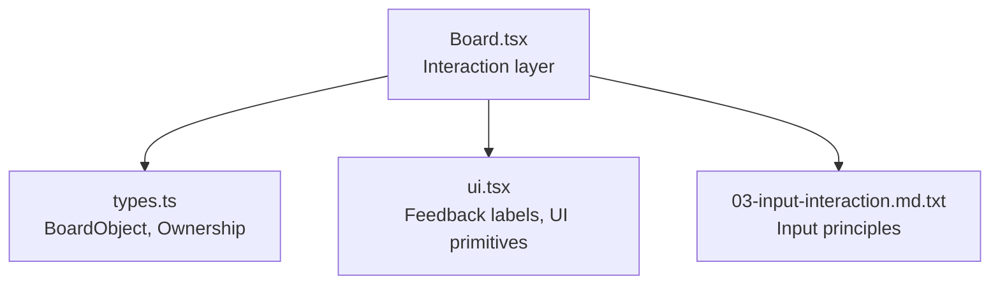
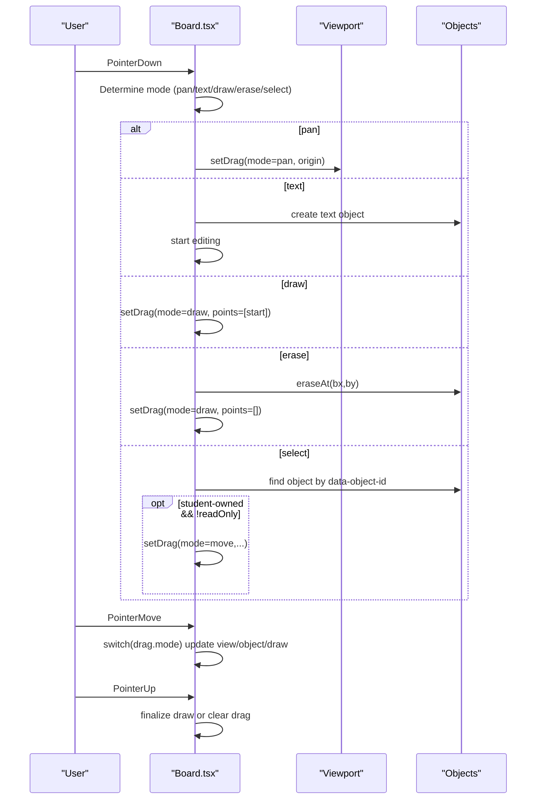
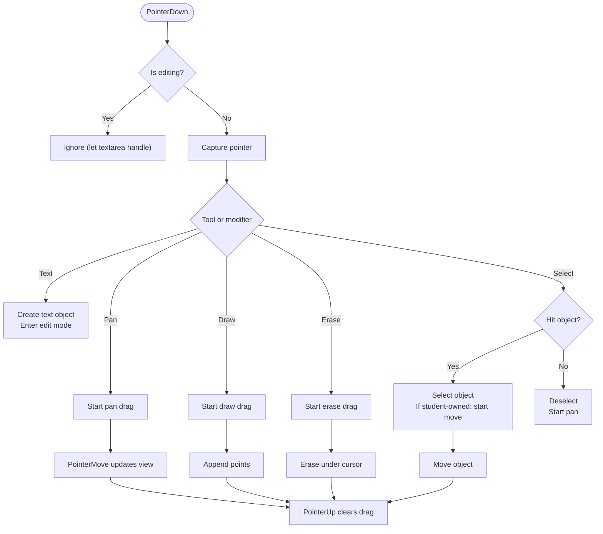
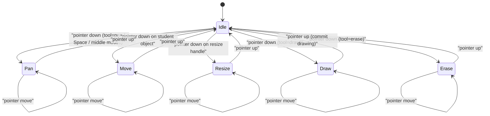
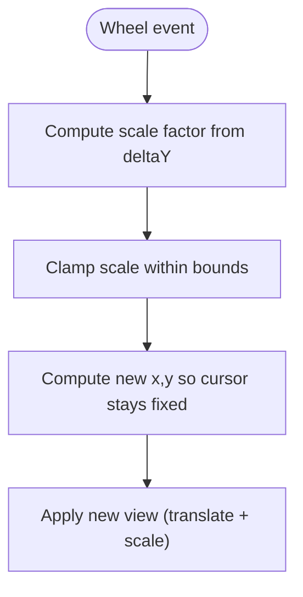
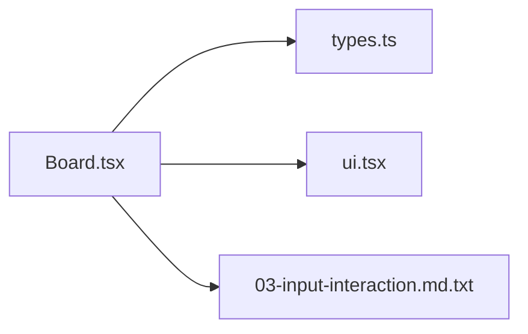

# Interaction Tools & User Input

<cite>
**Referenced Files in This Document**
- [Board.tsx](file://stepwise ai/app/components/board/Board.tsx)
- [types.ts](file://stepwise ai/app/lib/types.ts)
- [ui.tsx](file://stepwise ai/app/components/ui.tsx)
- [03-input-interaction.md.txt](file://stepwise ai/specs/03-input-interaction.md.txt)
</cite>

## Table of Contents
1. Introduction
2. Project Structure
3. Core Components
4. Architecture Overview
5. Detailed Component Analysis
6. Dependency Analysis
7. Performance Considerations
8. Troubleshooting Guide
9. Conclusion
10. Appendices

## Introduction
This document explains the board’s interaction tools and user input handling. It covers all available tools (select, text, draw, erase, pan), pointer event handling, keyboard shortcuts, drag state machine behavior, touch support, mouse wheel zoom centered on cursor, accessibility features, and guidance for extending the system with custom tools.

## Project Structure
The interactive board is implemented as a React client component that manages:
- Tool selection and active mode
- Pointer events for pan/move/resize/draw
- Keyboard shortcuts for temporary pan, delete, and deselect
- Viewport transform (pan and zoom)
- Object rendering and editing
- Zoom controls and ARIA attributes

**Diagram sources**
- [Board.tsx:1-540](file://stepwise ai/app/components/board/Board.tsx#L1-L540)
- [types.ts:26-57](file://stepwise ai/app/lib/types.ts#L26-L57)
- [ui.tsx:177-186](file://stepwise ai/app/components/ui.tsx#L177-L186)
- [03-input-interaction.md.txt:1-38](file://stepwise ai/specs/03-input-interaction.md.txt#L1-L38)

**Section sources**
- [Board.tsx:1-120](file://stepwise ai/app/components/board/Board.tsx#L1-L120)
- [types.ts:26-57](file://stepwise ai/app/lib/types.ts#L26-L57)

## Core Components
- Board toolset: select, text, draw, erase, pan
- Drag state machine: pan, move, resize, draw
- Pointer event handlers: handlePointerDown, handlePointerMove, handlePointerUp
- Keyboard shortcuts: Space (temporary pan), Delete/Backspace (remove selected), Escape (deselect)
- Zoom: mouse wheel zoom centered on cursor; zoom buttons
- Accessibility: role and aria-label on canvas; aria-labels on zoom controls and resize handle; object text area has aria-label

Key behaviors:
- Select: click to select an object; if student-owned and not read-only, start moving; clicking empty space pans
- Text: click to create a new text object and enter edit mode immediately
- Draw: click-and-drag to record points; on release, commit a drawing object
- Erase: click or drag over objects to remove them
- Pan: via tool, Space key, or middle mouse button; also triggered when dragging empty canvas with select tool

**Section sources**
- [Board.tsx:13-26](file://stepwise ai/app/components/board/Board.tsx#L13-L26)
- [Board.tsx:73-105](file://stepwise ai/app/components/board/Board.tsx#L73-L105)
- [Board.tsx:145-205](file://stepwise ai/app/components/board/Board.tsx#L145-L205)
- [Board.tsx:207-283](file://stepwise ai/app/components/board/Board.tsx#L207-L283)
- [Board.tsx:303-312](file://stepwise ai/app/components/board/Board.tsx#L303-L312)
- [Board.tsx:316-404](file://stepwise ai/app/components/board/Board.tsx#L316-L404)
- [Board.tsx:408-539](file://stepwise ai/app/components/board/Board.tsx#L408-L539)

## Architecture Overview
The board composes a viewport transform and renders objects sorted by z-index. Pointer events are captured at the root container and dispatched based on current tool and drag state. Keyboard events toggle temporary pan and perform destructive actions only when appropriate.

**Diagram sources**
- [Board.tsx:145-205](file://stepwise ai/app/components/board/Board.tsx#L145-L205)
- [Board.tsx:207-283](file://stepwise ai/app/components/board/Board.tsx#L207-L283)

## Detailed Component Analysis

### Tools and When They Are Active
- Select: default behavior; selects objects; moves student-owned objects; clicking empty space starts panning
- Text: creates a new text block at click position and enters edit mode
- Draw: records points during drag; commits a drawing object on release
- Erase: removes student-owned objects under cursor; supports drag-to-erase
- Pan: activated by tool, Space key, or middle mouse button; also auto-started when dragging empty canvas with select tool

Cursor feedback changes per tool to improve affordance.

**Section sources**
- [Board.tsx:13-26](file://stepwise ai/app/components/board/Board.tsx#L13-L26)
- [Board.tsx:145-205](file://stepwise ai/app/components/board/Board.tsx#L145-L205)
- [Board.tsx:303-312](file://stepwise ai/app/components/board/Board.tsx#L303-L312)

### Pointer Event Handling System
- handlePointerDown: captures pointer, decides mode, handles pan/text/draw/erase/select logic
- handlePointerMove: updates pan offset, moves/resizes objects, appends draw points, or erases while dragging
- handlePointerUp: finalizes drawing into a BoardObject or clears drag state

**Diagram sources**
- [Board.tsx:145-205](file://stepwise ai/app/components/board/Board.tsx#L145-L205)
- [Board.tsx:207-283](file://stepwise ai/app/components/board/Board.tsx#L207-L283)

**Section sources**
- [Board.tsx:145-205](file://stepwise ai/app/components/board/Board.tsx#L145-L205)
- [Board.tsx:207-283](file://stepwise ai/app/components/board/Board.tsx#L207-L283)

### Keyboard Shortcuts
- Space: temporarily enables pan mode while held; does not scroll page
- Delete/Backspace: removes currently selected object if it belongs to the student and the board is not read-only
- Escape: deselects current object and exits editing mode

These shortcuts respect focus context (e.g., typing in inputs disables destructive keys).

**Section sources**
- [Board.tsx:73-105](file://stepwise ai/app/components/board/Board.tsx#L73-L105)

### Drag State Machine
The drag state tracks one operation at a time:
- pan: translates the viewport using start coordinates and original view
- move: repositions a student-owned object relative to initial board coordinates
- resize: adjusts width/height with minimum constraints
- draw: accumulates points; on release, converts to a drawing object

**Diagram sources**
- [Board.tsx:21-26](file://stepwise ai/app/components/board/Board.tsx#L21-L26)
- [Board.tsx:145-205](file://stepwise ai/app/components/board/Board.tsx#L145-L205)
- [Board.tsx:207-283](file://stepwise ai/app/components/board/Board.tsx#L207-L283)

**Section sources**
- [Board.tsx:21-26](file://stepwise ai/app/components/board/Board.tsx#L21-L26)
- [Board.tsx:285-289](file://stepwise ai/app/components/board/Board.tsx#L285-L289)

### Mouse Wheel Zoom Centered on Cursor
Zooming scales around the cursor position by adjusting both scale and translation so the point under the cursor remains stable. Zoom range is clamped between minimum and maximum values.

**Diagram sources**
- [Board.tsx:116-128](file://stepwise ai/app/components/board/Board.tsx#L116-L128)

**Section sources**
- [Board.tsx:116-128](file://stepwise ai/app/components/board/Board.tsx#L116-L128)

### Touch Support
- The canvas uses pointer events which unify mouse, pen, and touch interactions
- Touch gestures are disabled for native browser behaviors to avoid conflicts (touch-none class)
- Panning, moving, resizing, drawing, and erasing work with touch input through the same pointer handlers

**Section sources**
- [Board.tsx:316-328](file://stepwise ai/app/components/board/Board.tsx#L316-L328)
- [Board.tsx:145-205](file://stepwise ai/app/components/board/Board.tsx#L145-L205)

### Accessibility Features
- Canvas has role="application" and aria-label for screen readers
- Zoom controls have descriptive aria-labels
- Resize handle has aria-label
- Text editing area has aria-label
- Focus management respects editing contexts (textareas prevent board interactions)

**Section sources**
- [Board.tsx:316-328](file://stepwise ai/app/components/board/Board.tsx#L316-L328)
- [Board.tsx:366-403](file://stepwise ai/app/components/board/Board.tsx#L366-L403)
- [Board.tsx:455-474](file://stepwise ai/app/components/board/Board.tsx#L455-L474)

### Extending the Interaction System with Custom Tools
To add a new tool:
1. Extend the Tool type union to include your tool name
2. Add a branch in handlePointerDown to initialize your drag state or create objects
3. Add a branch in handlePointerMove to update your custom operation
4. Add a branch in handlePointerUp to finalize and commit changes
5. Update cursor and any UI indicators to reflect the new tool
6. Optionally add keyboard shortcuts or modifiers for your tool

Reference paths for extension points:
- Tool type definition: [Board.tsx:13](file://stepwise ai/app/components/board/Board.tsx#L13)
- Drag state types: [Board.tsx:21-26](file://stepwise ai/app/components/board/Board.tsx#L21-L26)
- Pointer down handler: [Board.tsx:145-205](file://stepwise ai/app/components/board/Board.tsx#L145-L205)
- Pointer move handler: [Board.tsx:207-248](file://stepwise ai/app/components/board/Board.tsx#L207-L248)
- Pointer up handler: [Board.tsx:250-283](file://stepwise ai/app/components/board/Board.tsx#L250-L283)
- Cursor mapping: [Board.tsx:303-312](file://stepwise ai/app/components/board/Board.tsx#L303-L312)

**Section sources**
- [Board.tsx:13-26](file://stepwise ai/app/components/board/Board.tsx#L13-L26)
- [Board.tsx:145-205](file://stepwise ai/app/components/board/Board.tsx#L145-L205)
- [Board.tsx:207-283](file://stepwise ai/app/components/board/Board.tsx#L207-L283)
- [Board.tsx:303-312](file://stepwise ai/app/components/board/Board.tsx#L303-L312)

## Dependency Analysis
- Board depends on shared domain types for BoardObject and ownership semantics
- Feedback labels and UI primitives come from the UI module
- Specification documents define input principles that guide behavior

**Diagram sources**
- [Board.tsx:1-120](file://stepwise ai/app/components/board/Board.tsx#L1-L120)
- [types.ts:26-57](file://stepwise ai/app/lib/types.ts#L26-L57)
- [ui.tsx:177-186](file://stepwise ai/app/components/ui.tsx#L177-L186)
- [03-input-interaction.md.txt:1-38](file://stepwise ai/specs/03-input-interaction.md.txt#L1-L38)

**Section sources**
- [Board.tsx:1-120](file://stepwise ai/app/components/board/Board.tsx#L1-L120)
- [types.ts:26-57](file://stepwise ai/app/lib/types.ts#L26-L57)
- [ui.tsx:177-186](file://stepwise ai/app/components/ui.tsx#L177-L186)

## Performance Considerations
- Use refs to avoid stale closures in event handlers
- Debounce heavy operations if adding AI analysis during interactions
- Keep object lists small or virtualized for large boards
- Avoid unnecessary re-renders by minimizing state updates inside move handlers
- Clamp zoom to reasonable bounds to prevent layout thrashing

[No sources needed since this section provides general guidance]

## Troubleshooting Guide
Common issues and resolutions:
- Deleting non-student objects: Ensure the selected object’s owner is "student" before deletion
- Pan not starting: Verify tool is "pan", Space is held, or middle mouse button is pressed
- Drawing not committing: Confirm more than one point was recorded before release
- Zoom not centered: Ensure wheel handler computes offsets using current cursor position
- Touch interference: Ensure touch gestures are disabled on the canvas container

**Section sources**
- [Board.tsx:73-105](file://stepwise ai/app/components/board/Board.tsx#L73-L105)
- [Board.tsx:116-128](file://stepwise ai/app/components/board/Board.tsx#L116-L128)
- [Board.tsx:145-205](file://stepwise ai/app/components/board/Board.tsx#L145-L205)
- [Board.tsx:250-283](file://stepwise ai/app/components/board/Board.tsx#L250-L283)

## Conclusion
The board provides a cohesive interaction model across five tools with robust pointer and keyboard handling, accessible UI, and smooth viewport control. Its drag state machine cleanly separates pan, move, resize, and draw operations. Extensibility is straightforward by following the established patterns in the pointer handlers and state transitions.

[No sources needed since this section summarizes without analyzing specific files]

## Appendices

### Data Model Reference
- BoardObject fields include id, type, position, size, rotation, z_index, content, style, meta, owner, timestamps
- Ownership distinguishes student vs AI/system-created content

**Section sources**
- [types.ts:26-57](file://stepwise ai/app/lib/types.ts#L26-L57)

### Input Principles Alignment
- Unified input principle: treat typed, handwritten, spoken, drawn, and image inputs as different expressions of the same thinking
- Preserve original strokes and allow mixed input methods
- Provide natural, real-time experiences with intelligent completion detection

**Section sources**
- [03-input-interaction.md.txt:1-38](file://stepwise ai/specs/03-input-interaction.md.txt#L1-L38)