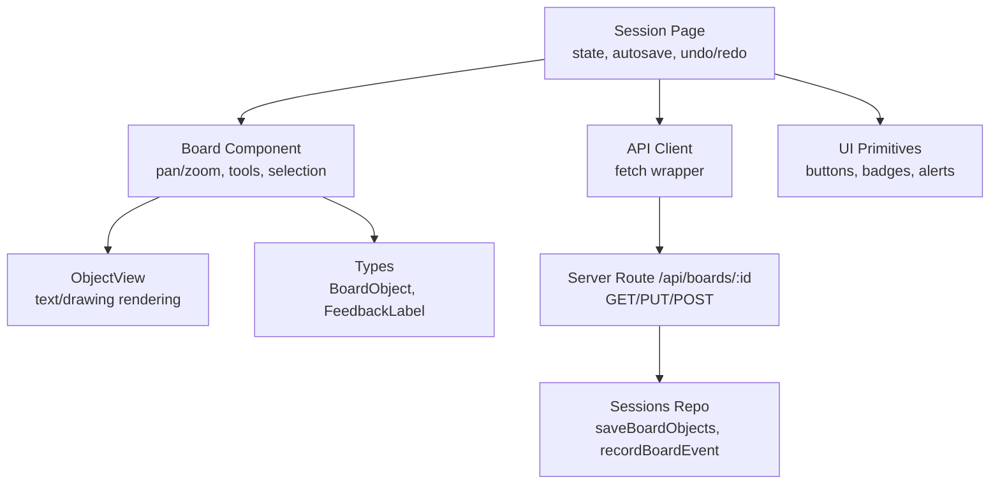
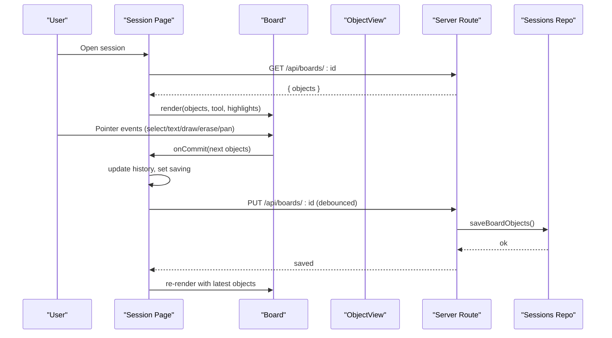
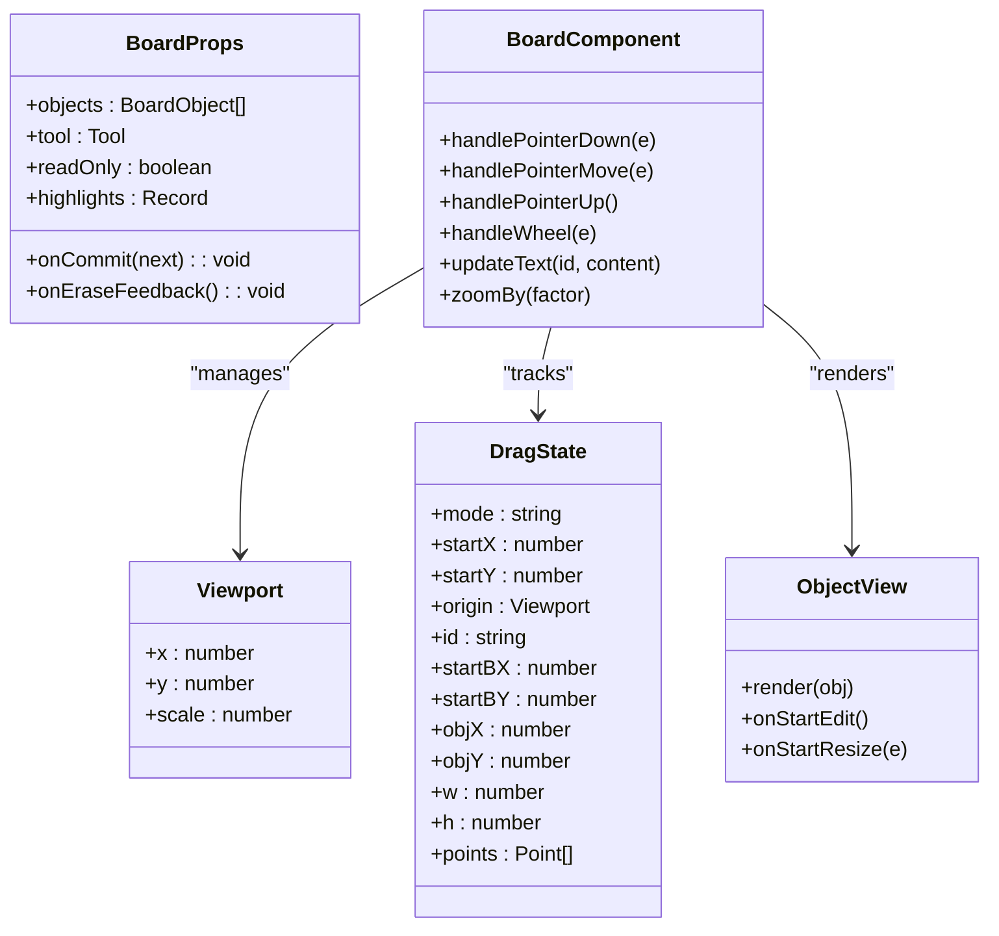
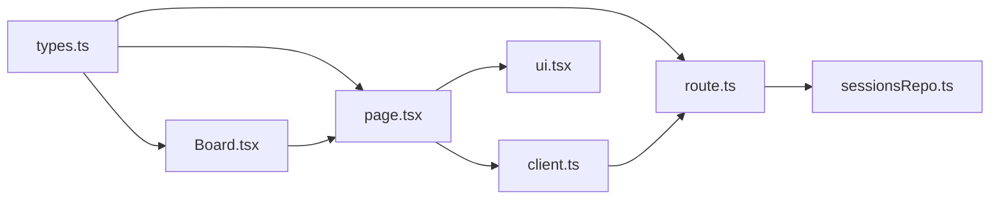

# Interactive Board System

<cite>
**Referenced Files in This Document**
- [Board.tsx](file://stepwise ai/app/components/board/Board.tsx)
- [types.ts](file://stepwise ai/app/lib/types.ts)
- [page.tsx](file://stepwise ai/app/app/session/[id]/page.tsx)
- [route.ts](file://stepwise ai/app/app/api/boards/[id]/route.ts)
- [sessionsRepo.ts](file://stepwise ai/app/lib/sessionsRepo.ts)
- [client.ts](file://stepwise ai/app/lib/client.ts)
- [ui.tsx](file://stepwise ai/app/components/ui.tsx)
- [02-interactive-board.md.txt](file://stepwise ai/specs/02-interactive-board.md.txt)
- [03-input-interaction.md.txt](file://stepwise ai/specs/03-input-interaction.md.txt)
</cite>

## Table of Contents
1. [Introduction](#introduction)
2. [Project Structure](#project-structure)
3. [Core Components](#core-components)
4. [Architecture Overview](#architecture-overview)
5. [Detailed Component Analysis](#detailed-component-analysis)
6. [Dependency Analysis](#dependency-analysis)
7. [Performance Considerations](#performance-considerations)
8. [Troubleshooting Guide](#troubleshooting-guide)
9. [Conclusion](#conclusion)
10. [Appendices](#appendices)

## Introduction
This document explains StepWise AI’s Interactive Board: the core workspace where students solve problems visually. It covers the board object model, interaction paradigms (typing, drawing, selecting, moving, resizing, deleting), state management with server-side persistence, rendering behavior, performance considerations, accessibility and responsive design, and extensibility patterns for new object types and tools. It also clarifies current collaboration capabilities and conflict resolution strategies based on the repository’s implementation.

## Project Structure
The Interactive Board is implemented as a React component layered over a DOM-based infinite canvas with pan and zoom. The session page orchestrates loading, autosaving, undo/redo, and teaching interactions. Server routes persist board snapshots and record events. Shared types define the board object model and evaluation feedback.

**Diagram sources**
- [page.tsx:45-130](file://stepwise ai/app/app/session/[id]/page.tsx#L45-L130)
- [Board.tsx:44-406](file://stepwise ai/app/components/board/Board.tsx#L44-L406)
- [route.ts:28-105](file://stepwise ai/app/app/api/boards/[id]/route.ts#L28-L105)
- [sessionsRepo.ts:239-282](file://stepwise ai/app/lib/sessionsRepo.ts#L239-L282)
- [types.ts:26-78](file://stepwise ai/app/lib/types.ts#L26-L78)
- [ui.tsx:12-218](file://stepwise ai/app/components/ui.tsx#L12-L218)

**Section sources**
- [page.tsx:45-130](file://stepwise ai/app/app/session/[id]/page.tsx#L45-L130)
- [Board.tsx:44-406](file://stepwise ai/app/components/board/Board.tsx#L44-L406)
- [route.ts:28-105](file://stepwise ai/app/app/api/boards/[id]/route.ts#L28-L105)
- [sessionsRepo.ts:239-282](file://stepwise ai/app/lib/sessionsRepo.ts#L239-L282)
- [types.ts:26-78](file://stepwise ai/app/lib/types.ts#L26-L78)
- [ui.tsx:12-218](file://stepwise ai/app/components/ui.tsx#L12-L218)

## Core Components
- Board component: Implements the interactive canvas with pan, zoom, selection, text creation, drawing, erasing, and movement. Renders objects sorted by z-index and applies highlights from AI feedback.
- ObjectView: Renders individual board objects (text or drawing) and supports editing, selection rings, resize handles, and AI annotations.
- Session page: Loads session data, manages tool state, debounced autosave, undo/redo history, and integrates with the teaching loop (check/hint/finish).
- API route: Validates and persists board snapshots; records meaningful board events.
- Sessions repo: Persists board objects to storage and records events; includes size/content limits and transactional save.
- Types: Defines the board object model, ownership, feedback labels, and evaluation context used across components.
- UI primitives: Shared buttons, cards, inputs, badges, alerts, and feedback metadata used by the session page and board.

**Section sources**
- [Board.tsx:44-540](file://stepwise ai/app/components/board/Board.tsx#L44-L540)
- [page.tsx:45-187](file://stepwise ai/app/app/session/[id]/page.tsx#L45-L187)
- [route.ts:28-105](file://stepwise ai/app/app/api/boards/[id]/route.ts#L28-L105)
- [sessionsRepo.ts:239-282](file://stepwise ai/app/lib/sessionsRepo.ts#L239-L282)
- [types.ts:26-78](file://stepwise ai/app/lib/types.ts#L26-L78)
- [ui.tsx:12-218](file://stepwise ai/app/components/ui.tsx#L12-L218)

## Architecture Overview
The board uses a DOM-based infinite canvas approach: a container div transforms via translate and scale to implement pan and zoom. Objects are rendered as absolutely positioned elements within the transformed container. Pointer events drive tool behaviors (select, text, draw, erase, pan). Keyboard shortcuts enable temporary pan (Space), delete selected student objects, and deselect. Autosave sends a full snapshot to the server at intervals after changes.

**Diagram sources**
- [page.tsx:77-130](file://stepwise ai/app/app/session/[id]/page.tsx#L77-L130)
- [Board.tsx:145-283](file://stepwise ai/app/components/board/Board.tsx#L145-L283)
- [route.ts:28-85](file://stepwise ai/app/app/api/boards/[id]/route.ts#L28-L85)
- [sessionsRepo.ts:239-265](file://stepwise ai/app/lib/sessionsRepo.ts#L239-L265)

## Detailed Component Analysis

### Board Component
Responsibilities:
- Viewport management: x, y, scale with wheel zoom centered on cursor and reset controls.
- Tool handling: select, text, draw, erase, pan; Space key toggles temporary pan; Delete removes selected student-owned objects; Escape clears selection/editing.
- Object lifecycle: create text and drawing objects, move, resize, and commit changes via onCommit.
- Rendering: sorts objects by z_index, renders ObjectView per object, overlays SVG polyline during draw, and applies highlight rings from AI feedback.

Key behaviors:
- Pan: pointer drag updates view.x/y without changing scale.
- Zoom: wheel adjusts scale clamped between min/max and recalculates translation to keep cursor-centered.
- Text tool: creates a new text object at pointer location, selects it, and enters edit mode.
- Draw tool: accumulates points into a polyline preview; on pointer up, converts to a drawing object with normalized points and color.
- Erase tool: hits tests student-owned objects by bounding box and removes them; can be used continuously while dragging.
- Selection/move: clicking an object selects it; if owned by student and not read-only, dragging moves it; resize handle updates width/height with minimum constraints.

Accessibility:
- Root element has role="application" and aria-label for screen readers.
- Resize handle and zoom controls include aria-label attributes.

Extensibility:
- New tools can be added by extending the Tool type and handling modes in pointer handlers.
- New object types require adding a branch in ObjectView and ensuring persistence fields exist in BoardObject.

**Section sources**
- [Board.tsx:13-105](file://stepwise ai/app/components/board/Board.tsx#L13-L105)
- [Board.tsx:107-143](file://stepwise ai/app/components/board/Board.tsx#L107-L143)
- [Board.tsx:145-283](file://stepwise ai/app/components/board/Board.tsx#L145-L283)
- [Board.tsx:285-314](file://stepwise ai/app/components/board/Board.tsx#L285-L314)
- [Board.tsx:316-406](file://stepwise ai/app/components/board/Board.tsx#L316-L406)

#### Class Diagram

**Diagram sources**
- [Board.tsx:13-27](file://stepwise ai/app/components/board/Board.tsx#L13-L27)
- [Board.tsx:44-406](file://stepwise ai/app/components/board/Board.tsx#L44-L406)
- [Board.tsx:408-540](file://stepwise ai/app/components/board/Board.tsx#L408-L540)

### ObjectView
Responsibilities:
- Render text or drawing objects.
- Support editing via textarea for text-type objects.
- Show selection ring and AI feedback badge when applicable.
- Provide resize handle for student-owned objects when selected and not read-only.

Rendering logic:
- Drawing objects parse stored JSON to reconstruct polyline points and color.
- Text objects display content with appropriate styling based on owner and type.
- AI-generated objects show a label indicating origin.

**Section sources**
- [Board.tsx:408-540](file://stepwise ai/app/components/board/Board.tsx#L408-L540)

### Session Page Integration
Responsibilities:
- Load session payload including objects and analysis steps.
- Manage tool selection and completion state.
- Debounced autosave to server after changes.
- Undo/redo history with keyboard shortcuts.
- Teaching loop: check this, ask hint, finish session.

Autosave strategy:
- Changes trigger a timer that flushes a full snapshot to the server after a delay.
- Save status indicators reflect saved/saving/error states.

Undo/redo:
- Maintains bounded history stacks; pushes current state before committing next; clears future stack on new commits.

Teaching integration:
- Sends attempt text derived from student-owned objects to analyze endpoint.
- Displays evaluation results, missing elements, strengths, and next actions.

**Section sources**
- [page.tsx:45-187](file://stepwise ai/app/app/session/[id]/page.tsx#L45-L187)
- [page.tsx:189-261](file://stepwise ai/app/app/session/[id]/page.tsx#L189-L261)
- [page.tsx:284-382](file://stepwise ai/app/app/session/[id]/page.tsx#L284-L382)

### Server Persistence and Events
Endpoints:
- GET /api/boards/:id: returns board objects for authenticated owner.
- PUT /api/boards/:id: validates and saves a full board snapshot with sanitization and limits.
- POST /api/boards/:id/event: records meaningful board events.

Persistence details:
- Transactional save replaces all objects for the board; enforces max object count and field sizes.
- Records events with truncated payloads for analytics.

**Section sources**
- [route.ts:28-105](file://stepwise ai/app/app/api/boards/[id]/route.ts#L28-L105)
- [sessionsRepo.ts:239-282](file://stepwise ai/app/lib/sessionsRepo.ts#L239-L282)

### Data Model and Types
BoardObject fields:
- id, board_id, type, position (x, y), size (width, height), rotation, z_index, content, style, meta, owner, timestamps.

Ownership:
- student, ai, system, imported.

Feedback labels:
- CORRECT_UNDERSTANDING, PARTIALLY_CORRECT, MISSING_IDEA, CONCEPT_ERROR, THINK_ABOUT_THIS, CHECK_THIS_STEP, AI_UNCERTAIN.

Evaluation context:
- Includes question analysis, step, attempt text, board snapshot, previous hints, student level, explanation depth.

**Section sources**
- [types.ts:26-78](file://stepwise ai/app/lib/types.ts#L26-L78)
- [types.ts:105-124](file://stepwise ai/app/lib/types.ts#L105-L124)
- [types.ts:259-273](file://stepwise ai/app/lib/types.ts#L259-L273)

## Dependency Analysis
The board depends on shared types for consistent modeling and on the session page for orchestration. The server route depends on authentication helpers and the sessions repo for persistence. The client helper standardizes API responses and error handling.

**Diagram sources**
- [types.ts:26-78](file://stepwise ai/app/lib/types.ts#L26-L78)
- [Board.tsx:44-406](file://stepwise ai/app/components/board/Board.tsx#L44-L406)
- [page.tsx:45-130](file://stepwise ai/app/app/session/[id]/page.tsx#L45-L130)
- [route.ts:28-105](file://stepwise ai/app/app/api/boards/[id]/route.ts#L28-L105)
- [client.ts:7-27](file://stepwise ai/app/lib/client.ts#L7-L27)
- [sessionsRepo.ts:239-282](file://stepwise ai/app/lib/sessionsRepo.ts#L239-L282)
- [ui.tsx:12-218](file://stepwise ai/app/components/ui.tsx#L12-L218)

**Section sources**
- [types.ts:26-78](file://stepwise ai/app/lib/types.ts#L26-L78)
- [Board.tsx:44-406](file://stepwise ai/app/components/board/Board.tsx#L44-L406)
- [page.tsx:45-130](file://stepwise ai/app/app/session/[id]/page.tsx#L45-L130)
- [route.ts:28-105](file://stepwise ai/app/app/api/boards/[id]/route.ts#L28-L105)
- [client.ts:7-27](file://stepwise ai/app/lib/client.ts#L7-L27)
- [sessionsRepo.ts:239-282](file://stepwise ai/app/lib/sessionsRepo.ts#L239-L282)
- [ui.tsx:12-218](file://stepwise ai/app/components/ui.tsx#L12-L218)

## Performance Considerations
Current implementation characteristics:
- DOM-based infinite canvas using CSS transform for pan/zoom; avoids heavy Canvas API usage.
- Sorting objects by z_index on each render; suitable for moderate object counts.
- Debounced autosave reduces network churn; full snapshot sent to server.
- Drawing previews use lightweight SVG polyline; final drawing objects store normalized point arrays.

Optimization opportunities:
- Virtualize or cull off-screen objects for large boards.
- Use requestAnimationFrame for smooth pointer interactions and avoid excessive re-renders during drag.
- Batch updates for frequent operations (e.g., move/resize) and commit less frequently.
- Limit object count per board or paginate views for very large boards.
- Consider Canvas/WebGL rendering for complex drawings or many objects.

[No sources needed since this section provides general guidance]

## Troubleshooting Guide
Common issues and resolutions:
- Save failures: Check network connectivity and server availability; the session page sets save status to error and allows retry.
- Objects not persisting: Ensure objects are committed via onCommit and autosave triggers; verify server route accepts valid types and owners.
- Undo/redo not working: Confirm history stacks are populated and shortcuts are not intercepted by input fields.
- AI feedback not showing: Verify highlights mapping from evaluation results to object IDs; ensure ObjectView receives highlight prop.

Error handling paths:
- Client API wrapper throws errors for non-ok responses or invalid payloads; session page catches and displays action errors.
- Server route validates ownership and sanitizes inputs; returns not found or server error appropriately.

**Section sources**
- [page.tsx:100-130](file://stepwise ai/app/app/session/[id]/page.tsx#L100-L130)
- [page.tsx:189-261](file://stepwise ai/app/app/session/[id]/page.tsx#L189-L261)
- [route.ts:28-105](file://stepwise ai/app/app/api/boards/[id]/route.ts#L28-L105)
- [client.ts:7-27](file://stepwise ai/app/lib/client.ts#L7-L27)

## Conclusion
StepWise AI’s Interactive Board provides a robust, accessible, and extensible workspace for visual problem-solving. It combines a DOM-based infinite canvas with clear tool interactions, structured object modeling, and reliable autosave persistence. The session page integrates teaching loops and feedback, while server endpoints enforce security and data integrity. Future enhancements can focus on performance scaling, richer object types, and advanced collaboration features.

[No sources needed since this section summarizes without analyzing specific files]

## Appendices

### Extending the Board with New Object Types
To add a new object type:
- Extend BoardObjectType in types and validate in server route.
- Add creation logic in Board pointer handlers.
- Implement rendering in ObjectView.
- Persist content in BoardObject.content/style/meta as needed.

Example references:
- Type definition and validation: [types.ts:26-37](file://stepwise ai/app/lib/types.ts#L26-L37), [route.ts:10-22](file://stepwise ai/app/app/api/boards/[id]/route.ts#L10-L22)
- Creation flow: [Board.tsx:155-180](file://stepwise ai/app/components/board/Board.tsx#L155-L180)
- Rendering: [Board.tsx:432-454](file://stepwise ai/app/components/board/Board.tsx#L432-L454)

**Section sources**
- [types.ts:26-37](file://stepwise ai/app/lib/types.ts#L26-L37)
- [route.ts:10-22](file://stepwise ai/app/app/api/boards/[id]/route.ts#L10-L22)
- [Board.tsx:155-180](file://stepwise ai/app/components/board/Board.tsx#L155-L180)
- [Board.tsx:432-454](file://stepwise ai/app/components/board/Board.tsx#L432-L454)

### Custom Tools and Interaction Behaviors
To add a custom tool:
- Update Tool union type and cursor logic.
- Handle pointer events for the new mode in handlePointerDown/Move/Up.
- Optionally integrate with AI feedback or persistence.

References:
- Tool type and cursor: [Board.tsx:13-14](file://stepwise ai/app/components/board/Board.tsx#L13-L14), [Board.tsx:303-312](file://stepwise ai/app/components/board/Board.tsx#L303-L312)
- Pointer handling: [Board.tsx:145-283](file://stepwise ai/app/components/board/Board.tsx#L145-L283)

**Section sources**
- [Board.tsx:13-14](file://stepwise ai/app/components/board/Board.tsx#L13-L14)
- [Board.tsx:303-312](file://stepwise ai/app/components/board/Board.tsx#L303-L312)
- [Board.tsx:145-283](file://stepwise ai/app/components/board/Board.tsx#L145-L283)

### Accessibility and Responsive Design
Accessibility:
- Role and aria-label on board root; labeled controls for zoom and resize.
- Non-color-dependent feedback via icons and labels in FEEDBACK_META.

Responsive:
- Full-viewport layout with flexible panels; toolbar adapts to screen size.
- Touch-friendly controls and cursor styles for different tools.

References:
- Accessibility attributes: [Board.tsx:316-328](file://stepwise ai/app/components/board/Board.tsx#L316-L328)
- Feedback metadata: [ui.tsx:177-186](file://stepwise ai/app/components/ui.tsx#L177-L186)
- Layout and toolbar: [page.tsx:306-382](file://stepwise ai/app/app/session/[id]/page.tsx#L306-L382)

**Section sources**
- [Board.tsx:316-328](file://stepwise ai/app/components/board/Board.tsx#L316-L328)
- [ui.tsx:177-186](file://stepwise ai/app/components/ui.tsx#L177-L186)
- [page.tsx:306-382](file://stepwise ai/app/app/session/[id]/page.tsx#L306-L382)

### Real-Time Collaboration and Conflict Resolution
Current implementation:
- Single-user autosave with optimistic local updates and debounced server persistence.
- No WebSocket or real-time sync; no multi-user conflict resolution in the codebase.

Recommendations aligned with specifications:
- Introduce collaborative editing with operational transforms or CRDTs for conflict-free merging.
- Use presence indicators and cursors for live collaboration.
- Implement versioned snapshots and incremental diffs to reduce bandwidth.

References:
- Autosave and snapshot: [page.tsx:99-130](file://stepwise ai/app/app/session/[id]/page.tsx#L99-L130)
- Server snapshot save: [route.ts:41-85](file://stepwise ai/app/app/api/boards/[id]/route.ts#L41-L85), [sessionsRepo.ts:239-265](file://stepwise ai/app/lib/sessionsRepo.ts#L239-L265)

**Section sources**
- [page.tsx:99-130](file://stepwise ai/app/app/session/[id]/page.tsx#L99-L130)
- [route.ts:41-85](file://stepwise ai/app/app/api/boards/[id]/route.ts#L41-L85)
- [sessionsRepo.ts:239-265](file://stepwise ai/app/lib/sessionsRepo.ts#L239-L265)

### Input Paradigms and Specifications Alignment
The board supports typing, drawing, selecting, moving, resizing, and deleting objects. These align with the interactive board specification emphasizing an infinite canvas, movable text, freeform drawing, and AI-aware feedback. Input recognition and voice/image handling are outlined in the input interaction spec but are not fully implemented in the current codebase beyond text and drawing.

References:
- Board interactions: [Board.tsx:145-283](file://stepwise ai/app/components/board/Board.tsx#L145-L283)
- Specification alignment: [02-interactive-board.md.txt](file://stepwise ai/specs/02-interactive-board.md.txt), [03-input-interaction.md.txt](file://stepwise ai/specs/03-input-interaction.md.txt)

**Section sources**
- [Board.tsx:145-283](file://stepwise ai/app/components/board/Board.tsx#L145-L283)
- [02-interactive-board.md.txt](file://stepwise ai/specs/02-interactive-board.md.txt)
- [03-input-interaction.md.txt](file://stepwise ai/specs/03-input-interaction.md.txt)