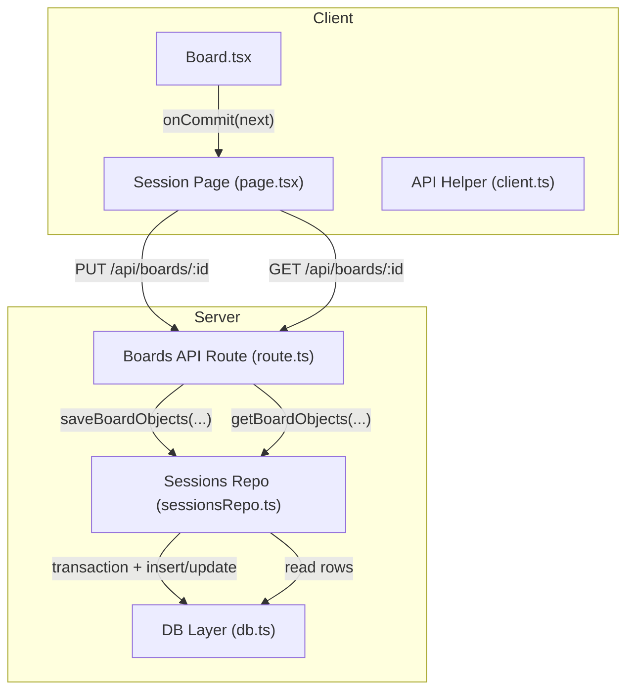
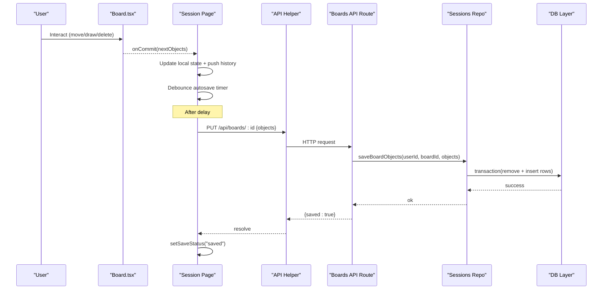
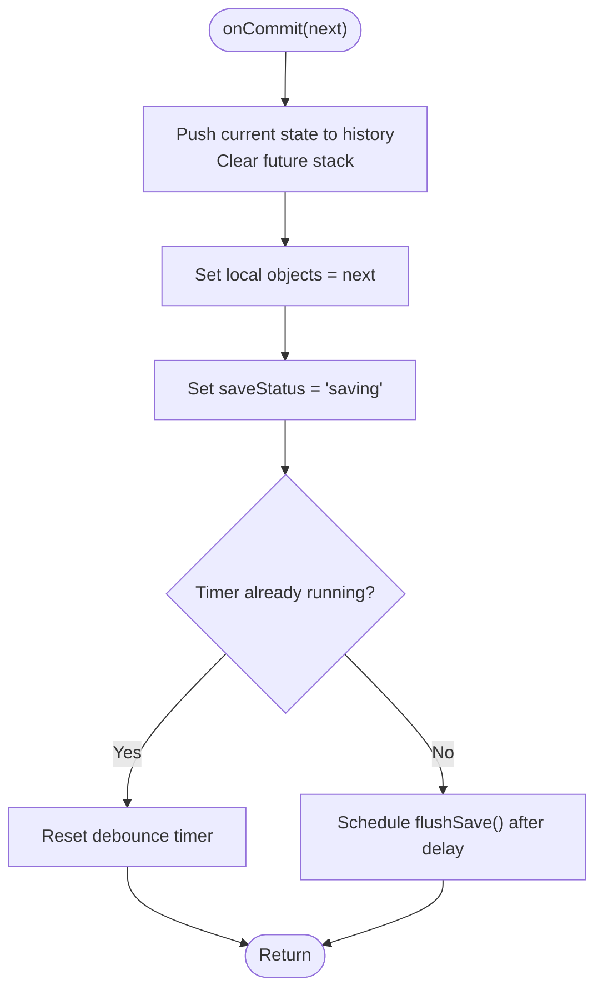
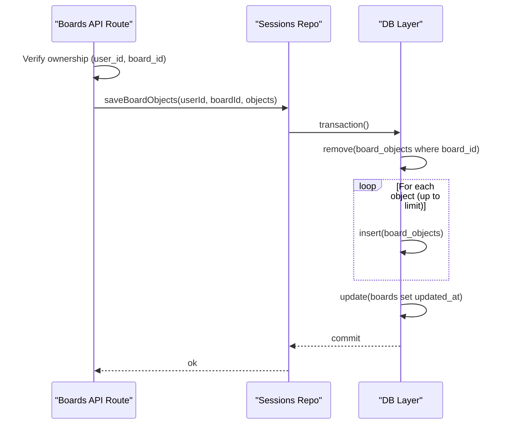
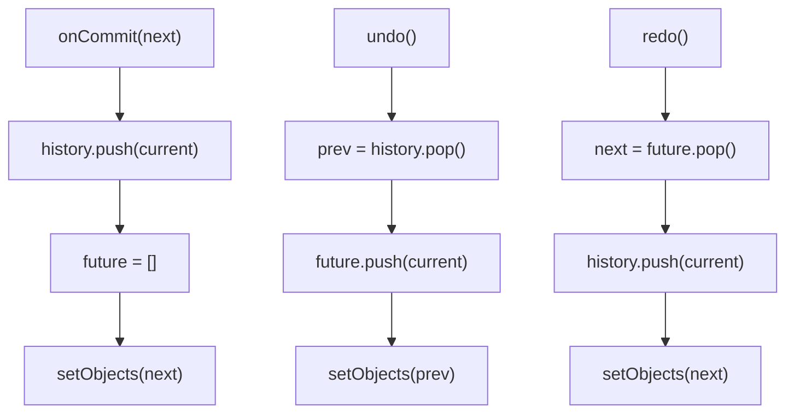
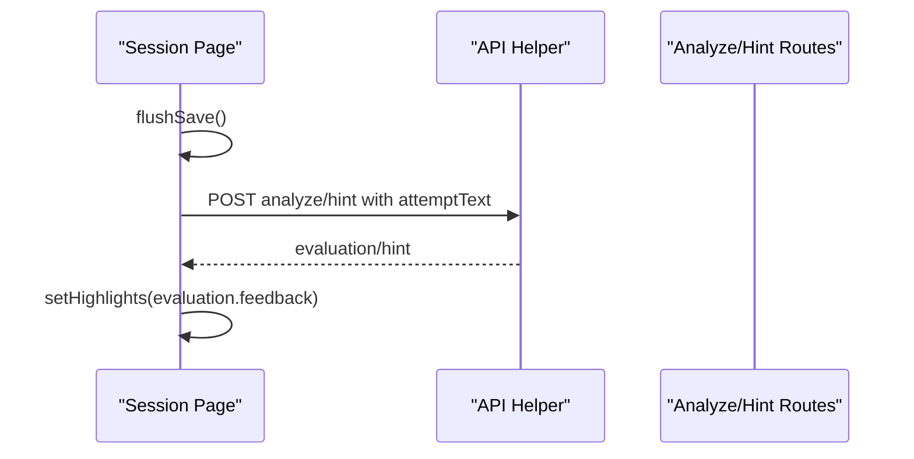
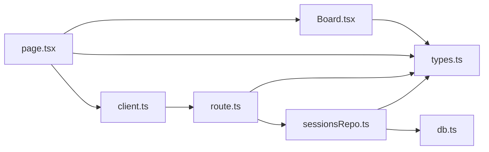

# State Management & Persistence

<cite>
**Referenced Files in This Document**
- [Board.tsx](file://stepwise ai/app/components/board/Board.tsx)
- [page.tsx](file://stepwise ai/app/app/session/[id]/page.tsx)
- [route.ts](file://stepwise ai/app/app/api/boards/[id]/route.ts)
- [sessionsRepo.ts](file://stepwise ai/app/lib/sessionsRepo.ts)
- [db.ts](file://stepwise ai/app/lib/db.ts)
- [types.ts](file://stepwise ai/app/lib/types.ts)
- [client.ts](file://stepwise ai/app/lib/client.ts)
</cite>

## Table of Contents
1. Introduction
2. Project Structure
3. Core Components
4. Architecture Overview
5. Detailed Component Analysis
6. Dependency Analysis
7. Performance Considerations
8. Troubleshooting Guide
9. Conclusion

## Introduction
This document explains the board’s state management and persistence system with a focus on:
- Optimistic UI updates that immediately reflect user actions while server synchronization occurs in the background.
- The onCommit callback mechanism that centralizes all object creation, modification, and deletion events from the Board.
- Consistency strategies between local and server state, including conflict resolution and error recovery.
- Integration with the session repository for saving board state to the database.
- Real-time collaboration patterns, graceful network failure handling, and performance optimizations for large boards.
- Memory management and cleanup strategies for long-running sessions.

## Project Structure
The board spans client components, Next.js API routes, and a server-side repository backed by an embedded JSON store. Key responsibilities:
- Client-side Board component handles interactions and emits changes via onCommit.
- Session page orchestrates optimistic updates, undo/redo, debounced autosave, and teaching loop integration.
- API route validates ownership and persists snapshots to the database through the repository.
- Repository enforces ownership, sanitizes inputs, and performs atomic snapshot replacement.
- Database layer provides transactional, file-backed persistence with safe parsing and limits.



**Diagram sources**
- [Board.tsx:44-105](file://stepwise ai/app/components/board/Board.tsx#L44-L105)
- [page.tsx:99-130](file://stepwise ai/app/app/session/[id]/page.tsx#L99-L130)
- [route.ts:28-85](file://stepwise ai/app/app/api/boards/[id]/route.ts#L28-L85)
- [sessionsRepo.ts:198-265](file://stepwise ai/app/lib/sessionsRepo.ts#L198-L265)
- [db.ts:123-199](file://stepwise ai/app/lib/db.ts#L123-L199)

**Section sources**
- [Board.tsx:44-105](file://stepwise ai/app/components/board/Board.tsx#L44-L105)
- [page.tsx:99-130](file://stepwise ai/app/app/session/[id]/page.tsx#L99-L130)
- [route.ts:28-85](file://stepwise ai/app/app/api/boards/[id]/route.ts#L28-L85)
- [sessionsRepo.ts:198-265](file://stepwise ai/app/lib/sessionsRepo.ts#L198-L265)
- [db.ts:123-199](file://stepwise ai/app/lib/db.ts#L123-L199)

## Core Components
- Board component: Renders objects, handles pointer/keyboard interactions, and calls onCommit for every change (create, move, resize, delete). It maintains local viewport state and selection but delegates persistence to the parent.
- Session page: Owns the authoritative local array of objects, implements undo/redo history, debounced autosave, and integrates with AI evaluation and hints. It flushes saves before AI operations to ensure consistency.
- Boards API route: Validates ownership, sanitizes incoming objects, and delegates to the repository for persistence. Also records meaningful board events.
- Sessions repository: Provides read/write access to board objects with ownership checks, input validation, size limits, and atomic snapshot replacement.
- Database layer: File-backed relational-style store with transactions, safe JSON parsing, and deterministic writes.

**Section sources**
- [Board.tsx:44-105](file://stepwise ai/app/components/board/Board.tsx#L44-L105)
- [page.tsx:99-130](file://stepwise ai/app/app/session/[id]/page.tsx#L99-L130)
- [route.ts:28-85](file://stepwise ai/app/app/api/boards/[id]/route.ts#L28-L85)
- [sessionsRepo.ts:198-265](file://stepwise ai/app/lib/sessionsRepo.ts#L198-L265)
- [db.ts:123-199](file://stepwise ai/app/lib/db.ts#L123-L199)

## Architecture Overview
The system uses an optimistic UI pattern:
- User actions update local state immediately via onCommit.
- A debounced timer triggers a full snapshot save to the server.
- The server validates ownership and replaces board objects atomically.
- Undo/redo buffers are maintained locally; they do not affect server state until flushed.



**Diagram sources**
- [Board.tsx:130-297](file://stepwise ai/app/components/board/Board.tsx#L130-L297)
- [page.tsx:99-130](file://stepwise ai/app/app/session/[id]/page.tsx#L99-L130)
- [route.ts:41-85](file://stepwise ai/app/app/api/boards/[id]/route.ts#L41-L85)
- [sessionsRepo.ts:239-265](file://stepwise ai/app/lib/sessionsRepo.ts#L239-L265)
- [db.ts:183-199](file://stepwise ai/app/lib/db.ts#L183-L199)

## Detailed Component Analysis

### Optimistic UI and onCommit Mechanism
- The Board component emits onCommit whenever:
  - A new text or drawing object is created.
  - An existing object is moved or resized.
  - An object is deleted (via keyboard or erase tool).
- The session page wraps onCommit to:
  - Push previous state into an undo stack (bounded).
  - Clear redo stack on new changes.
  - Immediately update local state for instant feedback.
  - Schedule a debounced save to avoid excessive network requests.



**Diagram sources**
- [page.tsx:118-130](file://stepwise ai/app/app/session/[id]/page.tsx#L118-L130)
- [Board.tsx:130-297](file://stepwise ai/app/components/board/Board.tsx#L130-L297)

**Section sources**
- [Board.tsx:130-297](file://stepwise ai/app/components/board/Board.tsx#L130-L297)
- [page.tsx:118-130](file://stepwise ai/app/app/session/[id]/page.tsx#L118-L130)

### Server-Side Persistence and Ownership
- The API route verifies ownership using the authenticated user and board ID.
- Incoming objects are sanitized:
  - Type and owner must be allowed values.
  - Content and metadata are truncated to safe sizes.
  - Object count is limited to prevent abuse.
- The repository performs an atomic snapshot replacement:
  - Removes all existing board objects.
  - Inserts the new set within a transaction.
  - Updates board updated_at timestamp.



**Diagram sources**
- [route.ts:41-85](file://stepwise ai/app/app/api/boards/[id]/route.ts#L41-L85)
- [sessionsRepo.ts:239-265](file://stepwise ai/app/lib/sessionsRepo.ts#L239-L265)
- [db.ts:183-199](file://stepwise ai/app/lib/db.ts#L183-L199)

**Section sources**
- [route.ts:41-85](file://stepwise ai/app/app/api/boards/[id]/route.ts#L41-L85)
- [sessionsRepo.ts:239-265](file://stepwise ai/app/lib/sessionsRepo.ts#L239-L265)
- [db.ts:183-199](file://stepwise ai/app/lib/db.ts#L183-L199)

### Data Model and Types
- BoardObject defines geometry, content, style, meta, ownership, and timestamps.
- Ownership distinguishes student, ai, system, and imported objects.
- Feedback labels and evaluation results integrate with the teaching loop to highlight relevant objects.

```mermaid
classDiagram
class BoardObject {
+string id
+string board_id
+BoardObjectType type
+number x
+number y
+number width
+number height
+number rotation
+number z_index
+string content
+Record~string, unknown~ style
+Record~string, unknown~ meta
+Ownership owner
+string created_at
+string updated_at
}
class Ownership {
<<enum>>
"student"
"ai"
"system"
"imported"
}
class BoardObjectType {
<<enum>>
"text"
"handwriting"
"drawing"
"shape"
"connector"
"image"
"note"
"formula"
"annotation"
"visual"
}
BoardObject --> Ownership : "owner"
BoardObject --> BoardObjectType : "type"
```

**Diagram sources**
- [types.ts:26-57](file://stepwise ai/app/lib/types.ts#L26-L57)

**Section sources**
- [types.ts:26-57](file://stepwise ai/app/lib/types.ts#L26-L57)

### Undo/Redo and Local History
- The session page maintains bounded history and future stacks.
- Each commit pushes the previous state onto history and clears future.
- Undo/redo trigger another flush to persist the restored state.



**Diagram sources**
- [page.tsx:118-158](file://stepwise ai/app/app/session/[id]/page.tsx#L118-L158)

**Section sources**
- [page.tsx:118-158](file://stepwise ai/app/app/session/[id]/page.tsx#L118-L158)

### Teaching Loop Integration
- Before checking or requesting hints, the page flushes the latest board snapshot so the AI evaluates the most recent state.
- Evaluation results map feedback to object highlights, improving UX clarity.



**Diagram sources**
- [page.tsx:189-245](file://stepwise ai/app/app/session/[id]/page.tsx#L189-L245)

**Section sources**
- [page.tsx:189-245](file://stepwise ai/app/app/session/[id]/page.tsx#L189-L245)

## Dependency Analysis
- Board.tsx depends on types for BoardObject and feedback labels.
- Session page depends on Board, API helper, and types.
- API route depends on auth helpers, API helpers, sessions repo, and db.
- Sessions repo depends on db and types.
- DB layer is self-contained with filesystem persistence and transactions.



**Diagram sources**
- [Board.tsx:1-11](file://stepwise ai/app/components/board/Board.tsx#L1-L11)
- [page.tsx:1-15](file://stepwise ai/app/app/session/[id]/page.tsx#L1-L15)
- [route.ts:1-7](file://stepwise ai/app/app/api/boards/[id]/route.ts#L1-L7)
- [sessionsRepo.ts:1-8](file://stepwise ai/app/lib/sessionsRepo.ts#L1-L8)
- [db.ts:1-13](file://stepwise ai/app/lib/db.ts#L1-L13)

**Section sources**
- [Board.tsx:1-11](file://stepwise ai/app/components/board/Board.tsx#L1-L11)
- [page.tsx:1-15](file://stepwise ai/app/app/session/[id]/page.tsx#L1-L15)
- [route.ts:1-7](file://stepwise ai/app/app/api/boards/[id]/route.ts#L1-L7)
- [sessionsRepo.ts:1-8](file://stepwise ai/app/lib/sessionsRepo.ts#L1-L8)
- [db.ts:1-13](file://stepwise ai/app/lib/db.ts#L1-L13)

## Performance Considerations
- Debounced autosave reduces network overhead during rapid edits.
- Snapshot replacement ensures consistent reads and simplifies conflict handling.
- Input limits protect against oversized payloads:
  - Object count capped at 500 per save.
  - Content and metadata fields truncated to safe lengths.
  - Width/height clamped to reasonable bounds.
- Transactional writes minimize partial states and improve durability.
- Undo/redo history is bounded to prevent unbounded memory growth.

[No sources needed since this section provides general guidance]

## Troubleshooting Guide
Common issues and resolutions:
- Network failures during autosave:
  - The client sets save status to error; users can retry or continue editing.
  - Subsequent successful saves will overwrite stale local state with server state on reload.
- Ownership errors:
  - If the board does not belong to the current user, the API returns not found; ensure correct board_id and authentication.
- Invalid object data:
  - The server sanitizes inputs; unexpected types or owners default to safe values. Ensure client sends valid types and owners.
- Large boards:
  - Exceeding object limits may truncate payload; consider pagination or lazy loading if necessary.
- Database write errors:
  - Transactions roll back on error; check disk permissions and storage availability.

**Section sources**
- [page.tsx:99-130](file://stepwise ai/app/app/session/[id]/page.tsx#L99-L130)
- [route.ts:41-85](file://stepwise ai/app/app/api/boards/[id]/route.ts#L41-L85)
- [sessionsRepo.ts:239-265](file://stepwise ai/app/lib/sessionsRepo.ts#L239-L265)
- [db.ts:183-199](file://stepwise ai/app/lib/db.ts#L183-L199)

## Conclusion
The board’s state management combines immediate local updates with robust server-side persistence. The onCommit callback centralizes all changes, enabling undo/redo and debounced autosaves. The API route and repository enforce ownership, sanitize inputs, and perform atomic snapshot replacements. The database layer provides reliable, transactional storage. With careful limits and error handling, the system supports responsive interaction, consistency across clients, and scalability for larger boards.

[No sources needed since this section summarizes without analyzing specific files]