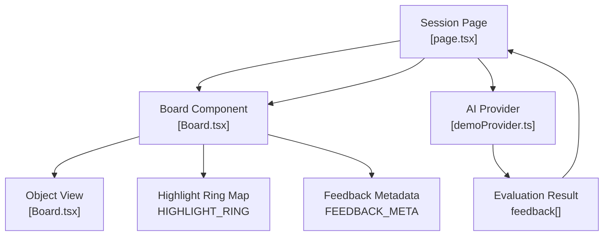
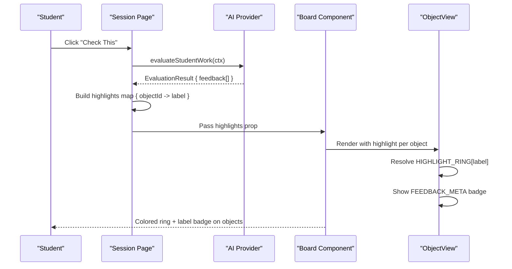
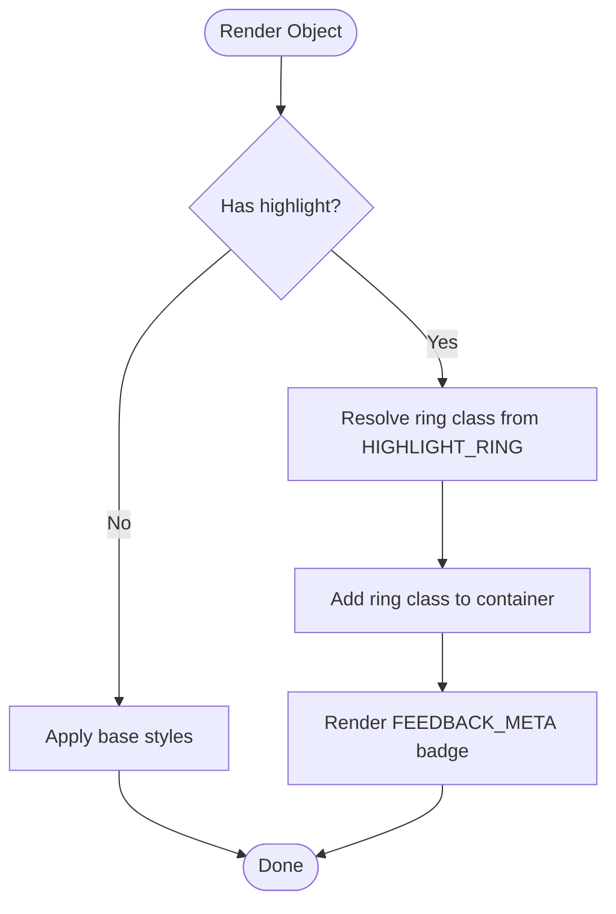
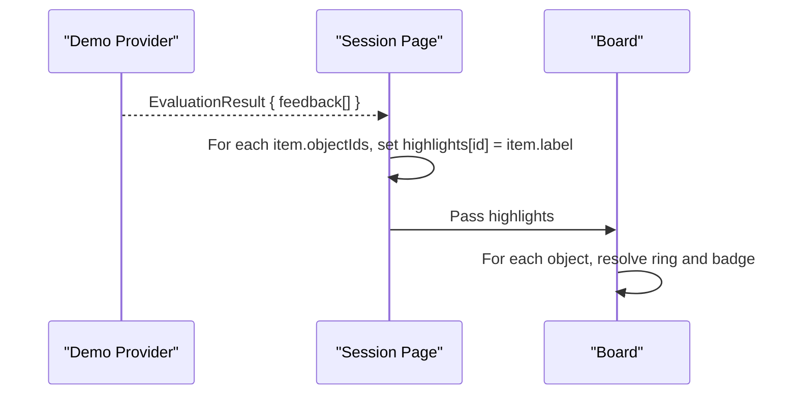
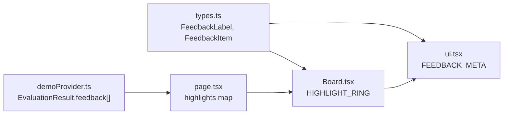

# Visual Feedback & Highlighting System

<cite>
**Referenced Files in This Document**
- [Board.tsx](file://app/components/board/Board.tsx)
- [ui.tsx](file://app/components/ui.tsx)
- [types.ts](file://app/lib/types.ts)
- [demoProvider.ts](file://app/lib/ai/demoProvider.ts)
- [page.tsx](file://app/app/session/[id]/page.tsx)
</cite>

## Table of Contents
1. [Introduction](#introduction)
2. [Project Structure](#project-structure)
3. [Core Components](#core-components)
4. [Architecture Overview](#architecture-overview)
5. [Detailed Component Analysis](#detailed-component-analysis)
6. [Dependency Analysis](#dependency-analysis)
7. [Performance Considerations](#performance-considerations)
8. [Troubleshooting Guide](#troubleshooting-guide)
9. [Conclusion](#conclusion)
10. [Appendices](#appendices)

## Introduction
This document explains the board’s visual feedback and highlighting system that provides immediate, accessible indicators for AI-generated feedback on student work. It covers:
- The seven feedback states used to communicate understanding quality and next steps
- The HIGHLIGHT_RING configuration that maps each state to a visible ring style
- How highlights are applied to board objects during rendering
- The FEEDBACK_META system that standardizes labels and icons for feedback types
- Examples for extending the system with custom feedback types, theme-aware styling, and animated transitions
- Accessibility considerations for color-blind users and screen reader compatibility

## Project Structure
The visual feedback system spans several files:
- Board component renders objects and applies highlight rings based on per-object feedback
- UI primitives define consistent metadata (icons and labels) for feedback types
- Types define the shared domain model including feedback labels and object structure
- Demo provider generates evaluation results and feedback items that drive highlights
- Session page orchestrates evaluation, updates highlights, and displays feedback text

**Diagram sources**
- [page.tsx:190-227](file://app/app/session/[id]/page.tsx#L190-L227)
- [Board.tsx:28-36](file://app/components/board/Board.tsx#L28-L36)
- [Board.tsx:408-539](file://app/components/board/Board.tsx#L408-L539)
- [ui.tsx:178-186](file://app/components/ui.tsx#L178-L186)
- [demoProvider.ts:205-402](file://app/lib/ai/demoProvider.ts#L205-L402)

**Section sources**
- [Board.tsx:1-540](file://app/components/board/Board.tsx#L1-L540)
- [ui.tsx:178-186](file://app/components/ui.tsx#L178-L186)
- [types.ts:64-78](file://app/lib/types.ts#L64-L78)
- [demoProvider.ts:205-402](file://app/lib/ai/demoProvider.ts#L205-L402)
- [page.tsx:190-227](file://app/app/session/[id]/page.tsx#L190-L227)

## Core Components
- Feedback states: CORRECT_UNDERSTANDING, PARTIALLY_CORRECT, MISSING_IDEA, CONCEPT_ERROR, THINK_ABOUT_THIS, CHECK_THIS_STEP, AI_UNCERTAIN
- HIGHLIGHT_RING: Maps each feedback state to Tailwind ring classes for visual emphasis
- ObjectView: Applies the appropriate ring class to each board object when highlighted
- FEEDBACK_META: Provides consistent icon and label for each feedback type across the UI
- Evaluation pipeline: AI provider returns feedback items; session page builds a highlights map and passes it to the Board

Key responsibilities:
- Board receives highlights as a mapping from object id to feedback label
- ObjectView resolves the ring class via HIGHLIGHT_RING and renders a small badge using FEEDBACK_META
- Session page calls the AI provider, aggregates feedback into highlights, and updates the Board props

**Section sources**
- [Board.tsx:28-36](file://app/components/board/Board.tsx#L28-L36)
- [Board.tsx:408-539](file://app/components/board/Board.tsx#L408-L539)
- [ui.tsx:178-186](file://app/components/ui.tsx#L178-L186)
- [types.ts:64-78](file://app/lib/types.ts#L64-L78)
- [demoProvider.ts:205-402](file://app/lib/ai/demoProvider.ts#L205-L402)
- [page.tsx:190-227](file://app/app/session/[id]/page.tsx#L190-L227)

## Architecture Overview
The feedback flow connects AI evaluation to visual indicators on the board:

**Diagram sources**
- [page.tsx:190-227](file://app/app/session/[id]/page.tsx#L190-L227)
- [demoProvider.ts:205-402](file://app/lib/ai/demoProvider.ts#L205-L402)
- [Board.tsx:408-539](file://app/components/board/Board.tsx#L408-L539)
- [ui.tsx:178-186](file://app/components/ui.tsx#L178-L186)

## Detailed Component Analysis

### Feedback States and Data Model
- FeedbackLabel is a union of seven string literals representing distinct feedback categories
- FeedbackItem ties a label to a title, message, and the set of board object ids it refers to
- EvaluationResult contains an array of FeedbackItem along with summary, errors, strengths, missing elements, and next action

These types ensure consistent labeling and clear linkage between feedback and specific board objects.

**Section sources**
- [types.ts:64-78](file://app/lib/types.ts#L64-L78)

### HIGHLIGHT_RING Configuration
- HIGHLIGHT_RING maps each FeedbackLabel to a Tailwind ring utility class
- Each mapping uses a thick ring width and a distinct color to visually differentiate feedback states
- The mapping is referenced by ObjectView to apply the correct ring class to highlighted objects

This design centralizes visual styles for feedback, making them easy to update or theme.

**Section sources**
- [Board.tsx:28-36](file://app/components/board/Board.tsx#L28-L36)

### Object Rendering and Highlight Application
- ObjectView computes a ring class from the highlight prop using HIGHLIGHT_RING
- If a highlight exists, a small badge is rendered showing the icon and label from FEEDBACK_META
- Selected objects receive an additional selection ring; AI-owned objects have a distinct background/border
- Drawing objects render differently but still support highlights via the same ring mechanism

This keeps the highlight system decoupled from object content while ensuring consistent visual treatment.

**Diagram sources**
- [Board.tsx:408-539](file://app/components/board/Board.tsx#L408-L539)
- [ui.tsx:178-186](file://app/components/ui.tsx#L178-L186)

**Section sources**
- [Board.tsx:408-539](file://app/components/board/Board.tsx#L408-L539)

### FEEDBACK_META System
- FEEDBACK_META defines a consistent icon and label for each feedback type
- Used both in the board badge and in the session panel feedback list
- Ensures that all parts of the UI present feedback with uniform semantics and visuals

This abstraction avoids hardcoding strings and icons at call sites, improving maintainability and consistency.

**Section sources**
- [ui.tsx:178-186](file://app/components/ui.tsx#L178-L186)
- [Board.tsx:524-528](file://app/components/board/Board.tsx#L524-L528)
- [page.tsx:500-514](file://app/app/session/[id]/page.tsx#L500-L514)

### AI Evaluation and Highlights Generation
- The demo provider evaluates student attempts and returns feedback items with labels and objectIds
- The session page aggregates these into a highlights map keyed by object id
- The Board receives this map and applies highlights to corresponding objects

This pipeline ensures that visual feedback aligns directly with AI analysis outcomes.

**Diagram sources**
- [demoProvider.ts:205-402](file://app/lib/ai/demoProvider.ts#L205-L402)
- [page.tsx:212-216](file://app/app/session/[id]/page.tsx#L212-L216)
- [Board.tsx:408-539](file://app/components/board/Board.tsx#L408-L539)

**Section sources**
- [demoProvider.ts:205-402](file://app/lib/ai/demoProvider.ts#L205-L402)
- [page.tsx:212-216](file://app/app/session/[id]/page.tsx#L212-L216)

### Implementation Examples

#### Adding a Custom Feedback Type
To add a new feedback state:
- Extend FeedbackLabel in the types file with the new literal
- Add a mapping in HIGHLIGHT_RING with a suitable ring class
- Add an entry in FEEDBACK_META with an icon and label
- Ensure the AI provider can emit the new label in feedback items

This approach keeps the system cohesive and prevents mismatches between data and visuals.

**Section sources**
- [types.ts:64-78](file://app/lib/types.ts#L64-L78)
- [Board.tsx:28-36](file://app/components/board/Board.tsx#L28-L36)
- [ui.tsx:178-186](file://app/components/ui.tsx#L178-L186)
- [demoProvider.ts:205-402](file://app/lib/ai/demoProvider.ts#L205-L402)

#### Styling Highlights for Different Themes
- HIGHLIGHT_RING uses Tailwind classes that adapt to light/dark themes automatically
- To customize per-theme colors, extend the mapping with theme-aware classes or use CSS variables
- Ensure contrast ratios meet accessibility guidelines in both themes

This allows consistent visual feedback across user preferences without changing logic.

**Section sources**
- [Board.tsx:28-36](file://app/components/board/Board.tsx#L28-L36)

#### Creating Animated Transitions for Feedback Changes
- Wrap highlighted objects with a transition-enabled container to animate ring changes
- Use CSS transitions on border/ring properties to smooth state changes
- Avoid animating layout-affecting properties to prevent jank

Animation should be subtle and informative, not distracting.

[No sources needed since this section provides general guidance]

### Accessibility Considerations
- Color alone is not sufficient: FEEDBACK_META includes icons alongside labels to aid color-blind users
- The board canvas has role="application" and aria-label for context
- Zoom controls include aria-labels for clarity
- Status indicators use role="status" and aria-live regions where appropriate
- Ensure high contrast for ring colors in both light and dark themes

These practices improve usability for assistive technologies and diverse visual needs.

**Section sources**
- [ui.tsx:178-186](file://app/components/ui.tsx#L178-L186)
- [Board.tsx:326-327](file://app/components/board/Board.tsx#L326-L327)
- [Board.tsx:375-399](file://app/components/board/Board.tsx#L375-L399)
- [page.tsx:333-335](file://app/app/session/[id]/page.tsx#L333-L335)

## Dependency Analysis
Highlights depend on a chain of modules:
- Session page depends on AI provider to produce feedback
- Board depends on HIGHLIGHT_RING and FEEDBACK_META for visuals
- Types unify feedback labels across components
- Demo provider produces concrete feedback items that drive highlights

**Diagram sources**
- [types.ts:64-78](file://app/lib/types.ts#L64-L78)
- [ui.tsx:178-186](file://app/components/ui.tsx#L178-L186)
- [Board.tsx:28-36](file://app/components/board/Board.tsx#L28-L36)
- [demoProvider.ts:205-402](file://app/lib/ai/demoProvider.ts#L205-L402)
- [page.tsx:212-216](file://app/app/session/[id]/page.tsx#L212-L216)

**Section sources**
- [types.ts:64-78](file://app/lib/types.ts#L64-L78)
- [ui.tsx:178-186](file://app/components/ui.tsx#L178-L186)
- [Board.tsx:28-36](file://app/components/board/Board.tsx#L28-L36)
- [demoProvider.ts:205-402](file://app/lib/ai/demoProvider.ts#L205-L402)
- [page.tsx:212-216](file://app/app/session/[id]/page.tsx#L212-L216)

## Performance Considerations
- Highlights are computed once per evaluation and passed down as a map; avoid recomputing frequently
- Keep HIGHLIGHT_RING static to minimize lookups
- Prefer lightweight ring classes over heavy shadows or complex transforms
- Debounce or throttle evaluations if multiple rapid checks occur

[No sources needed since this section provides general guidance]

## Troubleshooting Guide
Common issues and resolutions:
- No highlights appear: Verify that the session page builds a highlights map from evaluation feedback and passes it to Board
- Wrong ring color: Confirm HIGHLIGHT_RING contains the correct mapping for the feedback label
- Missing badge text: Ensure FEEDBACK_META has an entry for the feedback label
- Screen readers not announcing status: Check that status regions use role="status" and aria-live appropriately

**Section sources**
- [page.tsx:212-216](file://app/app/session/[id]/page.tsx#L212-L216)
- [Board.tsx:28-36](file://app/components/board/Board.tsx#L28-L36)
- [ui.tsx:178-186](file://app/components/ui.tsx#L178-L186)
- [page.tsx:333-335](file://app/app/session/[id]/page.tsx#L333-L335)

## Conclusion
The visual feedback and highlighting system integrates AI evaluation with clear, consistent, and accessible indicators on the board. By centralizing mappings in HIGHLIGHT_RING and FEEDBACK_META, the system remains extensible and theme-friendly. The architecture cleanly separates concerns: AI providers generate feedback, the session page aggregates highlights, and the Board renders them efficiently. With thoughtful animations and accessibility practices, students receive timely, understandable guidance that supports learning.

[No sources needed since this section summarizes without analyzing specific files]

## Appendices

### Feedback State Reference
- CORRECT_UNDERSTANDING: Indicates complete and accurate understanding
- PARTIALLY_CORRECT: Indicates partial correctness with room for improvement
- MISSING_IDEA: Indicates a key idea is absent from the response
- CONCEPT_ERROR: Indicates a conceptual misunderstanding
- THINK_ABOUT_THIS: Encourages deeper reflection or expansion
- CHECK_THIS_STEP: Signals the step needs review against instructions
- AI_UNCERTAIN: Indicates insufficient input to evaluate

**Section sources**
- [types.ts:64-78](file://app/lib/types.ts#L64-L78)
- [ui.tsx:178-186](file://app/components/ui.tsx#L178-L186)